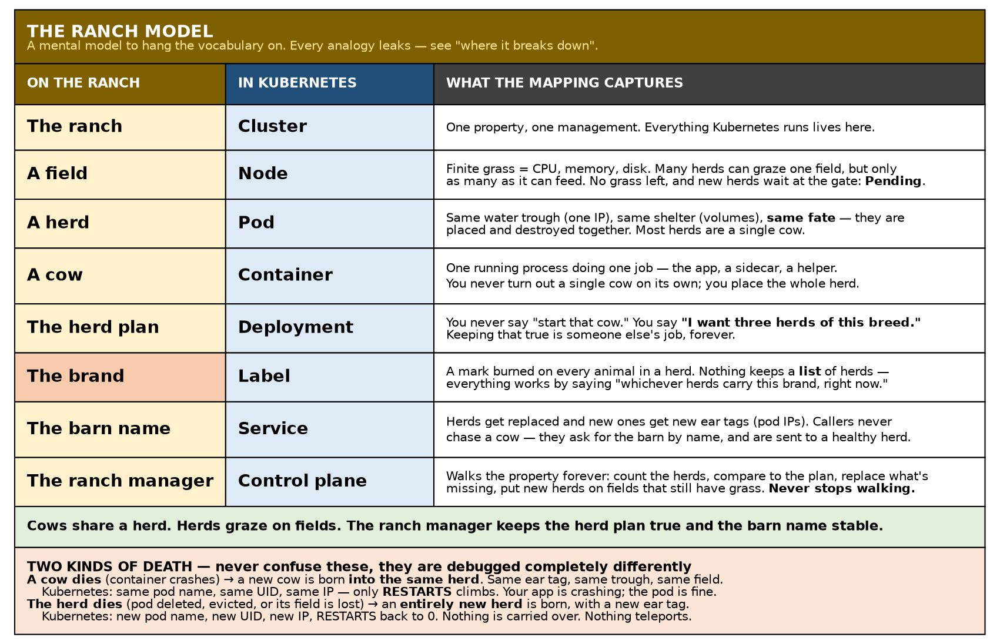
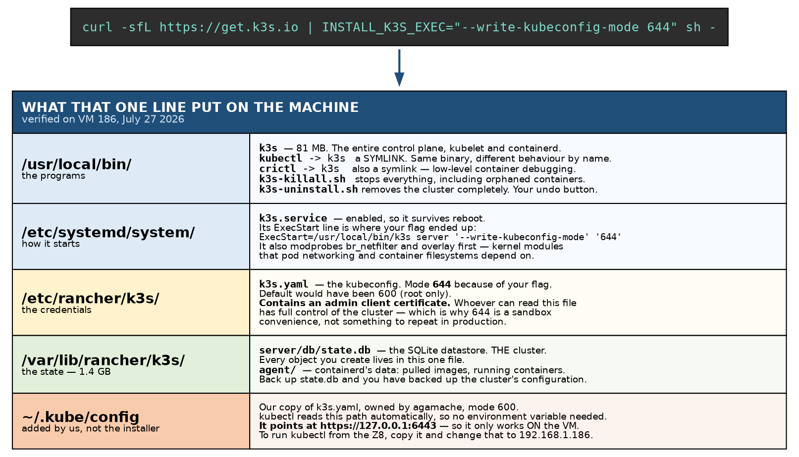
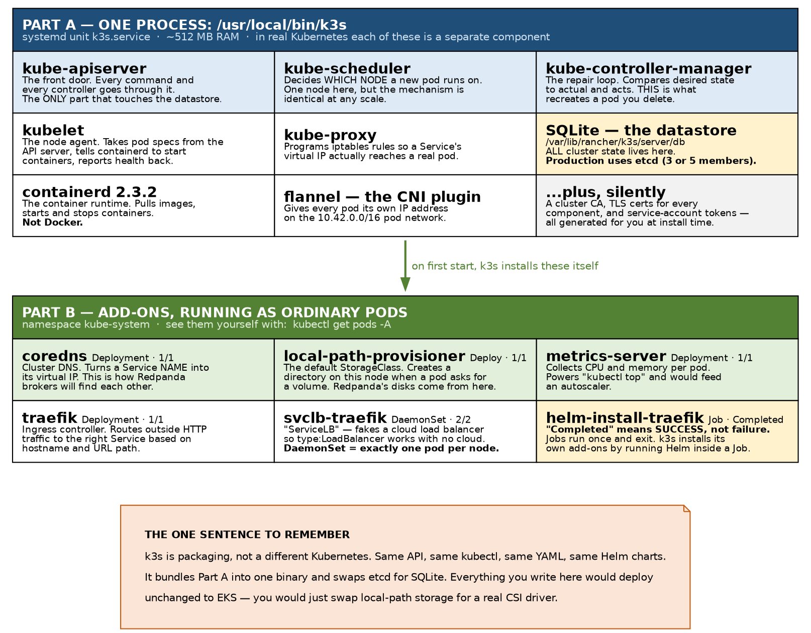
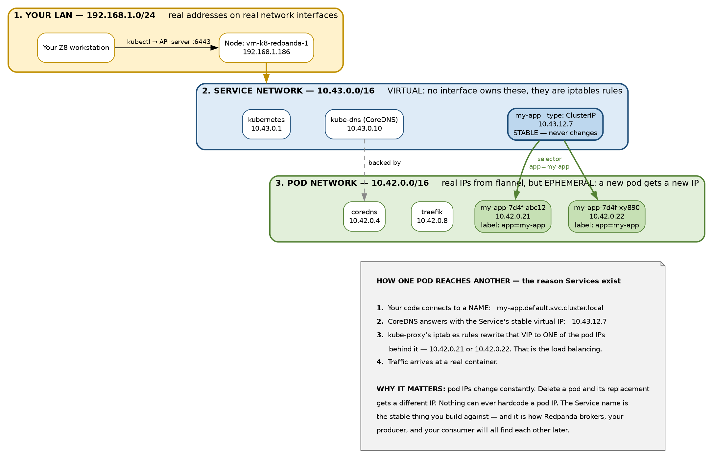

# Chapter 1 — Kubernetes, and the k3s Cluster We Just Built

> **Series:** Home-Lab Education · Phase 14 (Kubernetes + Redpanda)
> **Built and verified:** July 27, 2026 on VM 186 `vm-k8-redpanda-1` (192.168.1.186)
> **Versions at time of writing:** k3s v1.36.2+k3s1 · Kubernetes v1.36 · containerd 2.3.2 · Ubuntu 24.04.4 LTS
> **Read this before:** Chapter 2 (the object model), Chapter 3 (Redpanda)

---

## What this chapter covers

We installed a Kubernetes cluster with a single command. This chapter explains what that command
actually did, what is now running on the machine, and — most importantly — *why each piece exists*.

By the end you should be able to sketch the diagrams in this chapter from memory and explain them
out loud. That is the real test, not whether the pods are running.

---

## 1. The big picture — where Kubernetes sits

Before anything else, get the layering straight. People often confuse Kubernetes with a hypervisor
or with Docker. It is neither.


Read that from the bottom up:

Your **HP Z8** is the physical machine. **Proxmox** is the hypervisor — it carves the physical
machine into virtual machines. **VM 186** is one of those virtual machines, with 16 virtual CPUs
and 32 GB of RAM. Inside it runs **Ubuntu**, an ordinary Linux install. **k3s** runs on top of
Ubuntu as a normal system service. And your eventual workloads — Redpanda, OpenSearch, your Python
app — run as **containers**, managed by k3s.

So Kubernetes is not virtualising anything. Proxmox already did that. Kubernetes sits *inside* one
virtual machine and manages *containers* within it.

> **The distinction to have ready:** a hypervisor virtualises hardware and runs whole operating
> systems. Kubernetes orchestrates containers, which share the host's kernel. Different layer,
> different job.

---

## 2. What is Kubernetes actually for?

Here is the single idea that everything else hangs from:

> **You declare the state you want. Kubernetes continuously works to make reality match it.**

You do not say "start a container." You say "I want three copies of this container running, each
with 2 GB of memory, reachable at this name." Kubernetes then takes responsibility for making that
true — and for *keeping* it true. If a container crashes, it starts another. If a node dies, it
reschedules the work elsewhere.

That is called a **control loop** or **reconciliation loop**, and it runs forever. It is the reason
you will see a pod you deleted come back: you never told Kubernetes you wanted fewer copies, you
just destroyed one, and the loop faithfully repaired the damage.

Everything in the rest of this document is machinery in service of that one idea.

**Why a hedge fund cares:** market-data infrastructure cannot go down while someone SSHes in to
restart a process. Self-healing and declarative deployment are the point.

---

## 2a. The ranch — a mental model

Kubernetes vocabulary arrives all at once and every word sounds like every other word. Before the
real definitions, here is a picture to hang them on.



**The ranch is the cluster.** Everything Kubernetes manages lives on this one property.

**Cows are containers.** Each cow is one running process doing a job — the app, a sidecar, a helper.

**A herd is a pod.** Cows in a herd stay together: same water trough (one IP), same shelter
(volumes), same fate. You don't turn out a single cow alone if it belongs with its herd — you place
the whole herd. Worth knowing: **most herds are a single cow.** Multi-cow herds are the sidecar
pattern, and they're the exception, not the rule.

**A field is a node.** Fields have limited grass — CPU, memory, disk. Many herds can graze one
field, but only as many as the field can feed. No grass left, and new herds wait at the gate:
`Pending`.

**The herd plan is a Deployment.** You never say "start that cow." You say *"I want three herds of
this breed on the ranch."* Keeping that true is somebody else's permanent job.

**The brand is a label.** A mark burned on every animal in a herd. This is the piece that makes the
rest work: nothing in Kubernetes keeps a *list* of pods. Everything works by saying "whichever herds
carry this brand, right now." Herds come and go; the brand keeps matching.

**The ranch manager is the control plane.** It walks the property forever: count the herds, compare
to the plan, replace what's missing, put new herds on fields that still have grass. Two of those
jobs have names you'll meet in section 4 — deciding *which field* a new herd goes to is the
**scheduler**, and noticing a herd is missing and ordering a replacement is the
**controller-manager**.

**The barn name is a Service.** Herds get replaced and the new ones carry new ear tags (pod IPs).
Callers don't chase a cow — they ask for the barn by name, and get sent to whichever healthy herd is
available.

> **In one line:** cows share a herd; herds graze on fields; the ranch manager keeps the herd plan
> true and the barn name stable.

### Two kinds of death

This is where the analogy earns its keep, because these two events look similar and are debugged
completely differently.

**A cow dies — the herd survives.** A container inside the pod crashes. The rancher does not disband
the herd; a replacement cow is born straight into it. Same herd, same ear tag, same trough, same
field. Verified on this cluster with a container rigged to exit every twenty seconds:

```
demo2-8d894f964-4vv4m   uid 2125afc0-...   10.42.0.15   RESTARTS 0
demo2-8d894f964-4vv4m   uid 2125afc0-...   10.42.0.15   RESTARTS 1
demo2-8d894f964-4vv4m   uid 2125afc0-...   10.42.0.15   RESTARTS 2
```

Same pod name, same UID, same IP throughout — only `RESTARTS` climbs. The container ID changed each
cycle, so it genuinely was a new container every time. **The pod never died.**

**The herd dies — a new herd is born.** The pod is deleted, evicted, or the node it was on is lost.
Nothing is preserved:

```
demo-7c6d4f4799-m5hvt   uid 1fa44916-...   10.42.0.13    ← before
demo-7c6d4f4799-4gsfn   uid 9bf0944b-...   10.42.0.14    ← after
```

New name, new UID, new IP, restart counter back to zero. **Pods are never relocated, restored, or
resumed. They are replaced.** Nothing teleports.

**Why this matters in practice.** A climbing `RESTARTS` count means your *application* is crashing
while the pod is perfectly healthy — investigate with `kubectl logs <pod> --previous`, which shows
the output of the container that died. A *changing pod name* means something replaced the pod
entirely: an eviction, node pressure, or a rollout — investigate with `kubectl describe` and
`kubectl get events`. Confusing the two costs hours.

### Where the analogy breaks down

Every analogy leaks, and knowing exactly where yours leaks is what stops it producing a confidently
wrong answer under pressure.

- **Herds are never driven to another field.** A real rancher can walk cattle from one field to the
  next. Kubernetes cannot: a pod is never relocated. It is destroyed, and a *new* pod — new name,
  new ear tag — is created, possibly on a different node. Cattle get replaced, not moved.
- **Cattle are not actually reborn.** "A new cow is born into the herd" is doing some work above. In
  reality the container image is simply run again from scratch: a fresh, identical animal with no
  memory of the last one. Anything written inside the container's own filesystem is gone. Only a
  mounted volume survives.
- **Cows in a herd don't share a stomach.** Containers in a pod share a network address and can
  share volumes, but each has its own filesystem and its own processes. The sharing is narrower than
  "same herd" suggests.
- **The barn doesn't do the directing.** The manager keeps the barn's *sign* accurate, but the
  actual redirection of each caller happens automatically in the plumbing — iptables rules, not a
  person pointing. See section 5.
- **A trough can be dug into one specific field.** This is the storage limitation in section 6: with
  `local-path`, a herd's water exists only in the field where it was first dug. If that field is
  lost, the replacement herd isn't sent elsewhere — it waits at the gate forever, because the only
  field it's allowed to graze is gone.

---

## 3. What is k3s, and why did we use it?

**k3s is Kubernetes.** Not a clone, not a subset — it is a certified, fully conformant distribution.
Same API, same `kubectl`, same YAML files, same Helm charts. What differs is *packaging*.

Standard Kubernetes is roughly five separate server components plus an etcd cluster, and setting it
up properly is a day's work. k3s compiles those components into a **single 81 MB binary**, bundles
sensible defaults, and starts in about ten seconds.

For learning under a deadline that trade is obviously right: you spend your week on concepts rather
than on cluster bootstrapping. But **be ready to name what you gave up** — see section 8.

---

## 3a. The install command, piece by piece

This one line is the entire installation:

```bash
curl -sfL https://get.k3s.io | INSTALL_K3S_EXEC="--write-kubeconfig-mode 644" sh -
```

Every fragment earns its place:

| Fragment | What it does |
|---|---|
| `curl` | Fetch a URL over HTTP. |
| `-s` | **Silent.** Suppress the progress meter, which would otherwise be piped into the shell as garbage. |
| `-f` | **Fail on HTTP errors.** Without this, a 404 or a captive-portal page would be delivered as a *successful* download and then **executed as a shell script**. This flag is a safety measure, not cosmetics. |
| `-L` | **Follow redirects.** `get.k3s.io` redirects to the real script; without `-L` you'd download a short redirect notice and run that instead. |
| `https://get.k3s.io` | The official installer script — an ordinary shell script you can read in a browser. |
| <code>&#124;</code> | Pipe the downloaded text into the next command as its standard input. |
| `INSTALL_K3S_EXEC="..."` | An **environment variable** set for the `sh` process. The installer script reads it and appends the value to the k3s command line it writes into the systemd unit. |
| `--write-kubeconfig-mode 644` | The actual k3s option being passed through. See below. |
| `sh -` | Run a shell. The trailing `-` means **"read the program from standard input"** — which is where the pipe just put the script. |

### The three parts worth dwelling on

**Why `-f` matters.** The pattern `curl … | sh` executes whatever comes back from the network with
whatever privileges you have. If the download fails and you did not use `-f`, curl helpfully writes
the error page to stdout and the shell dutifully tries to execute an HTML document. It usually just
errors out — but it is exactly the class of accident that `-f` exists to prevent.

**How the environment variable reaches k3s.** `INSTALL_K3S_EXEC` is not a k3s flag; it is an
instruction *to the installer script*. You can verify precisely where it ended up:

```bash
grep -A6 ExecStart /etc/systemd/system/k3s.service
```

```
ExecStart=/usr/local/bin/k3s server '--write-kubeconfig-mode' '644'
```

So the variable was consumed at install time and **baked into the systemd unit**. To change it
later, edit that unit and `systemctl daemon-reload`, or re-run the installer.

**What `--write-kubeconfig-mode 644` actually buys.** k3s writes its kubeconfig to
`/etc/rancher/k3s/k3s.yaml`. By default that file is mode `600`, readable only by root, so every
`kubectl` command would need `sudo`. Mode `644` makes it world-readable so a normal user can use it.

That convenience has a real cost, and you should be able to say so: **that file contains an admin
client certificate.** Anyone who can read it has complete control of the cluster. On a single-user
sandbox that is an acceptable trade; on a shared or production machine it would not be. The stricter
alternative is to leave it at `600` and copy it to your home directory with `sudo`, which is close to
what we did anyway.

> **The professional caution to voice in an interview:** piping a remote script straight into a shell
> means trusting that host completely, at root. The careful version is
> `curl -sfL https://get.k3s.io -o install.sh`, read it, *then* run it. For a throwaway lab this
> is a reasonable risk; for a production build host it belongs in a pinned, checksummed artifact.

---

## 3b. What that one line left on the machine



Two details in there are worth calling out.

**`kubectl` is a symlink to `k3s`.** So is `crictl`. It is one binary that changes behaviour based
on the name it was invoked under — a classic Unix trick, and the reason you did not have to install
`kubectl` separately.

**`k3s-uninstall.sh` is your undo button.** Running it removes the cluster, the binary, the data
directory and the systemd unit. Combined with the Proxmox snapshot `s01-base-clean`, you have two
independent ways to get back to a clean machine, which is exactly the safety net that makes it
comfortable to break things deliberately.

---

## 3c. Making `kubectl` work without sudo

The installer sets up the cluster but not *your* access to it. That was three more commands:

```bash
mkdir -p ~/.kube
sudo cp /etc/rancher/k3s/k3s.yaml ~/.kube/config
sudo chown $(id -u):$(id -g) ~/.kube/config
chmod 600 ~/.kube/config
```

| Command | Why |
|---|---|
| `mkdir -p ~/.kube` | `kubectl` looks in `~/.kube/config` by default. `-p` means "create parents, and don't complain if it already exists." |
| `sudo cp …` | The source is owned by root, so copying needs `sudo`. Now you have your own copy, independent of the system file. |
| `sudo chown $(id -u):$(id -g)` | The copy arrived owned by **root**, so you still could not read it. This hands it to you. |
| `chmod 600` | Only you can read it. It holds admin credentials — treat it like a private key. |

**A small correctness note.** You will often see `sudo chown $USER ~/.kube/config` written instead.
That sets the owning *user* but leaves the *group* as root, and it breaks entirely if `$USER` happens
to be unset — which it can be in a non-interactive SSH command or a cron job. Using
`$(id -u):$(id -g)` sets both, numerically, and always works. Minor, but it is the kind of detail
that quietly costs you an hour someday.

**One limitation to know now, before it confuses you later.** That kubeconfig contains:

```
server: https://127.0.0.1:6443
```

It points at *localhost*, so it only works **while you are on VM 186**. To run `kubectl` from your Z8
workstation, copy the file over and change that address to `https://192.168.1.186:6443`.

---

## 3d. Confirming it worked

Two commands, which are also the two you will reach for constantly:

```bash
kubectl get nodes -o wide     # is the cluster's machine registered and Ready?
kubectl get pods -A           # what is actually running, in every namespace?
```

The first should show one node, `Ready`, with role `control-plane`. The second is the more
interesting one, and section 4 is devoted to explaining what it shows you.

Do not skip past `kubectl get pods -A` as noise. Everything listed there was installed on your
behalf, and being able to say why each item exists is the difference between having run an installer
and understanding a cluster.

---

## 4. What is now running on the machine

This is the diagram worth memorising.



The install produced **two distinct categories of components** (Parts A and B in the illustration
above), and keeping them straight is what makes `kubectl get pods -A` stop looking like noise. Some
of what k3s installed runs *inside the single k3s process*; the rest runs *as ordinary pods* you can
list, inspect, and delete.

### Part A — the control plane, inside one process

These are not pods. You will never see them in `kubectl get pods`. They are all threads inside the
single `k3s` process, managed by systemd as `k3s.service`:

- **kube-apiserver** — the front door. Every `kubectl` command, every internal controller, every
  component talks to this and nothing else. It is also the only component permitted to touch the
  datastore. That centralisation is deliberate: one place to authenticate, authorise, and validate.
- **kube-scheduler** — when a pod exists but has not been assigned to a node, the scheduler picks
  one, based on resource requests, taints, and affinity rules. On our single-node cluster the answer
  is always "this node," but the mechanism is identical on a 500-node cluster.
- **kube-controller-manager** — the reconciliation loops from section 2 live here. This is the
  component that notices a Deployment wants 3 pods but only 2 exist, and creates the third.
- **kubelet** — the agent that runs *on each node*. It receives pod specifications and instructs the
  container runtime to make them real, then reports health back.
- **kube-proxy** — maintains the iptables rules that make Service virtual IPs work (section 5).
- **SQLite** — where all cluster state is persisted, at `/var/lib/rancher/k3s/server/db`.

Total memory for all of that: about **512 MB**.

### Part B — the add-ons, running as ordinary pods

These *are* pods, in the `kube-system` namespace, and you can inspect them like anything else:

- **coredns** — cluster DNS. Absolutely central; section 5 explains why.
- **local-path-provisioner** — the default storage system. Section 6.
- **metrics-server** — collects CPU and memory per pod so `kubectl top` works.
- **traefik** — an ingress controller, for routing external HTTP traffic to Services by hostname.
- **svclb-traefik** — "ServiceLB," k3s's substitute for a cloud load balancer. Note it is a
  **DaemonSet**, meaning exactly one copy per node, automatically. Fluent Bit will use the same
  pattern later for log collection.
- **helm-install-traefik** — a **Job**, showing status `Completed`. See section 7.

---

## 5. The three networks

If you understand only one technical thing from this chapter, make it this one. It explains
Services, which are the backbone of everything you will build in later chapters.



There are three separate address ranges in play, and they behave very differently.

**Your LAN, 192.168.1.0/24.** Ordinary addresses on real network interfaces. The VM sits at
`192.168.1.186`.

**The pod network, 10.42.0.0/16.** Every pod gets its own IP here, assigned by flannel. These are
real, routable-within-the-cluster addresses — but they are **ephemeral**. Delete a pod and its
replacement gets a different one. Nothing may ever depend on a specific pod IP.

**The service network, 10.43.0.0/16.** These addresses are **entirely virtual**. No network
interface anywhere owns `10.43.12.7`. It exists only as a set of iptables rules that kube-proxy
maintains. When traffic is sent to it, the kernel rewrites the destination to one of the real pod
IPs behind it.

### How a connection actually works

1. Your code connects to a **name**: `my-app.default.svc.cluster.local`.
2. **CoreDNS** resolves that name to the Service's stable virtual IP, `10.43.12.7`.
3. **kube-proxy's iptables rules** rewrite the destination to one of the pods behind the Service —
   picked from the pods whose labels match the Service's **selector**. This is the load balancing.
4. Traffic arrives at a real container.

The binding in step 3 is worth dwelling on. A Service does not contain pods and does not know their
names. It holds a **label selector** such as `app=my-app`, and its membership is simply "whichever
pods currently carry that label." Pods appear and disappear; the selector keeps matching. That loose
coupling via labels is one of Kubernetes' central design decisions.

> **The one-liner:** pod IPs are cattle, Service names are the stable address you build against.

---

## 6. Storage — and an honest limitation

k3s gave us one StorageClass, and it is the default:

```
NAME                   PROVISIONER             RECLAIMPOLICY   VOLUMEBINDINGMODE      ALLOWVOLUMEEXPANSION
local-path (default)   rancher.io/local-path   Delete          WaitForFirstConsumer   false
```

Each field matters, and Redpanda will depend on all of them in Chapter 3:

- **`local-path` provisioner** — when a pod requests storage, this creates a plain directory on the
  node's disk. Simple and fast, but the data is tied to *that specific node*.
- **`WaitForFirstConsumer`** — the volume is not created until a pod has actually been scheduled.
  It has to work this way: because storage is node-local, Kubernetes must know which node before it
  can create anything.
- **`Delete`** — deleting the claim deletes the data. There is no safety net.
- **`ALLOWVOLUMEEXPANSION false`** — you cannot grow a volume later. Sizing a Redpanda broker's disk
  is a decision you live with.

**The honest framing for an interview:** node-local storage means a pod cannot move to another node
and keep its data. In production you would use a CSI driver backed by networked storage (EBS, Ceph,
a SAN) so that a rescheduled pod reattaches its volume anywhere in the cluster. Knowing *why* your
sandbox is different from production is a much stronger signal than not having noticed.

---

## 7. Things that look broken but are not

Two of these already bit us during the install, and both are common interview stumbles.

**`Completed` is not a failure.** The `helm-install-traefik` pod shows `0/1  Completed`. A **Job** is
a workload designed to run once and exit; when it finishes successfully it stops, and `0/1` simply
means no container is running *now*. k3s installs its own bundled add-ons by running Helm inside a
Job. If it had failed you would see `Error` or `CrashLoopBackOff`.

**A pod that never becomes `Ready` may be correct.** During the install I ran
`kubectl wait --for=condition=Ready pods --all`, and it reported a timeout. The cluster was fine —
Job pods never reach `Ready`, because `Ready` means "able to serve traffic," which a finished batch
task never will be. The command was wrong, not the cluster.

**`RESTARTS 2` is not automatically alarming.** During bootstrap the Traefik install Job retried
while waiting on its CRDs to be registered. Restarts during startup ordering are normal; restarts
that keep climbing are not.

---

## 8. Where k3s differs from production Kubernetes

Expect to be asked. This is the table to have cold.

| Aspect | k3s (what you built) | kubeadm / EKS / production |
|---|---|---|
| Datastore | SQLite, single file | etcd, typically 3 or 5 members |
| Control plane | One binary, one process | Separate components, usually static pods |
| High availability | None here — one node | Multiple control-plane nodes |
| Ingress | Traefik, bundled | nginx-ingress, or a cloud load balancer |
| `type: LoadBalancer` | ServiceLB fakes it | Real cloud provider integration |
| Storage | `local-path`, node-local | CSI driver, networked, node-independent |
| Nodes | 1 (control plane also runs workloads) | Many; control plane tainted and separate |

**The answer to give:** *"k3s is conformant Kubernetes packaged as a single binary for edge and
single-node use. I chose it to learn the concepts quickly. The manifests I wrote would deploy to EKS
unchanged — I'd swap local-path for a CSI storage class and use a real ingress controller."*

---

## 9. Commands to know by heart

```bash
kubectl get nodes -o wide            # the cluster's machines
kubectl get pods -A                  # everything running, all namespaces
kubectl get pods -n kube-system      # just the system add-ons
kubectl describe pod <name>          # events + why something isn't starting  ← most useful debug command
kubectl logs <pod>                   # stdout of the container
kubectl logs <pod> -f                # follow, like tail -f
kubectl exec -it <pod> -- /bin/sh    # shell inside a running container
kubectl get storageclass             # what storage is available
kubectl get svc -A                   # every Service and its virtual IP
kubectl api-resources                # every object type the cluster understands
```

When something is broken, `kubectl describe` first — the **Events** section at the bottom is usually
the answer. `kubectl logs` only helps once the container has actually started.

Convenience already set up in your `~/.bashrc` on VM 186: `k` is an alias for `kubectl`, and tab
completion works on both.

---

## 10. Glossary for this chapter

| Term | Meaning |
|---|---|
| **Node** | A machine in the cluster. Here, exactly one: the VM itself. |
| **Pod** | The smallest deployable unit — one or more containers sharing an IP and storage. |
| **Namespace** | A folder for organising objects. `kube-system` holds cluster infrastructure. |
| **Control plane** | The components that make decisions: API server, scheduler, controllers. |
| **Datastore** | Where cluster state persists. SQLite here, etcd in production. |
| **CNI** | Container Network Interface — the plugin giving pods IPs. Here, flannel. |
| **CRI** | Container Runtime Interface — how the kubelet talks to containerd. |
| **Service** | A stable virtual IP and DNS name in front of a changing set of pods. |
| **Selector** | The label query that decides which pods a Service (or controller) manages. |
| **StorageClass** | A named recipe for provisioning storage on demand. |
| **DaemonSet** | A controller that runs exactly one pod per node. |
| **Job** | A workload that runs to completion once, then stops. |
| **Ingress** | HTTP routing from outside the cluster to Services inside it. |
| **kubeconfig** | The file holding the API address and your credentials. |

---

## 11. Check yourself

Answer out loud, in full sentences, before looking anything up. If you can't, re-read the section in
brackets.

1. What is the difference between what Proxmox does and what Kubernetes does? [§1]
2. Explain "declarative desired state" without using the word "declarative." [§2]
3. You delete a pod and it comes back. Which component recreated it, and why? [§2, §4]
4. A pod shows `RESTARTS 7`, but the same name and IP it had an hour ago. What happened, what did
   *not* happen, and which command shows you why? [§2a]
5. A pod you were watching now has a different name. Is that the same event as question 4? What is
   different about what survived? [§2a]
6. Why is "the pod moved to another node" always wrong, no matter what happened? [§2a]
7. Is k3s a different Kubernetes? What would you have to change to move your work to EKS? [§3, §8]
8. In `curl -sfL … | sh -`, what does `-f` do, and why does it matter more than usual when the
   output is being piped into a shell? [§3a]
9. What does the trailing `-` in `sh -` mean? [§3a]
10. `INSTALL_K3S_EXEC` is not a k3s flag. Where did its value actually end up, and what command
    would you run to prove it? [§3a]
11. What is the security cost of `--write-kubeconfig-mode 644`, and when would it be unacceptable? [§3a]
12. Why did we have to run `chown` after `cp`? What is subtly wrong with `chown $USER`? [§3c]
13. You copy `~/.kube/config` to your Z8 and `kubectl` hangs. What's wrong, and what's the fix? [§3c]
14. Name three things in the k3s binary that would be separate components in a normal cluster. [§4]
15. Why can `kubectl get pods` never show you the API server? [§4]
16. A pod shows `Completed`. Is that good or bad? Why? [§7]
17. What are the three IP ranges on this box, and which one is fake? [§5]
18. Walk through, step by step, what happens when one pod connects to `my-app` by name. [§5]
19. A Service has no list of pods in it. So how does it know where to send traffic? [§5]
20. Why does `local-path` use `WaitForFirstConsumer` instead of creating volumes immediately? [§6]
21. Your Redpanda broker's disk fills up. Why is that a bigger problem here than in production? [§6]
22. What single command do you run first when a pod won't start? [§9]

---

## What's next

**Chapter 2 — the object model.** We stop reading and start building: write a Deployment by hand,
scale it, delete a pod and watch it heal, then put a Service in front of it and prove the label
selector works. That chapter turns section 5 from a diagram into something you have felt.

---

*Diagrams are generated from Graphviz sources in `education/diagrams/`. To change one, edit the*
*`.dot` file and re-run:* `dot -Tpng -Gdpi=150 <file>.dot -o ../images/<file>.png`
