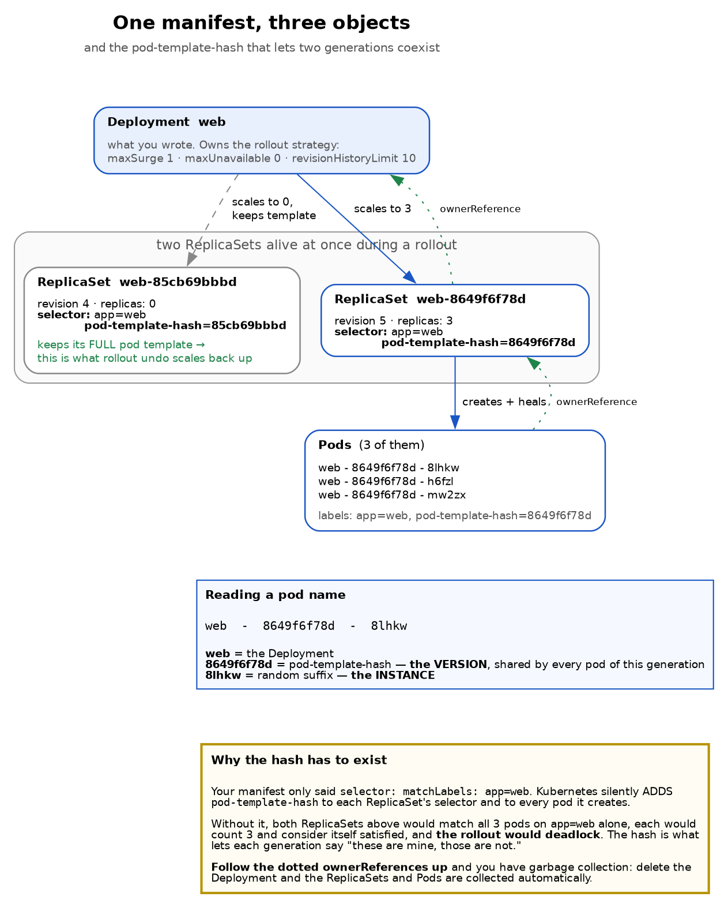
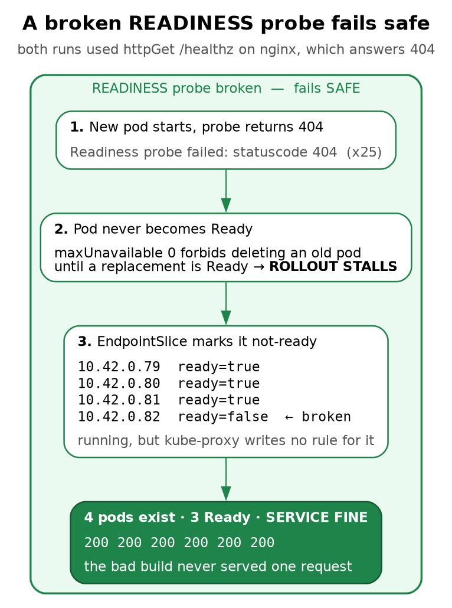
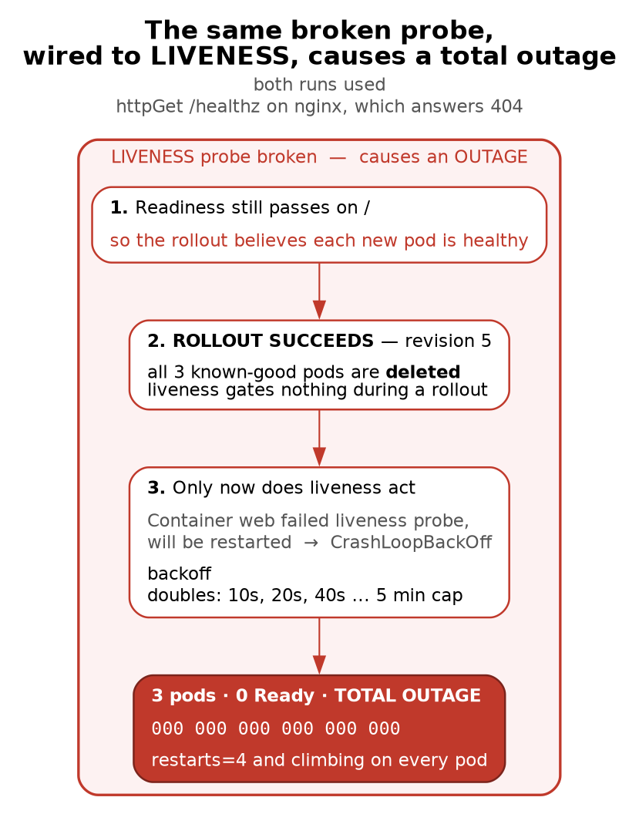

# Chapter 2 — The Object Model: Deployments, Rollouts, and the Two Probes

> **Who this chapter is written for.** Andrew is interviewing for an **SRE / DevOps** role on an
> **order management system**. So this chapter is not "how to write a Deployment." It is about what
> happens when you ship a bad build at 3am: what stops, what keeps serving, what lies to you, and
> which reflex turns a stalled deploy into an outage.

---

## Verified facts header

Everything here was run on **`vm-k8-redpanda-1` (192.168.1.186)**, single-node k3s v1.36.2, on
**27 July 2026** — the object-model session in the morning and the probe/rollout session at
15:05–15:30. Every command was executed and every output quoted is real.

| Thing | Value as tested |
|---|---|
| Image | `nginx:1.27-alpine` (pre-cached, so pods start in ~1 s) |
| Namespace | `default` (Redpanda was never touched) |
| Strategy | `RollingUpdate`, `maxSurge: 1`, `maxUnavailable: 0` |
| Revisions produced | 5, across 4 ReplicaSets |
| Manifest | [`manifests/web-deployment.yaml`](manifests/web-deployment.yaml) |

---

## What this chapter covers

1. One manifest, three objects — and the ownership chain
2. The `pod-template-hash`, and why rolling updates would deadlock without it
3. Labels are per-object (a trap that cost us ten minutes)
4. Imperative vs declarative drift — the best argument for GitOps you will ever run
5. Rolling updates: what `maxSurge` and `maxUnavailable` actually do
6. **Readiness probes — the gate that saves you**
7. **Liveness probes — the one that causes outages**
8. Rollback, revision renumbering, and the landmine `rollout undo` leaves behind
9. Does a rolling update protect quorum? (No. This matters for Redpanda.)
10. **Requests, limits, the three QoS classes, and OOMKilled**
11. Production gap, commands, glossary, self-test

---

## 1. One manifest, three objects



> **Why the hash has to exist**
>
> Your manifest only said `selector: matchLabels: app=web`. Kubernetes silently ADDS `pod-template-hash` to each ReplicaSet's selector and to every pod it creates. Without it, both ReplicaSets above would match all 3 pods on `app=web` alone, each would count 3 and consider itself satisfied, and **the rollout would deadlock**. The hash is what lets each generation say "these are mine, those are not." **Follow the dotted ownerReferences up** and you have garbage collection: delete the Deployment and the ReplicaSets and Pods are collected automatically.

You apply one YAML file and get **three** API objects, each with a different job:

| Object | Responsibility |
|---|---|
| **Deployment** | *How to change.* Owns the rollout strategy and the revision history. |
| **ReplicaSet** | *How many.* Keeps exactly N pods of **one specific template** alive. |
| **Pod** | *The thing that runs.* Holds one or more containers. |

A container is a fourth thing, but it is **not an API object** — you cannot `kubectl get containers`.
It exists only as a field inside a pod spec.

The split exists because "keep 3 copies alive" and "replace v1 with v2 safely" are different
problems. A ReplicaSet solves the first and is deliberately stupid about versions. The Deployment
solves the second by **creating a second ReplicaSet** and shifting replicas between them.

### The ownership chain

```bash
kubectl get pods -l app=web -o jsonpath='{range .items[*]}{.metadata.name} {.metadata.ownerReferences[0].kind}/{.metadata.ownerReferences[0].name}{"\n"}{end}'
```

```
web-dbb6fffff-4wfdz   ReplicaSet/web-dbb6fffff
web-dbb6fffff-58snx   ReplicaSet/web-dbb6fffff
web-dbb6fffff-6t9hj   ReplicaSet/web-dbb6fffff
```

and the ReplicaSet in turn is owned by `Deployment/web`. Those `ownerReferences` are what make
`kubectl delete deploy web` clean everything up — the garbage collector walks the chain downward.
It is also why deleting a *pod* achieves nothing permanent: its owner immediately notices the
shortfall and makes another. We proved that in Chapter 1 by deleting coredns.

---

## 2. The `pod-template-hash`

This is the mechanism that makes everything else in the chapter possible, and it is invisible in
your manifest.

```bash
kubectl get rs -l app=web -o jsonpath='{.items[0].metadata.labels.pod-template-hash}'
```

```
dbb6fffff
```

Kubernetes hashes your **pod template**, then [stamps the result as a **real label** on the
ReplicaSet, on every pod it creates, and — critically — **into the ReplicaSet's own selector**.]{custom-style="Key"}

Your manifest said:

```yaml
selector:
  matchLabels:
    app: web
```

The live ReplicaSet is actually selecting on `app=web` **AND** `pod-template-hash=dbb6fffff`.

> **Why it must exist.** During a rollout two ReplicaSets are alive at once, both matching
> `app=web`. [Without the hash, each would look at all the pods, count enough, decide it was
> satisfied, and do nothing. **The rollout would deadlock.**]{custom-style="Key"} The hash is what lets each generation
> distinguish "my pods" from "the other generation's pods."

### Reading a pod name

```
web  -  8649f6f78d  -  8lhkw
 │          │              └── random suffix  = this INSTANCE
 │          └───────────────── pod-template-hash = this VERSION
 └──────────────────────────── the Deployment
```

The hash does not distinguish instances — it **groups** them. All pods of one generation share it.

[**Change the template, get a new hash, get a new ReplicaSet.**]{custom-style="Key"} That is the entire trigger condition
for a rollout, and §5 shows what does *not* trigger one.

---

## 3. Labels are per-object

A trap worth writing down because it wasted real time.

The first manifest put labels only in `spec.template`. Then:

```bash
kubectl get deploy,rs,pods -l app=web     # returned the pods, but NOT the Deployment
```

[`spec.template.metadata.labels` describes the **pods the Deployment will create**. It says nothing
about the Deployment object itself]{custom-style="Key"}, which had no labels at all and therefore matched no selector.

Real manifests repeat them in both places:

```yaml
metadata:
  name: web
  labels:
    app: web          # ← labels the Deployment object
spec:
  selector:
    matchLabels:
      app: web        # ← how the Deployment finds its pods
  template:
    metadata:
      labels:
        app: web      # ← labels each pod
```

Three separate places, three separate meanings. With that fixed, `-l app=web` matched all three
object types:

```
deployment.apps/web    3/3   3   3    9s
replicaset.apps/web-dbb6fffff   3   3   3   9s
pod/web-dbb6fffff-4wfdz   1/1   Running   0   9s
```

---

## 4. Imperative vs declarative drift

Two experiments, both of which end the same way.

**Scaling by hand:**

```bash
kubectl scale deploy web --replicas=3
kubectl apply -f web.yaml          # file still says replicas: 1
```

The Deployment snapped straight back to 1. [`apply` does not merge your intent with the cluster's
current state — the file wins.]{custom-style="Key"}

Also worth noting: [**scaling does not create a new ReplicaSet.** The pod template is unchanged, so
the hash is unchanged]{custom-style="Key"}, so there is no new revision. Only template changes make revisions.

**And the dangerous version — `rollout undo`:** covered in §8. It changes the cluster and tells
nothing else, which is how a rollback gets silently re-broken by the next deploy.

> **The rule:** [anything you do imperatively is a change your Git repository does not know about,
> and the next `apply` will overwrite it.]{custom-style="Key"} Imperative commands are for **diagnosis and emergencies**.
> The fix always goes in the file.

---

## 5. Rolling updates: `maxSurge` and `maxUnavailable`

We set these explicitly rather than taking the defaults (`25%` each):

```yaml
strategy:
  type: RollingUpdate
  rollingUpdate:
    maxSurge: 1          # at most 1 EXTRA pod above the desired count
    maxUnavailable: 0    # never drop below the desired count
```

Read as a pair, they define a window: with `replicas: 3` you may have 3 or 4 pods, and at least 3
must be available. [So the controller must **add before it removes**. For anything serving orders,
`maxUnavailable: 0` is the setting you want — capacity never dips.]{custom-style="Key"}

The progression is visible in `rollout status`:

```
Waiting for deployment "web" rollout to finish: 0 out of 3 new replicas have been updated...
Waiting for deployment "web" rollout to finish: 1 out of 3 new replicas have been updated...
Waiting for deployment "web" rollout to finish: 2 out of 3 new replicas have been updated...
Waiting for deployment "web" rollout to finish: 1 old replicas are pending termination...
deployment "web" successfully rolled out
```

One new pod, wait for Ready, delete one old pod, repeat.

**The trade-off:** `maxUnavailable: 0` requires spare capacity to surge into, and it makes rollouts
slower — strictly serialised. `maxUnavailable: 1, maxSurge: 0` is the opposite choice: no extra
capacity needed, but you run degraded during the deploy. Neither is universally right, and being
able to explain the trade-off is the interview answer.

### What does *not* trigger a rollout

Re-applying a file whose **pod template** is byte-identical to what is running:

```
deployment.apps/web configured
```

...and yet nothing rolled. Same ReplicaSets, same pod ages, no new revision. Only the
`last-applied-configuration` annotation changed.

> [**"configured" does not mean "rolled out."** Only pod-template changes cause pod churn.]{custom-style="Key"} Change a
> Deployment label or fix an annotation and `apply` reports `configured` while your pods sit
> undisturbed. People see that word and assume they caused a restart.

---

## 6. Readiness probes — the gate





> **The asymmetry, and the rules that follow from it**
>
> [**Readiness gates the rollout. Liveness does not.** A bad readiness probe stops the deploy and protects you. A bad liveness probe ships cleanly, destroys the good pods, and only then starts killing.]{custom-style="Key"}
>
> **Debugging heuristic:** CrashLoopBackOff with `Exit Code: 0` means something EXTERNAL killed the container — nearly always the liveness probe. A real app crash gives a non-zero code or a signal.
>
> **Never let a liveness probe check a dependency.** If it returns unhealthy because the database is down, Kubernetes kills every replica at once and the restart storm hammers the recovering database. Dependency health belongs in READINESS, which only removes you from the load balancer.
>
> **Slow starters need a startupProbe**, or liveness kills the app before it finishes booting.

Without a probe, Kubernetes calls a pod Ready as soon as the container process starts. For most
real applications that is a lie — a JVM or a Python service accepts a TCP connection long before it
can answer a request.

```yaml
readinessProbe:
  httpGet:
    path: /
    port: 80
  initialDelaySeconds: 2
  periodSeconds: 2
```

### Breaking it on purpose

We pointed the probe at `/healthz`, which nginx answers with a 404. An `httpGet` probe counts only
**200–399** as success, so the pod could never become Ready.

```
Readiness probe failed: HTTP probe failed with statuscode: 404   (x25 over 2m31s)
```

The result, exactly as the arithmetic predicts:

```
NAME                   READY   STATUS    RESTARTS   AGE
web-749d9d4b8-q4294    0/1     Running   0          77s      ← the new, broken pod
web-85cb69bbbd-h2fzc   1/1     Running   0          6m17s
web-85cb69bbbd-rfjgr   1/1     Running   0          6m23s
web-85cb69bbbd-vm2lj   1/1     Running   0          6m20s

NAME             DESIRED   CURRENT   READY   AGE
web-749d9d4b8    1         1         0       78s      ← wants 1, has 1, READY 0
web-85cb69bbbd   3         3         3       6m23s
```

`maxSurge: 1` **permitted** the 4th pod. `maxUnavailable: 0` **forbade** deleting any of the 3 good
ones until a replacement went Ready. It never did. **The rollout parked itself and stopped.**

### The EndpointSlice is where you see it working

```bash
kubectl get endpointslices -l kubernetes.io/service-name=web \
  -o jsonpath='{range .items[*].endpoints[*]}{.addresses[0]} ready={.conditions.ready}{"\n"}{end}'
```

```
10.42.0.79  ready=true
10.42.0.80  ready=true
10.42.0.81  ready=true
10.42.0.82  ready=false      ← the broken pod
```

Same mechanism as Chapter 1 §5, now doing its real job. [The broken pod **is** in the slice but
flagged not-ready, so kube-proxy writes no iptables rule for it.]{custom-style="Key"} It runs, consumes memory, and
receives nothing:

```
200 200 200 200 200 200
```

[**You shipped a broken build to production and not one user request touched it.**]{custom-style="Key"}

### Two status conditions that disagree, deliberately

```
Available=True     MinimumReplicasAvailable
Progressing=True   ReplicaSetUpdated
```

`Available=True` **while the deploy is broken**, because three pods are serving. [Availability
answers "is the service up," not "did my deployment work."]{custom-style="Key"} Monitor both; they are different
questions.

### The timeout that does nothing

`kubectl rollout status --timeout=60s` failed after 60 seconds. [That is **client-side impatience
only** — it killed your `kubectl`, not the rollout]{custom-style="Key"}:

```
progressDeadlineSeconds=600      # 10 minutes before the Deployment gives up... on reporting
new RS age: 2m54s                # still going
```

**And `progressDeadlineSeconds` does less than its name suggests.** It is easy to read it as "the
Deployment stops after ten minutes." It does not stop. When the deadline passes with no progress,
the controller sets a **status condition** — `Progressing=False` with reason
`ProgressDeadlineExceeded` — and then carries on trying forever. Nothing is rolled back, nothing is
paused, no pod is deleted. [It is a flag for you and your monitoring to read, not a circuit breaker]{custom-style="Key"}:

```bash
kubectl get deploy web -o jsonpath='{.status.conditions[?(@.type=="Progressing")].reason}'
# ProgressDeadlineExceeded
```

That condition is what `kubectl rollout status` watches for to decide a rollout has failed, which
is why the distinction is easy to miss — the tooling behaves as if something happened, while in the
cluster nothing did.

> **Operational consequence:** a CI job that times out and exits red leaves a half-rolled deployment
> still grinding in the cluster. The pipeline says "failed," everyone assumes nothing shipped, and a
> surge pod sits there. If you want it *stopped*, say so: `kubectl rollout undo` or
> `kubectl rollout pause`. Automatic rollback is not a Deployment feature — if you want it, it
> belongs in your deployment tooling, and it must key off that condition.

---

## 7. Liveness probes — the dangerous one

Same broken path, wired as **liveness** instead, with readiness left working:

```yaml
livenessProbe:
  httpGet:
    path: /healthz     # still 404
    port: 80
  initialDelaySeconds: 3
  periodSeconds: 3
  failureThreshold: 2
```

**The rollout succeeded.** Revision 5 went out cleanly, all three known-good pods were deleted, and
only then did the killing start:

```
NAME                   READY   STATUS             RESTARTS      AGE
web-8649f6f78d-8lhkw   0/1     CrashLoopBackOff   4 (19s ago)   100s
web-8649f6f78d-h6fzl   0/1     CrashLoopBackOff   4 (49s ago)   106s
web-8649f6f78d-mw2zx   0/1     CrashLoopBackOff   4 (46s ago)   103s

000 000 000 000 000 000
```

Total outage.

### Why the difference

> **Readiness gates the rollout. Liveness does not.**

Readiness is consulted *before* a pod is allowed to count as available, so a failure stops the
deploy. Liveness only acts on an already-running pod. The Deployment controller saw readiness pass,
declared each new pod healthy, deleted an old one, and moved on — completely unaware that a liveness
probe was about to start killing them. By the time it did, the good pods were gone.

| | Broken **readiness** | Broken **liveness** |
|---|---|---|
| Rollout | **stalls** at 4 pods | **succeeds** |
| Good pods | kept | **deleted** |
| Service | `200 200 200` | `000 000 000` |

### A debugging heuristic worth memorising

```
Last State:  Terminated
Reason:      Completed
Exit Code:   0
Reason:      CrashLoopBackOff
```

`CrashLoopBackOff` with **exit code 0**. The application never crashed — nginx caught SIGTERM, shut
down cleanly, and reported success. The kubelet killed it:

```
Container web failed liveness probe, will be restarted
```

> [**`CrashLoopBackOff` + `Exit Code: 0` means something external killed the container, and it is
> almost always the liveness probe.**]{custom-style="Key"} A genuine crash gives a non-zero exit code or a signal. That
> one rule saves you from reading application logs that show nothing wrong.

Note also that the **pod names never changed** while the restart counter climbed — the same three
pods (`8lhkw`, `h6fzl`, `mw2zx`) went from `restarts=2` to `restarts=4` over about a minute. These
are **container restarts inside surviving pods**, not pod replacements — the Chapter 1 distinction,
confirmed. A crash-looping pod keeps its identity, and therefore its IP; only its container is
being recreated.

### The production version of this mistake

[Backoff is exponential — roughly 10s, 20s, 40s, doubling to a 5-minute cap.]{custom-style="Key"} A struggling app
therefore recovers *more slowly* the longer it struggles.

The classic amplifier, and a strong thing to say in an interview:

> [**Never let a liveness probe check a dependency.** If your probe reports unhealthy because the
> database is unreachable]{custom-style="Key"}, then a brief database blip makes Kubernetes kill **every replica
> simultaneously**, and the restart storm hammers the recovering database. You have converted a
> dependency hiccup into a self-inflicted outage.

Liveness should answer only *"is this process wedged and unrecoverable?"* Dependency health belongs
in **readiness**, which merely removes you from the load balancer and lets you recover in place.

[For slow-starting applications use a **`startupProbe`**, which suspends liveness until the app
finishes booting.]{custom-style="Key"} Otherwise liveness kills a healthy JVM halfway through startup, forever.

---

## 8. Rollback

```bash
kubectl rollout undo deploy web
```

### The old ReplicaSet is a complete snapshot

```
web-dbb6fffff   revision=1   desired=0   probePath=<none>
web-85cb69bbbd  revision=4   desired=3   probePath=/
web-749d9d4b8   revision=3   desired=0   probePath=/healthz
```

[Each retired ReplicaSet still holds **its own full pod template** — not a diff, not a tombstone.]{custom-style="Key"}
Rollback is therefore instant and involves no reconstruction: it just scales an old snapshot back
up. `revisionHistoryLimit` (default **10**) is literally how many of these snapshots are kept, and
therefore how far back you can roll.

### Revision numbers move

Before the rollback the history read `1, 2, 3`. Afterwards:

```
REVISION  CHANGE-CAUSE
1         <none>
3         <none>
4         <none>
```

Revision 2 **vanished**. The ReplicaSet that *was* revision 2 is now revision 4 — [a ReplicaSet
carries only its most recent revision number, so rolling back re-tags it.]{custom-style="Key"}

> **Consequence:** if someone in the incident channel says "roll back to revision 2," that revision
> may no longer exist and `--to-revision=2` will fail. Always re-read `rollout history` before
> acting on a number somebody quoted earlier.

### The first rollback was free; the second was not

- **After the readiness stall:** the three good pods were **never touched**. Rollback merely scaled
  the broken ReplicaSet from 1 to 0, and the ages prove nothing restarted:

```
web-749d9d4b8    0         0         0       3m33s     ← scaled to zero
web-85cb69bbbd   3         3         3       8m38s     ← same pods, still ageing
```

  Zero disruption, because `maxUnavailable: 0` had protected them all along.
- **After the liveness outage:** the good pods had already been destroyed, so rollback had to
  **create new ones** (`d88ns`, `jxn44`, `s2spp`) under the same hash. Same template, new instances,
  real downtime until they came up.

### The landmine `rollout undo` leaves behind

kubectl warns about this and it is easy to skim past:

```
Warning: resource deployments/web was previously managed with 'kubectl apply'.
Rolling back will not update the kubectl.kubernetes.io/last-applied-configuration annotation...
```

Measured immediately after a successful rollback:

| Where | Probe path |
|---|---|
| **Live cluster** | `/` ✅ |
| **File on disk** | `/healthz` ❌ |
| **`last-applied-configuration`** | `/healthz` ❌ |

The cluster is healthy; **both** your file and the annotation Kubernetes diffs against still
describe the broken version. The next `apply` — yours, or CI's from an unchanged Git repo —
re-ships the outage.

> [**`rollout undo` buys you minutes, not a fix. Revert in Git.**]{custom-style="Key"} This is the 3am failure mode: roll
> back, go to bed, and the morning's first pipeline redeploys the break.

---

## 9. Does a rolling update protect quorum?

**No.** This matters because Chapter 3 runs a three-broker Raft cluster.

[`maxUnavailable` is a **capacity** guarantee, not a **consensus** guarantee.]{custom-style="Key"} The Deployment
controller counts pods reporting Ready. It has no concept of voting, majorities, or Raft. Point one
at three brokers with `maxUnavailable: 1` and it will take one down, see two Ready, and proceed —
because two Ready satisfies its arithmetic.

There is a subtler trap, and Chapter 3 §9 demonstrates it: [**a pod reporting Ready is not the same
as the cluster being healthy.**]{custom-style="Key"} After a broker failure, `Under-replicated partitions` read `0`
because the metric lagged; after recovery the cluster reported `Healthy: true` while one broker led
zero partitions. A readiness probe checking "is my port open" would have said yes throughout, and a
rollout driven by it would have marched straight on to the next broker.

What actually protects a quorum:

- **A StatefulSet**, which updates one pod at a time in reverse ordinal order and waits for each to
  be Ready. Part of why Redpanda uses one.
- **A PodDisruptionBudget**, which guards against *voluntary* disruptions such as `kubectl drain`
  during node maintenance. [Note it does **not** restrain your own Deployment rollout.]{custom-style="Key"}
- **A readiness probe that reflects cluster health**, not process liveness — for a broker, closer to
  "am I caught up and serving my partitions" than "is my socket open."

---

## 10. Requests, limits, and the three QoS classes

Every pod spec so far has carried a `resources:` block that I have not explained. It is the most
consequential four lines in a manifest, it is where most production incidents that look like
"Kubernetes is flaky" actually come from, and it is close to guaranteed as an interview topic.

```yaml
resources:
  requests: {cpu: 50m, memory: 64Mi}    # for the SCHEDULER
  limits:   {cpu: 500m, memory: 256Mi}  # for the KERNEL
```

[**Requests and limits are read by different things at different times, and that is the whole idea.**]{custom-style="Key"}

The **request** is a scheduling claim. The scheduler sums the requests of all pods already on a node
and will only place your pod where the remainder fits. [It is a promise made once, at placement time,
and nothing enforces it afterwards]{custom-style="Key"} — a container requesting 64Mi may happily use 200Mi if the node
has it spare.

The **limit** is a runtime ceiling enforced by the kernel through cgroups, and the two resources
behave completely differently at the ceiling:

| | Over the CPU limit | Over the memory limit |
|---|---|---|
| What happens | **Throttled** — the cgroup is given fewer scheduler slices | **Killed** — the kernel OOM killer terminates the process |
| Recoverable | Yes, continuously | No. The container is dead |
| How it looks | Latency, timeouts, probe failures | `OOMKilled`, exit 137, restart |

[**CPU is compressible; memory is not.** You cannot give a process 90% of a byte]{custom-style="Key"}, so there is no
throttling option — the only enforcement available is killing it. This one asymmetry explains most
of the advice you will hear about resource configuration.

### The three QoS classes

You never set the QoS class. The kubelet derives it from what you did or did not specify, and it
decides who gets evicted when the **node** runs short of memory. All three, on this cluster:

```
$ kubectl -n qos-demo get pods -o custom-columns='NAME:.metadata.name,QOS:.status.qosClass'
NAME             QOS
qos-guaranteed   Guaranteed      # limits == requests, for every resource, on every container
qos-burstable    Burstable       # requests set, limits higher or partly absent
qos-besteffort   BestEffort      # no requests and no limits at all
```

| Class | How you get it | Evicted under node pressure |
|---|---|---|
| **Guaranteed** | requests **equal** limits, for every resource in every container | Last |
| **Burstable** | anything in between | Second, worst offender relative to its request first |
| **BestEffort** | no requests or limits specified | **First** |

Two consequences worth stating out loud, because they are what interviewers are probing for:

[**Setting no resources does not make a pod modest, it makes it a liability.**]{custom-style="Key"} BestEffort is the
first thing killed when a node comes under memory pressure, whatever the pod is doing. A
BestEffort database is evicted before a Burstable batch job that is causing the pressure.

[**Guaranteed costs you utilisation and buys you predictability.**]{custom-style="Key"} Requests equal to limits means the
scheduler reserves your peak, so the node runs emptier. For a broker or a position keeper that is
the right trade. For a bursty stateless web tier it usually is not.

### OOMKilled, and how to recognise it

A container that exceeds its memory limit is killed by the kernel, not by Kubernetes, and the
evidence is specific. A pod limited to 64Mi, allocating 10MB at a time:

```
$ kubectl -n qos-demo logs oom-victim
30 MB
40 MB
50 MB                      <- last line before death; no error, no traceback

$ kubectl -n qos-demo get pod oom-victim -o jsonpath='{.status.containerStatuses[0].state}'
{"terminated":{"exitCode":137,"reason":"OOMKilled","startedAt":"...","finishedAt":"..."}}
```

[**Exit code 137 is 128 + 9 — the process was SIGKILLed.**]{custom-style="Key"} Chapter 6 §9 reaches the same 137 from a
`kill -9`, and that ambiguity is the point: 137 alone does not tell you *who* did the killing. [The
`reason: OOMKilled` field is what distinguishes the kernel's OOM killer from an operator]{custom-style="Key"}, a node
shutdown, or a failed liveness probe's escalation.

Note what the application saw: **nothing.** No exception, no chance to flush, no shutdown hook,
because SIGKILL cannot be caught. This is the same class of failure as the SIGKILL in Chapter 5 §6
and it has the same consequence for a consumer — offsets not committed, and the successor replays.
An OOMKilled consumer is a duplicate-generating machine, and if the limit is genuinely too low it
will do it on a loop.

The diagnostic sequence to have cold:

```bash
kubectl get pod <p> -o jsonpath='{.status.containerStatuses[0].lastState.terminated}'  # 137? OOMKilled?
kubectl describe pod <p> | grep -E 'Reason|Exit Code|Limits|Requests'
kubectl top pod <p>                       # current usage against the limit
```

And the thing to say next, which matters more than the diagnosis: [**an OOMKill is not automatically
a reason to raise the limit.**]{custom-style="Key"} It is evidence of one of three things — a limit set below the real
working set, a workload whose memory grows with input it does not bound, or a leak. Raising the
limit fixes the first and merely postpones the other two. Chapter 6's consumer had the second kind:
an unbounded per-order dictionary under a 256Mi limit, which is fine for 2,000 orders and fatal for
a week of production flow.

---

## 11. Where this differs from production

| Sandbox | Production |
|---|---|
| Image pre-cached, pods start in ~1 s | image pull often dominates rollout time |
| One node | surge pods need capacity *somewhere*; a full cluster stalls a rollout with `maxUnavailable: 0` |
| `kubectl apply` by hand | GitOps (Argo/Flux) reconciling from Git — which makes the §8 drift trap much worse, since the controller re-applies automatically |
| No PodDisruptionBudgets | PDBs required for anything quorum-based |
| Probes hit `/` | real probes hit a purpose-built endpoint that checks internal state |
| No `startupProbe` | needed for anything slow to boot |
| `CHANGE-CAUSE` empty | populated via `kubectl.kubernetes.io/change-cause`, so history is readable during an incident |

---

## 12. Commands to know by heart

```bash
# ---- see the whole chain ----
kubectl get deploy,rs,pods -l app=web
kubectl get rs -l app=web -o wide
kubectl get pods -o jsonpath='{range .items[*]}{.metadata.name} {.metadata.ownerReferences[0].name}{"\n"}{end}'

# ---- rollouts ----
kubectl rollout status deploy web --timeout=60s   # CLIENT-side timeout only
kubectl rollout history deploy web
kubectl rollout history deploy web --revision=3   # the full template of that revision
kubectl rollout undo deploy web
kubectl rollout undo deploy web --to-revision=N
kubectl rollout pause deploy web                  # stop a bad rollout mid-flight
kubectl rollout restart deploy web                # re-roll without changing the template

# ---- diagnosis ----
kubectl describe pod <pod> | grep -E 'Unhealthy|Killing|BackOff|Exit Code|Last State'
kubectl get endpointslices -l kubernetes.io/service-name=web -o yaml
kubectl get deploy web -o jsonpath='{range .status.conditions[*]}{.type}={.status} {.reason}{"\n"}{end}'
kubectl get deploy web -o jsonpath='{.metadata.annotations.kubectl\.kubernetes\.io/last-applied-configuration}'

# ---- the validation habit ----
kubectl apply -f web.yaml --dry-run=client        # catches YAML errors before the cluster does
kubectl diff -f web.yaml                          # what WOULD change
```

---

## 13. Glossary

| Term | Meaning |
|---|---|
| **Deployment** | Declares desired state and *how* to move between versions. |
| **ReplicaSet** | Keeps N pods of one exact template alive. Version-blind. |
| **`pod-template-hash`** | Label derived from the pod template; added to the RS selector so generations don't collide. |
| **Revision** | A numbered point in rollout history, tagged onto a ReplicaSet. Re-tagged on rollback. |
| **`maxSurge`** | Extra pods allowed above the desired count during a rollout. |
| **`maxUnavailable`** | How far below the desired count you may drop. `0` = never lose capacity. |
| **`progressDeadlineSeconds`** | How long without progress before the Deployment sets `Progressing=False` / `ProgressDeadlineExceeded`. Default 600. It sets a **status condition only** — the rollout keeps retrying, nothing is rolled back (§6). |
| **Readiness probe** | "Should I receive traffic?" Failure removes you from the EndpointSlice and **stalls a rollout**. |
| **Liveness probe** | "Should I be killed and restarted?" Failure restarts the container. **Gates nothing.** |
| **Startup probe** | Suspends liveness until a slow app finishes booting. |
| **`CrashLoopBackOff`** | The kubelet is backing off between restart attempts. Exponential to a 5-min cap. |
| **Request** | A scheduling claim, read once by the scheduler at placement. Not enforced at runtime (§10). |
| **Limit** | A runtime ceiling enforced by the kernel via cgroups. CPU is throttled, memory is killed (§10). |
| **QoS class** | Derived by the kubelet from your requests and limits — Guaranteed, Burstable, BestEffort. Decides eviction order under node pressure (§10). |
| **`OOMKilled`** | The kernel's OOM killer terminated the container for exceeding its memory limit. Exit 137, no chance to clean up (§10). |
| **PodDisruptionBudget** | Limits *voluntary* disruptions (drains). Does not restrain your own rollout. |

---

## 14. Check yourself

1. You apply one Deployment manifest. Which three API objects appear, and which is *not* an object? (§1)
2. What does `ownerReferences` make possible? (§1)
3. Your manifest's selector says `app: web`. What is the live ReplicaSet *actually* selecting on? (§2)
4. Why would rolling updates deadlock without the `pod-template-hash`? (§2)
5. In `web-8649f6f78d-8lhkw`, what do the second and third segments mean? (§2)
6. `kubectl get deploy -l app=web` returns nothing, but the pods have that label. Why? (§3)
7. You `kubectl scale` to 3, then re-apply an unchanged file. What happens, and why is that the argument for GitOps? (§4)
8. Does scaling create a new ReplicaSet? Why or why not? (§4)
9. With `replicas: 3, maxSurge: 1, maxUnavailable: 0`, what is the legal range of total pods? (§5)
10. `apply` prints `configured` but no pods restart. What changed? (§5)
11. A readiness probe fails on every new pod. How many pods exist, how many are Ready, and is the service up? (§6)
12. The broken pod is *in* the EndpointSlice. Why does it get no traffic? (§6)
13. `Available=True` and the deploy is broken. Explain. (§6)
14. Your CI job's `rollout status --timeout=60s` fails. Is the rollout stopped? (§6)
15. A broken **liveness** probe: does the rollout stall or succeed? Why is that worse? (§7)
16. State the one-line asymmetry between readiness and liveness. (§7)
17. `CrashLoopBackOff` with `Exit Code: 0` — what does that tell you? (§7)
18. Why must a liveness probe never check the database? (§7)
19. What is a `startupProbe` for? (§7)
20. Why is `rollout undo` instant? What is a retired ReplicaSet actually holding? (§8)
21. History read `1, 2, 3`; after a rollback it reads `1, 3, 4`. Where did 2 go? (§8)
22. One rollback caused zero disruption and another caused downtime. What was different? (§8)
23. After `rollout undo`, name the three places the config lives and which are now wrong. (§8)
24. Why is "roll back and go to bed" dangerous? (§8)
25. Does `maxUnavailable: 1` protect a 3-node Raft quorum? (§9)
26. Name three things that *do* protect a quorum during maintenance. (§9)
27. Why is "is my port open" a bad readiness probe for a Redpanda broker? (§9)
28. Which of requests and limits does the scheduler read, and which does the kernel enforce? (§10)
29. Why is exceeding a CPU limit survivable and exceeding a memory limit not? (§10)
30. How do you get each of the three QoS classes, and which is evicted first? (§10)
31. A pod with no `resources:` block at all — is that cautious or dangerous? (§10)
32. A container shows exit code 137. Name three different causes, and the field that tells them
    apart. (§10, Ch6 §9)
33. Your consumer is OOMKilled once a day. Why might raising the limit be the wrong fix? (§10)
34. What does an OOMKill cost a Kafka consumer specifically, beyond the restart? (§10, Ch5 §6)

---

## What's next

- **Chapter 3 — Redpanda** applies all of this: why brokers need a StatefulSet rather than a
  Deployment, and what a real quorum does when you break it.
- **Consumer groups and rebalancing** — the next Redpanda topic.
- **Chapter 6** — the Python producer/consumer application.
