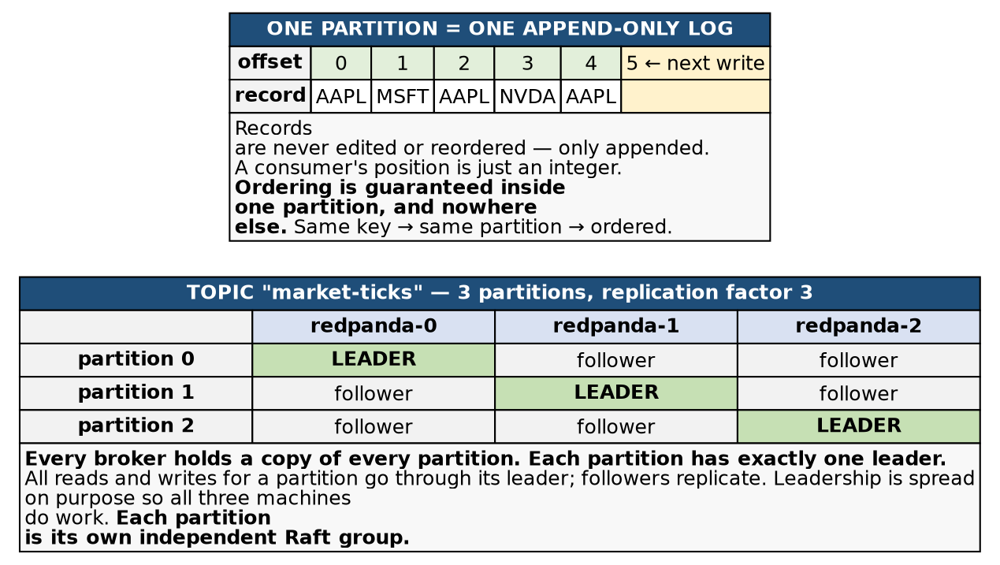
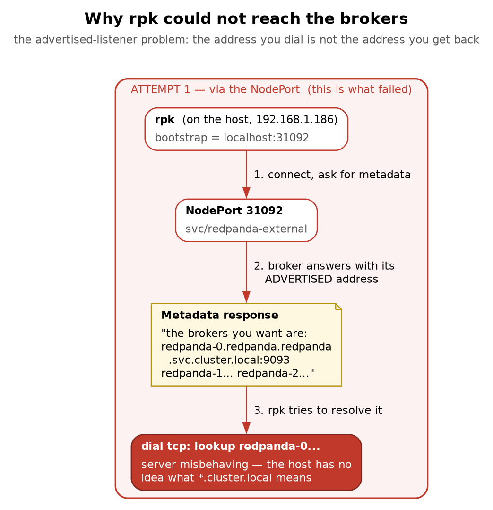
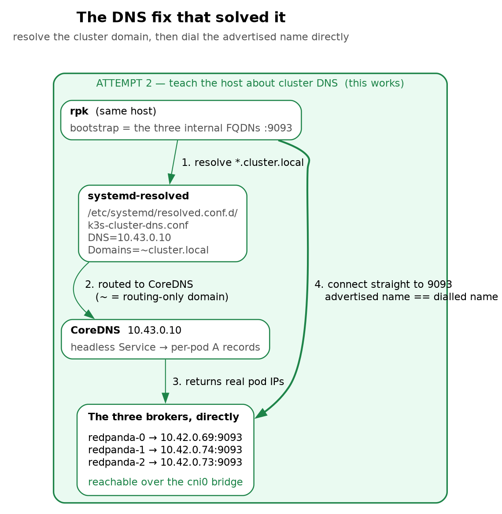

# Chapter 3 — Redpanda: A Replicated Log You Can Break and Heal

> **Who this chapter is written for.** Andrew is interviewing for an **SRE / DevOps** role on an
> **order management system**. That shapes everything here: the emphasis is on *operational*
> reasoning — what breaks, what the cluster does about it, what you do at 3am, and which reflexes
> make an incident worse. Application design is secondary. Wherever a concept has a consequence for
> order and trade processing, that consequence is called out explicitly.

---

## Verified facts header

Everything in this chapter was run on **`vm-k8-redpanda-1` (192.168.1.186)** on **27 July 2026**.
Every command shown was executed and every output quoted is real. Nothing is illustrative.

| Thing | Value as tested |
|---|---|
| Kubernetes | k3s, **single node**, `vm-k8-redpanda-1` |
| Helm | v3.21.3 |
| Redpanda chart | `redpanda-26.1.9` |
| Redpanda | `v26.1.12` |
| `rpk` | `v26.1.14` |
| Namespace | `redpanda` |
| Brokers | `redpanda-0/1/2`, pod IPs `10.42.0.69 / .74 / .73` **at the time of writing** |
| CoreDNS | `10.43.0.10` |
| Test topic | `market-ticks`, 6 partitions, RF 3 |
| Values file | [`manifests/redpanda-values.yaml`](manifests/redpanda-values.yaml) |

Those broker pod IPs appear throughout the chapter and **yours will be different** — they change
every time a pod is recreated, which on this cluster has already happened several times since
(they are now `.112 / .144 / .114`). That is not an erratum, it is the point of §5: the stable
identity of a broker is its DNS name `redpanda-0.redpanda.redpanda.svc.cluster.local`, never its
address. Any command you write against a pod IP is correct for about as long as the pod lives.

---

## What this chapter covers

1. What Redpanda is, and the honest answer to "why not Kafka?"
2. Topics, partitions, offsets — and the ordering guarantee that causes real outages
3. Replication, partition leadership, and why every partition is its own Raft group
4. Quorum arithmetic: why 3 brokers, why not 2, why not 4
5. Why brokers need a StatefulSet and a headless Service
6. **The install, step by step** — a re-usable runbook, including the failed first attempt
7. **Wiring up `rpk`** — and the advertised-listener problem that blocked it
8. **Verified demos** — partitioning, keys, and reading a log without hanging your terminal
9. **Failure drills** — kill one broker, kill two, prove nothing was lost, and what to alert on
10. **Rolling restarts and upgrades** — the same thing done deliberately, without an outage
11. Where this sandbox differs from production
12. Commands, glossary, and self-test

---

## 1. What Redpanda actually is

Redpanda is a streaming data platform that **speaks the Kafka wire protocol**. Any Kafka client
library connects to it unchanged — that compatibility is the entire commercial premise: keep the
ecosystem, replace the implementation.

The implementation differences are what interviews probe:

- **A single C++ binary. No JVM**, so no garbage collector and no GC pauses. This is the reason
  trading firms look at it — GC pauses are tail-latency events, and tail latency is what hurts.
- **Thread-per-core** (built on the Seastar framework). Work is pinned to cores rather than shared
  across a thread pool. It is also why the Helm chart insists on allocating **whole** CPU cores.
- **No ZooKeeper and no separate controller cluster.** One process to deploy, monitor and upgrade.
- **fsync by default.** Redpanda writes durably rather than trusting the OS page cache.

**"Why not just use Kafka?"** — answer honestly. Kafka is more mature and has a far larger
ecosystem of connectors and tooling. Redpanda buys lower tail latency and dramatically simpler
operations. For market data and order flow, tail latency and operational simplicity are exactly the
axes that matter. Saying "Kafka is worse" is a weaker answer than naming the trade-off.

---

## 2. Topics, partitions, offsets



A **topic** is a named stream, such as `market-ticks`. It is split into **partitions**, and each
partition is an **append-only log**. Records are appended, never edited and never reordered, and
each receives a monotonically increasing **offset**. A consumer's entire position in the stream is
one integer per partition.

Partitions exist to give you parallelism — six partitions allow six consumers to read at once.
But they come with the single most important caveat in this chapter:

> **Ordering is guaranteed *within* a partition and nowhere else.** There is no global order across
> a topic.

### 2a. How a record actually picks its partition

This is where the received wisdom is wrong, and where we measured something more interesting.

The common explanation is *"with a key it hashes; without a key it round-robins across partitions."*
The first half is right. The second half is not how modern clients behave, and the difference is
the reason ordering bugs hide in development.

**With a key**, the partition is `hash(key) % partitions`. Deterministic and stable — the same key
always lands in the same partition, forever, so all records for that key stay ordered.

**Without a key**, the client is merely *free* to put each record anywhere, and it uses a **sticky
partitioner**: it picks one partition and keeps filling batches there, only switching when a batch
closes. In practice a short-lived producer sends *everything* to a single partition.

We measured exactly that (§8b has the commands):

| What we produced | Where it landed |
|---|---|
| 6 unkeyed records, one producer | **all 6 to one partition** |
| 300 unkeyed records, one producer | **all 300 to one partition** |

Three hundred records and it never switched. So "unkeyed spreads your data evenly" is false at
small scale. Each *producer session* effectively picks a partition. Spread emerges across many
producers and long-running ones, not within a single burst.

**Which** partition it picks is arbitrary and differs every run — we saw partition 1 on one run and
partition 5 on the next for the identical command. Contrast that with keys, which are perfectly
reproducible: `AAPL` landed in partition 3 on every run, days apart. **Keyed placement is
deterministic; unkeyed placement is sticky but random.**

### 2b. Why this matters for an OMS

Send order events for one account, or one instrument, without a key and they scatter — eventually.
The failure mode is not "slightly out of order"; it is **a cancel processed before the order it
cancels**, or a fill applied against a stale position.

Now combine that with the sticky partitioner and you get the genuinely dangerous property:

> **The bug is invisible in development.** Your test producer sends 50 unkeyed records, the sticky
> partitioner puts all 50 in one partition, one consumer reads them in perfect order, and every
> test passes. In production, with many producers and long-lived sessions, records spread across
> partitions and the ordering you were accidentally relying on evaporates.

A correctness bug that only appears at volume is the worst kind there is, and "we didn't set a key"
is one of the most common root causes in real Kafka deployments.

### 2c. Hashing is deterministic, not fair

We produced under five keys and recorded where each landed:

| Key | Partition |
|---|---|
| `AAPL` | 3 |
| `GOOG` | **3** |
| `MSFT` | 0 |
| `TSLA` | 5 |
| `AMZN` | **5** |

Five keys, six partitions, and only **three** partitions used. `AAPL` collided with `GOOG`, `TSLA`
with `AMZN`, and partitions 1, 2 and 4 received nothing at all. Re-sending `AAPL` later landed in
partition 3 again, confirming the mapping is stable.

Two operational consequences:

- **Idle partitions are normal.** A partition with zero records is not a broken partition. Do not
  go hunting for a fault.
- **Collisions create shared fate.** `AAPL` and `GOOG` now share a partition, therefore share a
  leader, a disk and a single-threaded write path. If `AAPL` goes wild during the open, `GOOG`
  queues behind it. This is the **hot partition** problem, and adding partitions does not
  necessarily fix it — it reshuffles every key and may just create a different collision.

**The rule:** key by whatever must stay ordered — account, instrument, order ID — and understand
that this choice simultaneously decides your parallelism ceiling *and* your hot-spot risk.

### 2d. Partition count is effectively permanent

*(Measured on `orders`, 3 Aug 2026.)*

Everything above depends on `hash(key) % partition_count`. Change the divisor and every key is
re-evaluated. This is the single most damaging thing you can do to a keyed topic, and it takes one
command.

We keyed four orders into a 6-partition topic, three events each, and recorded where they landed:

| Key | Partition |
|---|---|
| `ORD-1001` | 1 |
| `ORD-1002` | 0 |
| `ORD-1003` | 2 |
| `ORD-1004` | 3 |

Then grew the topic and produced one more event per order — **same keys, same code, no deploy**:

```bash
rpk topic add-partitions orders -n 6      # 6 -> 12
```

```
ORD-1001  ->  p1     unchanged
ORD-1002  ->  p6     moved
ORD-1003  ->  p8     moved
ORD-1004  ->  p9     moved
```

**Three of four keys relocated.** The arithmetic is worth internalising: going from 6 to 12,
`hash % 12` can only be `hash % 6` or `hash % 6 + 6`. Every key either stays put or shifts by
exactly the old partition count, and on a doubling roughly **half of all keys move**.

#### What that does to an order's history

`ORD-1001`, which didn't move, is intact:

```
p1  off=0  NEW
p1  off=1  PARTIAL_FILL
p1  off=2  CANCEL
p1  off=3  AMEND
p1  off=4  FILL_AFTER_REPART
```

`ORD-1002`, which moved, is now split across two partitions:

```
p0  off=0  NEW
p0  off=1  PARTIAL_FILL
p0  off=2  CANCEL
-----------------------------
p6  off=0  FILL_AFTER_REPART
```

Read that carefully. The fill sits at **offset 0 of partition 6** — a consumer assigned to that
partition sees a fill as the first thing it has ever heard about the order, with no `NEW` preceding
it. **A fill for an order that was never placed.** Downstream that is a reconciliation break, or a
message your consumer rejects as referencing an unknown order.

The offsets actively mislead too: the `CANCEL` is at offset 2 and the *later* `FILL` is at offset 0,
because offsets only mean anything within a partition.

#### Why this is so dangerous

- **It is silent.** No error, no failed write, no warning. `rpk cluster health` still reports
  `Healthy: true`. Producers notice nothing. No metric moves.
- **Partial breakage is worse than total breakage.** If every key moved you would know every order
  was affected. Instead most orders are fine and some are corrupted, and separating them means
  re-computing the hash for every key ever written.
- **It is irreversible.** You can add partitions; you can never remove them.

#### What to do instead

- **Treat partition count as immutable after creation.** Size it once, with headroom.
- **Size for consumer parallelism, not throughput.** Partition count is the ceiling on active
  consumers in a group — you can never have more consumers than partitions. Plan for the peak
  parallelism you will ever want.
- **To genuinely grow a keyed topic, migrate rather than repartition:** create `orders.v2` at the
  new count, replay or dual-write, cut consumers over, retire the old topic.
- **Guard the operation** with ACLs, and alert on partition-count changes — nothing else will tell
  you.

> **The interview trap:** *"Consumers are lagging and the topic is at capacity — do you add
> partitions?"* On an unkeyed topic, fine. On a keyed topic carrying order state, **no**, not without
> a migration plan, because you would break per-key ordering for about half your keys. This is also
> the sharpest argument for keeping topic definitions in version control: not bureaucracy, but
> because one of the fields is irreversible and silently corrupts ordering when changed.

### 2e. Debugging an ordering complaint

A trap we walked straight into while producing the data above. This listing appears to show a cancel
arriving before the order it cancels:

```
1 ORD-1001 {"event":"CANCEL"}
1 ORD-1001 {"event":"NEW"}
1 ORD-1001 {"event":"PARTIAL_FILL"}
```

It is not real. The command ended in `| sort`, and `CANCEL` precedes `NEW` alphabetically. The log
itself was always correct — offsets 0, 1, 2 in the right order. **The display lied, not the data.**

> When someone reports "events arrived out of order," the first question is *how are you looking at
> them?* Read **one partition at a time, with offsets** (`-p N -f '%o %k %v\n'`) before believing
> any ordering complaint. A view merged across partitions has no meaningful order at all, and neither
> does anything you have piped through `sort`.

The three real causes, in the order worth checking: the producer wasn't keyed (§2a), someone changed
the partition count (§2d), or a consumer group rebalanced mid-stream.

---

## 3. Replication and partition leadership

Look at the lower half of Figure 1. With **replication factor 3**, every broker holds a copy of
every partition, but each partition has exactly **one leader**. All reads and writes for a partition
go through its leader; the other two replicate from it.

Leadership is spread deliberately so all three machines share the work instead of one becoming a
bottleneck. "Is leadership balanced?" is a real operational health question, not a cosmetic one —
and §9 shows a case where the cluster reports itself perfectly healthy while one broker does
nothing at all.

The structural fact that makes the failure drills make sense:

> **Each partition is its own independent Raft group.**

A topic with 6 partitions at RF 3 has **18 replicas and 6 independent Raft groups**, with each
broker holding 6 replicas and leading 2 on average. So when a broker dies you do not see "the
cluster" fail over — you see the specific partitions it led elect new leaders, while every other
partition carries on completely untouched.

---

## 4. Quorum: why three

**Quorum = majority = floor(3/2) + 1 = 2 of 3**

| State | Brokers up | Majority? | Result |
|---|---|---|---|
| **Healthy** | 3 of 3 | yes — 3 ≥ 2 | **Writes accepted.** Leader + 1 follower must ack. |
| **Lose one** | 2 of 3 | yes — 2 ≥ 2 | **Writes still accepted.** If the dead one led a partition, a new leader is elected in ~1 second. No data loss. |
| **Lose two** | 1 of 3 | **NO — 1 < 2** | **Writes REFUSED.** The survivor steps down rather than accept writes it cannot prove are safe. |

> **The point of the third broker**
>
> With **2** brokers, a majority is still 2 — so losing either one halts writes. Two brokers buy you a second copy of the data and **zero** fault tolerance.
>
> **Odd numbers are what buy availability.** 3 survives 1 failure, 5 survives 2. Going 3 → 4 costs a machine and improves nothing: a majority of 4 is 3.
>
> **Refusing writes is the correct behaviour, not a bug.** A minority that kept accepting trades could not guarantee they survive — that is how you lose money.

Raft requires a majority to agree. For a group of three, that is two.

| Brokers up | Majority reachable? | Result |
|---|---|---|
| 3 of 3 | yes | Writes accepted — leader + 1 follower must ack |
| 2 of 3 | yes | Writes still accepted; new leaders elected in ~1s; no data loss |
| 1 of 3 | **no** | **Writes refused** |

**Refusing writes is correct behaviour, not a bug.** A lone survivor cannot prove that a write it
accepts would survive, so accepting one risks silently losing an acknowledged order. Halting is the
safe choice. Be ready to defend this — it is a favourite interview probe, and the wrong answer
("it should stay up") reveals that you would happily trade correctness for uptime.

**Two brokers is a trap.** A majority of two is still two, so a two-broker cluster gives you a
second copy of the data and **zero** fault tolerance. Odd numbers buy availability: 3 survives one
failure, 5 survives two. Going 3 → 4 costs a machine and improves nothing, because a majority of
four is three.

### The degraded-cluster trap (an SRE question, not a developer one)

A broker dies. You are at 2 of 3 and writes are flowing. A colleague says *"we're fine, we still
have redundancy."*

He is conflating two different things:

- **Copies of the data:** still 2. Nothing is lost or at risk of being lost.
- **Fault tolerance:** now **zero.** One more failure halts all writes.

So the cluster is not "degraded but fine" — it is **one failure away from a write outage.**

The operational consequence matters more than the semantics: **while degraded, do not perform any
maintenance that takes another broker down.** No rolling restart, no node drain, no kernel patch,
no "let me just bounce it and see." The reflex to start restarting things when a cluster looks
unhealthy is exactly what converts a degraded cluster into an outage.

---

## 5. Why a StatefulSet, and why a headless Service

A Deployment replaces a dead pod with a **completely new object** — new name, new IP, no memory of
its predecessor, and with node-local storage no way to reattach the old volume.

Apply that to a Raft group and it collapses: the surviving members see a voter vanish and an
unrelated stranger appear, with no way to know they are the same logical broker or to trust its
data.

A **StatefulSet** provides the three things a broker needs:

1. **Stable ordinal identity** — `redpanda-0`, `redpanda-1`, `redpanda-2`. A replacement pod
   reclaims the same name.
2. **Its own PersistentVolumeClaim**, created from `volumeClaimTemplates` and bound to the
   identity, so `redpanda-1` always remounts `redpanda-1`'s data.
3. **Ordered operations** — brokers start, stop and upgrade one at a time rather than all at once.

### 5a. Headless does not mean "no Service"

The most common misconception, and worth correcting precisely: **a headless Service is a normal
Service that has no IP address of its own.** The object exists, it has a name, a DNS entry, a label
selector and EndpointSlices. Only the virtual IP is missing.

Your cluster runs one of each, in the same namespace, from the same Helm release:

```
$ kubectl -n redpanda get svc \
    -o custom-columns='NAME:.metadata.name,TYPE:.spec.type,CLUSTER-IP:.spec.clusterIP,SELECTOR:.spec.selector'

NAME                TYPE        CLUSTER-IP      SELECTOR
redpanda            ClusterIP   None            map[app.kubernetes.io/instance:redpanda app.kubernetes.io/name:redpanda]
redpanda-console    ClusterIP   10.43.128.189   map[app.kubernetes.io/instance:redpanda app.kubernetes.io/name:console]
redpanda-external   NodePort    10.43.3.201     map[app.kubernetes.io/instance:redpanda app.kubernetes.io/name:redpanda]
```

The first two are `type: ClusterIP`. Both have selectors. The difference is the third column, and
what it changes is **who picks the pod**.

Note the selectors are real chart labels, not the tidy `name=redpanda` you might expect — Helm
charts label on `app.kubernetes.io/{name,instance}` so that two releases of the same chart in one
namespace do not select each other's pods. It matters here because if you write a NetworkPolicy or
a second Service by hand and guess the label, it will select nothing, and a Service that selects
nothing looks identical to a Service whose pods are all unhealthy. Read the selector, don't assume
it.

`redpanda-external` is the third one, and it is the closest thing this cluster has to an external
boundary: a NodePort onto the same broker pods, with no TLS and no authentication in front of it.
§11 comes back to what that would need before anyone outside the cluster could be allowed near it.

**Normal ClusterIP — Kubernetes picks, and hides the pods:**

```
redpanda-console.redpanda.svc.cluster.local  ->  10.43.128.189
                        actual console pod  =   10.42.0.63
```

The name resolves to a virtual IP that **belongs to no pod at all**. Nothing listens on it; kube-proxy
DNATs you to a real pod. The client never learns pod addresses and has no say in which it gets. That
is the Chapter 1 §5 machinery, including per-connection rather than per-request balancing.

**Headless — Kubernetes steps aside and shows you the pods:**

```
redpanda.redpanda.svc.cluster.local  ->  10.42.0.69
                                         10.42.0.73
                                         10.42.0.75
```

No virtual IP, no kube-proxy, no DNAT. DNS returns **all three real pod IPs** and the client chooses.
So the collective name is still something you can "call" — it is a list, not a load balancer.

And because a headless Service exists, each pod additionally gets **its own** DNS name:

```
redpanda-0.redpanda.redpanda.svc.cluster.local  ->  10.42.0.69
redpanda-1.redpanda.redpanda.svc.cluster.local  ->  10.42.0.75
redpanda-2.redpanda.redpanda.svc.cluster.local  ->  10.42.0.73
```

One name, one broker, every time. These per-pod records are the "stable network identity"
StatefulSets are known for, and **a normal ClusterIP Service does not create them.**

### 5b. How a client actually connects

The collective name is used only for the **first handshake**:

```
1. BOOTSTRAP    client -> redpanda.redpanda.svc.cluster.local:9093
                DNS returns 3 IPs; client connects to any one

2. METADATA     that broker replies with the real roster:
                  ID  HOST                                            PORT
                  0   redpanda-0.redpanda.redpanda.svc.cluster.local  9093
                  1   redpanda-1.redpanda.redpanda.svc.cluster.local  9093
                  2   redpanda-2.redpanda.redpanda.svc.cluster.local  9093
                ...plus the leader of every partition

3. STEADY STATE client opens direct connections to specific brokers by those
                per-pod names and stops using the Service name entirely
```

Reaching **any one** broker is sufficient to discover them all — that is what "bootstrap server list"
means, and why the list is not a connection list.

**Why load balancing would be actively wrong.** Writes must go to the *leader* of the target
partition. With leadership spread as `p0→b0, p1→b1, p2→b2, p3→b1 …`, a produce for partition 3 has
to reach broker 1; broker 0 cannot accept it. Behind a load-balancing virtual IP, writes would land
on an arbitrary broker and be rejected as `NOT_LEADER_FOR_PARTITION` roughly two thirds of the time.
The client's whole job is to route **deliberately**, based on leadership it learned in step 2 — so it
needs individually addressable brokers.

The Console next door is a plain Deployment behind a plain ClusterIP precisely because any Console
pod can serve any request. **Same namespace, same release, two Services, two routing models — chosen
by whether the backends are interchangeable.**

> **One caveat worth knowing.** The chart sets `publishNotReadyAddresses: true` on the headless
> Service, which StatefulSets generally need so members can discover each other during initial
> bootstrap, before any of them are ready. The side effect: **DNS will hand you a broker that is not
> ready yet.** The headless name protects you from a *dead* broker, not an *unready* one — which is
> exactly the race a seeding Job hits at deploy time (Chapter 4).

---

## 6. The install — step by step

> A re-usable runbook. Values chosen for a **single-node** learning cluster are flagged as such,
> with the production equivalent noted.

### 6a. Prerequisites

```bash
# Helm
curl -fsSL https://raw.githubusercontent.com/helm/helm/main/scripts/get-helm-3 | bash
helm version --short                       # v3.21.3 at time of writing

# The Redpanda chart repository
helm repo add redpanda https://charts.redpanda.com
helm repo update
helm search repo redpanda/redpanda         # chart 26.1.9 / app v26.1.12
```

### 6b. Read the defaults before installing anything

The habit worth forming — never install a chart blind:

```bash
helm show values redpanda/redpanda | less
```

What matters on a single-node cluster:

| Setting | Chart default | Decision here | Why |
|---|---|---|---|
| `statefulset.replicas` | `3` | keep | a real quorum |
| `resources.cpu.cores` | `1` | keep | 3 of 16 vCPU; Redpanda wants **whole** cores (thread-per-core) |
| `resources.memory.container.max` | `2.5Gi` | keep | 7.5 GB of 29 GB free |
| `storage.persistentVolume.size` | `20Gi` | keep, pin class | resolves to `local-path` |
| `tls.enabled` | `true` | **`false`** | **sandbox shortcut** — production keeps TLS on |
| pod anti-affinity | **hard** | **soft** | **see 6c — this one bit us** |

### 6c. The anti-affinity problem, and a chart trap

The chart ships **hard** anti-affinity on `kubernetes.io/hostname`. That is the *correct* production
default: it forbids two brokers from sharing a node, so losing one machine cannot cost you two
replicas of the same partition. On a **single-node** cluster it means only one broker can ever
schedule and the other two sit `Pending` forever.

The documented override is:

```yaml
statefulset:
  podAntiAffinity:
    type: soft
```

**In chart 26.1.9 this key is vestigial. Setting it changes nothing.** We set it, reinstalled, and
the pods stayed `Pending` with the identical event. The live path is
`statefulset.podTemplate.spec.affinity`, and the working override nulls the hard rule and
substitutes a preference — see [`manifests/redpanda-values.yaml`](manifests/redpanda-values.yaml).

> **The habit this should install in you: render before you install.**
>
> ```bash
> helm template redpanda redpanda/redpanda -n redpanda -f redpanda-values.yaml \
>   | grep -A14 podAntiAffinity
> ```
>
> You want to see `preferredDuringScheduling...` and **not** `requiredDuringScheduling...`. This
> takes five seconds and would have saved twenty minutes. Do it every time you override a chart
> value you have not overridden before — documentation drifts from templates, and the template is
> the thing that is actually true.

Verify the saved values file still does what it claims:

```bash
helm template redpanda redpanda/redpanda -n redpanda -f redpanda-values.yaml \
  | grep -c requiredDuringSchedulingIgnoredDuringExecution     # must be 0
```

### 6d. Install

```bash
kubectl create namespace redpanda        # if it does not exist

helm install redpanda redpanda/redpanda \
  --namespace redpanda \
  -f redpanda-values.yaml \
  --wait --timeout 10m
```

`--wait` blocks until the StatefulSet is Ready and the post-install hooks finish. Without it Helm
returns immediately and reports success on a cluster that has not started.

### 6e. What success looks like

```bash
kubectl -n redpanda get pods
kubectl -n redpanda get sts,pvc
kubectl -n redpanda get svc
```

```
NAME                                READY   STATUS      RESTARTS   AGE
redpanda-0                          2/2     Running     0          43m
redpanda-1                          2/2     Running     0          43m
redpanda-2                          2/2     Running     0          43m
redpanda-configuration-hmmxw        0/1     Completed   0          43m
redpanda-configuration-x5gsc        0/1     Error       0          43m
redpanda-console-59d88b855c-c4rl6   1/1     Running     0          43m
```

Three services are created, and the difference between them is the whole of §5 and §7:

| Service | Type | Purpose |
|---|---|---|
| `redpanda` | **headless** (`CLUSTER-IP None`) | per-broker DNS; how brokers find each other |
| `redpanda-console` | ClusterIP `:8080` | the web UI (not exposed outside the cluster) |
| `redpanda-external` | NodePort `9094:31092`, `9645:31644` | intended path for outside clients |

**Note the `Error` pod, because it is not a failure.** The post-install configuration Job ran before
the brokers' admin API was listening:

```
Error: Get "http://redpanda-0...:9644/v1/cluster_config/schema":
       dial tcp 10.42.0.69:9644: connect: connection refused
```

The Job retried and the second pod completed. `kubectl -n redpanda get jobs` shows
`redpanda-configuration Complete 1/1` in 37s. A failed pod belonging to a **Complete** Job is
normal Kubernetes backoff, and the Job — not the pod — is the thing to judge. Leaving the corpse
around is deliberate: it is where the logs live.

### 6f. What failure looks like (our first attempt)

Worth reading because the symptom you see is four layers away from the cause:

```
helm install ... --wait --timeout 10m        # hangs, then times out
```

The cascade, top to bottom:

1. Helm hangs waiting on a StatefulSet that will never be Ready.
2. `redpanda-1` and `redpanda-2` are `Pending`.
3. Their PVCs are `Pending` too — `local-path` uses `WaitForFirstConsumer`, so **the volume is not
   created until the pod is scheduled.** Pending PVCs here are a *symptom*, not the cause.
4. `redpanda-0` is `Running` but never `Ready`, because it cannot form a quorum alone.
5. The configuration Job fails permanently and Console crash-loops.

The one command that gives you the answer:

```bash
kubectl -n redpanda describe pod redpanda-1 | tail -20
```

```
0/1 nodes are available: 1 node(s) didn't match pod anti-affinity rules.
```

> **The lesson: read the `Events` on the *earliest* thing that is stuck, not the loudest thing that
> is broken.** Console crash-looping was the noisiest symptom and the least informative. Scheduling
> failures always surface in pod events, and the scheduler tells you exactly which predicate it
> failed.

### 6g. Uninstalling — the part people get wrong

```bash
helm uninstall redpanda -n redpanda
kubectl -n redpanda get pvc                     # ← they are STILL THERE
```

> **`helm uninstall` does not delete PersistentVolumeClaims created from a StatefulSet's
> `volumeClaimTemplates`.** Kubernetes leaves them deliberately — deleting a StatefulSet is not
> assumed to mean "destroy the data."

For a genuinely clean reinstall you must remove them yourself:

```bash
kubectl -n redpanda delete pvc --all
```

Skipping this is how you get a "fresh" cluster that comes up carrying a previous cluster's identity
and refuses to form a quorum. **In production this default is a feature that saves you; in a
sandbox loop it is a trap that confuses you.** Know which situation you are in.

---

## 7. Wiring up `rpk`

`rpk` is Redpanda's CLI — the equivalent of `kubectl` for the data plane.

### 7a. Install the binary

It is not an alias and not a wrapper script — it is a single static binary on the host:

```bash
curl -LO https://github.com/redpanda-data/redpanda/releases/latest/download/rpk-linux-amd64.zip
sudo unzip -o rpk-linux-amd64.zip -d /usr/local/bin/
rm rpk-linux-amd64.zip
rpk version
```

```
rpk version: v26.1.14
Redpanda Cluster
  node-0  v26.1.12
  node-1  v26.1.12
  node-2  v26.1.12
```

You can also run it *inside* a broker with `kubectl -n redpanda exec -it redpanda-0 -c redpanda --
rpk ...`, which sidesteps every networking problem in §7c. Having it on the host is nicer, and the
reason it took work is itself the lesson.

### 7b. Two APIs, two ports — do not confuse them

| API | Port | What it does |
|---|---|---|
| **Kafka API** | `9093` | data plane — produce, consume, topics |
| **Admin API** | `9644` | control plane — cluster health, config, broker state |

`rpk cluster health` uses the **Admin** API; `rpk topic produce` uses the **Kafka** API. When one
works and the other does not, that is your first clue about which port is misconfigured.

### 7c. The advertised-listener problem





> **Why this shortcut is legitimate here — and why it would not be in production**
>
> The host IS the Kubernetes node, so the pod network (10.42.0.0/24) sits on a local bridge and is directly routable. From any OTHER machine on the LAN those pod IPs are unreachable and this fails.
>
> **The real fix** is to configure external.advertisedPorts / external.domain so brokers advertise an address clients can actually reach. The general rule, and the interview answer:
>
> **a broker must advertise an address its clients can resolve AND route to — from where the client is.**

Pointing `rpk` at the NodePort looked obviously right and failed:

```bash
rpk profile create local \
  --set kafka_api.brokers=localhost:31092 \
  --set admin_api.addresses=localhost:31644

rpk topic create market-ticks -p 6 -r 3
```

```
unable to dial: dial tcp: lookup redpanda-0.redpanda.redpanda.svc.cluster.local.:
server misbehaving
```

Read that error carefully: **we dialled `localhost` and it failed on `redpanda-0...`.** That
mismatch *is* the diagnosis.

Every Kafka client connects to a bootstrap address only to ask *"who are the brokers?"* The cluster
replies with its **advertised listeners**, and the client then opens a **new connection to each
broker directly** — because it must reach the specific leader of each partition. Our brokers
advertised their internal cluster DNS names, which the host could not resolve.

> **The general rule, and the interview answer:** a broker must advertise an address that its
> clients can both **resolve** and **route to**, *from where the client actually is*. Bootstrap
> connectivity proves nothing about whether the rest will work.

This is the single most common Kafka networking problem in the wild. It bites people behind NAT, in
Docker, across VPCs, and through load balancers — always the same shape.

**The fix we chose:** teach the host to resolve cluster DNS, then talk to brokers directly.

```bash
# The drop-in directory does not exist on a stock Ubuntu install -- systemd
# reads it if present but does not ship it. Without this line `tee` fails with
# "No such file or directory", and because the redirect swallows stdout the
# error is easy to skim past and conclude that DNS simply did not take effect.
sudo mkdir -p /etc/systemd/resolved.conf.d

sudo tee /etc/systemd/resolved.conf.d/k3s-cluster-dns.conf >/dev/null <<'EOF'
# Route *.cluster.local queries to k3s CoreDNS so host tools (rpk) can resolve
# the internal, headless-Service broker names. "~" = routing-only domain.
[Resolve]
DNS=10.43.0.10
Domains=~cluster.local
EOF

sudo systemctl restart systemd-resolved
resolvectl query redpanda-0.redpanda.redpanda.svc.cluster.local
```

```
redpanda-0.redpanda.redpanda.svc.cluster.local: 10.42.0.69 -- link: cni0
```

`10.43.0.10` is CoreDNS's ClusterIP (`kubectl -n kube-system get svc kube-dns`). The `~` prefix
makes `cluster.local` a **routing-only** domain: send queries for it to this server, but do not
append it as a search suffix to unrelated lookups.

Then point the profile at all three brokers by their internal names:

```bash
rpk profile set kafka_api.brokers=\
redpanda-0.redpanda.redpanda.svc.cluster.local:9093,\
redpanda-1.redpanda.redpanda.svc.cluster.local:9093,\
redpanda-2.redpanda.redpanda.svc.cluster.local:9093

rpk profile set admin_api.addresses=\
redpanda-0.redpanda.redpanda.svc.cluster.local:9644,\
redpanda-1.redpanda.redpanda.svc.cluster.local:9644,\
redpanda-2.redpanda.redpanda.svc.cluster.local:9644

rpk profile print          # config lives in ~/.config/rpk/rpk.yaml
```

**List all three.** The bootstrap list only needs one broker to *answer*, so listing all three means
`rpk` still works when the first one is down — which matters enormously in §9, where you are
deliberately killing brokers and do not want your diagnostic tool to be a casualty of the incident.

**Does this survive pods being replaced?** Yes. Nothing here references a pod IP. The StatefulSet
guarantees stable names, the headless Service publishes whatever IP the pod currently has, and
CoreDNS is looked up fresh. Delete every broker and this keeps working — that is precisely what
stable identity buys.

**Why this shortcut is legitimate here and nowhere else:** the host *is* the Kubernetes node, so pod
IPs sit on a local `cni0` bridge and are directly routable. From any other machine on the LAN they
are unreachable. The production answer is to configure `external.domain` / `external.advertisedPorts`
so brokers advertise addresses real clients can reach.

### 7d. Profiles are contexts

```bash
rpk profile list      # local*
rpk profile use <name>
```

The direct analogue of `kubectl config use-context`. When you have a staging and a production
Redpanda, this is how you move between them — and being slightly paranoid about which profile is
active before running a destructive command is a good habit to build now, cheaply, on a sandbox.

### 7e. Reaching the Console UI

Console is a ClusterIP service, so it is not exposed to the LAN:

```bash
kubectl -n redpanda port-forward svc/redpanda-console 8080:8080
# then browse http://localhost:8080   (or http://192.168.1.186:8080 with --address 0.0.0.0)
```

---

## 8. Verified demos

Every command below was run and produced the output shown.

> **These run on a throwaway topic, `demo-ticks`, so the offsets you see match the offsets printed
> here.** `market-ticks` accumulates records through the failure drills in §9, so re-running these
> against it gives correct behaviour but different numbers. Clean up at the end with
> `rpk topic delete demo-ticks`.

### 8a. Create a topic and look at it

```bash
rpk topic create demo-ticks -p 6 -r 3
rpk topic describe demo-ticks -p
```

```
PARTITION  LEADER  EPOCH  REPLICAS  LOG-START-OFFSET  HIGH-WATERMARK
0          0       1      [0 1 2]   0                 0
1          0       1      [0 1 2]   0                 0
2          1       1      [0 1 2]   0                 0
3          2       1      [0 1 2]   0                 0
4          1       1      [0 1 2]   0                 0
5          0       1      [0 1 2]   0                 0
```

Read this table fluently, because it is the single most useful diagnostic in Redpanda:

- **`REPLICAS [0 1 2]`** — all three brokers hold a copy. This column contains **spaces**, which
  will wreck naive `awk` parsing; the high-watermark is field **8**, not 6.
- **`LEADER`** — who serves this partition. It is *not* evenly spread on creation — here broker 0
  took three and broker 2 only one — and the leader balancer evens it out shortly after. **The
  initial assignment varies between runs**, so expect different numbers when you repeat this.
- **`HIGH-WATERMARK`** — the next offset to be written. It equals the number of committed records
  **only while `LOG-START-OFFSET` is 0**, which is true for every topic in this chapter because none
  of them has yet had a segment expired by retention. Once retention deletes the head of the log,
  the high-watermark keeps counting from the beginning of time while those records are gone, and
  the count you want is `HIGH-WATERMARK - LOG-START-OFFSET`. Get into the habit now:

```bash
# records actually present, correct even after retention has expired segments
rpk topic describe demo-ticks -p | awk 'NR>1 && NF {s += $8 - $7} END {print s}'
```

  This is the difference between "how many records has this partition ever held" and "how many can
  I still read", and on a topic with a seven-day retention those two numbers diverge on day eight.
  The `NF` guard skips the trailing blank line that would otherwise contribute an empty field.

```bash
# total committed records — note field 8
rpk topic describe market-ticks -p | awk 'NR>1 && NF {s+=$8} END {print s}'

# who leads what
rpk topic describe market-ticks -p | awk 'NR>1&&NF{print $2}' | sort -n | uniq -c
```

### 8b. Keys, and the sticky partitioner

One producer, six keyed records:

```bash
printf 'k1\nk2\nk3\nk4\nk5\nk6\n' | rpk topic produce demo-ticks -k AAPL
```

```
Produced to partition 3 at offset 0 with timestamp 1785177684983.
Produced to partition 3 at offset 1 with timestamp 1785177684983.
...all six to partition 3, offsets 0-5
```

One producer, six **unkeyed** records:

```bash
printf 'u1\nu2\nu3\nu4\nu5\nu6\n' | rpk topic produce demo-ticks
```

```
Produced to partition 5 at offset 0 with timestamp 1785178172751.
...all six to partition 5, offsets 0-5
```

**Not round-robin — all six to one partition.** *Which* partition is arbitrary and changes every
run; on an earlier run this same command sent all six to partition 1. Only the **stickiness** is
guaranteed, not the choice.

Push it harder and it still does not switch:

```bash
seq 1 300 | sed 's/^/big-/' | rpk topic produce demo-ticks >/dev/null
# unkeyed records print as "<partition> " with an empty key, so NF==1 selects them
rpk topic consume demo-ticks -o :end -f '%p %k\n' | awk 'NF==1' | sort -n | uniq -c
```

```
    300 3
      6 5
```

Three hundred records, one partition — and a *different* partition from the six-record run, because
each producer session makes its own independent choice. This is §2a made concrete, and it is the
mechanism by which an ordering bug passes every test you write.

Now five different keys:

```bash
for k in AAPL MSFT TSLA GOOG AMZN; do
  printf "$k-1\n$k-2\n$k-3\n" | rpk topic produce demo-ticks -k $k
done
rpk topic consume demo-ticks -o :end -f '%k %p\n' | grep -v '^ ' | sort -u
```

`AAPL→3, GOOG→3, MSFT→0, TSLA→5, AMZN→5` — two collisions, three partitions unused (§2c).

**Note the two `rpk topic produce` forms and why the difference matters:**

```bash
printf 'a\nb\nc\n' | rpk topic produce t -k K   # ONE producer, 3 records — realistic
for i in a b c; do echo $i | rpk topic produce t -k K; done   # THREE producers
```

The loop spawns a fresh producer per record, and each makes an independent sticky choice. If you
demo unkeyed partitioning with a loop you will see records scattered and conclude "unkeyed
round-robins" — the wrong lesson, from an artefact of your test harness.

### 8c. Reading a log without hanging your terminal

The trap that caught us twice:

```bash
rpk topic consume market-ticks -o start -n 100      # HANGS if there are < 100 records
```

`-n` means *"give me exactly this many"*, so it waits — correctly — for records that do not exist
yet. Piping into `wc -l` makes it worse: you see no output at all, because `wc` prints nothing
until EOF.

| Form | Behaviour |
|---|---|
| `rpk topic consume t` | stream forever — the `tail -f` form |
| `rpk topic consume t -o :end` | **read everything committed, then exit** — the `cat` form |
| `rpk topic consume t -o start -n N` | exactly N records, blocking until they exist |
| `rpk topic consume t -o start:end` | ⚠️ silently returns **0 records** — looks like data loss |

```bash
rpk topic consume market-ticks -o :end -f '%p %o %k %v\n'    # the one to memorise
rpk topic consume market-ticks -o :end -f 'x\n' | wc -l      # count everything
```

When a consume command "produces no output", ask whether it exited. A hung command and an empty
topic look identical through `wc -l`, and confusing the two during an incident will send you
chasing phantom data loss.

---

## 9. Failure drills

### 9a. Kill one broker

```bash
# 1. baseline
rpk topic describe market-ticks -p | awk 'NR>1&&NF{print $2}' | sort -n | uniq -c
#   broker 0 leads 2 / broker 1 leads 2 / broker 2 leads 2

# 2. kill it
kubectl -n redpanda delete pod redpanda-1 --wait=false

# 3. WAIT until it is actually gone  ← do not skip this
kubectl -n redpanda wait --for=delete pod/redpanda-1 --timeout=120s

# 4. observe
rpk cluster health
rpk topic describe market-ticks -p | awk 'NR>1&&NF{print $2}' | sort -n | uniq -c
echo "during-drill" | timeout 20 rpk topic produce market-ticks -k AAPL
```

> **Step 3 is the one that makes the drill trustworthy.** Running the checks immediately catches an
> intermediate state — a pod still `Terminating` is still serving — and you will draw a confident
> conclusion from a cluster that was never in the state you thought. This bit us during the
> two-broker drill in §9b, where a write succeeded that "should" have failed, purely because the
> second broker had not finished dying.

Observed:

```
Healthy:                          false
Nodes down:                       [1]
Leaderless partitions (0):        []
Under-replicated partitions (0):  []
```

```
  broker 0 leads 2 partitions
  broker 2 leads 4 partitions
```

```
Produced to partition 3 at offset 14 with timestamp ...      ← the write SUCCEEDED
```

Three things to take away:

1. **Failover is surgical.** Only the two partitions `redpanda-1` led changed hands. The other four
   never noticed.
2. **Failover is not load-balanced.** Broker 2 took **both** orphaned partitions (leading 4, not 3).
   The new leader is whichever eligible replica wins the election first; nothing is trying to be
   fair in the moment.
3. **Writes never stopped.** 2 of 3 is a quorum.

### 9b. Kill two brokers — lose quorum

```bash
kubectl -n redpanda scale statefulset redpanda --replicas=1
kubectl -n redpanda wait --for=delete pod/redpanda-1 --timeout=180s
kubectl -n redpanda wait --for=delete pod/redpanda-2 --timeout=180s

rpk cluster health
echo "quorum-test" | timeout 20 rpk topic produce market-ticks -k AAPL
```

Observed:

```
redpanda-0    1/2   Running          ← the survivor is NOT Ready
Nodes down:                       [1 2]
Leaderless partitions (8):        [kafka/market-ticks/0 ... kafka_internal/id_allocator/0
                                   redpanda/controller/0]
Under-replicated partitions (0):  []
```

The produce command **hung until the timeout and wrote nothing.**

Four observations that are each worth an interview answer:

- **The survivor steps down.** A leader that cannot reach a majority does not keep serving — it
  demotes itself. That is Raft refusing to risk a split brain.
- **`redpanda/controller/0` is leaderless too.** The cluster's own metadata Raft group is subject to
  the same arithmetic, so you lose administration as well as data: you cannot create a topic or
  change config to dig yourself out.
- **`Under-replicated partitions` reads 0 during a total outage.** This is the counter-intuitive one.
  Under-replication is measured *by a leader* comparing itself to followers, and with no leaders
  there is nobody to measure. **A metric that reads zero because the thing computing it is dead
  looks exactly like healthy.** Alert on `Leaderless partitions` and `Nodes down` — never rely on
  `Under-replicated` alone.
- **Producers hang; they do not error.** From the application's point of view this is a latency
  event, not a failure, until its own timeout fires. Client-side timeouts are therefore a
  correctness control, not a tuning knob: with no timeout, an OMS queues orders in memory
  indefinitely and loses them on restart.

### 9c. Recover, and prove nothing was lost

```bash
kubectl -n redpanda scale statefulset redpanda --replicas=3
kubectl -n redpanda rollout status statefulset redpanda --timeout=5m

rpk cluster health
rpk topic describe market-ticks -p
rpk topic consume market-ticks -o :end -f 'x\n' | wc -l
```

The reconciliation that matters — every record we had produced up to this point, accounted for:

| Partition | HWM | Contents |
|---|---|---|
| p3 | 14 | 12 keyed `AAPL` + `during-outage` + `should-fail` |
| p4 | 12 | 12 unkeyed |
| p2 / p0 / p5 | 3 / 1 / 2 | the 6 `batch-N` records |
| p1 | 0 | never received anything |
| **total** | **32** | and `-o :end` read back exactly **32** |

> *Chronology and naming note, because the payloads above do not match the commands earlier in this
> chapter. The table is the state at the end of the original two-broker drill, in which the two
> test writes were called `during-outage` and `should-fail`. The commands printed in §9a and §9c
> were re-run afterwards to verify them exactly as written, and that pass used the clearer names
> `during-drill` and `quorum-test` — the re-run added `during-drill` at p3 offset 14, so the topic
> now holds 33. Same drill, same result, different payload strings; `during-outage` corresponds to
> §9a's `during-drill`, and `should-fail` to a second successful write during the outage. Your own
> numbers will differ. What must hold is that the `-o :end` count equals the sum of the
> high-watermarks, and that no acknowledged write is missing.*

> **Every write that was acknowledged survived. The write that could not be safely acknowledged
> never appeared.**

`during-outage` and `should-fail` were both written while a broker was down, and both are present.
`quorum-test`, the one that hung, is absent — not silently dropped after being accepted, and not
silently accepted after appearing to fail. It simply never happened.

That is the property an order management system actually requires. Not "never goes down" — that is
unachievable — but **never lies about whether an order was accepted.** A system that hangs is
recoverable, because the client still holds the order and can retry. A system that acknowledges a
write it then loses is not, because nobody knows the order is missing.

### 9d. Healthy is not the same as balanced

Immediately after recovery:

```
Healthy:                          true
Nodes down:                       []
Leaderless partitions (0):        []
Under-replicated partitions (0):  []
```

```
  broker 0 leads 2 partitions
  broker 2 leads 4 partitions        ← broker 1 is back, and leads NOTHING
```

The cluster reports perfect health while one third of it does no work. Redpanda's **leader
balancer** redistributes leadership on its own timer, so there is a window — minutes, not seconds —
where you have full redundancy and skewed load.

Practical consequences:

- **After any broker restart, expect a period of uneven load.** Latency on the overloaded broker
  can rise without a single health check going red.
- **During a rolling restart this compounds.** Restart brokers in sequence without pausing and
  leadership can pile onto the last broker standing.
- **`rpk cluster health` is a liveness check, not a performance check.** The leader distribution
  from §8a is the query that tells you whether the cluster is actually working properly.

### 9e. What to alert on

| Signal | Meaning | Urgency |
|---|---|---|
| `Nodes down` > 0 | fault tolerance reduced or gone | page — you are one failure from an outage |
| `Leaderless partitions` > 0 | **those partitions are down** — no reads, no writes | page immediately |
| `Under-replicated partitions` > 0 | replicas lagging; durability reduced | investigate — **lagging and unreliable** |
| Producer p99 latency spike | often quorum loss presenting as a hang | correlate with the above |

The trap is treating `Under-replicated` as your primary durability alarm. We watched it read `0`
both immediately after a broker died (before the leader noticed) and throughout a total quorum
outage (no leader to compute it). **`Leaderless` is the honest signal.**

### 9f. Where those numbers actually come from

An alert you cannot collect is a wish. Everything above comes from `rpk cluster health`, which is a
human command — fine at 3 a.m. with a terminal open, useless as a monitoring input. The real source
is the Admin API's Prometheus endpoints on port `9644`:

| Endpoint | Contents |
|---|---|
| `:9644/public_metrics` | The curated set — stable names, intended for dashboards and alerts |
| `:9644/metrics` | Everything, including internal seastar counters. Large, and not a stable contract |

Prefer `/public_metrics`. On this cluster it exposes 2,114 series; `/metrics` is far larger and its
names can change between releases.

The families worth knowing by name, all confirmed on this cluster:

```
redpanda_kafka_under_replicated_replicas{redpanda_topic="orders",redpanda_partition="0",...}  0
redpanda_kafka_consumer_group_committed_offset{redpanda_group="oms-processor",
                                               redpanda_topic="orders",
                                               redpanda_partition="1",...}  375
redpanda_storage_disk_free_bytes{}                301212672000
redpanda_storage_disk_free_space_alert{}          0
```

**Consumer lag is not published directly, and this catches people out.** The broker exposes the
group's *committed offset* per partition and the partition's *high-watermark* separately; lag is the
subtraction, and you do it in the query:

```promql
max by (redpanda_topic, redpanda_partition) (
    redpanda_kafka_max_offset - on(redpanda_topic, redpanda_partition)
    redpanda_kafka_consumer_group_committed_offset{redpanda_group="position-keeper"}
)
```

Alert on the **max across partitions**, never the sum or the average — Chapter 5 §3 is the whole
argument for why. One badly stuck partition is invisible in a total that six partitions contribute
to, and it is the only one that matters.

There is a second source people forget: **the client**. Set `statistics.interval.ms` and librdkafka
hands your application a JSON blob per interval containing its own view of lag per partition
(`consumer_lag`), which is the only number that reflects what your consumer actually sees rather
than what the broker last heard it commit. Chapter 6 §14 makes the related point that lag in
*records* is not directly actionable — a count means nothing without a rate — which is why the
consumer there also emits an event-age measurement.

`redpanda_storage_disk_free_space_alert` deserves its own line. It is Redpanda's own assessment of
disk pressure, and it changes broker **behaviour**, not just your dashboard: as free space falls the
broker begins throttling and eventually rejects writes rather than filling the disk. That matters
disproportionately in this lab, because §6c established that local-path capacity requests are a
fiction — all three "brokers" share one unquotaed filesystem, so a single runaway topic can take the
entire quorum down at once, which is a failure mode a real three-node cluster does not have.

---

## 10. Rolling restarts and upgrades — the routine task

Everything in §9 was a failure being inflicted. This section is the opposite: the ordinary,
scheduled, deliberate version of taking a broker down, and it is **the single most common real task
in operating a cluster like this**. Patching, resizing, changing a config that needs a restart, or
a version upgrade all reduce to the same procedure.

The naive version is one command:

```bash
kubectl rollout restart sts/redpanda -n redpanda        # DON'T
```

It is not enough, and §9d already showed why. A StatefulSet restarts pods one at a time in reverse
ordinal order and waits for each to be `Ready` before moving on, which sounds exactly right. But
`Ready` is a Kubernetes-level assertion about the pod, and it knows nothing about **Raft leadership**.
Restart a broker that currently leads twenty partitions and those partitions are leaderless — no
reads, no writes — for as long as it takes the surviving brokers to hold elections. Do it three
times in a row and you have inflicted three avoidable write outages during a maintenance window.

### Drain leadership first

Redpanda has an explicit mechanism for this: **maintenance mode** moves every partition leadership
off a broker before you touch it, so the restart costs nothing.

```bash
rpk cluster maintenance enable 1 --wait
```

```
Successfully enabled maintenance mode for node 1. Waiting for node to drain...
NODE-ID  ENABLED  FINISHED  ERRORS  PARTITIONS  ELIGIBLE  TRANSFERRING  FAILED
1        true     true      false   42          0         14            0
```

Read that last row: 42 partitions on the broker, **0 still eligible** to lead, 14 transferred, 0
failures. `--wait` is what makes the command useful in a script — without it you get the enable and
have to poll `rpk cluster maintenance status` yourself.

The drain is visible in the leadership distribution. Before, the six partitions of `orders-v2` were
spread across all three brokers; during maintenance on node 1:

```bash
rpk topic describe orders-v2 -p | awk 'NR>1 && NF {print $2}' | sort | uniq -c
      3 0          # broker 0 leads three
      3 2          # broker 2 leads three
                   # broker 1 leads NOTHING -- safe to restart
```

Now the restart is uneventful, because nothing depends on that broker to serve a request. Afterwards,
return it to service and confirm before moving on:

```bash
kubectl -n redpanda delete pod redpanda-1              # plain delete; never --force ( 9b, Ch1 7)
kubectl -n redpanda wait --for=condition=Ready pod/redpanda-1 --timeout=300s
rpk cluster health                                     # Healthy: true BEFORE the next broker
rpk cluster maintenance disable 1
```

```
Healthy:                          true
Nodes down:                       []
Leaderless partitions (0):        []
```

**One broker at a time, and the health check between them is the whole procedure.** With RF 3 you
can lose one broker and keep quorum; start the second restart before the first broker has caught up
and you are down two, which on a three-node cluster means the topic stops accepting writes — the
§9c outage, self-inflicted during planned maintenance. That is how a routine patch night becomes an
incident, and it is why the gate is `rpk cluster health` rather than `kubectl get pods`: the pod is
`Ready` well before the broker has finished recovering its Raft groups.

### The whole loop

```bash
for id in 0 1 2; do
  rpk cluster maintenance enable "$id" --wait || exit 1
  kubectl -n redpanda delete pod "redpanda-$id"
  kubectl -n redpanda wait --for=condition=Ready "pod/redpanda-$id" --timeout=300s || exit 1
  until rpk cluster health | grep -q 'Healthy:.*true'; do sleep 5; done
  rpk cluster maintenance disable "$id"
done
```

Two things to say about that loop in an interview. It restarts brokers in ascending order while a
StatefulSet would go descending — the order does not matter as long as it is *one at a time*, and
doing it yourself is the point, because you are not letting the StatefulSet controller decide the
pace. And there is no `--force` anywhere: every broker gets its full 90-second grace period (Ch1 §7)
to flush and leave its Raft groups.

**For an actual version upgrade**, the same loop applies with two additions: change the image once
in the StatefulSet (or run `helm upgrade` with `--set image.tag=`) so each restarted pod comes back
on the new version, and check the release notes for the supported upgrade path — Redpanda, like
Kafka, does not promise that you can skip arbitrary versions. Upgrade one broker, verify it rejoins
and the cluster is healthy, and only then continue. A mixed-version cluster running for ten minutes
is normal; one running for a week because nobody finished is a genuine hazard.

**And the thing people forget**: `rpk cluster maintenance disable` at the end. A broker left in
maintenance mode leads no partitions, so the remaining two carry all the work and you have quietly
reduced a three-broker cluster to two — with no alert anywhere, because every pod is `Running` and
`Healthy: true`. Check `rpk cluster maintenance status` after any maintenance window.

---

## 11. Where this sandbox differs from production

State these before you are asked. Volunteering a limitation reads as competence; being caught
unaware of it does not.

| Sandbox | Production | Consequence |
|---|---|---|
| 3 brokers on **1 node** | 3 nodes, ideally 3 failure domains | RF 3 buys **zero** hardware fault tolerance here. Losing the VM loses all three "brokers". |
| **soft** anti-affinity | hard, and on the right topology key | the sandbox setting is the thing hard affinity exists to prevent |
| `local-path` on one NVMe | per-node PVs, replicated or cloud-backed | one disk failure destroys every replica |
| **TLS off** | TLS + SASL/mTLS | no encryption, no authentication, no authorisation |
| host resolves `cluster.local` | proper external advertised listeners | works only because the host is the node |
| No monitoring stack | Prometheus + Grafana + alerting | drills are run by eye rather than by alert |
| Single consumer, manual | consumer groups, autoscaling | rebalancing not yet exercised |

The honest framing: **this cluster teaches you Redpanda's behaviour faithfully — quorum, failover,
ordering and recovery are all real — while teaching you nothing about hardware fault tolerance,
because there is only one piece of hardware.**

Two of those rows are worth expanding, because they are the ones an interviewer will push on.

**Anti-affinity has two independent settings, and getting either wrong is a silent failure.** The
`requiredDuringScheduling…` / `preferredDuringScheduling…` choice is *hard versus soft*: hard leaves
a broker `Pending` forever rather than co-locating it, soft schedules it anyway and logs nothing you
will ever read. The `topologyKey` is a separate question — `kubernetes.io/hostname` spreads across
*nodes*, `topology.kubernetes.io/zone` across *availability zones*. You want hard on hostname as the
minimum, because a soft rule gives you exactly what this sandbox has: three replicas that look
distributed in `kubectl get pods` and share one kernel, one disk, and one power supply. Zone spread
on top of that only helps if your nodes are actually labelled with zones, which a bare-metal cluster
usually is not. **Check what the labels say before claiming a topology guarantee.**

**"No monitoring stack" is doing a lot of work in that table.** §9f showed the metrics exist and are
already being exported on `:9644` — what is missing is anything scraping them, storing them, or
paging on them. That distinction matters in an interview: the gap here is not instrumentation, it is
the absence of Prometheus, a retention window, alert rules and a route to a human. Every drill in
§9 was verified by a person typing `rpk cluster health` and reading it, which is precisely the
practice §9e argues against.

---

## 12. Commands to know by heart

```bash
# ---- cluster ----
rpk cluster health                     # Admin API :9644 — liveness
rpk cluster info                       # brokers + topics
rpk topic describe <t> -p | awk 'NR>1&&NF{print $2}' | sort -n | uniq -c   # leader balance

# ---- maintenance: drain a broker before restarting it (10) ----
rpk cluster maintenance status
rpk cluster maintenance enable <id> --wait      # move leadership off, then wait
rpk cluster maintenance disable <id>            # ALWAYS, or the broker stays idle

# ---- topics ----
rpk topic create <t> -p 6 -r 3
rpk topic list
rpk topic describe <t> -p              # HWM is field 8, LOG-START is 7 — [0 1 2] contains spaces
rpk topic describe <t> -p | awk 'NR>1 && NF {s += $8 - $7} END {print s}'   # records present
rpk topic delete <t>

# ---- metrics (9f) ----
curl -s localhost:9644/public_metrics | grep redpanda_kafka_under_replicated_replicas
curl -s localhost:9644/public_metrics | grep redpanda_storage_disk_free_space_alert

# ---- produce / consume ----
printf 'a\nb\n' | rpk topic produce <t> -k KEY    # one producer, keyed
rpk topic consume <t> -o :end -f '%p %o %k %v\n'  # read all, then EXIT
rpk topic consume <t>                             # stream forever

# ---- kubernetes side ----
kubectl -n redpanda get pods,sts,pvc
kubectl -n redpanda describe pod redpanda-1 | tail -20    # scheduling failures live here
kubectl -n redpanda wait --for=delete pod/redpanda-1 --timeout=120s
kubectl -n redpanda rollout status statefulset redpanda --timeout=5m
kubectl -n redpanda exec -it redpanda-0 -c redpanda -- rpk cluster health

# ---- helm ----
helm get values redpanda -n redpanda              # what was ACTUALLY supplied
helm template ... -f values.yaml | grep -A14 affinity   # verify before installing
helm history redpanda -n redpanda
```

---

## 13. Glossary

| Term | Meaning |
|---|---|
| **Broker** | One Redpanda process. Here, one pod in the StatefulSet. |
| **Topic** | A named stream, divided into partitions. |
| **Partition** | An append-only log; the unit of ordering, parallelism and replication. |
| **Offset** | A record's position within its partition. Monotonic, never reused. |
| **High-watermark** | Next offset to be written; equivalently, the committed record count. |
| **Replication factor** | Copies of each partition. RF 3 = three brokers hold it. |
| **Leader** | The single replica serving reads and writes for a partition. |
| **Raft group** | The consensus group for one partition. Six partitions = six independent groups. |
| **Quorum** | A majority of a Raft group. 2 of 3. |
| **Leaderless partition** | No leader elected — that partition is fully unavailable. |
| **Under-replicated** | Followers lagging the leader. Requires a live leader to be measured. |
| **Advertised listener** | The address a broker tells clients to reach it on. Cause of most Kafka networking failures. |
| **Sticky partitioner** | Client behaviour of sending unkeyed records to one partition per batch run. |
| **Hot partition** | A partition receiving disproportionate traffic, often via key collision. |
| **Leader balancer** | Background process that redistributes leadership after topology changes. |
| **`rpk`** | Redpanda's CLI. Kafka API `:9093`, Admin API `:9644`. |

---

## 14. Check yourself

Answer out loud. Section references, not answers.

1. Why does Redpanda avoid a JVM, and why would a trading firm care? (§1)
2. A topic has 6 partitions and RF 3. How many replicas and how many Raft groups? (§3)
3. You produce 200 unkeyed records from one producer. How many partitions do they land in, and why is that surprising? (§2a)
4. Why does that behaviour make ordering bugs invisible in development? (§2b)
5. Five keys, six partitions. Why might only three partitions have data? (§2c)
6. What is a hot partition, and why might adding partitions not fix it? (§2c)
7. Explain to a colleague why a 2-of-3 cluster is *not* "fine, we still have redundancy". (§4)
8. Why is refusing writes at 1 of 3 correct rather than a bug? (§4)
9. Why is a 4-broker cluster no more available than a 3-broker one? (§4)
10. Why can't brokers run under a Deployment? Name all three things a StatefulSet provides. (§5)
11. Why a **headless** Service rather than ClusterIP? (§5)
12. The chart's documented anti-affinity override did nothing. What habit would have caught it in five seconds? (§6c)
13. Helm times out; PVCs are `Pending`. Why are the PVCs a symptom rather than the cause? (§6f)
14. Which single command diagnoses a `Pending` pod? (§6f)
15. You `helm uninstall` and reinstall, and the cluster misbehaves. What did you forget? (§6g)
16. You dialled `localhost:31092` and the error names `redpanda-0...`. What does that mismatch tell you? (§7c)
17. State the advertised-listener rule in one sentence. (§7c)
18. Why list all three brokers in the `rpk` bootstrap list? (§7c)
19. Pods are deleted and recreated with new IPs. Why does the DNS wiring keep working? (§7c)
20. Which API does `rpk cluster health` use, and on which port? (§7b)
21. `rpk topic consume -o start -n 100 | wc -l` shows nothing. Is the topic empty? (§8c)
22. Which consume form reads the whole log and exits? (§8c)
23. Why is `-o start:end` dangerous? (§8c)
24. Why is `for i in ...; do echo | rpk topic produce; done` a misleading way to demo partitioning? (§8b)
25. You kill one broker. Why does the survivor count of led partitions go 2/2/2 → 2/4 rather than 3/3? (§9a)
26. Why must you wait for a pod to be fully deleted before judging a failure drill? (§9a)
27. Two brokers down. Why is `Under-replicated partitions` **0**? (§9b)
28. Why is `redpanda/controller/0` being leaderless especially bad? (§9b)
29. A producer hangs rather than erroring during quorum loss. Why is that a correctness concern for an OMS? (§9b)
30. Which write survived the outage, which did not, and why is that distinction the whole point? (§9c)
31. The cluster reports `Healthy: true` but one broker leads no partitions. Is anything wrong? (§9d)
32. Which single metric would you page on, and which one would mislead you? (§9e)
33. `rpk cluster health` is a human command. Where would a monitoring system get the same
    numbers, and which endpoint should it scrape? (§9f)
34. Consumer lag is not published as a metric. How do you compute it, and why alert on the max
    across partitions rather than the total? (§9f)
35. Why is `kubectl rollout restart sts/redpanda` insufficient for a broker upgrade, given that a
    StatefulSet already restarts one pod at a time and waits for `Ready`? (§10)
36. What does `rpk cluster maintenance enable --wait` do, and how would you prove it worked? (§10)
37. Why is `rpk cluster health` the gate between brokers rather than `kubectl get pods`? (§10)
38. Someone forgets `maintenance disable` after a patch. What breaks, and why does nothing
    alert? (§10)
39. This cluster has RF 3. How much hardware fault tolerance does it have? (§11)
40. All three brokers share one filesystem. What does Redpanda do as it fills, and why is this
    lab more exposed to it than a real three-node cluster? (§9f, §11)

---

## What's next

- **Chapter 4 — provisioning and state**: declaring topics as data rather than creating them by
  hand, and what happens to a cluster's state when the volumes underneath it disappear.
- **Chapter 5 — consumer groups and rebalancing**: how partitions are assigned to consumers, what a
  rebalance costs, and why it is another way to break ordering.
- **Chapter 6 — the application**: the Python producer and consumer, and the delivery semantics that
  decide whether the numbers they produce are correct.
