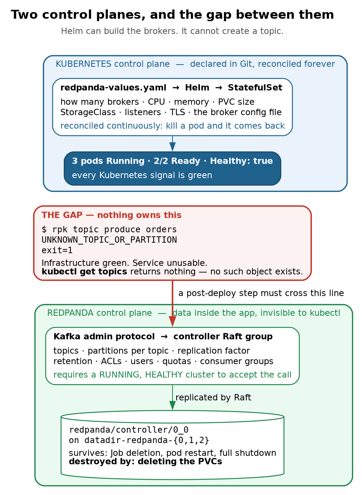
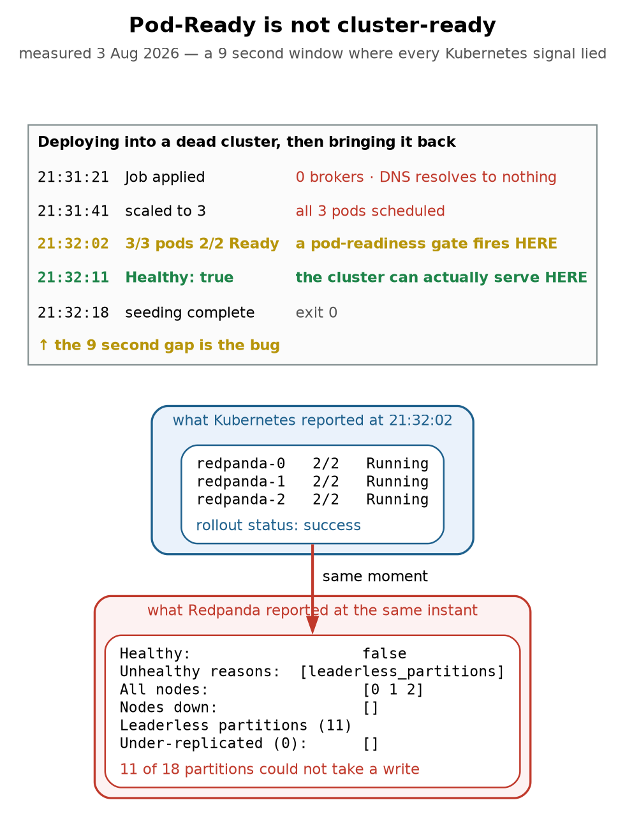
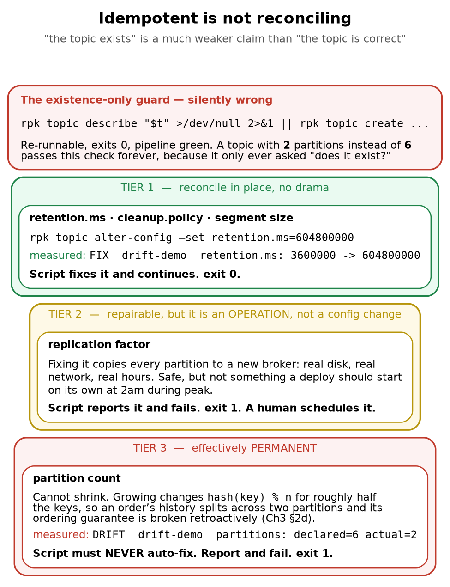

# Chapter 4 — Provisioning Application State: What Kubernetes Doesn't Know

> **Who this chapter is written for.** Andrew is interviewing for an **SRE / DevOps** role on an
> **order management system**. The question behind this chapter is a pipeline question: *you have a
> Helm release that deploys three healthy brokers — how does the thing your application actually
> needs get created, and what happens the second, third and hundredth time the pipeline runs?*

---

## Verified facts header

Run on **`vm-k8-redpanda-1` (192.168.1.186)**, single-node k3s v1.36.2, Redpanda chart `26.1.9` /
`v26.1.12`, on **3 August 2026**. Every command was executed and every output quoted is real.

| Thing | Value as tested |
|---|---|
| Cluster | 3 brokers, `Healthy: true`, 7 days uptime |
| Seeding image | `docker.redpanda.com/redpandadata/redpanda:v26.1.12` (ships `rpk` at `/usr/bin/rpk` and `bash`) |
| In-cluster broker address | `redpanda.redpanda.svc.cluster.local:9093` (headless, see Ch3 §5a) |
| Operator installed | **No** — Helm chart only, so no `Topic` CRDs |
| Manifests | `manifests/seed-topics.sh` (the reconciler) and `manifests/seed-topics-job.yaml` (the Job that runs it) |
| Health endpoint | Admin API `:9644` — **not** the Kafka API `:9093` (§6c) |

**Prerequisite reading:** Chapter 3 §5 (headless Services and how a client connects) and §2d
(why partition count is permanent). This chapter assumes both.

---

## What this chapter covers

1. Two control planes, and the boundary between them
2. The gap, proved — a "successful" deployment that cannot serve a single request
3. Why the broker config file cannot hold topics
4. The seeding Job, written the way everyone writes it first
5. Making it idempotent
6. The readiness race
7. Why idempotent still isn't reconciling
8. The operator alternative
9. What I'd actually put in a pipeline
10. Production gap, commands, glossary, interview questions, self-test

---

## 1. Two control planes

Kubernetes deploys the brokers. It has **no idea what a topic is**.

| Decided by Kubernetes / Helm | Decided by Redpanda itself |
|---|---|
| How many brokers (`statefulset.replicas: 3`) | Topics |
| CPU, memory, disk size, StorageClass | Partitions per topic |
| Networking, listeners, TLS | Replication factor per topic |
| The broker config file | ACLs, users, quotas, consumer groups |

When you run `rpk topic create orders -p 6 -r 3`, **nothing in Kubernetes changes**. That command
speaks the Kafka admin protocol to a broker, which writes the definition into the **controller Raft
group** — the `redpanda/controller/0_0` directory on each broker's PVC. It is replicated by Raft like
any other data.

So in this cluster `kubectl get topics` returns nothing, because no such object exists.



> **The same fact, seen from both sides**
>
> Rebuild from `redpanda-values.yaml` and you get three healthy brokers and **zero topics**. Delete every Kubernetes object used for seeding and **the topics survive untouched**. Because topic state is not Kubernetes state, `helm install` + `rollout status` is not a sufficient deployment gate. It asserts the brokers exist, not that the service can be used.

Two consequences that look contradictory but are the same fact seen from opposite sides:

- **Rebuild the cluster from `redpanda-values.yaml` and you get three healthy brokers and zero
  topics.** Your Helm chart does not describe them.
- **Delete every Kubernetes object involved in seeding and your topics survive untouched.** We proved
  this by accident: after `kubectl delete job seed-topics`, all three topics were still there, and the
  re-run failed with `TOPIC_ALREADY_EXISTS` — only possible because they outlived the Job that made
  them.

The state lives on the volumes:

```
datadir-redpanda-0   Bound   20Gi
datadir-redpanda-1   Bound   20Gi
datadir-redpanda-2   Bound   20Gi
```

It survives Job deletion, pod restarts, broker crashes and full cluster shutdown. It does **not**
survive deleting the PVCs — which is exactly why `market-ticks` had to be recreated after the failed
install on 27 July, when recovery required `kubectl -n redpanda delete pvc --all`. This is also why
`helm uninstall` deliberately leaves StatefulSet PVCs behind (Ch3 §6g).

---

## 2. The gap, proved

A deployment where every Kubernetes signal is green and the service cannot serve a request.

```bash
rpk cluster config get auto_create_topics_enabled
# false

echo '{"order":"ORD-1","qty":100}' | rpk topic produce orders; echo "exit=$?"
```

```
unable to produce record: UNKNOWN_TOPIC_OR_PARTITION: This server does not host this topic-partition.
exit=1
```

```bash
rpk topic consume orders -o :end; echo "exit=$?"
```

```
unable to consume topic "orders": UNKNOWN_TOPIC_OR_PARTITION: This server does not host this topic-partition.
exit=1
```

Both directions fail identically, both exit **1**. Meanwhile:

- Helm reports the release `deployed`
- Every pod is `Running`
- `rpk cluster health` says `Healthy: true`, no nodes down, no leaderless partitions

> **"Infrastructure green" and "service usable" are different assertions, and only one of them is
> being monitored.** A pipeline that stops at `helm install` + `rollout status` will report success
> on a cluster no application can use. This is the same shape as Chapter 2's `Available=True` while
> a rollout was broken: the signal is true, it just isn't answering the question you care about.

---

## 3. Why the broker config cannot hold topics

The natural first instinct is to put topics in a startup config file. It doesn't work, and the reason
is worth understanding.

Redpanda's cluster config can be seeded at bootstrap, but it only holds **cluster properties**:

```
default_topic_partitions      1
default_topic_replications    3
log_segment_size              134217728
```

Those are defaults applied to topics created *later*. There is no field anywhere in the broker config
that says "a topic named `orders` with 6 partitions." Topics are not configuration — they are data in
the controller Raft group, so they can only be created by talking to a **running** cluster over the
admin API. That ordering constraint is what forces everything else in this chapter.

### The shortcut, and why to reject it

```
auto_create_topics_enabled    false
```

Set that to `true` and topics spring into existence the moment any client produces to a name that
doesn't exist. It removes the seeding problem entirely, and you should still not do it:

- New topics inherit `default_topic_partitions`, which is **1** here. One partition means no
  parallelism and, at RF 3, a single leader carrying all traffic.
- **A typo silently creates a topic** instead of erroring. Produce to `oders` and you get a working
  producer writing to a topic nobody will ever consume. With auto-create off you get an immediate,
  unmissable `UNKNOWN_TOPIC_OR_PARTITION`.
- Partition count is effectively permanent (Ch3 §2d), so an accidentally auto-created topic is a
  mistake you cannot cleanly undo once it has data.

**Leave it `false` and seed deliberately.** "We disable auto-create and provision topics explicitly"
is a good sentence in an interview.

---

## 4. The seeding Job, written the way everyone writes it first

Since topics require a running cluster, seeding is a **post-deploy step**. In Kubernetes that's a
`Job`. The chart already demonstrates the pattern — `redpanda-configuration` is a post-install Job
that configured cluster properties once the brokers were reachable.

The broker image is a convenient base: it already ships `rpk`, so no custom image is needed.

```yaml
command: ["/usr/bin/bash","-c"]
args:
  - |
    set -euo pipefail
    B=redpanda.redpanda.svc.cluster.local:9093
    rpk -X brokers=$B topic create orders     -p 6 -r 3
    rpk -X brokers=$B topic create executions -p 6 -r 3
    echo "seeding complete"
```

Note the broker address is the **headless Service name**, not a specific broker (Ch3 §5b). Hardcoding
`redpanda-0…` would make seeding fail whenever broker 0 happened to be down, against a cluster that
could have served the request from either survivor.

**First run against a fresh cluster works perfectly:**

```
TOPIC   STATUS
orders  OK
TOPIC       STATUS
executions  OK
seeding complete
```

Job `Complete`, exit 0, both topics created. This is why the pattern survives code review.

### The second deploy

Nothing changed. Same manifest, re-applied — exactly what a pipeline does on the next release:

```
NAME                READY   STATUS   RESTARTS   AGE
seed-topics-hnqxm   0/1     Error    0          59s
seed-topics-qzz24   0/1     Error    0          90s
seed-topics-w46kq   0/1     Error    0          79s

TOPIC   STATUS
orders  TOPIC_ALREADY_EXISTS: The topic has already been created

Warning  BackoffLimitExceeded  job-controller  Job has reached the specified backoff limit
```

**`rpk topic create` is not idempotent.** Measured exit codes:

| Command | Topic exists | Topic missing |
|---|---|---|
| `rpk topic create` | **exit 1** | exit 0 |
| `rpk topic describe` | exit 0 | exit 1 |

Three pods, because `backoffLimit: 2` means one attempt plus two retries. Then the Job fails
permanently. Nothing is actually wrong — the topics are correct, the cluster is healthy, the
application works — and **the pipeline goes red anyway.**

### The wait that lies

```bash
kubectl -n redpanda wait --for=condition=complete job/seed-topics --timeout=90s; echo "exit=$?"
```

```
error: timed out waiting for the condition on jobs/seed-topics
exit=1
```

The Job was marked `Failed` after about **34 seconds**. The wait sat there for the full **90**, then
reported a *timeout* rather than the actual failure.

> `kubectl wait --for=condition=complete` only ever watches for success. On failure it cannot
> distinguish "still working" from "already dead," so your pipeline is both **slower than necessary**
> and **wrong about the cause**. Someone reading CI sees "timed out waiting for condition" and starts
> investigating cluster performance, while the real message — `TOPIC_ALREADY_EXISTS` — sat in the pod
> logs the whole time.

Two fixes, and you want both: make the Job idempotent so it stops failing, and make the wait able to
observe failure so a genuine problem surfaces fast with the right message.

---

## 5. Making it idempotent

The fix follows directly from the exit-code table in §4. `rpk topic describe` is a clean existence
test, so guard the create with it:

```bash
if ! rpk topic describe "$name" >/dev/null 2>&1; then
  rpk topic create "$name" -p "$want_p" -r "$want_rf"
fi
```

That is the whole idea, and it is enough to stop the pipeline going red on every redeploy.

The runs below use a throwaway topic called `drift-demo` rather than `orders`, so that partition
and replication drift can be inflicted deliberately without damaging a topic the later chapters
depend on. It is not in the shipped `TOPICS` array — to follow along, add it:

```bash
TOPICS=(
  "orders:6:3:retention.ms=604800000"
  "executions:6:3:retention.ms=604800000"
  "orders-v2:6:3:retention.ms=604800000"
  "drift-demo:6:3:retention.ms=604800000"      # add this line
)
```

and then inflict each kind of drift by hand between runs:

```bash
# Tier 1 — a config the script can fix in place
rpk topic alter-config drift-demo --set retention.ms=3600000

# Tier 3 — a partition count it cannot. Recreate it wrong on purpose.
rpk topic delete drift-demo && rpk topic create drift-demo -p 2 -r 3
```

Run against a cluster where the topic is missing, then again with nothing changed:

```
############ RUN 1: topic missing -> creates it
CREATE   drift-demo  partitions=6 rf=3
OK: all topics match declared state
exit=0

############ RUN 2: unchanged -> idempotent, no-op
OK       drift-demo  partitions=6 rf=3
OK: all topics match declared state
exit=0
```

Same manifest, run twice, exit 0 both times. That is what §4's version could not do.

### 5a. Two things worth stealing from the implementation

**`set -uo pipefail`, deliberately without `-e`.** The reflex is `set -euo pipefail`, but here `-e`
is actively wrong: it aborts on the first problem, so a run with three drifted topics reports one
and hides the other two. You then fix it, re-run, and discover the next one — a slow serial reveal
during a deploy window. Without `-e` the script collects every problem in a `drift` counter, prints
them all, and fails once at the end. **A checker should report everything it found, not the first
thing it found.**

**No `jq`.** The natural approach is `rpk topic describe --format json | jq`, but the Redpanda broker
image ships `rpk` and `bash` and no `jq`. Rather than build and maintain a custom image just to add
a JSON parser, the script parses the table output with `awk`:

```bash
have_p=$(awk '/^PARTITIONS/{print $2}' <<<"$summary")
have_rf=$(awk '/^REPLICAS/{print $2}'  <<<"$summary")
```

Slightly less robust in principle, and zero supply chain in practice. Using the broker's own image
also guarantees the `rpk` client version always matches the cluster.

---

## 6. The readiness race

Idempotency solves the *second* deploy. It does nothing for the far nastier problem: the seeding step
can start before the cluster is able to answer it.

This is not hypothetical here. The chart's own `redpanda-configuration` post-install Job hit it on
27 July — one `Error` pod sitting beside a `Complete` one. It was recorded at the time as "normal Job
backoff, raced broker readiness," without recognising it as the canonical failure mode of this entire
pattern.

### 6a. Reproducing it deliberately

Scale the brokers to zero, apply the Job into the outage, then bring the cluster back:

```bash
kubectl -n redpanda scale sts redpanda --replicas=0
kubectl -n redpanda rollout status sts/redpanda --timeout=120s

kubectl apply -f seed-topics-job.yaml     # deploying into a dead cluster
sleep 20
kubectl -n redpanda scale sts redpanda --replicas=3
```

The naive Job cannot survive this, and the reason is arithmetic rather than bad luck. Its retry
budget is `backoffLimit: 2` — three pods, with backoff between them, **about 32 seconds total**. Broker
startup took between 21 seconds and roughly 2 minutes depending on image cache. The Job frequently
exhausts its entire budget before the cluster has finished starting, and is then marked `Failed`
permanently even though the cluster becomes perfectly healthy moments later.

### 6b. Pod-Ready is not cluster-ready

The obvious fix is to wait for the broker pods to be Ready. **That is not sufficient, and this is the
most important measurement in the chapter.** Real timestamps from one run:

```
21:31:21   Job applied            0 brokers running, DNS resolves to nothing
21:31:41   scaled to 3            all 3 pods scheduled
21:32:02   all 3 pods 2/2 Ready   <-- a pod-readiness gate would fire HERE
21:32:11   Healthy: true          <-- the cluster could actually serve HERE
21:32:18   seeding complete
```

For **nine seconds** every Kubernetes signal was green — three pods `Running`, `2/2 Ready`,
`rollout status` reporting success — while the cluster reported:

```
Healthy:                          false
Unhealthy reasons:                [leaderless_partitions]
All nodes:                        [0 1 2]
Nodes down:                       []
Leaderless partitions (11):       [kafka/executions/0 kafka/orders/0 kafka/orders/2 ...]
Under-replicated partitions (0):  []
```

All three brokers up and registered, nothing down, and 11 of 18 partitions unable to accept a write.
The processes had started and joined the cluster before Raft had elected leaders.

It was 11 and not 18 for a reason worth internalising: **each partition is its own independent Raft
group** (Ch3 §3). They elect independently and finish at different times, so seven had completed and
eleven had not. There is no single instant at which "the cluster" becomes ready — only a per-partition
process that a cluster-level health check summarises for you.

Note also `Under-replicated partitions (0)` while 11 partitions were leaderless. With no leader there
is nobody to compute under-replication, so the metric reads zero. That is the **second** time this
metric has lied in a way that would matter at 3am — the first was the two-broker quorum drill in
Ch3 §9b. **Alert on `Leaderless`. Never on `Under-replicated` alone.**



> **Why every simpler gate fails**
>
> **Wait for DNS?** The chart sets `publishNotReadyAddresses: true`, so the headless Service hands out brokers that are not yet accepting connections. Resolution is not a readiness signal.
>
> **Wait for pods Ready?** Measured above: 9 seconds early. Each partition is its own Raft group and elects independently — 7 of 18 had finished, 11 had not. There is no instant when "the cluster" becomes ready.
>
> **Just sleep?** Scheduled→Ready was **21s** here and closer to **2 minutes** with cold images. `sleep 60` would pass today and fail that run; `sleep 180` is safe and wastes 3 minutes on every deploy forever.
>
> **Poll for Healthy: true.** Cost 0s on an already-healthy cluster, 50s here. Self-adjusting, and bounded so a genuinely broken cluster still fails the pipeline.
>
> **Alert on Leaderless, never on Under-replicated alone** — with no leader there is nobody to compute under-replication, so it read `0` while 11 partitions were dead. Second time this metric lied.

### 6c. The fix, and the trap inside the fix

Gate on cluster health, in an init container, so the main container does not even start until the
cluster can serve:

```yaml
initContainers:
  - name: wait-for-cluster-health
    image: docker.redpanda.com/redpandadata/redpanda:v26.1.12
    command: ["/usr/bin/bash", "-c"]
    args:
      - |
        A=redpanda-0.redpanda.redpanda.svc.cluster.local:9644
        A=$A,redpanda-1.redpanda.redpanda.svc.cluster.local:9644
        A=$A,redpanda-2.redpanda.redpanda.svc.cluster.local:9644
        for i in $(seq 1 120); do
          if rpk -X admin.hosts=$A cluster health 2>/dev/null | grep -qE '^Healthy:[[:space:]]+true'; then
            echo "cluster healthy after $(( (i-1)*5 ))s"; exit 0
          fi
          echo "waiting for cluster health... ${i}/120"
          sleep 5
        done
        echo "ERROR: cluster did not reach Healthy:true within 600s"; exit 1
```

**The trap:** the first version of this used `-X brokers=` and hung for five minutes against a cluster
that was demonstrably healthy. `rpk cluster health` is an **Admin API** call on **:9644**. `-X brokers=`
sets the **Kafka API** (:9093) broker list and is *silently ignored* by this subcommand, so rpk fell
back to its default of `127.0.0.1:9644` — which inside a seeding pod is nothing at all:

```
unable to request cluster health: Get "http://127.0.0.1:9644/v1/cluster/health_overview":
dial tcp 127.0.0.1:9644: connect: connection refused
```

It was doubly misleading because testing the same command from inside `redpanda-0` *worked* — there,
localhost:9644 really is a broker's admin API. The lesson generalises well beyond rpk: **a health gate
that cannot reach its target is indistinguishable from a target that is unhealthy.** This one failed
closed for entirely the wrong reason, and would have blocked every deploy while pointing the
on-call engineer at the cluster instead of at the manifest.

Topic operations use `-X brokers=` (:9093). Cluster operations use `-X admin.hosts=` (:9644).

### 6d. Why the simpler gates don't work

| Gate | Why it fails |
|---|---|
| Wait for DNS to resolve | The chart sets `publishNotReadyAddresses: true`, so the headless Service hands out brokers that are **not yet accepting connections**. Resolution is not a readiness signal. |
| Wait for pods `Ready` | Measured 9 seconds too early (§6b). |
| `sleep N` | Scheduled→Ready was **21s** with warm images and closer to **2 minutes** cold. `sleep 60` passes today and fails that run; `sleep 180` is safe and wastes 3 minutes on **every** deploy forever. |
| Poll for `Healthy: true` | Costs **0s** on an already-healthy cluster and took **50s** here. Self-adjusting, and bounded so a genuinely broken cluster still fails the pipeline. |

Verified both ways — against a healthy cluster the guard is free:

```
cluster healthy after 0s
OK       orders  partitions=6 rf=3
OK       executions  partitions=6 rf=3
OK: all topics match declared state
```

and through the full outage it absorbed both phases without failing:

```
waiting for cluster health... 1/120
...
waiting for cluster health... 10/120
cluster healthy after 50s
OK       orders  partitions=6 rf=3
OK       executions  partitions=6 rf=3
OK: all topics match declared state
```

### 6e. The structural point

**The retry moved from the pod level to inside the container**, and that is the part worth being able
to explain.

The naive Job retried by *dying and being recreated*, so its patience was governed by `backoffLimit`
— and that single knob controls both "how long will we tolerate a slow dependency" and "how many
times do we retry a genuine error." You cannot raise one without raising the other.

The guard retries in a loop inside one long-lived init container, which **decouples the two budgets**:
a 600-second wait for a slow cluster, with `backoffLimit: 2` still governing real failures. A slow
start is absorbed patiently; a broken cluster still turns the pipeline red within a bounded time.

---

## 7. Idempotent is not reconciling

The §5 guard is re-runnable, which feels like the finish line. It isn't. It converges on
**presence**, not on **correctness** — it only ever asks *does this topic exist?*

Create a topic by hand with the wrong shape — 2 partitions where the manifest declares 6 — and the
existence-only guard reports success forever. The pipeline is green. The topic is wrong. Nobody finds
out until an ordering bug surfaces in production, and by then the fix is the one thing you cannot
safely do (Ch3 §2d).

So the script has to compare shape, not just existence. What it should do about a mismatch depends
entirely on the field, which sorts into three tiers.



> **The design rule**
>
> A reconciler should fix what is **cheap and reversible**, and refuse to fix what is **expensive or destructive** — loudly, with a non-zero exit, naming the field and both values. The failure mode to avoid is not "the script could not fix it." It is **"the script reported success on a cluster that was wrong"** — which is exactly what the existence-only guard does, and why a green pipeline is not evidence of a correct topic.
>
> **For Tier 3 the only real defence is prevention:** auto-create off, partition count reviewed at creation, and sized for growth up front, because it is the one number you can never take back.

### 7a. Tier 1 — reconcile in place

Retention, cleanup policy, segment size. Cheap, instant, reversible. Just fix them:

```
############ introduce drift by hand
retention.ms                          3600000        DYNAMIC_TOPIC_CONFIG

############ RUN 3: should FIX it in place
OK       drift-demo  partitions=6 rf=3
FIX      drift-demo  retention.ms: 3600000 -> 604800000
OK: all topics match declared state
exit=0

retention.ms                          604800000      DYNAMIC_TOPIC_CONFIG
```

Detected, corrected, exit 0, and the follow-up `describe` confirms it stuck.

**Where does 7 days come from, though?** `retention.ms=604800000` has been sitting in the spec since
§5 as if it were self-evident, and for an order journal at a broker-dealer it is worth defending —
because two plausible-sounding alternatives are both wrong.

*Not* `cleanup.policy=compact`. Compaction keeps the latest record per key and discards the rest,
which for `orders` keyed by `order_id` means keeping the last event of each order and **throwing
away its fill history**. That destroys the exact thing Chapter 6's `seq` check reads, and it does it
silently, in the background, weeks after someone set the flag. Compaction is right for a *current
state* topic — the latest position per account — and wrong for an event journal.

*Not* multi-year retention on broker disk either, even though broker-dealer order records carry
regulatory retention measured in years (SEC Rule 17a-4 and the FINRA rules that lean on it). Those
obligations also demand things a Kafka topic does not provide — a durable, non-rewriteable format,
and the ability to produce specific records on request. The pattern is to treat the topic as the
*transport and short-term buffer*, and to land an immutable copy in archival storage (tiered
storage, or a consumer writing to object storage with a retention lock) which is what the regulator
actually reads.

So the 7 days is sized against **operational** need, not legal need: long enough to replay a bad
deploy, re-run a day's positions, or bootstrap a new consumer group from the start of the week, and
short enough that the brokers' local disks are not the system of record. That framing — retention
answers "how far back can I replay", archival answers "what must I be able to produce in five
years" — is the answer to give when someone asks why the number is what it is.

### 7b. Tier 2 — repairable, but it is an operation

Replication factor. Technically fixable, but the fix copies every partition to another broker: real
disk, real network, potentially hours. That is a maintenance activity, not something a deploy should
silently kick off at 2am during peak trading. **Report it, fail, let a human schedule it.**

### 7c. Tier 3 — effectively permanent

Partition count. Cannot shrink. Growing it changes `hash(key) % n` for roughly half the keys, so an
order's history splits across two partitions and its ordering guarantee is broken *retroactively*
(Ch3 §2d). The script must never, under any circumstances, auto-fix this:

```
############ RUN 4: should REPORT and FAIL, not silently pass
DRIFT    drift-demo  partitions: declared=6 actual=2  << NOT AUTO-FIXABLE

FAILED: declared state not reached. See DRIFT lines above.
exit=1
```

### 7d. The design rule

Fix what is cheap and reversible. Refuse to fix what is expensive or destructive — loudly, with a
non-zero exit, naming the field and both values.

> The failure mode to design against is not *"the script could not fix it."* It is **"the script
> reported success on a cluster that was wrong."** A green pipeline is evidence that the checks
> passed, not that the topic is correct — and those are only the same statement if the checks
> actually compare the thing you care about.

For Tier 3 the only real defence is prevention: auto-create off, partition count reviewed at
creation time, and sized for growth up front, because it is the one number you can never take back.

---

## 8. The operator alternative

The Redpanda Operator adds custom resources, so a topic becomes an object Kubernetes genuinely knows
about:

```yaml
apiVersion: cluster.redpanda.com/v1alpha2
kind: Topic
metadata:
  name: orders
spec:
  partitions: 6
  replicationFactor: 3
  additionalConfig:
    retention.ms: "604800000"
```

What that buys you over a Job:

| | Job | Operator |
|---|---|---|
| Runs | Once, at deploy | Continuously reconciles |
| Drift **detected** | At deploy time only (§7) | Continuously |
| Drift **corrected** | Tier 1 fixed in place; Tier 2/3 reported and the deploy fails (§7) | Tier 1 the same; Tier 2/3 still need a human |
| Visibility | `rpk` only | `kubectl get topics` |
| Ordering | You handle readiness (§6) | Controller retries until healthy |
| Cost | One YAML file | Another controller to run, upgrade and monitor |

Be precise about that middle pair, because it is the row people wave at to justify an operator and
it is not as one-sided as "Job: undetected". §7 is the section where the Job *does* detect drift —
it fixes retention in place and fails the deploy on partition and replication drift. The real
difference is **when**, not whether: the Job only looks when you deploy, so drift introduced at
11 a.m. on a Tuesday sits undiscovered until the next release. And an operator does not magically
fix Tier 3 either — you cannot reduce a partition count by reconciling harder.

The honest trade-off: for a three-broker lab with two topics, the Job is proportionate. For
production with many topics across teams, the operator earns its keep — topic definitions become
reviewable pull requests instead of somebody's shell history, and drift gets fixed rather than
discovered during an incident.

**Same pattern, wider than Redpanda.** Schema Registry subjects, OpenSearch index templates, database
migrations and Kafka ACLs are all this identical problem: state that lives inside an application,
created after the application is running, invisible to Kubernetes. Chapters 5 and 6 hit it again.

---

## 9. What I'd actually put in a pipeline

Putting §5 through §7 together, a deploy of this service has four stages, and the interesting design
decisions are all about *where the gates go* and *what turns the build red*.

```
1. helm upgrade --install redpanda -f redpanda-values.yaml
      gate: kubectl rollout status sts/redpanda
      asserts: the brokers exist and their pods are Ready
      does NOT assert: the cluster can serve a request

2. seed-topics Job
      initContainer: poll Admin API until Healthy: true    (bounded, 600s)
      container:     reconcile declared topics             (idempotent + drift-checking)
      gate: kubectl wait --for=condition=complete job/seed-topics
      asserts: every declared topic exists with the declared shape

3. smoke test
      produce one record to each topic and read it back
      asserts: the thing the application will actually do, works

4. deploy the application
```

Points worth being able to defend:

**The topic spec is a reviewed artefact, not shell history.** The declared list lives in
`seed-topics.sh` in Git, mounted into the Job from a ConfigMap. Changing a partition count is a pull
request with a diff, which is the only control that reliably stops Tier 3 mistakes.

```bash
kubectl -n redpanda create configmap topic-spec \
  --from-file=seed-topics.sh=seed-topics.sh --dry-run=client -o yaml | kubectl apply -f -
```

**Stage 1's gate is deliberately weak, and that's fine** as long as you know it. `rollout status` is
an infrastructure assertion. Stage 2 and 3 are the service assertions. The mistake is stopping after
stage 1 and calling the deploy verified.

**Stage 3 exists because stages 1 and 2 can both pass on a broken system.** Stage 2 proves the
metadata is right; only an actual round-trip proves a client can use it.

**`ttlSecondsAfterFinished: 3600`.** Without it, every deploy leaves dead pods behind and
`kubectl get pods` becomes unreadable exactly when you need it during an incident.

**Fail red on Tier 2 and Tier 3 drift.** Tempting to warn and continue so deploys aren't blocked by
something that "isn't really broken." Don't: a warning in CI output is a warning nobody reads, and
these are precisely the two categories that get more expensive the longer they go unnoticed.

### 9a. The `kubectl wait` trap, restated

From §4: `kubectl wait --for=condition=complete` only ever watches for success, so on failure it
burns the full timeout and then reports a *timeout* instead of the actual error. Run both conditions
concurrently and take whichever fires first, so a genuine failure surfaces immediately with the right
message:

```bash
kubectl -n redpanda wait --for=condition=complete job/seed-topics --timeout=600s & ok=$!
( kubectl -n redpanda wait --for=condition=failed job/seed-topics --timeout=600s && exit 1 ) & bad=$!

wait -n $ok $bad; rc=$?          # capture IMMEDIATELY -- see below

kubectl -n redpanda logs job/seed-topics --all-containers
kill $ok $bad 2>/dev/null        # whichever waiter is still running
exit $rc
```

Then always print the logs, on success and failure alike — the useful message
(`TOPIC_ALREADY_EXISTS`, or a `DRIFT` line) is in the pod, not in the `wait` output.

**Two things in that snippet are easy to get wrong, and I got both wrong first.**

The `exit 1` is inside a subshell, so it exits *the subshell*, not your script. It does not fail the
pipeline. What actually carries the failure is `wait -n`, which returns the exit status of whichever
job finished — and that is a **status you have exactly one command to capture**. My original version
ended the block at `wait -n $ok $bad` and read correctly in isolation. Then the next sentence says
"always print the logs", and the moment you follow that instruction:

```
$ bash wait-original.sh; echo "exit = $?"
exit = 0                # the failure is gone; $? now belongs to kubectl logs
```

A deploy gate that reports success on every failed seed, introduced by adding a log line. Hence
`rc=$?` on the same line, before anything else runs.

The `kill` matters too: the losing waiter otherwise sits there for the remaining timeout. Harmless
in a shell, an accumulating pile of processes in a CI runner that does this on every deploy.

Verified both paths on bash 5.3 — failure returns 1 with the logs printed, success returns 0
immediately rather than waiting out the loser's timeout.

---

## 10. Where this sandbox differs from production

| Here | Production |
|---|---|
| Two topics in a bash array | Many topics across teams; a spec file per service, or an operator with `Topic` CRDs |
| Job triggered by `kubectl apply` | Helm `post-install,post-upgrade` hook, or an ArgoCD sync wave, so ordering is declared rather than remembered |
| Topic spec in a ConfigMap built by hand | ConfigMap rendered by the chart from values, so spec and release version together |
| Script runs once per deploy | Operator reconciles continuously; drift is corrected between deploys, not just discovered at deploy |
| `retention.ms` is the only Tier 1 field checked | Also `cleanup.policy`, `min.insync.replicas`, `max.message.bytes`, per-topic compression |
| No ACLs | Topics created with an owning principal and ACLs, provisioned in the same step |
| Drift found only when the pipeline runs | A scheduled reconcile job or an alert on spec-vs-actual, so drift is found in minutes, not at the next release |
| `admin.hosts` over plaintext | mTLS to the Admin API, credentials from a Secret, never in the manifest |
| Single node, so "3 brokers" share a failure domain | Real anti-affinity across nodes and zones (Ch3 §6c) |

The single biggest gap is the fourth row. Everything in this chapter runs **at deploy time**, so
between deploys the cluster can drift and nothing notices. That is the structural argument for the
operator in §8, and it is the honest answer to "why would you ever run a controller for this?"

---

## 11. Commands to know by heart

```bash
# ---- the boundary: k8s knows nothing about these ----
rpk topic list
rpk topic describe orders
rpk topic create orders -p 6 -r 3          # exit 1 if it already exists
rpk topic describe orders >/dev/null 2>&1  # exit 0 = exists  (the idempotency guard)

# ---- cluster-level config (what a bootstrap file CAN set) ----
rpk cluster config get auto_create_topics_enabled
rpk cluster config get default_topic_partitions

# ---- drift: compare shape, not just existence (see §7) ----
rpk topic describe orders            # PARTITIONS / REPLICAS summary
rpk topic describe orders -c         # per-topic configs, incl. retention.ms
rpk topic alter-config orders --set retention.ms=604800000   # Tier 1 fix

# ---- the two DIFFERENT endpoints (see §6c) ----
rpk -X brokers=redpanda.redpanda.svc.cluster.local:9093 topic list      # Kafka API
rpk -X admin.hosts=redpanda-0.redpanda.redpanda.svc.cluster.local:9644 \
    cluster health                                                      # Admin API

# ---- seeding Jobs ----
kubectl -n redpanda create configmap topic-spec \
  --from-file=seed-topics.sh=seed-topics.sh --dry-run=client -o yaml | kubectl apply -f -
kubectl -n redpanda logs job/seed-topics -c wait-for-cluster-health
kubectl -n redpanda logs job/seed-topics -c seed
kubectl -n redpanda get pods -l job-name=seed-topics
kubectl -n redpanda describe job seed-topics | tail -12
kubectl -n redpanda delete job seed-topics --ignore-not-found

# ---- waiting properly (see §4, §9a) ----
kubectl -n redpanda wait --for=condition=complete job/seed-topics --timeout=600s
kubectl -n redpanda wait --for=condition=failed   job/seed-topics --timeout=600s

# ---- reproducing the readiness race (see §6a) ----
kubectl -n redpanda scale sts redpanda --replicas=0
kubectl -n redpanda scale sts redpanda --replicas=3
kubectl -n redpanda get pods -l app.kubernetes.io/name=redpanda \
  -o jsonpath='{range .items[*]}{.metadata.name}{" ready="}{range .status.conditions[?(@.type=="Ready")]}{.lastTransitionTime}{end}{"\n"}{end}'
```

---

## 12. Glossary

| Term | Meaning |
|---|---|
| **Control plane (Kubernetes)** | Manages pods, storage, networking. Knows nothing of topics. |
| **Control plane (Redpanda)** | The controller Raft group; holds topics, ACLs, cluster config. |
| **Seeding / bootstrapping** | Creating application-level state after the application is running. |
| **Idempotent** | Re-running produces the same result without error. Converges on *presence*. |
| **Reconciling** | Continuously corrects live state to match declared state. Converges on *correctness*. |
| **`auto.create.topics.enable`** | Creates topics implicitly on first produce. Off here, deliberately. Redpanda spells it **`auto_create_topics_enabled`** — same knob, and this chapter uses both spellings because `rpk` accepts only the second while every Kafka document you will read uses the first. |
| **`retention.ms`** | How long records survive before deletion. Sized for how far back you can replay, *not* for regulatory retention — that belongs in archival storage (§7a). |
| **`cleanup.policy=compact`** | Keeps only the latest record per key. Correct for a current-state topic, destructive for an event journal, and it does its damage silently (§7a). |
| **Post-install hook** | A Helm-managed Job that runs after the release is applied. |
| **`backoffLimit`** | Retries before a Job is marked `Failed`. `2` means three pods total. |
| **Operator / CRD** | A controller plus custom resource types, making app state a Kubernetes object. |
| **Init container** | Runs to completion before the main container starts. Used here as the health gate. |
| **`ttlSecondsAfterFinished`** | Auto-deletes a finished Job so dead pods stop cluttering `get pods`. |
| **`publishNotReadyAddresses`** | Service setting that puts not-ready pods in DNS. True here, so **resolution is not readiness**. |
| **Admin API (`:9644`)** | Cluster operations — health, config, broker membership. What `cluster health` uses. |
| **Kafka API (`:9093`)** | Client and topic operations. What `-X brokers=` sets, and what `cluster health` ignores. |
| **Drift** | Live state diverging from declared state. Tiered here by whether it is safe to auto-repair. |
| **Fail closed** | Refusing to proceed when a check can't be completed. Safe, but §6c shows it can mislead. |

---

## 13. Interview questions this material answers

Short, defensible answers. The value is that each one is backed by something measured on this
cluster, so the follow-up "have you actually seen that happen?" has a real answer.

**"Walk me through deploying a Kafka/Redpanda-backed service."**
Four stages (§9): brokers via Helm gated on `rollout status`; topics via a health-gated, idempotent
Job gated on Job completion; a produce/consume smoke test; then the application. The key point is
that the first gate only asserts infrastructure — `helm install` plus `rollout status` will report
success on a cluster that cannot serve a single request, because topics are not Kubernetes objects.

**"Your deploy pipeline went red but the service is fine. What happened?"**
Almost certainly a non-idempotent seeding step. `rpk topic create` exits 1 with
`TOPIC_ALREADY_EXISTS`, so the Job succeeds on first deploy and fails on every one after. Guard with
`rpk topic describe`, which exits 0 when the topic exists.

**"Your seeding job fails intermittently on fresh environments only."**
A readiness race. The retry budget (`backoffLimit: 2`, roughly 32 seconds) is shorter than broker
startup (21s to 2 minutes here, depending on image cache), so it exhausts its retries before the
dependency is available. Fix with an init container that polls for cluster health, which decouples
the wait budget from the failure budget.

**"Why not just wait for the pods to be Ready?"**
Because pod-Ready is not cluster-ready. Measured a 9-second window where all three brokers were
`2/2 Ready` and 11 of 18 partitions were still leaderless — each partition is its own Raft group and
they elect independently. Waiting for DNS is worse still: `publishNotReadyAddresses: true` means the
name resolves to brokers that aren't accepting connections yet.

**"Why not `sleep 120`?"**
Because the correct value is unknowable and changes per environment. Startup was 21 seconds here with
warm images and near 2 minutes cold. Any fixed sleep is either too short sometimes or wasting minutes
on every deploy always. Polling costs zero when the cluster is already healthy.

**"What's the difference between an idempotent script and a reconciling one?"**
Idempotent converges on *presence* — safe to re-run, exits 0. Reconciling converges on *correctness*
— it compares live shape against declared shape. An existence-only guard reports success forever on a
topic with 2 partitions where 6 were declared, which is how a green pipeline coexists with a wrong
cluster.

**"You find a topic with the wrong partition count. Fix it."**
I don't, not automatically. Growing a partition count changes `hash(key) % n` for about half the keys,
so an order's history splits across two partitions and ordering breaks retroactively. Shrinking isn't
possible at all. The correct move is to fail the pipeline loudly and treat it as a migration —
typically a new correctly-shaped topic and a controlled cutover. That's why I sort drift into fix
in place / schedule as an operation / never auto-fix.

**"What would you alert on for this cluster?"**
`Leaderless partitions` and `Nodes down`. Explicitly **not** `Under-replicated` on its own — I've
watched it read 0 twice while the cluster was badly degraded, because with no leader there's nobody
to compute it.

**"Would you use the operator?"**
Depends on scale and on whether drift between deploys matters. A Job is proportionate for a handful
of topics owned by one team. The operator earns its keep when topic definitions belong in pull
requests across teams and you need drift corrected continuously rather than discovered at the next
release — the honest limitation of everything in this chapter is that it only runs at deploy time.

**"Why is `auto.create.topics.enable` off?"**
New topics would inherit `default_topic_partitions`, which is 1 here — no parallelism, one leader
carrying everything. Worse, a typo silently creates a working producer writing to a topic nobody
consumes, and since partition count is effectively permanent that's a mistake you can't cleanly undo.
With it off you get an immediate `UNKNOWN_TOPIC_OR_PARTITION`.

---

## 14. Check yourself

1. You rebuild the cluster from `redpanda-values.yaml`. What do you get, and what is missing? (§1)
2. Where does a topic definition physically live? What does it survive, and what kills it? (§1)
3. Every pod is `Running` and `rpk cluster health` is green. Why might the service still be unusable? (§2)
4. Why can't topics go in the broker's startup config? (§3)
5. Give two concrete reasons not to enable `auto_create_topics_enabled`. (§3)
6. Why should a seeding Job dial the headless Service name instead of `redpanda-0`? (§4, Ch3 §5b)
7. `rpk topic create` on an existing topic — what's the exit code, and why does that break a pipeline? (§4)
8. Which `rpk` command gives a clean existence test, and what are its exit codes? (§4)
9. Your Job failed at 34s but `kubectl wait` took 90s and reported a timeout. Explain both, and fix it. (§4, §9a)
10. Name the one field an idempotent seeding script cannot safely fix. (§7, Ch3 §2d)
11. When is an operator worth running, and when is a Job proportionate? (§8)
12. Name three non-Redpanda examples of this same provisioning problem. (§8)
13. Why is `set -e` the wrong choice in a drift-checking script? (§5a)
14. Why parse `rpk` table output with `awk` instead of `--format json | jq`? (§5a)
15. All three broker pods are `2/2 Ready`. Name two reasons that doesn't mean seeding will succeed. (§6b, §6d)
16. Why were 11 of 18 partitions leaderless rather than all 18? (§6b, Ch3 §3)
17. `Under-replicated partitions (0)` during a serious outage — why, and what do you alert on instead? (§6b)
18. A health gate hangs for 5 minutes against a healthy cluster. What's the first thing you check? (§6c)
19. Which rpk operations use `:9093` and which use `:9644`? What happens if you pass the wrong flag? (§6c)
20. Why does moving the retry into an init container help, when the Job already had `backoffLimit`? (§6e)
21. Give an example of Tier 1, Tier 2 and Tier 3 drift, and what a pipeline should do with each. (§7)
22. A pipeline is green. What does that prove about your topics, and what does it not? (§7d)
23. Why run a produce/consume smoke test when the seeding Job already exited 0? (§9)
24. What is the single biggest limitation of the deploy-time approach in this chapter? (§10)

---

## What's next

- **Chapter 5 — consumer groups and rebalancing**: who owns which partition, what a rebalance
  costs, and the difference a SIGTERM makes over a SIGKILL.
- **Chapter 6 — the application**: the client-side settings (`acks`, `enable.idempotence`,
  partitioner choice) that decide whether the pipeline is correct.
- **Chapter 7 — Schema Registry**: this same provisioning problem, with subjects instead of
  topics.
