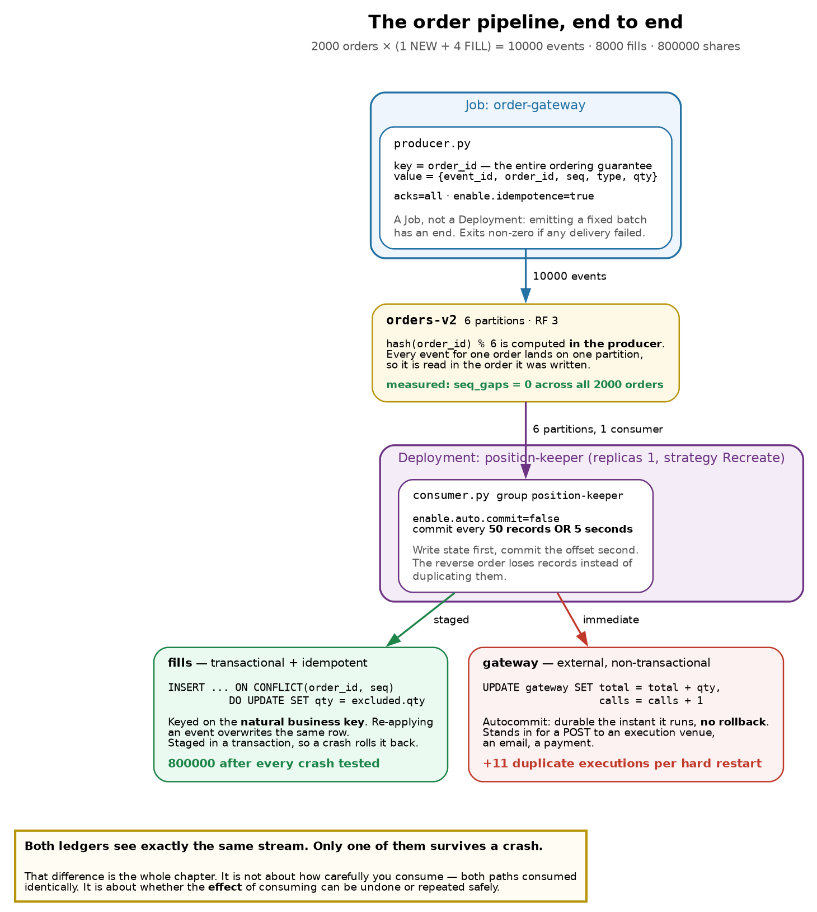
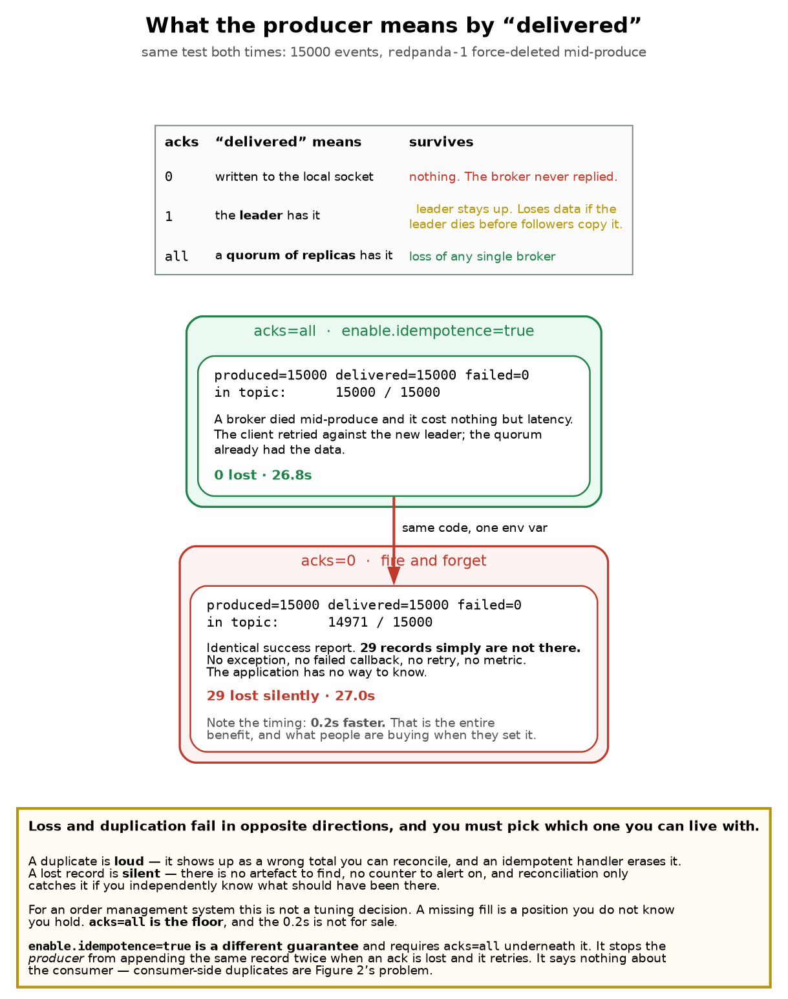
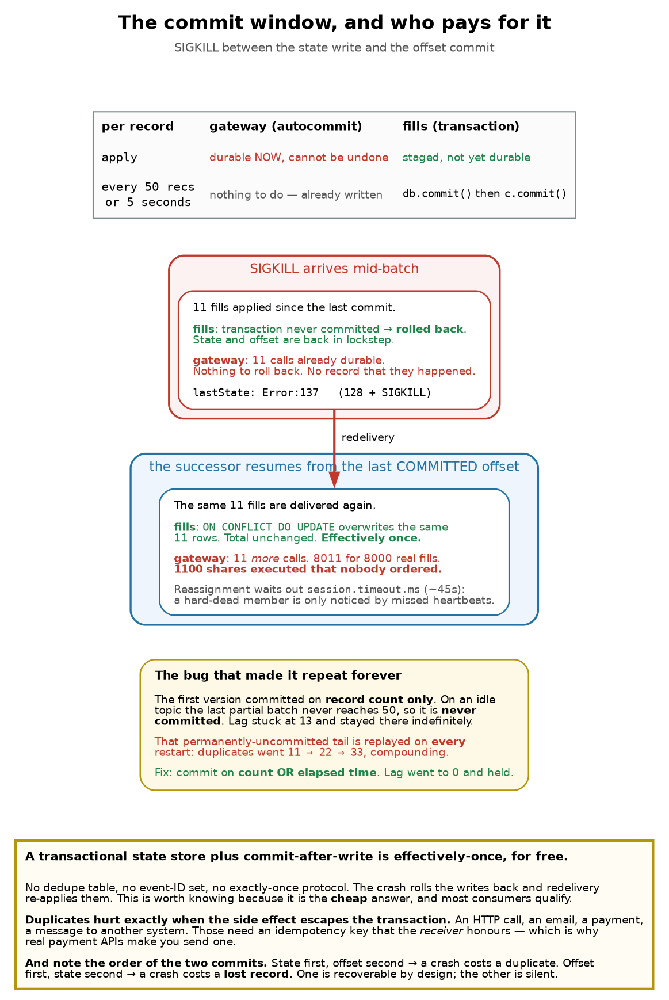

# Chapter 6 — The Application: Producing, Consuming, and Surviving a Crash

> **Who this chapter is written for.** Andrew is interviewing for an **SRE / DevOps** role on an
> **order management system**. Chapters 3–5 covered the platform: brokers, topic provisioning,
> consumer groups. This chapter is the first one with *our own code* in it. It is where the
> abstractions from Chapter 5 stop being diagrams and start being a number that is wrong by
> 1,100 shares.
>
> The chapter is deliberately built around **four things that went wrong while building it**. Three
> were my own bugs. All four are more instructive than the working version.

---

## Verified facts header

Run on **`vm-k8-redpanda-1` (192.168.1.186)**, single-node k3s v1.36.2, Redpanda `v26.1.12`, on
**3 August 2026**. Every command was executed and every number quoted is measured.

| Thing | Value as tested |
|---|---|
| Language / client | Python 3.12.3, `confluent-kafka` **2.6.1** (librdkafka 2.6.1) |
| Image | `oms:dev`, built with Docker 29.6.2, side-loaded into k3s containerd |
| Topic | `orders-v2` — 6 partitions, RF 3 |
| Workload | **2000 orders × (1 NEW + 4 FILL) = 10,000 events**, 8,000 fills, **800,000 shares** |
| Consumer group | `position-keeper`, 1 member |
| Assignment strategy | **`range`** — note this is *not* Chapter 5's `cooperative-sticky` (§12) |
| Group coordinator | node 2, at `__consumer_offsets/14` |
| Commit policy | explicit, every **50 records or 5 seconds** (§10 explains the "or 5 seconds") |

**Prerequisite reading:** Chapter 5 in full — this chapter is its practical half. Chapter 3 §2
(partitions, offsets, keys) and Chapter 2 §4 (deployment strategies) are assumed.

---

## What this chapter covers

1. The shape of the application, and why it is two entrypoints in one image
2. The producer: what the key buys you, and what `acks` actually promises
3. `acks=0` measured — 29 records lost while the producer reported total success
4. Getting an image into k3s when there is no registry
5. The consumer: explicit commits, and why the *order* of two commits decides loss vs duplication
6. **The crash that produced zero duplicates** — and why that was the finding, not a broken demo
7. **The crash that did** — when the side effect escapes the transaction
8. **The bug that made it repeat forever** — the tail that never commits
9. `kubectl delete pod --force` is not a SIGKILL, and what is
10. The fix, and ordering proven rather than assumed
11. Chapter 5's skew prediction, tested at 2000 keys
12. What it cost, client differences, production gaps, runbook, glossary, interview questions

---

## 1. The shape of the application



Two programs, one container image, one topic, two ledgers:

| Piece | Kubernetes object | Why that object |
|---|---|---|
| `producer.py` | **Job** `order-gateway` | Emitting a fixed batch of orders *has an end*. It exits non-zero on any delivery failure, so `backoffLimit` and `kubectl wait` behave the way Chapter 4 §9 wants. |
| `consumer.py` | **Deployment** `position-keeper` | A consumer runs forever. One replica, `strategy: Recreate`. |
| state | **PVC** `position-state` | The ledgers must survive the crash — that is the entire experiment. |

Two details in that table are load-bearing and easy to get wrong.

**`strategy: Recreate`, not `RollingUpdate`.** A rolling update surges a second pod before removing
the first. Two pods cannot mount the same `ReadWriteOnce` volume, so the new pod blocks on the PVC
forever while the old one refuses to die. The rollout hangs until `progressDeadlineSeconds` and you
get a `ProgressDeadlineExceeded` that looks like a scheduling problem. This is Chapter 2 §4's
`maxSurge` lesson, arriving from an unexpected direction: **the surge is only free if nothing the
pod holds is exclusive.**

**One replica, when there are six partitions.** Chapter 5 §2 established that partition count is the
parallelism ceiling, so this leaves five sixths of the available parallelism unused. That is
deliberate: one consumer makes the arithmetic in this chapter unambiguous. A production position
keeper would be a **StatefulSet** sized to the partition count, one volume per replica.

### The event shape

Every field exists to make one specific failure visible.

```json
{"event_id":"3f2a…","order_id":"ORD-42","seq":3,"type":"FILL","qty":100}
```

| Field | Why it exists |
|---|---|
| `event_id` | Unique per event. A dedupe key, if you need one. (§7 shows why you often don't.) |
| `order_id` | **The partition key.** The only reason per-order ordering works at all. |
| `seq` | Per-order sequence number, so the consumer can **prove** ordering rather than assume it. |
| `qty` | Filled quantity. Turns "processed twice" into a **visibly wrong number**. |

And the arithmetic is fixed so the correct answer is knowable without any coordination between the
two programs:

```
FILLS_PER_ORDER (4) × FILL_QTY (100) = 400 shares per order
2000 orders                          = 800,000 shares, from 8,000 fills
```

That constant is the reconciliation baseline for the whole chapter. Any number that is not 800,000
is a bug with a story attached.

---

## 2. The producer

```python
p.produce(
    TOPIC,
    key=order_id.encode(),        # <- the whole ordering guarantee
    value=encode(event),
    on_delivery=on_delivery,      # <- the only place failure is reported
)
```

Three things worth saying out loud.

**The key is the ordering guarantee, and it is computed client-side.** `hash(order_id) % 6` happens
*in the producer* (Chapter 5 §3). The record arrives at the broker pre-addressed. Every event for
`ORD-42` lands on the same partition and is therefore read in the order it was written. Drop the
key and you get round-robin, and a `CANCEL` can be processed before the `NEW` it cancels.

**Delivery is asynchronous, and the callback is the only truth.** `produce()` enqueues; it does not
send. Success or failure arrives later in `on_delivery`. A program that calls `produce()` in a loop
and exits has sent nothing. Hence:

```python
remaining = p.flush(30)
if stats["failed"] or remaining:
    sys.exit(1)
```

`flush()` returns the number of messages **still unsent** after the timeout. Ignoring that return
value is how a batch job reports success while silently dropping its tail.

**`enable.idempotence` requires `acks=all`.** librdkafka refuses the combination outright, and the
refusal is the lesson: producer idempotence is *built on* acks=all, not an alternative to it. It
solves exactly one problem — the producer sent a record, the ack was lost in flight, the producer
retried, and the record was appended **twice**. A sequence number per producer session lets the
broker discard the retry. It says nothing whatsoever about the consumer.

---

## 3. `acks` measured: the silent 29



| `acks` | "delivered" means | Survives |
|---|---|---|
| `0` | written to the local socket | **nothing** — the broker never replied |
| `1` | the **leader** has it | leader staying up |
| `all` | a **quorum of replicas** has it | loss of any single broker |

The test: produce 15,000 events at a throttled rate, and force-delete `redpanda-1` mid-produce.
Same code both times, one environment variable different.

```
acks=all   produced=15000 delivered=15000 failed=0   in topic: 15000 / 15000   26.8s
acks=0     produced=15000 delivered=15000 failed=0   in topic: 14971 / 15000   27.0s
```

**Read those two lines carefully, because they are identical where it matters.** Both runs report
`delivered=15000 failed=0`. One of them is missing 29 records. There was no exception, no failed
callback, no retry, no metric, no log line. The application cannot know. The only way I detected it
was by independently counting what was in the topic afterwards.

The benefit purchased for those 29 records was **0.2 seconds**.

This is the asymmetry that matters for an order management system:

- A **duplicate is loud.** It shows up as a total that disagrees with reconciliation, and an
  idempotent handler erases it entirely.
- A **lost record is silent.** There is no artefact to find and no counter to alert on. A missing
  fill is a position you do not know you hold.

`acks=all` is the floor for order flow. The 0.2s is not for sale.

> **Nuance worth having ready.** `acks=all` means a **quorum**, not every replica — Redpanda uses
> Raft, so a 3-replica partition acknowledges once 2 of 3 have it. That is why the broker kill cost
> latency and nothing else: the surviving two already had the data and one of them became leader.

---

## 4. Getting the image into k3s with no registry

There is no registry in this lab, and `docker build` alone is not enough. k3s uses **its own
containerd instance** with its own image store, and it cannot see Docker's. The image must be
exported and imported explicitly:

```bash
docker build -t oms:dev .
docker save oms:dev | sudo k3s ctr images import -
sudo k3s ctr images ls -q | grep oms:dev        # verify, or you will debug this via ErrImagePull
```

And the manifest **must** say:

```yaml
imagePullPolicy: IfNotPresent    # or Never
```

The default for a tag that is not `:latest` is `IfNotPresent`, so this often works by accident — but
being explicit documents that the image is side-loaded. Leave the policy at `Always` and the kubelet
will try to pull `oms:dev` from Docker Hub, fail, and give you an `ErrImagePull` that looks like a
network problem rather than a missing registry.

> **Rebuilds need the import too.** Every code change is `build.sh` again. Forgetting the import
> step means Kubernetes cheerfully runs the *previous* image and your fix appears not to work. The
> `build.sh` in `education/app/` does both and verifies, for exactly this reason.

---

## 5. The consumer, and the order of two commits

```python
"enable.auto.commit": False,
```

Auto-commit commits on a timer, in the background, **whether or not you have finished processing**.
It converts a duplicate into a lost record, which §3 just established is the worse failure. So:
explicit commits only.

The processing loop reduces to:

```python
apply_event(db, gw, event)                       # 1. do the work
...
if since_commit >= COMMIT_EVERY or elapsed:      # 2. periodically:
    db.commit()                                  #    a. make state durable
    c.commit(asynchronous=False)                 #    b. THEN commit the offset
```

**Step (a) before step (b) is the entire design.**

| Order | Crash between them costs | Recoverable? |
|---|---|---|
| state → offset | the records are processed **again** | yes, if the handler is idempotent |
| offset → state | the records are **never processed** | no — silent, permanent |

Committing the offset first is the more natural way to write it, and it is data loss with extra
steps.

Note also that commits are **periodic, not per-record**. Committing after every record would be
correct and unusably slow — an offset commit is a round-trip to the group coordinator. So a window
always exists. Chapter 5 §7 put it as: *duplicates = throughput × time since last commit.* Tuning
`COMMIT_EVERY` changes the size of the window. It never closes it.

---

## 6. The crash that produced zero duplicates

Here is where the chapter earns its keep.

The plan was straightforward: maintain two ledgers, hard-kill the consumer mid-stream, and watch
the naive accumulating ledger inflate while the idempotent upsert ledger stayed correct. Both
ledgers were tables in the same SQLite database.

I killed it at ~6,200 records processed. The successor caught up. Result:

```
expected          = 800000
idempotent ledger = 800000
naive ledger      = 800000
OVER-COUNTED BY   = 0     (0 fills replayed)
```

**Zero duplicates. The demo failed.** Except it didn't — that result is a genuinely useful thing to
know, and I had built the mechanism without noticing.

Both ledgers were written inside the **same SQLite transaction**, and that transaction was committed
immediately before the offset commit. When the process was SIGKILLed mid-batch:

1. The staged SQLite writes were **rolled back** — they had never been committed.
2. The offset had **also** not been committed.
3. The state and the offset were therefore still in **lockstep**, at the previous commit boundary.
4. Redelivery re-applied exactly the records that had been rolled back.

Net effect: **effectively-once, with no dedupe logic at all.**

> **This is the cheap answer, and most consumers qualify for it.** If your state lives in one
> transactional store and you commit the offset after the transaction, at-least-once delivery is
> already harmless. No dedupe table, no event-ID set, no exactly-once protocol, no Kafka
> transactions. It is worth knowing because it is free, and because it tells you precisely when you
> *do* need something more.

So the naive ledger was not modelling anything dangerous. It was protected by the same transaction
as the safe one. To show the real failure I had to model the thing that actually hurts.

---

## 7. The crash that did: when the side effect escapes



The dangerous case is a side effect that **cannot be rolled back**: a POST to an execution venue, an
email, a payment, a message to another system. So the second ledger became a **separate SQLite file
on an autocommit connection** — every write durable the instant it runs, no rollback, no
idempotency key. A stand-in for an HTTP call that has already left the building.

```python
gw = sqlite3.connect(GATEWAY, isolation_level=None)   # autocommit: no take-backs
...
gw.execute("UPDATE gateway SET total = total + ?, calls = calls + 1 WHERE id = 1", (qty,))
db.execute("INSERT INTO fills … ON CONFLICT(order_id, seq) DO UPDATE SET qty = excluded.qty", …)
```

> **Bug #2, and it is a good one.** My first attempt at this used two *connections to the same file*
> rather than two files. It deadlocked. SQLite's write lock is held by the transactional connection
> from its first write until `commit()`, so the autocommit connection was starved on every single
> event, sat on its 5-second busy timeout, and the consumer crawled to **one record processed**. The
> pod looked healthy — `1/1 Running`, no restarts, no errors in the log, just a startup banner and
> then silence. **A hung consumer and a healthy consumer look identical from `kubectl get pods`.**
> The only signal was lag not moving. Separate files fixed it, and is the truer model anyway: the
> execution venue is a *different system*, not another table in your database.

Now the same hard kill, with the same 8,000 fills:

```
truth                    : 8000 fills / 800000 shares
transactional idempotent : rows=7989  total=798900     ← 11 staged, will settle at exactly 8000
external gateway         : calls=8011  total=802200
DUPLICATES               : 11 executions, 1100 shares over-executed
```

**Eleven duplicate executions.** The transactional ledger is unharmed — it shows 7,989 only because
11 upserts were staged and not yet committed at the moment I read it; committed, it lands on
exactly 8,000, forever, no matter how many times you crash it. The gateway is permanently wrong and
there is no artefact anywhere that says so.

For an OMS: 1,100 shares were executed that nobody ordered. Not mispriced, not delayed — executed.

**The fix is not tuning.** It is an idempotency key that the *receiver* honours. This is exactly why
every serious payment API makes you send one: the receiver, not the sender, is the only party that
can deduplicate a side effect it has already performed.

---

## 8. The bug that made it repeat forever

Then I noticed something worse. Lag was stuck at **13** and would not clear:

```
t+10s  lag=13
t+30s  lag=13
t+60s  lag=13     … indefinitely
```

The consumer was not stuck. It had *processed* those 13 records. It had not **committed** them,
because my commit trigger was record-count only:

```python
if since_commit >= COMMIT_EVERY:      # 50
```

On an idle topic the final partial batch never reaches 50, so **the tail of the stream is never
committed**. And that turns a one-off window into a permanent one. Every restart replays the same
13 records:

| Restart | Gateway calls | Duplicate executions |
|---|---|---|
| clean | 8000 | 0 |
| 1st hard kill | 8011 | **11** |
| 2nd hard kill | 8022 | **22** |

It compounds. Forever. A pod that restarts nightly would re-execute the same 11 fills every night.

The fix is one clause:

```python
if since_commit >= COMMIT_EVERY or time.time() - last_commit >= COMMIT_SECONDS:
```

plus the same check on the idle path, when `poll()` returns nothing:

```python
if msg is None:
    if since_commit and time.time() - last_commit >= COMMIT_SECONDS:
        flush_commit()
```

That second one matters. Without it a topic that goes quiet still never commits its tail, because
the commit check only ran when a message arrived.

Measured after the fix — lag reaches 0 and **stays** there:

```
t+10s  lag=0    t+20s  lag=0    t+30s  lag=0    t+40s  lag=0    t+50s  lag=0    t+60s  lag=0
```

> **The operational tell.** Non-zero lag on an idle topic that never drains is almost always a
> commit-policy bug, not a slow consumer. A slow consumer's lag *changes*. Chapter 5 §4's advice to
> alert on **max per-partition lag** would have caught this; a "total lag" dashboard showing 13 out
> of 10,000 would not have raised an eyebrow.

---

## 9. `kubectl delete pod --force` is not a SIGKILL

Buried in §6 is a second reason that first demo produced no duplicates. This is how I had been
"hard killing" the consumer:

```bash
kubectl delete pod $POD --force --grace-period=0
```

That is documented as skipping the grace period, and I had been treating it as a SIGKILL. **From the
application's point of view it frequently isn't.** The container runtime may still deliver SIGTERM,
and my consumer has a SIGTERM handler that commits and closes the group cleanly. A fast process
finishes its shutdown path before anything harder arrives. I was running the *graceful* path while
believing I was testing the hard one.

`kill -9 1` from inside the container does not work either: the kernel shields PID 1 of a namespace
from signals it has no handler for, and SIGKILL cannot have a handler.

What actually works is killing the process from the **node**, where it is an ordinary process:

```bash
pgrep -ax python                       # the container process is visible on the host
sudo kill -9 <pid>
```

And the proof that it landed:

```
restartCount: 1
lastState:    Error:137          # 128 + 9 = SIGKILL
```

Two things to notice. First, `137` is how you confirm a hard kill after the fact — and it is the
same exit code an **OOM kill** produces, which is the most common way this happens in production.
Second, the pod name did not change and `restartCount` incremented: this was a **container restart
in place**, not a pod replacement (Chapter 1 §7). The PVC, the pod IP, and the node assignment all
stayed put. Only the process died.

> **A caveat on measuring this.** After a hard kill, the group does not reassign immediately. The
> coordinator only notices a dead member when heartbeats stop, which takes `session.timeout.ms`
> (librdkafka's default is **45 seconds**). I sampled the ledgers at 35s twice and saw no change,
> and briefly thought the duplicates had stopped compounding. They hadn't — I was reading before the
> replay had happened. **A graceful `SIGTERM` leaves the group explicitly and reassigns instantly;
> a hard kill costs you a session timeout of downtime on those partitions.** That is a real
> availability difference, not just a data one.

---

## 10. The clean run: ordering proven, not assumed

With the commit fix in place, a full run from an empty topic:

```
processed=10000 idempotent_total=800000 gateway_total=800000 gateway_calls=8000
                seq_gaps=0 seq_replays=0

orders with complete 4-fill history : 2000/2000   malformed: 0
transactional idempotent            : rows=8000  total=800000
external gateway                    : calls=8000  total=800000
duplicates                          : 0
TOTAL-LAG                           : 0
```

`seq_gaps=0` is the part worth dwelling on. The consumer tracks the last `seq` seen per `order_id`
and counts two different anomalies:

```python
if seq <= prev:      replays += 1     # same events delivered again
elif seq > prev + 1: gaps    += 1     # something arrived out of order, or was lost
```

Zero gaps across 2,000 independent orders is **ordering demonstrated**, not assumed. Every order's
`NEW → FILL → FILL → FILL → FILL` arrived in sequence, because every one of those five events
carried the same key and therefore landed on the same partition.

This is also a cheap production check worth stealing. If your events carry a per-entity sequence
number, the consumer can detect ordering violations *itself*, continuously, for the cost of one
dictionary. It is far better than discovering the problem during reconciliation the next morning.

---

## 11. Chapter 5's skew prediction, tested

Chapter 5 §3 measured brutal skew — 12 keys across 6 partitions put **42% of all traffic on
partition 2** and left partition 0 completely empty. The caveat attached to that finding was:
*don't over-learn the demo; this is small-numbers skew, and it self-corrects at realistic key
cardinality.*

This run had **2,000 distinct keys** instead of 12. The distribution:

| Partition | 0 | 1 | 2 | 3 | 4 | 5 |
|---|---|---|---|---|---|---|
| Records | 1625 | 1740 | 1675 | 1590 | 1705 | 1665 |

Spread from 1,590 to 1,740 — a **9.4% span**, against a perfectly even 1,666.7. The prediction
holds, measured.

That contrast is the useful takeaway, and it is a genuinely good interview answer: **key skew is a
function of key cardinality, not of partitioning.** Before you treat uneven partitions as a
problem, count your distinct keys. With thousands of them, hashing is fine and unevenness is noise.
The real pathology is a *single hot key* — one account generating 40% of order flow — and no amount
of repartitioning fixes that, because all of that key's events must stay on one partition to
preserve its ordering. That needs a composite key (`account-shard-N`) or a dedicated topic.

---

## 12. Two things that surprised me

**The assignment strategy is not the one from Chapter 5.**

```
BALANCER    range
```

Chapter 5 measured `cooperative-sticky`, because that is what `rpk` defaults to. `confluent-kafka`
defaults to **`range`**, which is the older *eager* protocol: on any rebalance every consumer
revokes **all** its partitions, then the group reassigns from scratch — a stop-the-world pause for
the whole group. `cooperative-sticky` moves only the partitions that need to move.

With one consumer this is invisible. With thirty it is the difference between a rebalance nobody
notices and a periodic full-group stall. **The lesson is that "the group's rebalance behaviour" is a
property of the clients, not the cluster** — and a mixed fleet of clients with different defaults
is a genuinely nasty thing to debug.

**A durable side effect per event is expensive.**

| Configuration | Throughput |
|---|---|
| transactional writes only (batched commit) | ~1,550 events/s |
| plus one autocommit (fsync) write per event | ~200 events/s |

Roughly **8× slower**, and nothing about the Kafka side changed. The cost was entirely the
per-event `fsync`. This is the honest counterweight to §7: making every side effect immediately
durable is not free, which is exactly why real systems batch, and why batching is what creates the
replay window in the first place. **The window is not carelessness; it is the price of throughput.**

---

## 13. Where this sandbox differs from production

| Sandbox | Production |
|---|---|
| One consumer replica | StatefulSet sized to partition count, one volume per replica |
| SQLite on a local-path PVC | A real database, or a state store with proper HA |
| Image side-loaded via `ctr import` | A registry, with immutable digests rather than `:dev` |
| `oms:dev` tag reused for every build | Immutable tags — reusing a tag makes rollbacks meaningless |
| Gateway is a SQLite table | An actual venue API, with an idempotency key it honours |
| No TLS, no SASL | mTLS between clients and brokers, ACLs per principal |
| No schema | Schema Registry with a compatibility mode (Chapter 7) |
| No liveness probe on the consumer | A probe that fails when the poll loop stalls — see below |

That last row is worth its own line, because §7 handed me the reason. A consumer stuck on a lock
was `1/1 Running` with a clean log and zero restarts. **Kubernetes cannot tell a working consumer
from a hung one**, because "the process is alive" is all a default health check knows. A liveness
probe that checks *"have I processed a record, or deliberately idled, in the last N seconds"* would
have caught it in 30 seconds. Chapter 2 §5 built the probe machinery; this is the workload that
actually needs it.

---

## 14. Runbook — reproducing every result in this chapter

All commands run on `vm-k8-redpanda-1`. Source lives in `education/app/`.

### Build and load

```bash
cd ~/oms
./build.sh                       # docker build + k3s ctr import + verify
```

### Clean slate

```bash
kubectl -n market delete deploy position-keeper --ignore-not-found
kubectl -n market delete pvc position-state --ignore-not-found
sleep 8
rpk topic delete orders-v2; rpk group delete position-keeper
rpk topic create orders-v2 -p 6 -r 3
```

### Baseline: produce, then consume

```bash
# 2000 orders = 10000 events = 800000 shares
kubectl -n market run bulk-gateway --restart=Never --image=oms:dev \
  --image-pull-policy=IfNotPresent \
  --env=BROKERS=redpanda.redpanda.svc.cluster.local:9093 --env=TOPIC=orders-v2 \
  --env=ORDERS=2000 --env=ACKS=all --env=IDEMPOTENCE=true \
  --command -- python producer.py
kubectl -n market logs bulk-gateway

kubectl apply -f k8s/consumer.yaml
kubectl -n market logs -f deploy/position-keeper
```

### Read the ledgers at any time

```bash
POD=$(kubectl -n market get pod -l app=position-keeper -o jsonpath='{.items[0].metadata.name}')
kubectl -n market exec $POD -- python -c "
import sqlite3
db=sqlite3.connect('/state/positions.db'); gw=sqlite3.connect('/state/gateway.db')
rows=db.execute('SELECT COUNT(*) FROM fills').fetchone()[0]
idem=db.execute('SELECT COALESCE(SUM(qty),0) FROM fills').fetchone()[0]
t,calls=gw.execute('SELECT total,calls FROM gateway WHERE id=1').fetchone()
print(f'idempotent rows={rows} total={idem}')
print(f'gateway calls={calls} total={t}   duplicates={calls-8000}')"
```

### Demo A — `acks=0` silent loss (§3)

```bash
rpk topic create acks-zero -p 6 -r 3
kubectl -n market run acks-gw --restart=Never --image=oms:dev --image-pull-policy=IfNotPresent \
  --env=BROKERS=redpanda.redpanda.svc.cluster.local:9093 --env=TOPIC=acks-zero \
  --env=ORDERS=3000 --env=ACKS=0 --env=IDEMPOTENCE=false --env=RATE=600 \
  --command -- python producer.py
sleep 12
kubectl -n redpanda delete pod redpanda-1 --force --grace-period=0    # kill a broker mid-produce

kubectl -n market logs acks-gw | grep ^produced          # claims 15000 delivered, 0 failed
rpk topic describe acks-zero -p | awk 'NR>1{s+=$NF} END{print s}'   # actually 14971
```

Re-run with `ACKS=all IDEMPOTENCE=true` for the control.

### Demo B — a real SIGKILL and duplicate executions (§7, §9)

```bash
pgrep -ax python                 # find the consumer as the NODE sees it
sudo kill -9 <pid>               # NOT kubectl delete --force; see §9

kubectl -n market get pod -l app=position-keeper \
  -o jsonpath='{.items[0].status.containerStatuses[0].lastState.terminated}{"\n"}'
# expect reason Error, exitCode 137

sleep 60                         # session.timeout.ms ~45s before reassignment
# then read the ledgers: gateway calls exceed 8000, idempotent total does not move
```

> Do **not** use `pkill -9 -f "python consumer.py"` — the pattern matches the shell running it and
> kills your own session. `pgrep -ax python` then `kill -9 <pid>` is safe.

### Demo C — the tail that never commits (§8)

Set `COMMIT_SECONDS` to a huge value to restore the bug, then watch lag stall:

```bash
kubectl -n market set env deploy/position-keeper COMMIT_SECONDS=999999
watch -n5 "rpk group describe position-keeper | grep TOTAL-LAG"   # sticks at a non-zero number
kubectl -n market set env deploy/position-keeper COMMIT_SECONDS=5  # lag drains to 0 and holds
```

### Useful one-liners

```bash
# records actually in a topic (NF works because the [0 1 2] replicas column splits into 3 fields)
rpk topic describe orders-v2 -p | awk 'NR>1{s+=$NF} END{print s}'

# per-partition distribution, for the skew check in 11
rpk group describe position-keeper | tail -n +3 | awk '{print $2, $5}'

# confirm the exit code of the last container death
kubectl -n market get pod $POD -o jsonpath='{.status.containerStatuses[0].lastState.terminated.exitCode}'
```

---

## 15. Glossary

| Term | Meaning |
|---|---|
| **Delivery callback** | Asynchronous per-record result from the producer. The only place a produce failure is reported. |
| **`flush()`** | Blocks until queued records are delivered; returns the count **still unsent**. A non-zero return is silent data loss if ignored. |
| **Producer idempotence** | Broker-side dedupe of *producer retries* via a per-session sequence number. Requires `acks=all`. Unrelated to consumer duplicates. |
| **Quorum ack** | `acks=all` means a majority of replicas, not all of them. 2 of 3 for RF 3. |
| **Effectively-once** | At-least-once delivery plus an idempotent handler, so replay is harmless. Not a protocol — a property of your code. |
| **Idempotency key** | A caller-supplied unique ID that lets the **receiver** discard a repeated request. The only defence for non-transactional side effects. |
| **Commit window** | Records processed since the last offset commit. The maximum replay on a crash. |
| **Eager vs cooperative rebalance** | `range` revokes everything from everyone; `cooperative-sticky` moves only what must move. A **client** setting. |
| **Exit code 137** | 128 + SIGKILL(9). A hard kill — force-delete, node-level kill, or the OOM killer. |
| **Side effect** | Anything the handler does that is not in the transaction. The reason idempotency is ever needed. |

---

## 16. Interview questions this material answers

**Q: Walk me through what `acks=all` guarantees and what it costs.**
It means a quorum of replicas has the record before the producer is told it succeeded — 2 of 3 for
RF 3, since Redpanda uses Raft. It costs a round-trip to the followers. I measured it: killing a
broker mid-produce with `acks=all` cost latency and zero records; the identical run with `acks=0`
reported `delivered=15000 failed=0` and 29 records were simply not in the topic. The producer had
no way to know. For order flow I treat `acks=all` as a floor, because a duplicate is loud and
recoverable while a lost fill is silent.

**Q: Your consumer crashes. How do you make sure you don't process the same message twice?**
The honest answer is you don't — you make processing it twice harmless. I'd first ask where the
state lives. If it's a single transactional store, write the state and commit the offset *after* the
transaction; a crash rolls the write back and redelivery re-applies it cleanly. I tested that and
got zero duplicates across 8,000 records with no dedupe logic at all. The problem is side effects
that leave the transaction — an HTTP call to a venue. There the only real defence is an idempotency
key the receiver honours. In my test that path over-executed 11 fills, 1,100 shares, silently.

**Q: Does it matter whether you commit the offset before or after processing?**
It's the whole decision. State first then offset means a crash costs duplicates, which an idempotent
handler absorbs. Offset first then state means a crash costs records that are never processed —
silent and unrecoverable. I'd always take the recoverable failure.

**Q: Lag on one of your consumer groups is stuck at 13 and not moving. Where do you look?**
A stuck number rather than a growing one usually isn't a slow consumer — a slow consumer's lag
changes. I'd suspect a commit policy that only triggers on record count, so the final partial batch
never commits on an idle topic. I hit exactly this. The nasty part is it isn't cosmetic: that
uncommitted tail is replayed on every restart, so duplicates compound — I watched them go 11, then
22. The fix is committing on count *or* elapsed time, including on the idle path when poll returns
nothing.

**Q: How would you verify ordering is actually preserved?**
Put a per-entity sequence number in the event and have the consumer track the last one seen per key.
A gap means reordering or loss; a regression means replay. I ran 2,000 orders of 5 events each and
measured zero gaps, which demonstrates ordering rather than assuming it. It costs one dictionary and
runs continuously, which is much better than finding out at reconciliation.

**Q: One of your partitions has far more traffic than the others. What do you do?**
First count distinct keys, because the answer differs. With few keys it's small-numbers hashing
noise — I measured 42% on one partition with 12 keys, and 9% spread with 2,000 keys, same code.
That self-corrects. A genuinely hot key is different, and adding partitions won't help, because all
of that key's events must stay together to preserve its ordering. That needs a composite key or a
dedicated topic — a data modelling change, not a capacity one.

**Q: How do you test that your service handles a hard kill?**
Carefully, because it's easy to test the wrong thing. I assumed `kubectl delete pod --force
--grace-period=0` was a SIGKILL; it often still delivers SIGTERM, and my handler shut down cleanly,
so I was testing the graceful path while believing I was testing the hard one. `kill -9 1` inside
the container doesn't work either — the kernel shields PID 1 from unhandleable signals. I killed
the process from the node and confirmed it with `lastState.terminated.exitCode: 137`, which is also
what an OOM kill looks like.

**Q: A pod is `1/1 Running` with no restarts but doing no work. How would you catch that?**
That happened to me — a lock contention bug left the consumer processing one record with a clean
log and no restarts. Kubernetes only knew the process was alive. The signal was lag not moving. The
fix is a liveness probe tied to actual progress: fail if no record has been processed and the
consumer isn't deliberately idle within N seconds. Liveness should assert the work is happening, not
that the process exists.

**Q: When would you actually use Kafka transactions / exactly-once?**
When the loop stays inside the cluster — consume, transform, produce, commit offsets atomically in
the same transaction. That's a real guarantee and it's worth using. It stops being available the
moment a side effect leaves the cluster, which for an OMS is most of the interesting ones. Then it's
at-least-once plus idempotency, and the guarantee has to live in the receiver.

---

## 17. Check yourself

1. Why is `order_id` the message key rather than `event_id`?
2. What does `produce()` return, and why is that not "the message was sent"?
3. What does a non-zero return from `flush()` mean, and what happens if you ignore it?
4. Why does `enable.idempotence=true` refuse to work with `acks=1`?
5. In the `acks=0` test, why couldn't the producer detect the 29 lost records?
6. Which failure is worse for an OMS — a duplicate or a lost record? Why?
7. Why must the image be imported into k3s separately after `docker build`?
8. What breaks if `imagePullPolicy` is left at `Always` in this lab?
9. Why is the consumer Deployment `strategy: Recreate` instead of `RollingUpdate`?
10. Why is `enable.auto.commit=false` a correctness setting and not a performance one?
11. Which comes first, the state commit or the offset commit? What does the other order cost?
12. Explain why the first hard-kill test produced zero duplicates in both ledgers.
13. What is "effectively-once", and what does it require of your state store?
14. Why did two SQLite connections to one file hang the consumer instead of erroring?
15. How did the pod appear in `kubectl get pods` while it was hung?
16. Why did the gateway ledger over-count when the transactional one didn't?
17. Why did lag stick at exactly 13 and never drain?
18. Why does the idle path (`msg is None`) also need a commit check?
19. Why did duplicates go 11 → 22 → 33 instead of staying at 11?
20. Why isn't `kubectl delete pod --force --grace-period=0` a reliable SIGKILL test?
21. Why can't you `kill -9 1` from inside the container?
22. What is exit code 137, and what are three ways to get it?
23. Why did reassignment take ~45 seconds after the hard kill but nothing after a SIGTERM?
24. What does `seq_gaps=0` prove that `processed=10000` does not?
25. Chapter 5 measured 42% skew; this chapter measured 9%. What changed, and what didn't?
26. Why is `BALANCER range` here but `cooperative-sticky` in Chapter 5?
27. Why is a per-event durable side effect 8× slower, and what does that imply about the commit window?
28. What liveness probe would have caught the hang in §7, and why wouldn't a default one?

---

## What's next

**Chapter 7 — Schema Registry.** Every event in this chapter was hand-rolled JSON with no contract.
Nothing stops a producer from renaming `qty` to `quantity` and silently breaking the consumer at
3 a.m. Chapter 7 puts a schema in front of the topic and works through compatibility modes — and
reuses Chapter 4's provisioning pattern to register schemas as part of a deployment.

**Later:** OpenSearch and Fluent Bit for log shipping (Chapter 8), and the failure drills
(Chapter 9), where we break each piece on purpose and write the runbook from what actually happened.
