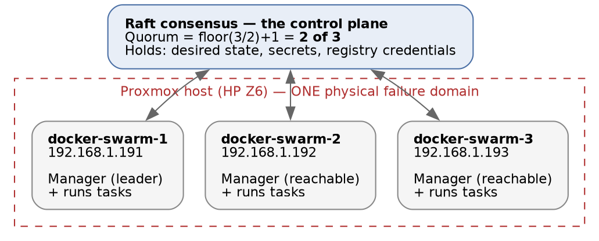

# Docker Swarm · Chapter 1 — Building the Cluster

> **Series:** Home-Lab Education · Phase 16 (Docker Swarm)
> **Built and verified:** August 13, 2026 on VMs 191/192/193 (`192.168.1.191–193`)
> **Versions at time of writing:** Docker 29.7.2 · Compose v5.4.0 · Ubuntu 24.04 LTS (template 9000)
> **Read this before:** Chapter 2 (shipping to it), Chapter 5 (breaking it on purpose), Chapter 6
> (false greens — where the track's threads converge)

---

## What this chapter covers

Three virtual machines became a working Docker Swarm with two commands. This chapter is about **why
three**, why **all of them are managers**, and what `docker swarm init` silently created on your
network while you weren't looking.

The provisioning is deliberately skimmed. This lab has cloned VMs from template 9000 many times and
that story is told elsewhere; repeating it here would bury the subject. What gets explained is the
infrastructure **as it pertains to a cluster** — the decisions that would be the same on any three
machines anywhere.

---

## 1. Why three nodes, and why two would be worse than one

[Start with the arithmetic, because every other design choice follows from it]{custom-style="Key"}.

Swarm's control plane is a **Raft** cluster. Raft only accepts a change when a **majority** of
managers agree. That majority is called **quorum**, and it is:

```
quorum = floor(N / 2) + 1
```

Work it out for small clusters and something counter-intuitive appears:

| Managers | Quorum needs | Can survive losing | Comment |
|---|---|---|---|
| 1 | 1 | **0** | No fault tolerance, but honest about it |
| **2** | **2** | **0** | 🚨 **Strictly worse than 1** — twice the failure surface, still zero tolerance |
| 3 | 2 | **1** | The first configuration that actually tolerates a failure |
| 4 | 3 | 1 | Same tolerance as 3, more machines, more coordination |
| 5 | 3 | 2 | The next real step up |

[Two managers is the trap. It *looks* like redundancy and delivers none]{custom-style="Key"} — with
two managers, [quorum is two, so **either** failure costs you the control plane]{custom-style="Key"}. You have doubled the
number of machines that can break you while buying nothing. Adding a second manager to a single-manager
cluster makes your availability worse.

Note also that **[3 and 4 tolerate the same single failure]{custom-style="Key"}.** Managers come in useful odd numbers; the
[even one above each odd number is pure cost]{custom-style="Key"}. This is why production Swarms are 3, 5, or 7 managers and
never 4.

> **The distinction to have ready:** [losing quorum does **not** stop your application]{custom-style="Key"}. Containers keep
> running and keep serving traffic, [because the *workers* need no consensus to keep doing what they]{custom-style="Key"}
> were last told. What you lose is the whole management plane — and this is broader than the obvious
> "no deploys, no scaling": ✅ **[the drill showed that management *reads* fail too]{custom-style="Key"}.** With quorum gone,
> `docker service ls` and `docker node ls` return errors rather than stale answers, so you cannot even
> *list* what the cluster is running from a manager. [Your inventory during the outage is `docker ps`]{custom-style="Key"}
> node by node, and `curl` from outside. Degraded is not down, and Chapter 5 §2 walks the whole hour,
> because **[the instinct to "just restart it" is what turns a serving cluster into a real outage]{custom-style="Key"}.**

---

## 2. What we built



| | |
|---|---|
| Nodes | `docker-swarm-1/2/3` at `192.168.1.191/192/193` |
| Each | 2 vCPU, 4 GB RAM, 40 GB on the `vm-ephemeral` pool |
| Roles | **All three are managers, and all three also run application tasks** |
| Built from | Proxmox template 9000, Ubuntu 24.04, cloned by a re-runnable script |

Two things about that table are choices rather than defaults, and both are explained below: every node
carries both roles (§5), and all three live on one physical host (§6).

### Storage: why `vm-ephemeral` and not `vm-critical`

Because **[nothing on these nodes is authoritative]{custom-style="Key"}.** The whole cluster is reproducible from a template
and a script in minutes, the application's data is self-bootstrapped demo data, and the entire point
of the lab is to break things and roll back. [Paying for redundant storage to protect state you intend]{custom-style="Key"}
to destroy is the wrong trade. [Choose a storage tier by asking what it would cost to lose the data,
not by how important the machine feels.]{custom-style="Key"}

### The disk had to grow before Docker would fit

Template 9000 carries a 3.5 GB root disk — fine for a utility VM, not for a node that pulls container
images. The provisioning script resizes to 40 GB, and because the template's cloud-init runs
`growpart`, the filesystem expands to fill the new partition on first boot with no manual step.

⚠️ **[A resize is not an expansion]{custom-style="Key"}.** `qm resize` makes the *virtual disk* bigger; the partition table
[and filesystem inside it do not care until something tells them to]{custom-style="Key"}. Without `growpart` you get a 40 GB
disk with a 3.5 GB filesystem on it, `df -h` reports the old size, and the failure arrives later as a
confusing `no space left on device` while the hypervisor insists there is plenty. Confirm with `df -h`,
not with `qm config`.

---

## 3. Provisioning as a re-runnable script

The three VMs were created by [`scripts/provision_nodes.sh`](scripts/provision_nodes.sh), run on the
Proxmox host. The mechanics of `qm clone` are assumed knowledge here. **The property worth studying is
that [every step checks the current state before acting]{custom-style="Key"}:**

```bash
if qm config "$id" >/dev/null 2>&1; then
    echo "[$id] VM already exists - skipping clone"
else
    qm clone "$TEMPLATE" "$id" --name "$name" --full --storage "$STORAGE"
fi
```

[This is **idempotence**, and it matters more than it looks]{custom-style="Key"}. A provisioning script that only works on a
[clean slate is a script you are afraid of]{custom-style="Key"}. When it fails halfway — and it will, on a typo in node three
— you are left picking apart a half-built cluster by hand, in exactly the state where you understand
it least. An idempotent script turns that into: fix the typo, run it again.

[The test for idempotence is not "does it run twice without erroring". It is "does running it twice
leave the same state as running it once".]{custom-style="Key"} `qm set` passes that test because it
declares final values. [A script that appended a line to a config file would not]{custom-style="Key"}.

> **Lab vs PROD — the provisioning tool.** *In the lab:* a bash script calling `qm`, checking state
> with `if` blocks. *Why it's acceptable here:* three nodes, one operator, and the script is legible
> in one screen — which is itself the reason it gets read and trusted. *In production:* Terraform or
> the equivalent, where the desired state is declared and a real state file tracks drift, plus
> configuration management for what happens inside the guest. *If you carry the habit:* hand-rolled
> idempotence works until two people run it at once, or until someone changes a node by hand and your
> `if` block [cheerfully skips the correction because the object exists]{custom-style="Key"}. **Existence checks are not
> drift detection** — [our script would not notice a node someone had resized to 20 GB]{custom-style="Key"}.

### One thing that went wrong, and is worth your time

The node personalization script installed **Chrome and Cursor** on all three headless servers. It
detects a desktop by looking for `gsettings`, which the Ubuntu cloud image happens to ship, so the
check reported "desktop" on a machine with no display. 2.2 GB per node.

⭐ **The general lesson: [a feature detection test is only as good as its correlation with the thing]{custom-style="Key"}
you actually care about.** `gsettings` exists implies there is a user at a screen was true when the
check was written and quietly stopped being true. This class of bug does not announce itself, because
[the script succeeds — it simply does the wrong work]{custom-style="Key"}. The fix ([`scripts/post_setup.sh`](scripts/post_setup.sh))
purges the packages and is itself idempotent.

---

## 4. `swarm init` — what those two commands actually created

Forming the cluster is genuinely two commands. On the first node:

```bash
docker swarm init --advertise-addr 192.168.1.191
```

Then on each of the other two, using the **manager** token:

```bash
docker swarm join --token <manager-token> 192.168.1.191:2377
```

### 🚨 The token trap

`docker swarm init` prints a **worker** join token and an invitation to use it. Follow that prompt for
your other two nodes and [you get a one-manager cluster with two workers]{custom-style="Key"} — which looks like a
three-node cluster, [reports three nodes in `docker node ls`, and **has zero fault tolerance.**]{custom-style="Key"} The
manager token is a separate command:

```bash
docker swarm join-token manager     # the one you want for a 3-manager cluster
docker swarm join-token worker      # what init hands you by default
```

[The default output is correct for the most common case and wrong for a highly-available one, and
nothing in the output tells you which case you are in.]{custom-style="Key"}

### The token's structure tells you what it is

```
SWMTKN-1-<long-secret-that-is-identical-in-both-tokens>-<short-part-that-differs>
```

[Compare the worker and manager tokens and the **first** section is the same while the last differs]{custom-style="Key"}.
The shared portion identifies the cluster's certificate authority; the trailing portion is the
role-joining secret. So the two tokens are not independent credentials — they are one cluster identity
plus a role selector.

Practical consequence: **[a manager token is far more dangerous than a worker token]{custom-style="Key"}.** A leaked worker
token lets someone donate compute to your cluster. A leaked manager token makes them a voting member
of your control plane, [with read access to every `docker secret` in it]{custom-style="Key"}. They are printed by adjacent
commands and look nearly identical, [which is precisely why they get pasted into the wrong chat window]{custom-style="Key"}.

### What appeared on your network without being asked

`docker network inspect ingress` returns **`10.0.0.0/24`** — the first `/24` carved out of a default
`10.0.0.0/8` address pool.

⚠️ **`docker info` [does not print the default address pool]{custom-style="Key"}** unless you configured it explicitly, so
[this allocation is invisible in the place you would look for it]{custom-style="Key"}. On a corporate network that already
uses `10.x`, this is a routing collision waiting to happen, and it will present as "some containers
can't reach some internal hosts" rather than as anything mentioning Docker. The pool is settable at
init time — `docker swarm init --default-addr-pool 10.99.0.0/16` — and **only** at init time. Getting
it wrong means rebuilding the swarm.

### A certificate clock you cannot see

`docker info` reports `CA Configuration: Expiry Duration: 3 months`. Swarm runs an internal CA and
rotates node certificates automatically while the cluster runs.

🚨 **This interacts badly with snapshots, which is a lab-specific hazard worth naming.** Certificates
[rotate on a live cluster; a snapshot freezes them]{custom-style="Key"}. Restore a snapshot more than three months old and
[you boot a cluster whose certificates expired while it was frozen]{custom-style="Key"}. Nodes fail to authenticate to each
other and **[it presents as a networking fault, which it is not]{custom-style="Key"}.** Our snapshot descriptions record the
expiry date for exactly this reason.

---

## 5. `Ready`, `Active`, `Reachable` — three different questions

`docker node ls` shows three columns that people read as one:

| Column | Question it answers | If it goes bad |
|---|---|---|
| **STATUS** = `Ready` | Is the node's *engine* alive and talking to the cluster? | Node is gone; tasks get rescheduled |
| **AVAILABILITY** = `Active` | Is the node *allowed* to receive new tasks? | `Drain` = existing tasks moved off, no new ones placed. This is the maintenance switch |
| **MANAGER STATUS** = `Reachable` / `Leader` | Is this manager participating in **Raft**? | 🚨 **This is your quorum column** |

The one to internalise is the third. [`Reachable` is a statement about the control plane, not about
the application]{custom-style="Key"} — a node can be `Ready` and `Active`, happily running containers,
[while its manager component is out of contact and no longer counting toward quorum]{custom-style="Key"}. Watch MANAGER
STATUS, not just STATUS — and know the failure shape in advance: once quorum is actually gone, `docker
node ls` itself stops answering (✅ measured — Chapter 5 §2), so you will not be reading this table
*during* the incident. [The time to notice `Unreachable` creeping in is while you still can]{custom-style="Key"}.

`Availability: Drain` deserves a note too, because it is the single most useful operational command in
Swarm and reads like a failure state. It is not: it is how you take a node out of service for
maintenance without an outage. [Set it, watch the tasks move, do your work, set it back to `Active`]{custom-style="Key"}.
⚠️ *Described, not exercised: this lab has never actually drained a node — the reboot drill in Chapter 5
§3 rebooted one live instead, which is precisely what drain exists to avoid.*

A free role check, incidentally: `docker node ls` **only works on a manager.** Run it after a join and
a worker answers `This node is not a swarm manager`, which is a one-command confirmation that the
join used the role you intended.

---

## 6. Honest limitations

> **Lab vs PROD — every manager also runs workloads.** *In the lab:* all three nodes are managers and
> all three are `Active`, taking application tasks. *Why it's acceptable here:* three nodes is the
> minimum for quorum, and dedicating three *more* VMs to be pure workers doubles the lab's footprint
> without teaching anything new. *In production:* managers are drained, so the control plane never
> competes with application load for CPU, memory or disk. *If you carry the habit:* a runaway
> [container can starve Raft and cost you the control plane]{custom-style="Key"} **during the incident that caused it** —
> the exact moment you need to deploy a fix. ⚠️ *Unverified prescription:* this is standard advice and
> we have not measured the contention ourselves.

> **Lab vs PROD — three VMs, one physical host.** *In the lab:* `docker-swarm-1/2/3` are all VMs on
> one Proxmox server. *Why it's acceptable here:* it is the only host available, and every Raft event
> in chapter 5 is genuine — killing a node really does exercise quorum. *In production:* managers are
> spread across failure domains — separate hypervisors, racks, or availability zones. *If you carry
> the habit:* **you will believe you have tested high availability.** This lab simulates **node**
> failure and can never simulate **host** failure; losing the Proxmox box loses all three managers
> simultaneously, and nothing we do here says anything about that case.

> **Lab vs PROD — the Raft log is not encrypted at rest.** *In the lab:* `Autolock Managers: false`,
> the default, so [the key protecting the Raft log sits in the clear on every manager's disk]{custom-style="Key"}. *Why it's
> acceptable here:* the swarm holds only lab-only credentials by rule. *In production:*
> `docker swarm init --autolock`, with the unlock key held in a secrets manager. The cost is real and
> should be stated: **managers require manual unlocking after a restart**, so this trades availability
> for confidentiality rather than being free. *If you carry the habit:* anyone with a manager's disk —
> **[including anyone with one of our VM snapshots]{custom-style="Key"}** — can read every `docker secret` in the cluster.
> Chapter 2 puts a real database password in there, which is the point at which this stops being
> theoretical.

> **Lab vs PROD — automatic updates are masked.** *In the lab:* `unattended-upgrades`, `apt-daily` and
> `apt-daily-upgrade` are disabled and masked. *Why it's acceptable here:* deliberate. Package churn
> during a study phase manufactures failures that teach nothing, and worse, it makes a **real** failure
> ambiguous — [you cannot tell a genuine finding from a background upgrade]{custom-style="Key"}. *In production:* staged
> patching, maintenance windows, a tested rollback path. *If you carry the habit:* 🚨 unpatched CVEs on
> cluster managers. This is not merely suboptimal, it is negligent — **and it is the row most likely to
> [be copied without thinking, because masking noisy timers feels like tidiness]{custom-style="Key"}.**

> **Lab vs PROD — snapshots are not backups.** *In the lab:* rollback is a Proxmox snapshot on each of
> the three nodes, taken together. *Why it's acceptable here:* nodes are rebuildable from a template in
> minutes and hold nothing authoritative. *In production:* the Raft state and every named volume are
> backed up off-host, with a **restore that has actually been rehearsed**. *If you carry the habit:* a
> snapshot is a rollback, not a recovery — **[lose the host and you lose every snapshot on it]{custom-style="Key"}**, because
> they were never anywhere else.

⚠️ **Snapshot all three nodes together, or none of them.** A Swarm's Raft log is *distributed* state.
[Rolling one node back to a point the other two have moved past]{custom-style="Key"} leaves you with an inconsistent
cluster, which is genuinely difficult to debug and is not the drill you meant to run:

```bash
for v in 191 192 193; do qm snapshot $v s02-swarm-up; done
```

---

## 7. Commands to know by heart

```bash
# forming and inspecting
docker swarm init --advertise-addr <ip>
docker swarm join-token manager           # NOT what init prints
docker swarm join-token worker
docker node ls                            # managers only - a free role check
docker node inspect <node> --pretty

# the maintenance switch
docker node update --availability drain  <node>   # ⚠️ never run in this lab
docker node update --availability active <node>

# what init created that you did not ask for
docker network inspect ingress            # the /24 docker chose for you
docker info | grep -A5 Swarm              # CA expiry, autolock, node address

# roles
docker node promote <node>
docker node demote  <node>                # demoting the last manager is refused  ⚠️ never run in this lab
```

> 📖 **Every command this track has used, organised by the question it answers rather than the chapter
> it appeared in, is collected in [`COMMANDS.md`](COMMANDS.md)** — including the order to ask them in
> during an incident. That file is also the growing specification for a portable read-only
> `docker-admin.sh`.

`--advertise-addr` was passed explicitly even though these single-NIC VMs auto-detect correctly.
Omitting it is safe **only** when there is exactly one plausible address; on a multi-homed host Swarm
[can advertise an interface the other nodes cannot reach]{custom-style="Key"}, and the resulting cluster fails in a way that
looks like a firewall problem.

---

## 8. Glossary

| Term | Meaning |
|---|---|
| **Raft** | The consensus algorithm behind Swarm's control plane. Requires a majority to accept any change |
| **Quorum** | `floor(N/2)+1` managers. Below it, the cluster serves traffic but refuses changes |
| **Manager** | A node that votes in Raft and accepts API calls. Also runs tasks unless drained |
| **Worker** | A node that only runs tasks. Cannot answer `docker node ls` |
| **Leader** | The one manager that coordinates writes. Re-elected automatically on failure |
| **Reachable** | A manager currently participating in Raft — *this*, not STATUS, is the quorum signal |
| **Drain** | Availability state that evacuates tasks and accepts no new ones. The maintenance switch |
| **Task** | One container plus its desired state. The unit Swarm schedules |
| **Ingress network** | The overlay network carrying published-port traffic. Chapter 2 covers the routing mesh |
| **Autolock** | Optional encryption of the Raft log at rest, requiring manual manager unlock after restart |
| **Idempotent** | Running it twice leaves the same state as running it once — not merely "does not error" |

---

## 9. Check yourself

Answer these out loud. Section references, not answers — reconstructing is the exercise.

1. Your cluster has one manager. A colleague proposes adding a second "for redundancy". What do you
   say, in numbers? (§1)
2. Quorum is lost. A user reports the website is down. Before touching anything, what do you check,
   and why might the two facts be unrelated? (§1, §5)
3. You joined two nodes using the token `docker swarm init` printed. `docker node ls` shows three
   nodes, all `Ready`. What is wrong, and which column reveals it? (§4, §5)
4. Why is a leaked manager token materially worse than a leaked worker token? (§4)
5. `qm resize` reported success but `df -h` inside the guest shows the old size. What happened? (§2)
6. A script's desktop-detection installed a browser on a headless server. State the general failure
   mode in one sentence, without mentioning `gsettings`. (§3)
7. You restore a four-month-old snapshot of all three nodes and the cluster will not form. Nodes are
   up and pingable. What do you suspect first? (§4)
8. Why do production Swarms have 3, 5 or 7 managers and never 4 or 6? (§1)
9. You need to patch a manager's kernel with no outage. What sequence of commands? (§5, §7)
10. What did `docker swarm init` put on your network that `docker info` will not show you, and why
    does it matter on a corporate LAN? (§4)
