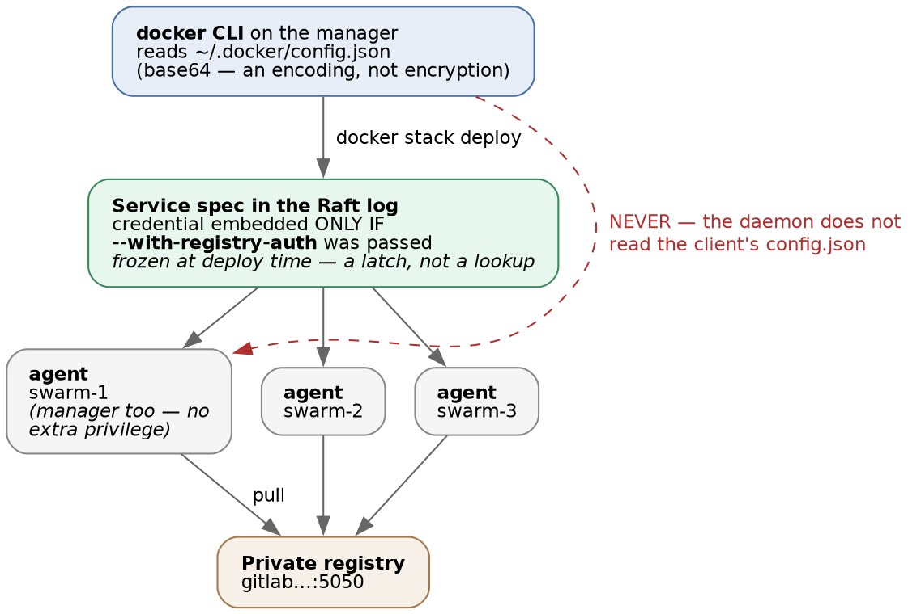
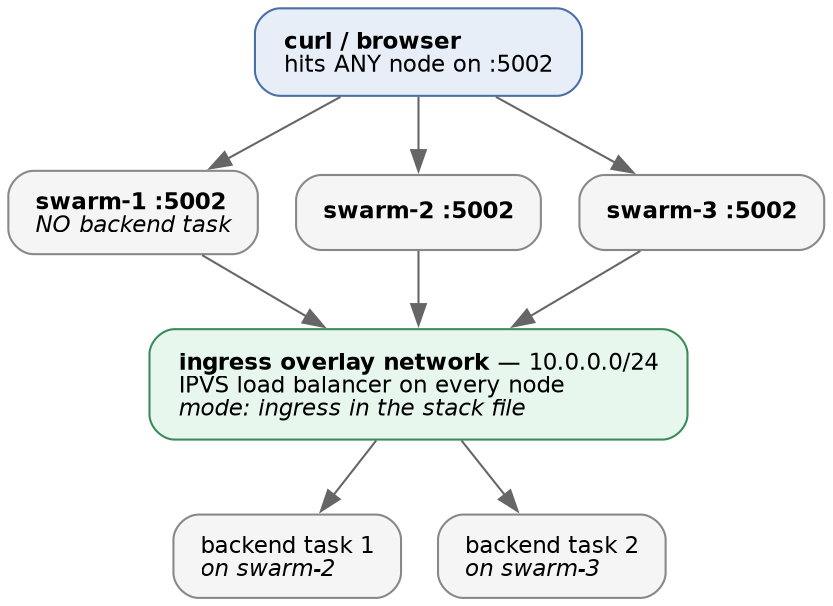

# Docker Swarm · Chapter 2 — Shipping to It

> **Series:** Home-Lab Education · Phase 16 (Docker Swarm)
> **Built and verified:** August 13, 2026 on the three-manager cluster from Chapter 1
> **Versions at time of writing:** Docker 29.7.2 · Compose file format 3.8 · private GitLab registry on `:5050`
> **Read this before:** Chapter 4 (state), Chapter 5 (breaking it on purpose), Chapter 6 (false greens).
> Chapter 3 (a pipeline that deploys) automates this chapter's deploy, and was written after it.
> **Read this after:** Chapter 1 — the cluster, quorum, and what `swarm init` created

---

## What this chapter covers

A four-service application — frontend, backend, PostgreSQL, Redis — deployed from a private registry
onto the cluster, reachable through the routing mesh. The application itself is incidental. What
transfers is everything that sat between "I have a compose file" and "it is serving traffic":

- [why a compose file is **not** a stack file, and which half of it Swarm silently ignores]{custom-style="Key"}
- how a registry credential actually reaches a node — **and the confident wrong answer**
- why `docker stack deploy` exiting `0` means almost nothing
- why "it's converged" is a harder question than counting replicas
- how a *frontend build* dictated our network topology

Every command here was run. Where our first explanation of a failure was wrong, the chapter says so,
because [the wrong explanation is the one you are likely to arrive at too]{custom-style="Key"}.

---

## 1. A stack file is not a compose file

They use the same syntax. [They are read by different things, and each ignores parts of the other]{custom-style="Key"}.

| | `docker compose up` | `docker stack deploy` |
|---|---|---|
| Scope | One host | The whole cluster |
| Reads `deploy:` | **Ignores it** | This is where all the important settings live |
| Reads `depends_on:` | Honours it | 🚨 **Silently ignores it** |
| Reads `build:` | Builds the image | **Ignores it** — images must already exist in a registry |
| `restart:` | Honoured | Ignored; use `deploy.restart_policy` — 🚨 and **not** with `condition: on-failure` for a long-running service: a clean shutdown exits `0`, is not a "failure", and the replica silently never comes back (proved by a reboot; Chapter 5 §3) |
| Scaling | `--scale` flag | `deploy.replicas`, reconciled continuously |

[The dangerous entries are the ones that are ignored rather than rejected]{custom-style="Key"}. A
compose file full of `depends_on` deploys onto Swarm without a single warning, and then your backend
starts before the database exists. Nothing in the output mentions it. You find out from the
application's logs, [if the application is kind enough to say so]{custom-style="Key"}.

> **Why `depends_on` cannot work here, conceptually.** On one host, "start B after A" is a meaningful
> instruction because there is one scheduler and one machine. In a cluster, A might be starting on a
> different node, or be rescheduled mid-deploy, or be temporarily down while its node is drained. There
> [is no moment at which "A has started" is a stable global fact]{custom-style="Key"}. **So the responsibility moves into
> the application: [services must tolerate their dependencies being absent and retry]{custom-style="Key"}.** This is not
> Swarm being primitive — Kubernetes takes the same position, which is why readiness probes and
> init containers exist rather than a `depends_on` field.

### Our stack file lives in *this* repository, not in the application's

[`manifests/capricorn.stack.yml`](manifests/capricorn.stack.yml) was written here and the application's
own repository was never touched. That was a hard rule for the phase, and the reasoning generalises:
**[the lab is a consumer of the application's images, not a contributor to it]{custom-style="Key"}.** Editing the app's
repository to make a lab work is how experiments become someone else's maintenance burden, and how
lab-only credentials end up in a production compose file.

---

## 2. The secret must exist before the deploy

```bash
printf '<password>' | docker secret create pg_password -
```

Our stack declares the secret as `external: true`, meaning "this must already exist; I will not create
it". The deploy fails immediately and clearly if it doesn't, which is the desired behaviour — the
alternative is [a database that starts and then refuses every connection]{custom-style="Key"} for a reason you have to go
digging for.

✅ **Proved by drill (Aug 18, Drill B).** With the secret deleted, `deploy_swarm.sh` refused before
touching the cluster:

```
FAILED: secret 'pg_password' does not exist - create it first: …
EXIT=1        # and docker stack ls stayed empty
```

And the registry login never ran — [the secret check sits **above** the login on purpose]{custom-style="Key"}, so the
[cheapest, most-likely-wrong precondition fails free of cost]{custom-style="Key"} and without exposing a credential.
⚠️ **What this guard cannot do is [notice a secret that exists but holds the wrong value]{custom-style="Key"}** — that one
[sails through everything and is caught only at the very end]{custom-style="Key"}. Chapter 4 §2 runs that failure in full.

Note `printf`, not `echo`. **[`echo` appends a newline and the newline becomes part of the secret]{custom-style="Key"}.** The
resulting authentication failures are entirely invisible: the password looks right everywhere you can
inspect it, and [the file on disk is one byte longer than you think]{custom-style="Key"}.

### Secrets are delivered as files, and the general problem that creates

A Swarm secret appears inside the container as a file at `/run/secrets/<name>`. It is mounted from an
in-memory filesystem, never written to the container's disk, and never appears in `docker inspect` or
the service spec — which is exactly why you use them instead of environment variables.

⭐ **[But almost no application wants a file]{custom-style="Key"}.** Ours wanted a single `DATABASE_URL` with the password
embedded in the middle of a connection string. That mismatch — **secret-as-file versus
config-as-string** — is generic. It recurs with Kubernetes secrets, Vault, and every cloud secrets
manager, and [it is the point where teams give up and go back to a plaintext environment variable]{custom-style="Key"}.

The resolution is to compose the value at container start:

```yaml
command:
  - sh
  - -c
  - 'export DATABASE_URL="postgresql://user:$$(cat /run/secrets/pg_password)@postgres:5432/db"; exec uvicorn app.main:app --host 0.0.0.0 --port 8000'
```

Two details in that line are not decoration:

- **`$$` and not `$`.** [Compose interpolates `$` itself before the container ever sees the string]{custom-style="Key"}. A
  single `$` means Compose tries to expand `$(cat ...)` at deploy time, on your workstation.
- 🚨 **`exec` is load-bearing.** Without it the shell stays as PID 1 and your application is a child
  process. **[PID 1 receives `SIGTERM` on a rolling update; a plain `sh` does not forward it]{custom-style="Key"}.** So the
  [application never learns it is being shut down]{custom-style="Key"}, Swarm waits out its grace period, and then
  `SIGKILL`s it. Every update degrades into a ten-second stall and an ungraceful kill, and it will
  [look like a slow application rather than a missing keyword]{custom-style="Key"}.

Similarly, the PostgreSQL image supports `POSTGRES_PASSWORD_FILE`, but it is **mutually exclusive**
with `POSTGRES_PASSWORD` — and that variable was baked into the image. Setting `POSTGRES_PASSWORD: ""`
explicitly is what lets the `_FILE` path win.

⭐ **That baked-in variable is worth pausing on as a general lesson: a credential compiled into an
[image layer cannot be removed by editing a file]{custom-style="Key"}.** Anyone who can pull the image has it, including any
[read-only registry token you hand out for deployments]{custom-style="Key"}. Rotation at the source is the only remedy, and
["we fixed the Dockerfile" fixes nothing about the images already published]{custom-style="Key"}.

---

## 3. How a registry credential reaches a node

This is the most valuable section in the chapter, because the intuitive answer is wrong and the failure
it produces is genuinely confusing.

```bash
docker login gitlab.gothamtechnologies.com:5050 -u <deploy-token-user>
```

> **Lab vs PROD — plaintext registry.** *In the lab:* every node's `/etc/docker/daemon.json` lists this
> registry under `insecure-registries`, so pulls and `docker login` cross the LAN over HTTP. *Why it's
> acceptable here:* an isolated home network, and the credentials are lab-only by rule. *In production:*
> the registry gets a real TLS certificate and `insecure-registries` is never set. *If you carry the
> habit:* **[you have put a registry credential on the wire in cleartext]{custom-style="Key"}** — and `insecure-registries` is
> [precisely the knob people reach for to make a TLS error "go away"]{custom-style="Key"}, silencing a warning that was
> correct.

That writes a credential to `~/.docker/config.json` on the machine you ran it on. Now deploy the stack
**without** the registry-auth flag and watch what happens:

```
capricorn_frontend.1   docker-swarm-1   Shutdown   Rejected   "access forbidden"
capricorn_frontend.1   docker-swarm-2   Shutdown   Rejected   "access forbidden"
capricorn_frontend.1   docker-swarm-3   Shutdown   Rejected   "access forbidden"
```

### 🚨 The wrong explanation — the one we reached for first

*"The manager has credentials, the workers don't."* It is plausible, it fits a partial reading of the
symptoms, and it is false. Look again at that output: **the frontend was rejected on `docker-swarm-1`
too — [the very node holding a working credential, where `docker pull` succeeds by hand]{custom-style="Key"}.**



⭐ **[A node's daemon does not read the CLI's `config.json` when it runs a task]{custom-style="Key"}.** Only the *client*
does. [The agent authenticates **solely** with a credential embedded in the service spec]{custom-style="Key"}, which is what
`--with-registry-auth` puts there:

```bash
docker stack deploy -c capricorn.stack.yml --with-registry-auth capricorn
```

Two consequences follow, and both are the kind of thing that costs an afternoon:

1. **[A manager has no more pull privilege than a worker]{custom-style="Key"}.** The node you deploy from is not special.
2. [Being able to `docker pull` an image by hand on a host tells you nothing about whether a task can
   pull it on that same host.]{custom-style="Key"} It is the most natural diagnostic step available and
   [it tests a different code path than the one that is failing]{custom-style="Key"}.

### Our own debugging manufactured the confusing symptom

Two of the four services *appeared* to work on the manager. They did not have credentials — **their
[images were already in that node's local image cache]{custom-style="Key"}**, from the `docker pull` commands we had just run
while investigating. [A task whose image is already local never contacts the registry]{custom-style="Key"}, so it cannot be
refused.

The frontend was the only service we had never pulled by hand, so it was the only one that failed
honestly — and it therefore looked like the odd one out, as though the problem were specific to it.

> ⭐ **The methodological lesson, which is bigger than Swarm: the commands you run to investigate a
> [failure change the state of the thing you are investigating]{custom-style="Key"}.** A pull warms a cache. A restart clears
> a bad connection. [A `docker exec` creates the file whose absence was the bug]{custom-style="Key"}. When a test depends on
> a cold start, it has to run **before** you go poking, or from a restored snapshot afterwards.

### The retry budget is visible, and it runs out

There were **exactly three** `Rejected` rows per task slot. That was `restart_policy.max_attempts: 3`
being consumed — the manifest carried that setting when this failure was recorded on August 13. After
the third refusal, **Swarm stopped trying, permanently**: `docker stack deploy` had exited `0` half a
minute earlier, the retries quietly exhausted themselves, and the service sat at zero replicas
[indefinitely with nothing surfaced anywhere you would normally look]{custom-style="Key"}.

⚠️ **That setting is gone, and the story now has two branches — worth reading precisely, because the
"exactly three" only ever applied to one of them.** `max_attempts` was removed on August 18, together
with `condition: on-failure`, after a reboot silently ate replicas (Chapter 5 §3). The drills then
established (P24, Chapter 5 §1):

- On an **update** of an existing service, `max_attempts` was never the thing limiting retries anyway —
  [`failure_action: rollback` ends the attempt after **one** failed task]{custom-style="Key"}.
- The "exactly three, then stop forever" behaviour belongs to the **create** path — a first deploy,
  where there is no previous version to roll back to. That is exactly what this section's failure was.
  **With `max_attempts` now removed, the create-path retry behaviour is uncapped and has not been
  re-measured** — recorded as open, not assumed.

### ⚠️ The delayed failure mode — recorded, not yet verified

The credential is stored **in the service spec, in the Raft log.** [It is a *latch*, not a live lookup]{custom-style="Key"}.

So when the token expires, tasks that are rescheduled **after** that date should fail to pull, while
[nothing has changed and every configuration file still reads correctly]{custom-style="Key"}. The trigger is a node
restarting or a task moving — weeks after the actual cause. Redeploying refreshes it.

⚠️ **We have not tested this.** It follows from the mechanism and is written down as a claim to
falsify, not as something to teach as fact.

> **Lab vs PROD — one long-lived token, used by a human and stored in a spec.** *In the lab:* a single
> registry deploy token valid for over a year, created by hand, sitting in `~/.docker/config.json` and
> copied into every service spec. *Why it's acceptable here:* one operator, one cluster, read-only
> scope on a lab registry. *In production:* short-lived workload-scoped credentials — federated
> identity for the CI job, nothing static on disk, pull credentials issued per deployment. *If you
> carry the habit:* one leaked token grants registry access for a year, **and revoking it does not fail
> [loudly — it breaks the next task reschedule, silently]{custom-style="Key"}, whenever that happens to occur.** ⚠️
> *Unverified prescription:* standard practice as we understand it; not tested here.

> **Lab vs PROD — `docker login` stores credentials in recoverable form.** *In the lab:* the token sits
> in `~/.docker/config.json` as **[base64, which is an encoding and not encryption]{custom-style="Key"}** — reversible with
> no key, in one command. Docker prints a warning saying so. *Why it's acceptable here:* lab-only token,
> read-only scope. *In production:* a credential helper backed by the OS keystore, so the token never
> exists on disk in recoverable form. *If you carry the habit:* any process running as that user, any
> backup, and [**every VM snapshot** contains a working registry credential]{custom-style="Key"}. ⭐ *The tool told us it had
> [just done something substandard and the near-universal response is to scroll past it]{custom-style="Key"}* — that is the
> real lesson here, and "it looks like an opaque blob" is why people assume it is safe.

---

## 4. `deploy` exits 0 long before anything works

```
$ docker stack deploy -c capricorn.stack.yml --with-registry-auth capricorn
Updating service capricorn_frontend (id: sowosja0k0pw…)
...
$ echo $?
0
```

[`docker stack deploy` returns success as soon as the manager has **accepted your desired state** — not
when anything is running]{custom-style="Key"}, and possibly forever before, if the image cannot be
pulled. In the failure above, it exited `0` while the frontend had zero replicas and was already out of
retries.

**[A deployment job that stops at that exit code reports green while your application is down]{custom-style="Key"}.** This
is the single most common defect in a hand-written deploy pipeline, and it is why
[`scripts/deploy_swarm.sh`](scripts/deploy_swarm.sh) polls — and why, since the failure drills, it no
longer stops at convergence either: [a converged stack can still be unable to do business]{custom-style="Key"}, so the script
ends with a smoke gate that transacts against the application (the full story is Chapter 6 §3).

### Counting replicas is not enough either

Our first convergence check compared running replicas to desired replicas. That is insufficient, in two
ways, and both are worth understanding because the check *looks* obviously correct.

**First, `order: start-first`.** This setting brings the replacement task up before retiring the old
one, precisely so there is no gap in capacity. Which means running/desired can read `3/3`
*continuously* through an entire rolling replacement. A deploy that swapped every container for a
broken image [can satisfy a count-only check on the very first poll]{custom-style="Key"}.

**Second, and worse — `failure_action: rollback`.** When a rollout fails, Swarm restores the previous
version, and the service settles back at **full replicas**. A count-only check sees `3/3` and reports a
successful deployment. 🚨 **The truth is the opposite: [your new code was rejected and the cluster is]{custom-style="Key"}
running the old code.** That is the most misleading green a deploy job can produce, and it is what a
correctly-configured service is *designed* to do. ✅ *Written here as reasoning on Aug 13; **proved by
drill on Aug 18** — a deploy of an unpullable image ended at `3/3` on the old digest with nothing in
`docker service ls` recording the refusal. Chapter 5 §1 has the task history.*

The fix is to ask Swarm, which tracks this properly:

```bash
docker service inspect <svc> \
  --format '{{if .UpdateStatus}}{{.UpdateStatus.State}}{{else}}<absent>{{end}}'
# updating | completed | rollback_started | rollback_completed | <absent, if never updated>
```

⚠️ **`<absent>`, not empty — the guarded form above is load-bearing.** On a service that has never been
updated the field does not exist, and the naive template `{{.UpdateStatus.State}}` **errors** instead of
returning an empty string. A check that crashes on a freshly created service will be discovered at the
worst possible moment.

[Treat `rollback_*` as a **hard failure**, not a success]{custom-style="Key"}. ✅ *The rollback-detection half was proved on
Aug 18: the deploy script caught `rollback_started` and failed in 1.3 seconds (Chapter 5 §1).* ⚠️ *The
latch half remains open: `rollback_completed` persists until the next update begins, so a stale value
could fail a healthy cluster. The script mitigates by comparing against the state observed before
deploying rather than trusting the field absolutely — mitigated, not settled.*

### The blast radius of a deploy is neither "everything" nor "nothing"

Re-deploying with the auth flag added recreated three services and **left Redis completely untouched** —
its task ran for thirty minutes across two subsequent deploys with no restart at all.

⭐ **`--with-registry-auth` [attaches a credential only for images whose registry requires one]{custom-style="Key"}.** So it
changed the spec of the three services on the private registry and did nothing to the public
`redis:7.2.4-alpine`. **[PostgreSQL was working correctly and got bounced anyway]{custom-style="Key"}, purely because it
shares a registry with the services that were broken.**

[Nothing in the command you type tells you which services are in scope]{custom-style="Key"}. And a *third* run, with an
unchanged file, recreated nothing at all — which is the declarative model working exactly as designed.

[The rule is: a service is recreated when its spec changes. The hard part is that "spec" includes
things you did not write in the file]{custom-style="Key"} — resolved image digests, embedded
credentials, and anything else Swarm computes on your behalf.

### Tags are resolved to digests, once

```
# as resolved on Aug 13 — the backend digest is deliberately left as it was that day; see below
capricorn_backend   …/backend:latest@sha256:fac031dd827c3f1c78d6732d925ae6888ee65b821c08218dd4b1ea7…
capricorn_redis     redis:7.2.4-alpine@sha256:c8bb255c3559b3e458766db810aa7b3c7af1235b204cfdb304e79…
```

Swarm resolves each tag to a **digest** when it accepts the spec and stores *that*. Services therefore
[do **not** follow a moving tag the way `docker compose pull` does]{custom-style="Key"}.

This cuts both ways, and both matter:

- **Good:** your deployment is reproducible. [A rebuild of `:latest` cannot change what is running]{custom-style="Key"}
  underneath you **between deploys**.
- 🚨 **Surprising:** "I pushed a fix and production is still running the old code" is a Swarm classic.
  [Redeploying the same tag may legitimately do nothing at all]{custom-style="Key"}.
- 🚨 **And the third edge, which happened to us on Aug 18:** the *next* deploy of `:latest` resolves the
  tag **again** — so if someone pushed in the meantime, a redeploy you intended as a no-op is an
  unannounced upgrade. The digest above is stale for exactly this reason: the tag moved under us
  mid-drill and confounded an experiment (Chapter 5 §1). **Pinning protects a running service, not a
  redeploy. Only deploying by digest protects both.**

Even the deliberately-pinned `redis:7.2.4-alpine` got a digest recorded. **A tag — however specific it
looks — [is a mutable pointer that whoever controls the registry can move]{custom-style="Key"}. The digest is the image.**

---

## 5. The routing mesh — any node answers, task or not



With `mode: ingress` on a published port, **[every node in the cluster listens on that port]{custom-style="Key"}**, whether or
not it is running a task for that service. A request arriving at a node with no local task is
load-balanced across the nodes that do have one.

Verified directly: the backend runs two replicas, on nodes 2 and 3, and `curl` against **node 1** on
`:5002` answers correctly.

The operational payoff is that you can put any node — or all of them — behind a load balancer and stop
caring where tasks are scheduled. The catch worth knowing: **a node answering on a published port is
[not evidence that the node is healthy]{custom-style="Key"}**, only that the cluster is. A naive health check that hits one
node's port [will pass while that node runs nothing at all]{custom-style="Key"}.

> **Lab vs PROD — published over plain HTTP with nothing in front.** *In the lab:* the application is
> published directly on `:5001` and `:5002`, no reverse proxy, no TLS. *Why it's acceptable here:* the
> lab's subject is the routing mesh, and a proxy in front of it would hide the very behaviour being
> studied. *In production:* TLS terminated at an ingress proxy, and the application's own ports never
> published to any network a user can reach. *If you carry the habit:* session cookies and every API
> payload cross the network in cleartext. ⚠️ **Note how this decision actually arrived** — see §6. It
> [was not chosen on merit; it fell out of how an image was built]{custom-style="Key"}, which is the more insidious way a
> production environment ends up without TLS.

---

## 6. When a frontend build dictates your network topology

The backend is published on `5002`. That was not a free choice, and the reason is instructive.

The frontend resolves its API base **in the browser, at runtime**:

1. a build-time `VITE_API_URL`, if one was compiled in — not set in this image
2. page served over **HTTPS** → same origin, and a proxy routes `/api`
3. page served over **HTTP** → `http://<current-hostname>:5002`

We serve plain HTTP, so branch three applies and **`:5002` is compiled into the JavaScript bundle.**
Publish the backend on any other port and [every API call in the UI breaks]{custom-style="Key"} — while `curl` against the
backend keeps working perfectly, so it presents as a frontend bug.

🚨 **The general lesson: `VITE_*` variables — and their equivalents in every other frontend
build tool — [are substituted at BUILD time]{custom-style="Key"}.** Setting one in a stack file, a `.env`, or a service spec
does absolutely nothing; the value is already inside the bundle. [Configuration that feels like runtime
configuration, but isn't, is a category of bug that produces no error message at
all]{custom-style="Key"} — just an application quietly talking to the wrong address.

⭐ And note the direction of causation, which is the part worth carrying: **the image dictated the
network topology, not the reverse.** [A decision made months earlier in someone's Dockerfile constrained]{custom-style="Key"}
what we were permitted to do with ports and, by extension, kept us on HTTP.

---

## 7. Commands to know by heart

```bash
# secrets - printf, never echo
printf '<value>' | docker secret create <name> -
docker secret ls

# deploying
docker stack deploy -c <file>.yml --with-registry-auth <stack>
docker stack ls
docker stack services <stack>            # replica counts
docker stack ps <stack>                  # TASK history - includes failed attempts
docker stack ps <stack> --no-trunc       # the useful half of an error is past the truncation
docker stack rm <stack>

# why is this ONE service unhappy - the most useful command in Swarm
docker service ps <svc>                  # per-task state WITH history
docker service ps <svc> --no-trunc       # the full error string

# the questions that actually tell you if a deploy worked
# (guarded: on a never-updated service the field is ABSENT and the naive template errors)
docker service inspect <svc> --format '{{if .UpdateStatus}}{{.UpdateStatus.State}}{{else}}<absent>{{end}}'
docker service inspect <svc> --format '{{.Spec.TaskTemplate.ContainerSpec.Image}}'   # the digest
docker service inspect <svc> --pretty    # the spec in force, not what your file says
docker service logs <svc> --tail 50

# registry auth
docker login <registry> -u <user>                          # interactive, masked
printf '%s' "$TOKEN" | docker login <registry> -u <user> --password-stdin   # scripted
docker secret inspect <name>                               # metadata only - never the value

# proving the routing mesh
curl -s http://<any-node>:5002/health
```

`docker service ps` and `docker stack ps` are the two to reach for first. **`docker service ls` shows
only current state; [the `ps` commands show task *history*, including the rejected attempts]{custom-style="Key"}** — which is
where the actual error message lives, and the only reason we could disprove the "managers have
credentials" theory.

⚠️ **Two traps in the auth commands.** Never `docker login -p <token>`: it puts the token in the process
list and your shell history. And **do not add `--password-stdin` to an interactive login** — it silently
waits on stdin rather than prompting, which looks exactly like a hang.

You can also demonstrate §3's point about base64 in one line, which is worth doing once so the warning
stops being abstract:

```bash
jq -r '.auths|to_entries[0].value.auth' ~/.docker/config.json | base64 -d
```

> 📖 **Every command this track has used, organised by the question it answers rather than the chapter
> it appeared in, is collected in [`COMMANDS.md`](COMMANDS.md)** — along with a table for *reading*
> failure states (`Rejected` vs `Pending` vs `Preparing` vs crash-looping). That file is also the
> growing specification for a portable read-only `docker-admin.sh`.

---

## 8. Glossary

| Term | Meaning |
|---|---|
| **Stack** | A named group of services deployed from one compose-syntax file |
| **Service** | Desired state for one component: image, replica count, update policy |
| **Task** | One container plus its state. A replica of a service. Has a *history* |
| **Rejected** | A task the node refused to start — usually an image it could not pull |
| **`--with-registry-auth`** | Embeds the client's registry credential into the service spec so agents can pull |
| **Routing mesh** | Every node listens on a published port and load-balances to wherever tasks run |
| **`mode: ingress`** | Port publishing via the routing mesh. Contrast `mode: host`, which binds only where a task runs |
| **Overlay network** | A virtual network spanning nodes, so containers on different hosts share a subnet |
| **Digest** | `sha256:…` — the immutable identity of an image. What Swarm actually stores |
| **`UpdateStatus`** | Swarm's own record of how the last rollout went — honest about the **update**, silent about whether the app is right (an image that starts but is wrong completes cleanly; Chapter 5 §1). Absent until the first update |
| **`order: start-first`** | Start the replacement before stopping the old task. Why replica counts mislead |
| **`failure_action: rollback`** | On a failed rollout, restore the previous version — and full replica count |
| **Convergence** | Reality matching desired state. **Not** the same as the deploy command exiting 0 |

---

## 9. Check yourself

1. Your compose file has `depends_on`. You `docker stack deploy` it. What does Swarm do about it, and
   why can't it do otherwise? (§1)
2. `docker pull` works by hand on the manager, but tasks are `Rejected` with `access forbidden` on that
   same node. Explain. (§3)
3. Why does `docker pull`-ing an image to diagnose a failure make the diagnosis harder? (§3)
4. A deploy job runs `docker stack deploy` and reports success. Name two distinct situations where the
   application is broken anyway. (§3, §4)
5. Your service shows `3/3` replicas after a deploy. Why is that not evidence the deploy worked — and
   what do you check instead? (§4)
6. You add a flag to fix one broken service and three others restart, but a fourth doesn't. What
   determines which? (§4)
7. You push a rebuilt `:latest` and redeploy. Nothing changes. Why, and is that a bug? (§4)
8. `curl http://node1:5002/health` succeeds. What does that prove about node 1 — and, separately, what
   does it *not* prove about the application? (§5; the second half is Chapter 6 §1)
9. The UI's API calls all fail but `curl` against the backend works fine. Where do you look? (§6)
10. Why is `printf` used to create a secret rather than `echo`, and how would the mistake present? (§2)
11. A colleague removes a hardcoded password from a Dockerfile and commits the fix. Is the credential
    now safe? (§2)
12. What does `exec` in a container's `sh -c` command have to do with rolling updates? (§2)
