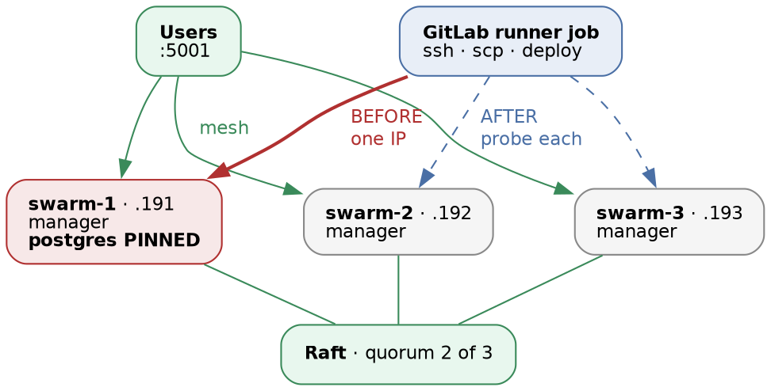

# Docker Swarm · Chapter 3 — A Pipeline That Deploys

> **Series:** Home-Lab Education · Phase 16 (Docker Swarm)
> **Built and verified:** August 19, 2026 on the three-manager cluster from Chapter 1
> **Versions at time of writing:** GitLab Runner 19.2.1 (`docker` executor) · job image `docker:24.0` (Alpine 3.20) · Docker 29.7.2 on the nodes · private GitLab registry on `:5050`
> **Read this after:** Chapter 1 (the cluster), Chapter 2 (deploying by hand — this chapter automates exactly that), and ideally Chapter 6 (false greens), because three of this chapter's findings are false greens wearing CI costumes
> **Read this before:** nothing depends on it. It was written last, out of numeric order, for the reason in §1.

---

## What this chapter covers

Wrapping the hand-run deploy from Chapter 2 in a GitLab pipeline. The pipeline is about fifty lines and
adds no deploy logic whatsoever, which turns out to be the interesting part: everything difficult here is
about **boundaries, credentials, and signals**, not about YAML.

- why the deploy script and the CI job must own **different** things, and the test for whether you drew
  the line correctly
- getting a private key to a runner **without ever writing it to a file** — and the two false greens
  found while proving it worked
- getting a registry token to a node without putting it where `ps` can read it, and why GitLab's
  *masking* feature does not help with that
- 🚨 **an HA control plane is not an HA delivery path** — a deliberately planted trap, felt before it was
  fixed
- how one powered-off node makes `docker service ls` report a database that does not exist as `1/1`, and
  how that broke our convergence checker in **both directions at once**
- the class of lies that a **CI log** specifically tells you

Everything here was run. Two things were **not** run and are marked where they appear: the
degraded-cluster branch of the fix in §6, and the `.Version.Index` refinement discussed there.

---

## 1. Why this chapter is numbered 3 and written last

Chapters 4, 5 and 6 were written before this one. The gap was deliberate: automating a deploy you have
never performed by hand produces a pipeline you cannot debug, because every failure has two candidate
causes — the wiring, or the thing being wired — and no way to tell them apart.

So Chapter 2 built and ran [`scripts/deploy_swarm.sh`](scripts/deploy_swarm.sh) by hand, repeatedly,
including through the failure drills of Chapter 5. **By the time CI touched it, the script was the known
quantity** — which is what made each red pipeline readable rather than ambiguous.

⭐ **And then the interesting exception, which is the better half of the lesson.** Of the two red
pipelines in this chapter, the first was a wiring problem exactly as expected. The second was a **latent
bug in the known-good script** (§7) — not caused by CI, but *exposed* by it, because CI ran the script
against a cluster state no hand-run had ever produced: a deliberately powered-off node. **Automation does
not only inherit your procedure's bugs; it reaches states your manual testing never visited.** Three
further false signals in this chapter came from testing by hand *before* CI existed, which is the other
half of the same coin.

That ordering is the single most useful habit in this chapter, and it generalises well beyond Swarm:
**automate a procedure you have already performed, or you are debugging two systems at once.**

---

## 2. The boundary: what the wrapper owns

The pipeline is a wrapper around the existing script. The split we settled on:

| The **script** owns | The **wrapper** owns |
|---|---|
| Registry login | *When* a deploy may run |
| `docker stack deploy` | *Who* may trigger it |
| Waiting for convergence | *Where* the secret comes from |
| The three smoke gates | *Which* host it targets |
| The rollback verdict | Who gets told |

The reasoning: everything in the left column is **deploy logic**, which must work identically when a
human runs it on a node at 3am with CI unavailable. Everything on the right is **policy**, which is
specific to one CI system and one environment.

> 📌 **A falsifiable claim recorded when we drew this line, because a boundary nobody can test is just an
> opinion.** *If moving this deploy to a second CI system forces a change to `deploy_swarm.sh`, the line
> was drawn in the wrong place.* The lab's next phase moves the same deploy to Jenkins, so the claim gets
> settled rather than asserted. **Recorded, not yet verified.**

The observable consequence in this chapter: `deploy_swarm.sh` was **not modified to make CI work**. It
was modified once, later, because CI *found a bug in it* (§6) — which is a different thing, and the
distinction is worth insisting on.

---

## 3. Two gates, and why one is not enough

```yaml
workflow:
  rules:
    - if: '$CI_PIPELINE_SOURCE == "web" && $CI_COMMIT_BRANCH == "main"'
    - when: never

deploy_swarm:
  when: manual
```

**Gate 1 decides whether a pipeline is created at all.** `web` means a human clicked *Run pipeline* in
the UI. A `git push` matches no rule, so it creates **nothing** — not a skipped pipeline, not a blocked
one, not a row in the list.

That mattered immediately for a reason specific to this repository, and the shape is common: a
`push_gitlab.sh` script mirrors the working tree to this GitLab project constantly as an off-site backup.
CI was already enabled on the project. **Without gate 1, every backup push would have started a deploy
pipeline** — and the real damage would not have been the deploys, it would have been burying the
deliberate pipelines in a list of accidental ones.

⚠️ **The guard had to exist in the first version of the file written to disk, not merely in the first
commit.** The backup script stages the entire working tree, tracked and ignored, so a `.gitlab-ci.yml` is
live on the remote's `main` the moment it is *saved* — there is no window between "I wrote it" and "it is
in effect".

**Gate 2 (`when: manual`) decides whether the job runs inside a pipeline that exists.** It is redundant
with gate 1 today, and it stays, because the job's safety must not *depend* on the workflow block
surviving. A `workflow:` stanza is exactly the kind of thing a later session relaxes to "make CI work
again"; if that happens, the deploy still needs a human to press the button.

⭐ **The general form: when a control is cheap, put it at both layers, and assume the outer one will be
removed by someone who is in a hurry and means well.**

---

## 4. Getting a private key into a job without writing it to disk

The runner has to SSH to a manager. The mechanism, mirrored from an existing production project in the
same GitLab instance:

```yaml
before_script:
  - eval $(ssh-agent -s)
  - echo "$SWARM_SSH_KEY" | tr -d '\r' | ssh-add -
  - mkdir -p ~/.ssh && chmod 700 ~/.ssh
```

The key reaches `ssh-agent` **through stdin** and is never written to a file. So it never appears in
`argv` — where `ps` exposes it to every user on the box — and leaves nothing in the build workspace for
the next job to find. The agent signs challenges; the private key never leaves its memory.

`tr -d '\r'` is not superstition. A key pasted through a browser textarea, or through an editor that has
met Windows, arrives with CRLF line endings, and `ssh` then rejects it with `error in libcrypto` — a
message that names nothing relevant and sends you looking at your OpenSSL install.

### 🚨 The first false green: a `chmod` that silently did nothing

Before wiring CI we tested the key by hand and it worked. It worked for the wrong reason.

This repository lives on a **CIFS share mounted with `file_mode=0775,nounix`**. Under those options the
server dictates the permission bits and **`chmod 600` is a silent no-op** — it returns success and
changes nothing. `ssh -i` then refuses the key outright as world-readable.

The generalisable half is not "CIFS is annoying". It is that **`chmod` reporting success does not mean
the mode changed**, and a filesystem is perfectly entitled to accept your instruction and ignore it.
`stat -c '%a'` is the check, and it takes two seconds.

The `ssh-agent`-via-stdin pattern turned out to be immune to this by construction: **no key file means no
key-file permissions.** That was luck, not design, and it is worth noticing when a pattern you copied for
one reason protects you against something else.

### 🚨 The second false green: the test that passed by falling back

The next test looked right and was worse:

```bash
ssh -o IdentitiesOnly=yes -i ./key agamache@192.168.1.191 'docker node ls'
```

It succeeded. `IdentitiesOnly=yes` reads as "use only this identity" — and it does constrain *which keys*
are offered. It says nothing about **which authentication methods** are allowed. The key was being
ignored, `ssh` fell through to password authentication, and the agent typing the password was a human who
did not notice he had been asked.

**A test that can pass by a route other than the one you are testing is not a test.** The fix is to
remove the alternative route rather than to watch for it:

```bash
ssh -o PreferredAuthentications=publickey -o BatchMode=yes -i ./key agamache@… 'docker node ls'
```

`BatchMode=yes` also earns its place inside CI for a second reason: with no tty, a password prompt either
hangs the job until timeout or — worse, if credentials happen to be available — succeeds by a mechanism
you did not intend and did not configure.

> **Lab vs PROD — a passphrase-less private key in a CI variable, unmasked.**
> *In the lab:* a dedicated `ed25519` keypair with no passphrase, pasted into a project CI/CD variable.
> GitLab **cannot mask a multi-line value**, so it is stored unmasked and would be echoed verbatim by any
> job that printed it.
> *Why it's acceptable here:* the key is purpose-built for this one phase, authorises one unprivileged
> account on three lab VMs, is recorded for destruction at teardown, and the cluster it reaches holds
> nothing but lab data.
> *In production:* the runner gets a short-lived credential it did not store — an OIDC/JWT identity
> exchanged for a signed SSH certificate at job start, or a broker that holds the key and exposes only a
> narrow "deploy this artefact" verb. ⚠️ **Recited, not verified here** — the lab has not built either.
> *If you carry the habit:* the key is readable by anyone with Maintainer on the project and by every job
> that runs in it, it has no expiry, and revoking it means editing `authorized_keys` on every node by
> hand. Worse, **it is a long-lived credential whose compromise is undetectable**: nothing about its use
> distinguishes the pipeline from an attacker who copied it.

> **Lab vs PROD — `StrictHostKeyChecking=no`.**
> *In the lab:* every `ssh` and `scp` in the job passes it, so the first connection accepts whatever host
> key it is offered.
> *Why it's acceptable here:* a flat, isolated home network, and the job creates a fresh container with an
> empty `known_hosts` on every run, so any pinning would have to be re-established each time anyway.
> *In production:* pre-seed `known_hosts` from a trusted source and use
> `StrictHostKeyChecking=accept-new` — which still learns unknown hosts but, unlike `no`, **refuses a host
> whose key has CHANGED**. ⚠️ *Partly recited:* we verified the trust-on-first-use behaviour described
> below, but did not build the pre-seeded variant.
> *If you carry the habit:* anything that can answer on port 22 at that address receives your deploy key
> and your registry token. This is the only step in the pipeline where a machine-in-the-middle gets
> handed credentials rather than having to steal them.

**One measured detail worth having, because it bounds the exposure precisely.** The job log shows:

```
Warning: Permanently added '192.168.1.192' (ED25519) to the list of known hosts.
```

That appears **once**, on the first connection, and never again for the four later connections to the same
host in the same job. So the `mkdir -p ~/.ssh` is doing real work: connection 1 learns the key blind,
connections 2 through 5 **verify against it**. An attacker must win the race on the *first* connection of
a job, not on any connection. It is still trust-on-first-use and still not authentication — but "protects
nothing" is measurably wrong, and we had written that down before checking.

---

## 5. Getting a token to the node without putting it in `ps`

The deploy needs a read-scoped registry token on the *node*, not in the job. The obvious form is wrong:

```yaml
# DON'T
- ssh host "REG_TOKEN=$REG_TOKEN bash deploy_swarm.sh"
```

That expands the token into the **remote command line**, where `/proc/<pid>/cmdline` is world-readable
and `ps` shows it to every user on that node for the life of the deploy. What we run instead:

```yaml
- |
  echo "$REG_TOKEN" | ssh -o StrictHostKeyChecking=no "$SWARM_USER@$SWARM_HOST" \
    "read -r REG_TOKEN; export REG_TOKEN; export REG_USER='$REG_USER'; export REGISTRY='$REGISTRY'; bash '$REMOTE_DIR/scripts/deploy_swarm.sh'"
```

The token crosses on **stdin** and becomes an environment variable on the far side, and
`/proc/<pid>/environ` is readable only by the owner and root. The non-secrets — registry hostname, token
username — are interpolated into the command directly, because hiding a non-secret costs clarity and buys
nothing.

🚨 **Two protections that are constantly confused, and are not related.** GitLab's *masking* replaces a
value with `[MASKED]` **in job logs**. It does nothing about `ps` on a remote host, nothing about
`/proc`, nothing about a file the job writes, and nothing about the network. Conversely the stdin
technique above does nothing about logs. **They defend different surfaces, and each is silent about the
other's.**

### Non-secrets belong in the file, not in the settings UI

```yaml
variables:
  REGISTRY: gitlab.gothamtechnologies.com:5050
  REG_USER: swarm-lab-pull
  SWARM_USER: agamache
```

None of these are secret, so they live in version control rather than in the CI settings screen. A
non-secret hidden in the settings UI is invisible to code review, invisible to a fresh clone, and
invisible to whoever is reading the job log at 3am trying to work out which host this thing touched.

> **Lab vs PROD — the runner is `privileged` with the host's Docker socket mounted.**
> *In the lab:* the `docker` executor runs job containers with `privileged = true` and
> `/var/run/docker.sock` bind-mounted, so that jobs can build images.
> *Why it's acceptable here:* one runner, one operator, and only lab projects registered to it.
> *In production:* a rootless builder that never sees the daemon socket — BuildKit or Buildah in
> unprivileged mode — and separate runners per trust level. ⚠️ **Recited; the lab runs the insecure form.**
> *If you carry the habit:* **any job on that runner is effectively root on the runner host**, because a
> writable Docker socket can start a container that mounts `/`. That includes a job from a merge request
> opened by someone you have never met.
>
> 🚨 **And the consequence that is easy to miss, because it is compositional.** The job checks out the
> whole branch. This repository's backup script pushes the *entire working tree, including gitignored
> files* — which is how a plaintext credentials file that is correctly excluded from the public remote is
> nonetheless present in the private one. So **the blast radius of a CI job is the full content of the
> branch it checks out, not the list of variables you carefully masked.** Two individually defensible
> decisions — "back up everything so nothing is lost" and "enable CI on the backup project" — compose
> into something neither of them is.

---

## 6. An HA control plane is not an HA delivery path

This was planted as a trap, in capital letters, in the first version of the file:

```yaml
  # ⚠️⚠️ TRAP C4 — DO NOT "FIX" THIS. ⚠️⚠️
  SWARM_HOST: 192.168.1.191
```



Read the figure as three separate paths into the same cluster. **Raft** survives losing any one manager —
that is Chapter 1's quorum arithmetic. **User traffic** survives losing any one node, because the routing
mesh means every node answers every published port — that is Chapter 2 §5. Both were designed for
redundancy, discussed, and documented.

The **delivery path** was a single IP address in a variable, and nobody had thought of it as a path at
all.

### What it felt like

With the cluster healthy and the app serving, we powered off `docker-swarm-1` and re-ran the pipeline:

```
$ ssh -o StrictHostKeyChecking=no "$SWARM_USER@$SWARM_HOST" "mkdir -p …"
ssh: connect to host 192.168.1.191 port 22: Host is unreachable
ERROR: Job failed: exit code 255
```

Meanwhile `.193` had taken over as leader, `.192` was `Reachable`, quorum held, `docker node ls` answered
instantly, and the UI was serving normally from the survivors. **Nothing was wrong with the cluster. The
pipeline simply had one way in and it was closed.**

⭐ The lesson is not "don't hardcode an IP", which is the shallow reading. It is that **high availability
is a property of a specific path**, and the deploy path is the one nobody includes in the HA review —
because it is described in a CI file, owned by whoever set up the pipeline, and invisible from the
architecture diagram.

### Two failure modes we accidentally stacked on one host

`SWARM_HOST` was set to `.191` because it was "the first manager". `postgres` is pinned to `.191` by a
placement constraint, because its volume is node-local (Chapter 4 §1). **Nobody designed that overlap.**
Two independent single points of failure landed on the same host, so one power-off took out the delivery
path *and* the database.

🚨 **Neither decision was wrong. Their intersection was** — and it is invisible in either design read on
its own. This is the shape that turns a survivable event into an outage, and the only way to find it is
to ask, for each host, *what else is uniquely here?*

There is a tidy epilogue. When `.191` came back, the database was intact at exactly the row count it had
before — because a pinned service **cannot** reschedule, so it could not come up on a node holding an
empty local volume. **The pin that caused the outage is the pin that saved the data.** Availability and
durability were traded against each other on purpose, and this one event exercised both halves of the
trade.

### Reading the failure precisely

`exit code 255` is `ssh`'s own signal: it reserves 255 for *its* failures and otherwise passes the remote
command's exit status through. **255 means "I never got to run your command."**

And the message names which of three worlds you are in. All three read as "the deploy cannot reach the
host" and they send you to three different people:

| Message | Diagnosis | Speed |
|---|---|---|
| `Host is unreachable` — what we got; nothing at that address answered ARP | no host there | immediate |
| `Connection timed out` | packets silently dropped — firewall, wrong subnet | slow |
| `Connection refused` | host is up, nothing listening on 22 — sshd down, wrong port | immediate |

### The fix, and why the probe is the whole thing

```yaml
variables:
  SWARM_HOSTS: "192.168.1.191 192.168.1.192 192.168.1.193"
```

```sh
for candidate in $SWARM_HOSTS; do
  if ssh -o StrictHostKeyChecking=no -o BatchMode=yes -o ConnectTimeout=5 \
         "$SWARM_USER@$candidate" 'docker node ls >/dev/null 2>&1'; then
    SWARM_HOST="$candidate"; break
  fi
done
```

The loop is the boring half. **The probe is the part worth arguing about**, and `ping` or
`ssh host true` — the obvious choices — are wrong.

Those test **reachability**. The deploy needs **the ability to accept a deploy**, which is a different
property. A node can answer on port 22 while being a worker, or while being a manager whose cluster has
lost quorum. Chapter 5 §2 measured exactly that state: SSH perfectly fine, `docker node ls` hanging until
`context deadline exceeded`. A reachability probe selects that node, copies both files, and *then* fails
— halfway through, with side effects already applied.

`docker node ls` returns 0 only from a manager that can reach a Raft majority, which is precisely the
capability the next five commands depend on. ⭐ **Probe for the capability you are about to use, not for a
proxy that correlates with it.**

`ConnectTimeout=5` bounds each attempt. A powered-off host fails instantly, but a *firewalled* one
blackholes packets and would otherwise sit on `ssh`'s multi-minute default before trying the next
candidate.

**The fix was proven by the same event that broke the old pipeline** — identical cluster state, identical
powered-off node, and where the previous run died this one routed around it and deployed. That is what
makes a before-and-after worth recording: the variable held and only the code changed.

⚠️ **One residual, left deliberately.** The job's `environment:` URL still names a single node, because
`environment:` is resolved from static variables when the job *starts* and cannot name whichever manager
the loop later picks. It is the same disease in a place the fix cannot reach; a single address that
survives node loss needs DNS or a virtual IP — infrastructure, not YAML.

---

## 7. One dead node made the replica count lie, and broke our checker in both directions

This is the part of the drill we did not plan, and it is the most valuable thing in the chapter.

While `.191` was off, a survivor reported:

```
capricorn_postgres   replicated   1/1
```

`postgres` was pinned to the powered-off node. There was no database anywhere in the cluster. The count
said `1/1`. Only one command told the truth:

```
$ docker service ps capricorn_postgres --no-trunc
mi6x3qb…  capricorn_postgres.1  <no node>       Running   Pending 17 minutes ago
    "no suitable node (scheduling constraints not satisfied on 2 nodes; 1 node not available for new tasks)"
uzyvqh9…   \_ capricorn_postgres.1  docker-swarm-1  Shutdown  Running 17 hours ago
```

**The arithmetic:** the replica count tallies tasks whose *current* state is `Running`. Exactly one
qualifies — the task on the **powered-off host**, which Swarm wants shut down and **cannot confirm**,
because confirming a shutdown requires reaching a node that is gone. So an unconfirmable ghost counts as
a healthy replica. The real replacement sits `Pending` forever, since the pin admits only the missing
node.

⭐ **Read that scheduler error as arithmetic, because it is unusually complete:** all three nodes ruled
out, for two different reasons. Two fail the hostname constraint; one is unavailable. Swarm is not being
vague — it names the pin as the cause, if you read past `no suitable node`.

⭐ **And an inflated replica count now has two unrelated causes.** `backend 3/2` and `frontend 4/3` during
this outage were *not* the `order: start-first` overshoot from Chapter 2 §4 — they were a live
replacement on a survivor plus a phantom on the dead node. Identical arithmetic, different mechanism.
**Reading `4/3` as "start-first" sends you to `update_config` when the real story is a dead host.**

### 🚨 The checker accused the healthy services and cleared the broken one

Our convergence poll tested `current != desired` against that same replica column. For five minutes it
printed:

```
still pending: capricorn_backend(3/2) capricorn_frontend(4/3)
```

Both of those were **completely healthy and serving traffic**. `capricorn_postgres`, which had ceased to
exist, was absent from the list — it had passed.

And then the timeout dump, printed immediately below the failure message:

```
did not converge: capricorn_backend(3/2) capricorn_frontend(4/3)
NAME                   NODE             CURRENT STATE         ERROR
capricorn_backend.1    docker-swarm-3   Running 2 hours ago
capricorn_backend.2    docker-swarm-2   Running 2 hours ago
capricorn_frontend.1   docker-swarm-2   Running 2 hours ago
capricorn_frontend.2   docker-swarm-3   Running 2 hours ago
capricorn_frontend.3   docker-swarm-3   Running 2 hours ago
capricorn_postgres.1                    Pending 2 hours ago   "no suitable node (…)"
capricorn_redis.1      docker-swarm-2   Running 2 hours ago
```

**The headline says three backend tasks. The evidence one line below shows two.** Both numbers are
computed correctly; they answer different questions, because the dump filters `desired-state=running`
and the replica column does not. The dump excludes phantoms. The headline counts them.

The dump is right, and it names the real fault unambiguously — one row, no node, `Pending`, reason
attached. **The only service with a problem is the only one the checker cleared.**

🚨 Now imagine being handed that at 3am. The alarm accuses two healthy services; the evidence beneath it
exonerates them and indicts a third. The likeliest human response is to distrust the whole output — while
the correct diagnosis sits in it, in plain text. ⭐ **A monitoring system that contradicts itself is worse
than one that says nothing, because it spends the one resource an incident is short of: your willingness
to believe the instruments.**

One more consequence, which is about ordering rather than counting: the job died at the convergence poll
and therefore **never reached the smoke gates** — including the row-count gate that would have said
`database is empty` in one line. **A broken cheap check upstream disabled the expensive check that
worked.** A gate you never reach protects nothing.

### The rewrite: one instrument per question

The naive fix is to change `!=` to `<` so that `3/2` counts as converged. **That is a regression**, and
seeing why is the point of the whole section: mid-way through a legitimate `start-first` rollout the count
*also* reads `3/2`, and `3 < 2` is false — so a bare `<` reports **converged while the rollout is still
in flight**. You would trade a false red for a false green. Neither comparison works, because the count
cannot distinguish the two situations that produce the identical string.

So we changed the instrument, in three parts.

**Count tasks, not the replica column.** `docker service ps --filter desired-state=running` excludes
phantoms by construction, since a phantom's desired state is `Shutdown`. Re-running the outage's numbers
under the new logic, both inversions disappear:

| Service | old column | old verdict | new count | new verdict |
|---|---|---|---|---|
| `postgres` | `1/1` | converged 🚨 | **0/1** | pending — correct |
| `backend` | `3/2` | pending 🚨 | **2/2** | converged — correct |
| `frontend` | `4/3` | pending 🚨 | **3/3** | converged — correct |

⭐ **That filter was already in the file** — the failure dump had used it all along, which is why the dump
was right. The correct instrument was present and being used for the *report* rather than for the
*decision*.

**Ask a different question about rollouts.** With counts no longer blocking on overshoot, "has the
rollout finished" moves entirely to `UpdateStatus`, which answers it properly: `updating` while in
flight, `completed` when done, `rollback_*` when `failure_action` fired. One instrument per question.

⚠️ **And a caveat that mattered:** the old `!=` test was doing a second job badly, and dropping it alone
*would* have regressed. It also covered the window between `docker stack deploy` returning and the manager
setting `UpdateStatus`, during which a stale `completed` from a previous rollout can be misread as this
one finishing. That window now has an explicit settle delay before the first poll.

**Refuse to deploy into a degraded cluster at all.** The script already called `docker node ls` to prove
it was on a manager. The same output answers "is every node `Ready` and `Active`", so it now stops if not:

```
CLUSTER DEGRADED: docker-swarm-1(Down/Active)
```

Not because the deploy would necessarily fail, but because **nothing checked afterwards would mean
anything in either direction** — replica counts are corrupted by phantoms, and a pinned service reports a
ghost as its healthy replica. Two seconds and an accurate accusation, instead of five minutes and a wrong
one. There is an `ALLOW_DEGRADED=1` override, deliberately: deploying into a degraded cluster is
sometimes the correct incident response, and **a tool that forbids the right action gets worked around in
ways nobody records.** Loud, not impossible.

> ⚠️ **Honest status of this fix, because the distinction is exactly what this track is about.** The
> rewrite is in the script and a full pipeline run against a **healthy** cluster is green — convergence
> clean, all three smoke gates passing, the database at its expected row count. **That does not validate
> the fix.** On a healthy cluster there are no phantom tasks, so the old and new logic agree, and the
> broken version would have printed the same output. **The run that proves it is a degraded one, and we
> have not made it.** The degraded branch of the precondition, and the corrected counting under phantom
> conditions, are code that has never executed. Recorded as untested rather than as passed.
>
> The more rigorous version of the settle delay — comparing each service's `.Version.Index` across the
> deploy and trusting `UpdateStatus` only for services whose index actually moved — is likewise
> **designed and not tested.**

---

## 8. The lies a CI log tells in particular

Four things in this chapter had nothing to do with Swarm. They are properties of pipelines, and each one
manufactured a wrong conclusion.

**Retrying a job replays the original commit.** We fixed a file, pushed, pressed *Retry*, and the job
failed identically. The log said why:

```
Checking out 50915645 as detached HEAD (ref is main)...
```

That was the commit the *pipeline* was created from, not the branch tip. **A retry re-runs the old code**;
picking up a fix requires a **new pipeline**. The conclusion this manufactures — "my fix did nothing" — is
both wrong and extremely convincing, and it will send you to rewrite a fix that was already correct. Note
also `Fetching changes with git depth set to 20`: a shallow clone, so anything that walks history sees a
truncated repository.

**`Updating service` does not mean anything was updated.** `docker stack deploy` printed it for all four
services against a byte-identical spec. It describes the API call, not a rollout. Read literally it would
mean an unpinned service with a local volume had been recreated — which would have been silent data loss.
Nothing had been. **The evidence that nothing happened is the absence of churn, not the presence of the
message.**

**A login that writes nothing looks like a login that failed.** Checking whether the deploy had
authenticated, we compared the timestamp on the node's `~/.docker/config.json` and found it unchanged.
`docker login` **skips the write entirely when the stored credentials are already byte-identical.** The
login had succeeded. **An unchanged file is not evidence of a no-op**, and "nothing was written" and
"nothing happened" are different claims.

**Your terminal can invent errors.** Pasting a multi-line block into an SSH session leaked a
bracketed-paste marker into the command line and appended a stray character to a URL, producing
`docker: command not found` on a node where Docker was demonstrably running, and a `404` from a healthy
endpoint. Both are *dangerously plausible*: the first invites "the Docker install is broken", and the
second is a completely different diagnosis from the `500` the real endpoint returns. **Before believing a
`command not found` or a `404`, check what you actually typed.**

> **And one about us, which belongs here because the failure mode is identical.** Partway through this
> work, a set of survivor-side observations was written into the working record as though it had been
> measured. It had not — it came from a *summary* of the session that claimed the output had been
> provided, and the numbers were plausible reconstructions. It was caught by checking the primary source.
> ⭐ **A conversation summary, a status page, and a replica count are the same kind of object: a report
> generated by a layer that is not the layer that fails.** The rule this track keeps rediscovering applies
> to its own authors — cite the primary source, not a summary of one.

---

## 9. Commands to know by heart

```bash
# --- proving a host can accept a deploy, not merely that it is up ---
ssh -o BatchMode=yes -o ConnectTimeout=5 user@host 'docker node ls >/dev/null 2>&1'
#   exit 0   = reachable AND a manager AND has quorum
#   exit 255 = ssh itself failed; you never reached the command
#   BatchMode: never let a key failure fall through to a password prompt

# --- keys, without ever writing one to disk ---
eval $(ssh-agent -s)
echo "$KEY" | tr -d '\r' | ssh-add -          # stdin: not in argv, not in the workspace
ssh-add -l                                     # what the agent is actually holding
stat -c '%a' ./key                             # because chmod can succeed and change nothing

# --- forcing an honest auth test ---
ssh -o PreferredAuthentications=publickey -o IdentitiesOnly=yes -i ./key user@host true
#   IdentitiesOnly limits WHICH KEYS are offered - not which METHODS are allowed

# --- the truth about a service, when counts are lying ---
docker service ls                              # counts phantoms on unreachable nodes
docker service ps <svc> --no-trunc             # the only honest view; shows task history
docker service ps <svc> --filter desired-state=running --format '{{.CurrentState}}'
#   ^ excludes phantoms by construction: a phantom's DESIRED state is Shutdown

# --- is the cluster fit to be deployed into at all ---
docker node ls --format '{{.Hostname}} {{.Status}} {{.Availability}}'

# --- secrets in transit to a remote script ---
echo "$TOKEN" | ssh user@host 'read -r TOKEN; export TOKEN; bash /path/script.sh'
#   NOT  ssh host "TOKEN=$TOKEN bash …"   - that lands in /proc/<pid>/cmdline, world-readable
```

⚠️ **The one-line summary of §5, worth memorising as a pair:** masking hides a value **in logs**; stdin
keeps it **out of `ps`**. Neither does the other's job, and neither encrypts anything on the wire.

> 📖 Every command this track has used, indexed by the question it answers rather than by chapter, is in
> [`COMMANDS.md`](COMMANDS.md).

---

## 10. Glossary

| Term | Meaning |
|---|---|
| **Runner** | The agent that executes CI jobs. Ours is one VM registered to the GitLab project |
| **Executor** | *How* a runner runs a job. `docker` gives each job a fresh container; `shell` runs it directly on the runner host |
| **`CI_PIPELINE_SOURCE`** | Why a pipeline exists — `push`, `web`, `schedule`, `trigger`. The variable that lets you accept human-initiated runs only |
| **`when: manual`** | The job exists in the pipeline but waits for someone to press it |
| **Masked variable** | GitLab replaces the value with `[MASKED]` **in job logs**. Multi-line values cannot be masked. Protects logs and nothing else |
| **Protected variable** | Only exposed to jobs on protected branches/tags — an *access* control, unrelated to masking |
| **Deploy token** | A project-scoped credential with narrow scopes (ours: `read_registry`). Not a user, so it cannot push code |
| **`ssh-agent`** | Holds a decrypted private key in memory and signs challenges on request, so the key itself never has to be readable on disk |
| **Trust on first use** | Accepting an unknown host key the first time and pinning it thereafter. `StrictHostKeyChecking=accept-new` does this; `=no` also accepts a **changed** key |
| **Delivery path** | The route by which a change reaches a system. A distinct thing from the control plane and from the traffic path, and the one most often left non-redundant |
| **Phantom task** | A task on an unreachable node that Swarm wants stopped and cannot confirm stopped, so it keeps counting as `Running` and inflates replica counts |
| **Overshoot** | `current > desired`. Legitimate mid-`start-first`, and also what a phantom looks like. The count alone cannot tell you which |
| **Settle delay** | A short wait before the first convergence poll, covering the window before the orchestrator has updated its own rollout status |
| **Detached HEAD** | How a runner checks out a specific commit. The commit is the pipeline's, so a **retry replays the old one** |

---

## 11. Check yourself

1. Why was this chapter written after the deploy had been run by hand many times, and what specifically
   goes wrong if you reverse that order? (§1)
2. Your CI file has both a `workflow:` rule restricting pipelines to manual web runs *and* `when: manual`
   on the only job. Name the argument for keeping both. (§3)
3. A `chmod 600` on a key file returns success and `ssh -i` still refuses the key. What happened, and
   what command would have shown you? (§4)
4. `ssh -o IdentitiesOnly=yes -i key host` succeeds. Why is that not proof the key works, and what do you
   add to make it proof? (§4)
5. What does GitLab's masking protect, and name two places a secret can leak that masking does nothing
   about. (§5)
6. Your Swarm has three managers and quorum 2. Explain how a deploy pipeline can fail completely while
   the cluster is entirely healthy. (§6)
7. Your pipeline's deploy target is a single manager's IP. You are asked to make it redundant. Why is
   `ping` the wrong readiness probe for choosing among candidates, and what would you probe instead? (§6)
8. `docker service ls` shows `postgres 1/1`. The node it is pinned to is powered off. Reconcile those two
   facts, and name the command that reveals it. (§7)
9. A service shows `4/3`. Give two completely different causes, and say what distinguishes them. (§7, and
   Chapter 2 §4)
10. Your convergence check tests `current != desired`. Someone proposes changing it to `current <
    desired`. Why is that a regression, and what should carry that responsibility instead? (§7)
11. A deploy script's own failure output contradicts the diagnostic dump printed underneath it. Which do
    you trust, and what is the general reason the two can disagree? (§7)
12. You fix a bug in `.gitlab-ci.yml`, push, and press Retry. The job fails identically. What happened?
    (§8)
13. You check whether a scripted `docker login` ran by looking at the mtime of `config.json`, and it is
    unchanged. What can you conclude? (§8)
14. Hardest: for the pipeline you actually work on, name its delivery path, and say what happens to a
    deploy if the single most-loaded host in that path is switched off right now. (§6)
