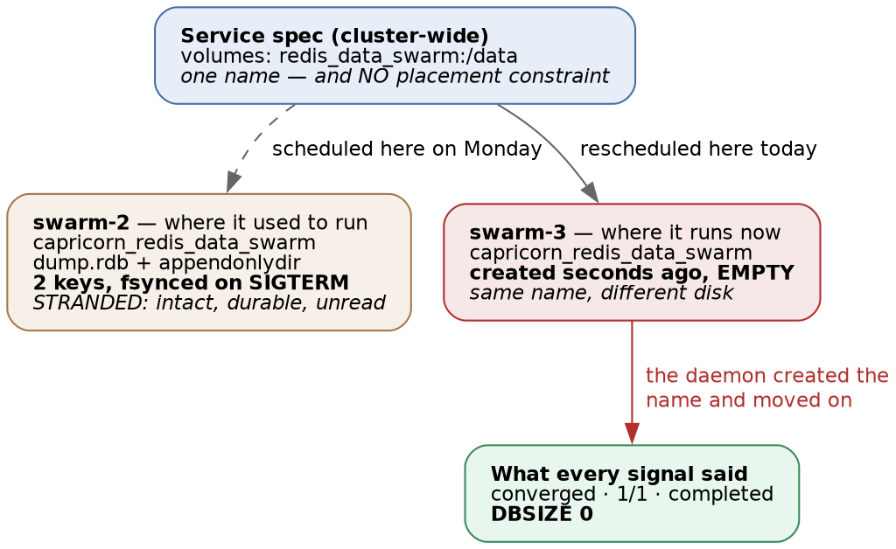

# Docker Swarm · Chapter 4 — State: What the Cluster Will Not Carry For You

> **Series:** Home-Lab Education · Phase 16 (Docker Swarm)
> **Built and verified:** August 18, 2026 on the three-manager cluster from Chapter 1
> **Versions at time of writing:** Docker 29.7.2 · `redis:7.2.4-alpine` · PostgreSQL 16 in a private image
> **Read this before:** Chapter 5 (breaking it on purpose), Chapter 6 (false greens)
> **Read this after:** Chapter 2 — the stack file, secrets-as-files, and what convergence means

---

## What this chapter covers

Swarm schedules **processes** well. It does not move **state**, and it will not tell you when it has
separated one from the other. Everything here was produced by moving a running database to a node that
had never held its data, and by rotating a password the way a real operator would:

- why a named volume is **cluster-wide in your manifest and node-scoped in reality**
- how state becomes **stranded rather than lost**, and why that is the harder incident
- why the moment your data was *most durable* can be the moment it became *unreachable*
- why rotating a secret rotates the **client** and never the **server**
- how a database can be seeded by a **race between your own application's workers**

The lesson that ties them together: [Swarm's job ends at "a container is running somewhere"; every
question about *which bytes that container can see* is yours]{custom-style="Key"}. Each section below
is a signal that stayed green while something important was wrong.

---

## 1. A named volume is a promise about a name, not about data

Our Redis service is about as careful as a small service gets:

```yaml
redis:
  image: redis:7.2.4-alpine
  command: ["redis-server", "--appendonly", "yes"]
  volumes:
    - redis_data_swarm:/data
```

`--appendonly yes` turns on the append-only file, so every write is journalled to disk rather than
trusted to a periodic snapshot. That is the durable choice, and it is real: with two keys written, the
volume contained an `appendonlydir` with a base RDB, an incremental AOF and a manifest.

Then we added a placement constraint to force the service onto a different node — the same thing the
scheduler does on its own when a node drains, reboots, or runs out of memory:

```bash
docker service update --constraint-add 'node.hostname==docker-swarm-3' \
  --detach=false capricorn_redis
```

Nine seconds later:

```
verify: Service capricorn_redis converged
```

| What we asked | What it said |
|---|---|
| `docker service ls` | `1/1` |
| `docker service inspect … UpdateStatus` | `completed` |
| `docker service ps` | `Running 5 seconds ago`, no error |
| `redis-cli DBSIZE` | 🚨 **`0`** |
| `redis-cli GET c3:canary` | 🚨 **empty** |

The orchestrator was not lying. **A container from that image is running on that network with that
volume name mounted at `/data`, which is exactly what we asked for.** Everything the service definition
promised was delivered.



### The part that surprises people: Docker created a *second* volume with the same name

```bash
docker volume inspect capricorn_redis_data_swarm --format '{{.CreatedAt}}'
# 2026-08-18T19:06:56-04:00      ← on the NEW node, seconds old and empty
```

There is no cluster-wide volume registry behind a `local`-driver volume. `redis_data_swarm` is a
**name**, resolved independently by the Docker daemon on whichever node the task lands on, and if that
name does not exist there, the daemon **creates it empty and proceeds**. Two nodes then hold the same
volume name with different contents, and `docker volume ls` on either one looks completely normal.

> ⭐ **This is the single most transferable idea in the chapter.** Everything else about Swarm is
> cluster-scoped — service names, secrets, overlay networks, DNS. **Volumes are the exception, and they
> are the one thing that holds data.** The mental model that gets people into trouble is assuming the
> volume follows the service, because every *other* noun does.

### The data was not destroyed. It was stranded.

Moving the constraint back to the original node returned both keys, byte for byte:

```
DBSIZE after moving back:  2
GET c3:canary:             [written-before-reschedule-2026-08-18]
```

On disk, on the original node, the old data had been sitting there the whole time:

```
/var/lib/docker/volumes/capricorn_redis_data_swarm/_data/
  dump.rdb          155 bytes   19:06
```

🚨 **Look at that timestamp.** `19:06` is the moment the old task shut down — Redis caught `SIGTERM`,
flushed its dataset to disk, and exited cleanly. **The data was never more durable than at the instant
it became unreachable.**

> ⭐ **Durability and availability are independent properties, and the drill makes the distinction
> physical.** A backup regime proves the first one. **Nothing in this failure would have been prevented
> by a better backup**, and nothing in it would have been *detected* by verifying that backups are
> valid. The bytes were perfect, fsynced, and addressed to a machine nobody was querying.

[**At 3am this presents as data loss and is really an addressing problem.**]{custom-style="Key"} The instinct it punishes is
the good one: you check the application, see an empty dataset, and start looking for what deleted your
data. Nothing deleted it. **The first question is not "what happened to the data", it is "which node am
I talking to, and which node was I talking to yesterday".**

```bash
# The one command that resolves the ambiguity in seconds:
docker service ps <service> --filter desired-state=running --format '{{.Node}}'
```

### Which is why the database is pinned, and Redis deliberately is not

| Service | Volume exists on | Placement constraint |
|---|---|---|
| `postgres` | swarm-1 only | ✅ `node.hostname == docker-swarm-1` |
| `redis` | swarm-2 only | **none — left free on purpose, so this drill could happen** |

**The pin is why C3 could only be run against Redis.** Postgres cannot be rescheduled, so it cannot be
separated from its data — and the manifest states the cost of that in the same breath as the benefit:

```yaml
placement:
  constraints:
    - node.hostname == docker-swarm-1   # trades availability for durability:
                                        # postgres dies with docker-swarm-1
```

⭐ **That comment is the whole lesson in one line, and it is why the pin is a *decision* rather than a
precaution.** A pinned database is **less** available than an unpinned one — if that node is gone, the
service is down, full stop. What you buy is that it can never come up **wrong**. Two honest options
exist, and they are different sizes:

| Fix | What it buys | What it costs |
|---|---|---|
| Pin with a placement constraint | The service can only ever run where its data is | If that node is down, the service is **down** — you have chosen consistency over availability, deliberately |
| Replicated / networked storage (NFS, Ceph, a cloud volume) | The data follows the task | Real operational surface: a storage system to run, and its failure modes become yours |

🚨 **What you must not do is leave it unpinned and *believe* you have redundancy.** An unpinned stateful
service on a three-node cluster **looks** more available than a pinned one and is strictly more
dangerous, because the failure mode is silent instead of loud. **A pinned service that refuses to start
tells you the truth immediately; an unpinned one comes up empty and reports success.**

> **Lab vs PROD — node-local volumes for stateful services.** *In the lab:* both stateful services use
> `local`-driver named volumes on a single node. Postgres is pinned there; Redis is deliberately left
> free so that this chapter's drill could be run. *Why it's acceptable here:* the pin makes the database
> immovable and therefore honest, the Redis dataset is a regenerable cache, and all three VMs are
> snapshotted. *In production:* stateful services get replicated or networked storage, **or** a hard pin
> plus a written plan for that node's failure — and either way it is a recorded decision rather than
> whatever the scheduler chose. *If you carry the habit:* **one reschedule serves an empty database
> while every dashboard stays green.** The data is intact on a node nobody is looking at, so the incident
> presents as data loss, the team reaches for a restore, and **a restore over the top of a
> healthy-but-stranded volume is how a recoverable incident becomes an unrecoverable one.**

### The application never noticed

With Redis wiped to nothing, the frontend served `200`, the summary endpoint returned full counts, and
the backend's logs mentioned Redis **zero** times.

⭐ **A cache losing everything is supposed to be survivable, and here it was.** But note what that
means for detection: **the component whose whole job is to be non-critical is also the component whose
failure produces no signal.** If Redis had held sessions, rate-limit counters, or a job queue, the same
silent wipe would have logged users out, reset quotas, or dropped queued work — and the *only* evidence
would have been user complaints. Chapter 6 returns to this: **the absence of an error is not evidence
of correctness, it is the absence of instrumentation.**

---

## 2. Secrets are state too — and rotating one rotates only half of it

Swarm secrets are immutable by design: you cannot edit `pg_password` in place. A real rotation
therefore swaps the object underneath an unchanged mount path, which our stack expresses in three
lines:

```yaml
secrets:
  pg_password:
    name: pg_password_v2      # the CLUSTER object; the container still sees /run/secrets/pg_password
    external: true
```

We deployed that with a genuinely new value and **left the database alone** — which is not a contrived
scenario. It is the everyday one: somebody rotates the credential in the secret store, and the server
holding the data is a separate system that nobody remembered was separate.

**What happened, in order:**

1. Pre-flight checks **passed** — the secret exists.
2. All four services **converged**. `2/2`, `3/3`, `1/1`, `1/1`.
3. Image digests **resolved** and were reported.
4. The smoke gate failed: `SMOKE FAILED: /api/v1/banking/categories returned 500`.

The two logs together tell the whole story:

```
backend    asyncpg.exceptions.InvalidPasswordError: password authentication failed for user "capricorn"
postgres   FATAL:  password authentication failed for user "capricorn"
```

### Why the server kept the old password

The PostgreSQL image reads `POSTGRES_PASSWORD_FILE` **only when it runs `initdb`** — that is, only when
the data directory is empty. Our volume already contained a database, so the entrypoint skipped
initialisation entirely and the password stored inside PostgreSQL's own catalog was never touched.

⭐ **So the secret is [the client's copy of a credential whose authority lives in the data directory]{custom-style="Key"}.**
The rotation succeeded perfectly and made the two disagree.

| | Where the value lives | What the rotation did |
|---|---|---|
| Client (the app) | `/run/secrets/pg_password`, re-read at container start | **Updated** |
| Server (Postgres) | The `pg_authid` catalog, inside the volume | **Untouched** |

The actual rotation needs both halves, and the order matters:

```bash
# 1. change it in the server FIRST (the app's old secret keeps working)
ALTER USER capricorn WITH PASSWORD '<new>';
# 2. then create the new secret and redeploy the client
```

**Do it in the other order and you have an outage between the two steps.** Do only step 2 and you have
what we just built.

### 🚨 The pre-flight guard cannot see this class of failure, and neither can any orchestrator

Chapter 2's deploy script guards against a **missing** secret, and Chapter 5's Drill B proves that guard
fires. This is the neighbouring failure and the guard is blind to it:

| | Secret **absent** | Secret **present but wrong** |
|---|---|---|
| Pre-flight | ✅ Refuses to deploy | **Passes** |
| Task states | (never gets there) | **All `Running`** |
| `UpdateStatus` | (never gets there) | **`completed`** |
| Caught by | The guard | 🎯 **Only something that transacts** |

⭐ **[A wrong secret is delivered *successfully*.]{custom-style="Key"}** Every orchestrator-level signal is entitled to be
green, because from Swarm's point of view nothing failed: it mounted the file it was told to mount. **No
amount of better orchestration can detect this. Only a request that reaches the database can.**

⚠️ **A second-order trap we walked into while building the drill.** With `name:` in play, the stack key
is `pg_password` while the cluster object is `pg_password_v2`. A pre-flight that greps the stack file for
secret *keys* therefore verifies the existence of an object **the deploy will not use** — a check that
passes for the wrong reason. If you write such a guard, resolve `name:` first or check what the deployed
service spec actually references.

### 🚨 And while we were in there: localhost is not authenticated

Two probes of the same fact disagreed — the rotated password appeared to *work* from inside the
container while the backend was being rejected over the network. The discriminator was to try a
deliberately wrong password:

```bash
PGPASSWORD=total-garbage-xyz psql -h 127.0.0.1 -U capricorn -d capricorn_lab -tAc 'select 1'
# 1                     ← it worked
psql -h 127.0.0.1 -U capricorn -d capricorn_lab -tAc 'select current_user'
# capricorn             ← no password at all, also fine
```

The reason is in the image's `pg_hba.conf`, and it is the **default** for PostgreSQL images rather than
anything unusual about ours:

```
local   all   all                      trust
host    all   all   127.0.0.1/32       trust
host    all   all   ::1/128            trust
host    all   all   all                scram-sha-256
```

Only the last line — the one covering connections from *other containers* — checks a password. **[Anyone
who can get a shell in that container is already inside the database as its owner.]{custom-style="Key"}** On Swarm that means
**anyone in the `docker` group on that node**, who can also read `/run/secrets/pg_password` directly with
`docker exec`. Rotating the password changes neither of those facts.

> **Lab vs PROD — `trust` on loopback, and `docker` group as a database credential.** *In the lab:*
> the Postgres image's default `pg_hba.conf` trusts all loopback connections, and every lab operator is
> in the `docker` group on all three nodes. *Why it's acceptable here:* an isolated home network, a
> single operator, and lab-only data. *In production:* `scram-sha-256` on every line including
> loopback, and membership of the `docker` group treated as **equivalent to root on that host** —
> because it is. *If you carry the habit:* **host access silently becomes data access.** Your password
> rotation, your secrets manager and your database audit log are all bypassed by one `docker exec`, and
> nothing in the configuration you *do* review will show it. This is also why "the database only
> listens on localhost" is a weaker statement than it sounds: **on a container host, localhost is a
> shared address space.**

---

## 3. Your application's startup is state management, whether you designed it that way or not

The last piece of state in this stack is not stored by Swarm at all. Our backend seeds a demo dataset
on startup if the database looks empty — a pattern found in nearly every application that ships with a
"just bring it up" story.

Run one worker and it is flawless: 682 rows, every table populated, one clean log line.

Run the production configuration — 2 replicas × 4 `uvicorn` workers — against a fresh database and the
log fills with:

```
Failed to import demo data, using minimal bootstrap:
  … UniqueViolationError … duplicate key value violates unique constraint "categories_pkey"
✅ Bootstrap complete: {… 'total': 682}
```

**Eight workers, no coordination, one shared database.** The mechanism is worth understanding in general
form because the shape recurs everywhere:

1. Each worker checks "does data exist?" — all eight see empty, all eight proceed.
2. The seeding routine **clears leftovers and commits that clear** before inserting.
3. That commit **publishes an empty state**, so a worker that was about to be saved by the guard now
   passes it too.
4. Workers insert rows with explicit primary keys; the losers collide and fail.
5. Each loser catches the error and falls back to a minimal path — then logs **success**.

⭐ **The defect is step 2, and it is a general rule about guarded initialisation: [a guard that reads
committed state is worthless if the guarded routine commits an intermediate state.]{custom-style="Key"}** The window it
opens is not a microsecond; it is however long the import takes.

🚨 **The consequence that matters more than the collision:** if a container restarts between that commit
and the final one, **the database is left committed-empty** — the delete has landed and the insert never
will. A crash during seeding is a data-loss event rather than a retry.

**The correct shape is one transaction and one lock:**

```sql
SELECT pg_advisory_lock(hashtext('app_bootstrap'));   -- the other workers wait here
-- clear + insert + release, committed exactly once
```

The advisory lock makes it correct at any worker count; the single transaction makes a failure
*recoverable* rather than destructive. Neither depends on Swarm.

> ⭐ **Why this belongs in a Swarm chapter at all.** `depends_on` does not exist here (Chapter 2), so
> ordering moved into the application — and **anything the application does at startup now happens
> concurrently, N replicas × M workers at a time, on a schedule you do not control.** Swarm did not
> create this bug. It made a single-worker assumption load-bearing and then scaled it out. The same is
> true of a Kubernetes Deployment, an ECS service, and a Compose file with `--workers 4`.

**The fingerprint to grep for across your own environments** is the fallback message. If a log line
says the application fell back to a degraded initialisation, that database was seeded by whichever
worker lost a race, and nobody was told. Ours logged `✅ Bootstrap complete` immediately afterwards —
which is Chapter 6's subject.

---

## 4. Commands to know by heart

```bash
# WHERE is this service actually running right now?
docker service ps <svc> --filter desired-state=running --format '{{.Node}}'

# Which nodes hold a volume with this name? (run per node - there is no cluster view)
docker volume ls --filter name=<stem>
docker volume inspect <vol> --format '{{.CreatedAt}} {{.Mountpoint}}'

# Is this volume's content real, or a fresh empty one the daemon just made?
docker volume inspect <vol> --format '{{.CreatedAt}}'      # seconds old = the task was rescheduled

# Read what a container actually received (works for any secret - see the Lab vs PROD note)
docker exec <cid> cat /run/secrets/<name>

# Does the SERVER agree with the secret? (from OUTSIDE the container - loopback is trusted)
docker service logs <db-svc> --tail 40 | grep -i 'authentication failed'

# Pin a stateful service to its data, deliberately and visibly
docker service update --constraint-add 'node.hostname==<node>' --detach=false <svc>
docker service inspect <svc> --format '{{.Spec.TaskTemplate.Placement.Constraints}}'
```

The full ledger of investigative commands for this track, indexed by the question each one answers,
is [`COMMANDS.md`](COMMANDS.md).

---

## 5. Glossary

| Term | Meaning |
|---|---|
| **Named volume (`local` driver)** | A directory managed by the Docker daemon **on one node**. The name is resolved node-locally; identical names on different nodes are unrelated storage. |
| **Stranded state** | Data that is intact and durable but on a node nothing is currently reading. Distinct from data loss, and frequently mistaken for it. |
| **AOF (append-only file)** | Redis' journal of every write, replayed at start-up. A durability mechanism; **not** an availability or portability mechanism. |
| **`initdb`** | PostgreSQL's one-time cluster initialisation. Reads `POSTGRES_PASSWORD_FILE`; runs **only** on an empty data directory, which is why it ignores later rotations. |
| **`pg_hba.conf`** | PostgreSQL's host-based auth rules, matched top-down. Default container images `trust` loopback. |
| **Advisory lock** | An application-level lock held in the database (`pg_advisory_lock`), used to serialise work across processes that share only that database. |
| **Guarded initialisation** | "Do this only if it hasn't been done." Safe only if the guard and the work are in one transaction. |

---

## 6. Check yourself

Answer out loud; the section is given rather than the answer.

1. A service is `1/1`, `UpdateStatus` is `completed`, and its database is empty. What are the first two
   commands you run, and what would each one rule out? (§1)
2. Why is "stranded" a more dangerous diagnosis than "lost", given what an operator's instinct is? (§1)
3. Redis had `--appendonly yes` and still came up empty. What exactly did the AOF guarantee, and what
   did it never claim to? (§1)
4. You rotate a database password in your secret store and redeploy. The deploy is green and the app is
   broken. Which half of the credential changed, and what is the correct ordering of the two steps? (§2)
5. Why can no improvement to the orchestrator detect a present-but-wrong secret? (§2)
6. Your database "only listens on localhost". Why is that a weaker statement on a container host than
   on a VM? (§2)
7. A guard checks whether data exists before seeding. Under what circumstance does that guard actively
   *cause* a corruption it was written to prevent? (§3)
8. Which of this chapter's four failures would a valid, tested backup have prevented? (§1, §2, §3)
