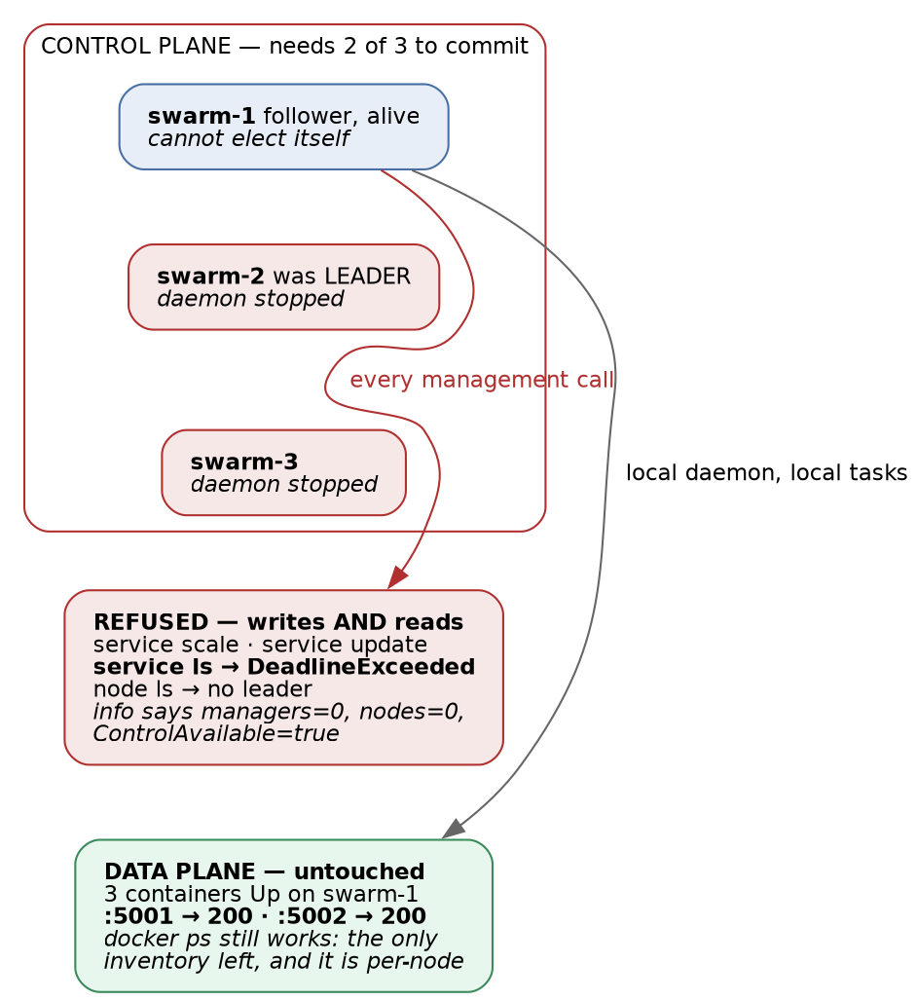

# Docker Swarm · Chapter 5 — Breaking It On Purpose

> **Series:** Home-Lab Education · Phase 16 (Docker Swarm)
> **Built and verified:** August 13 and 18, 2026 on the three-manager cluster from Chapter 1
> **Versions at time of writing:** Docker 29.7.2 · Compose file format 3.8
> **Read this before:** Chapter 6 — why so many of these signals were green
> **Read this after:** Chapter 1 (quorum arithmetic), Chapter 2 (shipping to it), Chapter 4 (state)

---

## What this chapter covers

Ten failures — eight provoked deliberately, two that arrived on their own — each with a prediction
written down **before** the command was run, where there was a command to run at all. The
predictions matter more than the outcomes: a prediction that survives contact taught you nothing, and
[the ones that were wrong are where the real material came from]{custom-style="Key"}.

| Drill | What we broke | Prediction held? |
|---|---|---|
| A | Database scaled to zero under a running app | ⚠️ Partly — the app was worse than predicted |
| B | Secret deleted before deploy | ✅ Yes |
| C | Concurrent workers seeding one database | ⚠️ Partly — the mechanism was different |
| C6a | Image tag that cannot be pulled | ✅ Yes, all four predictions |
| C6b | Image that pulls and runs but is the **wrong application** | ✅ Yes — and it is the worst result in the track |
| C3 | Stateful service moved to a node with no data | ✅ Yes, and worse than predicted (Chapter 4) |
| C5 | Raft quorum reduced to 1 of 3 | ❌ **One prediction refuted** |
| D | Secret rotated without touching the database | ✅ Yes (Chapter 4) |
| — | **Unplanned:** three replicas silently lost to a reboot | 🚨 Not predicted at all — the best finding |
| — | **Unplanned:** `:latest` moved underneath a redeploy | 🚨 Not predicted; it corrupted a drill |

Every command was run against the real cluster with the real application on it. Where our first
explanation was wrong, this chapter gives the wrong one first, because it is the one you will reach for
too.

---

## 1. Two ways to ship a broken image, and only one of them is caught

This is the drill that Chapter 2 promised would settle whether Swarm's rollback machinery is worth
trusting. The answer is yes — for exactly one of the two failure modes, and the other one is more
common.

### C6a — a tag that cannot be pulled

We deployed a variant of the stack with the frontend's tag replaced by `:does-not-exist-c6`. Four
predictions, all confirmed:

| Prediction | Outcome |
|---|---|
| The site keeps serving throughout | ✅ `:5001` → `200` before, during, and after |
| **One** failed task is enough to trigger rollback | ✅ One `Rejected` task on slot 3 |
| `UpdateStatus` goes to `rollback_started`; the deploy script fails | ✅ Script exited `1` in **1.3 seconds** |
| It settles at `3/3` on the **old** digest | ✅ 🎯 |

The task list is the clearest evidence of how `order: start-first` protects you:

```
capricorn_frontend.3   Accepted   less than a second ago
 \_ capricorn_frontend.3   Rejected   "failed to resolve reference …:does-not-exist-c6: not found"
 \_ capricorn_frontend.3   Running    26 minutes ago          ← the OLD task, never stopped
```

**Swarm tried to start the new task before stopping the old one, the new one never reached `Running`, so
the old one was never asked to stop.** Users saw nothing. That behaviour is a direct consequence of two
settings, and neither is a default:

```yaml
update_config:
  order: start-first        # default is stop-first: it would have taken a replica down FIRST
  failure_action: rollback  # default is pause: it would have stopped mid-rollout and waited
```

⚠️ **With the defaults**, this same deploy would have removed one of three replicas, failed to replace
it, and then **paused** — leaving the service permanently at `2/3` with no further action, no rollback,
and a deploy command that has already exited. *(Reasoned from the documented defaults; we ran the drill
only with our settings, so the default path itself was not measured here.)*

### 🎯 The finding: a rejected deploy is indistinguishable from a good one by replica count

```
$ docker service ls --filter name=capricorn_frontend
NAME                 REPLICAS   IMAGE
capricorn_frontend   3/3        …/frontend:latest
```

**That is the output *after* a deploy that was rejected and rolled back.** `3/3`. The right image
reference. Nothing anywhere in that line records that the last thing you asked for was refused.

⭐ **So "count the replicas" is not a deploy check — it is a *steady-state* check, and it cannot
distinguish "your change is live" from "your change was rejected and the previous version was
restored".** Both are healthy clusters. Only one of them is running your code. The distinguishing
signal is the one field that speaks about the *update* rather than the *service*:

```bash
docker service inspect <svc> \
  --format '{{if .UpdateStatus}}{{.UpdateStatus.State}}{{else}}<absent>{{end}}'
```

| Value | Meaning |
|---|---|
| `<absent>` | The service has **never been updated** since creation. Not an error — the field does not exist yet. |
| `updating` | In flight. |
| `completed` | The update you asked for is live. |
| `rollback_started` / `rollback_completed` | 🚨 **Your deploy was refused. The old version is serving.** |

⚠️ **The `<absent>` case is the trap for tooling.** A template like `{{.UpdateStatus.State}}` does not
return empty on a never-updated service; it **errors**. A check that treats that error as "unknown, keep
going" is fine; one that treats it as "no rollback, so we're good" is fine too — but a check that
crashes on a freshly created service will be discovered at the worst possible time.

⚠️ **One caveat we could not close.** `rollback_completed` **persists** until the next update, so a
stale value can fail a deploy of a cluster that is actually healthy. Our script compares against the
state observed *before* deploying rather than trusting the field absolutely.

### An unresolvable tag also silently disables digest pinning

Swarm printed this, unprompted, and then deployed anyway:

> `image …:does-not-exist-c6 could not be accessed on a registry to record its digest. Each node will`
> `access … independently, possibly leading to different nodes running different versions of the image.`

⭐ **Digest pinning is best-effort.** When the manager can reach the registry it resolves the tag to a
digest and every node runs identical bytes. When it cannot, it **degrades to per-node resolution** and
reduces the guarantee to a warning in scrollback. **A registry outage during a deploy does not just delay
you — it can strip the mechanism that keeps your cluster homogeneous.**

### C6b — an image that starts perfectly and is the wrong application

This one was designed in advance. Our stack file carried a **deliberate omissions** block, written five
days before the drill, stating the hypothesis in full (quoted as it stood when the drill ran; the block
was rewritten the same evening, when the omission became a fix — see below):

```yaml
# DELIBERATE OMISSIONS - DO NOT "FIX" THESE
#  * No healthcheck: blocks are absent on purpose so trap C6 can show that update_config /
#    rollback_config cannot detect a container that starts, stays up, and serves garbage.
#    Healthchecks get ADDED after C6 has been felt, not before.
```

⭐ **Worth noticing as a practice, separately from the result: the prediction was written into the
artefact, next to the omission that makes it testable.** A comment saying *do not fix this, and here is
what it will demonstrate* is the difference between a gap and an experiment — and it survives the months
between writing the manifest and running the drill.

We pointed the frontend at `nginx:alpine`. It pulls. It starts. It answers `200`.

```
==> waiting for convergence (timeout 300s)
    all services converged
==> smoke gate: is it ready for business? (timeout 90s)
    /api/v1/banking/categories -> 200, body matched
    /api/v1/data/summary -> total=682 rows
==> done
```

`UpdateStatus: completed`. `EXIT=0`. `3/3`. And the users are looking at this:

```html
<title>Welcome to nginx!</title>
```

A `grep -ci capricorn` on the served page returned **0**. The entire user-facing application was gone
and **every single signal was green, including the gate we built specifically to catch false greens.**

🚨 **Two independent lessons, and they are the most important pair in the track:**

**(1) [Swarm's rollback is driven by task failure, not by correctness.]{custom-style="Key"}** There is nothing here for
rollback to react to — the container is running, so the task succeeded. The only way to give Swarm an
opinion about *correctness* is a healthcheck, at which point the wrong image fails its check, the task
is marked unhealthy, and the rollback machinery from C6a works again:

```yaml
healthcheck:
  test: ["CMD", "wget", "-qO-", "http://localhost/some-path-only-OUR-app-serves"]
  interval: 10s
  retries: 3
  start_period: 30s
```

⭐ **A healthcheck that only proves "something is listening on port 80" would have passed here too.** The
check has to test something *only your application* would answer.

**(2) A gate only defends the endpoint it actually calls.** Our smoke gate polls the backend, because it
was written after a drill in which the *backend* was the liar. It has no opinion about the frontend, and
so a total frontend failure passed it in `200`-shaped silence.

> ⭐ **The generalisation is uncomfortable and worth sitting with: verification does not compose.** A
> healthy dependency tells you nothing about its consumer. Our gate proved the database was reachable
> and correct *through the backend* — which is genuinely valuable, and was completely irrelevant to what
> had broken. **Every published port needs its own check, and each check must assert something specific
> to the thing behind it.**

> **Lab vs PROD — no healthcheck on the application images.** *In the lab:* at drill time none of the
> four services defined a `healthcheck`, so Swarm's only failure signal was "did the process exit" (the
> frontend gained one the same evening — next section). *Why it's acceptable here:* we are studying
> orchestrator behaviour, and running without checks is exactly what exposed C6b. *In production:* every service carries a healthcheck that exercises the thing the service exists
> to do — and it is treated as part of the deliverable, not deployment configuration. *If you carry the
> habit:* **any image that starts becomes a successful deploy.** Rollback is disarmed precisely in the
> wrong-but-running case, which is the one no human notices, and you will find out from a customer.

### C6b, closed: the same drill re-run against the fix

The manifest comment promised *"healthchecks get ADDED after C6 has been felt"*, and the same evening it
was kept: the frontend gained `healthcheck: wget -qO- http://127.0.0.1/ | grep -qi capricorn` (the grep
matters — nginx answers 200 too), and the deploy script gained a third gate asserting a
`capricorn`-shaped body on `:5001`. Then **the identical drill was run again** — same `nginx:alpine`
swap, same everything (P33):

```
==> waiting for convergence (timeout 300s)
    still pending: capricorn_frontend(updating)
    ...
rolled back: capricorn_frontend
the new version was rejected and the previous one restored - this is a FAILED deploy
FAILED: deploy rolled back: capricorn_frontend        EXIT=1   (47.5s)
```

The morning's silent success is the evening's loud failure. The nginx task never left `starting`: the
probe ran *inside* it (busybox `wget` and `grep` exist in `nginx:alpine` — verified before relying on
it), failed on content, and Swarm shut the task down — its final state is `Complete`, **and it never
entered the ingress rotation.** A probe on `:5001` every three seconds through the whole 48-second
rollout returned `200` with the real application's body, sixteen out of sixteen times (P34).
⭐ **[A failed deploy with zero user-visible seconds is the entire promise of `start-first` +
healthcheck + rollback, and it was cashed on the first try.]{custom-style="Key"}**

⭐ **The recovery redeploy answered an open question by accident.** The rollback had left
`UpdateStatus: rollback_completed` — the stale latch §1 worries about — and redeploying the canonical
file (an identical spec, so no new update) did not leave it there: **it reset the field to `<absent>`.**
Measured on both sides of the deploy. So the latch is real *between* deploys but a `docker stack deploy`
clears it, changed spec or not; the script's pre-deploy snapshot remains as defence for the window in
between.

### Also unplanned: `:latest` moved underneath a redeploy

Midway through the drills a redeploy produced a **different backend digest** than the run 40 minutes
earlier. Nobody had asked for an upgrade. Someone had pushed to the same mutable tag.

⭐ **This corrupted a drill in progress** — we were comparing behaviour between two runs and the binary
changed between them. **The reason to record resolved digests on every deploy is not audit tidiness; it
is so that you can tell a behaviour change from a code change.** Without that line in the log we would
have attributed a new symptom to our own configuration.

---

## 2. Quorum: the cluster stops managing itself and keeps serving

Chapter 1 derived the rule — a Raft cluster of `N` managers needs `floor(N/2)+1` to commit, so three
managers tolerate one loss. This drill spends the tolerance and then oversteps it.

We stopped the Docker daemon on the **leader** and one other node, leaving one follower alone:

```bash
sudo systemctl stop docker.socket docker.service     # on the leader
sudo systemctl stop docker.socket docker.service     # and on a second manager
```



From the survivor:

| Command | Result |
|---|---|
| `docker service scale capricorn_frontend=4` | `The swarm does not have a leader… Make sure more than half of the managers are online` |
| `docker service update --label-add …` | same refusal |
| `docker service ls` — a **read** | 🚨 `rpc error: code = DeadlineExceeded` |
| `docker node ls` | `The swarm does not have a leader` |
| `docker ps` | ✅ three containers `Up` |
| `curl :5001` and `:5002/api/v1/…` | ✅ **`200`, with real data** |

**The application was completely unaffected.** Its containers were already running, the local daemon was
healthy, and the database happened to be on the surviving node. **100 % of the workload, 0 % of the
orchestration.**

### ❌ The refuted prediction: reads need the leader too

We predicted `docker service ls` would still answer from the local Raft store, and reasoned that this
would be dangerous — an operator seeing a normal service list would conclude the cluster was fine.

**Wrong.** Reads fail with `DeadlineExceeded`. Swarm will not serve a possibly-stale answer from a
follower; it insists on the leader and times out instead.

⭐ **Correct for consistency, and it inverts the operational consequence.** You do not get a misleading
answer — you get **no answer at all**, which means total loss of cluster visibility while the workload
is untouched. During a real quorum loss, **`docker ps` on each node individually is the only inventory
you have**, and it is per-node, so you must visit all of them. Practise that before you need it.

### 🚨 And the one genuinely misleading display

```bash
docker info --format '{{.Swarm.Managers}} {{.Swarm.Nodes}} {{.Swarm.ControlAvailable}}'
# 0 0 true
```

**`managers=0 nodes=0`** — which reads as *"this cluster is empty"* at exactly the moment you can least
afford to misread something. And `ControlAvailable` is still **`true`**, because that field means "this
node was configured as a manager", not "management works". **Monitoring that asks "am I a manager with
control available?" answers yes while every management operation is failing.**

### The refused writes really were refused

Worth verifying rather than trusting the error message, because "the command failed" and "the change did
not happen" are different claims. After recovery:

```
frontend replicas in spec: 3      ← the scale=4 never landed
backend labels: []                ← the label-add never landed
```

⭐ **Raft refused to commit, and refused honestly.** That is the property that makes a quorum-based
control plane trustworthy: an operation either commits to a majority or does not exist. **The
alternative — a cluster that accepts writes without quorum — is one that silently diverges and then has
to pick a winner.**

### Recovery, and where the danger actually is

Starting both daemons restored quorum within a minute. **Leadership moved to the surviving node** — the
second time in this phase that we observed leadership is not sticky. Every service returned to full
strength and the smoke gate passed.

> 🚨 **The instinct this drill exists to correct.** A cluster with no leader is not "down"; it is
> **serving traffic with the steering wheel disconnected**, and every symptom you can see from the CLI
> screams outage. The reflex is to restart Docker on the node that still works, or to reboot it, or to
> run `docker swarm init --force-new-cluster`. **[All three of those convert a fully-serving application
> into a real outage.]{custom-style="Key"}** The correct action is boring: **bring a manager back.** Quorum is arithmetic —
> nothing else fixes it, and nothing needs to.

> **Lab vs PROD — managers that also carry the workload.** *In the lab:* all three nodes are managers
> and all three run application tasks. *Why it's acceptable here:* three VMs is the minimum that can
> demonstrate quorum at all, and co-locating is what makes a three-node lab useful. *In production:*
> managers are dedicated nodes that schedule work but do not run it (⚠️ *unverified prescription —
> standard guidance, not something this lab has tested*). *If you carry the habit:* **manager work and
> application work share the same CPU, memory and disk, so a workload spike can make a manager slow
> enough to miss heartbeats and be considered failed — an application problem escalating into a
> control-plane problem.** Chapter 1's callout covers the sibling risk: co-located managers mean a
> workload-driven reboot is also a quorum event.

---

## 3. 🚨 The unplanned one: three replicas that a reboot took away silently

Nothing in the plan produced this. We rebooted all three nodes as routine maintenance, came back, and
the cluster looked fine. It was not.

```
capricorn_backend    1/2      ← should be 2
capricorn_frontend   1/3      ← should be 3
capricorn_postgres   1/1      ← intact, and NOT for a reassuring reason (below)
capricorn_redis      0/1      ← gone entirely
```

The task history explained it, and the explanation is a single word in the manifest:

```yaml
restart_policy:
  condition: on-failure       # ← this
```

A reboot sends `SIGTERM`. The containers shut down **cleanly**, exiting `0`. Swarm recorded them as
`Complete`, not `Failed` — and `on-failure` means *restart when the task fails*. **A clean exit is not a
failure, so the tasks were never restarted.** The replicas simply stopped existing.

| Task state | Exit | `on-failure` restarts it? | `any` restarts it? |
|---|---|---|---|
| `Failed` | non-zero | ✅ | ✅ |
| `Complete` | `0` | 🚨 **No** | ✅ |

🚨 **And the database came back only by luck.** Postgres had the same `on-failure` policy. Its container
did not exit cleanly — it *vanished*, so the task was recorded as `Failed`, so it **was** replaced. **Had
it shut down as gracefully as the others, the database would simply not have come back**, and the same
reboot would have been an outage instead of a capacity loss. The policy was equally wrong for all four
services; only the manner of dying differed.

The discriminator, when a service is under-replicated for no visible reason:

```bash
docker service ps <svc> --format '{{.CurrentState}}' | sort | uniq -c
docker service inspect <svc> --format '{{.Spec.TaskTemplate.RestartPolicy.Condition}}'
```

⭐ **[`Complete` in the list is the whole diagnosis.]{custom-style="Key"}** It looks benign — it is even a *success* word — and
it is the fingerprint of a replica that will never come back.

**Why this is the most valuable finding in the phase:** every other failure here was provoked. This one
was produced by *the most ordinary operation in infrastructure*, it degraded capacity rather than
availability, and **it announced itself nowhere.** The services were serving. Nothing alerted. The
backend was at half strength, the frontend at a third, Redis **gone entirely** — and the only evidence
was a column of numbers nobody was reading.

The fix is one word — `condition: any` — and the reasoning generalises: **in a cluster, "the process
exited cleanly" is not a reason to stop running the service.** You asked for three replicas. The desired
state does not care *why* there are two.

### The drill that later confirmed the fix, by accident

The quorum drill in §2 stopped Docker daemons, which `SIGTERM`s their containers — **the identical
mechanism** that ate replicas here. Under `condition: any`, every service returned to full strength.

⭐ **Same failure input, opposite outcome, one variable changed.** That is a controlled experiment we did
not plan, and it is stronger evidence than the original fix had. It is also a lesson about drills in
general: **a later drill can validate an earlier fix for free, if you record the earlier one precisely
enough to recognise the repeat.**

> **Lab vs PROD — `on-failure` on long-running services.** *In the lab:* the first manifest used
> `condition: on-failure` with `max_attempts: 3`, copied from habit. *Why it's acceptable here:* it was
> not — this was simply a mistake, and it is in the chapter because finding it was worth more than the
> drills we had planned. *In production:* `condition: any` for anything that should always be running;
> `on-failure` belongs to batch jobs where completion is meaningful. *If you carry the habit:* **capacity
> erodes silently across every maintenance window.** Each reboot costs replicas, the service never goes
> down, and you discover the shortfall during a traffic peak — the one moment the missing capacity
> matters and the one moment you cannot safely investigate.

---

## 4. The other four, in brief

Full predictions, outputs and analysis for these are in the phase record; each has its own home in the
other chapters.

| Drill | One-line finding | Where |
|---|---|---|
| **A** — database scaled to zero | The app retried 15 times, gave up, and logged `Application startup complete` **with no database**. Six of seven signals said healthy. | Chapter 6 |
| **B** — secret deleted | The pre-flight guard refused the deploy immediately and clearly. **The one drill where a guard did its job.** | Chapter 2 |
| **C** — concurrent seeding | Eight workers raced to seed one database; a committed intermediate state made the guard useless. | Chapter 4 §3 |
| **D** — rotate the secret only | Converged green, then failed the smoke gate: the client's copy rotated, the server's did not. | Chapter 4 §2 |

---

## 5. How to run a drill so that it means something

Five of the runs in this phase produced confident, plausible, **void** results. That is a high enough
rate to be a subject rather than an embarrassment, and the causes were always the same shape.

| What went wrong | The rule it produced |
|---|---|
| A variant stack file was generated, then the **default** one was deployed | 🚨 **Assert your preconditions; do not print them.** The deploy script *printed* the file it was using. Nobody read it. |
| `docker volume rm` failed, with stderr suppressed, so the "empty database" was not empty | ⭐ **Never suppress stderr on a step the experiment depends on.** |
| One probe said the rotated password "worked" — over loopback, where `pg_hba.conf` is `trust`, so no password was ever checked | ⭐ **When two probes disagree, at least one measures something else.** The disagreement was the evidence; chasing it produced the `trust` finding (Chapter 4 §2). |
| The other probe said it was "rejected" — but `cmd && echo WORKS \|\| echo FAILED` had collapsed a typo'd database name into an auth failure | ⭐ **Never let a probe report a cause it did not distinguish.** Print the real error. *(These two rows are one incident: two invalid probes of the same fact, invalid in opposite directions.)* |
| A command intended for a cluster node ran on the workstation, because a shared mount made both look identical | ⭐ **Have the script verify where it is** — ours calls `docker node ls` first and would have refused. |

⭐ **The thread through all five: [a successful-looking run is the most dangerous possible outcome of a
badly instrumented experiment]{custom-style="Key"}**, because it is indistinguishable from a real result and it goes into
your notes as one. This is the same failure mode the whole chapter is about — a green signal that means
nothing — with the experimenter in the role of the orchestrator.

**Write the prediction down first.** It is the cheapest instrument available and it is the only one that
detects the failure where you learn nothing because you had no expectation to violate. Our C5 prediction
was **wrong**, and that refutation is one of the most useful facts in this track — it would not exist if
we had not committed to a guess.

---

## 6. Commands to know by heart

```bash
# Did my deploy actually take, or was it rejected and rolled back?
docker service inspect <svc> \
  --format '{{if .UpdateStatus}}{{.UpdateStatus.State}}: {{.UpdateStatus.Message}}{{else}}<absent>{{end}}'

# What is REALLY running (digest, not tag)?
docker service inspect <svc> --format '{{.Spec.TaskTemplate.ContainerSpec.Image}}'

# Why is this service under-replicated? (Complete = a clean exit that was never restarted)
docker service ps <svc> --format '{{.CurrentState}}' | sort | uniq -c
docker service inspect <svc> --format '{{.Spec.TaskTemplate.RestartPolicy.Condition}}'

# Why was a task refused? (--no-trunc or the reason is cut off)
docker service ps <svc> --no-trunc --format '{{.Name}}\t{{.CurrentState}}\t{{.Error}}'

# Quorum check, and the one that still answers when quorum is gone
docker node ls                     # needs the leader
docker info --format '{{.Swarm.Managers}}/{{.Swarm.Nodes}}'
docker ps                          # per-node, and the ONLY inventory during quorum loss

# After any maintenance: did everything come back to full strength?
docker service ls --format '{{.Name}}\t{{.Replicas}}'
```

---

## 7. Glossary

| Term | Meaning |
|---|---|
| **`UpdateStatus`** | Service field describing the most recent **update** rather than the service. Absent until the first update. The only signal that distinguishes a live change from a rolled-back one. |
| **`start-first` / `stop-first`** | Whether a rolling update starts the replacement before stopping the incumbent. `stop-first` is the default and takes capacity down first. |
| **`failure_action`** | What a failed rolling update does: `pause` (default), `continue`, or `rollback`. |
| **`Complete` vs `Failed`** | Task terminal states for exit `0` and non-zero respectively. `on-failure` restarts only the latter. |
| **Quorum** | The `floor(N/2)+1` managers Raft needs to commit. Below it: no writes, **no reads**, workload unaffected. |
| **`ControlAvailable`** | "This node is configured as a manager." **Not** "management is working." |
| **Void run** | An experiment whose result cannot be trusted because a precondition was not asserted. Dangerous mainly when it looks like a success. |

---

## 8. Check yourself

Answer out loud; the section is given rather than the answer.

1. `docker service ls` shows `3/3` and the tag you expected. Name two completely different situations
   that produce that output, and the single command that separates them. (§1)
2. Why does a healthcheck restore Swarm's ability to roll back, and what property must the check have
   to be worth anything? (§1)
3. With `stop-first` and `failure_action: pause` — the defaults — what state does an unpullable image
   leave a three-replica service in, and for how long? (§1)
4. Quorum is lost. `docker service ls` times out and the application is serving. What are you *not*
   going to do, and why is each of those three instincts harmful? (§2)
5. Why is a control plane that refuses reads without a leader easier to operate than one that serves
   stale reads? (§2)
6. A service shows `1/3` after a reboot and nothing is in a failed state. What single word in the
   manifest explains it, and what does `Complete` mean in the task list? (§3)
7. Which drill accidentally validated the fix from §3, and why was it a fair test? (§3)
8. You run a drill and it works exactly as predicted, first time. What should you check before writing
   it down? (§5)
