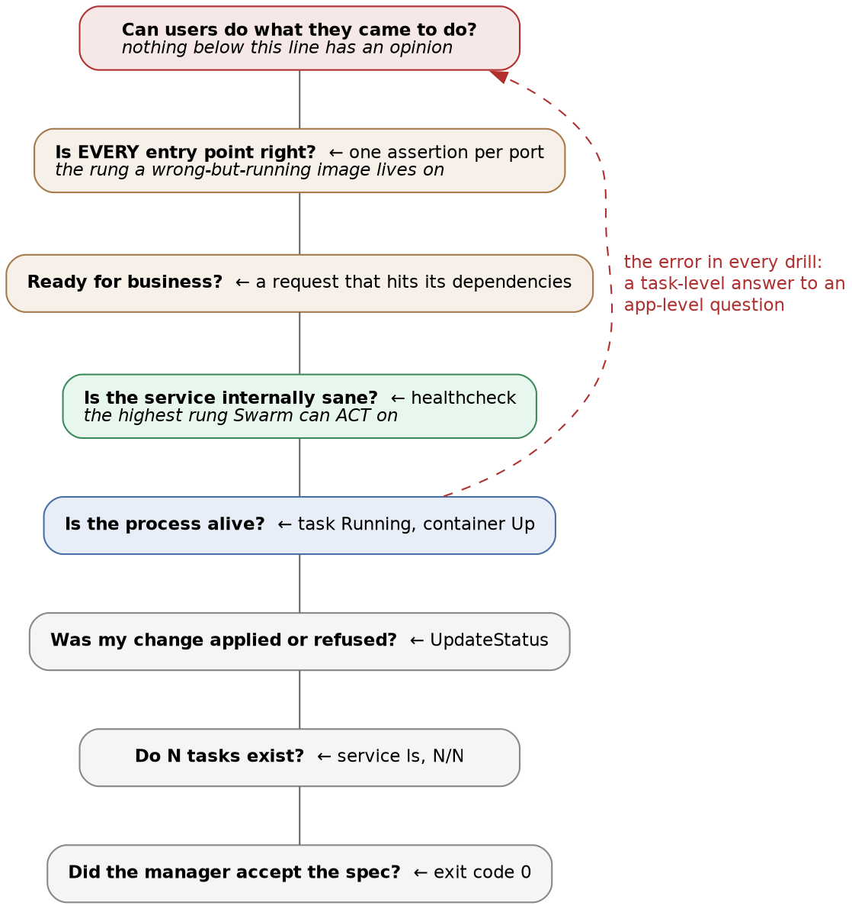

# Docker Swarm · Chapter 6 — False Greens: Why "Converged" Is Not "Working"

> **Series:** Home-Lab Education · Phase 16 (Docker Swarm)
> **Built and verified:** August 13–18, 2026 on the three-manager cluster from Chapter 1
> **Versions at time of writing:** Docker 29.7.2 · Compose file format 3.8
> **Read this before:** nothing — this is the chapter the others were building toward
> **Read this after:** Chapters 2, 4 and 5 — the deploys, the state, and the drills

---

## What this chapter covers

This chapter was not planned. It exists because the same phenomenon appeared in **every** failure drill,
in the tooling we wrote to catch it, and in five of our own experiments:

[a system reports success for a question it was never asked.]{custom-style="Key"}

Nothing here is a bug in Docker. [Every green signal in this chapter was **honest about its own
contract**]{custom-style="Key"}. The error was ours each time: [reading a lower layer's truthful answer as though it settled a]{custom-style="Key"}
higher layer's question. That mistake is [the most common cause of a long outage that "monitoring didn't]{custom-style="Key"}
catch", and it is completely learnable.

---

## 1. The drill that started it: six of seven signals said healthy

We scaled the database to zero replicas while the application was running and healthy, expecting the
backend to crash-loop. It did not. It retried its connection **fifteen times** — roughly thirty seconds
of cushion — gave up, and logged:

```
Failed to import demo data, using minimal bootstrap: … Name or service not known
INFO:     Application startup complete.
```

**"Application startup complete."** [With no database in the cluster at all]{custom-style="Key"}.

Here is every signal that was checked during the drill, with what each one said:

| # | Signal | Said | Truthful about |
|---|---|---|---|
| 1 | `docker service ps` | 2 tasks `Running`, no failures | The tasks are up |
| 2 | `docker stack services` | `capricorn_backend 2/2` | Two containers exist |
| 3 | `restart_policy` | never triggered | Nothing *exited* — nothing did |
| 4 | `deploy_swarm.sh` convergence poll | would converge and print digests | The desired state was reached |
| 5 | `/health` | `{"status":"healthy"}` | The route is wired up |
| 6 | `/api/v1/banking/health` | `{"status":"healthy","module":"banking"}` | That route too — **it touches nothing** |
| 7 | 🎯 **A request that reads the database** | **HTTP 500** | 🎯 **Whether it works** |

⭐ **[Six green, one red, and only the red one was asking a useful question.]{custom-style="Key"}** Notice that none of the six
is wrong. `2/2` is a true statement about replica count. `Running` is a true statement about the task.
[Even the *application's own* health endpoints are truthful — about routing, which is all they test]{custom-style="Key"}.
**[Every one of them answers a question you did not mean to ask]{custom-style="Key"}** — and two of them were designed by the
application's authors to sound like they answer the big one.

### Why the application did this, and why it will happen to you

The retry loop is *good* engineering. Chapter 2 explains why `depends_on` cannot exist in a cluster:
there is no moment at which "the database has started" is a stable global fact, so services must
tolerate absent dependencies and retry. **Our application does exactly what the platform requires.**

The defect is the last step. Having exhausted its retries, it **caught the exception and continued** to
serve — announcing success rather than refusing to start.

> ⭐ **The general rule, and it applies to anything you write: [an application that cannot do its job
> must fail loudly at start-up, not serve errors quietly.]{custom-style="Key"}** The choice looks like resilience versus
> brittleness and is really about **who finds out.** Refuse to start, and your orchestrator sees a failed
> task, stops the rollout, and rolls back — the machinery in Chapter 5 all works. Start anyway, and the
> [orchestrator has nothing to react to, so **discovery is deferred to a user.**]{custom-style="Key"}

⚠️ **And notice [the dependency failure did not look like a connection error]{custom-style="Key"}.** With the service scaled to
zero it disappeared from Swarm's internal DNS, so the symptom was `Name or service not known` — a *name
resolution* failure. **In Swarm, "my dependency has no replicas" and "I have a DNS problem" produce the
same message**, and the first is far more likely.

---

## 2. A taxonomy of the false greens we produced

Every one of these was observed on the real cluster:

| # | The lie | What was actually wrong | Chapter |
|---|---|---|---|
| 1 | `Running` + `startup complete` | No database existed | 6 §1 |
| 2 | `completed` + `EXIT=0` + smoke gate **passed** | The entire frontend was replaced by nginx's welcome page | 5 §1 |
| 3 | `1/1` + `converged` | Redis dataset was empty; its data was stranded on another node | 4 §1 |
| 4 | `3/3` on the expected tag | The deploy had been **rejected and rolled back** | 5 §1 |
| 5 | Nothing at all — no alert, no error | Capacity had silently fallen to `1/2`, `1/3` and `0/1` after a reboot | 5 §3 |
| 6 | `✅ Bootstrap complete` | Three of four workers had failed and fallen back to a degraded path | 4 §3 |
| 7 | `managers=0 nodes=0` with `ControlAvailable=true` | Quorum was lost; the field means "configured as a manager" | 5 §2 |
| 8 | A drill that "worked" | The wrong stack file was deployed; the result was void | 5 §5 |

⭐ **Read down the "actually wrong" column: a missing database, a missing UI, a missing dataset, a
refused change, missing capacity, a corrupted import, a dead control plane, and a fabricated
measurement.** [There is no category of failure in this phase that did **not** present as green]{custom-style="Key"}
somewhere.

### The structural reason: each layer honestly reports its own contract



[**Swarm's contract is "a container matching this spec is running somewhere".**]{custom-style="Key"} It fulfils that contract
with real rigour, which is why it is trustworthy — and it is why it can never answer the question at the
top. [There is no configuration that makes a lower rung report on a higher one]{custom-style="Key"}.

> ⭐ **So the discipline is not "distrust the orchestrator". It is: know which rung each signal sits on,
> and [never accept an answer from a rung below the question]{custom-style="Key"}.** Almost every incident in this phase was
> an instance of one specific version of that error — accepting a **task-level** signal as an answer to
> an **application-level** question. `Running` is rung four of the figure's eight. ["Can users do what they came to do?" is rung eight, and nothing below it has an opinion]{custom-style="Key"}.

---

## 3. The instrument we built, and its measured blind spot

After Drill A, `deploy_swarm.sh` gained a **smoke gate**: after convergence, poll an endpoint that
cannot succeed unless the dependency chain works, and fail the deploy if it does not.

```bash
# after convergence, before declaring success:
#   1. call an endpoint that must touch the database
#   2. require the expected content, not just a 200
#   3. require a row count the schema alone cannot produce
```

```
==> smoke gate: is it ready for business? (timeout 90s)
    /api/v1/banking/categories -> 200, body matched
    /api/v1/data/summary -> total=682 rows
```

**It works.** It is the only thing that caught the secret rotation in Chapter 4 §2 — a deploy where all
four services converged, digests resolved, and every task was `Running`:

```
SMOKE FAILED: /api/v1/banking/categories returned 500
  body: {"detail":"Internal server error"}

The stack CONVERGED and is still broken - which is the whole reason this gate exists.
```

### Three design decisions that turned out to be load-bearing

[**A `200` is not enough — check the body.**]{custom-style="Key"} An error page, a login redirect and a proxy's default page
are all `200`. C6b is the proof: [nginx's welcome page is a perfectly valid `200`]{custom-style="Key"}.

**Count rows, and pick a threshold the schema alone cannot reach.** Our first version required *at least
one* row, which is nearly useless: the database's own initialisation scripts insert reference data, so
["more than zero rows" is true of a database that has never seen the application]{custom-style="Key"}. We raised it to **100**
after measuring [what the application's degraded fallback path actually writes: **about one row.**]{custom-style="Key"} A
[threshold is only a discriminator if it sits between the two states you are distinguishing]{custom-style="Key"} — so
**measure the failure mode before choosing the number.**

**Retry with a timeout, and report the code you actually got.** An early version printed `HTTP 000000`,
because a failed `curl` was being invoked twice and its "no response" sentinel concatenated. A gate that
reports a nonsense code trains you to ignore it.

### 🚨 And the gate passed the worst failure in the track

C6b replaced the frontend with `nginx:alpine`. The gate printed `200, body matched` and `total=682 rows`
while every user saw *Welcome to nginx!*

**Because the gate polls the backend.** [It was written when the *backend* was the liar, so that is what]{custom-style="Key"}
it watches. It never had an opinion about the frontend, and its silence was indistinguishable from
approval.

> ⭐ **The lesson is about verification in general, and it is the one I would keep if I could keep only
> one from this phase: [verification does not compose.]{custom-style="Key"}** Proving that the backend can reach a correct
> database is genuinely valuable **and tells you nothing about the frontend.** A healthy dependency is
> not evidence about its consumer. **[Every published entry point needs its own assertion]{custom-style="Key"}, and each
> [assertion must test something only the correct thing behind it would produce]{custom-style="Key"}.**

✅ **Status of our own tooling — the gap was closed and then re-tested, which is the only closure that
counts.** The same evening, the frontend gained a healthcheck that greps the page for something only our
bundle serves, and the script gained a third gate asserting the same thing from outside on `:5001`.
Then C6b was **run again, identically**: the deploy that had passed green in the morning failed in 47
seconds with `rollback_started`, the nginx task never received a byte of ingress traffic, and sixteen of
sixteen probes during the failed rollout saw the real application (Chapter 5 §1, "C6b, closed").

⭐ **Note that [the two fixes sit on different rungs, and that is the design, not redundancy]{custom-style="Key"}.** The
healthcheck lets *Swarm* refuse the wrong container — the platform acts without an operator. Gate 3 lets
*the deploy script* refuse a port serving wrong content even if every healthcheck lies — the operator
verifies from outside. One instrument per rung, which is this chapter's §6 put into practice. **The
backend still has no healthcheck, deliberately: its wrong-but-running case is what Gates 1–2 transact
against, and the asymmetry is recorded in the manifest rather than left to be discovered.**

---

## 4. Honest logs, dishonest outcomes

The application's logging deserves its own section, because it was **truthful at every individual step
and misleading in aggregate** — a pattern worth recognising since it is so much more common than logs
that simply lie.

```
Failed to import demo data, using minimal bootstrap: … UniqueViolationError …   ← true
Failed to import demo data, using minimal bootstrap: … UniqueViolationError …   ← true
Failed to import demo data, using minimal bootstrap: … UniqueViolationError …   ← true
✅ Bootstrap complete: {… 'total': 682}                                          ← true, and misleading
```

Three workers failed and fell back to a degraded path. A fourth succeeded. The final line reports the
fourth worker's view, at `INFO`, decorated with a check mark — and it is **factually correct**. There
*were* 682 rows.

⭐ **Three properties made this dangerous, and none of them is "the log was wrong":**

1. [**The failure was logged at a lower severity than the success.**]{custom-style="Key"} The eye goes to the last line.
2. **The success line describes a different scope** — one worker's outcome — than the failures.
3. 🚨 [**The final state was decided by commit ordering.**]{custom-style="Key"} The full import happened to commit *last*. Had
   [a degraded worker committed last, the same log would have printed with a fraction of the data]{custom-style="Key"}.

> ⭐ **The rule this produces: [a summary line must describe the outcome of the whole operation, or it must]{custom-style="Key"}
> not be phrased as one.** "Bootstrap complete" is a claim about the system. The worker was only entitled
> to say "this worker finished". **And [any code path that catches an exception and continues owes the]{custom-style="Key"}
> reader an unmissable statement that it did so** — because the alternative is a log that reads as
> success and a system that is degraded.

**The practical takeaway is a grep.** The fingerprint of this failure is the fallback message. Search
your own environments for it; if it appears, that database was initialised by whichever process lost a
race, and nobody was told.

---

## 5. The same failure, with us in the orchestrator's role

Five times in this phase, one of our own instruments produced a confident, plausible, **wrong** answer —
and it is the same phenomenon: a green signal answering a question nobody asked. Three were whole runs
[that were void; two were probes inside a run that measured something other than what they claimed]{custom-style="Key"}.

| The instrument said | What was actually true |
|---|---|
| A drill "passed" in 2.3 seconds | **Void run** — the default stack file was deployed; the broken variant was never used |
| A control experiment ran on an "empty" database | **Void run** — `docker volume rm` had failed, with stderr suppressed |
| A script ran "on the node" | **Void run** — it ran on the workstation; a shared mount made both look identical |
| A password was "rejected" | **Invalid probe** — it had actually failed on a database name that does not exist |
| A password "worked" | **Invalid probe** — loopback connections are `trust`, so it never tested the password at all |

⭐ **A successful-looking run is the most dangerous outcome of a badly instrumented experiment**, because
[it is indistinguishable from a real one and it goes into the notes as a finding]{custom-style="Key"}. Four practices came out
of this, and they are cheap:

1. 🚨 **Assert preconditions; do not print them.** Our deploy script *printed* the file it was deploying,
   on line three. [That is not a control — it is a hope that a human reads carefully at the exact moment]{custom-style="Key"}
   they are least likely to.
2. ⭐ **Never suppress stderr on a step the experiment depends on.** `2>/dev/null || echo "already gone"`
   turned a failed deletion into a reassuring message.
3. ⭐ **Never let a probe report a cause it did not distinguish.** `cmd && echo WORKS || echo FAILED`
   collapses every failure mode into one label. Print the real error.
4. ⭐ **When two probes of one fact disagree, at least one is measuring something else.** Find out which
   *before* concluding. This is how the `trust` finding surfaced — the two invalid probes above contradicted each other, and
   chasing the disagreement produced a real discovery. **A wrong measurement examined honestly is worth
   more than a right one taken on faith.**

**And write the prediction down before running the command.** It is the only instrument that catches the
[failure where you learn nothing because you had no expectation to violate]{custom-style="Key"}. Our quorum prediction was
**wrong**, and that refutation is among the most useful facts in this track; it would not exist if we had
not committed to a guess we could lose.

---

## 6. What to actually do

### The ladder, and one instrument per rung

| Question | Instrument | Rung it really answers |
|---|---|---|
| Did the manager accept my spec? | `docker stack deploy` exit code | Accepted — **not** applied |
| Do N tasks exist? | `docker service ls` → `N/N` | Steady state — **not** "my change is live" |
| Was my change applied or refused? | `UpdateStatus.State` | The update itself |
| Is the process alive? | Task `Running`, container `Up` | Liveness only |
| Is the service internally sane? | `healthcheck` in the image | 🎯 The only correctness signal **Swarm can act on** |
| Is it ready for business? | A request that exercises its dependencies | The application |
| Is *each* entry point right? | One assertion per published port | 🎯 The rung C6b lives on |
| Did capacity survive maintenance? | `docker service ls` **read by something** after every window | The thing nobody watches |

⭐ **The healthcheck row is the highest-leverage one**, because it is the only rung where a correctness
signal is visible to the orchestrator. Everything below it is liveness; everything above it is your own
tooling. **[A healthcheck converts "wrong but running" into a failed task]{custom-style="Key"} — and a failed task is
something rollback can act on.**

### The three questions worth asking of any deploy pipeline

1. **What could be broken and still let this pipeline go green?** For our first version the honest answer
   was: the database, the dataset, the frontend, and the previous version still serving.
2. **Which of my checks would notice if the thing it watches were replaced by something that merely
   answers?** If the answer is "none", [every check is a liveness check wearing a costume]{custom-style="Key"}.
3. **After a reboot, what reads the replica count?** If nothing does, capacity is on an honour system.

> **Lab vs PROD — the deploy script is the only monitoring.** *In the lab:* correctness is checked once,
> at deploy time, by `deploy_swarm.sh`. There is no alerting, no dashboard, and nothing watching between
> deploys. *Why it's acceptable here:* the lab is driven by hand, the operator is present for every
> change, and drills are the point. *In production:* the same assertions run **continuously** as
> synthetic checks, and replica counts are alerted on rather than inspected — ⚠️ *an unverified
> prescription: standard practice, but nothing in this lab has tested it.* *If you carry the habit:*
> **[every failure that begins after a deploy is discovered by a user]{custom-style="Key"}.** Deploy-time verification only
> proves the system was correct at one instant — and the reboot that silently cost us three replicas
> happened at no deploy at all, which is precisely why nothing noticed.

---

## 7. Commands to know by heart

```bash
# The only question that matters, asked of the application itself:
curl -sS -o /tmp/b -w '%{http_code}' http://<host>:<port>/<endpoint-that-reads-the-database>
grep -q '<something only the real answer contains>' /tmp/b && echo REALLY OK

# Was my change applied, or refused and rolled back?
docker service inspect <svc> \
  --format '{{if .UpdateStatus}}{{.UpdateStatus.State}}{{else}}<absent>{{end}}'

# What does the application say about itself, as opposed to what Swarm says about it?
docker service logs <svc> --tail 60 | grep -iE 'error|failed|fallback|retry|refus'

# Did capacity survive the last maintenance window?
docker service ls --format '{{.Name}}\t{{.Replicas}}' | awk -F'[\t/]' '$2!=$3'

# Is a dependency actually absent, or is this really DNS? (they look identical)
docker service ls --filter name=<dependency>
```

The complete ledger for this track, indexed by the question each command answers, is
[`COMMANDS.md`](COMMANDS.md).

---

## 8. Glossary

| Term | Meaning |
|---|---|
| **False green** | A truthful success signal reporting on a narrower contract than the question being asked of it. |
| **Convergence** | Swarm's desired-state reconciliation completing. A statement about tasks; **no** statement about correctness. |
| **Readiness** | Whether a service can actually do its job, including dependencies. Swarm has no concept of it; a healthcheck is the closest available. |
| **Smoke gate** | A post-deploy assertion that exercises the dependency chain and fails the deploy if it does not hold. |
| **Discriminator** | A probe chosen to separate two competing explanations, rather than to confirm the one you prefer. |
| **Void run** | An experiment whose preconditions were not asserted. Its danger is proportional to how successful it looks. |

---

## 9. Check yourself

Answer out loud; the section is given rather than the answer.

1. Name the six signals that said "healthy" while the application had no database, and state precisely
   what each one was truthfully reporting. (§1)
2. Why is "retry, then start anyway and serve errors" worse than crashing, in terms of *who finds out*
   and *what the orchestrator can do*? (§1)
3. On the ladder in §2, which rung does `docker service ls` occupy, and which rung does "is the site
   working" occupy? (§2)
4. Our smoke gate requires 100 rows rather than 1. What did we have to **measure** before that number
   meant anything? (§3)
5. The gate passed while the entire frontend was replaced by nginx. State the general principle in one
   sentence. (§3)
6. Four log lines were each individually true and collectively misleading. Which three properties made
   them dangerous? (§4)
7. Of the five wrong measurements in §5, which would "assert preconditions" have prevented and which
   needed a different practice? Why is printing a precondition not the same as asserting one? (§5)
8. For a deploy pipeline you actually maintain: what could be broken today and still let it go green?
   (§6)
