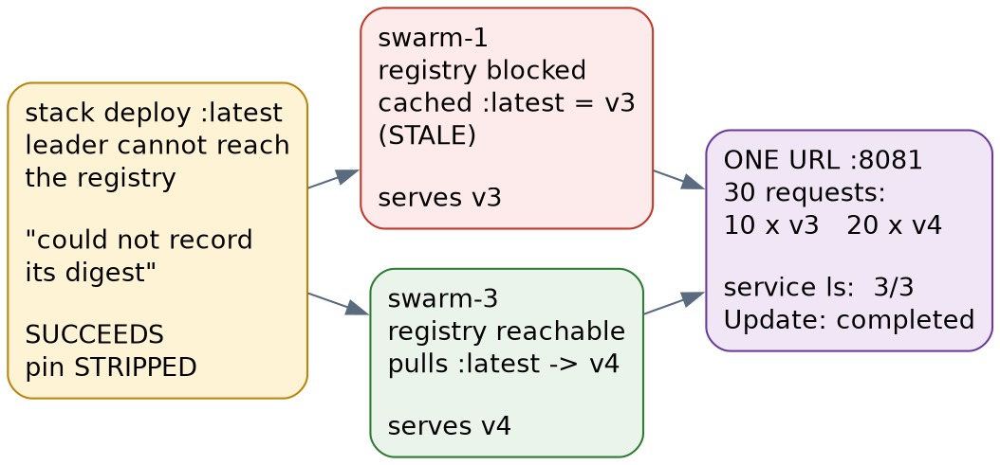

# Docker Swarm · Chapter 7 — The Tag That Lies, and Three Ways to Serve Yesterday's Code

> **Series:** Home-Lab Education · Phase 16 (Docker Swarm)
> **Built and verified:** August 19, 2026 on the three-manager cluster from Chapter 1
> **Versions at time of writing:** Docker 29.7.2 (API 1.55) on all three nodes · Swarm active, 3 managers / 3 nodes · private GitLab registry on `:5050`, listed under `insecure-registries`
> **Read this after:** Chapter 2 (which explains tags, digests and the routing mesh) and Chapter 6 (false greens — most of this chapter is one)
> **Read this before:** nothing depends on it

> 🤖 **DECLARATION — read this before you trust anything below.** Every command in this chapter was
> **executed**, and every output quoted is real. But unlike every other chapter in this track, it was
> **[run by the AI rather than by Andrew]{custom-style="Key"}**, at his explicit written instruction. The track's authority
> rule is *"only document what you actually ran"*, and the honest reading of that rule is that this
> chapter is **one step weaker than its siblings**: [the commands are verified]{custom-style="Key"}, the *operator judgement*
> behind them was not earned at a keyboard by the person whose name is on the shelf. Chapter 7 of the
> k3s track carries a similar declaration for a different reason — it was research-only. **Declaring
> the gap is what keeps the other six chapters worth something.**

---

## What this chapter covers

The planted trap was simple: *push a new image under the same `:latest` tag, redeploy, and see whether
anything changes.* It **could not fire** — and the reason it could not fire is worth more than the trap
would have been, because `"I pushed a fix and production is still running the old code"` then happened
**twice anyway**, by two mechanisms the plan never considered.

- why a tag is resolved **once**, and what actually gets stored in the service spec
- 🚨 a rolling update that reports `3/3` and `update in progress` **forever**, serving the old build,
  because of two settings that are each individually correct
- why `docker service update --force` **restarts the old code** and prints `converged` while doing it
- what does and does **not** strip a digest pin — the answer is the opposite of what we predicted
- 🚨 **two different builds served from one URL at the same time**, with every green signal agreeing
- the same pin, in the same cluster, **protecting** a rescheduled task from silently changing version
- what all of this means for anything that tries to check whether a deploy worked

Seven predictions were written down before any of it ran. **Two were wrong**, and both wrong ones are
more instructive than the five that were right.

---

## 1. A tag is a pointer. A digest is what gets stored.

`docker compose pull` taught a generation of engineers that `:latest` means *"whatever is newest"*.
Under Swarm it does not mean that.

When a service is created, the manager **resolves the tag to a content digest and stores the digest in
the service spec.** From that moment the service is pinned to an immutable image, and the tag is
decoration. You can see both halves at once:

```bash
docker service inspect --format '{{.Spec.TaskTemplate.ContainerSpec.Image}}' c7lab_web
```

```
gitlab.gothamtechnologies.com:5050/production/home-lab-setup/c7demo:latest@sha256:d30d2208b106…
```

**[The tag you typed AND the digest it meant at that instant.]{custom-style="Key"}** Those two facts can disagree for weeks
without anything complaining, because [nothing re-checks them unless you ask it to]{custom-style="Key"}.

The rig for this chapter is a throwaway image whose version is visible three separate ways — in the
**served HTTP body**, in an image **label**, and in a **file** inside the container:

```dockerfile
ARG VER=unset
FROM busybox:1.36
ARG VER
RUN mkdir -p /www \
    && printf 'C7LAB VERSION=%s\n' "$VER" > /www/index.html \
    && printf '%s\n' "$VER" > /VERSION
LABEL c7lab.version="$VER"
CMD ["httpd", "-f", "-v", "-p", "80", "-h", "/www"]
```

That redundancy is not decoration either. **The spec's digest tells you what Swarm intends to run; the
[HTTP body tells you what is actually answering users]{custom-style="Key"}.** Chapter 6 exists because those are different
questions, and §6 of this chapter is where they give different answers.

Five builds were pushed to the same `:latest` over about twenty minutes: **v1 `d30d2208`, v2
`95cd3d5e`, v3 `f48635d1`, v4 `f05816b9`, v5 `863a63a0`**. Those short digests are how every claim
below is checked.

---

## 2. The trap that could not fire

`docker stack deploy` defaults to `--resolve-image always`. It re-queries the registry on **every**
deploy, so a moved tag is picked up immediately:

```
=== SPEC BEFORE ===   …/c7demo:latest@sha256:d30d2208…   (v1)
=== docker stack deploy (default --resolve-image always) ===
Updating service c7lab_web
=== SPEC AFTER ===    …/c7demo:latest@sha256:95cd3d5e…   (v2)
```

The spec followed the tag, exactly as designed. **[So the trap as written was unfireable]{custom-style="Key"}** — which
makes it the second trap in this phase whose lesson is why it *cannot* happen the way the plan assumed.

The plan had named a **real symptom** [and attached it to the **wrong cause**]{custom-style="Key"}. That is worth pausing on,
[because a trap list is a set of hypotheses]{custom-style="Key"}, and *"this one was unfireable"* is a result, not a
failure. The symptom was waiting two paragraphs away.

---

## 3. Healthy, `3/3`, and stuck forever

The deploy above never finished. Fifty seconds later all three replicas were still serving **v1**,
and four and a half minutes later nothing had changed:

```bash
docker service ps c7lab_web --no-trunc \
  --format '{{.Name}} | {{.Node}} | {{.DesiredState}} | {{.CurrentState}} | {{.Error}}'
```

```
c7lab_web.3 |                | Running | Pending | "no suitable node (max replicas per node limit exceed)"
c7lab_web.3 | docker-swarm-2  | Running | Running 2 minutes ago
```

Two settings, each defensible on its own, cannot both be satisfied:

- **`order: start-first`** requires the replacement task to be *Running before* the old one stops. It
  [is the standard choice for zero-downtime rollouts]{custom-style="Key"}, and Capricorn's own frontend uses it.
- **`max_replicas_per_node: 1`** forbids two replicas of a service on one node. It is the standard
  anti-affinity idiom, and the reason you would write it is to guarantee spread.

With **three replicas across three nodes, [every node is already at its cap]{custom-style="Key"}**, so the replacement has
nowhere to go. And [Swarm does not treat that as a failure]{custom-style="Key"} — it simply waits.

🚨 **What an operator sees while this is happening:**

| Signal | Reads | The truth |
|---|---|---|
| `docker service ls` → REPLICAS | `3/3` | [Correct, and useless: the **old** tasks are all healthy]{custom-style="Key"} |
| `docker service ls` → IMAGE | `…/c7demo:latest` | The tag you asked for. **[This column never shows the digest]{custom-style="Key"}** |
| `UpdateStatus.State` | `updating` | [Permanent, not transient]{custom-style="Key"} |
| `UpdateStatus.Message` | `update in progress` | [It is not progressing]{custom-style="Key"} |
| Spec digest | `95cd3d5e` (v2) | What Swarm **intends** |
| Served to users | **v1** | What they **get**, indefinitely |

[Nothing here is lying.]{custom-style="Key"} `3/3` is true. `update in progress` is true. **Every signal is honest and the
[conclusion a human draws from them is wrong]{custom-style="Key"}**, which is precisely the shape Chapter 6 catalogues.

⭐ **This is the exact mirror of the C6a finding in Chapter 5.** There, `max_replicas_per_node` was
unset, so `start-first` was allowed its extra task and the count read **`4/3`** mid-rollout. Here that
same fourth task is *forbidden*, so [instead of an over-count you get a silent permanent stall]{custom-style="Key"}. **Same
mechanism, opposite symptom, and `replicas == node count` is the condition that flips one into the
other.**

### The fix, and the cost the fix hides

```bash
docker service update --replicas-max-per-node 0 c7lab_web     # note: NOT --max-replicas-per-node
```

The pending task placed immediately and the update completed within about twenty-five seconds. But
watch where the tasks landed:

```
c7lab_web.1 | docker-swarm-3 | Running
c7lab_web.2 | docker-swarm-2 | Running
c7lab_web.3 | docker-swarm-1 | Running     ← then, after a later rotation:
c7lab_web.1 | docker-swarm-3      c7lab_web.2 | docker-swarm-3      c7lab_web.3 | docker-swarm-1
```

**[Two replicas on one node and none on another.]{custom-style="Key"}** [The cap was doing a real job]{custom-style="Key"}; deleting it traded a
stalled rollout for a silent loss of spread. The honest resolutions are `order: stop-first` (accept a
brief gap) **or** keeping replicas below the node count — not removing the constraint and moving on.

⚠️ **Two footnotes that cost real minutes.** The CLI flag is `--replicas-max-per-node` while the
compose key is `max_replicas_per_node`; [the same concept is spelled differently in the two places]{custom-style="Key"}. And
fixing it with `docker service update` fixes only the **running service** — [the manifest still carried]{custom-style="Key"}
the cap, so the next `docker stack deploy` would have re-imposed it. **An imperative fix does not
survive a declarative deploy.**

> **Lab vs PROD — `replicas == node count`.** *In the lab:* three replicas on three nodes, which is
> what made the deadlock reachable at all. *Why it's acceptable here:* the cluster exists to be broken,
> and a tight fit exposes placement conflicts that a roomy cluster hides. *In production:* leave
> headroom, so a rolling update always has somewhere to put the new task — and if you need strict
> anti-affinity, pair it with `stop-first` rather than `start-first`. *If you carry the habit:* a
> zero-downtime rollout becomes a **permanent no-op that reports itself as in progress**, and the first
> person to notice will be a user asking why the bug they reported is still there.

---

## 4. `--force` restarts the old code, and says `converged`

With the registry's `:latest` now pointing at **v3** and the spec pinned to **v2**, the most natural
recovery instinct is to restart the service:

```bash
docker service update --force c7lab_web
```

```
verify: Waiting 1 seconds to verify that tasks are stable...
verify: Service c7lab_web converged
```

[Every task was destroyed and recreated]{custom-style="Key"}. The spec digest was unchanged — `95cd3d5e` before and after —
so **all three replicas came back as v2 while the registry held v3.**

`--force` [recreates tasks *from the existing spec*]{custom-style="Key"}, and the spec holds a **digest**, not a tag. There
is nothing in the mechanism that would consult the registry. **This is the "I restarted it and it's
still running the old code" classic in three lines**, and the word `converged` is the sharpest part:
[the command truthfully reports that it achieved the state it was asked for]{custom-style="Key"}.

**`--force` [is a restart. It is not a deploy.]{custom-style="Key"}** [If you want the new image you have to say so]{custom-style="Key"}, either by
redeploying the stack or with an explicit `--image`.

---

## 5. What actually strips the pin — and what doesn't

We predicted that `--resolve-image never` would drop the digest and leave a bare tag. **It does the
opposite:**

```bash
docker stack deploy -c c7lab.stack.yml --resolve-image never --with-registry-auth c7lab
```

```
=== spec AFTER ===   …/c7demo:latest@sha256:95cd3d5e…      ← digest still there
```

`never` means *do not query the registry*, [so the digest already in the spec]{custom-style="Key"} **survives untouched**.
[It is the safest of the three modes, not the most dangerous.]{custom-style="Key"}

⭐ **Stripping a pin requires a resolution that is ATTEMPTED AND FAILS, not one that is skipped.** To
get that, [break name resolution on the leader]{custom-style="Key"} — the node where `stack deploy` resolves — and deploy
normally:

```bash
echo "127.0.0.1 gitlab.gothamtechnologies.com" | sudo tee -a /etc/hosts
docker stack deploy -c c7lab.stack.yml --with-registry-auth c7lab
```

```
Updating service c7lab_web
image …/c7demo:latest could not be accessed on a registry to record
its digest. Each node will access …/c7demo:latest independently,
possibly leading to different nodes running different
versions of the image.
```

```
=== spec AFTER ===   …/c7demo:latest        ← the digest is GONE
```

**[The deploy succeeded.]{custom-style="Key"}** It [did not fail, did not roll back, did not exit non-zero]{custom-style="Key"}. It printed a
warning into scrollback and [quietly downgraded a guarantee to a hope]{custom-style="Key"}. Chapter 5 saw the first half of
this under trap C6, with an image tag that did not exist; here it composes with a tag that **has
actually moved**, which is what makes it dangerous rather than merely untidy.

---

## 6. Two builds, one URL, every light green



*How a registry blip during a deploy leaves a service serving two different builds simultaneously.*

The warning says *"different nodes running different versions."* Making that literal took one more
step, and the step is the finding: **[it is not a single-fault condition]{custom-style="Key"}.** With the pin stripped, the
nodes that could still reach the registry all pulled `:latest` and converged on the newest build. We
[had predicted they would use their local caches; they did not]{custom-style="Key"}.

⭐ **A bare tag does not mean "use what you have" — it means "[each node asks the registry itself]{custom-style="Key"}."**
[The local cache is the **fallback**, not the first choice.]{custom-style="Key"} So divergence needs **two** faults at once:

1. the pin **stripped** (a resolution attempted and failed at deploy time), **and**
2. at least one node holding a **stale** `:latest` *while unable to reach the registry*, so its
   fallback disagrees with what its peers freshly pull

Constructed deliberately — `.191` blocked from the registry with a stale local `:latest` of v3, while
`:latest` in the registry pointed at v4 — a single `--force` produced this:

```
--- service ls ---
c7lab_web   replicated   3/3   …/c7demo:latest   *:8081->80/tcp
--- UpdateStatus ---
completed | update completed
--- what each replica ACTUALLY runs ---
  .191  v3  sha256:f48635d16729
  .193  v4  sha256:f05816b9c02e
--- 30 requests through the routing mesh, one URL ---
     10 v3
     20 v4
```

**One service. `3/3`. `update completed`. [Two different builds answering the same published port]{custom-style="Key"}**, in
[a ratio that exactly matches the task distribution]{custom-style="Key"}. A user's experience depends on which replica the
routing mesh happens to pick — and Chapter 2 covered why you cannot choose.

Think about what this does to debugging. A bug report that reproduces one time in three is normally
[read as a race condition, a caching layer, or an unlucky client]{custom-style="Key"}. **The idea that a third of your fleet
[is running different code does not naturally occur to anyone]{custom-style="Key"}**, because every instrument you would
reach for says the deploy finished.

> **Lab vs PROD — a moving `:latest` in a deployed service.** *In the lab:* every image is published
> and deployed as `:latest`, inherited from what the application already did. *Why it's acceptable
> here:* the cluster is disposable and the tag's behaviour is the subject of study. *In production:*
> deploy an **immutable** tag (a commit SHA or build number) or a digest outright, so a service spec
> can never be ambiguous about which build it means. *If you carry the habit:* you keep the two faults
> above permanently one registry blip apart — and, worse, you lose the ability to tell what is
> running from the spec alone, which is the only artefact an incident review will have.

---

## 7. The same pin, protecting you

The pin is not a defect. Restore it by deploying normally with the registry reachable, then move
`:latest` **again** — to v5 — and kill a task without redeploying:

```bash
docker rm -f "$(docker ps -q --filter name=c7lab_web | head -1)"
```

```
c7lab_web.1 | docker-swarm-3 | Running 33 seconds ago
c7lab_web.1 | docker-swarm-3 | Failed  38 seconds ago | "task: non-zero exit (137)"
```

[The replacement pulled **by digest** and came up **v4**]{custom-style="Key"} — not the v5 sitting in the registry. All three
replicas stayed identical.

⭐ **This is [the same mechanism as §4 with the opposite consequence]{custom-style="Key"}, and holding both at once is the
actual lesson.** Pinning is what stops a task that reschedules at 3am — because a node rebooted, or a
container OOMed — from silently coming up as a **different build from its siblings**. The property that
frustrates you when you want a new version is the property that keeps your fleet homogeneous when you
are not looking.

So the rule is not *"pinning is good"* or *"pinning is bad"*. It is: **know which of the two you are
[relying on right now, and know which commands change it.]{custom-style="Key"}**

| You run | Registry consulted? | Spec digest | Replicas end up |
|---|---|---|---|
| `docker stack deploy` (default) | yes | re-resolved to newest | new build |
| `docker stack deploy --resolve-image never` | no | **preserved** | unchanged |
| `docker service update --force` | no | **preserved** | unchanged — old build restarted |
| `docker stack deploy`, registry unreachable | attempted, **fails** | 🚨 **removed** | per-node, whatever each resolves |
| task dies, no deploy | no (uses stored digest) | preserved | matches siblings |

---

## 8. What this does to a deploy checker

Chapter 3 built a convergence check that treats anything other than exactly `N/N` as pending, and
requires `UpdateStatus` to reach `completed`. [Both were the right calls]{custom-style="Key"}, and **neither would have
caught anything in this chapter:**

- §3's deadlock sits at `3/3` with `updating` — [the checker would wait, then time out]{custom-style="Key"}, and report a
  *timeout*, [which is a true statement about the wrong subject]{custom-style="Key"}.
- §6's split fleet reads `3/3` **and** `completed`. [A checker built on those two signals passes it.]{custom-style="Key"}

The only signals that told the truth were the ones that [asked a **different question**]{custom-style="Key"}: the spec's
digest, and the version actually served over HTTP. That is the same conclusion Chapter 6 reached from
eight other directions — **one instrument per question** — and it is the reason the smoke gate asserts
on a body match rather than a status code.

⚠️ **One instrument was already right, and it is worth naming because it was a near-miss.** A throwaway
probe using `{{.UpdateStatus.State}}` errored with `map has no entry for key "UpdateStatus"` when the
field came back `null`. `deploy_swarm.sh` already guards exactly that with `{{if .UpdateStatus}}` and
a documented note from a previous session. **The committed tooling was correct and the ad-hoc command
was not** — which is [an argument for running the real script rather than a quick approximation of it]{custom-style="Key"}.

---

## 9. Honest limitations

- 🤖 **Not run by Andrew.** See the declaration at the top. [This is the chapter's main limitation]{custom-style="Key"} and
  it is not a small one.
- **The divergence in §6 [was constructed, not stumbled into]{custom-style="Key"}.** Both faults were arranged deliberately.
  That is the right way to demonstrate a two-fault condition, but it means this chapter shows the
  mechanism is *real* — not that it is *likely*.
- **`max_replicas_per_node: 1` was our own choice**, made to force one replica per node so divergence
  would be observable. Capricorn's four services all run with no per-node cap, measured, so the
  production-facing stack in this lab was never exposed to §3's deadlock.
- **Three VMs on one physical host** [simulates node failure, not host failure]{custom-style="Key"} — the same caveat as
  every other chapter in this track.
- **The registry outage was simulated with `/etc/hosts`**, which fails fast with `connection refused`.
  A real outage that *hangs* instead of refusing may behave differently on timeouts, and that was not
  tested.
- ⚠️ **Every `docker push` to this registry failed on its first attempt** with `error from registry:
  blob unknown to registry`, and succeeded on the retry — **[four times out of four]{custom-style="Key"}.** It looks like a
  permissions or existence problem and is neither. Recorded because a CI job without a retry would
  fail here consistently and send you chasing the wrong cause entirely.

---

## 10. Commands to know by heart

```bash
# What does Swarm INTEND to run? (the only place the digest appears)
docker service inspect --format '{{.Spec.TaskTemplate.ContainerSpec.Image}}' <service>

# What is a replica ACTUALLY running? (run on the node that hosts it)
docker exec "$(docker ps -q --filter name=<service> | head -1)" cat /VERSION

# What do USERS get? Sample repeatedly - [one request proves nothing about a fleet]{custom-style="Key"}
for i in $(seq 30); do curl -s http://<node>:<port>/; done | sort | uniq -c

# Is a rolling update actually progressing, or stalled?
docker service ps <service> --no-trunc \
  --format '{{.Name}} | {{.Node}} | {{.DesiredState}} | {{.CurrentState}} | {{.Error}}'
docker service inspect --format '{{if .UpdateStatus}}{{.UpdateStatus.State}}{{end}}' <service>

# Placement and update policy - the pair that can deadlock
docker service inspect \
  --format 'maxPerNode={{.Spec.TaskTemplate.Placement.MaxReplicas}} order={{.Spec.UpdateConfig.Order}}' <service>

# Release a start-first rollout that cannot place its replacement
docker service update --replicas-max-per-node 0 <service>
```

---

## 11. Glossary

| Term | Meaning |
|---|---|
| **Tag** | A mutable human-readable pointer to an image, e.g. `:latest`. [Can be moved at any time by anyone who can push.]{custom-style="Key"} |
| **Digest** | The immutable content hash of an image manifest, `sha256:…`. Two digests being equal means the images are byte-identical. |
| **Pinning** | Swarm resolving a tag to a digest **once**, at service create or re-resolve, and storing the digest in the spec. |
| **`--resolve-image`** | `always` (default) re-queries the registry each deploy; `never` keeps the stored digest; `changed` only re-resolves when the image string differs. |
| **`start-first`** | Update order that starts the replacement before stopping the old task. Zero-downtime, but needs somewhere to put the extra task. |
| **`max_replicas_per_node`** | Placement cap on replicas of one service per node. CLI spells it `--replicas-max-per-node`. |
| **`UpdateStatus`** | Latch describing the most recent rollout: `updating`, `completed`, `rollback_started`, `rollback_completed`. **Absent (`null`) on a service never updated.** |
| **Routing mesh** | Swarm's load balancer: a published port on any node reaches any replica. [Which replica is not yours to choose.]{custom-style="Key"} |

---

## 12. Check yourself

Answer out loud. Section references, not answers.

1. A service spec says `:latest@sha256:abc…` and the registry's `:latest` now points at `def…`. What
   is running, and which single command tells you? (§1, §7)
2. You restart a service with `--force` to pick up a fix. What actually happens, and what does the CLI
   print while it happens? (§4)
3. Which of `always`, `never`, and *a failed resolution* removes a digest pin? Why is that the opposite
   of what most people would guess? (§5)
4. A service reads `3/3` and `update in progress` for five minutes. Name two entirely different causes,
   and the command that distinguishes them. (§3)
5. A bug reproduces about one request in three. What would make you suspect the fleet rather than the
   code, and how would you confirm it in under a minute? (§6)
6. Why does divergence require **two** faults rather than one, and which fault is the one people
   routinely shrug off? (§6)
7. A node reboots at 3am and its task reschedules. Why does digest pinning make this safer, and what
   would you lose by "fixing" the pin so deploys are easier? (§7)
8. Your deploy checker asserts `N/N` replicas plus `UpdateStatus: completed`. Which two failures in
   this chapter does it pass, and what third assertion would catch them? (§8)
