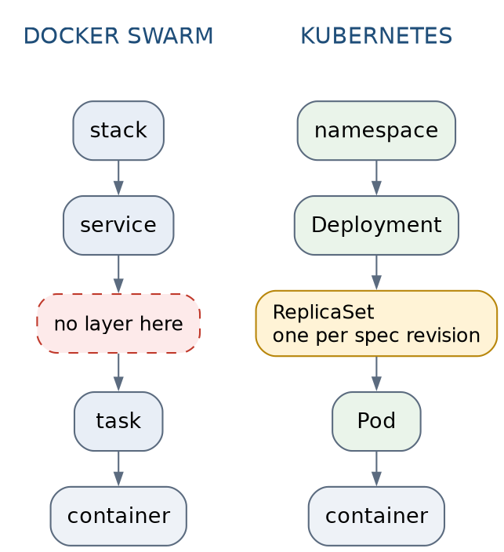

# Docker Swarm · Chapter 8 — Swarm ↔ Kubernetes: A Crib Sheet From Having Run Both

> **Series:** Home-Lab Education · Phase 16 (Docker Swarm), Part 7
> **Written:** August 19, 2026 — the last deliverable of the Swarm track
> **Versions the two labs actually ran:** Docker 29.7.2 (API 1.55), Swarm with 3 managers / 3 nodes · k3s v1.36.2+k3s1 (Kubernetes 1.36), **one** node, containerd 2.3.2, SQLite datastore
> **Read this after:** chapters 1–7 of this track and chapters 1–6 of the k3s track. It is a synthesis and assumes both.
> **Read this before:** nothing depends on it

> **DECLARATION — how to read every claim below.** This chapter **ran no commands.** It is a synthesis
> of two tracks that did, and the only thing that [makes it worth more than a blog post]{custom-style="Key"} is that every
> row is labelled with where it came from. The labels are used without exception:
>
> | Mark | Means |
> |---|---|
> | **S** | Measured on this track's **three-node** Swarm cluster, by hand |
> | **K** | Measured on the k3s track's **single-node** cluster, by hand |
> | 🤖 | Measured, but in **Chapter 7**, which was AI-executed — one step weaker |
> | ⚠️ **recited** | **Neither lab ran it.** Textbook knowledge, flagged so it is never quoted as experience |
>
> If a row has no mark, it is definitional — the meaning of a word, not a finding.

---

## What this chapter covers

A comparison written from two labs of **opposite shapes**, which is both the reason it is worth
reading and the reason it needs so many caveats.

- why "Kubernetes didn't show that" [almost always means]{custom-style="Key"} **my lab had one node**
- the one object-model layer Swarm does not have, and the two ergonomic differences that follow
- the actual crib sheet: command for command, with the three pairs that look identical and are not
- images and tags: **two orchestrators, [two opposite defaults, and neither one is safe]{custom-style="Key"}**
- the one place Kubernetes is structurally, honestly better — and it is not the one people cite
- quorum arithmetic that came out identical in three different places, including the same false green
- 🚨 the row the internet gets backwards: **[the PVC abstraction is not what protects your data]{custom-style="Key"}**
- where Swarm's simplicity is a genuine advantage, where it is a ceiling, and what it is *not* (fewer
  ways to be wrong)
- one honest paragraph: which one would run Capricorn, and what would change the answer

---

## 1. The two labs had opposite shapes

[Everything below has to be read through this table, so it comes first]{custom-style="Key"}.

| | **Swarm track** (this one) | **k3s track** |
|---|---|---|
| Nodes | **3** VMs, all three managers | **1** VM — control plane and workloads together |
| Control-plane store | Raft across 3 managers | **SQLite** on one node — not etcd |
| Workload | Capricorn: 4 services, real Postgres, deployed by a real GitLab CI pipeline | Redpanda, 3 brokers as 3 **pods on one node**, plus a Python order-management app |
| Deliberate traps | **7**, planted before the work started | none planted; failures found by drill |
| Chapters run by hand | 1–6 (7 was AI-executed) | 1–6 (7 is research-only) |

**What each lab could therefore prove.**

| Only the Swarm lab could show | Only the k3s lab could show |
|---|---|
| Volume state **stranded** on the wrong node (**S**, Ch 4 §1) | Readiness vs liveness behaving differently (**K**, ch2 §6–§7) |
| The routing mesh answering on a node with no task (**S**, Ch 2 §5) | Endpoint lists as a readable object, gated by readiness (**K**, ch1 §5) |
| Control-plane **quorum loss** while apps kept serving (**S**, Ch 5 §2) | A container **OOMKilled** with exit 137 and the app seeing nothing (**K**, ch2 §10) |
| A single manager IP as the whole delivery path (**S**, Ch 3 §6) | Consumer-group and partition semantics under kill and replay (**K**, ch5) |

⭐ **The rule that follows is the most transferable thing in this chapter.** When a comparison says
*"Kubernetes didn't show that"*, ask which of two things is meant: **a property the orchestrator
lacks**, or **[a property my lab could not observe]{custom-style="Key"}**. [Almost every honest row here is the second]{custom-style="Key"}.
Single-node k3s cannot lose control-plane quorum, cannot strand a volume, and cannot demonstrate a
multi-node Service — [none of which is a statement about Kubernetes]{custom-style="Key"}.

The bias runs the other way too. Swarm looks like it has more failure modes in this document, and it
does not: it got **three nodes, seven planted traps and a real pipeline**, while Kubernetes got one
node and no traps. [Unequal scrutiny produces unequal fault counts]{custom-style="Key"}. Say so out loud before quoting
any of it in an interview.

---

## 2. The object model, and the one layer Swarm does not have



Left to right the names map cleanly — `stack` to a namespace-ish grouping, `service` to `Deployment`,
`task` to `Pod`. [The mapping people rely on and the reality diverge at exactly one place]{custom-style="Key"}: **Kubernetes
[interposes a ReplicaSet, one per spec revision, and Swarm has no analogue]{custom-style="Key"}.**

Two consequences, both measured, and they point in opposite directions.

**Rollback depth.** A Swarm service keeps a `PreviousSpec` — one. `docker service rollback` therefore
[goes back exactly one step, always]{custom-style="Key"}, and there is nothing to enumerate. Kubernetes keeps a ReplicaSet
per revision, so `kubectl rollout history` and `undo --to-revision=N` exist.

**Who does the undoing.** This is the sharper difference and the labs measured both halves:

- **[Swarm rolls back by itself and does not tell you]{custom-style="Key"}.** With `failure_action: rollback`, a failed
  update reverts automatically — and the drill showed the **[exit code does not reveal it]{custom-style="Key"}** (**S**,
  Ch 5 §1). The deploy "succeeded".
- **[Kubernetes neither rolls back nor stops]{custom-style="Key"}.** A stalled rollout sits there. `progressDeadlineSeconds`
  sets a *condition* and **[does not halt anything]{custom-style="Key"}** (**K**, ch2 §6). And when `rollout undo` fixed the
  live cluster, [the manifest on disk and the recorded `last-applied-configuration` **stayed broken**]{custom-style="Key"} —
  [a healthy cluster whose desired state was still wrong]{custom-style="Key"} (**K**, ch2 §8).

So: [revision history buys real capability and introduces drift]{custom-style="Key"} between what is running and what is
written down. [One-step rollback avoids the drift by having nothing to drift from]{custom-style="Key"}, and hides the fact
that it happened. **[Neither default leaves you knowing what version you are on without asking]{custom-style="Key"}.**

---

## 3. The crib sheet

Shapes first. The last column is the important one — **three of these pairs look equivalent and are
not**, [and each of those three cost a lab session to find out]{custom-style="Key"}.

| Question | Swarm | Kubernetes | Same shape, different meaning? |
|---|---|---|---|
| Apply desired state | `docker stack deploy -c f.yml <stack>` | `kubectl apply -f f.yaml` | Swarm **silently ignores** compose keys it does not implement (**S**, Ch 2 §1) |
| What workloads exist | `docker service ls` | `kubectl get deploy` | Swarm's `REPLICAS` column is the one that lied in three different chapters |
| Where are the instances | `docker service ps <svc>` | `kubectl get pods -o wide` | — |
| Why won't it start | `docker service ps --no-trunc` (read `Error`) | `kubectl describe pod` | — |
| Logs | `docker service logs -f <svc>` | `kubectl logs -f deploy/<d>` | — |
| Scale | `docker service scale <svc>=5` | `kubectl scale deploy/<d> --replicas=5` | — |
| Change the image | `docker service update --image  <svc>` | `kubectl set image deploy/<d> c=` | — |
| **Restart in place** | `docker service update --force` | `kubectl rollout restart deploy/<d>` | 🚨 **Both surprise you, oppositely.** Swarm reuses the **stored digest** and restarts the *old build* while printing `converged` (🤖, Ch 7 §4). Kubernetes re-runs the **pull policy**, so with `IfNotPresent` and a warm cache it also restarts the old build (**K**, ch6 §4) — for a completely different reason |
| Undo | `docker service rollback <svc>` | `kubectl rollout undo deploy/<d>` | Swarm: **one step, no history**. Kubernetes: any revision — but the file stays stale (**K**, ch2 §8) |
| **Wait until done** | **nothing ships** — we wrote a poller (**S**, Ch 3) | `kubectl rollout status deploy/<d>` blocks and reports | 🚨 The single biggest day-to-day ergonomic gap. Ours had to learn `4/3`, `null` `UpdateStatus`, and a dead-node case by hand |
| Nodes | `docker node ls` | `kubectl get nodes` | Swarm's `MANAGER STATUS` column is separate from `STATUS`, and our guard missed it once (**S**, Ch 3 §7) |
| Take a node out | `docker node update --availability drain` | `kubectl drain <node>` | ⚠️ **recited** — neither lab tested drain against a quorum workload |
| Secrets | `docker secret create` → file in `/run/secrets` | `kubectl create secret` → env or volume | **Immutable vs editable** — §9 |
| Config files | `docker config create` | ConfigMap | Same immutability difference |
| Isolation | stack **name prefix** | real `namespace` objects, with RBAC and quotas | Swarm's is a naming convention, not a boundary |
| Desired state, verbatim | `docker service inspect <svc>` | `kubectl get deploy/<d> -o yaml` | Swarm's is the **only** place the digest appears (🤖, Ch 7 §1) |

Concepts with no row, [because Swarm has nothing to put in it]{custom-style="Key"}: **StatefulSet, PersistentVolumeClaim,
StorageClass, readiness probe, PodDisruptionBudget, HorizontalPodAutoscaler, CRD, operator,
init container.**

---

## 4. Images and tags: two opposite defaults, neither safe

[Both tracks arrived here independently, from opposite directions]{custom-style="Key"}. The k3s track wrote the cross-
reference first, in chapter 6:

> *"Swarm resolves a tag to a digest when it accepts a service spec and stores the digest, so a
> service does not follow a moving tag — which fixes this failure mode by default and introduces its
> own confusion instead: 'I pushed a fix and production is still running the old code.' Two
> orchestrators, one underlying truth — a tag is a mutable pointer and only a digest is an image."*

| | **Swarm** | **Kubernetes** |
|---|---|---|
| Who resolves the tag | the **manager**, when it accepts the spec | the **kubelet**, when it pulls |
| When | **once**, at accept or re-resolve | every time a pod starts, subject to policy |
| What the spec stores | tag **and digest** (**S**, Ch 2 §4) | the **tag only** |
| A tag moves under a running service | nothing happens until the next deploy | nothing happens until a pod restarts — then it depends on the policy |
| Characteristic complaint | *"I pushed a fix and prod runs old code"* | *"two pods, two builds"* |
| The measured bad day | 🚨 a **failed** resolution **strips the pin**, each node then resolves alone, and **two builds served from one URL** with every green signal agreeing (🤖, Ch 7 §5–§6) | 🚨 `rollout undo` re-resolves the mutable tag **at undo time** — *"a successful-looking rollback that changes nothing"* (**K**, ch6 §13) |

⭐ **[The conclusion is not the one the usual narrative predicts]{custom-style="Key"}.** On this specific axis **Swarm's
default is the safer of the two** — [pinning a digest at accept time is what stops a task that]{custom-style="Key"}
reschedules at 3am from coming up a different build from its siblings (🤖, Ch 7 §7). Kubernetes'
[default leaves the question open until the next pull]{custom-style="Key"}. Both are fixable the same way, and it is the
same fix either platform's documentation buries: **deploy an immutable tag or a digest, and stop
asking the orchestrator to guess.**

---

## 5. Health signals: one instrument versus two

This is the place where Kubernetes is **structurally, honestly better**, and it is worth being
[precise about why, because the reason is not]{custom-style="Key"} "probes are safer".

**Swarm has one signal:** the container `HEALTHCHECK`. It answers *"should this task be killed?"*
[There is no separate, expressible notion of]{custom-style="Key"} *"running, but not yet fit to receive traffic"*.

**Kubernetes has two**, and [the k3s lab measured that the split cuts in both directions]{custom-style="Key"}:

- A **readiness** probe pointed at a path that 404s: the rollout **stalls**, the pod is excluded from
  the endpoint list, and users keep getting `200 200 200` from the healthy pods. *"You shipped a
  broken build to production and not one user request touched it."* (**K**, ch2 §6)
- The **same wrong path** used as a **liveness** probe: the rollout **succeeds**, and then users get
  `000 000 000`. (**K**, ch2 §7)

Now put C6b next to that. A stock `nginx` image, deployed in place of the application, **started
perfectly and served the wrong site**; six of seven signals said healthy (**S**, Ch 6 §1). A readiness
probe is exactly the instrument that keeps such a container out of rotation — **and only if the probe
asserts on the application rather than on the port**, which is the other thing the k3s track measured:
*[a probe that does not test the application cannot fail]{custom-style="Key"}.*

So the advantage is real but narrower than it sounds: **Kubernetes gives you a place to point the
right question. [It does not supply the question]{custom-style="Key"}.** [Swarm gives you nowhere to put it]{custom-style="Key"}, which is why
this track's smoke gate asserts on a response **body** from outside the cluster instead.

---

## 6. Rolling updates, and what reports progress

| | Swarm | Kubernetes |
|---|---|---|
| Knobs | `parallelism`, `delay`, `order`, `monitor`, `failure_action` | `maxUnavailable`, `maxSurge`, `minReadySeconds`, `progressDeadlineSeconds` |
| Can exceed the desired count | **yes** — `start-first` gives `4/3` (**S**, Ch 3 §7) | yes — `maxSurge` |
| On failure, by default | reverts, **silently** (**S**, Ch 5 §1) | stalls, indefinitely (**K**, ch2 §6) |
| Blocking "is it done" command | none — we built one (**S**, Ch 3) | `kubectl rollout status` |
| A deploy that reads healthy while broken | 🚨 `3/3` + `update in progress` **forever**, old build serving (🤖, Ch 7 §3) | 🚨 `Available=True` throughout a stalled rollout (**K**, ch2 §6) |

Two findings deserve lifting out because they are the same lesson in different dialects.

**[A number with two unrelated causes]{custom-style="Key"}.** `4/3` mid-rollout is normal under `start-first` — and it is
*also* what a **dead host** produces, because tasks on an unreachable node are still counted while
replacements start (**S**, Ch 3 §7). Reading it as start-first sends you to `update_config` when the real
story is a dead machine.

**[Availability is not deployment success]{custom-style="Key"}.** Kubernetes says it explicitly: *"Availability answers 'is
the service up,' not 'did my deployment work.'"* (**K**, ch2 §6). Swarm has no `Available` condition
to misread, so it offers `REPLICAS` instead, which the labs caught lying in three chapters.

[Different platforms, one conclusion]{custom-style="Key"}, which is the whole thesis of Chapter 6: **assert on the
application, from outside, and treat every orchestrator-supplied number as a claim about the
orchestrator.**

---

## 7. Quorum: the same arithmetic, measured in three places

| Where | What was done | Result |
|---|---|---|
| **Swarm control plane** (**S**, Ch 5 §2) | 3 managers, kill 2 | Management **freezes for reads and writes**; `docker node ls` refuses; **applications keep serving** |
| **k3s control plane** | — | ⚠️ **Never tested.** One node, SQLite, no quorum existed to lose |
| **Redpanda data plane** (**K**, ch3 §9) | 3 brokers, kill 1 → kill 2 | One down: writes continue. Two down: produce **hangs**, survivor never becomes Ready |

The arithmetic is identical [because it is the same algorithm]{custom-style="Key"}: **a majority of an odd number, and
[losing it costs you writes]{custom-style="Key"}, not reads-from-the-thing-that-is-still-running.** Learning it in a Swarm
manager set [transfers to etcd, to Redpanda, to Postgres consensus tooling, unchanged]{custom-style="Key"}.

⭐ **Both tracks then produced the same false green from a quorum outage, and it is the best
cross-platform finding in either document.**

- Redpanda reported `Under-replicated partitions = 0` **during** the outage, because the component
  computing the metric was dead: *"A metric that reads zero because the thing computing it is dead
  looks exactly like healthy."* (**K**, ch3 §9b)
- Swarm reported every node `Ready` and `Active` while the control plane was **flapping leadership
  every 20 seconds**, [after a rebooted manager came back with an inflated Raft term and deposed a]{custom-style="Key"}
  healthy leader (**S**, Ch 3 §7).

**[Absence of a complaint is not evidence of health when the complainant is what failed]{custom-style="Key"}.** Alert on
the positive statement of the fault, [never on the absence of one]{custom-style="Key"}.

One structural difference worth naming: Swarm managers run application tasks by default, and this lab
kept that — three managers, three workers, the same machines. Kubernetes taints control-plane nodes so
they do not, though single-node k3s necessarily ran workloads on its control plane too. **Neither lab
ran the safe configuration**, and in both cases [it was a lab compromise, not a platform property]{custom-style="Key"}.

---

## 8. State: the row the usual comparison gets backwards

**Swarm.** A named volume is *[a promise about a name, not about data]{custom-style="Key"}* (**S**, Ch 4 §1). It is
node-scoped; [schedule the task elsewhere and Docker helpfully creates a **new, empty** volume of the]{custom-style="Key"}
same name. The state is **[stranded, not lost]{custom-style="Key"}** — [which is worse in one specific way]{custom-style="Key"}, because nothing
reports an error. There is no StorageClass, no dynamic provisioning, no claim object. Capricorn's
Postgres is pinned to a node with a placement constraint, which is the only tool available.

**Kubernetes.** PVC, StorageClass and CSI are a genuine abstraction. But look at what the lab
actually ran: `local-path`, whose PersistentVolume is **[a directory on that node's disk]{custom-style="Key"}** (**K**,
ch1 §6a), provisioned `WaitForFirstConsumer`, with **no quota — [a 1Gi claim can write 200GB]{custom-style="Key"}** (**K**,
ch1 §6c). Three Redpanda replicas on *"the same ext4 filesystem, the same virtual disk, the same
host"*, [described in that track as replication that is real while durability is not]{custom-style="Key"}.

🚨 **So [the honest row is not]{custom-style="Key"} "Kubernetes handles state better."** With the storage class the lab
actually used, **Kubernetes [strands data on exactly the same nail as Swarm]{custom-style="Key"}** — it just had one node,
so [it never got to demonstrate it]{custom-style="Key"}. [What Kubernetes really provides is]{custom-style="Key"} **a socket to plug the fix
into**: [a standard interface with a live ecosystem of network-storage drivers behind it]{custom-style="Key"}. Swarm's
equivalent plugin story is comparatively dead. That is a decisive advantage — and it is an advantage
about **ecosystem**, [not about the PVC object]{custom-style="Key"}, and it only pays once you attach real network storage.

Two more state findings that transfer:

- **StatefulSet gives stable identity across rescheduling** — same pod name, same PVC (**K**, ch3 §5).
  Swarm has **no analogue**; the closest is one replica plus a constraint, i.e. pinning.
- **`Ready` is not `caught up`.** A Redpanda pod goes Ready *"well before the broker has finished
  recovering its Raft groups"* (**K**, ch3 §10). The state-recovery false green, and it has no Swarm
  counterpart only because Swarm has no readiness concept to be early about.

---

## 9. Secrets and config, and which I would rather have

| | Swarm | Kubernetes |
|---|---|---|
| Object | **immutable** — cannot be edited after creation | editable in place |
| Delivery | a file under `/run/secrets/<name>` | env var or mounted volume |
| Rotation | create a **new** object, `--secret-rm` + `--secret-add`, redeploy | `kubectl edit`, then restart consumers so they notice |
| Read the value back | **impossible** via the API (**S**, Ch 4 §2) | `kubectl get secret -o yaml` returns it, base64-wrapped |
| What the lab actually did | Swarm secrets, in production use by Capricorn | ⚠️ **plain environment variables** — no Secret object was exercised (**K**; that track's secrets chapter is research-only) |

**Preference, stated as opinion rather than finding: [Swarm's immutability, for one reason]{custom-style="Key"}.** Because
the object cannot change, the service spec records **which version of the credential a running task
is reading.** With editable Secrets, *"what credential is that pod using right now"* has no answer you
can read anywhere — [you have to know when the pod last restarted relative to when someone last edited]{custom-style="Key"}
the object. [Immutability converts a timing question into a lookup]{custom-style="Key"}.

The cost is real: rotation becomes a redeploy. And Ch 4 §2 measured that the redeploy is **only half
the job anyway** — rotating a database password rotates the *secret*, while the copy inside the
[database still has to be changed to match, in the right order]{custom-style="Key"}. Neither platform helps with that half,
[which is the half that causes the outage]{custom-style="Key"}.

---

## 10. Neither one orders your startup

Swarm **silently ignores** `depends_on` (**S**, Ch 2). Kubernetes has no `depends_on` either;
init containers and readiness gates are where the wait belongs (⚠️ **recited** — the k3s lab did not
exercise them).

[The Swarm trap built around this]{custom-style="Key"} **never fired**, and the reason is the finding: the application
already had a retry loop, so it tolerated a database that was not up yet (**S**, Ch 6 §1). **On both
platforms, [the application's retry loop is the actual dependency mechanism]{custom-style="Key"}.** The difference is only
that [Kubernetes gives you a first-class place to put the waiting if the application refuses to]{custom-style="Key"}.

---

## 11. The ceiling

What Swarm structurally does not have, paired with where each absence was actually felt:

| Absent | Where it was felt |
|---|---|
| Readiness probe | C6b — a wrong application, healthy, in rotation (**S**, Ch 6 §1) |
| PVC / StorageClass / CSI ecosystem | Postgres pinned to one node, volumes stranded (**S**, Ch 4 §1) |
| StatefulSet | no stable-identity primitive to reach for at all |
| Real namespaces, RBAC, quotas | stack-name prefixes are a convention, not a boundary |
| Blocking rollout status | we wrote `deploy_swarm.sh`, and it took several drills to get right (**S**, Ch 3) |
| Revision history | one-step rollback, no `--to-revision` |
| CRDs / operators | nothing to extend declaratively — ⚠️ **recited** |
| Pull-based GitOps (Argo, Flux) | our delivery pushes over SSH into a runner, and the C4 trap — **one manager's IP as the entire delivery path** — is a direct consequence of push-based deployment (**S**, Ch 3 §6) |
| HPA / autoscaling, PodDisruptionBudget | ⚠️ **recited** — neither was exercised in either lab |

---

## 12. Where Swarm genuinely wins — and one thing it does not

**[The on-ramp is real, and it was measured]{custom-style="Key"}.** The compose file that already existed deployed onto a
cluster after a bounded set of edits, and Ch 2 §1 documents exactly which keys are honoured and which
are dropped. A three-manager Raft cluster came up from two commands, with node-to-node TLS in place
and nothing to configure (⚠️ **recited** for the TLS specifically — the lab never inspected the
certificates, and Ch 1 records that the Raft log is **not** encrypted at rest by default, which is a
separate and less comfortable finding). One binary, one CLI, no separately-installed control plane —
where the Kubernetes lab's install path was `curl | sh`, which that track flagged as a supply-chain
compromise in its own Lab-vs-PROD callout.

For a compose-shaped application that needs multi-node HA, rolling updates and secrets, **Swarm gets
you there [with perhaps a fifth of the concepts]{custom-style="Key"}.** That is not a small thing and the industry's
enthusiasm for Kubernetes tends to bury it.

⚠️ **What is emphatically not an advantage: [fewer ways to be wrong]{custom-style="Key"}.** This track produced seven traps
and a double-digit tally of false greens against **four services**. Swarm has fewer *components* —
it does not have fewer *failure modes*, and it has **[noticeably fewer instruments to find them with]{custom-style="Key"}**.
That is the sharpest single thing this comparison taught, and it is the opposite of what "simpler"
implies.

> **Lab vs PROD — choosing an orchestrator from lab evidence.** *In the lab:* the comparison above is
> the honest sum of two hands-on tracks. *Why it's acceptable here:* the goal was understanding, and
> both labs were instrumented well enough to produce real findings. *In production:* the decision is
> dominated by variables **neither lab measured** — what the team already operates, what the storage
> layer is, what the compliance posture demands, whether anyone is on call at 3am, and what the
> hiring market supplies. *If you carry the habit:* you will choose the platform you happened to
> instrument better, mistake **[familiarity for suitability]{custom-style="Key"}**, and defend it with findings that were
> never about the choice.

---

## 13. So which one for Capricorn?

**Swarm, today, and [the reasons that would change it are not about scale]{custom-style="Key"}.**

Capricorn is four services and one Postgres, compose-shaped from birth, deployed by one pipeline for
one team onto three VMs on a single physical host. It is running on Swarm now, with a real rolling
update, real secrets, an HA control plane and a smoke gate that asserts on a response body. Adopting
Kubernetes would add a control plane to operate, a storage class to choose, RBAC to design and a
probe vocabulary to learn, and on the evidence of both labs it would **not fix the thing most likely
to hurt.**

Because [the thing most likely to hurt is the]{custom-style="Key"} **state story**, and Kubernetes does not fix it either.
Postgres is pinned to one node with a node-scoped volume, and the k3s lab's own storage class strands
data identically. **[That is an argument for network-attached storage]{custom-style="Key"}, not an argument for
Kubernetes** — [and noticing the difference is what this chapter is for]{custom-style="Key"}.

Three things would move the decision, in order:

1. **Real network storage becoming available.** The moment there is a CSI driver worth using, the
   ecosystem behind that interface is a genuine reason to move, and [it takes the single point of data]{custom-style="Key"}
   loss with it.
2. **Wanting a readiness gate.** [C6b is the one failure in seven chapters that a first-class readiness]{custom-style="Key"}
   probe, asserting on the application, would have caught automatically instead of by drill.
3. **Wanting pull-based delivery.** Argo or Flux [deletes the C4 class of trap outright]{custom-style="Key"}, because there
   is no delivery path to point at a single manager's IP in the first place.

And the meta-point, which is the honest reason this whole phase happened: **the case for learning
Kubernetes [was never that Swarm cannot run Capricorn]{custom-style="Key"}. It is that Kubernetes is where the instruments
are** — and seven chapters of false greens is [a long argument that the instruments are the job]{custom-style="Key"}.

---

## 14. Honest limitations

- **[No commands were run for this chapter]{custom-style="Key"}.** It is synthesis. Every row marked ⚠️ **recited** is
  [reading, not experience]{custom-style="Key"}, and should be quoted that way.
- **The labs were asymmetric and it matters everywhere:** three nodes with seven planted traps against
  one node with none. [Fault counts are not comparable]{custom-style="Key"}.
- **"Kubernetes" here means single-node k3s** with bundled Traefik, `local-path` storage and a SQLite
  datastore. It is **[not a fair proxy]{custom-style="Key"}** for a multi-node cluster with etcd and a real CSI driver, and
  every Kubernetes weakness described above deserves re-testing on one before being believed.
- **Both tracks are one AI-executed or research-only chapter deep** at the end — Ch 7 here, chapter 7
  there. Rows carrying 🤖 [are one step weaker than the rest]{custom-style="Key"}.
- **Nothing here compares performance.** Neither lab measured throughput, scheduling latency,
  density or scale. Any claim of the form "X is faster" [would be invented]{custom-style="Key"}.
- **Version-bound.** Docker 29.7.2 and k3s v1.36.2+k3s1, August 2026. `--resolve-image` semantics,
  probe defaults and storage behaviour are all things that have changed before.

---

## 15. Commands to know by heart

```bash
# ── The four questions, both dialects ──────────────────────────────────────────
# What does the platform INTEND to run?
docker service inspect --format '{{.Spec.TaskTemplate.ContainerSpec.Image}}' <svc>   # tag AND digest
kubectl get deploy/<d> -o jsonpath='{.spec.template.spec.containers[0].image}'       # tag only

# Where are the instances, and why is one unhappy?
docker service ps <svc> --no-trunc --format '{{.Name}} | {{.Node}} | {{.CurrentState}} | {{.Error}}'
kubectl get pods -o wide ; kubectl describe pod <pod>

# Is the rollout actually finished?
docker service inspect --format '{{if .UpdateStatus}}{{.UpdateStatus.State}}{{end}}' <svc>  # guard the null
kubectl rollout status deploy/<d> --timeout=5m                                              # blocks

# Undo
docker service rollback <svc>          # exactly one step back, no history
kubectl rollout undo deploy/<d>        # any revision - then FIX THE FILE TOO

# ── The instrument neither platform gives you ─────────────────────────────────
# What are users actually getting? Sample it, from outside, and assert on the body.
for i in $(seq 30); do curl -s http://<node>:<port>/ ; done | sort | uniq -c
```

---

## 16. Glossary

| Term | Meaning |
|---|---|
| **Task** (Swarm) | One running instance of a service. The closest thing to a Pod, minus the multi-container grouping. |
| **Pod** (k8s) | The scheduling unit: one or more containers sharing a network namespace. Swarm has no grouping primitive. |
| **ReplicaSet** | The layer Swarm lacks: one object per Deployment spec revision, which is where rollout history lives. |
| **StatefulSet** | Workload type giving stable pod identity and a per-pod PVC across rescheduling. No Swarm equivalent. |
| **EndpointSlice** | The readable list of pod IPs backing a Service. Readiness adds and removes entries here. |
| **kube-proxy** | Programs node-local rules from EndpointSlices. A Service is a *record*, not a proxy. |
| **Routing mesh** (Swarm) | The rough counterpart: a published port on **any** node reaches **some** replica, including nodes running no task. |
| **PVC / StorageClass / CSI** | Claim, provisioning policy, and driver interface. **The interface is the value; the driver decides whether data survives a node.** |
| **PodDisruptionBudget** | Cap on voluntary disruptions, so `drain` cannot break quorum. No Swarm equivalent; untested in both labs. |
| **Taint / toleration** | Kubernetes' mechanism for keeping workloads off control-plane nodes. Swarm managers run tasks by default. |
| **`imagePullPolicy`** | Kubelet-side resolution: `Always`, `IfNotPresent`, `Never`. The nearest analogue to Swarm's `--resolve-image`, applied at a different time by a different component. |
| **Quorum** | A majority of an odd manager or broker set. Losing it costs **writes**; already-running workloads keep serving. |

---

## 17. Check yourself

Answer out loud. Section references, not answers.

1. A comparison table says *"Kubernetes did not show volume stranding."* What are the two possible
   meanings, and which one applies here? (§1, §8)
2. Name the one object-model layer Swarm lacks, and the two operational differences that follow from
   its absence. (§2)
3. `docker service update --force` and `kubectl rollout restart` both restart your workload on the
   old build. Explain **both** mechanisms — they are unrelated. (§3, §4)
4. Which platform's default image handling is safer, and why is that the opposite of the common
   claim? (§4)
5. C6b put a healthy stock `nginx` into rotation. Which Kubernetes instrument would have caught it,
   and what additional condition does that instrument require to be worth anything? (§5)
6. Two quorum outages, two different platforms, one identical false green. State it in one sentence,
   and give the alerting rule it implies. (§7)
7. You are told *"we should move to Kubernetes so our data is safe."* Rebut it in three sentences
   using what the labs measured, then say what you would actually buy. (§8, §13)
8. Swarm secrets are immutable and Kubernetes Secrets are editable. Which makes *"what credential is
   this process reading?"* answerable, and what does the other one cost you? (§9)
9. Swarm has fewer components than Kubernetes. Why does that not mean fewer failure modes, and what
   evidence from this track settles it? (§12)
10. Hardest: name the three specific changes that would make you move Capricorn to Kubernetes, and
    for each one say whether Kubernetes is the *cause* of the benefit or merely the *carrier* of it.
    (§13)
