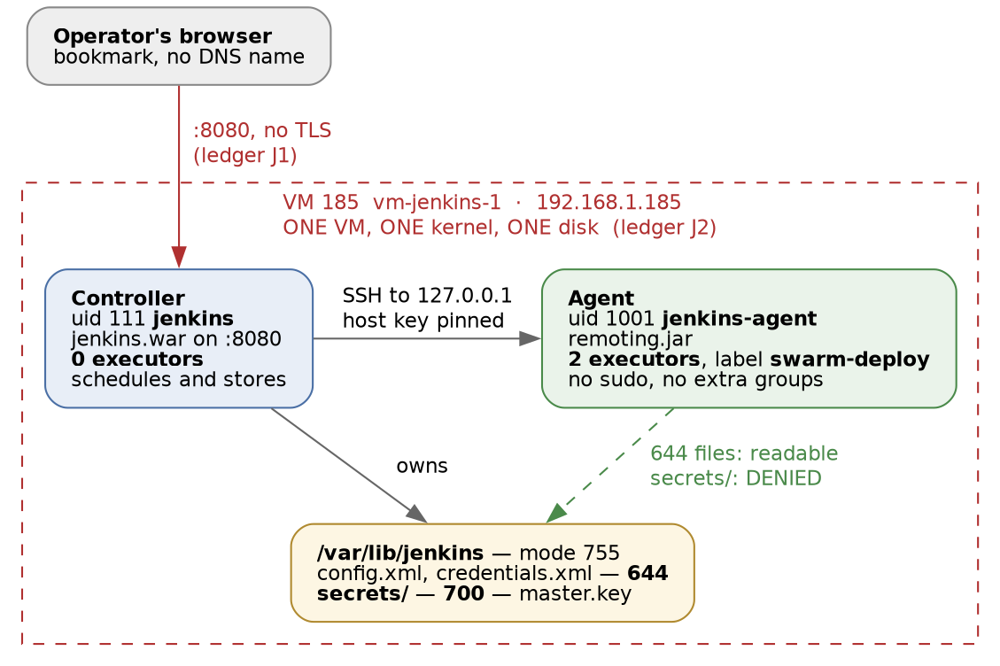

# Jenkins · Chapter 1 — The Controller and the Agent

> **Series:** Home-Lab Education · Phase 17 (Jenkins)
> **Built and verified:** August 20, 2026 on VM 185 (`192.168.1.185`)
> **Versions at time of writing:** Jenkins 2.568.2 LTS · OpenJDK 21.0.11 headless · `ssh-slaves`
> 3.1097 · Ubuntu 24.04 LTS (template 9000)
> **Assumed, not re-taught:** cloning VM 185 from the template, `host_setup.sh`, growing the disk,
> `qm` snapshot mechanics. That plumbing is documented in
> [`phases/phase2_host_setup_automation.md`](../../phases/phase2_host_setup_automation.md).
> **Read this before:** Chapter 2 (identity, and the account that survives your identity provider)

---

## What this chapter covers

Jenkins was installed on one virtual machine, and then deliberately arranged so that **the machine
running Jenkins runs none of its builds**. This chapter is about why that arrangement exists, how the
boundary is actually enforced, and how to prove it holds rather than assume it.

Along the way the installation lied three times, [in three different registers]{custom-style="Key"},
and none of the lies produced an error message at the moment it was told. Those are in §3 and §4, because
[the failures you can debug are the ones you have seen the shape of before]{custom-style="Key"}.

---

## 1. Why the controller runs no builds

A default Jenkins gives the controller **two executors**, so builds run on the same machine — and as
the same operating-system user — as Jenkins itself. It works immediately,
[which is precisely the problem]{custom-style="Key"}.

The controller's process owns `JENKINS_HOME`. That directory holds every job definition, every build
record, the credential store, and the key material that decrypts it. [A build running as the
controller's user can read all of it]{custom-style="Key"} — not by exploiting anything, but by opening
files it has permission to open. And a build is, by definition, **code from your repository that you
have not audited**, [running automatically, triggered by a push]{custom-style="Key"}.

So the split is not a performance decision, though people often present it as one:

| | Controller | Agent |
|---|---|---|
| Runs | scheduling, the UI, the credential store, plugin code | your build steps, and nothing else |
| Should hold | secrets | no secrets it was not explicitly handed |
| Executors here | **0** | 2 |

[The number that makes this real is zero]{custom-style="Key"}. Set it to one "just for quick jobs" and
the boundary is gone, because [the quick job is still arbitrary code beside your key material]{custom-style="Key"}.

> **The distinction worth having ready:** an agent is not a *machine*, it is an **execution context**
> that Jenkins can schedule work into. [The boundary you get is whatever the context enforces]{custom-style="Key"} —
> a separate UID gives you filesystem permissions, a separate host adds failure isolation, a container
> adds a fresh filesystem each time. **Naming something "an agent" guarantees none of those.** In this
> lab we get the first and not the second, which §7 is honest about.

---

## 2. What we built



| | |
|---|---|
| Host | `vm-jenkins-1` (VM 185) at `192.168.1.185`, 4 vCPU, 8 GB, 58 G usable |
| Controller | Jenkins 2.568.2 LTS, `jenkins.war` under OS user `jenkins` (uid 111), **0 executors** |
| Agent | `jenkins-agent-1`, 2 executors, label `swarm-deploy`, OS user `jenkins-agent` (uid 1001) |
| Transport | SSH from the controller to `127.0.0.1`, host key pinned |
| URL | `http://192.168.1.185:8080/` — bookmarked, no DNS name |
| Authentication | Jenkins' own user database, one local admin |

Two things in that table are choices rather than defaults. The agent shares the controller's VM (§7),
and the URL is plain HTTP.

> **Lab vs PROD — the Jenkins UI is plain HTTP.** *In the lab:* `http://192.168.1.185:8080/`, no TLS,
> no DNS name, on the operator's explicit decision. *Why it's acceptable here:* an isolated LAN, a
> single operator, no untrusted device on the segment, and nothing reaches the controller from
> outside — the lab's threat model is an accident, not an adversary on the wire. *In production:* TLS
> at the controller or at an ingress in front of it, with a real certificate, and the controller
> behind SSO on an internal hostname. *If you carry the habit:* 🚨 [every login puts the admin
> password on the wire in cleartext]{custom-style="Key"}, and the session cookie that follows is worse
> than an ordinary application cookie — [a CI session does not merely read data, it ships code]{custom-style="Key"}.
> Anyone who captures it can deploy.

There is a second default here that is easy to miss because nothing draws attention to it. The setup
wizard left authorization as **"logged-in users can do anything"**, which is unremarkable with one
account and [stops being unremarkable the moment an external identity provider]{custom-style="Key"}
decides who counts as logged in. That is Chapter 2's problem, and it is named here so it is not a surprise there.

### Where the Jenkins URL actually matters

The wizard's last screen asks for the instance URL and it looks cosmetic. It is not.
[Jenkins builds webhook callbacks, e-mail links and the OAuth redirect from that one value]{custom-style="Key"},
so a wrong entry produces a system where **builds pass and the links they generate fail** —
[a failure that points at the wrong component]{custom-style="Key"} and costs an afternoon. Ours is
`http://192.168.1.185:8080/`, verified in
`/var/lib/jenkins/jenkins.model.JenkinsLocationConfiguration.xml`
[rather than trusted to the form]{custom-style="Key"}.

---

## 3. The install disagreed with itself, three times

Two of the three surfaced during `apt`. All three share one shape, which is the spine of this whole
phase: **[the layer that reports is not the layer that decides]{custom-style="Key"}.**

### The signing key you will be told to use is expired — and the obvious one is worse

`apt update` failed with `NO_PUBKEY 7198F4B714ABFC68`. What made it interesting is that the key we had
already installed was **valid, correctly placed, correctly permissioned — and the wrong key.**

| URL | Key ID | State |
|---|---|---|
| `jenkins.io.key` — the unversioned, default-looking name | `FCEF32E745F2C3D5` | expired **2023-03-30** |
| `jenkins.io-2023.key` — what nearly every guide still says | `…5BA31D57EF5975CA` | expired **2026-03-26** |
| **`jenkins.io-2026.key`** | **`7198F4B714ABFC68`** | ✅ current, expires **2028-12-21** |

⭐ **[The unversioned filename is the oldest key of the three]{custom-style="Key"}, dead for three
years.** That inverts the instinct — an unversioned name reads like "the current one" and
[here means "the first one ever published"]{custom-style="Key"}. And the failure is quiet: [`wget` returns 0, the file really is a
valid PGP key]{custom-style="Key"}, permissions are right, and nothing looks wrong until apt refuses
the repository.

⭐ **The loop that settles it in one step: apt tells you the key ID it wants** in the `NO_PUBKEY` line.
Compare that against `gpg --show-keys` on what you actually installed:

```bash
gpg --show-keys --with-colons /usr/share/keyrings/jenkins-keyring.asc | awk -F: '/^pub/{print $5, $7}'
# 7198F4B714ABFC68 1861017859      <- matches the NO_PUBKEY id; expiry as a unix timestamp
```

[Never trust the filename; match the key ID]{custom-style="Key"}. The working source line is:

```
deb [signed-by=/usr/share/keyrings/jenkins-keyring.asc] https://pkg.jenkins.io/debian-stable binary/
```

📌 **`7198F4B714ABFC68` expires 2028-12-21.** When it does, `apt update` breaks on every host holding
it, and it will not look like an expiry — it will look like this same puzzle again.

### The `jenkins` package does not depend on Java

```
Version: 2.568.2
Depends: adduser, lsb-base (>= 3.2-14), net-tools, sysvinit-utils (>= 2.88dsf-50)
```

No Java. Not in `Recommends`, not in `Suggests` either. So
[`apt-get install jenkins` succeeds cleanly and the service then refuses to start]{custom-style="Key"} —
a Java application whose package does not require a JVM. It used to: releases up to ~2.107 declared
`default-jre-headless (>= 2:1.8) | java8-runtime-headless`, and
[from ~2.332 onward the dependency is simply absent]{custom-style="Key"}.

🚨 **This is worse than a missing dependency, because it defeats the technique you would use to catch
one.** "Check `Depends` before you install" is good advice, and here
[the package metadata under-declares its own hard requirement]{custom-style="Key"}, so the check
returns a confident wrong answer.

### And the version everyone quotes is stale

"Jenkins needs Java 17 or 21" is repeated everywhere and is wrong for 2.568.2:

| Supported Java | From LTS |
|---|---|
| Java 17, 21 or 25 | 2.541.1 (Jan 2026) |
| **Java 21 or 25** | **2.555.1 (Apr 2026)** ← 2.568.2 is past this |

Jenkins' own words: *"If you install an unsupported Java version, your Jenkins controller will not
run."* We installed `openjdk-21-jre-headless` (21.0.11) — supported, and the version Jenkins says it
full-tests. ⚠️ Their documentation is [mildly self-contradictory: the prose still names Java 17]{custom-style="Key"}
while their own support table rules it out for this release. **The table is normative; the prose is
stale.**

> **Three sources, three answers, and this is the transferable part.** The *filename* said the key was
> current. The *package metadata* said Java was optional. The *documentation prose* said Java 17 was
> fine. Each was the nearest available authority and
> [each was outranked by something less convenient to check]{custom-style="Key"}. When two sources
> disagree, the question is not "which is more recent" but
> **[which one is generated by the thing that actually enforces the rule]{custom-style="Key"}** — apt's
> own error, and the vendor's support matrix.

---

## 4. Six plugin choices became seventy-three plugins

The wizard offers **"Install suggested plugins"** or **"Select plugins to install"**. We took the
second and picked six, from the build standard: Pipeline, Git, GitLab, SSH Agent, Credentials
Binding, Workspace Cleanup. All six were in the wizard's curated list,
[so nothing had to be hunted down afterwards]{custom-style="Key"}.

Then we counted what was installed, [against the API rather than the screen]{custom-style="Key"}:

```bash
curl -s -u <user>:<pass> 'http://192.168.1.185:8080/pluginManager/api/json?depth=1'
```

**73 plugins.** The other 67 are transitive dependencies, resolved silently.

⭐ **That does not make the choice pointless, but it does change what you may claim about it.** The
honest statement is that this install is
[minimal in *deliberate decisions*, not in installed artifacts]{custom-style="Key"} — you can name why
each of your six is present, which you cannot do after "suggested". What you may **not** say is that
you cut the attack surface by two-thirds. [A dependency you did not choose still runs in your JVM]{custom-style="Key"}.

### The plugin whose name describes something else

🚨 Two plugins with nearly identical names do unrelated jobs:

| Plugin | Short name | What it actually does |
|---|---|---|
| **SSH Agent** | `ssh-agent` | the `sshagent { }` **pipeline step** — forwards a key *into* a running build so the build can `git clone` or `scp` |
| **SSH Build Agents** | `ssh-slaves` | **launches an agent** by SSHing to a host, copying `remoting.jar`, and running it |

The build standard's plugin list named the first. The same standard's topology requires the second.
So following the standard exactly produced a controller that
[could not attach the agent the standard itself demanded]{custom-style="Key"}, and the wizard's curated
list does not offer `ssh-slaves` at all. It was installed afterwards from *Manage Jenkins → Plugins*.

⭐ **The general lesson is worth more than the specific plugin: [a plugin list is not a capability
list]{custom-style="Key"}.** Checking that six named plugins are installed tells you the list was
followed. It does not tell you the system can do the thing the list was written to enable, and
[those two questions have different answers more often than you would like]{custom-style="Key"}.

---

## 5. Attaching the agent — two directions, and how to choose

Jenkins can attach an agent in two directions, and in practice
[firewalls decide this more often than preference does]{custom-style="Key"}.

**Outbound — "Launch agents via SSH".** The controller opens an SSH connection to the agent host,
copies `remoting.jar` across, and runs it. All build traffic then rides inside that SSH connection.
The agent host needs Java and a reachable port 22; the controller needs an SSH credential.

**Inbound — JNLP.** The agent dials the controller and authenticates with a secret. This is what you
use when [the controller cannot reach the agent]{custom-style="Key"}: NAT, ephemeral containers, cloud
instances with no stable address, Windows hosts without `sshd`. Anything Kubernetes- or Docker-based
is inbound, because there is nothing durable to SSH *to*.

> **The comparison this track exists for.** [A GitLab runner **always** dials out to GitLab]{custom-style="Key"}
> — there is no mode in which GitLab connects to the runner. Jenkins' classic default runs the other
> way. So Jenkins agents have firewall requirements GitLab runners simply do not, and
> **["the runner is healthy but the controller cannot reach it" is a Jenkins failure with no GitLab
> equivalent]{custom-style="Key"}.**

### Why SSH here

Three reasons, in decreasing order of how much they should weigh:

1. **Lifecycle ownership, which is the one that matters at 3am.** With SSH,
   [the controller can restart a dead agent by itself]{custom-style="Key"} — it reopens the connection
   and relaunches `remoting.jar`. With JNLP, **the controller can never start an agent**; it can only
   wait. If the agent process dies you need a `Restart=always` unit and a valid secret on the agent
   side, and if that is broken, [CI stays down until a human logs into the agent host]{custom-style="Key"}.
2. **The deploy target is static.** Jenkins deploys to three known Swarm managers by SSH. Making the
   agent connection the same shape means one mental model, one direction, one class of failure.
3. **Transfer value.** Configuring a static SSH agent is the same operation whether the host is
   `127.0.0.1` or a rack elsewhere — [only the hostname field differs]{custom-style="Key"}. Whereas you
   would never hand-configure JNLP for Kubernetes: the plugin generates the secret, injects it, and
   disposes of the pod. ⚠️ *Recited, not measured here:* the common shape for a fleet of static build
   hosts is SSH-launched agents, and for ephemeral fleets it is plugin-managed inbound ones.

### What was actually created

```bash
sudo useradd -m -d /home/jenkins-agent -s /bin/bash jenkins-agent    # password locked by default
sudo install -d -m 700 -o jenkins-agent -g jenkins-agent /home/jenkins-agent/.ssh
sudo install -d -m 755 -o jenkins-agent -g jenkins-agent /home/jenkins-agent/agent
sudo -u jenkins-agent ssh-keygen -t ed25519 -N '' -C 'jenkins-controller-to-agent' \
  -f /home/jenkins-agent/.ssh/id_ed25519
sudo -u jenkins-agent bash -c 'cat /home/jenkins-agent/.ssh/id_ed25519.pub \
  > /home/jenkins-agent/.ssh/authorized_keys && chmod 600 /home/jenkins-agent/.ssh/authorized_keys'
```

`id jenkins-agent` returns `uid=1001(jenkins-agent) groups=1001(jenkins-agent)` — **no sudo, no
supplementary groups, no password.** [Whatever it eventually needs should be granted for a stated
reason]{custom-style="Key"}, not inherited from whichever `useradd` line was convenient.

Then the private key was pasted into Jenkins' credential store and **deleted from the host**:

```bash
sudo rm -f /home/jenkins-agent/.ssh/id_ed25519 /home/jenkins-agent/.ssh/id_ed25519.pub
```

[`/home/jenkins-agent/.ssh/` now holds `authorized_keys` and nothing else]{custom-style="Key"}. The
private half exists in exactly one place, which is the arrangement you want on a real build host —
[a key lying beside the lock it opens is not a credential, it is a formality]{custom-style="Key"}.

### Pinning the host key

The SSH launcher offers several verification strategies, including *Non verifying*. We used **Manually
provided key Verification Strategy** with the host's own ed25519 key, obtained with
`ssh-keyscan -t ed25519 127.0.0.1`.

⭐ **[This is the difference between trust-on-first-use and a pin]{custom-style="Key"}.** With a pin, a
substituted or rebuilt host **fails closed** instead of being silently accepted, and the failure names
the real problem. It costs one paste at setup time and it is the correct default even at `127.0.0.1`,
because the reason to do it is not the address — it is
[that a machine will accept whatever it was told to accept]{custom-style="Key"}.

---

## 6. Proving the split, instead of configuring it

The sequence matters more than any individual step, and it is
[reusable far beyond Jenkins]{custom-style="Key"}.

1. Set the controller to **0 executors**.
2. Create a throwaway freestyle job `zz-executor-proof` and run it **while no agent exists.**
3. *Then* install `ssh-slaves`, create the account, attach the node.
4. Run **the same job again, unchanged.**

At step 2 the build never starts. It sits in the Build Queue reporting that it is waiting for an
executor. At step 4:

```
Started by user Andrew Gamache
Running as SYSTEM
Building remotely on jenkins-agent-1 (swarm-deploy) in workspace
  /home/jenkins-agent/agent/workspace/zz-executor-proof
Finished: SUCCESS
```

⭐ **[Reading `0` in a configuration field tells you what Jenkins was told]{custom-style="Key"}. A build
stuck in the queue tells you what Jenkins will do.** Steps 2 and 4 are the same job with the same
configuration, so [the change in outcome has exactly one available cause]{custom-style="Key"}. That is
what makes it evidence rather than a claim.

The general form is worth stealing: **[prove the negative before you build the positive]{custom-style="Key"}.**
Had we attached the agent first and then set the controller to zero, a green build would have proved
only that *something* ran it. Verifying in that order can never distinguish
[a working boundary from a boundary that was never enforced]{custom-style="Key"}.

The job is worth keeping afterwards. It is a two-second probe that answers *is an executor actually
available* without reasoning about a real pipeline — useful precisely when a real pipeline is
misbehaving and you need to [eliminate the boring explanation first]{custom-style="Key"}.

---

## 7. Two privilege planes, and what the agent can still read

The boundary is real, and it was tested rather than asserted:

```bash
$ ps -o user:14,pid,cmd -C java
jenkins        10793  /usr/bin/java ... -jar /usr/share/java/jenkins.war --httpPort=8080
jenkins-agent  11507  java -jar remoting.jar

$ sudo -u jenkins-agent cat /var/lib/jenkins/secrets/master.key
  Permission denied
```

Two processes, two UIDs, and [the refusal comes from the kernel rather than from Jenkins policy]{custom-style="Key"}
— which matters, because Jenkins policy is configuration and configuration drifts.

### But the protection is exactly one directory deep

| Path | Mode | Agent can read? |
|---|---|---|
| `/var/lib/jenkins/` | `755` | yes |
| `config.xml`, `secret.key`, `credentials.xml` | `644` | **yes** |
| `identity.key.enc` | `600` | no |
| `secrets/` — holds `master.key`, `hudson.util.Secret` | `700` | **no** |

So the agent account can open `credentials.xml` and read the SSH credential we just created, sitting
there as `{AQAAABAA…}` ciphertext. What it cannot reach is the key material that makes the ciphertext
mean anything.

🚨 **Restating that in prose, because it is the sentence to remember and a table row is easy to skim:
[the encrypted credentials are readable by every local account on this host]{custom-style="Key"}, and
the only thing standing between them and plaintext is
[the mode bits on one directory]{custom-style="Key"}.** `master.key` is itself mode `644`; it is safe
solely because of the `700` on its parent. **[One layer, with nothing behind it]{custom-style="Key"}.**

### The second privilege plane

Look again at the build log from §6: `Running as SYSTEM`.

The OS process ran as unprivileged `jenkins-agent`. Inside Jenkins, the same build ran as **SYSTEM** —
Jenkins' full-permission internal identity. [A pipeline can therefore act through Jenkins' own APIs in
ways the Unix account never could]{custom-style="Key"}.

⭐ **There are two independent privilege systems here, and hardening one tells you nothing about the
other.** "The agent is unprivileged" is a true statement about the operating system and
[says nothing whatever about what the build can do inside Jenkins]{custom-style="Key"}. Keep them
separate in your head; they have separate fixes.

> **Lab vs PROD — the build agent is the controller's own VM.** *In the lab:* Jenkins SSHes to
> `127.0.0.1` as `jenkins-agent`. *Why it's acceptable here:* one VM's RAM was what the fleet had
> spare, the privilege boundary is genuinely kernel-enforced, and the Jenkins-side configuration is
> identical to what a remote host would need. *In production:* agents live on their own hosts,
> precisely so that [whatever privilege a build needs does not land on the machine holding every
> credential]{custom-style="Key"}. *If you carry the habit:* ⚠️ **the co-location makes the agent's
> reach sharper here than in production, not softer** — the host it can already read is the
> controller. And [a build that fills the disk or pins the CPU takes the controller down with it]{custom-style="Key"},
> so "the agent is unhealthy" and "Jenkins is unhealthy" are the same event in this lab and two
> different events at a firm. **Do not carry away the reassurance that a compromised agent is
> contained.**

---

## 8. Commands to know by heart

```bash
# the install, in the order that works
gpg --show-keys --with-colons /usr/share/keyrings/jenkins-keyring.asc   # match the NO_PUBKEY id
apt-cache show jenkins | grep -E '^(Version|Depends)'                   # and do not trust the answer
systemctl status jenkins
sudo cat /var/lib/jenkins/secrets/initialAdminPassword                  # the one-time unlock

# ask Jenkins what it is, rather than reading the UI
curl -s -u <user>:<pass> 'http://<host>:8080/api/json?pretty=true'
curl -s -u <user>:<pass> 'http://<host>:8080/computer/api/json?depth=1'        # nodes + executors
curl -s -u <user>:<pass> 'http://<host>:8080/pluginManager/api/json?depth=1'   # what is really installed
curl -s -I 'http://<host>:8080/' | grep -i x-jenkins                           # version, unauthenticated

# the agent boundary, checked from the outside
ps -o user:14,pid,cmd -C java                       # which UID runs what
sudo -u jenkins-agent cat /var/lib/jenkins/secrets/master.key   # must fail
ssh-keyscan -t ed25519 <host>                       # the key to pin, before you need it

# where Jenkins keeps the truth
/var/lib/jenkins/config.xml                                          # executors, security realm
/var/lib/jenkins/jenkins.model.JenkinsLocationConfiguration.xml      # the URL everything is built from
/var/lib/jenkins/nodes/<name>/config.xml                             # the agent as saved
```

⭐ **Prefer the API to the screen when you are verifying.** The UI renders what it was asked to render;
`/api/json` is [the controller answering a question about itself]{custom-style="Key"}, and it is the
difference between "the field said 0" and "the scheduler has nowhere to put work".

---

## 9. Glossary

| Term | Meaning |
|---|---|
| **Controller** | The Jenkins process: UI, scheduling, plugin code, and the credential store. Formerly "master" |
| **Agent** | An execution context Jenkins schedules builds into. A UID, a host, or a container — the term promises none of them |
| **Executor** | One slot for one concurrent build. Zero on a node means work can be scheduled *nowhere* on it |
| **`remoting.jar`** | The small Java program an agent runs to speak Jenkins' protocol back to the controller |
| **Outbound / SSH agent** | Controller connects to the agent host and launches it. Controller owns the lifecycle |
| **Inbound / JNLP agent** | Agent dials the controller with a secret. The controller cannot start it — only wait |
| **`JENKINS_HOME`** | `/var/lib/jenkins` — jobs, build history, `credentials.xml`, and `secrets/`. The thing worth protecting |
| **`SYSTEM`** | Jenkins' internal full-permission identity, which builds run as by default. Unrelated to the OS user |
| **Break-glass account** | A local login that keeps working when the external identity provider does not. Chapter 2 |
| **Host key pinning** | Recording the server's key in advance so an unexpected one fails closed instead of being trusted |
| **LTS** | Jenkins' stabilised release line, ~12 weeks apart. The weekly line exists and is not what you operate |

---

## 10. Check yourself

Answer these out loud. Section references, not answers — reconstructing is the exercise.

1. A colleague sets the controller to one executor "just for quick jobs". What have they given away,
   and to whom? (§1)
2. `apt update` fails with `NO_PUBKEY <id>` and you have already installed a key from the vendor's
   own site. What is the single next command, and why is the filename irrelevant? (§3)
3. `apt-get install jenkins` succeeded and `systemctl status jenkins` shows it dead. `Depends` lists
   nothing missing. What happened, and why did checking `Depends` fail you? (§3)
4. You chose six plugins and the instance reports 73. What may you honestly claim about your attack
   surface, and what may you not? (§4)
5. Your controller cannot reach a new build host because it sits behind NAT. Which transport, and
   what operational cost have you just accepted? (§5)
6. Someone proposes attaching the agent first and setting the controller to zero afterwards, "same
   end state". What can that order never prove? (§6)
7. The agent account cannot read `master.key`. Name the single change that would undo that, and say
   what an attacker would then hold. (§7)
8. A build log says `Running as SYSTEM` on an agent running as an unprivileged UID. Are those in
   conflict? (§7)
9. Jenkins' URL setting is wrong but every build is green. What breaks, and why will the symptom
   point at the wrong component? (§2)
10. State the failure shape shared by the expired key, the missing Java dependency, and the stale
    documentation — in one sentence, without naming any of the three. (§3)
