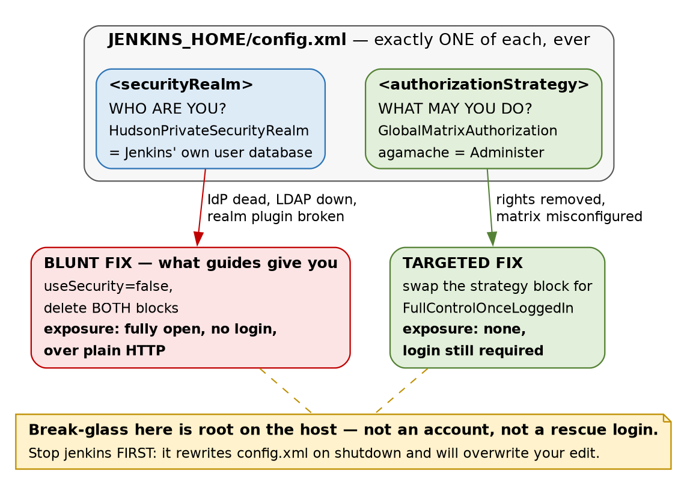

# Jenkins · Chapter 2 — Identity, Authorization, and Break-Glass

> **Series:** Home-Lab Education · Phase 17 (Jenkins)
> **Built and verified:** August 20, 2026 on VM 185 (`192.168.1.185`)
> **Versions at time of writing:** Jenkins 2.568.2 LTS · `matrix-auth` 3.3 · `matrix-project`
> 905.vcc6831e8760a\_ · OpenJDK 21.0.11 headless
> **Assumed, not re-taught:** everything in [Chapter 1](chapter01_the_controller_and_the_agent.md) —
> the controller/agent split, `JENKINS_HOME`, and why the controller runs zero builds.
> **Read this before:** Chapter 3 (the first pipeline, and what a checkout drags into the workspace)

---

## What this chapter covers

Two questions that look like one: **who are you**, and **what may you do**. Jenkins answers them with
two independent pieces of configuration, and [almost every Jenkins auth disaster comes from treating
them as a single thing]{custom-style="Key"}.

This chapter is unusual in that its centrepiece is **a drill that failed to produce the failure it
was designed to produce.** We set out to lock ourselves out of Jenkins on purpose, tried twice, and
could not — and [the reason we could not is worth more than the lockout would have been]{custom-style="Key"}.
It also corrects a belief this project held in writing, in the build standard itself, until the
mechanics were checked: §2.

⚠️ **One thing here is recorded rather than proven, and it is flagged in place.** The break-glass
runbook in §6 has been **written and not rehearsed**. That distinction is stated where it appears
because [a runbook nobody has run is a hypothesis with formatting]{custom-style="Key"}.

---

## 1. Two questions, two slots

| Question | Jenkins calls it | Lives in | Examples |
|---|---|---|---|
| Who are you? | the **security realm** | `<securityRealm>` | Jenkins' own user database, LDAP, an OAuth provider, the servlet container |
| What may you do? | the **authorization strategy** | `<authorizationStrategy>` | Anyone can do anything · Logged-in users can do anything · **Matrix** · Project-based matrix |

Both live in `JENKINS_HOME/config.xml`, and the load-bearing fact is in the XML shape rather than in
either list: **each element appears exactly once.** [Jenkins holds one realm and one strategy, never a
chain of them]{custom-style="Key"}.



That single-slot design is the thing to carry out of this chapter, because it contradicts a habit
built up almost everywhere else. A router keeps a local admin behind RADIUS. A database keeps
superuser access behind its own authentication when the directory is unreachable. PAM is literally a
*stack*. So the instinct that [there is always a local login hiding behind the corporate one]{custom-style="Key"}
is well earned — and on Jenkins it is false. **Configure an OAuth realm and the local user database
is not a fallback; it is [gone from the login path entirely]{custom-style="Key"}.**

---

## 2. The belief this project had in writing, and had to correct

Phase 17's build standard originally specified: *create a local admin as a break-glass account, then
add GitLab OAuth on top.* [The reasoning was explicit and it sounded careful]{custom-style="Key"} — if
GitLab is down, the local admin still gets you in.

**It was wrong, and it was wrong in the way that [costs you an outage rather than an
argument]{custom-style="Key"}.** The
OAuth realm would have *replaced* the user database. That local admin could not have logged in at
all, and [we would have discovered it at exactly the moment we needed it]{custom-style="Key"} — with
GitLab already down, which is to say with the thing we were relying on already broken.

⭐ **The generalisation is more useful than the Jenkins detail: [a fallback exists only if the
mechanism supports a fallback]{custom-style="Key"}.** Before you design around one, go and look at
whether the configuration slot is a **list** or a **single value**. If it is a single value, whatever
you were planning to keep in reserve is not in reserve — [it has been displaced, silently, by the
thing you added]{custom-style="Key"}. That question [takes thirty seconds to answer from the
configuration schema]{custom-style="Key"} and it is almost never asked.

### Then OAuth was dropped altogether

Having established that the local admin was not what it claimed to be, the next decision was whether
to wire GitLab OAuth anyway. It was dropped, for two reasons, and **the second is much stronger than
the first**:

1. **The vendor does not transfer.** GitLab's app-registration flow and its group-mapping semantics
   are GitLab's. The Jenkins mechanic — one realm, no form fallback, filesystem recovery —
   [is learnable without any identity provider at all]{custom-style="Key"}, and that is the part that
   moves to another firm.
2. 🚨 **Part 6 of this phase deliberately breaks the Jenkins↔GitLab path.** Wiring Jenkins *login* to
   GitLab would have put the instrument inside the experiment: a failed drill would have had
   [two candidate causes instead of one]{custom-style="Key"}, and one of those causes would have
   locked us out of the console we needed to diagnose it.

⭐ **Worth stealing as a planning habit: [the transferable part of an integration is usually the
failure mode, not the vendor]{custom-style="Key"}.** Re-pointing the identity provider — from GitLab
OAuth to a local database — cost this track nothing, because [the lesson was never about
GitLab]{custom-style="Key"}. If dropping a vendor from your plan destroys the lesson,
[the lesson was product training]{custom-style="Key"}.

> **Lab vs PROD — Jenkins' own user database is the security realm.** *In the lab:* one local account
> in `HudsonPrivateSecurityRealm`, with signup disabled. *Why it's acceptable here:* a single operator
> who is also the only person with root on the host, so a central directory would add a dependency and
> remove nothing. *In production:* the realm is the corporate IdP — SAML or OIDC — so that
> **joining, moving and leaving are handled in one place**, with MFA enforced there. *If you carry the
> habit:* 🚨 [a local Jenkins account survives the person leaving the company]{custom-style="Key"}, because
> nothing in the offboarding process knows it exists. And the CI system is the worst place for a
> forgotten account: it does not merely read data, it ships code to production. ⚠️ *The PROD answer
> here is recited, not built — nothing in this lab terminates SAML.*

---

## 3. The lockout drill that refused to fire, twice

The plan for Part 2 was to **break authorization on purpose** — in a lab, on a snapshotted VM, where
being locked out is a lesson and not an incident. Switch from the wizard's default to matrix
authorization, grant the bare minimum, and see what the recovery actually feels like.

It did not work. Neither attempt.

| # | What was done | Expected | Observed |
|---|---|---|---|
| 1 | Switch to Matrix-based security, granting only `authenticated: Overall/Read` | locked out | **Still admin.** The plugin had pre-seeded a row nobody added: `USER:hudson.model.Hudson.Administer:agamache` |
| 2 | Delete that `agamache` row in the UI and save | locked out | **Still admin.** The row came back |

Attempt 2 is the interesting one, and it is worth restating in prose because the mechanics are easy
to skim past in a table. [The form accepted the deletion. The row disappeared from the
screen]{custom-style="Key"}. The save **succeeded**, and it genuinely rewrote the file — `config.xml`'s
mtime moved to `15:40:13`. And the permission was still there afterwards. There was
[no warning in the UI and no line in `journalctl -u jenkins`]{custom-style="Key"}.

🚨 **Three layers reported success at something that never happened** — the form, the save, and the
service log. That is [Chapter 1's spine reappearing inside a safety feature]{custom-style="Key"}: *the
layer that reports is not the layer that decides.* Here it turned up in a **protection** rather than
in a package or a signing key, which is the version of it that is hardest to be suspicious of, because
the outcome is the one you wanted.

⭐ **A benevolent silent override is still a silent override.** The behaviour is correct — it stops
people destroying their own instance — but [anyone trying to learn their permission model from that
screen was actively misinformed by it]{custom-style="Key"}. The screen said the admin row was gone. It
was not. **If you are auditing who holds `Administer` on a Jenkins, read `config.xml`, not the
matrix.**

✅ **This is intentional and documented**, which we only confirmed *after* observing it: matrix-auth's
own README states *"It is not possible to remove access … from Jenkins administrators."* Jenkins' Jira
carries an epic titled **"Matrix Auth: Accidental lockouts"** (JENKINS-10871, JENKINS-46832 — both
**Resolved**). [The guard rail was built deliberately, years ago, in response to people falling off
this exact cliff]{custom-style="Key"}.

### There is a lesson about drills here, separate from the lesson about Jenkins

A drill that cannot fire is not a wasted drill — but **only if you go and find out why it could not
fire.** Had we shrugged and moved on, the takeaway would have been "matrix auth seems safe", which is
[the same sentence as the truth and carries none of its information]{custom-style="Key"}. The actual
finding is narrower and far more useful: *this specific class of lockout was closed by the plugin, on
purpose, and a different class is still wide open.* That is §4.

---

## 4. The lockout moved; the folklore did not

Search for Jenkins lockouts and you will find a decade of advice about being careful in the matrix
screen. **That advice is now stale for the mechanism it describes** — you can no longer lock yourself
out by clicking. [The failure did not disappear, it relocated]{custom-style="Key"}, and the current
reports are **plugin-upgrade incompatibilities**:

- `matrix-auth` 3.0 changed the format in which it stores SIDs — the permission entries themselves.
- `role-strategy` was not yet compatible with the new format.
- Administrators lost their own rights **on restart**, having changed nothing about permissions.

⚠️ *That sequence is reported from the plugins' issue trackers and release notes, **not** measured
here — no upgrade lockout was reproduced on `.185`.*

The format in question is visible in our own file. Every permission line carries a `USER:` or
`GROUP:` prefix:

```xml
<permission>USER:hudson.model.Hudson.Administer:agamache</permission>
<permission>GROUP:hudson.model.Hudson.Read:authenticated</permission>
```

[Those prefixes are the 3.x format]{custom-style="Key"} — the thing that changed. Reading them tells
you that this instance is on the new side of that migration, which is a more direct answer than the
plugin's version number, [because the version tells you what is installed and the file tells you what
is stored]{custom-style="Key"}.

🚨 **This lands squarely on Chapter 1 §4.** Six deliberate plugin choices produced 73 plugins. Adding
`ssh-slaves` (Chapter 1) and `matrix-auth` (this chapter) — **two more deliberate decisions** — took
the instance to **79**. So the count of things you chose went from 6 to 8, and the count of things
running in your JVM went up by six. [The 71 you did not choose are precisely the ones whose
interdependencies you cannot enumerate]{custom-style="Key"}, and upgrade-time incompatibility is a
property of interdependencies.

⭐ **The operational conclusion is not "avoid plugins"** — it is that **[a Jenkins upgrade is a
security-configuration change even when you did not touch security]{custom-style="Key"}.** Which means
the break-glass procedure in §6 should be to hand *before* an upgrade, not looked up afterwards, and
`config.xml` should be copied somewhere first.

---

## 5. What is actually configured, read from the file

Not from the screen — §3 is the reason for that distinction:

```xml
<useSecurity>true</useSecurity>
<authorizationStrategy class="hudson.security.GlobalMatrixAuthorizationStrategy">
  <permission>USER:hudson.model.Hudson.Administer:agamache</permission>
  <permission>GROUP:hudson.model.Hudson.Read:authenticated</permission>
</authorizationStrategy>
<securityRealm class="hudson.security.HudsonPrivateSecurityRealm">
  <disableSignup>true</disableSignup>
  <enableCaptcha>false</enableCaptcha>
</securityRealm>
```

Four things are worth naming in that block:

- **`authorizationStrategy` comes before `securityRealm` in the file** — authorization is written
  first, authentication second, which is [the reverse of the order they execute in]{custom-style="Key"}.
  Cosmetic, but it matters at 3am when you are `sed`-ing a file you cannot see rendered.
- **`disableSignup` is `true`.** Without it, `HudsonPrivateSecurityRealm` offers a *Create an account*
  link, and [self-registration into a CI system is a straight path to the deploy pipeline]{custom-style="Key"}.
  The wizard sets this correctly; it is worth knowing it is a setting rather than a law.
- **Two permission rows, and only one of them does anything today.** `authenticated → Overall/Read` is
  a no-op on a single-user instance — [it becomes meaningful the moment a second account
  exists]{custom-style="Key"}, and writing it now means the default for the next person is *read*
  rather than *everything*.
- **Anonymous holds nothing.** There is no `GROUP:…:anonymous` line, so an unauthenticated request
  gets a login page and no more.

The realm's storage is on disk under `JENKINS_HOME/users/`, one directory per account —
`agamache_<64 hex characters>`. [The hex suffix is Jenkins' on-disk name-mangling, not the
password]{custom-style="Key"}; it exists so that user IDs cannot collide on a case-insensitive
filesystem. The password itself is inside that directory's own `config.xml` as
`#jbcrypt:$2a$10$…` — **bcrypt at cost factor 10**, which is a reasonable answer and
[not one you should have to take on trust]{custom-style="Key"}. There is exactly one such directory on
this instance.

### Two defaults that the wizard chose, and one it disabled

```
<slaveAgentPort>-1</slaveAgentPort>
<disableRememberMe>false</disableRememberMe>
<crumbIssuer class="hudson.security.csrf.DefaultCrumbIssuer"/>
```

**`slaveAgentPort` is `-1`, which means the inbound agent port is switched off.** Chapter 1 described
two directions an agent can attach from; on this box [one of those two directions is not listening at
all]{custom-style="Key"}. That is a genuine reduction in surface — [a port that authenticates agents
is a port worth attacking]{custom-style="Key"} — and it is also a trap for later: **an inbound JNLP agent configured on this
controller would never connect**, and the symptom would appear on the agent host, [which is not where
the cause is]{custom-style="Key"}.

**`disableRememberMe` is `false`, so remember-me is enabled.** On an HTTPS instance that is a
convenience. On this one, [it is a long-lived session cookie crossing a LAN in cleartext]{custom-style="Key"},
which is ledger row **J1** getting slightly worse rather than a new problem. It is left on
deliberately and recorded here so it is a decision rather than an oversight.

---

## 6. Break-glass is root on the host, not an account

Once §2 has removed the idea of a rescue login, the question *"what do I actually do when I cannot get
into Jenkins"* has exactly one answer: **stop the service, edit the file, start the service.**

```bash
sudo cp -a /var/lib/jenkins/config.xml /var/lib/jenkins/config.xml.known-good
sudo systemctl stop jenkins     # MUST be first — see below
# ... edit /var/lib/jenkins/config.xml ...
sudo systemctl start jenkins
```

🚨 **The `stop` is not tidiness, and getting the order wrong is the classic way to lose an hour.
[Jenkins rewrites `config.xml` on shutdown]{custom-style="Key"} from the configuration it holds in
memory.** Edit the file on a running instance and your change is [erased by the very restart you made
it for]{custom-style="Key"} — and it will look as though the edit did not take, which sends you
looking for a syntax error that is not there.

### Choose the smallest fix that matches what is broken

| What broke | Fix | Exposure while you work |
|---|---|---|
| **Authorization only** — matrix misconfigured, rights removed | replace the `<authorizationStrategy>` block with `FullControlOnceLoggedInAuthorizationStrategy` | **none — login is still required** |
| **The realm** — IdP dead, LDAP unreachable, realm plugin broken | `<useSecurity>false</useSecurity>` and delete **both** blocks | 🚨 **Jenkins fully unauthenticated, over plain HTTP, until you finish** |

Both of those belong in prose, because the difference between them is the entire point of the section
and [a table row is a thing you skim]{custom-style="Key"}. **If only your permissions are broken, your
identity system still works** — swapping the strategy for "logged-in users can do anything" restores
your access while [still making every user prove who they are]{custom-style="Key"}. Turning security
off entirely also restores your access, and it does so by [making the controller answer to anyone who
can reach port 8080]{custom-style="Key"}, with no password, on a cleartext connection, for as long as
the repair takes.

🚨 **Every guide on the internet hands you the second one.** It propagates because it works for both
cases — [a remedy that always works is a remedy nobody has to diagnose before applying]{custom-style="Key"}.
This is the same shape as Phase 16's `docker swarm leave --force`: **the universally-recommended
remediation is more destructive than the situation requires.** Diagnose which layer failed *before*
choosing the tool, and if you cannot diagnose it under pressure, [that is the argument for writing
the targeted version down now]{custom-style="Key"}.

⭐ **And the structural point about Jenkins break-glass, which is uncomfortable once you see it:
[the set of people who can recover Jenkins from an auth failure is exactly the set who can already
read `JENKINS_HOME`]{custom-style="Key"}.** Chapter 1 §7 reached that boundary from the inside, asking
what the agent account could read. This arrives at the same line from the outside — and it means
**your Jenkins authorization model is bounded above by host access**, so an "operator" with sudo on
the controller is an administrator of Jenkins whether or not the matrix says so.

> **Lab vs PROD — the break-glass procedure has been written and never rehearsed.** *In the lab:* the
> runbook above is recorded, and nobody has executed it on `.185`. *Why it's acceptable here:* the VM
> is snapshotted, a full rebuild costs an evening, and there is no user to be down. *In production:*
> recovery procedures are rehearsed on a schedule, against a non-production controller, and the
> rehearsal is what turns them from prose into a procedure. *If you carry the habit:* ⚠️ **the first
> time you run it will be during the outage** — at 3am, on the box that holds every deployment
> credential, with an audience. [An untested runbook fails in ways that look like the original
> incident]{custom-style="Key"}, which is how a thirty-minute recovery becomes a four-hour one.

---

## 7. What this closed, and the plane it does not touch

**Closed:** Chapter 1 §2 flagged that the wizard had left authorization at *"logged-in users can do
anything"*. That is no longer true — `agamache` holds `Overall/Administer` and everyone else who
authenticates holds `Overall/Read`. On a single-account instance the practical change is small; the
change in *default* is not, because [the next account created here starts with read and nothing
else]{custom-style="Key"}.

**Not closed, and this is the important half.** Authorization governs **human requests through the
web UI and the API**. It does not govern builds. Chapter 1 §7 showed a build log reading
`Running as SYSTEM` while the OS process ran as unprivileged `jenkins-agent`; nothing in this chapter
altered that. [A pipeline still executes with Jenkins' full internal identity]{custom-style="Key"}, and
no row in the matrix constrains it.

⭐ **So there are now three privilege planes on this host, and hardening any one of them tells you
nothing about the other two:**

| Plane | Governed by | Hardened in |
|---|---|---|
| Operating system | UIDs and file modes | Chapter 1 §7 — `jenkins-agent` cannot read `secrets/` |
| Jenkins, for humans | the authorization strategy | **This chapter** |
| Jenkins, for builds | `SYSTEM`, and what a pipeline is permitted to invoke | not yet — Parts 5 and 7 |

Stating that as a sentence, since it is the one to keep: **[a Jenkins whose matrix is immaculate can
still run a pipeline that does anything Jenkins can do]{custom-style="Key"}.** The three planes have
three separate fixes, and [the vocabulary invites you to believe they are one system]{custom-style="Key"}
because all three get called "permissions".

---

## 8. Commands to know by heart

```bash
# read the security configuration from the file, never from the screen
sudo sed -n '/<authorizationStrategy/,/<\/authorizationStrategy>/p' /var/lib/jenkins/config.xml
sudo grep -n 'useSecurity\|securityRealm\|slaveAgentPort\|RememberMe' /var/lib/jenkins/config.xml
sudo ls -1 /var/lib/jenkins/users/            # one directory per local account

# who Jenkins thinks you are, and what it will let you do
curl -s -u <user>:<pass> 'http://<host>:8080/whoAmI/api/json?pretty=true'
curl -s -o /dev/null -w '%{http_code}\n' 'http://<host>:8080/api/json'   # 403 = anonymous has nothing

# break-glass, in the only order that works
sudo cp -a /var/lib/jenkins/config.xml /var/lib/jenkins/config.xml.known-good
sudo systemctl stop jenkins                   # FIRST. Jenkins rewrites config.xml on shutdown
sudo systemctl start jenkins
sudo journalctl -u jenkins -n 50 --no-pager   # and it will not warn you about permissions

# before any plugin upgrade, because an upgrade is a security change
sudo cp -a /var/lib/jenkins/config.xml /var/lib/jenkins/config.xml.pre-upgrade
```

⭐ **The habit worth building from §3: [when the UI and the file disagree, the file is what Jenkins
loads]{custom-style="Key"}.** The matrix screen showed a permission row deleted that was never
deleted. Two commands would have caught it in a second, and neither of them is clever.

---

## 9. Glossary

| Term | Meaning |
|---|---|
| **Security realm** | The answer to *who are you*. Jenkins holds **exactly one** — configuring a new one replaces the old, it does not stack |
| **Authorization strategy** | The answer to *what may you do*. Also exactly one at a time |
| **`HudsonPrivateSecurityRealm`** | Jenkins' own user database, stored under `JENKINS_HOME/users/`. Passwords as bcrypt |
| **Matrix authorization** | Permissions granted per user or group, per Jenkins permission, in a grid. Plugin short name `matrix-auth` |
| **`matrix-project`** | An **unrelated** plugin: multi-configuration *jobs*. Third name collision this track has hit |
| **SID** | The identifier in a permission entry — a user or a group. `matrix-auth` 3.0 changed how these are stored |
| **`authenticated`** | A built-in pseudo-group meaning *anyone who has logged in*, whoever they are |
| **`anonymous`** | The pseudo-user for an unauthenticated request. Holds nothing on this instance |
| **`FullControlOnceLoggedIn…`** | The wizard's default strategy: authenticate and you can do everything. The targeted break-glass value |
| **`useSecurity`** | The master switch. `false` means no authentication at all — the blunt break-glass |
| **Break-glass** | On Jenkins: **root on the host**, not an account. Stop, edit `config.xml`, start |
| **Crumb** | Jenkins' CSRF token. `DefaultCrumbIssuer` is on here, and is why raw `curl` POSTs get rejected |

---

## 10. Check yourself

Answer these out loud. Section references, not answers — reconstructing is the exercise.

1. You are about to wire an OAuth realm into a Jenkins that has a local admin. What happens to that
   admin, and when would you find out? (§1, §2)
2. Generalise question 1 into a check you can run against **any** system before relying on a fallback.
   (§2)
3. You delete your own `Administer` row in the matrix screen and click save. Describe what the UI,
   the file, and the service log each report — and what is actually true. (§3)
4. A colleague says "matrix auth is safe, you can't lock yourself out any more". What is right about
   that, and what has it missed? (§3, §4)
5. Nothing about your permissions was changed, and after a restart you have lost `Administer`. What
   is the most likely cause, and what should you have copied beforehand? (§4)
6. Your authorization strategy is broken but LDAP is fine. Name the fix, and say what an operator
   using the internet's standard recipe would have exposed instead. (§6)
7. Why must `systemctl stop jenkins` come before editing `config.xml`, and what does the failure look
   like if you get it backwards? (§6)
8. Who can perform break-glass on a Jenkins controller, and what does that imply about the ceiling on
   your authorization model? (§6)
9. Your matrix is perfect and every user is scoped correctly. What can a pipeline still do, and which
   plane governs it? (§7)
10. `slaveAgentPort` is `-1`. State one thing that makes safer and one future symptom it will cause,
    on a host where the symptom will not appear. (§5)
