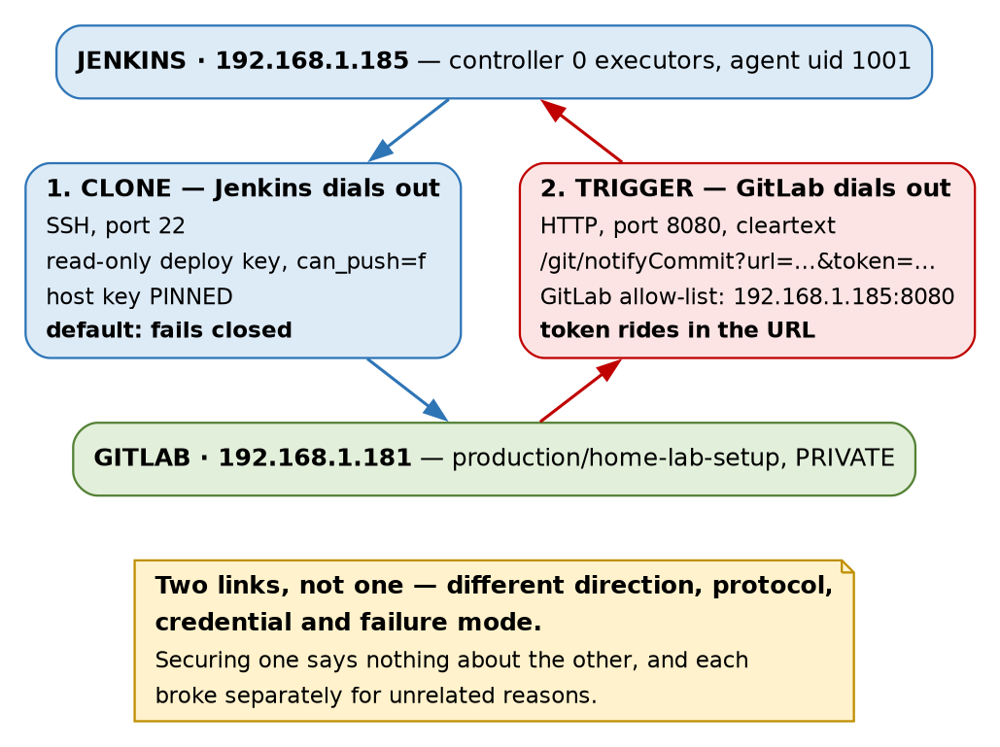
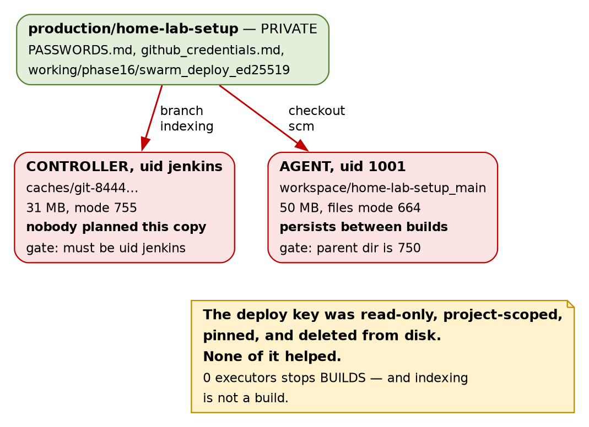

# Jenkins · Chapter 3 — Wiring It to GitLab

> **Series:** Home-Lab Education · Phase 17 (Jenkins)
> **Built and verified:** August 20, 2026 on VM 185 (`192.168.1.185`) against GitLab 19.2.1 on
> `192.168.1.181`
> **Versions at time of writing:** Jenkins 2.568.2 LTS on Jetty 12.1.8 · `git` plugin 5.10.1 ·
> `gitlab-plugin` 1.9.16 · `workflow-multibranch` 841.vec5b\_9e1806ec
> **Assumed, not re-taught:** [Chapter 1](chapter01_the_controller_and_the_agent.md) (the
> controller/agent split, `JENKINS_HOME`) and [Chapter 2](chapter02_identity_authorization_breakglass.md)
> (the realm and the strategy).
> **Read this before:** Chapter 4 (the first deploy onto the Swarm)

---

## What this chapter covers

Connecting a CI system to a git server sounds like one task. It is **two**, and this chapter is
organised around that fact because [nearly everything that went wrong followed from it]{custom-style="Key"}.

By the end, a `git push` builds Jenkins with nobody watching. Getting there took four green builds and
a run of configuration screens that each reported something untrue — [not one of which produced an
error at the moment it lied]{custom-style="Key"}. Those are collected in §7, and they are the most
transferable part of the chapter, because **[the specific screens will change and the failure shape
will not]{custom-style="Key"}.**

⛔ **One deliberately-planted trap could not fire at all**, for the second time in this phase, and §5
is honest about what that does and does not mean.

---

## 1. One integration, two links



| | Link 1 — **clone** | Link 2 — **trigger** |
|---|---|---|
| Who dials | **Jenkins** → GitLab | **GitLab** → Jenkins |
| Protocol | SSH, port 22 | HTTP, port 8080, cleartext |
| Credential | read-only deploy key | access token in the query string |
| Default posture | fails closed on an unknown host key | refused: local address, then no token |
| Broke because | — | GitLab blocks LAN targets; git plugin demands a token |

[The two links share the two hostnames and nothing else]{custom-style="Key"}. Different direction,
different protocol, different credential, different failure mode — and they were secured, and broken,
entirely separately.

⭐ **This is worth carrying past Jenkins, because "wire A to B" is how the task gets written on a
ticket and [the ticket hides the second half]{custom-style="Key"}.** A working clone tells you nothing
about whether pushes will trigger anything, and a delivered webhook tells you nothing about whether
the clone will succeed. **Ask which direction each leg runs in and what fails if only one works** —
[an integration that clones but never triggers looks healthy in every screen you would check]{custom-style="Key"}
and simply never builds anything new.

---

## 2. The clone link, and proving the key is read-only

Jenkins authenticates to GitLab with a **per-project read-only deploy key**,
[never an account credential]{custom-style="Key"}. It was generated on `.185`, the public half
registered on the project, and the private
half pasted into Jenkins' credential store and then **deleted from the host** — the same discipline as
the agent key in Chapter 1 §5.

The interesting part is not creating it. It is **[checking that read-only actually means
read-only]{custom-style="Key"}**, which was done [against GitLab's database rather than the
checkbox]{custom-style="Key"} that had just been ticked:

```
id | title                 | can_push | project_id
 3 | jenkins-185-readonly  | f        | 6
```

⭐ **`can_push = f` is the enforcement; the checkbox is a rendering of it.** That distinction sounds
pedantic right up until a UI shows a stale value or a form silently declines to save — [both of which
happened later the same evening]{custom-style="Key"} (§7).

### The deploy key is doing real work here, which is not always true

`production/home-lab-setup` is `visibility_level = 0` — **PRIVATE**. So the key is genuinely what
gets Jenkins in.

Worth contrasting with a finding from earlier in this phase: the `production/capricorn` project is
**INTERNAL**, and INTERNAL on GitLab means [every authenticated identity on the instance can read
it]{custom-style="Key"}. Had this repo been internal, the carefully-scoped deploy key would have been
[decoration on an already-open door]{custom-style="Key"}.

🚨 **So "we used a scoped credential" is only a security statement if the resource was closed to begin
with.** Check the object's visibility before you congratulate yourself on the credential —
[a scope grants access, it does not fence it]{custom-style="Key"}.

---

## 3. Host key pinning, and a default that failed closed

The first branch scan failed outright:

```
No ED25519 host key is known for gitlab.gothamtechnologies.com and you have requested strict checking.
Host key verification failed.
```

This is Jenkins working correctly. The `jenkins` user had no `known_hosts`, the git client was in
strict mode, and it **refused to connect to a host it could not identify.**

The fix was *Manually provided keys* under **Manage Jenkins → Security → Git Host Key Verification
Configuration**, holding both of GitLab's host keys with the IP as an alias:

```
gitlab.gothamtechnologies.com,192.168.1.181 ssh-ed25519 AAAAC3Nza…
gitlab.gothamtechnologies.com,192.168.1.181 ssh-rsa     AAAAB3Nza…
```

The strategy saved as `ManuallyProvidedKeyVerificationStrategy`. **[Both key types were pinned, and
the IP alias matters]{custom-style="Key"}** — the same server reached by address rather than name is,
to SSH, a different entry.

⭐ **Where the keys came from is the whole point.** They were read off `.181`'s own `/etc/ssh/`
directory over an existing trusted SSH session — [not scraped from the server we were trying to
authenticate]{custom-style="Key"}. `ssh-keyscan` against an unknown host asks the very machine whose
identity is in question to vouch for itself, which is [trust-on-first-use with extra
steps]{custom-style="Key"}. Reading the file from a channel you already trust is what makes it a pin.

> **Lab vs PROD — pinning by hand does not scale, and the failure mode is worse than you expect.**
> *In the lab:* two host keys pasted into a text box, for one git server that will not change.
> *Why it's acceptable here:* one server, one operator, and the keys came off the server's own disk
> over a trusted channel. *In production:* the known-hosts material is distributed by configuration
> management or an internal CA that signs host keys, so a rebuilt server is trusted automatically and
> a *substituted* one still is not. *If you carry the habit:* ⚠️ **manually-pinned keys rot silently.**
> When the git server is rebuilt, every Jenkins on the estate fails closed at once —
> [correct behaviour that looks exactly like an outage]{custom-style="Key"} — and the pressure in that
> moment is to switch verification off "temporarily", which is how a pin becomes permanently absent.

### The comparison that makes this chapter worth writing

Phase 16's deploy script reached the Swarm with `StrictHostKeyChecking=no`. Same lab, same operator,
same month. [That script would have connected to literally anything answering on port 22]{custom-style="Key"}.

⭐ **Jenkins' default was stricter than our own hand-written script**, and the reason is structural
rather than moral: **[a default fails closed for everyone, whereas a flag in a script fails open for
whoever pasted it]{custom-style="Key"}.** The script's author had to actively type the insecure
option; the Jenkins user had to actively supply the keys. **[Which way a tool fails when you have not
configured it is the single most consequential thing about it]{custom-style="Key"}.**

---

## 4. Multibranch, and where the pipeline lives

The job is a **Multibranch Pipeline** whose Script Path is `education/jenkins/Jenkinsfile` — not the
repository root.

| | GitLab CI | Jenkins Multibranch |
|---|---|---|
| Pipeline definition | `.gitlab-ci.yml` **at the repo root** | any path, set **per job** as the Script Path |
| Pipelines per project | one entrypoint | as many as you create jobs |

That difference decided where this track's pipelines live. This repository will eventually hold
several education tracks, each wanting its own pipeline, and [Jenkins supports that natively because
every job carries its own Script Path]{custom-style="Key"}. Doing the same in GitLab means the root
`.gitlab-ci.yml` becomes an `include:` router that every track has to edit — [a shared file that is a
merge conflict waiting to happen]{custom-style="Key"}.

⚠️ **Not a claim that one model is better.** GitLab's single entrypoint means *the repo has a
pipeline*, discoverable by anyone who clones it. Jenkins' means [the pipeline you are looking at is
whichever one some job was configured to read]{custom-style="Key"}, and **the mapping lives in Jenkins,
not in the repo.** That is a real cost: the repo alone no longer tells you what CI does with it.

### Branch indexing is not a build

A multibranch job does two distinct kinds of work, and keeping them separate is essential to §6:

- **Branch indexing** — the controller lists the remote's branches, looks for the Script Path in each,
  and decides which branches deserve jobs.
- **The build** — the agent checks out and runs the pipeline.

[Indexing is scheduling work, so the controller does it]{custom-style="Key"}, executor count
notwithstanding. This is also where the workspace name comes from: builds land in
`home-lab-setup_main`, the job name and the branch, [because one multibranch job can have many
branches building at once]{custom-style="Key"}.

---

## 5. The trigger link

### First, the endpoint that does not exist

The obvious move is to point GitLab at the GitLab plugin. `POST /project/home-lab-setup` returns
**404** — and so does `POST /project/does-not-exist`. [The two responses are identical]{custom-style="Key"}.

The plugin's trigger is a **job-level** feature and a Multibranch Pipeline is a **folder**, so the
endpoint is never registered. 🚨 **A 404 meaning "wrong plugin for this job type" is
[indistinguishable from a 404 meaning you typed the name wrong]{custom-style="Key"}**, and the second
explanation is the one you will chase, because it is the likelier bug in general.

That leaves the git plugin's `notifyCommit`. ⭐ Note what just happened to the build standard for the
third time: **the plugin list did not contain what the standard's own requirement needed** — after
`ssh-slaves` in Chapter 1, and `matrix-auth` in Chapter 2. [A plugin list is not a capability
list]{custom-style="Key"}.

### The trap that could not fire

The plan was to configure the webhook **with no token**, then show that anyone able to reach Jenkins
could start a build. Git plugin 5.10.1 makes that impossible:

```
HTTP ERROR 401 An access token is required. Please refer to Git plugin documentation
(https://plugins.jenkins.io/git/#plugin-content-push-notification-from-repository) for details.
```

The `token` parameter is **required by default**, the endpoint **fails closed**, and ✅ [the error body
names the exact page that explains the fix]{custom-style="Key"} — close to a model failure message,
and worth holding up as a standard to judge others against.

⭐ **This is the second planted trap this phase closed by its vendor**, after Chapter 2's matrix
lockout. Two instances is enough to state the pattern: **[the hazards the internet warns about
loudest are disproportionately the ones that have since been fixed]{custom-style="Key"}**, because
loud warnings are exactly what prompts maintainers to change a default. ⚠️ **The practical
consequence is uncomfortable: [reciting old warnings feels like diligence and displaces
measurement]{custom-style="Key"}.** Go and check what your version actually does.

### What survives of the lesson, which is most of it

**The token rides in the URL.** Not a header — a query parameter:

```
http://192.168.1.185:8080/git/notifyCommit?url=git@gitlab…home-lab-setup.git&token=<token>
```

So it lands in GitLab's stored webhook configuration, in GitLab's delivery log, in the request line on
the wire, and in [any access or proxy log anywhere on the path]{custom-style="Key"}. ⭐ **A secret in a
URL is a secret in a log**, which is a materially different exposure class from a password in a form
and argues for treating this token as low-trust and rotating it freely. Jenkins itself stores only a
**SHA-256 hash** of it, which is why it can never show you the value again.

**And the token authenticates the request, not the sender.** Build #3's recorded cause is
`Branch indexing`. ⚠️ **[Jenkins does not record that GitLab triggered it]{custom-style="Key"}** — from
inside Jenkins, a genuine push, the Test button, and anyone else holding the token are
indistinguishable. **["The pipeline ran" is still not evidence of who ran it.]{custom-style="Key"}**

> **Lab vs PROD — a CI trigger token crossing the LAN in a cleartext URL.** *In the lab:* the token is
> a query parameter on `http://`, by the same decision that left the UI without TLS. *Why it's
> acceptable here:* isolated segment, single operator, and the token's blast radius is *"can cause a
> branch scan"* rather than *"can deploy"* — Jenkins decides what to build, the caller does not.
> *In production:* TLS end to end, and the trigger secret carried in a **header** so it stays out of
> logs and referrers. *If you carry the habit:* 🚨 [a trigger token is a build-on-demand
> credential]{custom-style="Key"}, and once a pipeline deploys — which ours does from Chapter 4 —
> **[whoever can trigger it can ship code, on your CI system's authority]{custom-style="Key"}.** ⚠️ *The
> header-based comparison is recited; nothing here terminates TLS.*

### Two fields called "token", neither aware of the other

| Field | Sent as | Read by |
|---|---|---|
| GitLab webhook **Secret token** | `X-Gitlab-Token` **header** | ⛔ nothing here — `notifyCommit` never inspects headers |
| Git plugin **access token** | `token` **query parameter** | ✅ the git plugin |

🚨 **Restating in prose, because this one is genuinely dangerous as a table row: filling in GitLab's
Secret token field would have secured nothing while looking exactly like securing
something.** [A control that appears to be engaged and is not]{custom-style="Key"} is worse than an
obviously absent one, because it stops you looking further. Ours is deliberately left blank, and
that decision is written down where the next person will find it.

This is the **fourth** name collision in three chapters, after `ssh-agent`/`ssh-slaves`,
`gitlab-plugin`/`gitlab-oauth` and `matrix-project`/`matrix-auth`. ⭐ **The standing rule this phase
has earned: [assume two similarly-named things in this stack are unrelated until checked]{custom-style="Key"}.**

### GitLab refuses to send to a private address — twice over

```
Url is blocked: Requests to the local network are not allowed
```

Raised **at save time, in the form**, before any request left GitLab. ✅ [That is the kind failure
mode]{custom-style="Key"}: loud, immediate, and in front of the person who caused it.

But the setting is asymmetric in two independent ways, and the measured values say so:

```
allow_local_requests_from_web_hooks_and_services | f
allow_local_requests_from_system_hooks           | t
outbound_local_requests_whitelist                | {}
```

**System hooks may reach the LAN; project webhooks may not** — same instance, same target. And
separately, GitLab **delivered a project webhook to `192.168.1.181`**, equally private, with that flag
off and the allow-list empty, then refused `192.168.1.185`. ⚠️ *Inferred rather than proven from
source: GitLab's URL blocker exempts the instance's own address.*

⭐ **So *"GitLab blocks outbound LAN requests"* is false twice over** — [it depends on which subsystem
asks and on which local address you name]{custom-style="Key"}. A sentence at that level of generality
is not a fact about the system, it is a summary that will mislead you at 3am.

The fix taken was the **narrow** one: an allow-list entry of `192.168.1.185:8080`, **host and port**,
with the global "allow local network" checkbox left off. The blunt alternative — ticking that box —
is what most guides offer, and it would have opened [every service on every host on the
LAN]{custom-style="Key"} to anything GitLab can be persuaded to call. **Same targeted-versus-blunt
choice as Chapter 2's break-glass**, and the same reasoning: [diagnose which layer failed before
picking the tool]{custom-style="Key"}.

### It works — and the success message contains a line that reads like failure

```
No git jobs using repository: git@gitlab…home-lab-setup.git and branches:
Scheduled indexing of home-lab-setup
```

HTTP 200. The first line concerns classic freestyle jobs with *Poll SCM*, of which this instance has
none; **the second line is the one that matters.** 🚨 [Stopping at line one would have you debugging a
working system]{custom-style="Key"} — and line one is where you stop, because it is first and it
sounds negative.

Four builds, the last two triggered by nothing but `git push`:

| Build | Time | Cause | Result |
|---|---|---|---|
| #1 | 17:32 | manual scan | SUCCESS |
| #2 | 19:06 | webhook Test button | SUCCESS |
| #3 | 19:10 | **a real `git push`** | SUCCESS |
| #4 | 19:15 | another push | SUCCESS |

---

## 6. What the checkout dragged in



The credential work in §2 and §3 was done properly. Read-only key, one project, host key pinned,
private half deleted from disk so it existed only inside an encrypted store. **Then the first checkout
wrote this:**

| Where | What | Mode |
|---|---|---|
| Agent workspace | `PASSWORDS.md` (16,781 B), `github_credentials.md` (3,233 B), **57 files under `working/`** including `working/phase16/swarm_deploy_ed25519` — the real Swarm deploy key, 476 B | `664` |
| Controller cache | `/var/lib/jenkins/caches/git-8444…`, **31 MB**, holding the same objects | `755` |

⭐ **The sentence to keep, because a table row is easy to skim: [access control on the pipeline is
irrelevant when the artefact it clones is the vault]{custom-style="Key"}.** Every effort in §2 and §3
was spent on *how Jenkins authenticates*, and [none of it constrains what the repository
contains]{custom-style="Key"}. Any `Jenkinsfile`, on any branch, can now `cat` a private key Jenkins
was never asked to grant it.

### The copy nobody planned

The controller has one too, and that was not in anyone's design. Chapter 1 proved the controller runs
no builds by setting executors to zero and watching a job queue forever. That proof was sound. **The
conclusion drawn from it was too wide** — [branch indexing is not a build]{custom-style="Key"}, so the
controller clones the repository itself in order to look for the `Jenkinsfile`.

🚨 **[A boundary verified against one class of work says nothing about another]{custom-style="Key"}.**
"X cannot happen here" is only ever true for the mechanism you tested. Ask what *other* kinds of work
the component still does — [a rule proven against TCP says nothing about UDP]{custom-style="Key"}, a
read-only mount proven against one writer says nothing about the next.

### Be precise about the blast radius

Overstating this teaches the wrong lesson. The files are `664`, but `/home/jenkins-agent` is **`750`**,
so the readers are `jenkins-agent` and root — [not every local account on the box]{custom-style="Key"}.
The controller's cache is likewise gated by needing the `jenkins` uid.

✅ **The parent directory is doing the work** — [precisely the mechanic that protects `master.key` in
Chapter 1 §7]{custom-style="Key"}, here operating in our favour. **Same one-directory-deep structure,
opposite outcome**, which is a good reminder that [the mechanic is neutral and only the mode bits
decide]{custom-style="Key"}.

### It updates itself, which is the part that makes it real

`PASSWORDS.md` was 14,854 bytes when this was first measured. It is **16,781** now, because a
documentation commit was pushed a few hours later and [the workspace re-checked out]{custom-style="Key"}.

⚠️ **So the notifyCommit token created in §5 — written into `PASSWORDS.md` roughly an hour before this
chapter was drafted — is already sitting in both copies.** ⭐ **This is not a stale snapshot of a
past mistake; [it is a live mirror that tracks the secrets file]{custom-style="Key"}.** Every future
credential recorded in that repository arrives here automatically, without anyone deciding it should.

### Why Phase 16 did not have this problem

GitLab CI ran each job in a **fresh container**. The secrets existed for the life of the job and died
with it. [A Jenkins agent workspace is a directory that stays]{custom-style="Key"} — that is the whole
point of it, since not re-cloning 50 MB every build is why it is fast.

⚠️ **And the obvious fix does not work.** `cleanWs()` empties the workspace between builds, but
[the next checkout recreates every file]{custom-style="Key"}, and it does **nothing whatever** to the
controller's cache. The real answers are a **narrow checkout**, **a repository that does not contain
secrets**, or **ephemeral agents** — all of which are structural, and none of which is a pipeline step.

> **Lab vs PROD — the repository being cloned contains plaintext credentials.** *In the lab:*
> `PASSWORDS.md` and a live private key are committed to the private GitLab mirror on purpose, so the
> lab is reproducible from one clone. *Why it's acceptable here:* the repo is PRIVATE, the mirror
> never reaches the public GitHub remote, and the credentials are lab-only by rule. *In production:*
> secrets live in a secret manager and the repo holds references; CI fetches them at run time, scoped
> to the job. *If you carry the habit:* 🚨 **every system that clones the repo becomes a copy of the
> vault** — CI agents, developer laptops, backups, and [the controller's cache that nobody knew
> existed]{custom-style="Key"}. ⚠️ **This also makes `JENKINS_HOME` worse than Chapter 1 described:** it
> now holds a plaintext key alongside the encrypted credential store, so **[the backup no longer needs
> `master.key` to be worth stealing]{custom-style="Key"}.**

---

## 7. Which surface is telling you the truth

Four times in one evening a screen or a response reported something that was not the case. None
produced an error at the moment it misled, and [all four are the same shape]{custom-style="Key"}.

| What it said | What was true | What settled it |
|---|---|---|
| *"Hook executed successfully but returned HTTP 422"* | The webhook was pointed at **GitLab itself**; Jenkins never saw it | `Server: nginx` and `X-Gitlab-Meta` in the response headers |
| The edit form redisplayed the corrected URL after saving | **The save was rejected**; the stored URL was unchanged | `updated_at` still equal to `created_at` |
| A 404 from the GitLab plugin's endpoint | Wrong plugin for this job type, not a typo | The same 404 for a job name that does not exist |
| *"No git jobs using repository…"* | Indexing **was** scheduled, on the next line | Build #2 appearing fourteen seconds later |

The second one deserves restating in prose, because it defeats the technique you would reach for.
**We typed the URL, saved it, and read it back off the form — and it was wrong**, because
[a rejected form redisplays what you typed rather than what was stored]{custom-style="Key"}. Read-back
is a good instinct; it was aimed at the wrong surface. **The authoritative surface is
[the list view or the database, never the edit form]{custom-style="Key"} you have just submitted.**
The same trap
sits inside Chapter 1's advice to check `Depends` before installing: [the technique is sound and the
surface lies]{custom-style="Key"}.

⭐ **The general rule, which is the spine of all three chapters so far: [prefer the surface generated
by the thing that enforces the rule]{custom-style="Key"}.** `can_push` in the database over the
checkbox. `updated_at` over the form. The response headers over the rendered error page. A build
appearing over a success message. **Every one of those pairs [cost minutes to check and would have
cost an hour]{custom-style="Key"} to assume.**

---

## 8. Commands to know by heart

```bash
# --- which machine actually answered? ---
curl -s -D - -o /dev/null <url> | grep -iE '^(HTTP|Server|X-Gitlab-Meta)'
# Server: nginx + X-Gitlab-Meta  -> GitLab.   Powered by Jetty -> Jenkins.

# --- GitLab side, from the database rather than the UI ---
sudo gitlab-psql -xc "select id,title,can_push,project_id from keys k
  join deploy_keys_projects dk on dk.deploy_key_id=k.id where dk.project_id=<id>;"
sudo gitlab-psql -xc "select created_at,url,response_status,response_body
  from public.web_hook_logs_daily order by created_at desc limit 1;"
sudo gitlab-psql -xc "select id,created_at,updated_at from public.web_hooks;"   # did the save land?
sudo gitlab-psql -xc "select allow_local_requests_from_web_hooks_and_services,
  allow_local_requests_from_system_hooks, outbound_local_requests_whitelist
  from application_settings order by id desc limit 1;"

# --- Jenkins side ---
curl -s -u <user>:<pass> 'http://<host>:8080/job/<job>/job/<branch>/api/json?depth=2'   # builds + causes
curl -s -u <user>:<pass> 'http://<host>:8080/job/<job>/job/<branch>/lastBuild/consoleText'
sudo grep -oE '<(scriptPath|remote|credentialsId)>[^<]*' /var/lib/jenkins/jobs/<job>/config.xml
sudo cat /var/lib/jenkins/hudson.plugins.git.ApiTokenPropertyConfiguration.xml   # names + hashes only

# --- what the checkout left behind ---
sudo du -sh /var/lib/jenkins/caches/*                     # the copy nobody planned
sudo stat -c '%a %U:%G %n' /home/jenkins-agent            # the directory doing the gating
```

⭐ **Reach for the delivery log before you touch the target.** GitLab records the URL it called, the
response status, the headers and the body. [Most webhook debugging ends there]{custom-style="Key"},
and starting at the other end means diagnosing a machine that may not have been involved.

---

## 9. Glossary

| Term | Meaning |
|---|---|
| **Deploy key** | An SSH key granting access to **one repository**. `can_push` decides read vs write; verify it in the database |
| **Branch indexing** | A multibranch job listing remote branches and looking for its Script Path. Done by the **controller**, and **not a build** |
| **Script Path** | Where in the repo a job's `Jenkinsfile` lives. Per-job in Jenkins; fixed at the root in GitLab CI |
| **`notifyCommit`** | The git plugin's endpoint for "the repo changed, go look". Requires a `token` query parameter by default |
| **notifyCommit access token** | Generated in *Manage Jenkins → Security*, stored **SHA-256 hashed**. Unrelated to GitLab's Secret token |
| **GitLab Secret token** | Sent as the `X-Gitlab-Token` **header**. ⛔ Ignored entirely by `notifyCommit` |
| **Host key pinning** | Recording the server's key **in advance, from a trusted channel**, so an unexpected one fails closed |
| **`ManuallyProvided…Strategy`** | Jenkins' pinned-key verification mode, as opposed to *Known hosts file* or *Non verifying* |
| **Outbound allow-list** | GitLab's list of local `host:port` targets webhooks may reach. Narrower than the global "allow local network" toggle |
| **INTERNAL visibility** | GitLab: readable by **any authenticated user** on the instance. A scoped credential adds nothing against it |
| **`cleanWs()`** | Empties the workspace between builds. ⚠️ Does not stop the next checkout recreating it, and never touches the controller cache |

---

## 10. Check yourself

Answer these out loud. Section references, not answers — reconstructing is the exercise.

1. "Jenkins is wired to GitLab" — name the two links, and say what still works if only one of them
   does. (§1)
2. You scoped a deploy key to one project and made it read-only. Under what condition does that buy
   you nothing at all, and how would you check? (§2)
3. Your own script uses `StrictHostKeyChecking=no` and Jenkins refuses to connect to the same server.
   Which is right, and what makes the difference structural rather than a matter of care? (§3)
4. Where does `ssh-keyscan` get the key it gives you, and why is that not a pin? (§3)
5. Your controller runs zero executors. Name something it still clones, and the general form of the
   mistake in assuming it does not. (§4, §6)
6. A webhook returns 404. Give two very different causes and say how you would tell them apart. (§5)
7. GitLab's webhook has a Secret token field and Jenkins wants a token. Are they the same thing, and
   what is the cost of assuming they are? (§5)
8. You need a webhook to reach one host on the LAN. Name the narrow fix and the blunt one, and say
   what the blunt one opens. (§5)
9. `cleanWs()` is proposed to fix plaintext secrets in the workspace. Give the two separate reasons it
   does not work. (§6)
10. You typed a value into a form, saved, and read it back correctly. Name a circumstance in which it
    was never stored, and the surface you should have checked. (§7)
