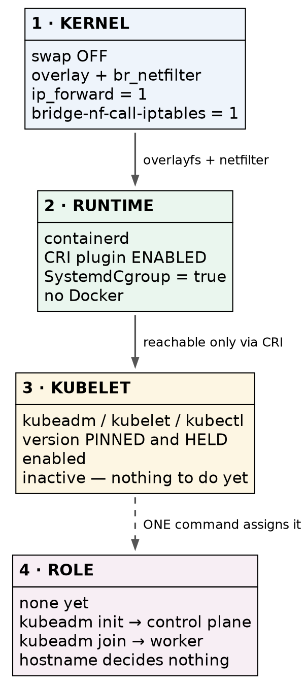

# Kubernetes (CKA) · Chapter 1 — Preparing a Node for kubeadm

> **Series:** Home-Lab Education · Phase 18 (Kubernetes HA + CKA)
> **Built and verified:** September 16, 2026 on VMs 201–205 (`192.168.1.201–205`)
> **Versions at time of writing:** Kubernetes v1.35.8 · containerd 2.3.3 · Ubuntu 24.04.4 LTS
> · kernel 6.8.0-134 · yq v4.53.6
> **Read this before:** Chapter 2 (`kubeadm init` and what it creates), Chapter 3 (joining an HA
> control plane)

---

## What this chapter covers

Five machines went from a plain Ubuntu image to [kubeadm-ready in about fifty seconds each]{custom-style="Key"} — and then stopped. At the end of this chapter every node is
[identical and has no role at all]{custom-style="Key"}: not a control plane, not a worker, just a
host that could become either.

That stopping point is deliberate and it is the most useful thing here. It separates *"the tools are
installed"* from *"the cluster is configured"*, and those are [different states that get blurred
together]{custom-style="Key"} in most walkthroughs.

**This chapter is written to be repeatable somewhere else.** The lab happens to clone from a Proxmox
template, but [that is the one part that will not travel]{custom-style="Key"} — at most workplaces [a machine is handed to
you already built]{custom-style="Key"}. So the subject here is *given a fresh Ubuntu host, what makes
it a Kubernetes node* — and the answer is the same whether the host arrived from a template, a cloud
API, or a colleague.

---

## Why a node needs preparing at all

Installing `kubeadm` does not make a host able to run Kubernetes. Four things below it have to be
true first, and [each one fails differently when it is missing]{custom-style="Key"}.

The kubelet — the agent that actually runs containers on every node — does not run containers itself.
It asks a **container runtime** to, through an interface called the **CRI**. So the stack a node needs
looks like this, bottom up: [kernel behaviour, then a runtime, then the kubelet]{custom-style="Key"},
and [nothing above works if something below is wrong]{custom-style="Key"}.



> The layers are independent. A node can have a perfectly configured runtime and still fail because
> of a sysctl, and the error message will point at neither.

**Why swap must be off.** The kubelet refuses to start with swap enabled unless explicitly told to
tolerate it. The reason is that [Kubernetes schedules against memory it believes is real]{custom-style="Key"} — a pod given a 1 GB limit that is quietly swapping is neither
performing as promised nor failing in a way the scheduler can see.

**Why two kernel modules.** `overlay` provides the filesystem the runtime's snapshotter layers images
onto. `br_netfilter` is the interesting one: it [lets iptables see traffic crossing a bridge]{custom-style="Key"}. Without it, packets between pods on the same node bypass the rules that
implement Services, so [Service routing fails in a way that looks like a CNI bug]{custom-style="Key"}
and sends you debugging the wrong layer entirely.

**Why three sysctls.** `net.ipv4.ip_forward` because [a node routes traffic between pods and is
therefore a router]{custom-style="Key"}. The two `bridge-nf-call-ip*tables` settings turn on the
behaviour `br_netfilter` makes possible. All three are boring and all three are load-bearing.

**Why the runtime is the step that bites.** See §4. It has a default that is correct for Docker and
[fatal for Kubernetes]{custom-style="Key"}.

---

## The procedure

Each step says how to confirm it took effect, and the confirmation deliberately checks
[something other than the thing you just typed]{custom-style="Key"}. Writing a config file proves you
can write files; it does not prove the kernel agreed.

### 1. Turn swap off, permanently

```bash
sudo swapoff -a
sudo sed -i -E 's@^([^#].*[[:space:]]swap[[:space:]])@#\1@' /etc/fstab
```

**Confirm:**

```bash
swapon --show          # must print NOTHING at all
grep -i swap /etc/fstab # any swap line must be commented out
```

⚠️ **`swapoff -a` alone lasts until the next reboot.** [The `/etc/fstab` edit is what makes it
survive]{custom-style="Key"}, and [a node that comes back with swap on after a reboot]{custom-style="Key"} has a kubelet
that will not start — three weeks after you built it, when nobody connects the two events.

### 2. Load the kernel modules, and make it stick

```bash
printf 'overlay\nbr_netfilter\n' | sudo tee /etc/modules-load.d/k8s.conf
sudo modprobe overlay && sudo modprobe br_netfilter
```

**Confirm:**

```bash
lsmod | grep -E '^overlay|^br_netfilter'   # both present NOW
cat /etc/modules-load.d/k8s.conf           # both present AFTER a reboot
```

⚠️ Those are [two different questions and you need both]{custom-style="Key"}. `modprobe` affects the
running kernel; the file affects the next boot. Doing only one of them [works today and breaks later]{custom-style="Key"}.

### 3. Set the sysctls

```bash
cat <<'EOF' | sudo tee /etc/sysctl.d/k8s.conf
net.bridge.bridge-nf-call-iptables  = 1
net.bridge.bridge-nf-call-ip6tables = 1
net.ipv4.ip_forward                 = 1
EOF
sudo sysctl --system
```

**Confirm — read them back from the kernel, not from the file:**

```bash
sysctl -n net.ipv4.ip_forward net.bridge.bridge-nf-call-iptables   # 1 and 1
```

⚠️ **Order matters here.** `net.bridge.*` [does not exist until `br_netfilter` is loaded]{custom-style="Key"}, so a
sysctl file applied before step 2 [silently fails for the two bridge settings]{custom-style="Key"}.
Loading the module first is why step 2 comes first.

### 4. Install containerd — and fix the default that breaks Kubernetes

```bash
# Docker's apt repository, for the containerd.io package
sudo install -m 0755 -d /etc/apt/keyrings
curl -fsSL https://download.docker.com/linux/ubuntu/gpg \
  | sudo gpg --batch --yes --dearmor -o /etc/apt/keyrings/docker.gpg
sudo chmod a+r /etc/apt/keyrings/docker.gpg
echo "deb [arch=$(dpkg --print-architecture) signed-by=/etc/apt/keyrings/docker.gpg] \
https://download.docker.com/linux/ubuntu $(. /etc/os-release; echo $VERSION_CODENAME) stable" \
  | sudo tee /etc/apt/sources.list.d/docker.list
sudo apt-get update && sudo apt-get install -y containerd.io
```

⛔ **`containerd.io` only. Not `docker-ce`, not `docker-ce-cli`.** [A Kubernetes node has no use for
the Docker daemon]{custom-style="Key"}, and installing it leaves you with two image stores where
`docker ps` and `crictl ps` show different realities.

🚨 **Now the step everyone gets wrong.** The packaged config contains `disabled_plugins = ["cri"]`,
because [Docker genuinely does not need the CRI plugin]{custom-style="Key"}. The kubelet talks to
containerd *through* CRI. Leave the default and `kubeadm init` hangs — and
[the error names the kubelet, not containerd]{custom-style="Key"}, which is why this costs people an
afternoon.

```bash
sudo cp /etc/containerd/config.toml /etc/containerd/config.toml.orig-packaged
containerd config default | sudo tee /etc/containerd/config.toml >/dev/null
sudo sed -i 's/SystemdCgroup = false/SystemdCgroup = true/' /etc/containerd/config.toml
sudo systemctl restart containerd && sudo systemctl enable containerd
```

**Confirm — ask containerd what it can DO, not what its file says:**

```bash
sudo ctr plugin ls | awk '$1=="io.containerd.grpc.v1" && $2=="cri"'   # STATUS must be ok
grep 'SystemdCgroup' /etc/containerd/config.toml                      # must be true
```

⭐ [Reading the config tells you what containerd was told]{custom-style="Key"}; `ctr plugin ls` tells
you what it actually loaded. Prefer the second whenever both are available.

⚠️ **`SystemdCgroup = true` is not cosmetic.** It must match the kubelet's cgroup driver, which is
`systemd` on Ubuntu. A mismatch [does not fail at install time]{custom-style="Key"} — it fails later,
intermittently, under memory pressure, which is far harder to diagnose than an outright refusal.

### 5. Install kubeadm, kubelet and kubectl — pinned and held

Kubernetes publishes a separate apt repository **per minor version**. Choose the minor deliberately:
[match the environment you are targeting]{custom-style="Key"}, [not the newest that exists]{custom-style="Key"}.

```bash
K8S=1.35
curl -fsSL "https://pkgs.k8s.io/core:/stable:/v${K8S}/deb/Release.key" \
  | sudo gpg --batch --yes --dearmor -o /etc/apt/keyrings/kubernetes-apt-keyring.gpg
echo "deb [signed-by=/etc/apt/keyrings/kubernetes-apt-keyring.gpg] \
https://pkgs.k8s.io/core:/stable:/v${K8S}/deb/ /" \
  | sudo tee /etc/apt/sources.list.d/kubernetes.list
sudo apt-get update && sudo apt-get install -y kubelet kubeadm kubectl
sudo apt-mark hold kubelet kubeadm kubectl
sudo systemctl enable kubelet
```

**Confirm:**

```bash
kubeadm version -o short     # v1.35.8
apt-mark showhold            # kubeadm, kubectl, kubelet
systemctl is-enabled kubelet # enabled
systemctl is-active kubelet  # inactive — CORRECT, see below
```

🚨 **`apt-mark hold` is the important line and it is easy to skip.**
[An unplanned kubelet minor upgrade is a cluster incident]{custom-style="Key"}, not a routine patch.
This lab has already been bitten once by an unattended Docker bump that broke CI *a week later*, so
nothing connected the failure to the upgrade.

✅ **An inactive kubelet here is correct, not a fault.** It has [nothing to do until a cluster
exists]{custom-style="Key"}. It starts when `kubeadm init` or `kubeadm join` gives it a
configuration. If you go looking for a running kubelet at this point you will "fix" something that
was never broken.

---

## What you deliberately have NOT done

No `kubeadm init`. No `kubeadm join`. No CNI. No kubeconfig. And that means:

**Every node is identical and has no role.** Verified across all five: `/etc/kubernetes/` holds only
an empty `manifests/` directory, there is no PKI, no `kubelet.conf`, no `admin.conf`, no
`/var/lib/etcd`.

🚨 **The hostnames are labels a human chose and nothing enforces them.** Run `kubeadm init` on the
box called `…-worker-2` and [it becomes a control plane while its name becomes a lie]{custom-style="Key"} that every future reader will believe. A hostname is documentation, not
a constraint.

The role arrives from exactly one command, later:

| Command | The node becomes | What appears that was not there before |
|---|---|---|
| `kubeadm init` | first control plane | static pods in `/etc/kubernetes/manifests/`, the `pki/` tree, `admin.conf`, `/var/lib/etcd` |
| `kubeadm join --control-plane --certificate-key …` | another control plane | the same, but it receives the existing CA rather than creating one |
| `kubeadm join` | worker | `kubelet.conf` and bootstrap credentials. No manifests, no etcd |

⭐ **And the part worth carrying into an incident: the kubelet is identical on both roles.** A control
plane is simply a node whose kubelet *also* runs four **static pods** — etcd, the API server, the
controller manager, the scheduler — read [straight off local disk, not scheduled by the API server]{custom-style="Key"}. That is precisely why a dead API server is repaired by
[editing a *file* in `/etc/kubernetes/manifests/`]{custom-style="Key"} and waiting for the kubelet to notice, and why
`kubectl` cannot help you do it: [the thing you need to fix is the thing that serves
`kubectl`]{custom-style="Key"}.

---

## Where this lab differs from production

> **Lab vs PROD — passwordless sudo.** *In the lab:* the admin user gets
> `NOPASSWD: ALL` via `/etc/sudoers.d/`, so scripts run unattended over SSH. *Why it's acceptable
> here:* a single-user lab on an isolated network where the SSH key is the real boundary. *In
> production:* sudo requires re-authentication, and privileged actions are logged and often brokered
> through a jump host or a PAM tool. *If you carry the habit:* you have [removed the last barrier
> between a stolen session and root]{custom-style="Key"} on every node in the cluster — and the audit trail that would
> have told you it happened.

> **Lab vs PROD — automatic updates left running while the runtime is unheld.** *In the lab:*
> `apt-daily-upgrade.timer` is still enabled on these nodes, and although `kubelet`, `kubeadm` and
> `kubectl` are held, **containerd is not**. *Why it's acceptable here:* the cluster is disposable and
> a broken node is rebuilt from a script in a minute. *In production:* runtime upgrades are scheduled,
> node-by-node, behind a drain. *If you carry the habit:* [a container runtime restarts itself under a
> running workload]{custom-style="Key"} at 03:00 on a day nobody chose, and because the upgrade succeeded there is nothing
> in the logs that looks like a fault.

> **Lab vs PROD — the runtime comes from a public apt repository.** *In the lab:* `containerd.io` is
> pulled straight from `download.docker.com` at build time. *Why it's acceptable here:* the failure
> mode is a build that does not complete, which we would notice immediately. *In production:* packages
> come from an internal mirror with pinned versions, so a build is reproducible and does not depend on
> an external service being both available and honest. *If you carry the habit:* your ability to
> [rebuild a node depends on someone else's uptime]{custom-style="Key"}, and on nobody having replaced a version in place.

**Honest limitations of this build, stated plainly:** all five nodes are virtual machines
[on one physical host]{custom-style="Key"}, so anything we later demonstrate is *node* failure and
never *host* failure. The Kubernetes minor was chosen to match a certification environment rather
than a production standard. And the nodes do not restart after a host reboot — they are deliberately
`onboot 0`, which is right for lab gear and would be wrong for a real cluster.

---

## Commands to know by heart

| Question | Command |
|---|---|
| Is swap really off? | `swapon --show` (silence is success) |
| Are the modules loaded *now*? | `lsmod \| grep -E '^overlay\|^br_netfilter'` |
| Did the kernel accept the sysctls? | `sysctl -n net.ipv4.ip_forward net.bridge.bridge-nf-call-iptables` |
| Can containerd actually serve CRI? | `sudo ctr plugin ls \| grep cri` — STATUS must be `ok` |
| What cgroup driver is containerd using? | `grep SystemdCgroup /etc/containerd/config.toml` |
| Regenerate a sane containerd config | `containerd config default` |
| Which Kubernetes packages are frozen? | `apt-mark showhold` |
| Exactly which version is installed? | `kubeadm version -o short` |
| Does the node have a role yet? | `sudo ls -A /etc/kubernetes/` — only `manifests/` means no |
| Did the filesystem really grow? | `df -h /` **inside the guest** |

---

## Glossary

**CRI** — Container Runtime Interface. [The gRPC API the kubelet uses to ask a runtime]{custom-style="Key"} to run
containers. [A runtime without CRI enabled is invisible to the kubelet.]{custom-style="Key"}

**CNI** — Container Network Interface. The plugin standard that gives pods addresses and connects
them. [Kubernetes ships none, so nodes stay `NotReady`]{custom-style="Key"} until you install one.

**containerd** — the container runtime used here. Runs containers; does not build images and does not
provide the Docker CLI.

**cgroup driver** — how a process manager creates resource-limit groups. On Ubuntu this must be
`systemd` in *both* the kubelet and containerd, or [the two disagree about who owns a pod's
limits]{custom-style="Key"}.

**static pod** — a pod defined by a YAML file in `/etc/kubernetes/manifests/` and run by the kubelet
directly. [Not scheduled by the API server and not visible to it as something it controls]{custom-style="Key"} — which is how the control plane bootstraps itself.

**snapshotter** — containerd's layer storage. `overlayfs` is the default and the reason the `overlay`
module is required.

**`apt-mark hold`** — freezes a package at its installed version so a routine upgrade cannot move it.

---

## Check yourself

Answer these out loud. Section references, not answers.

1. You run `kubeadm init` and it hangs, reporting that the kubelet is not healthy. What is the
   *first* file you look at, and why is the error message misleading? (§4)
2. A colleague says "the node is prepared, swap is off" and shows you `swapon --show` printing
   nothing. What have they *not* proven? (§1)
3. Why does the module load have to happen before the sysctl file is applied? (§3)
4. Your Service resolves but no traffic reaches the pods. Which single kernel module would you check
   before suspecting the CNI? (*Why a node needs preparing*)
5. The node called `k8s-worker-2` is running the API server. How is that possible, and what does it
   tell you about hostnames? (*What you deliberately have NOT done*)
6. Your API server is down and `kubectl` returns a connection error. Explain why `kubectl` cannot
   help and what mechanism you use instead. (*What you deliberately have NOT done*)
7. You are handed a node someone else built, and asked whether it is ready for `kubeadm`. Name five
   things you would check and the command for each. (*Commands to know by heart*)
8. Why is `apt-mark hold` on the Kubernetes packages more important than it looks, and which package
   on these nodes is *not* protected by it? (§5, *Lab vs PROD*)
