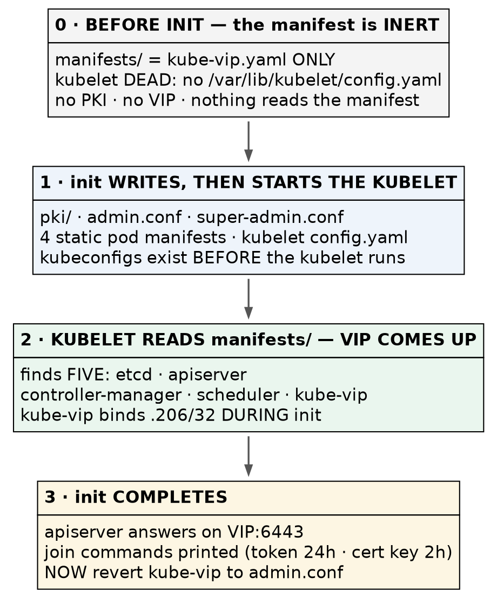

# Kubernetes (CKA) · Chapter 2 — Giving a Node a Role

> **Series:** Home-Lab Education · Phase 18 (Kubernetes HA + CKA)
> **Built and verified:** September 17, 2026 on VMs 201–205 (`192.168.1.201–205`)
> **Versions at time of writing:** Kubernetes v1.35.8 · kube-vip v1.2.3 · containerd 2.3.5
> · etcd 3.6.6 · Ubuntu 24.04.4 LTS · kernel 6.8.0-139
> **Read this after:** Chapter 1 (preparing a node) · **before:** Chapter 3 (the CNI and the joins)

---

## What this chapter covers

Chapter 1 ended with five machines that were [identical and had no role at all]{custom-style="Key"}.
This chapter runs **one command on one of them** and turns it into a control plane — then stops and
reads what that command actually did.

[The reading is the point]{custom-style="Key"}. [A control plane you have never looked inside]{custom-style="Key"} is one you
cannot repair, and [repairing one is 30% of the CKA]{custom-style="Key"}.

There is a complication to get past first, and it is the thing that makes this step confusing for
everyone: **we want a virtual IP to exist before `kubeadm init` runs, and the only thing that can
create that virtual IP is started by `kubeadm init`.**

---

## The ordering problem, and why it is not a problem

kube-vip runs as a **static pod** — a pod defined by a file in `/etc/kubernetes/manifests/` and run by
the kubelet directly. But on a freshly prepared node [the kubelet cannot start at all]{custom-style="Key"}: it dies on a missing `/var/lib/kubelet/config.yaml`, and
`kubeadm init` is what writes that file.

So the instinct — *bring the VIP up, then initialise against it* — [describes something that cannot
happen]{custom-style="Key"}.



> The resolution is that [`kubeadm init` writes the kubeconfigs BEFORE it starts the
> kubelet]{custom-style="Key"}. By the time anything reads the manifests directory, the files that
> kube-vip needs already exist. **Place the manifest, then initialise; the VIP comes up in the middle
> of init.**

⛔ **Do not wait for the VIP to answer a ping before running `kubeadm init`.** [It never will, and the
build will look stuck when nothing is wrong.]{custom-style="Key"}

**Why a VIP at all.** `kubeadm init` bakes the control-plane endpoint into
[the API server certificate's Subject Alternative Names]{custom-style="Key"} at the moment it runs. Give
it a node's own address and every other control plane must also answer on that address — which they
cannot. Give it a floating address and [any of them can answer on it]{custom-style="Key"}, one at a
time. The VIP is not a performance feature; it is what makes the second and third control plane
possible at all.

---

## Three values are fixed at init, not one

Most guides flag `--control-plane-endpoint` as the irreversible flag. [There are three]{custom-style="Key"}, and [the other two are the ones people omit]{custom-style="Key"}.

| Flag | Ours | Why it cannot be changed afterwards |
|---|---|---|
| `--control-plane-endpoint` | `192.168.1.206:6443` | Written into the API server certificate's SANs. Without it, additional control planes can never join |
| `--pod-network-cidr` | `10.244.0.0/16` | Written into the cluster config and the controller-manager's `--cluster-cidr` |
| `--service-cidr` | `10.96.0.0/12` | Determines the API server's own ClusterIP |

🚨 **The pod CIDR is not a free choice, and the default will collide with a home or office network.**
Calico's default pool is `192.168.0.0/16`, which **contains** a lab on `192.168.1.0/24`. Calico hands
out `/26` blocks, so it can and eventually will [give a pod a real address on your
wire]{custom-style="Key"} — [possibly one belonging to a node, a router, or a hypervisor]{custom-style="Key"}. The symptoms
are intermittent and look like [a CNI bug or a faulty switch]{custom-style="Key"}, and nothing points at
a CIDR chosen days earlier.

⭐ **The general rule is worth more than the number: a default CIDR is a guess about someone else's
network.** [Invert it for a corporate estate]{custom-style="Key"} — on a `10.x` network the dangerous default is [Kubernetes'
own service CIDR `10.96.0.0/12`]{custom-style="Key"}. **Check both against the network you are actually
on, every time.**

---

## The procedure

Each step says how to confirm it took effect, and several confirmations check
[something other than the thing you just typed]{custom-style="Key"}.

### 1. Choose the kube-vip version deliberately

```bash
export KVVERSION=v1.2.3
export VIP=192.168.1.206
export INTERFACE=eth0
```

⚠️ **The documented way to discover the latest version uses `jq`**, which [we deliberately did not
install]{custom-style="Key"} — the exam ships `yq`. Either pin it by hand as above, or:

```bash
curl -sL https://api.github.com/repos/kube-vip/kube-vip/releases | yq -p json '.[0].tag_name'
```

⭐ **We pinned one release behind the newest on purpose.** The current release had been published the
day before. [A release with no community exposure means a crash-loop has two possible
causes]{custom-style="Key"} — your mistake, or a regression — during the one step that cannot be
half-done.

🚨 **`INTERFACE` is `eth0` here, and every kube-vip example says `ens160` or `ens192`** because they
assume VMware. A wrong interface [binds the VIP nowhere and reports nothing]{custom-style="Key"}. Check
with `ip -br addr`.

### 2. Pull the image into the namespace the kubelet actually reads

```bash
sudo ctr -n k8s.io image pull ghcr.io/kube-vip/kube-vip:$KVVERSION
```

**Confirm — ask `crictl`, which is what Kubernetes sees:**

```bash
sudo crictl images | grep kube-vip
```

🚨 **`ctr` defaults to the `default` namespace; the kubelet uses `k8s.io`.** Pull without `-n k8s.io`
and the image is [invisible to `crictl` and the kubelet fetches it again]{custom-style="Key"} — from the
internet, in the middle of `kubeadm init`. ⭐ **Two image stores disagreeing about reality, except this
time it is containerd disagreeing with itself.** Pre-pulling removes [an external network dependency
from the irreversible step]{custom-style="Key"}.

### 3. Verify the flags against the binary, not against the documentation

```bash
sudo ctr run --rm --net-host ghcr.io/kube-vip/kube-vip:$KVVERSION vip-help \
  /kube-vip manifest pod --help
```

**Confirm:** `--controlplane`, `--arp` and `--leaderElection` all appear.

⚠️ **The casing is inconsistent and cannot be guessed.** `--controlplane` is all lowercase,
`--leaderElection` has a capital E, and `--controlPlaneHealthCheckAddress` uses camelCase —
[three spellings of the same words in one flag set]{custom-style="Key"}. [Most published examples were]{custom-style="Key"}
written for a v0.x release. **Ask the binary you are about to run.**

### 4. Generate the manifest — to a temp file, and read it

```bash
sudo ctr run --rm --net-host ghcr.io/kube-vip/kube-vip:$KVVERSION vip-gen \
  /kube-vip manifest pod \
    --interface $INTERFACE \
    --address $VIP \
    --controlplane \
    --arp \
    --leaderElection > /tmp/kube-vip.yaml

cat /tmp/kube-vip.yaml
```

⭐ **The published procedure pipes this straight into `/etc/kubernetes/manifests/`. We did not**, because
the file needs an edit first and [a wrong manifest should never sit in the static-pod directory at
all]{custom-style="Key"}, even briefly.

**Four things to check in what it produced:**

| Check | Expected |
|---|---|
| Image tag | `v1.2.3` — **not** `latest` |
| `hostPath` | `/etc/kubernetes/admin.conf` — the line we are about to change |
| `hostAliases` | maps `kubernetes` → `127.0.0.1`, present |
| `svc_enable` | **absent** — confirms `--services` really stayed off rather than defaulting on |

⚠️ **Note what else is in there that nobody asked for: `prometheus_server: :2112`.** kube-vip will
[open an unauthenticated metrics port on every control plane]{custom-style="Key"}, on host networking.
Harmless in a lab; worth knowing before someone scans the estate.

### 5. Apply the v1.29+ bootstrap workaround — on the first control plane ONLY

```bash
sed -i 's#path: /etc/kubernetes/admin.conf#path: /etc/kubernetes/super-admin.conf#' /tmp/kube-vip.yaml

grep -nE "mountPath:|      path:" /tmp/kube-vip.yaml
#   mountPath: /etc/kubernetes/admin.conf        <- UNCHANGED
#        path: /etc/kubernetes/super-admin.conf  <- changed
```

🚨 **Since Kubernetes v1.29, `admin.conf` no longer carries cluster-admin at bootstrap time.** kubeadm
[writes a second file]{custom-style="Key"}, `super-admin.conf`, and creates the binding that makes `admin.conf` useful only
*after* the control plane is up. Point kube-vip at `admin.conf` during init and
the static pod crashes, the API endpoint never appears, and [`kubeadm init` times out after about four
minutes]{custom-style="Key"} leaving an unusable cluster.

⭐ **Only the `hostPath` changes. The `mountPath` stays.** [The container keeps seeing a file called]{custom-style="Key"}
`admin.conf`; we change which host file is mounted there. The `sed` pattern is safe because it matches
lowercase `path:` and the mount line reads `mountPath:` — if it matched both you would [break it in a way a diff makes look correct]{custom-style="Key"}.

🚨 **THE ASYMMETRY IS THE PART TO REMEMBER: `super-admin.conf` exists ONLY on the first control
plane.** Control planes two and three [use the manifest exactly as generated]{custom-style="Key"}.
[Reverse that and the joins fail instead of the init]{custom-style="Key"}.

### 6. Place it — and confirm that nothing happens

```bash
sudo install -o root -g root -m 0600 /tmp/kube-vip.yaml \
  /etc/kubernetes/manifests/kube-vip.yaml

systemctl is-active kubelet     # still activating — correct
sudo crictl ps -a               # empty — nothing started
ip -br addr show eth0           # no .206 — correct
sudo journalctl -u kubelet -n 3 --no-pager
```

⭐ **`install` rather than `cp` because it sets owner and mode as part of the copy.** The source came
from a shell redirect and carried your umask; `sudo cp` would have produced a
[world-readable file in the static-pod directory]{custom-style="Key"} and nothing would have said so.

⚠️ **"I placed a manifest and nothing happened" must be a confirmed expectation, not a hope.** The
kubelet's error is unchanged because [it still dies before it ever reads that directory]{custom-style="Key"}.

### 7. Dry-run the init and check the certificate SANs before committing

```bash
sudo kubeadm init \
  --control-plane-endpoint 192.168.1.206:6443 \
  --apiserver-advertise-address 192.168.1.201 \
  --pod-network-cidr 10.244.0.0/16 \
  --service-cidr 10.96.0.0/12 \
  --kubernetes-version v1.35.8 \
  --upload-certs \
  --dry-run 2>&1 | tee /tmp/init-dryrun.txt

grep -iE "apiserver serving cert|podSubnet|serviceSubnet" /tmp/init-dryrun.txt
```

**Confirm the VIP is in the SANs before running this for real:**

```
apiserver serving cert is signed for ... IPs [10.96.0.1 192.168.1.201 192.168.1.206]
```

⭐ **This is the whole reason to dry-run.** The SAN list is [the irreversible part of the irreversible
step]{custom-style="Key"}, and a dry run shows it to you while you can still change your mind. If
`.206` is absent, **stop** — additional control planes would never be able to join.

⚠️ **`--kubernetes-version` is pinned so kubeadm does not ask `dl.k8s.io` what the newest patch
is.** Same reasoning as pre-pulling the image: [take the network out of the step that cannot be
half-done]{custom-style="Key"}.

🚨 **Then clean up, because `--dry-run` writes to disk.** It generated
[a complete PKI, private keys included]{custom-style="Key"}, under
`/etc/kubernetes/tmp/kubeadm-init-dryrun*/`. Mode `0600`, so not an exposure — but they are real
cryptographic keys belonging to no cluster, which nothing will ever rotate or account for.

```bash
sudo rm -rf /etc/kubernetes/tmp
sudo find /etc/kubernetes \( -name "*.key" -o -name "*.conf" \) -print
```

⛔ **Check that with `sudo`.** That directory is `drwx------`, so an unprivileged `ls` returns a
permission error — and if you also redirect stderr away, [empty output reads as "clean" when it means
"I could not look"]{custom-style="Key"}.

### 8. Run it for real

```bash
sudo kubeadm init \
  --control-plane-endpoint 192.168.1.206:6443 \
  --apiserver-advertise-address 192.168.1.201 \
  --pod-network-cidr 10.244.0.0/16 \
  --service-cidr 10.96.0.0/12 \
  --kubernetes-version v1.35.8 \
  --upload-certs 2>&1 | tee /tmp/init-real.txt
```

**Save that output.** It contains a **join token valid 24 hours** and a **certificate key valid two
hours**, and [the shorter clock starts the moment init finishes]{custom-style="Key"}.

⚠️ **Two expiries with very different consequences.** [The token expires and you generate another]{custom-style="Key"}
(`kubeadm token create`). The certificate key expires and additional *control planes* cannot join until
you run `kubeadm init phase upload-certs --upload-certs`. ⭐ **A deliberate, unhurried pace makes the
two-hour one MORE likely to bite, not less.**

### 9. Read what appeared — this inspection is the chapter

```bash
sudo ls -l /etc/kubernetes/ /etc/kubernetes/manifests/
sudo crictl pods
systemctl is-active kubelet
```

**What was not there ten seconds ago:**

| Appeared | What it is |
|---|---|
| `manifests/etcd.yaml`, `kube-apiserver.yaml`, `kube-controller-manager.yaml`, `kube-scheduler.yaml` | The control plane itself — **four static pods**, read off local disk |
| `pki/` | The cluster CA and every certificate derived from it |
| `admin.conf`, `super-admin.conf`, `controller-manager.conf`, `scheduler.conf`, `kubelet.conf` | Five kubeconfigs, five different identities |
| `/var/lib/etcd` | The datastore |
| `/var/lib/kubelet/config.yaml` | The file whose absence was killing the kubelet |

⭐ **The kubelet is now `active` for the first time in the machine's life.** And the deepest point in
this chapter: [the kubelet is IDENTICAL on a control plane and on a worker]{custom-style="Key"}. A
control plane is simply a node whose kubelet *additionally* runs four static pods. **That is why a dead
API server is repaired by editing a file in `/etc/kubernetes/manifests/` and waiting**, and why
`kubectl` cannot help you: [the thing you need to fix is the thing that serves
`kubectl`]{custom-style="Key"}.

⚠️ **kube-vip will NOT crash-loop, though the upstream notes suggest it might.** Measured: `ATTEMPT 0`,
zero restarts. The crash-loop is a symptom of the *broken* configuration, and applying the workaround
beforehand [removed the symptom rather than shortening it]{custom-style="Key"}. ⭐ **A predicted problem
that fails to appear is worth understanding, not just enjoying** — otherwise you cannot tell it apart
from a check that silently did not run.

### 10. Revert the kubeconfig, and watch what that costs

```bash
sudo sed -i 's#path: /etc/kubernetes/super-admin.conf#path: /etc/kubernetes/admin.conf#' \
  /etc/kubernetes/manifests/kube-vip.yaml
```

**Confirm the VIP survives it:**

```bash
sleep 15
sudo crictl ps -a --name kube-vip
ip -br addr show eth0
sudo KUBECONFIG=/etc/kubernetes/admin.conf kubectl get nodes
```

⭐ **`sed -i` is the right tool on a directory the kubelet is now watching**, because it writes a temp
file in the same directory and renames it over the original — and [`rename(2)` within one filesystem is
atomic]{custom-style="Key"}. [The kubelet sees the old file or the new one]{custom-style="Key"}, never half of one.

🚨 **Editing a static pod manifest DELETES AND RECREATES the pod — so `RESTARTS` tells you nothing
about it.** Measured: new pod UID, new `creationTimestamp`, and [a restart counter back at
zero]{custom-style="Key"}.

```bash
kubectl get pod -n kube-system kube-vip-<node> \
  -o custom-columns=UID:.metadata.uid,CREATED:.metadata.creationTimestamp,RESTARTS:.status.containerStatuses[0].restartCount
```

⚠️ **`RESTARTS 0` does not mean a static pod was untouched.** Compare its `creationTimestamp` against
the API server's: ours read 15:49 against 15:45, and [that four-minute gap is the entire record of the
edit]{custom-style="Key"}.

### 11. Get a kubeconfig for your own user — on the node

```bash
mkdir -p $HOME/.kube
sudo cp -i /etc/kubernetes/admin.conf $HOME/.kube/config
sudo chown $(id -u):$(id -g) $HOME/.kube/config
kubectl get nodes
```

⭐ **That result came back *through the VIP*,** because `admin.conf` points at
`https://192.168.1.206:6443`. **The first useful `kubectl` is also the proof the virtual address
works.**

**And the node will read `NotReady`, with CoreDNS `Pending`.** [That is correct]{custom-style="Key"} —
[Kubernetes ships no pod network]{custom-style="Key"}, [so nothing can give a pod an address yet]{custom-style="Key"}. **Chapter 3 installs one.**

---

## Where this lab differs from production

> **Lab vs PROD — an ARP virtual IP is failover, not load balancing.** *In the lab:* kube-vip in ARP
> mode with leader election, so [exactly one control plane holds]{custom-style="Key"} `.206` and every `kubectl` request
> reaches that one API server. *Why it's acceptable here:* five nodes and one operator, where
> availability is the only property we need. *In production:* a real load balancer distributes across
> all API servers, or kube-vip runs in BGP mode where every node advertises the address. *If you carry
> the habit:* you will [size a control plane believing three API servers share the
> load]{custom-style="Key"} when one of them is taking all of it — and the capacity model is wrong in
> the direction that only shows up under stress.

> **Lab vs PROD — a cluster-admin credential printed to a terminal.** *In the lab:* the certificate key
> from `--upload-certs` is echoed to stdout, captured with `tee`, and pasted between SSH sessions.
> *Why it's acceptable here:* it expires in two hours and the network is a single-operator LAN.
> *In production:* [joins are automated, the key is injected from a secret store]{custom-style="Key"}, and nothing that
> grants cluster-admin is ever written to a log. *If you carry the habit:* a credential to the entire cluster [ends up in shell history and CI output]{custom-style="Key"}, where it outlives the two hours
> that made it feel safe.

**Honest limitations of this build, stated plainly.** The three etcd members are virtual machines
[on one physical host]{custom-style="Key"}, sharing a hypervisor, a ZFS pool and a power supply — so
anything we demonstrate is *member* failure and never *host* failure. The VIP works by ARP on a single
layer-2 segment; a routed or multi-site control plane needs BGP instead, which is a different
configuration and a different chapter. And this chapter builds one control plane: whether the endpoint
genuinely survives losing a node is [asserted here and proven in chapter 4]{custom-style="Key"}.

---

## Commands to know by heart

| Question | Command |
|---|---|
| Does this flag actually exist in this version? | `<tool> --help` — **on the binary you will run** |
| Which images can the kubelet see? | `sudo crictl images` (not `ctr -n default images ls`) |
| What does the API server certificate really cover? | `sudo openssl x509 -in /etc/kubernetes/pki/apiserver.crt -noout -text \| grep -A1 "Subject Alternative Name"` |
| Why will the kubelet not start? | `sudo journalctl -u kubelet -n 3 --no-pager` |
| Which node holds the VIP? | `ip -br addr show eth0` |
| Was this static pod replaced, or just restarted? | `kubectl get pod X -o jsonpath='{.metadata.uid}'` and `creationTimestamp` |
| What settings did init actually record? | `kubectl -n kube-system get cm kubeadm-config -o yaml` |
| Has the certificate key expired? | `kubeadm init phase upload-certs --upload-certs` (reissues it) |
| Is there a free address for the VIP? | delete the neighbour entry, ping once, then `ip neigh show <ip>` — **a `lladdr` means occupied even if the ping failed** |

---

## Glossary

**static pod** — a pod defined by a YAML file in `/etc/kubernetes/manifests/` and run by the kubelet
directly. [Not scheduled by the API server]{custom-style="Key"}, which is how the control plane
bootstraps itself and why it can be repaired when the API is down.

**VIP (virtual IP)** — an address that belongs to no single machine. Here [exactly one control plane
holds it at a time]{custom-style="Key"} and it moves when that node fails.

**ARP mode** — kube-vip claims the VIP by answering ARP for it on the local segment. Simple, and
[confined to one layer-2 network]{custom-style="Key"}.

**leader election** — the mechanism deciding which kube-vip instance holds the VIP. ⭐ Separate from
etcd's raft leader and from the controller-manager's own election: [a cluster runs several independent
elections]{custom-style="Key"} and they need not agree on a node.

**SAN (Subject Alternative Name)** — the names and addresses a certificate is valid for.
[Fixed when the certificate is generated]{custom-style="Key"}, which is why the control-plane endpoint
cannot be changed later.

**`super-admin.conf`** — since v1.29, the kubeconfig that actually carries full privilege at bootstrap.
`admin.conf` gets its privilege through a role binding created *during* init, so it is
[not usable by tools while init is still running]{custom-style="Key"}.

**certificate key** — the short-lived secret that lets an additional control plane download the shared
PKI from the `kubeadm-certs` Secret. **Two hours.**

**bootstrap token** — [the credential a joining node uses to authenticate]{custom-style="Key"} before it has a certificate.
**24 hours.**

---

## Check yourself

Answer these out loud. Section references, not answers.

1. Someone tells you to "bring the VIP up before running `kubeadm init`." Why is that impossible, and
   what do you do instead? (*The ordering problem*)
2. You run `kubeadm init` and it times out after four minutes with the API endpoint never appearing.
   What is the first file you look at, and which single line in it? (§5)
3. Name the three values fixed at init that cannot be changed afterwards, and what breaks for each.
   (*Three values are fixed at init*)
4. Your lab is on `10.20.0.0/16`. Which Kubernetes default is now dangerous, and which one is safe?
   (*Three values are fixed at init*)
5. You edited a static pod manifest an hour ago. `RESTARTS` reads 0. What have you learned, and what
   would you check instead? (§10)
6. `sudo crictl images` does not list an image you definitely pulled. What happened? (§2)
7. You are handed a control plane and asked whether additional ones can join it. What do you inspect,
   and what exactly are you looking for? (§7)
8. Why is `super-admin.conf` needed on the first control plane but not on the second and third? (§5)
