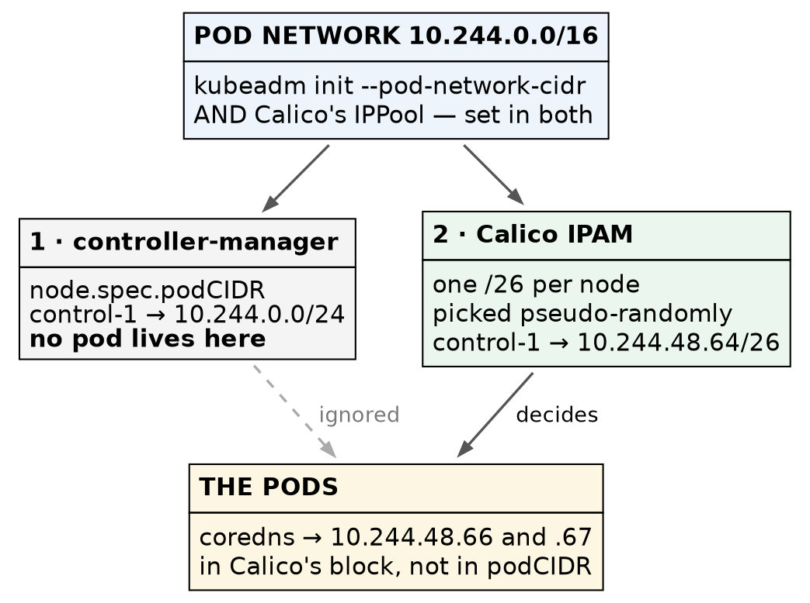

# Kubernetes (CKA) · Chapter 3 — A Network, and a Control Plane of Three

> **Series:** Home-Lab Education · Phase 18 (Kubernetes HA + CKA)
> **Built and verified:** September 17, 2026 on VMs 201–205 (`192.168.1.201–205`)
> **Versions at time of writing:** Kubernetes v1.35.8 · Calico v3.32.2 (Tigera operator) · kube-vip
> v1.2.3 · etcd 3.6.6 · containerd 2.3.5 · Ubuntu 24.04.4 LTS · kernel 6.8.0-139
> **Read this after:** Chapter 2 (the first control plane) · **before:** Chapter 4 (proving the HA)

---

## What this chapter covers

Chapter 2 ended with one control plane that was `Ready` to nothing: the node read `NotReady` and CoreDNS
sat `Pending`, because [Kubernetes ships no pod network at all]{custom-style="Key"}. This chapter
installs one, then grows the cluster from one node to five — two more control planes, then two workers.

Two things make it more than a sequence of joins. The first is that [the CNI's own install file
disagrees with the address plan]{custom-style="Key"}, and the documentation tells you it doesn't. The
second is that between the second and third control-plane joins the cluster passes through
[the least available configuration it will ever have]{custom-style="Key"}, and it is worth knowing
that while you are in it.

---

## What a CNI is, and why nothing works without one

[A pod needs an address, a route to every other pod]{custom-style="Key"}, and a way for Services to find it. The kubelet does
none of that itself. It calls a **CNI plugin** — a binary in `/opt/cni/bin` configured from
`/etc/cni/net.d` — each time it creates a pod, and [the plugin is what gives the pod its network
namespace, interface and address]{custom-style="Key"}.

With no plugin installed, the kubelet reports the node's network as not ready, the node reads
`NotReady`, and the scheduler will not place CoreDNS anywhere. ⭐ **That is not a fault to diagnose; it is
the designed resting state of a cluster with no network**, and [recognising it at a glance is worth marks]{custom-style="Key"}
in the exam's Troubleshooting domain.

We use **Calico**, chosen for one reason that matters for the CKA:
[it enforces `NetworkPolicy`]{custom-style="Key"}, which is on the syllabus. Flannel, which k3s bundles,
cannot.

---

## The procedure

Each step says how to confirm it took effect. Several of the confirmations exist because
[the obvious check gives the wrong answer]{custom-style="Key"} on these machines.

### 1. Check the host will let a CNI manage it

Calico requires that no other iptables manager is running and that NetworkManager is not holding the
interfaces it creates.

```bash
sudo ufw status                                  # must read: inactive
systemctl is-active firewalld 2>/dev/null        # absent or inactive
dpkg-query -W network-manager 2>/dev/null        # not installed
```

🚨 **Do not check `ufw` with `systemctl is-active ufw`.** On these nodes it printed `active` while
`sudo ufw status` printed `inactive`. `ufw.service` is a one-shot unit that stays "active" after it has
run, so [it reports that the unit ran, not that the firewall is on]{custom-style="Key"}. Read the
firewall, not the unit.

### 2. Check the CNI supports your Kubernetes version

[Calico v3.32 is tested against Kubernetes 1.34, 1.35 and 1.36]{custom-style="Key"}, per its own requirements page. We run
v1.35.8, which is in range. ⚠️ **Do this before choosing a CNI version, not after** — a CNI that does not
support the API it runs against [fails in ways that look like networking faults]{custom-style="Key"}.

### 3. Choose the install path — and avoid the tech-preview one

Calico's documentation offers several paths on tabs of one page. Two are relevant:

- **The Tigera operator** — [a small Deployment that reads one `Installation` object]{custom-style="Key"} and generates and
  maintains everything else. Calico labels it recommended.
- **A raw manifest** — [one large YAML file applied once, with nothing watching it afterwards]{custom-style="Key"}.

We used the operator, because it is what a production estate runs and because
[installing it is a live example of the CRDs-and-operators competency]{custom-style="Key"}.

⛔ **Avoid the "Manifest (v3 CRDs)" tab.** It is tech preview, and on Kubernetes 1.34–1.35 it needs an
API-server feature gate enabled and hand-made TLS certificates for an admission webhook. Until those
exist, [writes to Calico's policy resources fail closed]{custom-style="Key"} — so `NetworkPolicy`, a
syllabus item, would silently refuse to apply.

### 4. Install the operator and its CRDs

```bash
kubectl create -f https://raw.githubusercontent.com/projectcalico/calico/v3.32.2/manifests/v1_crd_projectcalico_org.yaml
kubectl create -f https://raw.githubusercontent.com/projectcalico/calico/v3.32.2/manifests/tigera-operator.yaml
```

**Confirm:**

```bash
kubectl -n tigera-operator get pods      # tigera-operator 1/1 Running before continuing
```

⚠️ Read the list of CRDs that first command created, rather than scrolling past it. One of them is
`gatewayapis.operator.tigera.io`: [Calico's operator can deploy a Gateway API implementation]{custom-style="Key"}, and it is
Envoy Gateway underneath. Whether it works on open-source Calico is not verified
here — its own description mentions Calico Enterprise.

### 5. Fix the pod CIDR — the install file disagrees with your cluster

```bash
curl -O https://raw.githubusercontent.com/projectcalico/calico/v3.32.2/manifests/custom-resources.yaml
cp custom-resources.yaml custom-resources.yaml.orig-upstream
grep -E "^kind:|cidr:" custom-resources.yaml
```

The `Installation` resource in that file reads:

```yaml
  calicoNetwork:
    ipPools:
      - name: default-ipv4-ippool
        blockSize: 26
        cidr: 192.168.0.0/16          # hard-coded
        encapsulation: VXLANCrossSubnet
```

🚨 **`192.168.0.0/16` contains this lab's `192.168.1.0/24`, and it does not match the `10.244.0.0/16`
passed to `kubeadm init`.** [Applied as shipped, Calico would allocate pod addresses from a range that]{custom-style="Key"}
includes real machines on the LAN.

⚠️ **The documentation will tell you not to worry.** Calico's install page says that with kubeadm and a
non-default pod CIDR, [no changes are required because Calico detects the CIDR]{custom-style="Key"}.
**That sentence sits on the manifest tabs.** [The operator path hands you a file with the CIDR written]{custom-style="Key"}
into it, and no detection happens. ⭐ **Advice on one tab of a tabbed page reads as advice for the whole
page — check which install path a sentence was written for before you rely on it.**

Edit it, and remove the two optional components while you are there. Goldmane (flow aggregation) and
Whisker (an observability UI) are **separate resources** in the same file, so leaving them out is all it
takes to switch them off — [worthwhile on nodes with 4 GB of memory]{custom-style="Key"}.

```bash
sed -i 's#cidr: 192.168.0.0/16#cidr: 10.244.0.0/16#' custom-resources.yaml
sed -i '/^# Configures the Calico Goldmane flow aggregator\./,$d' custom-resources.yaml
diff custom-resources.yaml.orig-upstream custom-resources.yaml
grep -E "^kind:|cidr:" custom-resources.yaml   # Installation + APIServer only, cidr 10.244.0.0/16
```

**Do not apply it until that `grep` shows exactly two kinds and the right CIDR.** Keep the `APIServer`
resource: [it is what lets `kubectl get ippools` read Calico's own objects]{custom-style="Key"} without a separate tool.

### 6. Apply it, and let the operator report

```bash
kubectl create -f custom-resources.yaml
watch kubectl get tigerastatus
```

**Confirm:** `apiserver`, `calico`, `ippools` and `tiers` all read `True`. ⭐ **`goldmane` and `whisker`
must be absent from that list** — [their absence is the confirmation that the edit
held]{custom-style="Key"}, not the diff you ran before applying.

### 7. Prove the pod network from a pod's address, not from the configuration

```bash
kubectl get nodes                                          # NotReady -> Ready
kubectl get pods -n kube-system -o wide | grep coredns     # Running, with an address
kubectl get ippool default-ipv4-ippool -o yaml | grep -E "cidr|blockSize|ipipMode|vxlanMode"
```

**Confirm:** CoreDNS holds `10.244.48.66` and `10.244.48.67`, and the pool reads
`cidr: 10.244.0.0/16`, `blockSize: 26`, `ipipMode: Never`, `vxlanMode: CrossSubnet`.

⭐ **The pod's address is the outcome; everything else is configuration reporting on itself.** If
CoreDNS had come up with a `192.168.x.y` address, that would be the collision, and
[it is far easier to fix before any workload exists]{custom-style="Key"}.

⚠️ `kubectl get ippools -o wide` prints only a name and an age — this CRD defines no display columns.
Ask for the YAML.

**What `ipipMode: Never` with `vxlanMode: CrossSubnet` means here:** [encapsulation is used only between]{custom-style="Key"}
nodes on *different* subnets. All five nodes share one, so [pod traffic between them is routed directly
with no overlay]{custom-style="Key"}. Chapter 4 proves it with a packet.

#### Two allocators, and only one of them decides



> Read the node's `podCIDR` and you get `10.244.0.0/24` — but no pod lives there. kubeadm's
> controller-manager assigns each node a `/24`, and Calico's own IPAM ignores it and carves `/26` blocks
> from the pool instead. **Triaging a routing problem by reading `node.spec.podCIDR` means
> [reasoning about a range no pod occupies]{custom-style="Key"}.**

```bash
kubectl get node vm-k8s-cka-control-1 -o jsonpath='{.spec.podCIDR}{"\n"}'     # 10.244.0.0/24 — inert
kubectl get ipamblocks -o custom-columns=BLOCK:.spec.cidr,AFFINITY:.spec.affinity   # the real blocks
```

⚠️ **The blocks are chosen pseudo-randomly, not in order.** Ours came out as `.48.64`, `.55.192`,
`.177.0`, `.58.192` and `.81.192`. [Guessing a node's block from its position in the list is
wrong]{custom-style="Key"}; ask Calico.

### 8. Join the second control plane — by hand, through the VIP

`kubeadm init` printed a control-plane join command. Run it on control-2, adding the node's own address:

```bash
sudo kubeadm join 192.168.1.206:6443 \
  --token <token> \
  --discovery-token-ca-cert-hash sha256:<hash> \
  --control-plane \
  --certificate-key <certificate-key> \
  --apiserver-advertise-address 192.168.1.202
```

⏱️ **The certificate key expires two hours after `init`.** [Past that, regenerate it on control-1]{custom-style="Key"} with
`kubeadm init phase upload-certs --upload-certs` rather than debugging a join that fails for no visible
reason. The token lasts 24 hours.

⭐ **Notice what this command connects to: `192.168.1.206`, the VIP.** Control-2 bootstraps *through* the
virtual address that control-1 holds — [the first real use of the HA endpoint by anything other than
`kubectl`]{custom-style="Key"}.

**Confirm it in the output:**

```
[download-certs] Downloading the certificates in Secret "kubeadm-certs" ...
[certs] apiserver serving cert is signed for ... IPs [10.96.0.1 192.168.1.202 192.168.1.206]
[certs] Using the existing "sa" key
[etcd] Announced new etcd member joining to the existing etcd cluster
```

⚠️ **Near the top you will also see a `W…` warning** — *The recommended value for "bindAddress" in
"KubeProxyConfiguration" is: ::*. It appears on every `init` and join because these nodes have IPv6
addresses and kubeadm is recommending a dual-stack bind. This cluster is IPv4-only by choice, so it is
advice declined, not a fault.

Each line proves something specific. [The VIP appears in control-2's own API-server certificate]{custom-style="Key"}, so the
endpoint chosen at `init` carries through every join. And
[`Using the existing "sa" key` matters more than it looks]{custom-style="Key"}: the key that signs
service-account tokens must be **identical** on every control plane, or a token minted by one API server
would be rejected by another. Moving it safely is what `--upload-certs` and the `kubeadm-certs` Secret
exist for.

🚨 **You are now in the most fragile state this cluster will ever be in.** etcd needs a majority —
`floor(n/2) + 1` — to accept a write. One member needs one. **Two members need two.** So a two-member
etcd [tolerates no failures while having twice the hardware to fail]{custom-style="Key"}. Go straight
to step 9, and do not reboot anything until it is done.

### 9. Join the third control plane, without lingering

The same command on control-3, with `--apiserver-advertise-address 192.168.1.203`. (In this build it was
scripted; the first join was done by hand to learn it.)

**Confirm — three members, and all three agreeing:**

```bash
kubectl -n kube-system exec etcd-vm-k8s-cka-control-1 -- etcdctl \
  --cacert /etc/kubernetes/pki/etcd/ca.crt \
  --cert /etc/kubernetes/pki/etcd/server.crt \
  --key /etc/kubernetes/pki/etcd/server.key \
  endpoint status --cluster -w table
```

Three rows, one reading `IS LEADER true`, and matching `RAFT INDEX` values — ours read `9367` on all
three. ⭐ **A member listed as `started` is only in the membership list; [matching raft indices mean all
three have applied the same log]{custom-style="Key"}.** That is the difference between three members
existing and three members agreeing.

⚠️ **A spread of one or two between the indices is normal** — [members are queried one after another]{custom-style="Key"}, so
the numbers are sampled microseconds apart. [Thousands apart would be lag]{custom-style="Key"}.

### 10. Put kube-vip on the new control planes — exactly as generated

kube-vip runs on every control plane [so that any of them can take over the VIP]{custom-style="Key"}. Copy the manifest from
control-1, which by now has been **reverted** to `admin.conf` (chapter 2, step 10).

🚨 **This is where the chapter-2 asymmetry bites.** `super-admin.conf` exists **only** on the first
control plane. A manifest still pointing at it would [mount a file that does not
exist]{custom-style="Key"} on control-2 and control-3. Check the source before copying:

```bash
sudo grep -E "^      path:" /etc/kubernetes/manifests/kube-vip.yaml   # must be admin.conf
```

Get a copy onto each new control plane — we read it with `sudo cat` on control-1 and `scp`'d it to
`/tmp/kube-vip.yaml` on control-2 and control-3. Then, on each of them, pre-pull the image into the
namespace the kubelet reads (chapter 2, step 2) and install the file **atomically** — the kubelet on
these nodes is running and watching that directory:

```bash
sudo ctr -n k8s.io image pull ghcr.io/kube-vip/kube-vip:v1.2.3
sudo install -o root -g root -m 0600 /tmp/kube-vip.yaml /etc/kubernetes/manifests/.kube-vip.yaml.tmp
sudo mv /etc/kubernetes/manifests/.kube-vip.yaml.tmp /etc/kubernetes/manifests/kube-vip.yaml
```

⭐ **The temporary name starts with a dot, and that is deliberate.** [The kubelet ignores
dotfiles]{custom-style="Key"}, [so it never tries to run a half-written manifest]{custom-style="Key"}, and `mv` within one
filesystem is atomic — it sees either no file or the whole file.

**Confirm — three kube-vip pods, and exactly one VIP:**

```bash
kubectl get pods -n kube-system -o wide | grep kube-vip      # three, Running
ip -br addr show eth0                                        # on each control plane
```

[Exactly one control plane should show]{custom-style="Key"} `192.168.1.206/32`. ⛔ **Two holders would mean duplicate
addresses on the wire**, which is worse than none.

### 11. Join the workers — and read how little happens

The worker join is the same command **without** `--control-plane`, `--certificate-key` or
`--apiserver-advertise-address`:

```bash
sudo kubeadm join 192.168.1.206:6443 \
  --token <token> \
  --discovery-token-ca-cert-hash sha256:<hash>
```

⭐ **Put the two outputs side by side. The difference is the definition of a control plane.**

| | Control-plane join | Worker join |
|---|---|---|
| Output, non-blank lines | 64 | 16 |
| `kubeadm` phases run | 12 | 4 |
| Downloads the shared PKI | ✅ `[download-certs]` | — |
| Generates API-server and etcd certificates | ✅ | — |
| Writes static pod manifests | ✅ apiserver, controller-manager, scheduler, etcd | — |
| Joins etcd | ✅ `[etcd] Announced new etcd member` | — |
| Writes `kubelet.conf`, starts the kubelet, gets a client cert | ✅ | ✅ — **and that is all** |

[A worker join writes a kubelet configuration, starts the kubelet, and stops]{custom-style="Key"}.
Everything that makes a control plane — the shared certificates, the four static pods, the etcd
membership — is absent. [The kubelet itself is the same program on both]{custom-style="Key"}.

**Confirm:**

```bash
kubectl get nodes
```

⭐ **The workers read `<none>` under `ROLES`, not `worker`.** [Kubernetes has no worker
role]{custom-style="Key"}; a worker is simply a node without the control-plane label. The role you see in
that column is a label someone applied — the same lesson as the hostnames in chapter 1, one layer up.

### 12. Prove a pod can be scheduled and addressed

All three control planes carry `node-role.kubernetes.io/control-plane:NoSchedule`, so ordinary pods must
land on the workers. Test with the `pause` image, which [every node already has because every pod's
sandbox uses it]{custom-style="Key"} — no registry pull, and no guessed tag.

```bash
kubectl create deployment stage1-check --image=registry.k8s.io/pause:3.10.2 --replicas=4
kubectl rollout status deployment/stage1-check
kubectl get pods -l app=stage1-check -o wide
```

**Confirm:** all four on the workers, two each, and each address inside **its own node's** block —
worker-1's pods at `10.244.58.194` and `.195` in `10.244.58.192/26`, worker-2's at `10.244.81.194` and
`.195` in `10.244.81.192/26`.

**And that Services route, from a node:**

```bash
curl -sk https://10.96.0.1:443/livez      # ok
```

⭐ **`10.96.0.1` is the API server's ClusterIP, and [that address is on no interface
anywhere]{custom-style="Key"}.** [It exists only as rules kube-proxy wrote into the host's packet filter]{custom-style="Key"}.
Getting `ok` back proves those rules work.

Then remove the test deployment — chapter 4 snapshots this cluster as a clean baseline:

```bash
kubectl delete deployment stage1-check
```

⚠️ **This step does not prove pod-to-pod traffic across nodes, or DNS.** `pause` has no shell, so it
cannot ping or look anything up. Both are proven in chapter 4 — [a cluster that schedules but cannot
resolve names looks healthy and is not]{custom-style="Key"}.

---

## Where this lab differs from production

> **Lab vs PROD — a flat pod network with no policy.** *In the lab:* Calico is installed and enforces
> nothing, because no `NetworkPolicy` exists, so [every pod can reach every other pod and every Service]{custom-style="Key"}.
> *Why it's acceptable here:* no workload runs on this cluster that holds data worth protecting. *In
> production:* namespaces start from a default-deny policy and traffic is allowed explicitly *(standard
> practice; not exercised here yet)*. *If you carry the habit:* a compromise of one pod becomes
> [a compromise of everything that pod can reach]{custom-style="Key"} — which, with no policy, is all of it.

> **Lab vs PROD — one subnet, so no encapsulation.** *In the lab:* all five nodes share one layer-2
> segment, so `VXLANCrossSubnet` never encapsulates and packets route directly. *Why it's acceptable
> here:* it is simply the topology we have. *In production:* nodes span racks or subnets, cross-subnet
> traffic is wrapped in VXLAN, and every packet carries around 50 bytes of overhead. *If you carry the
> habit:* you will [miss the MTU problem that only appears across subnets]{custom-style="Key"} — large
> [transfers stall while pings succeed]{custom-style="Key"}, which is one of the hardest symptoms to read.

**Honest limitations of this build.** The encapsulation path is configured and **untested**, because
nothing here crosses a subnet. [Control-3 and worker-2 were joined by script]{custom-style="Key"} after the first of each was
done by hand, so their output was read rather than typed. We passed through the two-member etcd window
quickly and deliberately did not test a failure inside it. And the Gateway API resource the operator
installed is noted, not exercised.

---

## Commands to know by heart

| Question | Command |
|---|---|
| Is the firewall really off? | `sudo ufw status` — **not** `systemctl is-active ufw` |
| Is Calico healthy, by its own account? | `kubectl get tigerastatus` |
| What pod CIDR is Calico actually using? | `kubectl get ippool default-ipv4-ippool -o yaml \| grep cidr` |
| Which address blocks has Calico handed out? | `kubectl get ipamblocks -o custom-columns=BLOCK:.spec.cidr,AFFINITY:.spec.affinity` |
| Do the etcd members agree? | `etcdctl ... endpoint status --cluster -w table` — compare `RAFT INDEX` |
| Which control plane holds the VIP? | `ip -br addr show eth0` on each |
| Has the certificate key expired? | regenerate: `kubeadm init phase upload-certs --upload-certs` |
| Why can't this node take ordinary pods? | `kubectl describe node <n> \| grep Taints` |
| Does Service routing work? | `curl -sk https://10.96.0.1:443/livez` from a node |

---

## Glossary

**CNI (Container Network Interface)** — the plugin standard the kubelet calls to give each pod its
network. [Kubernetes ships none]{custom-style="Key"}, which is why a new cluster is `NotReady`.

**Tigera operator** — the Deployment that installs and maintains Calico from a single `Installation`
object. [It reverts hand edits to what it manages]{custom-style="Key"}.

**IPPool** — [Calico's definition of the address range pods draw from]{custom-style="Key"}. Must agree with the
`--pod-network-cidr` given to `kubeadm init`.

**IPAM block** — [a `/26` slice of the pool that Calico assigns to one node]{custom-style="Key"}. Pods on that node get
addresses from it.

**`podCIDR`** — the per-node range kubeadm's controller-manager records on each Node object.
[With Calico's IPAM in charge, nothing uses it]{custom-style="Key"}.

**stacked etcd** — etcd running as a static pod on each control plane, rather than on separate machines.

**quorum** — the majority etcd needs to accept a write: `floor(n/2) + 1`. Three members survive one
failure; [two members survive none]{custom-style="Key"}.

**taint** — [a mark on a node that repels pods unless they tolerate it]{custom-style="Key"}. Control planes carry
`control-plane:NoSchedule`.

---

## Check yourself

Answer these out loud. Section references, not answers.

1. A new cluster's node reads `NotReady` and CoreDNS is `Pending`. Is anything broken? What would you
   check first? (*What a CNI is*)
2. `systemctl is-active ufw` says `active`. Is the firewall on? How do you actually find out? (§1)
3. Calico's documentation says no change is needed for a kubeadm cluster with a custom pod CIDR. Under
   what condition is that wrong, and how would you have caught it? (§5)
4. `node.spec.podCIDR` says `10.244.0.0/24` but a pod on that node has `10.244.48.66`. Which is right,
   and why do they differ? (§7)
5. Why is a two-member etcd *less* available than a one-member one? (§8)
6. What must be identical on every control plane, and what moves it there? (§8)
7. Why must the kube-vip manifest on control-2 use `admin.conf` when control-1's used `super-admin.conf`
   during `init`? (§10)
8. Name three things a control-plane join does that a worker join does not. (§11)
9. `kubectl get nodes` shows `<none>` under ROLES. Is the node misconfigured? (§11)
10. The `pause` test passed. Name two things it did not prove. (§12)
