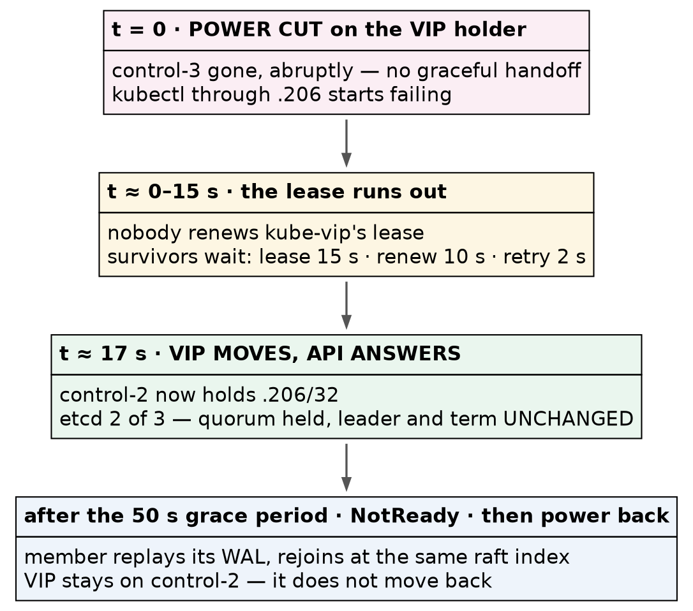

# Kubernetes (CKA) · Chapter 4 — Proving It: Failover, a Baseline, and a Rollback You Can Trust

> **Series:** Home-Lab Education · Phase 18 (Kubernetes HA + CKA)
> **Built and verified:** September 17, 2026 on VMs 201–205 (`192.168.1.201–205`)
> **Versions at time of writing:** Kubernetes v1.35.8 · kube-vip v1.2.3 · Calico v3.32.2 · etcd 3.6.6
> · Proxmox VE 9 · busybox 1.38.0
> **Read this after:** Chapter 3 (the network and the joins) · **before:** the CKA exercise chapters

---

## What this chapter covers

Chapter 3 ended with five nodes `Ready`. [That is a claim about the cluster]{custom-style="Key"}, and this chapter
[tests it by trying to break it]{custom-style="Key"} — then takes the snapshot that every later exercise
rolls back to, and proves the rollback works.

The order matters, and it is the first thing in this chapter that is easy to get wrong. The failover test
cuts the power to a control plane, which is an unclean shutdown of an etcd member. So
[the baseline snapshot comes before the destructive test, not after it]{custom-style="Key"}. If the
failover works, nothing is lost; if it doesn't, you roll back two minutes instead of rebuilding a cluster.

---

## What "highly available" means here — precisely

Three control planes do **not** share the load. kube-vip in ARP mode gives the VIP to
[exactly one control plane at a time]{custom-style="Key"}, so every request through `192.168.1.206`
reaches one API server. [When that node dies, another claims the address]{custom-style="Key"}. **This is failover, not load
balancing.**

And "the leader" is not one thing. [A cluster like this runs several independent elections]{custom-style="Key"}:

- **etcd** elects a raft leader among its three members.
- **kube-vip** elects which node holds the VIP.
- **kube-controller-manager** and **kube-scheduler** each elect one active instance.

⭐ **They do not have to agree on a node, and after a restart they often won't.** Ours didn't — see
step 6. [Assuming the VIP holder is also the etcd leader]{custom-style="Key"} is a natural mistake, and it
makes a failover test ambiguous.

---

## Part A — sign off the healthy cluster

Chapter 3 proved scheduling, addressing and Service routing from a node. Two things were still unproven,
because the `pause` image has no shell: [traffic between pods on different nodes, and DNS]{custom-style="Key"}.

### 1. Prove pod-to-pod traffic across nodes

Use a small image with a shell and basic tools. ⚠️ **Pin a tag you have verified exists** rather than
one remembered from a tutorial — we read `busybox:1.38.0` from the registry's own tag list before using
it. [A guessed tag fails at pull time, in the middle of a test]{custom-style="Key"}.

```bash
kubectl run netcheck-a --image=busybox:1.38.0 \
  --overrides='{"spec":{"nodeName":"vm-k8s-cka-worker-1"}}' -- sleep 3600
kubectl run netcheck-b --image=busybox:1.38.0 \
  --overrides='{"spec":{"nodeName":"vm-k8s-cka-worker-2"}}' -- sleep 3600
kubectl wait --for=condition=Ready pod/netcheck-a pod/netcheck-b --timeout=120s
kubectl get pods netcheck-a netcheck-b -o wide
```

Pinning each pod to a named node guarantees [the test crosses a node boundary]{custom-style="Key"}.
Left to the scheduler, both could land on one worker and prove nothing about the network between them.

```bash
kubectl exec netcheck-a -- ping -c3 -W2 <netcheck-b IP>
```

**Confirm:** three replies. Ours: `ttl=62`, round trip about 0.35 ms.

⭐ **Read the TTL — it is better evidence than the reply.** A packet starts at 64 and loses one per
routing hop, so `62` means [it was routed through both nodes, not wrapped in a tunnel]{custom-style="Key"}.
That is the `vxlanMode: CrossSubnet` setting from chapter 3 doing exactly what it claims on a single
subnet — confirmed by a field nobody usually reads.

### 2. Prove DNS, both inside the cluster and out of it

```bash
kubectl exec netcheck-a -- nslookup kubernetes.default.svc.cluster.local
kubectl exec netcheck-a -- nslookup kubernetes.io
```

**Confirm:** the server is `10.96.0.10` (CoreDNS's ClusterIP), `kubernetes.default.svc.cluster.local`
resolves to `10.96.0.1`, and the external name resolves too — ours returned two addresses, which
[will differ on your run because they belong to someone else's CDN]{custom-style="Key"}.

⭐ **The internal lookup proves CoreDNS answers; [the external one proves it forwards]{custom-style="Key"}.** They fail
separately and for different reasons.

### 3. Prove Service routing from inside a pod

```bash
kubectl exec netcheck-a -- wget -qO- --no-check-certificate --timeout=5 https://10.96.0.1/livez
```

**Confirm:** `ok`. Chapter 3 ran the same check from a node. ⚠️ **From inside a pod the packet takes a
different path** — [out through the pod's interface and the CNI]{custom-style="Key"} before kube-proxy's rules rewrite it —
so [both checks are worth running, because they can fail independently]{custom-style="Key"}.

Then clean up:

```bash
kubectl delete pod netcheck-a netcheck-b
```

---

## Part B — take the baseline before breaking anything

### 4. Shut down gracefully, and refuse to snapshot until all five have stopped

The snapshot is taken with the machines **off**. An offline snapshot is
[consistent by construction]{custom-style="Key"} rather than by freezing a running filesystem, and etcd
— a write-ahead-log database — [is exactly what you want captured at rest]{custom-style="Key"}.

On the Proxmox host, workers first, then control planes:

```bash
for id in 204 205 201 202 203; do qm shutdown $id --timeout 120; done
for id in 201 202 203 204 205; do qm status $id; done      # all must read: status: stopped
```

⭐ **Workers first, because they run work and the control planes decide where work goes.** Stopping the
workers first means the control plane is not processing evictions while it is itself shutting down.

⛔ **Do not snapshot until every one reads `stopped`.** [`qm shutdown` returning is not the same as the]{custom-style="Key"}
guest having stopped, and a snapshot of a machine still shutting down [defeats the point of doing it
offline]{custom-style="Key"}. If one times out, stop and decide — do not fall back to `qm stop` on an etcd
member without meaning to.

### 5. Snapshot all five with one name, and confirm at two layers

```bash
for id in 201 202 203 204 205; do qm snapshot $id c02-virgin-cluster --description "..."; done
for id in 201 202 203 204 205; do qm listsnapshot $id; done
zfs list -t snapshot -o name,creation | grep -E 'vm-20[1-5]-disk'
```

⭐ **All five together, under the same name, or not at all.** [Rolling one node of an etcd cluster back to]{custom-style="Key"}
a different point from the others creates a debugging session nobody asked for.

⭐ **Check the storage, not just the bookkeeping.** [`qm listsnapshot` is Proxmox's own record]{custom-style="Key"}; the ZFS
snapshot underneath is the independent witness. ⚠️ **This check exists because the previous stage's
snapshot was recorded as taken and had not been** — [a record that a snapshot exists is not a
snapshot]{custom-style="Key"}.

### 6. Power on — and treat the first full cold start as a test

```bash
for id in 201 202 203; do qm start $id; sleep 5; done
for id in 204 205; do qm start $id; done
```

Control planes first, [so the API is back before the workers]{custom-style="Key"} try to report to it. Give it about 90
seconds, then check:

```bash
kubectl get nodes
kubectl -n kube-system exec etcd-vm-k8s-cka-control-1 -- etcdctl \
  --cacert /etc/kubernetes/pki/etcd/ca.crt --cert /etc/kubernetes/pki/etcd/server.crt \
  --key /etc/kubernetes/pki/etcd/server.key endpoint status --cluster -w table
```

**What we saw, and what it proves:**

| | Before the shutdown | After the cold start |
|---|---|---|
| etcd leader | control-1 | **control-2** |
| Raft term | 2 | **5** |
| Raft index | 1–2 apart | **identical on all three** |
| VIP holder | control-1 | **control-3** |

This was the cluster's first complete power cycle, and it passed. [All three etcd members replayed their
logs to the same point]{custom-style="Key"}, and [the term rising from 2 to 5 records the elections held]{custom-style="Key"}
as members came back. Most usefully, **the etcd leader and the VIP landed on different nodes** — the
independent-elections point from the start of this chapter, demonstrated. ⚠️ **Where the leader and the
VIP land after a restart carries no meaning**; expect them to move.

### 7. Record certificate expiry now

```bash
sudo kubeadm certs check-expiration
```

Ours: all ten control-plane certificates expire **Sep 17, 2027**.

🚨 **The kubelet's client certificates are not in that list.** They live in `/var/lib/kubelet/pki`,
[rotate automatically, and on a much shorter cycle]{custom-style="Key"}. That matters for a lab you roll back for months:
restore a snapshot long after it was taken and the control-plane certificates may still be valid while
[the kubelet's have expired inside the frozen image]{custom-style="Key"}. It presents as TLS or
authentication errors, not as "this snapshot is old". Recording the dates on day one is what makes it
recognisable later.

---

## Part C — break it

### 8. Choose the target, and make sure you know who leads

Find the VIP holder and the etcd leader:

```bash
for n in 201 202 203; do ssh 192.168.1.$n "ip -br addr show eth0 | grep -q 192.168.1.206 && hostname"; done
kubectl -n kube-system exec etcd-vm-k8s-cka-control-1 -- etcdctl ... endpoint status --cluster -w table
```

Ours: the VIP on **control-3**, etcd led by **control-2**. So control-3 is the target —
[killing the VIP holder while leaving the etcd leader alive tests one thing]{custom-style="Key"}: VIP
failover, without a raft election mixed in.

⚠️ **Read the `IS LEADER` column yourself before relying on it.** The script used in this build to find
the leader printed an empty value, and the next line of the same script stated the target was not the
leader. It happened to be true. [A check that prints nothing has not answered the
question]{custom-style="Key"} — had control-3 been the leader, the test would have measured two things
and reported one.

### 9. Write the predictions down before acting

| # | Prediction | Basis |
|---|---|---|
| 1 | `kubectl` through the VIP fails, then recovers on its own | failover exists |
| 2 | Recovery takes 15–20 s | kube-vip manifest: lease 15 s, renew 10 s, retry 2 s |
| 3 | The VIP reappears on a surviving control plane | leader election |
| 4 | etcd keeps quorum at 2 of 3, and the leader does **not** change | a follower is being killed |
| 5 | The dead node reads `NotReady` after the grace period | controller-manager's `--node-monitor-grace-period` |

⭐ **Written first so the result can be scored rather than explained afterwards.** Prediction 4 matters
most: [killing a follower should not trigger an election]{custom-style="Key"}. If it did, something about
who held what was wrong.

### 10. Cut the power, and time the outage

[Use an abrupt stop, not a shutdown]{custom-style="Key"}. A graceful shutdown lets kube-vip hand its lease over cleanly, which
[proves much less than a real failure does]{custom-style="Key"}.

```bash
qm stop 203                     # on the Proxmox host — the power cut
```

From another control plane, poll the API **through the VIP** until it answers:

```bash
while ! timeout 3 kubectl get --raw /livez >/dev/null 2>&1; do sleep 2; done
```

**Measured: the API answered again after about 17 seconds**, inside the predicted 15–20.

### 11. Read the aftermath

```bash
ip -br addr show eth0                     # on control-1 and control-2 — who has .206 now?
kubectl -n kube-system exec etcd-vm-k8s-cka-control-1 -- etcdctl ... endpoint status --cluster -w table
kubectl get nodes
```

**What we saw:**



> The VIP moved to **control-2**. `etcdctl` printed a `context deadline exceeded` error for
> control-3's endpoint — [expected, and not a fault of the tool]{custom-style="Key"} — and then the table
> for the two members still answering. **control-2 was still leader and the term was still 5: no
> election.**

`kubectl get nodes` showed control-3 as `NotReady` when checked, about a minute after the cut.

⚠️ **Prediction 5 was right for the wrong reason, and the reason is the lesson.** We predicted
`NotReady` "after about 40 seconds". The v1.35.8 binary's own help says the default grace period is
**50 seconds** — [40 is an older default]{custom-style="Key"}. The prediction still looked correct only because
[the check ran after both numbers had passed]{custom-style="Key"}. ⭐ **A measurement too coarse to
distinguish the prediction from its alternative cannot confirm it.** [To actually test it, poll the node]{custom-style="Key"}
status once a second from the moment of the cut.

```bash
kubectl -n kube-system exec kube-controller-manager-vm-k8s-cka-control-1 -- \
  kube-controller-manager --help 2>&1 | grep -A1 node-monitor-grace-period      # ask, don't recite
```

### 12. Bring it back, and check that it rejoined cleanly

```bash
qm start 203
```

After about a minute:

**Confirm:** five nodes `Ready`, etcd back to three members with **identical raft indices** (ours:
`18843` on all three), and no pod outside `Running` or `Completed`.

⭐ **The matching index is the real test of an unclean shutdown.** The member lost power mid-operation,
[replayed its write-ahead log on restart, and caught up completely]{custom-style="Key"}. The VIP stayed
on control-2 — [it does not move back when the original holder returns]{custom-style="Key"}, and it doesn't need to.

---

## Part D — prove the rollback works

A snapshot that has never been restored is a hope. Every later exercise depends on this one.

### 13. Plant markers first

⭐ **A successful restore and an ordinary reboot print exactly the same thing** — five nodes `Ready`,
three etcd members, the VIP up. Test only that the cluster comes back and
[you cannot tell whether anything was restored]{custom-style="Key"}. So leave something behind that must
disappear:

```bash
STAMP="rollback-test-$(date +%H%M%S)"
kubectl create configmap rollback-marker --from-literal=stamp="$STAMP"
for n in 201 202 203 204 205; do
  ssh 192.168.1.$n "echo $STAMP | sudo tee /etc/kubernetes/ROLLBACK_MARKER >/dev/null"
done
```

Two markers, because they test different layers. The file proves the **disk** was reverted; the
ConfigMap proves **etcd's contents** went back with it. A restore that recovered the filesystem but left
the database ahead would be [the subtle failure, and only the ConfigMap catches it]{custom-style="Key"}.

### 14. Roll back, and time it

Shut down as in step 4, then:

```bash
for id in 201 202 203 204 205; do qm rollback $id c02-virgin-cluster; done
```

Power on as in step 6.

**Measured:** the rollback of five VMs took **6 seconds**, and all five were reachable over SSH
**49 seconds** after that. [The graceful shutdown before it was not timed]{custom-style="Key"}.

⭐ **That cost is the number that decides how you use this lab.** A restore that costs about two
minutes means [the cluster can be broken freely]{custom-style="Key"}; one that cost fifteen would make
you start avoiding the interesting exercises.

### 15. The markers must be gone

```bash
for n in 201 202 203 204 205; do
  ssh 192.168.1.$n 'sudo test -f /etc/kubernetes/ROLLBACK_MARKER && echo STILL-PRESENT || echo GONE'
done
kubectl get configmap rollback-marker        # must fail: NotFound
```

**Confirm:** `GONE` five times, and `Error from server (NotFound)`. Ours: both.

⛔ **Check the file with `sudo`.** [An unprivileged `test` on a root-owned path can fail for lack of]{custom-style="Key"}
permission and read as "gone".

### 16. Write down what healthy looks like

A later "something is wrong" is only meaningful against a recorded normal:

| Check | Healthy on this cluster |
|---|---|
| `kubectl get nodes` | 5 `Ready`, `v1.35.8`; workers `<none>` |
| etcd `endpoint status --cluster` | 3 members, one leader, indices equal or 1–2 apart |
| VIP | `192.168.1.206/32` on exactly one control plane |
| `kubectl get tigerastatus` | `apiserver`, `calico`, `ippools`, `tiers` all `True`; no `goldmane`/`whisker` |
| IPPool | `10.244.0.0/16`, `blockSize: 26`, `ipipMode: Never`, `vxlanMode: CrossSubnet` |
| Pods | 43 system pods, none outside `Running`/`Completed` |
| Cross-node ping | succeeds, `ttl=62` |
| Control-plane certs | expire Sep 17, 2027 |

The two lines worth memorising: [exactly one VIP holder, and etcd indices that
agree]{custom-style="Key"}. Two VIP holders means duplicate addresses on your network; indices thousands
apart means a member is falling behind.

---

## Where this lab differs from production

> **Lab vs PROD — VM snapshots as the cluster's backup.** *In the lab:* the baseline is a set of Proxmox
> snapshots taken with all five machines powered off, and "restore" means rolling every VM back.
> *Why it's acceptable here:* the cluster exists to be broken and restored, and two minutes of downtime
> costs nothing. *In production:* etcd is backed up from a **live** member with
> `etcdctl snapshot save` and restored with `etcdctl snapshot restore` — [no outage to take it]{custom-style="Key"}, and no
> rolling back whole machines *(standard practice; that drill comes in the exam chapters)*. *If you
> carry the habit:* [backups that need the control plane switched off stop getting
> taken]{custom-style="Key"}, and a whole-VM rollback also rewinds every certificate, log and OS change on
> the machine.

**Honest limitations of this build.** All three etcd members are virtual machines on one physical host,
so this chapter demonstrates the loss of a *member*, [never the loss of a host]{custom-style="Key"}. We
killed a follower, deliberately; **losing the etcd leader** — [which forces a raft election]{custom-style="Key"} — is not
tested here and belongs in the exercise chapters. The full rollback cycle including shutdown was not timed
precisely. And the `NotReady` timing was observed too coarsely to confirm the grace period, as step 11
explains.

---

## Commands to know by heart

| Question | Command |
|---|---|
| Who holds the VIP? | `ip -br addr show eth0` on each control plane |
| Who leads etcd, and do the members agree? | `etcdctl ... endpoint status --cluster -w table` |
| Is the API up *through the VIP*? | `kubectl get --raw /livez` |
| Can pods on different nodes reach each other? | pin two pods with `nodeName`, then `kubectl exec ... ping` |
| Does CoreDNS answer, and forward? | `nslookup kubernetes.default.svc.cluster.local` and an external name |
| When do certificates expire? | `sudo kubeadm certs check-expiration` (control plane only) |
| What is the node-failure grace period, really? | `kube-controller-manager --help \| grep -A1 node-monitor-grace-period` |
| Does a snapshot exist? | `qm listsnapshot <id>` **and** `zfs list -t snapshot` |

---

## Glossary

**failover** — moving a service to a surviving node when its current one fails. [Not the same as load
balancing]{custom-style="Key"}, where every node serves at once.

**raft term** — a counter etcd increments at each leader election. A term that does not change across a
failure means [no election happened]{custom-style="Key"}.

**raft index** — [the position in etcd's replicated log]{custom-style="Key"}. Members that agree have the same index.

**write-ahead log (WAL)** — [the log etcd writes before applying a change]{custom-style="Key"}. It is what a member replays to
recover after losing power.

**node-monitor grace period** — how long the controller-manager waits without hearing from a node before
marking it `NotReady`. **50 seconds** by default in v1.35.

**offline snapshot** — a snapshot of a powered-off machine, [consistent on disk by construction]{custom-style="Key"}.

**marker** — something planted before a restore that must be gone after it. [Without one, a restore
cannot be told apart from a reboot]{custom-style="Key"}.

---

## Check yourself

Answer these out loud. Section references, not answers.

1. Why is the baseline snapshot taken *before* the failover test? (*What this chapter covers*)
2. Three control planes are running. How many API servers is your `kubectl` actually talking to, and
   why? (*What "highly available" means here*)
3. A ping between pods shows `ttl=62`. What does that tell you about the network? (§1)
4. The internal DNS lookup works and the external one fails. Where do you look? (§2)
5. After a cold start the VIP is on control-3 and the etcd leader is control-2. Is anything wrong? (§6)
6. Why test the failover by killing a *follower* first? (§8)
7. You predicted `NotReady` after 40 s and saw it after a minute. Was the prediction confirmed? (§11)
8. What single number shows that a member which lost power recovered completely? (§12)
9. Why plant two markers, and what does each one prove? (§13)
10. You restore this snapshot six months from now and get TLS errors. What do you suspect first? (§7)
