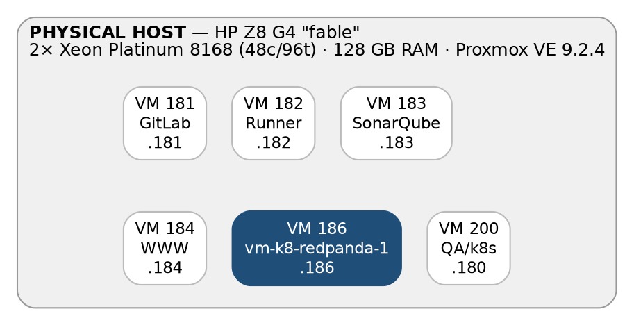
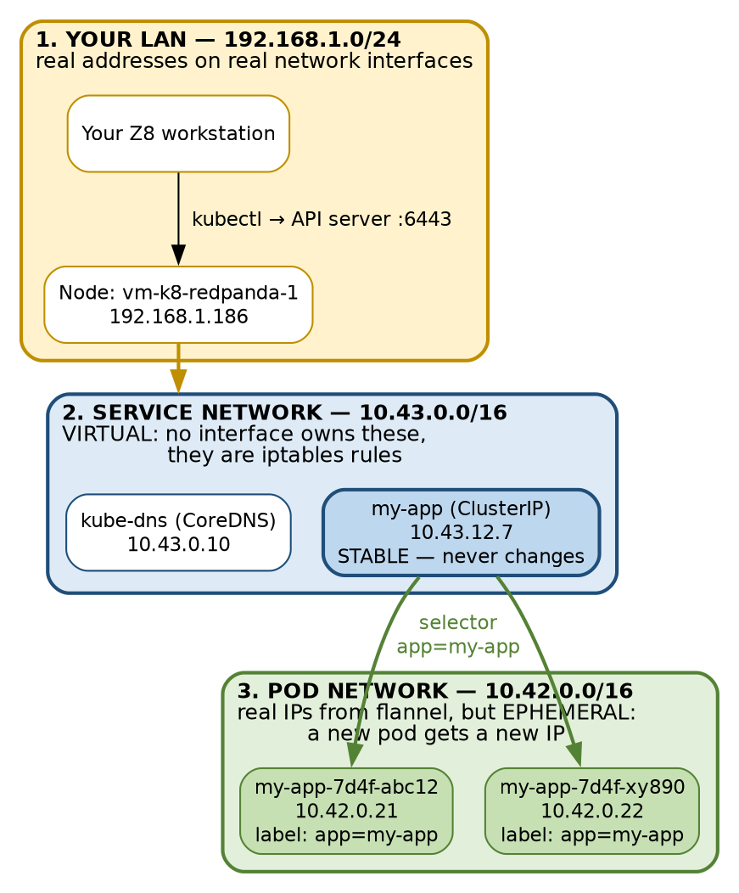

# Kubernetes + Redpanda · Chapter 1 — Kubernetes, and the k3s Cluster We Just Built

> **Series:** Home-Lab Education · Phase 14 (Kubernetes + Redpanda)
> **Built and verified:** July 27, 2026 on VM 186 `vm-k8-redpanda-1` (192.168.1.186)
> **Versions at time of writing:** k3s v1.36.2+k3s1 · Kubernetes v1.36 · containerd 2.3.2 · Ubuntu 24.04.4 LTS
> **Read this before:** Chapter 2 (the object model), Chapter 3 (Redpanda)

---

## What this chapter covers

We installed a Kubernetes cluster with a single command. This chapter explains what that command
actually did, what is now running on the machine, and — most importantly — *why each piece exists*.

By the end you should be able to sketch the diagrams in this chapter from memory and explain them
out loud. That is the real test, not whether the pods are running.

---

## 1. The big picture — where Kubernetes sits

Before anything else, get the layering straight. People often confuse Kubernetes with a hypervisor
or with Docker. It is neither.



**Inside VM 186 — the layers, top is what you deploy**

| Layer | What it is |
|---|---|
| **Your workloads (Pods)** | Redpanda brokers · OpenSearch · your Python producer/consumer<br>Nothing here yet — this is what Parts 4–6 will add. |
| **k3s v1.36.2** | Kubernetes itself — API server, scheduler, controllers, kubelet.<br>**One** binary, one systemd service; see §4 for what it actually costs in RAM. |
| **containerd 2.3.2** | The container runtime that actually starts containers.<br>**Not Docker** — Kubernetes dropped the Docker shim in v1.24. |
| **Ubuntu 24.04 LTS** | Guest OS · kernel 6.8 · swap **off** (Kubernetes requires it).<br>Docker is also installed here, but only for *building* images. |
| **Virtual hardware** | 8 vCPU · 16 GB RAM · 300 GB disk on ZFS pool `vm-ephemeral`.<br>Cloned from template 9000 in ~30 seconds.<br>*Built as 16 vCPU / 32 GB; right-sized in half once measured — see §4.* |

Read that from the bottom up:

Your **HP Z8** is the physical machine. **Proxmox** is the hypervisor — it carves the physical
machine into virtual machines. **VM 186** is one of those virtual machines, with 8 virtual CPUs
and 16 GB of RAM. Inside it runs **Ubuntu**, an ordinary Linux install. **k3s** runs on top of
Ubuntu as a normal system service. And your eventual workloads — Redpanda, OpenSearch, your Python
app — run as **containers**, managed by k3s.

[So Kubernetes is not virtualising anything. Proxmox already did that. Kubernetes sits *inside* one
virtual machine and manages *containers* within it.]{custom-style="Key"}

> **The distinction to have ready:** a hypervisor virtualises hardware and runs whole operating
> systems. Kubernetes orchestrates containers, which share the host's kernel. Different layer,
> different job.

---

## 2. What is Kubernetes actually for?

Here is the single idea that everything else hangs from:

> **You declare the state you want. Kubernetes continuously works to make reality match it.**

You do not say "start a container." You say "I want three copies of this container running, each
with 2 GB of memory, reachable at this name." Kubernetes then takes responsibility for making that
true — and for *keeping* it true. If a container crashes, it starts another. If a node dies, it
reschedules the work elsewhere.

[That is called a **control loop** or **reconciliation loop**, and it runs forever. It is the reason
you will see a pod you deleted come back]{custom-style="Key"}: you never told Kubernetes you wanted fewer copies, you
just destroyed one, and the loop faithfully repaired the damage.

Everything in the rest of this document is machinery in service of that one idea.

**Why a financial institution cares:** market-data infrastructure cannot go down while someone SSHes in to
restart a process. Self-healing and declarative deployment are the point.

---

## 2a. The vocabulary, in one table

Kubernetes vocabulary arrives all at once and every word sounds like every other word. Here is the
whole object model on one page, in the order the pieces stack up.

| Object | What it is | What it does for you |
|---|---|---|
| **Cluster** | The whole installation — one control plane and the nodes it manages. | The boundary of everything below. Every object you create lives in exactly one cluster. |
| **Node** | A machine, physical or virtual, that runs workloads. | Supplies finite CPU, memory and disk. Many pods run on one node, but only as many as it can fit — when a node has no room, new pods sit in **`Pending`** until one does. |
| **Pod** | The smallest thing Kubernetes will schedule. One or more containers that share a network namespace and can share volumes. | Gives its containers **one IP address, shared storage, and a shared fate** — they are placed together and destroyed together. Most pods hold exactly one container; multi-container pods are the sidecar pattern and are the exception. |
| **Container** | One running process, from an image. | Does the actual work — your application, a sidecar, a helper. You never schedule a container on its own; you schedule the pod that holds it. |
| **Deployment** | A declaration of desired state: this pod template, this many replicas. | Lets you say **"I want three of these"** instead of starting anything. A controller then makes it true and *keeps* it true, indefinitely, including after you are asleep. |
| **Label** | An arbitrary key/value pair attached to an object. | The glue for everything else. [**Nothing in Kubernetes holds a list of pods.**]{custom-style="Key"} Objects find each other by asking "whichever pods carry `app=web`, right now" — so membership is recomputed continuously as pods come and go. |
| **Selector** | A query over labels. | What a Deployment uses to find its pods and a Service uses to find its endpoints. The reason a replaced pod is picked up automatically: it carries the same label, so it matches the same selector. |
| **Service** | A stable name and virtual IP in front of a changing set of pods. | Pods are replaced constantly and every replacement gets a **new IP**. Callers address the Service name, which never changes, and are routed to whichever pods are currently healthy. |
| **Control plane** | The API server, scheduler, controller-manager and datastore. | Runs the reconciliation loop forever: compare actual state to declared state, fix the difference. Deciding *which node* a new pod goes to is the **scheduler**; noticing a pod is missing and ordering a replacement is the **controller-manager** (both in §4). |

In one sentence: [**containers run inside pods, pods are scheduled onto nodes, Deployments declare
how many pods should exist, labels are how everything finds everything else, and the control plane
never stops checking.**]{custom-style="Key"}

### Two kinds of death

Two events look nearly identical in `kubectl get pods` and are debugged completely differently. Get
this one distinction wrong and you will spend an afternoon looking in the wrong place, so it comes
this early on purpose.

> **A container dies** → it is restarted **inside the same pod**. Same pod name, same UID, same IP.
> Only the **RESTARTS** counter climbs. Your application is crashing; the pod is fine.
>
> **A pod dies** (deleted, evicted, or its node is lost) → an **entirely new pod** is created. New
> name, new UID, new IP, RESTARTS back to 0. Nothing is carried over, and nothing is moved.

**A container dies — the pod survives.** A container inside the pod crashes and the kubelet restarts
it in place. Verified on this cluster with a container rigged to exit every twenty seconds:

```
demo2-8d894f964-4vv4m   uid 2125afc0-...   10.42.0.15   RESTARTS 0
demo2-8d894f964-4vv4m   uid 2125afc0-...   10.42.0.15   RESTARTS 1
demo2-8d894f964-4vv4m   uid 2125afc0-...   10.42.0.15   RESTARTS 2
```

Same pod name, same UID, same IP throughout — only `RESTARTS` climbs. The container ID changed each
cycle, so it genuinely was a new container every time. **The pod never died.**

**A pod dies — a replacement is created.** The pod is deleted, evicted, or the node it was on is
lost. Nothing is preserved:

```
demo-7c6d4f4799-m5hvt   uid 1fa44916-...   10.42.0.13    ← before
demo-7c6d4f4799-4gsfn   uid 9bf0944b-...   10.42.0.14    ← after
```

New name, new UID, new IP, restart counter back to zero. [**Pods are never relocated, restored, or
resumed. They are replaced.**]{custom-style="Key"}

**Why this matters in practice.** [A climbing `RESTARTS` count means your *application* is crashing
while the pod is perfectly healthy]{custom-style="Key"} — investigate with `kubectl logs <pod> --previous`, which shows
the output of the container that died. [A *changing pod name* means something replaced the pod
entirely: an eviction, node pressure, or a rollout]{custom-style="Key"} — investigate with `kubectl describe` and
`kubectl get events`. Confusing the two costs hours.

### Five things the table glosses over

A one-page summary buys clarity by leaving things out. These are the omissions that most often turn
into a confidently wrong answer under pressure, and each is picked up properly later in the chapter.

- **A pod is never moved.** "Kubernetes reschedules the work elsewhere" is how everyone describes a
  node failure, and it is misleading. The pod is not relocated, migrated or resumed — it is
  destroyed, and a *different* pod with a new name, new UID and new IP is created, possibly on
  another node. [There is no live migration anywhere in Kubernetes.]{custom-style="Key"}
- **A restarted container is not a resumed one.** The image is run again from scratch, with no
  memory of the previous run. [Anything written to the container's own filesystem is gone; only a
  mounted volume survives.]{custom-style="Key"} A container that "restarted successfully" may have lost state.
- **Containers in a pod share less than you would think.** They share a network namespace — so they
  reach each other on `localhost` — and can share mounted volumes. They do **not** share a
  filesystem or a process namespace by default. Each has its own root filesystem and its own PID 1.
- **The Service does not route anything.** It is a record, not a proxy. The control plane keeps its
  list of healthy pod IPs accurate, and the actual redirection happens in kernel packet-filtering
  rules on each node. [Nothing is listening on a Service IP, which is why you cannot ping one]{custom-style="Key"} (§5).
- **A volume can be pinned to one specific node.** With `local-path`, the default storage in this
  cluster, a volume is a directory on the node where it was first created. Lose that node and the
  replacement pod is not scheduled elsewhere — it stays `Pending` indefinitely, because the only
  node it is permitted to run on is gone (§6).

---

## 3. What is k3s, and why did we use it?

[**k3s is Kubernetes.** Not a clone, not a subset — it is a certified, fully conformant distribution.]{custom-style="Key"}
Same API, same `kubectl`, same YAML files, same Helm charts. What differs is *packaging*.

Standard Kubernetes is roughly five separate server components plus an etcd cluster, and setting it
up properly is a day's work. k3s compiles those components into a **single 81 MB binary**, bundles
sensible defaults, and starts in about ten seconds.

For learning under a deadline that trade is obviously right: you spend your week on concepts rather
than on cluster bootstrapping. But **be ready to name what you gave up** — see section 8.

---

## 3a. The install command, piece by piece

This one line is the entire installation:

```bash
curl -sfL https://get.k3s.io | INSTALL_K3S_EXEC="--write-kubeconfig-mode 644" sh -
```

Every fragment earns its place:

| Fragment | What it does |
|---|---|
| `curl` | Fetch a URL over HTTP. |
| `-s` | **Silent.** Suppress the progress meter, which would otherwise be piped into the shell as garbage. |
| `-f` | **Fail on HTTP errors.** Without this, a 404 or a captive-portal page would be delivered as a *successful* download and then **executed as a shell script**. This flag is a safety measure, not cosmetics. |
| `-L` | **Follow redirects.** `get.k3s.io` redirects to the real script; without `-L` you'd download a short redirect notice and run that instead. |
| `https://get.k3s.io` | The official installer script — an ordinary shell script you can read in a browser. |
| <code>&#124;</code> | Pipe the downloaded text into the next command as its standard input. |
| `INSTALL_K3S_EXEC="..."` | An **environment variable** set for the `sh` process. The installer script reads it and appends the value to the k3s command line it writes into the systemd unit. |
| `--write-kubeconfig-mode 644` | The actual k3s option being passed through. See below. |
| `sh -` | Run a shell. The trailing `-` means **"read the program from standard input"** — which is where the pipe just put the script. |

### The three parts worth dwelling on

**Why `-f` matters.** The pattern `curl … | sh` executes whatever comes back from the network with
whatever privileges you have. [If the download fails and you did not use `-f`, curl helpfully writes
the error page to stdout and the shell dutifully tries to execute an HTML document.]{custom-style="Key"} It usually just
errors out — but it is exactly the class of accident that `-f` exists to prevent.

**How the environment variable reaches k3s.** `INSTALL_K3S_EXEC` is not a k3s flag; it is an
instruction *to the installer script*. You can verify precisely where it ended up:

```bash
grep -A6 ExecStart /etc/systemd/system/k3s.service
```

```
ExecStart=/usr/local/bin/k3s server '--write-kubeconfig-mode' '644'
```

[So the variable was consumed at install time and **baked into the systemd unit**.]{custom-style="Key"} To change it
later, edit that unit and `systemctl daemon-reload`, or re-run the installer.

**What `--write-kubeconfig-mode 644` actually buys.** k3s writes its kubeconfig to
`/etc/rancher/k3s/k3s.yaml`. By default that file is mode `600`, readable only by root, so every
`kubectl` command would need `sudo`. Mode `644` makes it world-readable so a normal user can use it.

That convenience has a real cost, and you should be able to say so: [**that file contains an admin
client certificate.** Anyone who can read it has complete control of the cluster.]{custom-style="Key"} On a single-user
sandbox that is an acceptable trade; on a shared or production machine it would not be. The stricter
alternative is to leave it at `600` and copy it to your home directory with `sudo`, which is close to
what we did anyway.

> **The professional caution to voice in an interview:** piping a remote script straight into a shell
> means trusting that host completely, at root. The careful version is
> `curl -sfL https://get.k3s.io -o install.sh`, read it, *then* run it. For a throwaway lab this
> is a reasonable risk; for a production build host it belongs in a pinned, checksummed artifact.

---

## 3b. What that one line left on the machine

```bash
curl -sfL https://get.k3s.io | INSTALL_K3S_EXEC="--write-kubeconfig-mode 644" sh -
```

That one line put the following on the machine (verified on VM 186, 27 July 2026):

| Location | What landed there |
|---|---|
| **`/usr/local/bin/`**<br>the programs | `k3s` — 81 MB. The entire control plane, kubelet and containerd.<br>`kubectl -> k3s` — a **symlink**. Same binary, different behaviour by name.<br>`crictl -> k3s` — also a symlink; low-level container debugging.<br>`k3s-killall.sh` — stops everything, including orphaned containers.<br>`k3s-uninstall.sh` — removes the cluster completely. Your undo button. |
| **`/etc/systemd/system/`**<br>how it starts | `k3s.service` — enabled, so it survives reboot. Its `ExecStart` is where your flag ended up:<br>`ExecStart=/usr/local/bin/k3s server '--write-kubeconfig-mode' '644'`<br>It also `modprobe`s `br_netfilter` and `overlay` first — kernel modules that pod networking and container filesystems depend on. |
| **`/etc/rancher/k3s/`**<br>the credentials | `k3s.yaml` — the kubeconfig. Mode **644** because of your flag; the default would have been 600 (root only).<br>**It contains an admin client certificate.** Whoever can read this file has full control of the cluster — which is why 644 is a sandbox convenience, not something to repeat in production. |
| **`/var/lib/rancher/k3s/`**<br>the state — 1.4 GB | `server/db/state.db` — the SQLite datastore. **THE cluster.** Every object you create lives in this one file.<br>`agent/` — containerd's data: pulled images, running containers.<br>Back up `state.db` and you have backed up the cluster's configuration. |
| **`~/.kube/config`**<br>added by us, not the installer | Our copy of `k3s.yaml`, owned by `agamache`, mode 600. `kubectl` reads this path automatically, so no environment variable is needed.<br>**It points at `https://127.0.0.1:6443`** — so it only works *on* the VM. To run `kubectl` from the Z8, copy it and change that to `192.168.1.186`. |

Two details in there are worth calling out.

**`kubectl` is a symlink to `k3s`.** So is `crictl`. It is one binary that changes behaviour based
on the name it was invoked under — a classic Unix trick, and the reason you did not have to install
`kubectl` separately.

**`k3s-uninstall.sh` is your undo button.** Running it removes the cluster, the binary, the data
directory and the systemd unit. Combined with the Proxmox snapshot `s01-base-clean`, you have two
independent ways to get back to a clean machine, which is exactly the safety net that makes it
comfortable to break things deliberately.

---

## 3c. Making `kubectl` work without sudo

The installer sets up the cluster but not *your* access to it. That was three more commands:

```bash
mkdir -p ~/.kube
sudo cp /etc/rancher/k3s/k3s.yaml ~/.kube/config
sudo chown $(id -u):$(id -g) ~/.kube/config
chmod 600 ~/.kube/config
```

| Command | Why |
|---|---|
| `mkdir -p ~/.kube` | `kubectl` looks in `~/.kube/config` by default. `-p` means "create parents, and don't complain if it already exists." |
| `sudo cp …` | The source is owned by root, so copying needs `sudo`. Now you have your own copy, independent of the system file. |
| `sudo chown $(id -u):$(id -g)` | The copy arrived owned by **root**, so you still could not read it. This hands it to you. |
| `chmod 600` | Only you can read it. It holds admin credentials — treat it like a private key. |

**A small correctness note.** You will often see `sudo chown $USER ~/.kube/config` written instead.
That sets the owning *user* but leaves the *group* as root, and it breaks entirely if `$USER` happens
to be unset — which it can be in a non-interactive SSH command or a cron job. Using
`$(id -u):$(id -g)` sets both, numerically, and always works. Minor, but it is the kind of detail
that quietly costs you an hour someday.

**One limitation to know now, before it confuses you later.** That kubeconfig contains:

```
server: https://127.0.0.1:6443
```

[It points at *localhost*, so it only works **while you are on VM 186**.]{custom-style="Key"} To run `kubectl` from your Z8
workstation, copy the file over and change that address to `https://192.168.1.186:6443`.

---

## 3d. Confirming it worked

Two commands, which are also the two you will reach for constantly:

```bash
kubectl get nodes -o wide     # is the cluster's machine registered and Ready?
kubectl get pods -A           # what is actually running, in every namespace?
```

The first should show one node, `Ready`, with role `control-plane`. The second is the more
interesting one, and section 4 is devoted to explaining what it shows you.

Do not skip past `kubectl get pods -A` as noise. Everything listed there was installed on your
behalf, and being able to say why each item exists is the difference between having run an installer
and understanding a cluster.

---

## 4. What is now running on the machine

This is the diagram worth memorising.

**Part A — one process: `/usr/local/bin/k3s`**

systemd unit `k3s.service`. In real Kubernetes each of these is a separate component.

| Inside the one binary | What it does |
|---|---|
| **kube-apiserver** | The front door. Every command and every controller goes through it. The **only** part that touches the datastore. |
| **kube-scheduler** | Decides **which node** a new pod runs on. One node here, but the mechanism is identical at any scale. |
| **kube-controller-manager** | The repair loop. Compares desired state to actual and acts. **This** is what recreates a pod you delete. |
| **kubelet** | The node agent. Takes pod specs from the API server, tells containerd to start containers, reports health back. |
| **kube-proxy** | Programs iptables rules so a Service's virtual IP actually reaches a real pod. |
| **SQLite — the datastore** | `/var/lib/rancher/k3s/server/db`. All cluster state lives here. **Production uses etcd (3 or 5 members).** |
| **containerd 2.3.2** | The container runtime. Pulls images, starts and stops containers. **Not Docker.** |
| **flannel — the CNI plugin** | Gives every pod its own IP address on the `10.42.0.0/16` pod network. |
| **…plus, silently** | A cluster CA, TLS certs for every component, and service-account tokens — all generated for you at install time. |

**Part B — add-ons, running as ordinary pods**

Namespace `kube-system`. See them yourself with `kubectl get pods -A`. On first start, k3s installs
these itself.

| Add-on | Kind | What it does |
|---|---|---|
| **coredns** | Deployment 1/1 | Cluster DNS. Turns a Service *name* into its virtual IP. This is how Redpanda brokers will find each other. |
| **local-path-provisioner** | Deployment 1/1 | The default StorageClass. Creates a directory on this node when a pod asks for a volume. Redpanda's disks come from here. |
| **metrics-server** | Deployment 1/1 | Collects CPU and memory per pod. Powers `kubectl top` and would feed an autoscaler. |
| **traefik** | Deployment 1/1 | Ingress controller. Routes outside HTTP traffic to the right Service based on hostname and URL path. |
| **svclb-traefik** | DaemonSet 2/2 | "ServiceLB" — fakes a cloud load balancer so `type: LoadBalancer` works with no cloud. **DaemonSet = exactly one pod per node.** |
| **helm-install-traefik** | Job, Completed | **"Completed" means SUCCESS, not failure.** Jobs run once and exit. k3s installs its own add-ons by running Helm inside a Job. |

> **THE ONE SENTENCE TO REMEMBER**
>
> [k3s is packaging, not a different Kubernetes.]{custom-style="Key"} Same API, same kubectl, same YAML, same Helm charts. It bundles Part A into one binary and swaps etcd for SQLite. Everything you write here would deploy unchanged to EKS — you would just swap local-path storage for a real CSI driver.

The install produced **two distinct categories of components** (Parts A and B in the illustration
above), and keeping them straight is what makes `kubectl get pods -A` stop looking like noise. Some
of what k3s installed runs *inside the single k3s process*; the rest runs *as ordinary pods* you can
list, inspect, and delete.

### Part A — the control plane, inside one process

[These are not pods. You will never see them in `kubectl get pods`.]{custom-style="Key"} They are all threads inside the
single `k3s` process, managed by systemd as `k3s.service`:

- **kube-apiserver** — the front door. Every `kubectl` command, every internal controller, every
  component talks to this and nothing else. It is also the only component permitted to touch the
  datastore. That centralisation is deliberate: one place to authenticate, authorise, and validate.
- **kube-scheduler** — when a pod exists but has not been assigned to a node, the scheduler picks
  one, based on resource requests, taints, and affinity rules. On our single-node cluster the answer
  is always "this node," but the mechanism is identical on a 500-node cluster.
- **kube-controller-manager** — the reconciliation loops from section 2 live here. This is the
  component that notices a Deployment wants 3 pods but only 2 exist, and creates the third.
- **kubelet** — the agent that runs *on each node*. It receives pod specifications and instructs the
  container runtime to make them real, then reports health back.
- **kube-proxy** — maintains the iptables rules that make Service virtual IPs work (section 5).
- **SQLite** — where all cluster state is persisted, at `/var/lib/rancher/k3s/server/db`.

**How much memory is all of that?** More than the "about 512 MB" I originally wrote here, which I
had not measured. On this cluster, under load:

```
$ ps aux | grep '[k]3s server'                 -> RSS 794 MB      the server process itself
$ systemctl show k3s -p MemoryCurrent          -> 2344 MB         the whole k3s.service cgroup
$ kubectl top pods -n kube-system
coredns 73Mi · local-path-provisioner 49Mi · metrics-server 79Mi · traefik 122Mi · svclb 2Mi
```

Read those three carefully, because they measure different things and only one of them is "what
Kubernetes costs you". The **794 MB** is the k3s server process — API server, scheduler, controllers
and kubelet, all in one. The **2,344 MB** cgroup figure is much larger because `k3s.service`
supervises containerd, and therefore every container on the node, *including the three Redpanda
brokers*; quoting it as k3s overhead would be wrong by a factor of three. The add-on pods add
roughly 325 MB on top of the server process.

[So the honest figure is **around 800 MB for the control plane, and about 1.1 GB with the default
add-ons**]{custom-style="Key"} — and it grows with the number of objects the API server is tracking, so a freshly
installed cluster is lighter than this one. The reason to be careful is that the comparison being
drawn matters: k3s is still dramatically lighter than a conventional control plane with separate
etcd, and that point survives the correction. Made-up numbers do not.

#### The same lesson, applied to the VM itself (added Aug 12)

That habit of measuring rather than guessing eventually cost this VM half its hardware. It was
built with **16 vCPU and 32 GB**, sized on paper for an OpenSearch install that never happened.
After nine days of running the full cluster — three brokers, the add-ons, and the application from
chapter 6 — the node was using **3.0 GB of RAM and about 1% CPU**. It was cut to **8 vCPU / 16 GB**,
and nothing noticed: brokers healthy 3/3, no leaderless partitions, the application's ledger still
reconciling exactly.

The subtlety worth carrying into an interview is **why it could not go smaller than that**. The
pods on this node *request* 7.7 GB and 3.25 cores, mostly the three brokers reserving a whole core
and 2,560 MiB each. The scheduler places pods by comparing **requests** against what the node
advertises — it never looks at what pods are really using. So a node sized at 4 GB would have had
plenty of free memory and still refused to schedule the cluster.

[Requests are what you must provision for; usage is what you actually spend. Size the node for the
first number, and you will look wasteful — right up until the scheduler proves you weren't.]{custom-style="Key"}

> **The corollary, which is the more common failure:** requests that are set far *above* real usage
> silently shrink how much you can pack onto a node, and requests set far *below* it get you pods
> that are scheduled and then throttled or OOM-killed under load. Both are the same mistake —
> guessing instead of measuring — and only the second one pages you at 3am.

### Part B — the add-ons, running as ordinary pods

These *are* pods, in the `kube-system` namespace, and you can inspect them like anything else:

- **coredns** — cluster DNS. Absolutely central; section 5 explains why.
- **local-path-provisioner** — the default storage system. Section 6.
- **metrics-server** — collects CPU and memory per pod so `kubectl top` works.
- **traefik** — an ingress controller, for routing external HTTP traffic to Services by hostname.
- **svclb-traefik** — "ServiceLB," k3s's substitute for a cloud load balancer. Note it is a
  **DaemonSet**, meaning exactly one copy per node, automatically. Fluent Bit will use the same
  pattern later for log collection.
- **helm-install-traefik** — a **Job**, showing status `Completed`. See section 7.

---

## 5. The three networks

If you understand only one technical thing from this chapter, make it this one. It explains
Services, which are the backbone of everything you will build in later chapters.



There are three separate address ranges in play, and they behave very differently.

**Your LAN, 192.168.1.0/24.** Ordinary addresses on real network interfaces. The VM sits at
`192.168.1.186`.

**The pod network, 10.42.0.0/16.** Every pod gets its own IP here, assigned by flannel. These are
real, routable-within-the-cluster addresses — [but they are **ephemeral**. Delete a pod and its
replacement gets a different one. Nothing may ever depend on a specific pod IP.]{custom-style="Key"}

**The service network, 10.43.0.0/16.** [These addresses are **entirely virtual**. No network
interface anywhere owns `10.43.12.7`.]{custom-style="Key"} It exists only as a set of iptables rules that kube-proxy
maintains. When traffic is sent to it, the kernel rewrites the destination to one of the real pod
IPs behind it.

### How a connection actually works

1. Your code connects to a **name**: `my-app.default.svc.cluster.local`.
2. **CoreDNS** resolves that name to the Service's stable virtual IP, `10.43.12.7`.
3. **kube-proxy's iptables rules** rewrite the destination to one of the real pod IPs behind the
   Service. This is the load balancing.
4. Traffic arrives at a real container.

The Service *name* is the stable thing you build against, and it is how the Redpanda brokers, your
producer, and your consumer will all find each other in later chapters.

### The missing link: EndpointSlice

Step 3 skips something, and the detail matters. [**kube-proxy never evaluates label selectors.**]{custom-style="Key"} It
would be far too expensive to re-run a query for every packet.

Instead there is a third party. The **EndpointSlice controller** watches Services and Pods, applies
the Service's selector, and writes the resulting list of pod IPs into an **EndpointSlice** object.
kube-proxy watches *those* and programs iptables from a ready-made list. So the real chain is:

```
Service (selector app=web)
    → EndpointSlice controller evaluates the selector
        → EndpointSlice object:  10.42.0.22, 10.42.0.28, 10.42.0.29
            → kube-proxy writes iptables rules
                → the kernel DNATs your packet
```

[This is why `kubectl get endpointslices` is the correct debugging tool when a Service is
blackholing traffic. If the slice is empty, the selector matches nothing — the pods may be perfectly
healthy while the Service points at nobody.]{custom-style="Key"} A Service does not contain pods and does not know their
names; membership is simply "whichever pods currently carry that label."

### The DNAT is invisible to the client

A useful thing to have proven to yourself: the client never learns which pod served it. Asking
`curl` to report the address it connected to, six times against a three-pod Service, returns the
same answer every time:

```
$ curl -w "%{remote_ip}" http://web     10.43.83.136
                                        10.43.83.136
                                        10.43.83.136   ← the ClusterIP, never a pod IP
```

Meanwhile the pods' own access logs showed 4, 3 and 5 requests. Load balancing was working; it is
just that conntrack rewrites the replies so they appear to come from the virtual IP. The abstraction
does not leak, which is exactly what makes it safe to build on.

### It balances connections, not requests

This is the part worth carrying into an interview. [kube-proxy makes its choice **once per TCP
connection**, at DNAT time.]{custom-style="Key"} Every byte on that connection then goes to the same pod for the life of
the connection.

Six separate `curl` runs meant six connections and six independent choices. But a client that opens
*one* connection and keeps it will be pinned to *one* pod forever, no matter how many replicas you
run.

That is the default behaviour of **HTTP/2 and gRPC**, which multiplex everything over a single
long-lived connection. [A gRPC client pointed at a ClusterIP Service hammers exactly one backend
while the others idle. The fixes are a **headless Service** plus client-side load balancing, or a
service mesh doing L7 proxying.]{custom-style="Key"} For a firm moving market data over gRPC this is a live concern, not
trivia.

> **The one-liner:** pod IPs are disposable, Service names are the stable address you build against
> — and Services balance connections, not requests.

---

## 6. Storage — and an honest limitation

k3s gave us one StorageClass, and it is the default:

```
NAME                   PROVISIONER             RECLAIMPOLICY   VOLUMEBINDINGMODE      ALLOWVOLUMEEXPANSION
local-path (default)   rancher.io/local-path   Delete          WaitForFirstConsumer   false
```

Each field matters, and Redpanda will depend on all of them in Chapter 3:

- **`local-path` provisioner** — when a pod requests storage, this creates a plain directory on the
  node's disk. Simple and fast, but the data is tied to *that specific node*.
- **`WaitForFirstConsumer`** — the volume is not created until a pod has actually been scheduled.
  It has to work this way: because storage is node-local, Kubernetes must know which node before it
  can create anything.
- **`Delete`** — deleting the claim deletes the data. There is no safety net.
- **`ALLOWVOLUMEEXPANSION false`** — you cannot grow a volume later. Sizing a Redpanda broker's disk
  is a decision you live with.

### 6a. This is not Proxmox storage

It is easy to assume that "persistent storage for a VM's workloads" means something was configured
on the hypervisor. Nothing was. [**Proxmox's involvement ends at "VM 186 has a 300 GB disk."**]{custom-style="Key"}
Everything below that is Kubernetes subdividing one ext4 filesystem into directories and calling
each one a volume.

**One file, six layers down — where `/data/notes.txt` really lives**

| Layer | What is actually there |
|---|---|
| **What the pod sees** | `/data/notes.txt`<br>The container believes it has a filesystem of its own. It does not. |
| **The abstraction** | PersistentVolumeClaim **`demo-data`** (1Gi, RWO) → bound to PersistentVolume **`pvc-94ab5278…`**<br>You wrote the claim. The provisioner created the volume and named it. |
| **The reality** | `/var/lib/rancher/k3s/storage/pvc-94ab5278…_default_demo-data/`<br>An ordinary directory, bind-mounted into the pod. No block device. No quota. |
| **Guest filesystem** | `/dev/sda1` — ext4, 299 G, mounted at `/`<br>Every PVC on this node shares this one filesystem and its free space. |
| **Virtual disk** | `/dev/sda` — 300 GB, a ZFS zvol handed to VM 186<br>**Proxmox's knowledge stops here.** It sees one disk, never the volumes inside. |
| **Host storage** | ZFS pool **`vm-ephemeral`** on the HP Z8's NVMe drives<br>The only layer with real redundancy — and it is below Kubernetes, invisible to it. |

> **Why this matters for Redpanda**
>
> Three brokers get three PVCs — three directories on the SAME ext4 filesystem, the SAME virtual disk, the SAME host. [Raft quorum is real; the durability is not. One disk failure loses all three replicas at once.]{custom-style="Key"}

The layer that surprises people is the third one. [A PersistentVolume on this cluster is **a
directory**. Not a partition, not a LUN, not a device — `mkdir`.]{custom-style="Key"} Everything above it is bookkeeping
that makes the directory look like a disk to the pod.

### 6b. Watching a volume get created

The lifecycle is easier to believe once you have driven it. Create a claim on its own first:

```yaml
apiVersion: v1
kind: PersistentVolumeClaim
metadata:
  name: demo-data
spec:
  accessModes: ["ReadWriteOnce"]
  resources:
    requests:
      storage: 1Gi
```

```bash
kubectl apply -f pvc.yaml
kubectl get pvc
# demo-data   Pending
```

[**`Pending` here is correct, not broken.** This is `WaitForFirstConsumer` doing its job]{custom-style="Key"}: the
provisioner will not create anything until it knows which node the volume must live on, because a
node-local directory on the wrong machine is worse than no directory at all. Nothing exists on disk
yet.

Now give it a consumer — a pod that mounts the claim and writes one line:

```yaml
apiVersion: v1
kind: Pod
metadata:
  name: writer
spec:
  containers:
    - name: writer
      image: busybox:1.36
      command: ["sh","-c","echo \"Written by $(hostname)\" >> /data/notes.txt; sleep 3600"]
      volumeMounts:
        - name: data
          mountPath: /data
  volumes:
    - name: data
      persistentVolumeClaim:
        claimName: demo-data
```

The moment that pod is scheduled, the claim binds and a PersistentVolume appears that you never
asked for by name:

```
persistentvolumeclaim/demo-data                              Bound   pvc-94ab5278-…   1Gi   RWO   local-path
persistentvolume/pvc-94ab5278-68ca-430a-8dd2-e450de43baac    1Gi     RWO    Delete    Bound   default/demo-data
```

And the directory it created encodes its own provenance:

```
/var/lib/rancher/k3s/storage/pvc-94ab5278-68ca-430a-8dd2-e450de43baac_default_demo-data/
                             └────────────── PV name ───────────────┘ └─ns──┘ └─claim─┘
```

You can read the pod's file directly from the node, with no Kubernetes involved at all:

```bash
sudo cat /var/lib/rancher/k3s/storage/*/notes.txt
```

Delete the pod, recreate it, and read the file again. Two lines from two different pods, in one
volume that outlived both — which is the entire point of the abstraction:

```
Writtern bu
Written by writer
```

> **Two lessons from the typo above, which was real.** The first pod ran
> `echo "Writtern bu $(hotname)"` — a misspelling of `hostname`. The shell substituted an **empty
> string**, wrote a broken line, and exited 0. The pod reported `Running` and Kubernetes considered
> everything healthy. [A shell command inside a manifest can fail internally without the pod ever
> looking wrong; `kubectl get pods` will not save you, only `kubectl logs` will.]{custom-style="Key"}
>
> Fixing it also ran into **pod immutability**. [You cannot `kubectl apply` a changed `command` to a
> live Pod — the API server rejects any edit other than the container image.]{custom-style="Key"} You must
> `kubectl delete pod` and re-apply, or `kubectl replace --force`. This is a large part of why
> almost nothing in production is a bare Pod: a Deployment performs that delete-and-recreate cycle
> for you, as a rollout.

### 6c. The capacity you request is a fiction

The claim above asked for `1Gi`. It did not get 1 GiB. It got a directory, on a filesystem with
286 GB free, **with no quota of any kind**. Nothing stops that pod from writing 200 GB, nothing
reports the volume as full, and nothing protects the other volumes on the node — or the node
itself — when it happens.

Real CSI drivers carve an actual block device and the request is enforced. With `local-path`, the
size field is documentation. Combined with `ALLOWVOLUMEEXPANSION=false`, the practical rule is:
[**the number is advisory, and you cannot change it later anyway.**]{custom-style="Key"}

Note also that [`RECLAIMPOLICY=Delete` means `kubectl delete pvc` is a data-destroying command that
takes effect immediately and asks no questions.]{custom-style="Key"}

### 6d. The honest framing for an interview

Node-local storage means a pod cannot move to another node and keep its data. In production you
would use a CSI driver backed by networked storage (EBS, Ceph, a SAN) so that a rescheduled pod
reattaches its volume anywhere in the cluster.

This has a specific consequence for what we build next. Three Redpanda brokers will get three
PVCs — which on this cluster means **three directories on the same filesystem, on the same virtual
disk, on the same physical host.** The Raft quorum will be genuine, and killing a broker to watch
leadership move teaches exactly what it should. The *durability* is theatre: a single disk failure
loses all three replicas simultaneously.

Say that out loud rather than hoping nobody asks:

> *"I ran three brokers on one node with local-path storage, so I had a real quorum but a single
> failure domain. In production each broker needs its own node and its own device, with
> podAntiAffinity to enforce the spread."*

Knowing *why* your sandbox differs from production is a much stronger signal than not having
noticed.

---

## 7. Things that look broken but are not

Two of these already bit us during the install, and both are common interview stumbles.

[**`Completed` is not a failure.**]{custom-style="Key"} The `helm-install-traefik` pod shows `0/1  Completed`. A **Job** is
a workload designed to run once and exit; when it finishes successfully it stops, and `0/1` simply
means no container is running *now*. k3s installs its own bundled add-ons by running Helm inside a
Job. If it had failed you would see `Error` or `CrashLoopBackOff`.

**A delete that hangs for 30 seconds is usually working correctly.** `kubectl delete pod` is not a
kill. The API server stamps a `deletionTimestamp`, the pod is removed from any Service endpoints,
the kubelet sends **SIGTERM** to PID 1, and Kubernetes then waits up to
`terminationGracePeriodSeconds` — **default 30** — before sending SIGKILL. `kubectl` blocks for the
whole thing.

Measured on this cluster, all with the same busybox image:

| Container's PID 1 | Delete took |
|---|---|
| `sh -c "sleep 3600"` — no SIGTERM handler | **31 s** |
| `sh -c "trap 'exit 0' TERM; sleep 3600 & wait"` | **2 s** |
| `nginx:1.27-alpine` — handles SIGTERM natively | **2 s** |
| `sh -c "sleep 3600"` with `--grace-period=5` | **7 s** |

The cause is the same PID 1 rule that makes `kill -9 1` behave oddly inside a container:
[**PID 1 in a PID namespace only receives signals for which it has installed a handler**]{custom-style="Key"}, and that
holds even for signals sent from outside the namespace, where the kubelet lives. Plain `sh` has no
SIGTERM handler, so the signal is discarded and the pod simply waits out the clock until SIGKILL.
Only SIGKILL and SIGSTOP are delivered forcibly.

This matters beyond tidiness. [A container that ignores SIGTERM pays the full grace period on *every*
stop — rolling updates crawl, and node drains take minutes per pod.]{custom-style="Key"} The opposite error is worse: too
short a grace period means SIGKILL lands mid-write. Redpanda's chart deliberately sets a long one so
a broker can flush and leave its Raft group cleanly.

> **Never `--grace-period=0 --force` a broker.** It drops the object from the API without waiting
> for the kubelet to confirm the container died, [so a StatefulSet can start the replacement while
> the original still holds the volume. Two processes, one data directory.]{custom-style="Key"}

The Redpanda chart sets `terminationGracePeriodSeconds: 90` on the broker StatefulSet, three times
the 30-second default — you can confirm it with
`kubectl -n redpanda get sts redpanda -o jsonpath='{.spec.template.spec.terminationGracePeriodSeconds}'`.
That number is the budget a broker has to flush and leave its Raft group, and force-deleting is
precisely the act of refusing to honour it.

**A pod that never becomes `Ready` may be correct.** During the install I ran
`kubectl wait --for=condition=Ready pods --all`, and it reported a timeout. The cluster was fine —
[Job pods never reach `Ready`, because `Ready` means "able to serve traffic," which a finished batch
task never will be.]{custom-style="Key"} The command was wrong, not the cluster.

Note the command itself is also narrower than it looks: [`--all` means all pods *in the current
namespace*, not in the cluster.]{custom-style="Key"} To wait on everything you need `-A`, and then it will certainly
trip over a Job pod somewhere:

```bash
kubectl wait --for=condition=Ready pods --all -A --timeout=120s     # will time out on Job pods
kubectl wait --for=condition=Ready pods --all -A \
  --field-selector=status.phase!=Succeeded --timeout=120s           # what you usually meant
```

**`RESTARTS 2` is not automatically alarming.** During bootstrap the Traefik install Job retried
while waiting on its CRDs to be registered. Restarts during startup ordering are normal; restarts
that keep climbing are not.

---

## 8. Where k3s differs from production Kubernetes

Expect to be asked. This is the table to have cold.

| Aspect | k3s (what you built) | kubeadm / EKS / production |
|---|---|---|
| Datastore | SQLite, single file | etcd, typically 3 or 5 members |
| Control plane | One binary, one process | Separate components, usually static pods |
| High availability | None here — one node | Multiple control-plane nodes |
| Ingress | Traefik, bundled | nginx-ingress, or a cloud load balancer |
| `type: LoadBalancer` | ServiceLB fakes it | Real cloud provider integration |
| Storage | `local-path`, node-local | CSI driver, networked, node-independent |
| Nodes | 1 (control plane also runs workloads) | Many; control plane tainted and separate |

**The answer to give:** [*"k3s is conformant Kubernetes packaged as a single binary for edge and
single-node use. I chose it to learn the concepts quickly. The manifests I wrote would deploy to EKS
unchanged — I'd swap local-path for a CSI storage class and use a real ingress controller."*]{custom-style="Key"}

### ⭐ Lab vs PROD — the three that are WRONG, not merely smaller

*Added Aug 13, 2026, retrofitting a convention introduced with the Docker Swarm track. Everything in the
table above is a difference of **scale or packaging** — one node instead of many, SQLite instead of etcd
— and none of it would be a mistake in production, only a different size. **The three below are
different in kind: each would be an actual defect if it followed you to work.***

> **Lab vs PROD — a world-readable cluster-admin credential.** *In the lab:* k3s writes
> `/etc/rancher/k3s/k3s.yaml` mode **`644`**, and §3c leaves it that way so `kubectl` works without
> `sudo`. *Why it's acceptable here:* one operator, one throwaway VM, on a LAN. *In production:* leave it
> `600` and copy it out with `sudo`, or better, never use it — issue per-human credentials through OIDC
> so access can be revoked and audited per person. *If you carry the habit:* 🚨 **that file is a
> permanent, irrevocable `system:masters` credential.** It bypasses RBAC entirely, cannot be scoped, and
> **cannot be revoked without rotating the cluster CA.** Any local user, any backup, and any VM snapshot
> containing it holds full cluster admin forever.

> **Lab vs PROD — installing by piping a URL into a shell.** *In the lab:* `curl -sfL … | sh -`, which is
> the documented k3s install path. *Why it's acceptable here:* a rebuildable sandbox, and §3a already
> names the risk. *In production:* a pinned, checksum-verified artifact from an internal mirror, applied
> by configuration management. *If you carry the habit:* you have made every build a live dependency on
> someone else's web server and TLS chain, with **no record of what you actually executed** — so a
> compromised upstream, or simply a changed script, is both undetectable and unreproducible.

> **Lab vs PROD — replication that is real while the durability is not.** *In the lab:* Chapter 3's three
> Redpanda brokers use `local-path` volumes that are three directories on **the same ext4 filesystem, the
> same virtual disk, the same host.** *Why it's acceptable here:* the Raft mechanics are genuine, and the
> failure drills in Chapter 3 §9 really do exercise quorum — which is the thing being taught. *In
> production:* a CSI driver with one real device per node, plus hard `podAntiAffinity` so replicas cannot
> be co-scheduled. *If you carry the habit:* 🚨 **you will believe replication factor 3 has bought you
> durability when it has bought you none.** One disk failure loses all three copies simultaneously, and
> every dashboard will have shown three healthy replicas right up to the moment they all vanished. ⚠️
> *Unverified prescription:* the CSI and anti-affinity fix is described, not tested — this lab has one
> node and cannot demonstrate it.

---

## 9. Commands to know by heart

```bash
kubectl get nodes -o wide            # the cluster's machines
kubectl get pods -A                  # everything running, all namespaces
kubectl get pods -n kube-system      # just the system add-ons
kubectl describe pod <name>          # events + why something isn't starting  ← most useful debug command
kubectl logs <pod>                   # stdout of the container
kubectl logs <pod> -f                # follow, like tail -f
kubectl exec -it <pod> -- /bin/sh    # shell inside a running container
kubectl get storageclass             # what storage is available
kubectl get svc -A                   # every Service and its virtual IP
kubectl api-resources                # every object type the cluster understands
```

[When something is broken, `kubectl describe` first — the **Events** section at the bottom is usually
the answer.]{custom-style="Key"} `kubectl logs` only helps once the container has actually started.

Convenience already set up in your `~/.bashrc` on VM 186: `k` is an alias for `kubectl`, and tab
completion works on both.

### 9a. The command grammar, and three errors you will hit

Nearly every `kubectl` command follows one shape:

```
kubectl <verb> <resource-type> <resource-name>  [-n <namespace>]
```

Getting the *slots* wrong produces errors that read like something is missing when in fact
something is misplaced. These three are all real, all from this cluster, and all worth recognising
on sight.

**A namespace in the name slot.**

```
$ kubectl describe pod kube-system
Error from server (NotFound): pods "kube-system" not found
```

`kube-system` is a namespace, but here it landed in the *name* position, so kubectl looked for a pod
literally called `kube-system`. The trap is that the same word is perfectly valid one command
earlier, in `kubectl get pods -n kube-system`, because there it follows the `-n` flag. Two different
slots, same word. What was meant was
`kubectl describe pod -n kube-system <podname>` — and note that `describe` defaults to the
`default` namespace, so omitting `-n` would have failed even with a correct pod name.

**A missing space after a colon in YAML.**

```
$ kubectl apply -f web-deployment.yaml
error: unable to decode "web-deployment.yaml": json: cannot unmarshal string into
Go struct field metadataOnlyObject.metadata of type v1.ObjectMeta
```

The manifest said `name:web` instead of `name: web`. [In YAML a colon only separates a key from a
value when **followed by a space**]{custom-style="Key"}; without it, `name:web` is an ordinary string. So `metadata` held
a string where an object was required.

The reason for that rule is visible two lines further down in the same file — `image:
nginx:1.27-alpine` is a value that *contains* a colon. Colon-plus-space is what keeps image tags,
URLs and `host:port` strings from being torn in half.

Learn to read this error shape, because Kubernetes is written in Go and every schema complaint
arrives in the same dialect: **"cannot unmarshal `<what you wrote>` into field `<where>` of type
`<what was expected>`"** [always means the *shape* of your YAML does not match the *shape* of the
struct.]{custom-style="Key"}

Catch these before they reach the cluster:

```bash
kubectl apply -f file.yaml --dry-run=client    # local YAML parse only; never contacts the API
kubectl apply -f file.yaml --dry-run=server    # full validation, admission and defaulting; writes nothing
```

**Those two are not the same check, and the difference is the one that bites.** `--dry-run=client`
parses the YAML locally and decodes it against kubectl's built-in schema, which is enough to catch
the `name:web` error above. It cannot catch anything that only the API server knows: an unknown
CRD, a field your cluster's version does not have, a validating webhook, a quota, or a Pod Security
Admission rule like the `restricted` profile. `--dry-run=server` sends the object through the whole
admission path and discards it at the last moment, so it catches all of those.

[Use client for a quick syntax check in an editor loop, and server before you believe a manifest is
deployable.]{custom-style="Key"}

**A capital letter in an object name.**

```
$ kubectl run graceA --image=busybox:1.36
The Pod "graceA" is invalid: metadata.name: Invalid value: "graceA":
a lowercase RFC 1123 subdomain must consist of lower case alphanumeric characters, '-' or '.'
```

[Most Kubernetes object names must be valid DNS labels — **lowercase**, alphanumeric plus `-` and
`.`, starting and ending alphanumeric, 63 characters or fewer.]{custom-style="Key"} This is not stylistic: those names
become DNS records, so they have to be legal hostnames.

---

## 10. Glossary for this chapter

| Term | Meaning |
|---|---|
| **Node** | A machine in the cluster. Here, exactly one: the VM itself. |
| **Pod** | The smallest deployable unit — one or more containers sharing an IP and storage. |
| **Namespace** | A folder for organising objects. `kube-system` holds cluster infrastructure. |
| **Control plane** | The components that make decisions: API server, scheduler, controllers. |
| **Datastore** | Where cluster state persists. SQLite here, etcd in production. |
| **CNI** | Container Network Interface — the plugin giving pods IPs. Here, flannel. |
| **CRI** | Container Runtime Interface — how the kubelet talks to containerd. |
| **Service** | A stable virtual IP and DNS name in front of a changing set of pods. |
| **Selector** | The label query that decides which pods a Service (or controller) manages. |
| **EndpointSlice** | The materialised list of pod IPs behind a Service. Written by a controller, read by kube-proxy. An empty one means the selector matches nothing. |
| **Headless Service** | A Service with `clusterIP: None` — DNS returns the pod IPs directly instead of one virtual IP. How gRPC clients and StatefulSet members find individual pods. |
| **PersistentVolumeClaim** | A request for storage. **PersistentVolume** is the thing produced to satisfy it. |
| **Grace period** | Seconds between SIGTERM and SIGKILL when a pod is deleted. Default 30. |
| **StorageClass** | A named recipe for provisioning storage on demand. |
| **DaemonSet** | A controller that runs exactly one pod per node. |
| **Job** | A workload that runs to completion once, then stops. |
| **Ingress** | HTTP routing from outside the cluster to Services inside it. |
| **kubeconfig** | The file holding the API address and your credentials. |

---

## 11. Check yourself

Answer out loud, in full sentences, before looking anything up. If you can't, re-read the section in
brackets.

1. What is the difference between what Proxmox does and what Kubernetes does? [§1]
2. Explain "declarative desired state" without using the word "declarative." [§2]
3. You delete a pod and it comes back. Which component recreated it, and why? [§2, §4]
4. A pod shows `RESTARTS 7`, but the same name and IP it had an hour ago. What happened, what did
   *not* happen, and which command shows you why? [§2a]
5. A pod you were watching now has a different name. Is that the same event as question 4? What is
   different about what survived? [§2a]
6. Why is "the pod moved to another node" always wrong, no matter what happened? [§2a]
7. Is k3s a different Kubernetes? What would you have to change to move your work to EKS? [§3, §8]
8. In `curl -sfL … | sh -`, what does `-f` do, and why does it matter more than usual when the
   output is being piped into a shell? [§3a]
9. What does the trailing `-` in `sh -` mean? [§3a]
10. `INSTALL_K3S_EXEC` is not a k3s flag. Where did its value actually end up, and what command
    would you run to prove it? [§3a]
11. What is the security cost of `--write-kubeconfig-mode 644`, and when would it be unacceptable? [§3a]
12. Why did we have to run `chown` after `cp`? What is subtly wrong with `chown $USER`? [§3c]
13. You copy `~/.kube/config` to your Z8 and `kubectl` hangs. What's wrong, and what's the fix? [§3c]
14. Name three things in the k3s binary that would be separate components in a normal cluster. [§4]
15. Why can `kubectl get pods` never show you the API server? [§4]
16. A pod shows `Completed`. Is that good or bad? Why? [§7]
17. `kubectl delete pod` hangs for 30 seconds. What is happening, whose fault is it, and why is
    `--force` the wrong reflex on a broker? [§7]
18. What are the three IP ranges on this box, and which one is fake? [§5]
19. Walk through, step by step, what happens when one pod connects to `my-app` by name. [§5]
20. A Service has no list of pods in it. So how does it know where to send traffic? [§5]
21. Why does `local-path` use `WaitForFirstConsumer` instead of creating volumes immediately? [§6]
22. Your Redpanda broker's disk fills up. Why is that a bigger problem here than in production? [§6]
23. Someone asks which Proxmox setting controls your PersistentVolumes. What's wrong with the
    question? [§6a]
24. A PVC sits at `Pending` and no PV exists. Give the innocent explanation before the alarming
    one. [§6b]
25. A PVC requests `1Gi`. How much can the pod actually write, and what stops it? [§6c]
26. You fix a typo in a bare Pod's `command:` and re-apply. What does the API server say, and
    why? [§6b]
27. What single command do you run first when a pod won't start? [§9]
28. A Service resolves and accepts connections, but nothing answers, and every pod is `Running`
    and healthy. What is the one object you check, and what will it show? [§5]
29. Your gRPC service has three replicas behind a ClusterIP, but one pod is at 100% CPU and the
    other two are idle. Explain why, and give two fixes. [§5]
30. `kubectl describe pod kube-system` returns "not found", yet `kubectl get pods -n kube-system`
    works fine. Explain both. [§9a]
31. You see `cannot unmarshal string into Go struct field ... of type v1.ObjectMeta`. Without
    seeing the file, what kind of mistake is it? [§9a]

---

## What's next

**Chapter 2 — the object model.** We stop reading and start building: write a Deployment by hand,
scale it, delete a pod and watch it heal, then put a Service in front of it and prove the label
selector works. That chapter turns section 5 from a diagram into something you have felt.

---

*Diagrams are generated from Graphviz sources in `education/k8s-k3s-redpanda/diagrams/`. To change one, edit the*
*`.dot` file and re-run:* `dot -Tpng -Gdpi=150 <file>.dot -o ../images/<file>.png`
