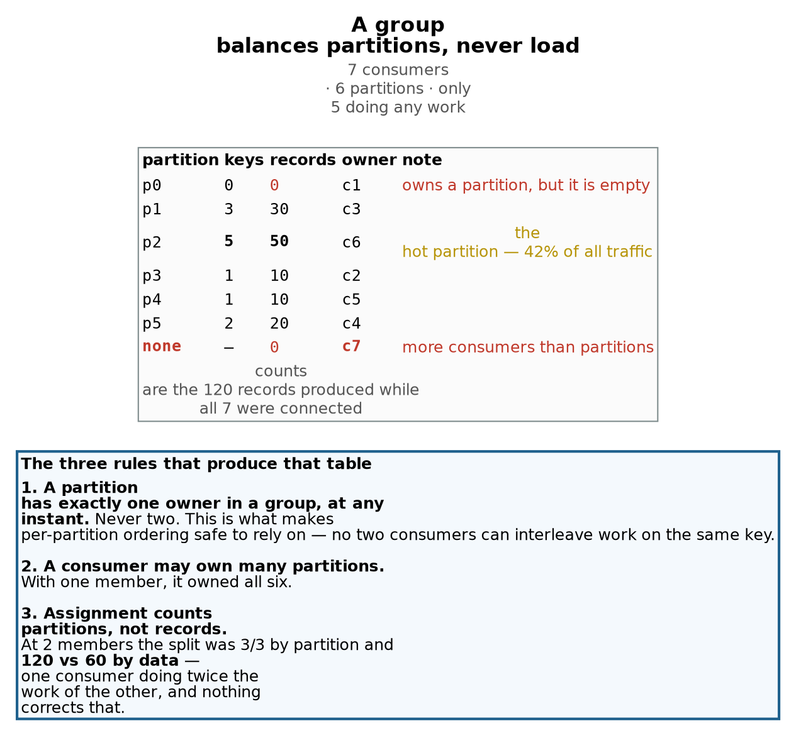
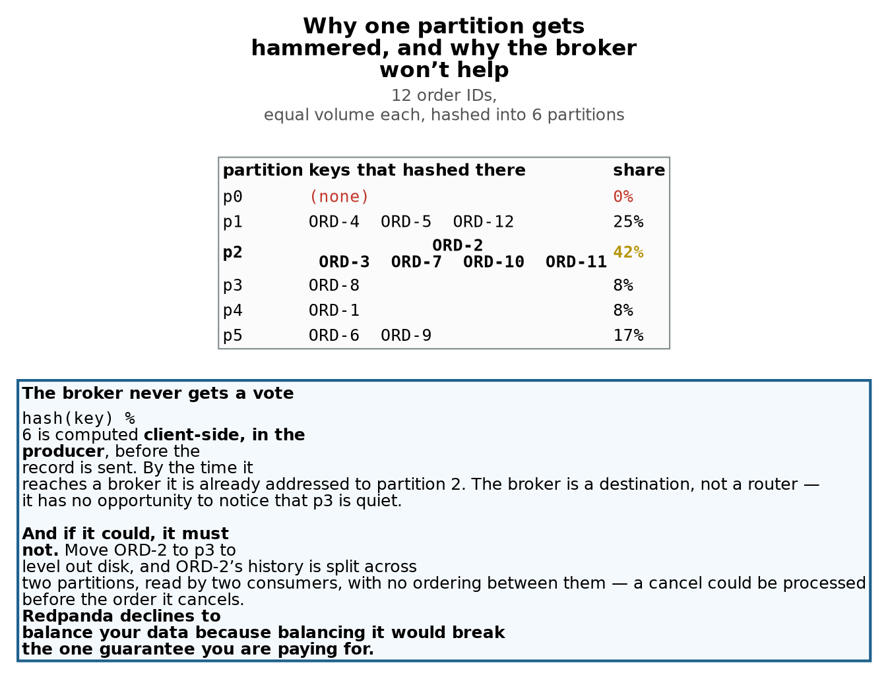
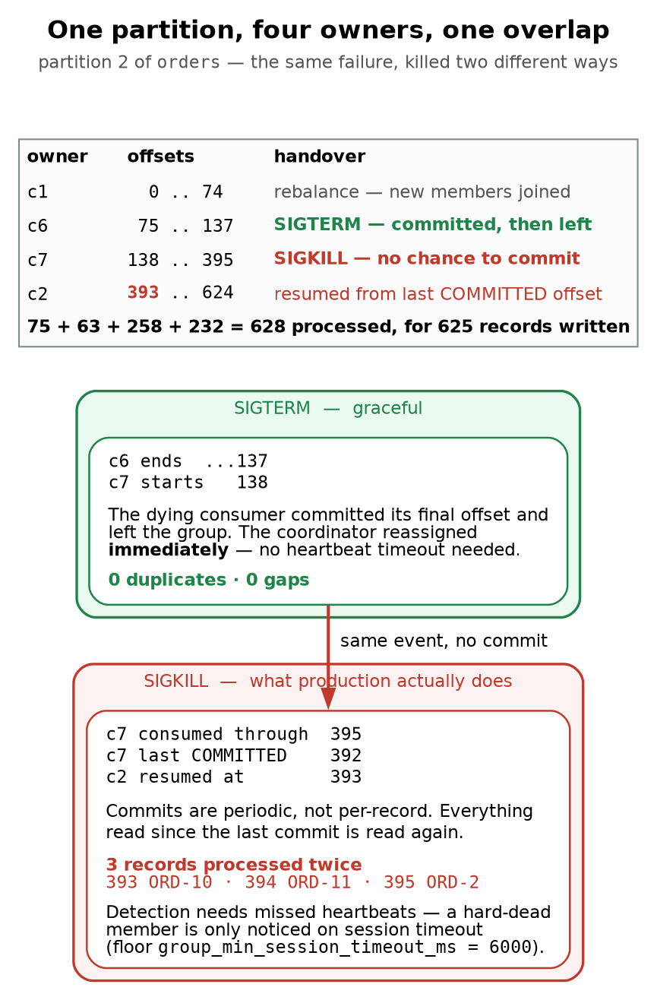

# Kubernetes + Redpanda · Chapter 5 — Consumer Groups, Rebalancing and Delivery Semantics

> **Who this chapter is written for.** Andrew is interviewing for an **SRE / DevOps** role on an
> **order management system**. Chapters 3 and 4 got data *into* Redpanda and got topics provisioned.
> This one is about getting data *out* reliably — how work is divided, what happens when a consumer
> dies, and [why "we process each message exactly once" is the sentence that double-executes trades]{custom-style="Key"}.

---

## Verified facts header

Run on **`vm-k8-redpanda-1` (192.168.1.186)**, single-node k3s v1.36.2, Redpanda `v26.1.12`, on
**3 August 2026**. Every command was executed and every number quoted is measured.

| Thing | Value as tested |
|---|---|
| Topic | `orders` — 6 partitions, RF 3, **1500 records** produced across the session |
| Keys | `ORD-1` … `ORD-12`, equal volume each, so partition load == key count |
| Group | `oms-processor`, grown from 1 to 7 members and back down to 5 |
| Assignment strategy | `cooperative-sticky` (rpk's default) |
| Group coordinator | node 2, at `__consumer_offsets/7` |
| Offsets topic | `__consumer_offsets` — 16 partitions, RF 3, `cleanup.policy=compact` |
| Session timeout floor | `group_min_session_timeout_ms = 6000` (max 300000) |

**Prerequisite reading:** Chapter 3 §2 (topics, partitions, offsets) and §5 (headless Services and how
a client connects). Chapter 4 §7c on why partition count is permanent is the punchline of §3 here.

---

## What this chapter covers

1. What a consumer group is, and the three rules of assignment
2. The parallelism ceiling — and why the idle consumer isn't useless
3. Skew: why one partition gets hammered, and why no broker will fix it
4. Lag, and how to read the `describe` table during an incident
5. Rebalancing: what moves, and what it costs
6. Graceful death versus hard death — the same failure, two different data outcomes
7. Delivery semantics, and why idempotency is yours to own
8. Where offsets actually live
9. **Replay** — deliberately reprocessing the past, and what it costs
10. Production gaps, commands, glossary, interview questions, self-test

---

## 1. What a consumer group is

[A consumer group is how several processes share the work of reading one topic without reading the]{custom-style="Key"}
same record twice *at the same time*. You opt in by passing a group name:

```bash
rpk topic consume orders -g oms-processor -o start -f '%p %o %k\n'
```

Everything interesting follows from three rules.

[**Rule 1 — a partition has exactly one owner in the group, at any instant.** Never two.]{custom-style="Key"} This is the
rule that makes per-partition ordering safe to depend on: if two consumers could interleave work on
the same key, [the ordering guarantee from Chapter 3 would be worthless the moment you scaled out]{custom-style="Key"}.

**Rule 2 — a consumer may own many partitions.** With one member in the group, it owned all six:

```
MEMBERS                1
TOTAL-LAG              120

TOPIC   PARTITION  CURRENT-OFFSET  LOG-START-OFFSET  LOG-END-OFFSET  LAG  MEMBER-ID              CLIENT-ID  HOST
orders  0          -               0                 0               -    rpk-b84e5b00...        rpk        10.42.0.1
orders  1          -               0                 30              30   rpk-b84e5b00...        rpk        10.42.0.1
orders  2          -               0                 50              50   rpk-b84e5b00...        rpk        10.42.0.1
orders  3          -               0                 10              10   rpk-b84e5b00...        rpk        10.42.0.1
orders  4          -               0                 10              10   rpk-b84e5b00...        rpk        10.42.0.1
orders  5          -               0                 20              20   rpk-b84e5b00...        rpk        10.42.0.1
```

Two things about that output are worth pausing on, because both cause real mistakes.

[**It is nine columns, and the ones people forget are in the middle.**]{custom-style="Key"} Any `awk` you write against
this must count past `LOG-START-OFFSET`, so **LAG is `$6` and MEMBER-ID is `$7`** — not `$5` and
`$6`, which is what you get if you assume the abbreviated five-column table that appears in a lot of
write-ups (including an earlier draft of this one). An index that is off by one here does not error;
[it silently prints `CLIENT-ID`, which is the string `rpk` for every rpk consumer alive]{custom-style="Key"}, so
`sort -u | wc -l` [cheerfully reports one owner no matter what the group is doing]{custom-style="Key"}. Check the header
against your own `rpk` version before trusting any fixed index.

**`CURRENT-OFFSET` is `-` everywhere, which means this group has committed nothing yet.** This is a
snapshot taken before the first commit, so read it as evidence of *ownership* only. It is not in
conflict with §2's statement that c1 processed those 120 records; processing and committing are
different events, and the entire second half of this chapter is about the gap between them.

[**Rule 3 — assignment counts partitions, not records.**]{custom-style="Key"} Add a second consumer and the six partitions
split 3/3. The *work* does not:

```
c1 owns p0, p1, p2   ->   0 + 45 + 75  = 120 records   (67%)
c2 owns p3, p4, p5   ->  15 + 15 + 30  =  60 records   (33%)
```

(By this point 180 records had been produced in total — the 120 above plus a further 60 while the
second consumer was joining. The split is 120/60 of 180, not of the earlier 120.)

[Doubling the consumers left one of them doing twice the work of the other]{custom-style="Key"}, and [**nothing in the
protocol will ever correct that.** The group has no idea some partitions are hot.]{custom-style="Key"}



> **Partition count is a permanent ceiling on consumer parallelism**
>
> Six partitions means at most six consumers can do work. [The 7th got no assignment and stayed at zero records while 120 flowed past it]{custom-style="Key"}.
>
> **So your worst-case lag is set by your hottest partition, not by your consumer count.** If p2 falls behind you cannot add consumers to help — it already has a dedicated one, and rule 1 forbids a second. The only levers are a faster consumer, a different key, or more partitions — and more partitions rewrites `hash(key) % n` and breaks ordering retroactively (Ch3 §2d, Ch4 §7c).
>
> **But idle is not the same as useless.** When the p2 owner was killed, [**c7 inherited it instantly** — already connected, already in the group, no process start]{custom-style="Key"}. An idle consumer is a warm standby you pay for in steady state. Whether that trade is worth it depends on your consumer’s startup cost.

---

## 2. The parallelism ceiling

Six partitions, seven consumers. Measured over 120 records produced while all seven were connected:

```
c6  ->  p2   50 records      <-- the hot partition
c3  ->  p1   30
c4  ->  p5   20
c2  ->  p3   10
c5  ->  p4   10
c1  ->  p0    0              <-- owns a partition, but it has never held a record
c7  ->  --    0              <-- owns nothing: more consumers than partitions
```

[**Seven consumers, five doing work.** Two distinct flavours of idle, and it's worth separating them
because only one is structural.]{custom-style="Key"} `c7` has no assignment at all — with six partitions, the seventh
member is surplus by definition. `c1` does have an assignment, but partition 0 is empty, so it is
functionally idle too. Note also that `c1` was the *original* consumer that single-handedly processed
the first 120 records; [rebalancing demoted it to the empty partition with no regard for history]{custom-style="Key"}.

The number to take away:

> [**Your worst-case lag is set by your hottest partition, not by your consumer count.**]{custom-style="Key"} If p2 falls
> behind, adding consumers cannot help — it already has a dedicated one, and Rule 1 forbids a second.

Your only levers are a faster consumer, a different key, or more partitions. And more partitions
rewrites `hash(key) % n`, breaking ordering retroactively for roughly half the keys (Ch3 §2d,
Ch4 §7c). [**Partition count is not just a storage decision — it's your permanent maximum
throughput**]{custom-style="Key"}, chosen before you have any data about what that needs to be.

### 2a. Idle is not the same as useless

That conclusion needs immediate qualification, because the next demo contradicted the obvious reading
of it. [When the p2 owner was killed, **`c7` inherited the partition instantly.**]{custom-style="Key"} It was already
connected, [already authenticated, already a group member — failover needed no process start]{custom-style="Key"}, no
metadata fetch, just an assignment.

[So a surplus consumer is a **warm standby** you pay for in steady state.]{custom-style="Key"} Whether that's a good trade
depends entirely on how expensive your consumer's startup is. For a JVM service with a slow warm-up,
one idle replica may be excellent value. For a cheap process under a Deployment that Kubernetes will
restart in two seconds anyway, it's waste.

---

## 3. Skew: why one partition gets hammered

Twelve order IDs, identical volume each, hashed into six partitions:

```
p0:  (none)                                    0%
p1:  ORD-4, ORD-5, ORD-12                     25%
p2:  ORD-2, ORD-3, ORD-7, ORD-10, ORD-11      42%   <-- five of twelve keys
p3:  ORD-8                                     8%
p4:  ORD-1                                     8%
p5:  ORD-6, ORD-9                             17%
```

The natural question is why Redpanda doesn't notice that p3 is quiet and send some of p2's traffic
there. Two independent reasons, and the second is the important one.

**The broker never gets a vote.** [`hash(key) % 6` is computed **client-side, in the producer**,
before the record is sent.]{custom-style="Key"} By the time it arrives at a broker it is already addressed to partition 2.
The broker is a destination, not a router.

**And if it could, it must not.** Move `ORD-2` to p3 to level out disk usage and `ORD-2`'s history is
now split across two partitions, [read by two different consumers, with no ordering between them — a
cancel could be processed before the order it cancels.]{custom-style="Key"} That is exactly the damage from Chapter 3's
repartitioning demo, except inflicted silently, mid-flight, by the broker. [**Redpanda declines to
balance your data because balancing it would break the one guarantee you're paying for.**]{custom-style="Key"}



> **Two different problems that look identical**
>
> **Small-numbers skew — fixes itself.** 12 keys into 6 buckets should average 2 each; random assignment lands like this routinely, for the same reason 12 coin flips rarely give exactly 6 heads. A real OMS has thousands to millions of order IDs and the distribution flattens on its own.
>
> **Do not over-learn this particular skew.** **A genuinely hot single key — unfixable by partitioning.** If one client’s account is 40% of volume, no partition count helps: that key must stay on one partition to keep its ordering. The answers are a composite key such as `account-shard` (spreads load, gives up per-account ordering) or a dedicated topic for that flow. It is a data-modelling decision, not a tuning one.
>
> **Not on the list: adding partitions.** It does not reliably fix skew — the redistribution can be just as unlucky — and it breaks ordering retroactively for roughly half the keys.

### 3a. Two problems that look identical

[**Small-numbers skew fixes itself.** Twelve keys into six buckets should average two each]{custom-style="Key"}; random
assignment lands like the table above routinely, for the same reason twelve coin flips rarely give
exactly six heads. A real OMS has thousands to millions of distinct order IDs and the distribution
flattens on its own. **Don't over-learn this particular skew** — it's an artifact of the demo.

[**A genuinely hot single key is unfixable by partitioning.** If one client's account ID were 40% of
volume, no partition count helps]{custom-style="Key"}: that key must live on one partition to keep its ordering. The
answers are a composite key such as `account-shard-3` (spreads the load, gives up per-account
ordering, keeps per-order ordering) or a dedicated topic for that flow. [It's a data-modelling
decision, not a tuning one]{custom-style="Key"}, and saying so is the right answer if an interviewer asks how you'd handle
a hot partition.

Notably absent from both lists: **adding partitions**. It doesn't reliably fix skew — the
redistribution can be just as unlucky — and it breaks ordering retroactively.

---

## 4. Lag, and how to read the table

`LAG` is `LOG-END-OFFSET` minus `CURRENT-OFFSET`: how far this group's committed progress trails what
has been written. It is the single most important operational metric for a consumer, and in an order
management system it is [the direct answer to *how stale is our view of the book*]{custom-style="Key"}.

Three things about that table that matter at 3am:

**Lag is per-partition; `TOTAL-LAG` is only the sum.** Total lag can look healthy while one partition
is badly behind. Given the skew above, [a stall on p2 would be 42% of your traffic while the other
five partitions keep the aggregate looking survivable.]{custom-style="Key"} [**Alert on max per-partition lag, not just the
total.**]{custom-style="Key"}

**A dash is not a zero.** Partition 0 shows `CURRENT-OFFSET  -` even when the group is fully caught
up. [A dash means *this group has never committed an offset for this partition*, which is very
different from having committed offset 0.]{custom-style="Key"} Nothing ever arrived, so nothing was ever committed. Read
it alongside `LOG-END-OFFSET` to tell "idle partition" apart from "consumer never started."

[**Lag falling to zero says nothing about correctness.** It means the group committed offsets up to
the high-water mark.]{custom-style="Key"} Whether the consumer actually *did* anything useful with those records — or
crashed after committing — is a separate question that lag cannot answer.

---

## 5. Rebalancing

Whenever membership changes — a consumer joins, leaves, or is declared dead — the coordinator
reassigns partitions. This is a **rebalance**, and it happens far more often than people expect:
[every deploy, every scale event, every pod eviction, every OOM kill]{custom-style="Key"}.

`BALANCER  cooperative-sticky` is rpk's default and the modern one. [The older *eager* strategies
(`range`, `roundrobin`) revoke **every** assignment from **every** member and redistribute from
scratch]{custom-style="Key"} — a genuine stop-the-world pause across the whole group. Cooperative rebalancing moves only
the partitions that actually need to move, so consumers untouched by the change keep working.

A practical consequence of watching this live: [**the `describe` output barely changes.** Going from
2 members to 7 changed `MEMBERS` and the `MEMBER-ID` column and nothing else]{custom-style="Key"}, because no new data had
arrived. The rebalance moved *ownership*, not progress. If you're trying to observe a rebalance, count
distinct owners rather than reading offsets:

```bash
echo "members: $(rpk group describe oms-processor | awk '/^MEMBERS/{print $2}')"
echo "owners:  $(rpk group describe oms-processor | awk 'NF>6 && $1=="orders"{print $7}' | sort -u | wc -l)"
```

When those two numbers disagree, you have surplus consumers.

[**Rebalances make the distribution less fair over time, not more.**]{custom-style="Key"} After two consumers died, the
group settled at 5 members for 6 partitions with `527953fc` owning **both p2 and p3** — the hot
partition plus another one, on a single consumer. Nothing rebalances for load, so each failure is an
opportunity for the assignment to get worse.

---

## 6. The same failure, two different data outcomes

This is the demo worth remembering. Partition 2 had four owners over its life:

```
c1   offsets    0 .. 74      (75 records)
c6   offsets   75 .. 137     (63)      <-- killed with SIGTERM
c7   offsets  138 .. 395     (258)     <-- killed with SIGKILL
c2   offsets  393 .. 624     (232)
                 ^^^
        393, 394, 395 processed TWICE
```

**SIGTERM — graceful.** `c6` ended at 137, `c7` began at 138. [The dying consumer committed its final
offset and left the group explicitly, so the coordinator reassigned immediately]{custom-style="Key"} without waiting for
any timeout. **Zero duplicates, zero gaps.**

**SIGKILL — what production actually does.** `c7` had consumed through offset 395, but its last
*committed* offset was 392. It died with no opportunity to commit or to leave the group, so the
coordinator could only detect it by missed heartbeats, and `c2` correctly resumed from 393:

```
2 393 ORD-10        2 393 ORD-10
2 394 ORD-11        2 394 ORD-11
2 395 ORD-2         2 395 ORD-2
```

Three records processed twice — and [75 + 63 + 258 + 232 = **628 processed for 625 records written**.]{custom-style="Key"}



> **At-least-once is not a setting. It is the default reality.**
>
> The duplicate count is **throughput × time since last commit**. Shortening the commit interval makes duplicates rarer and commit traffic heavier; it never makes them impossible. A consumer committing every 30s on a busy partition replays thousands, not three.
>
> **So the fix is not tuning — it is an idempotent consumer.** Dedupe on an event ID, make the write conditional on current state, or upsert by order ID instead of appending. “Each message is processed exactly once” is the assumption that double-executes trades.
>
> **Exactly-once exists, but is narrower than it sounds:** Kafka/Redpanda transactions cover read-process-write loops that stay *inside* the cluster. The moment the side effect is an external order gateway or a REST call, you are back to at-least-once and idempotency is yours to own.

The mechanism is the gap between *consumed* and *committed*. Committing is periodic, not per-record;
doing it per record would mean a synchronous round trip for every message. [**Everything read since
the last commit gets read again. That's not a bug — that's the definition of at-least-once delivery.**]{custom-style="Key"}

[OOM kills, `kubectl delete pod --force`, node failures and liveness-probe kills (Ch2 §7) are all the
SIGKILL case.]{custom-style="Key"} The graceful path is the exception, not the norm.

---

## 7. Delivery semantics

The duplicate count is **throughput × time since last commit**. That makes it tunable, and the
tuning is a straight trade: a short `auto.commit.interval` means fewer duplicates and more commit
traffic; a long one means better throughput and a bigger replay window. You saw three records because
rpk commits often. [A consumer committing every 30 seconds on a busy partition replays thousands.]{custom-style="Key"}

[**Which is why tuning is not the fix.** You can make duplicates rarer; you cannot make them
impossible.]{custom-style="Key"} The fix is an **idempotent consumer**:

- dedupe on an event ID you carry in the record
- make the write conditional on current state (`UPDATE ... WHERE status = 'PENDING'`)
- upsert keyed by order ID rather than appending

> ["We assume each message is processed exactly once" is the assumption that produces double-executed]{custom-style="Key"}
> trades. In an OMS, reprocessing a fill must be *safe*, not merely unlikely.

[**Exactly-once exists, but it's narrower than the name suggests.** Kafka/Redpanda transactions give
you exactly-once for read-process-write loops that stay **inside** the cluster]{custom-style="Key"} — consume from topic A,
produce to topic B, commit offsets and output atomically. The moment your side effect leaves the
cluster (an order gateway, a REST call, a row in Postgres outside the transaction), you are back to
at-least-once and idempotency is your responsibility.

---

## 8. Where offsets actually live

Your group's progress is stored as records in an ordinary Redpanda topic:

```
NAME        __consumer_offsets
INTERNAL    true
PARTITIONS  16
REPLICAS    3
cleanup.policy   compact
```

Three consequences worth knowing:

**Offsets survive your consumers.** During an early test the group showed `STATE Empty` with
`MEMBERS 0` after every consumer exited — the group and its committed offsets persisted with nothing
running. That's why a consumer restarting resumes instead of replaying from the beginning, and why
`-o start` did *not* make a newly joined member re-read history: [`-o start` only decides where to
begin when the group has **no committed offset** for a partition.]{custom-style="Key"}

**One partition of that topic is your coordinator.** `COORDINATOR-PARTITION __consumer_offsets/7`
— the group name hashes to one of the 16 partitions, and the broker leading it coordinates your
group. [This is why group membership is affected by broker failures: lose the leader of that partition
and your group needs a new coordinator before it can rebalance.]{custom-style="Key"}

**`cleanup.policy=compact`, not `delete`.** Compaction keeps the *latest* value per key rather than
expiring old records by age, and the key here is (group, topic, partition) — so the current offset
survives indefinitely while superseded ones are collected. [That is exactly the right policy for this
data and exactly the wrong one for an order journal]{custom-style="Key"}, for the same reason: compaction preserves the
*latest state* and discards the *history* (Ch4 §7a).

[It has to be this way, because the alternative is silent]{custom-style="Key"}. An ordinary topic like `orders` carries
`retention.ms=604800000`, so its records are deleted after seven days by design. If offsets expired
on a timer like that, [a consumer group that was idle over a long weekend would come back, find no
committed offset, fall through to `auto.offset.reset`, and **replay the topic from the beginning**]{custom-style="Key"} —
[reprocessing every order it had already handled, with no error anywhere]{custom-style="Key"}. Compaction is what stops a
quiet group from becoming a duplicate storm.

---

## 9. Replay: deliberately reprocessing the past

Offsets are just numbers in a topic (§8), which means you can *write* them. That turns "reprocess
yesterday's fills" from a crisis into a command, and **"how would you replay a day of data" is a
stock interview question** for anyone operating a streaming platform.

```bash
rpk group seek <group> --to start              # from the beginning of the topic
rpk group seek <group> --to end                # skip everything unprocessed
rpk group seek <group> --to 1785801782636      # a specific epoch-millisecond timestamp
rpk group seek <group> --topics orders -to start   # one topic only
```

[**The group must be empty first.** A seek rewrites the committed offsets]{custom-style="Key"}, and a live member would
[carry on from its own in-memory position and then commit over the top of your change]{custom-style="Key"}. So the
procedure is always: [stop the consumers, confirm the group has no members, seek, restart]{custom-style="Key"}.

```bash
kubectl -n market scale deploy position-keeper --replicas=0
kubectl -n market wait --for=delete pod -l app=position-keeper --timeout=90s
rpk group seek position-keeper --to start
kubectl -n market scale deploy position-keeper --replicas=1
```

### What a replay actually costs

This is worth doing once, because it proves Chapter 6's central claim from the opposite direction.
The state before the replay was a clean, fully reconciled run — 2,000 orders, 8,000 fills, 800,000
shares, both ledgers agreeing exactly. Then the group was seeked to offset 0 and every record in
the topic was processed a second time:

```
                  before replay              after replay
transactional :   rows=8000  total=800000    rows=8000   total=800000
gateway       :   calls=8000 total=800000    calls=16216 total=1621600
```

[**The transactional ledger did not move at all.** Not by one share.]{custom-style="Key"} It upserts on `(order_id, seq)`,
so reprocessing rewrites rows that already hold the correct value, and the answer is identical
whether you process the topic once or a hundred times.

[**The gateway doubled**, because every replayed fill was a fresh non-rollback-able call, and
821,600 shares were "executed" that nobody ordered.]{custom-style="Key"}

So the rule for replay is the same rule as for crash recovery, which is why it is worth seeing
twice: [**replay is free for idempotent state and catastrophic for external side effects.**]{custom-style="Key"} Before
you seek a group in production, [the question is not "can I replay" — you always can]{custom-style="Key"} — it is *what
else does this consumer touch?* If it only writes to a store keyed by a business key, replay is a
non-event. If it sends orders, emails, or payments, you must disable the side effect first, or
replay into a parallel consumer group writing to a shadow store and compare.

That last technique is worth naming, because it is what people actually do: a **shadow replay**
uses a *different* `group.id` on the same topic, so it gets its own offsets and reads every record
without disturbing the live group at all (§1, rule 1 applies per group, not across groups).

> **The staleness number goes strange during a replay, and it should.** The consumer reports the age
> of the events it is handling, and during this replay [it read `staleness=1116.16s` — the records
> were eighteen minutes old. [That is correct and it is the reason to measure event age rather than]{custom-style="Key"}
> record lag]{custom-style="Key"}: an alert on "my view of the book is 18 minutes stale" is meaningful, whereas
> `TOTAL-LAG 10001` needs someone to know how fast this consumer drains before it means anything.

### A bug this replay found

The first attempt at the above crash-looped, and the reason is a good one to keep. Seeking a group
triggers a rebalance, and a rebalance can revoke your partitions between processing a record and
committing its offset. The commit then fails with:

```
KafkaError{code=_NO_OFFSET,val=-168,str="Commit failed: Local: No offset stored"}
```

That is not an error condition — [it means "there is nothing stored to commit", the successor will]{custom-style="Key"}
redeliver from the last committed position, and the idempotent write makes that safe. But the
consumer treated every exception during commit as fatal, so a routine rebalance became a
`CrashLoopBackOff` in the middle of a recovery operation. [**Code that is careful about correctness
tends to be over-eager about failing**]{custom-style="Key"}, and the place that bites is always the rebalance path,
because that is the path you cannot easily test on a single quiet consumer.

---

## 10. Where this sandbox differs from production

| Here | Production |
|---|---|
| `rpk topic consume` as the consumer | A real client library, with explicit commit control and rebalance listeners |
| Auto-commit on rpk's default interval | Deliberate commit strategy — usually commit *after* the side effect succeeds |
| Duplicates observed and shrugged at | Idempotent handlers, dedupe store, or transactional read-process-write |
| 12 keys | Thousands to millions, so hash skew disappears |
| Consumers as background shell jobs | A Deployment, so every rollout triggers a rebalance (Ch2) |
| No lag monitoring | Alert on **max per-partition lag** and on lag *rate of change*, not just totals |
| Group left with surplus members | Replica count matched to partition count deliberately, or a standby chosen on purpose |
| Session timeouts left at defaults | Tuned against real processing time — too short causes false-dead rebalance storms |
| No rebalance listener | `onPartitionsRevoked` commits before losing a partition, shrinking the duplicate window |

The biggest gap is the second row. Everything here auto-commits on a timer, which means the consumer
can commit a record it has not finished processing. [Committing **after** the side effect succeeds
converts a possible *lost* record into a possible *duplicate* record]{custom-style="Key"} — and with an idempotent handler,
duplicates are harmless while losses are not.

### ⭐ Lab vs PROD — the one row that silently loses orders

*Added Aug 13, 2026, retrofitting a convention introduced with the Docker Swarm track. Almost every row
above is a difference of **tooling or tuning** — shell jobs instead of Deployments, twelve keys instead of
millions — and none of them would be a defect at this size. **The commit row is different: it changes
whether the system can lose data**, which is why it earns a callout rather than a table row.*

> **Lab vs PROD — auto-commit, which decides your delivery semantics for you.** *In the lab:* every
> consumer is `rpk topic consume`, [which commits offsets on a timer, so an offset can be committed for a]{custom-style="Key"}
> record whose processing never finished. *Why it's acceptable here:* the chapter's subject is group
> mechanics — assignment, rebalancing, lag, skew — and `rpk` makes all of those directly observable
> without writing a client. *In production:* commit **after** the side effect has succeeded, and add a
> [rebalance listener so `onPartitionsRevoked` commits before a partition is taken away]{custom-style="Key"}. *If you carry the
> habit:* 🚨 **you have chosen at-most-once delivery without deciding to.** A crash between the timer
> firing and the work completing [means the record is gone — not retried, not logged, gone]{custom-style="Key"} — and for order
> flow that is a lost order with no trace. ⭐ **The asymmetry is the whole point: committing late risks a
> duplicate, committing early risks a loss, and a duplicate is recoverable while a loss is not.** Chapter 6
> §5–§7 tests both halves of this with a real client and shows exactly where the duplicate window opens.
> ⚠️ *Unverified prescription:* the commit-after-success pattern and `onPartitionsRevoked` are described
> here but never exercised in this chapter, because `rpk` gives no control over either.

---

## 11. Commands to know by heart

```bash
# ---- groups ----
rpk group list
rpk group describe oms-processor
rpk group delete oms-processor                  # only when Empty
rpk group seek oms-processor --to start         # replay; also --to end, --to timestamp
rpk group offset-delete oms-processor -t orders:2

# ---- consuming in a group ----
rpk topic consume orders -g oms-processor -o start -f '%p %o %k\n'
rpk topic consume orders -o :end                # one-shot, NO group, does not commit

# ---- the two numbers that reveal surplus consumers ----
# Column indices assume the nine-column table in 1: LAG is $6, MEMBER-ID is $7.
# Check your rpk's header before trusting them -- an off-by-one prints CLIENT-ID,
# which is the same string for every consumer and so always reports one owner.
rpk group describe oms-processor | awk '/^MEMBERS/{print "members:", $2}'
rpk group describe oms-processor | awk 'NF>6 && $1=="orders"{print $7}' | sort -u | wc -l

# ---- who owns what ----
rpk group describe oms-processor | awk 'NF>6 && $1=="orders" {print "p"$2" -> "$7}'

# ---- worst per-partition lag, which is what to alert on ----
rpk group describe oms-processor | awk 'NF>6 && $6 ~ /^[0-9]+$/ {if ($6>m) {m=$6; p=$2}} END{print "max lag", m, "on p"p}'

# ---- where the offsets live ----
rpk topic describe __consumer_offsets
```

---

## 12. Glossary

| Term | Meaning |
|---|---|
| **Consumer group** | A set of consumers sharing a topic, coordinated so each partition has one owner. |
| **Group coordinator** | The broker leading this group's partition of `__consumer_offsets`. |
| **Assignment / ownership** | Which member reads which partitions. Changes only at a rebalance. |
| **Rebalance** | Reassignment triggered by membership change. Cooperative moves only what must move. |
| **`cooperative-sticky`** | Incremental rebalance strategy; the default. Contrast: eager `range`/`roundrobin`. |
| **Committed offset** | The last position this *group* durably recorded. What a new owner resumes from. |
| **Lag** | `LOG-END-OFFSET − CURRENT-OFFSET`. Per-partition; `TOTAL-LAG` is the sum. |
| **Session timeout** | How long without a heartbeat before a member is declared dead. Floor 6000 ms here. |
| **At-least-once** | The default. Records may be processed more than once; never silently skipped. |
| **At-most-once** | Commit before processing. No duplicates, but a crash loses records. |
| **Exactly-once** | Transactional read-process-write, **inside** the cluster only. |
| **Idempotent consumer** | Processing the same record twice has the same effect as once. The real fix. |
| **Warm standby** | A surplus consumer with no assignment, ready to inherit a partition instantly. |

---

## 13. Interview questions this material answers

**"How do you scale up consumption?"**
Add consumers to the group, up to the partition count. Past that, extra members get no assignment —
I measured a seventh consumer sitting at zero records while 120 flowed through six partitions.
Partition count is a permanent ceiling on consumer parallelism, which is why it's a capacity decision
made at topic creation.

**"One partition is lagging badly. Add consumers?"**
No — that partition already has a dedicated owner and a second consumer isn't permitted to touch it.
Worst-case lag is set by the hottest partition, not the consumer count. The real levers are a faster
consumer, a different key, or more partitions with the ordering breakage that implies.

**"Why doesn't the broker rebalance data off a hot partition?"**
It can't and it shouldn't. The producer computes `hash(key) % n` client-side, so the record arrives
already addressed. And moving a key would split its history across two partitions read by two
consumers with no ordering between them — a cancel could be processed before its order.

**"You have a genuinely hot key. Now what?"**
That's a data-modelling problem, not a tuning one. Composite key like `account-shard-N` to spread the
load while keeping per-order ordering, or a dedicated topic for that flow. Adding partitions doesn't
reliably help and breaks ordering retroactively.

**"A consumer pod gets OOM-killed. What happens to the data?"**
Duplicates, not loss. It had consumed past its last committed offset, so whoever inherits the
partition replays from the commit point — I measured exactly three records reprocessed. A graceful
SIGTERM shutdown in the same scenario handed over at exactly the right offset with zero overlap. The
difference is entirely whether the process got to commit.

**"So how do you prevent duplicates?"**
You don't — you make them harmless. Duplicate count is throughput × time since last commit, so
tuning the commit interval changes the odds, never the possibility. The consumer must be idempotent:
dedupe on event ID, conditional writes, or upsert by order ID. Exactly-once only covers
read-process-write loops that stay inside the cluster.

**"What do you alert on?"**
Max per-partition lag rather than total — with skewed keys, one stalled partition carrying 42% of
traffic hides inside a healthy-looking aggregate. Plus lag rate of change, and rebalance frequency,
since a group rebalancing constantly is usually a session timeout tuned below real processing time.

**"What triggers a rebalance, and why should I care?"**
Any membership change: deploys, scaling, evictions, OOM kills, missed heartbeats. Each one pauses
consumption for the partitions that move and, with a hard-dead member, adds a session-timeout delay
before it's even noticed. Cooperative-sticky limits the blast radius to only the partitions that
actually move; older eager strategies revoke everything from everyone.

**"Where are consumer offsets stored?"**
In `__consumer_offsets`, a compacted internal topic — 16 partitions, RF 3 here. The group name hashes
to one partition and its leader is the group coordinator. It's compacted rather than time-expired
[precisely so committed offsets never age out from under a group]{custom-style="Key"}.

---

## 14. Check yourself

1. State the three rules of partition assignment. (§1)
2. Two consumers split six partitions 3/3. Why might one still do twice the work? (§1)
3. You have 6 partitions and 7 consumers. What does the 7th do? (§2)
4. Give an argument *for* deliberately running a consumer with no assignment. (§2a)
5. Why can't you fix a lagging partition by adding consumers? (§2)
6. Who chooses the partition a record goes to, and at what point? (§3)
7. Give the ordering argument for why a broker must not rebalance data between partitions. (§3)
8. Distinguish small-numbers skew from a genuinely hot key. Different fixes — what are they? (§3a)
9. `TOTAL-LAG` is 40 across six partitions. Why might that still be an incident? (§4)
10. `CURRENT-OFFSET` shows `-`. What does that mean, and what else do you need to interpret it? (§4)
11. You add five consumers and `rpk group describe` looks unchanged. Did the rebalance happen? (§5)
12. What does `cooperative-sticky` do that `range` doesn't? (§5)
13. Why does the partition distribution get *less* fair as consumers die? (§5)
14. Same consumer, killed by SIGTERM vs SIGKILL. Describe both data outcomes and explain the gap. (§6)
15. Which real-world failures behave like SIGKILL? (§6)
16. Duplicate count is a function of what two quantities? (§7)
17. Why is shortening the commit interval not a solution to duplicates? (§7)
18. Name three ways to make a consumer idempotent. (§7)
19. When does exactly-once actually apply, and when does it stop applying? (§7)
20. Where are offsets stored, and why is that topic compacted rather than time-expired? (§8)
21. Your group has `STATE Empty` and `MEMBERS 0`. Are the offsets gone? (§8)
22. Why did `-o start` not make a newly joined consumer replay all history? (§8)
23. What is a group coordinator, and how is it chosen? (§8)
24. Why is "commit after the side effect succeeds" usually the right default? (§9)

---

## What's next

- **Chapter 6 — the application**: producer `acks`, `enable.idempotence`, partitioner choice, and a
  consumer written to be idempotent rather than hoping — where the duplicates measured in this
  chapter turn into a wrong number a business cares about.
- **Chapter 7 — Schema Registry**: the Chapter 4 provisioning problem again, with subjects instead
  of topics, plus what happens to these consumers when the schema changes underneath them.
