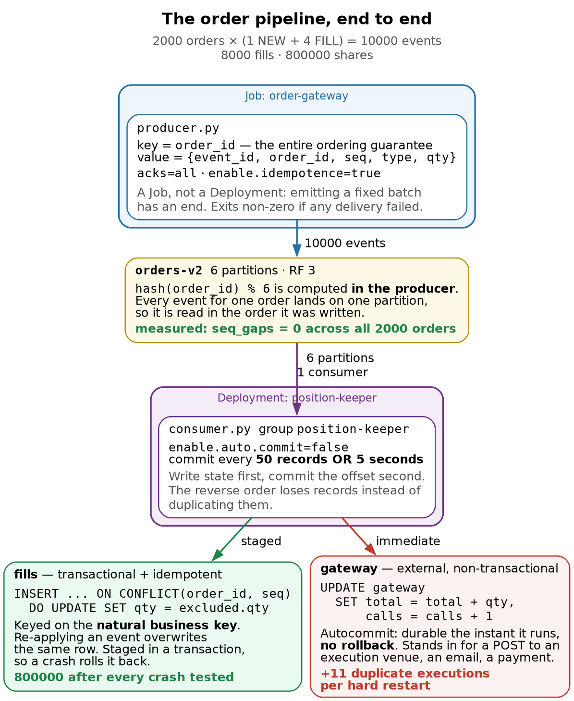
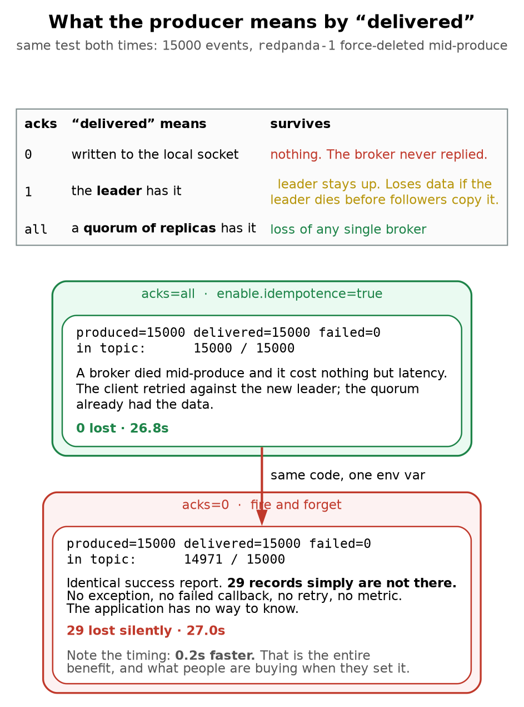
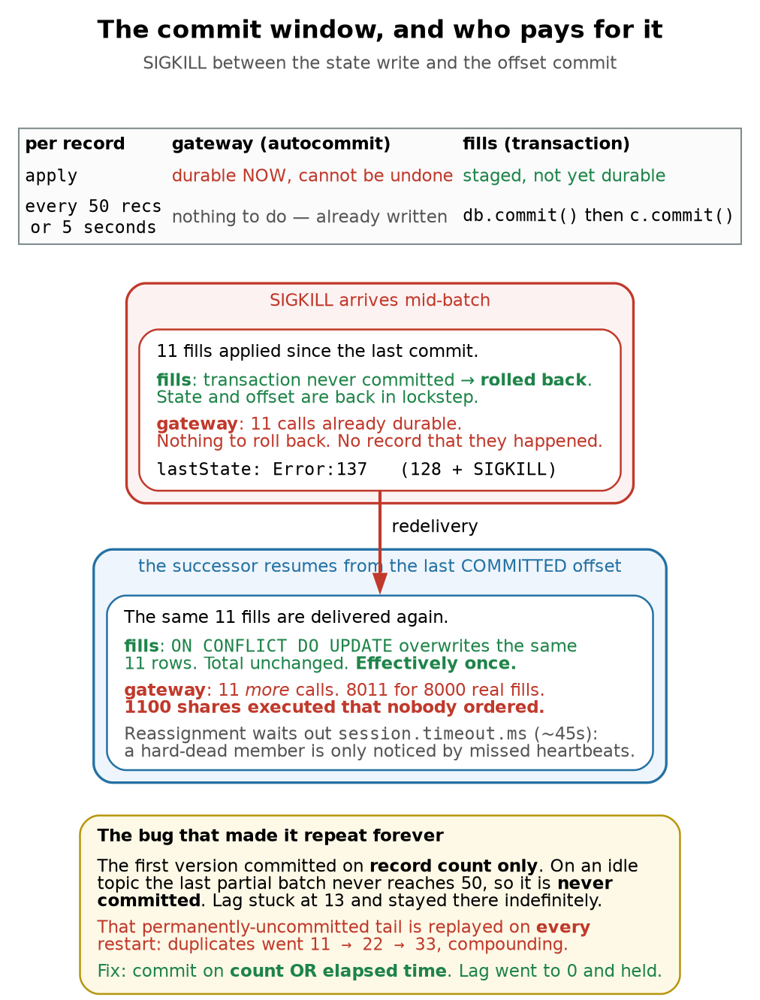

# Kubernetes + Redpanda · Chapter 6 — The Application: Producing, Consuming, and Surviving a Crash

> **Who this chapter is written for.** Andrew is interviewing for an **SRE / DevOps** role on an
> **order management system**. Chapters 3–5 covered the platform: brokers, topic provisioning,
> consumer groups. This chapter is the first one with *our own code* in it. It is where the
> abstractions from Chapter 5 stop being diagrams and start being a number that is wrong by
> 1,100 shares.
>
> The chapter is deliberately built around **four things that went wrong while building it**. Three
> were my own bugs. All four are more instructive than the working version.

---

## Verified facts header

Run on **`vm-k8-redpanda-1` (192.168.1.186)**, single-node k3s v1.36.2, Redpanda `v26.1.12`, on
**3 August 2026**. Every command was executed and every number quoted is measured.

| Thing | Value as tested |
|---|---|
| Language / client | Python 3.12.3, `confluent-kafka` **2.6.1** (librdkafka 2.6.1) |
| Image | `oms:dev`, built with Docker 29.6.2, side-loaded into k3s containerd |
| Topic | `orders-v2` — 6 partitions, RF 3 |
| Workload | **2000 orders × (1 NEW + 4 FILL) = 10,000 events**, 8,000 fills, **800,000 shares** |
| Consumer group | `position-keeper`, 1 member |
| Assignment strategy | **`range`** — note this is *not* Chapter 5's `cooperative-sticky` (§12) |
| Group coordinator | node 2, at `__consumer_offsets/14` |
| Commit policy | explicit, every **50 records or 5 seconds** (§10 explains the "or 5 seconds") |

**Prerequisite reading:** Chapter 5 in full — this chapter is its practical half. Chapter 3 §2
(partitions, offsets, keys) and Chapter 2 §5 (rolling updates) are assumed.

---

## What this chapter covers

1. The shape of the application, and why it is two entrypoints in one image
2. The producer: what the key buys you, and what `acks` actually promises
3. `acks=0` measured — 29 records lost while the producer reported total success
4. Getting an image into k3s when there is no registry
5. The consumer: explicit commits, and why the *order* of two commits decides loss vs duplication
6. **The crash that produced zero duplicates** — and why that was the finding, not a broken demo
7. **The crash that did** — when the side effect escapes the transaction
8. **The bug that made it repeat forever** — the tail that never commits
9. `kubectl delete pod --force` is not a SIGKILL, and what is
10. The fix, and ordering proven rather than assumed
11. Chapter 5's skew prediction, tested at 2000 keys — and how to compare the two numbers honestly
12. Two surprises: client-default rebalancing, and what a durable side effect costs per event
13. Where this sandbox differs from production, and the layers that watch a stalled consumer
14. **The poison message** — and the `finally` block that silently skipped it
15. Runbook, and the commands worth knowing by heart
16. Glossary, interview questions, check yourself

---

## 1. The shape of the application



> **Both ledgers see exactly the same stream. Only one of them survives a crash.**
>
> That difference is the whole chapter. It is not about how carefully you consume — both paths consumed identically. [It is about whether the **effect** of consuming can be undone or repeated safely.]{custom-style="Key"}

Two programs, one container image, one topic, two ledgers:

| Piece | Kubernetes object | Why that object |
|---|---|---|
| `producer.py` | **Job** `order-gateway` | Emitting a fixed batch of orders *has an end*. It exits non-zero on any delivery failure, so `backoffLimit` and `kubectl wait` behave the way Chapter 4 §9 wants. |
| `consumer.py` | **Deployment** `position-keeper` | A consumer runs forever. One replica, `strategy: Recreate`. |
| state | **PVC** `position-state` | The ledgers must survive the crash — that is the entire experiment. |

Two details in that table are load-bearing and easy to get wrong.

**`strategy: Recreate`, not `RollingUpdate`.** A rolling update surges a second pod before removing
the first. [Two pods cannot mount the same `ReadWriteOnce` volume, so the new pod blocks on the PVC
forever while the old one refuses to die.]{custom-style="Key"} The rollout hangs until `progressDeadlineSeconds` and you
get a `ProgressDeadlineExceeded` that looks like a scheduling problem. This is Chapter 2 §5's
`maxSurge` lesson, arriving from an unexpected direction: [**the surge is only free if nothing the
pod holds is exclusive.**]{custom-style="Key"}

**One replica, when there are six partitions.** Chapter 5 §2 established that partition count is the
parallelism ceiling, so this leaves five sixths of the available parallelism unused. That is
deliberate: one consumer makes the arithmetic in this chapter unambiguous. A production position
keeper would be a **StatefulSet** sized to the partition count, one volume per replica.

### The event shape

Every field exists to make one specific failure visible.

```json
{"event_id":"3f2a…","order_id":"ORD-42","seq":3,"type":"FILL","qty":100}
```

| Field | Why it exists |
|---|---|
| `event_id` | Unique per event. A dedupe key, if you need one. (§7 shows why you often don't.) |
| `order_id` | **The partition key.** The only reason per-order ordering works at all. |
| `seq` | Per-order sequence number, so the consumer can **prove** ordering rather than assume it. |
| `qty` | Filled quantity. Turns "processed twice" into a **visibly wrong number**. |

And the arithmetic is fixed so the correct answer is knowable without any coordination between the
two programs:

```
FILLS_PER_ORDER (4) × FILL_QTY (100) = 400 shares per order
2000 orders                          = 800,000 shares, from 8,000 fills
```

That constant is the reconciliation baseline for the whole chapter. Any number that is not 800,000
is a bug with a story attached.

---

## 2. The producer

```python
p.produce(
    TOPIC,
    key=order_id.encode(),        # <- the whole ordering guarantee
    value=encode(event),
    on_delivery=on_delivery,      # <- the only place failure is reported
)
```

Three things worth saying out loud.

**The key is the ordering guarantee, and it is computed client-side.** `hash(order_id) % 6` happens
*in the producer* (Chapter 5 §3). The record arrives at the broker pre-addressed. Every event for
`ORD-42` lands on the same partition and is therefore read in the order it was written. [Drop the
key and you get round-robin, and a `CANCEL` can be processed before the `NEW` it cancels.]{custom-style="Key"}

**Delivery is asynchronous, and the callback is the only truth.** `produce()` enqueues; it does not
send. Success or failure arrives later in `on_delivery`. A program that calls `produce()` in a loop
and exits has sent nothing. Hence:

```python
remaining = p.flush(30)
if stats["failed"] or remaining:
    sys.exit(1)
```

`flush()` returns the number of messages **still unsent** after the timeout. [Ignoring that return
value is how a batch job reports success while silently dropping its tail.]{custom-style="Key"}

**That queue is bounded, and filling it is a failure mode of its own.** `produce()` enqueues into a
local buffer capped by `queue.buffering.max.messages` (100,000 by default). [When the brokers are
slower than the loop — during a broker restart, say — the buffer fills and `produce()` raises
`BufferError` rather than blocking.]{custom-style="Key"} This is producer-side backpressure, the exact mirror of consumer
lag, and the naive loop dies on it at precisely the moment you most want records to survive. The
producer here drains and retries instead, and counts how often it had to:

```python
while True:
    try:
        p.produce(TOPIC, key=..., value=..., on_delivery=on_delivery); break
    except BufferError:
        stats["backpressure"] += 1
        p.poll(0.5)                  # let delivery callbacks drain the queue
```

`backpressure_waits=0` on a healthy run. A non-zero value is the earliest warning that the brokers
cannot keep up, and it appears well before anything shows on the consumer side.

**`enable.idempotence` requires `acks=all`.** [librdkafka refuses the combination outright, and the
refusal is the lesson: producer idempotence is *built on* acks=all, not an alternative to it.]{custom-style="Key"} It
solves exactly one problem — the producer sent a record, the ack was lost in flight, the producer
retried, and the record was appended **twice**. A sequence number per producer session lets the
broker discard the retry. It says nothing whatsoever about the consumer.

**And it dies with the session.** The sequence numbers are scoped to a producer id that the broker
assigns when the client connects. Restart the producer — or let a failed `order-gateway` Job be
retried — and it gets a *new* producer id, so every record it re-emits is brand new as far as the
broker is concerned. `enable.idempotence` protects against a retry *inside* one run and nothing
else. [What actually makes a re-run of this Job safe is the **consumer's** upsert on
`(order_id, seq)`, which is a property of the business key, not of the client library.]{custom-style="Key"} Worth being
precise about, because "we have idempotence enabled" is a very common answer to "what happens if
the producer restarts", and it is the wrong one.

---

## 3. `acks` measured: the silent 29



> [**Loss and duplication fail in opposite directions, and you must pick which one you can live with.**]{custom-style="Key"}
>
> A duplicate is **loud** — it shows up as a wrong total you can reconcile, and an idempotent handler erases it. A lost record is **silent** — there is no artefact to find, no counter to alert on, and reconciliation only catches it if you independently know what should have been there. For an order management system this is not a tuning decision. A missing fill is a position you do not know you hold.
>
> **`acks=all` is the floor**, and in this test it did not even cost anything.
>
> **`enable.idempotence=true` is a different guarantee** and requires `acks=all` underneath it. It stops the *producer* from appending the same record twice when an ack is lost and it retries. It says nothing about the consumer — consumer-side duplicates are Figure 3’s problem.

| `acks` | "delivered" means | Survives |
|---|---|---|
| `0` | written to the local socket | **nothing** — the broker never replied |
| `1` | the **leader** has it | leader staying up |
| `all` | a **quorum of replicas** has it | loss of any single broker |

The test: produce 15,000 events at a throttled rate, and delete `redpanda-1` mid-produce. Two
environment variables differ, not one — `IDEMPOTENCE` has to come off with `acks=0`, because
librdkafka refuses the combination (§2). That is forced, not a second variable under test:
idempotence guards against a *producer* retry appending twice, and has no bearing on whether a
broker that never answered kept the record.

```
acks=all   produced=15000 delivered=15000 failed=0   in topic: 15000 / 15000   26.8s
acks=0     produced=15000 delivered=15000 failed=0   in topic: 14971 / 15000   27.0s
```

**Read those two lines carefully, because they are identical where it matters.** Both runs report
`delivered=15000 failed=0`. [One of them is missing 29 records. There was no exception, no failed
callback, no retry, no metric, no log line. The application cannot know.]{custom-style="Key"} The only way I detected it
was by independently counting what was in the topic afterwards.

[**And `acks=0` did not even go faster — it was 0.2 seconds slower.**]{custom-style="Key"} Do not read that as evidence
that durability is free; read it as evidence that this test could not price durability at all. The
run was rate-limited at `RATE=600`, so 15,000 records cannot complete in under 25 seconds no matter
how little the brokers are asked to do. Both runs sat on that floor, and the 0.2s is scheduling
noise. To measure what `acks=all` actually costs you would have to remove the rate limit and
saturate the brokers, at which point the interesting number is not elapsed time but the p99 of the
delivery callback.

So the finding here is the **29 records**, not the timing. Whatever `acks=0` buys, this run did not
show it buying anything, and it silently dropped 0.19% of the order flow to get it.

This is the asymmetry that matters for an order management system:

- A **duplicate is loud.** It shows up as a total that disagrees with reconciliation, and an
  idempotent handler erases it entirely.
- A **lost record is silent.** There is no artefact to find and no counter to alert on. A missing
  fill is a position you do not know you hold.

`acks=all` is the floor for order flow — and on this workload it was not even the slower option.

> **Nuance worth having ready.** [`acks=all` means a **quorum**, not every replica — Redpanda uses
> Raft, so a 3-replica partition acknowledges once 2 of 3 have it.]{custom-style="Key"} That is why the broker kill cost
> latency and nothing else: the surviving two already had the data and one of them became leader.

---

## 4. Getting the image into k3s with no registry

There is no registry in this lab, and `docker build` alone is not enough. k3s uses **its own
containerd instance** with its own image store, and it cannot see Docker's. The image must be
exported and imported explicitly:

```bash
docker build -t oms:dev .
docker save oms:dev | sudo k3s ctr images import -
sudo k3s ctr images ls -q | grep oms:dev        # verify, or you will debug this via ErrImagePull
```

And the manifest **must** say:

```yaml
imagePullPolicy: IfNotPresent    # or Never
```

The default for a tag that is not `:latest` is `IfNotPresent`, so this often works by accident — but
being explicit documents that the image is side-loaded. Leave the policy at `Always` and the kubelet
will try to pull `oms:dev` from Docker Hub, fail, and give you an `ErrImagePull` that looks like a
network problem rather than a missing registry.

> **Rebuilds need the import too.** Every code change is `build.sh` again. Forgetting the import
> step means Kubernetes cheerfully runs the *previous* image and your fix appears not to work. The
> `build.sh` in `education/k8s-k3s-redpanda/app/` does both and verifies, for exactly this reason.

---

## 5. The consumer, and the order of two commits

```python
"enable.auto.commit": False,
```

[Auto-commit commits on a timer, in the background, **whether or not you have finished processing**.
It converts a duplicate into a lost record, which §3 just established is the worse failure.]{custom-style="Key"} So:
explicit commits only.

The processing loop reduces to:

```python
apply_event(db, gw, event)                       # 1. do the work
...
if since_commit >= COMMIT_EVERY or elapsed:      # 2. periodically:
    db.commit()                                  #    a. make state durable
    c.commit(asynchronous=False)                 #    b. THEN commit the offset
```

**Step (a) before step (b) is the entire design.**

| Order | Crash between them costs | Recoverable? |
|---|---|---|
| state → offset | the records are processed **again** | yes, if the handler is idempotent |
| offset → state | the records are **never processed** | no — silent, permanent |

[Committing the offset first is the more natural way to write it, and it is data loss with extra
steps.]{custom-style="Key"}

Note also that commits are **periodic, not per-record**. Committing after every record would be
correct and unusably slow — an offset commit is a round-trip to the group coordinator. So a window
always exists. [Chapter 5 §7 put it as: *duplicates = throughput × time since last commit.* Tuning
`COMMIT_EVERY` changes the size of the window. It never closes it.]{custom-style="Key"}

---

## 6. The crash that produced zero duplicates

Here is where the chapter earns its keep.

The plan was straightforward: maintain two ledgers, hard-kill the consumer mid-stream, and watch
the naive accumulating ledger inflate while the idempotent upsert ledger stayed correct. Both
ledgers were tables in the same SQLite database.

I killed it at ~6,200 records processed. The successor caught up. Result:

```
expected          = 800000
idempotent ledger = 800000
naive ledger      = 800000
OVER-COUNTED BY   = 0     (0 fills replayed)
```

[**Zero duplicates. The demo failed.** Except it didn't — that result is a genuinely useful thing to
know, and I had built the mechanism without noticing.]{custom-style="Key"}

Both ledgers were written inside the **same SQLite transaction**, and that transaction was committed
immediately before the offset commit. When the process was SIGKILLed mid-batch:

1. The staged SQLite writes were **rolled back** — they had never been committed.
2. The offset had **also** not been committed.
3. The state and the offset were therefore still in **lockstep**, at the previous commit boundary.
4. Redelivery re-applied exactly the records that had been rolled back.

Net effect: **effectively-once, with no dedupe logic at all.**

> **This is the cheap answer, and most consumers qualify for it.** [If your state lives in one
> transactional store and you commit the offset after the transaction, at-least-once delivery is
> already harmless.]{custom-style="Key"} No dedupe table, no event-ID set, no exactly-once protocol, no Kafka
> transactions. It is worth knowing because it is free, and because it tells you precisely when you
> *do* need something more.

So the naive ledger was not modelling anything dangerous. It was protected by the same transaction
as the safe one. To show the real failure I had to model the thing that actually hurts.

---

## 7. The crash that did: when the side effect escapes



> **A transactional state store plus commit-after-write is effectively-once, for free.**
>
> No dedupe table, no event-ID set, no exactly-once protocol. The crash rolls the writes back and redelivery re-applies them. This is worth knowing because it is the **cheap** answer, and most consumers qualify.
>
> **Duplicates hurt exactly when the side effect escapes the transaction.** An HTTP call, an email, a payment, a message to another system. Those need an idempotency key that the *receiver* honours — which is why real payment APIs make you send one.
>
> **And note the order of the two commits.** State first, offset second → a crash costs a duplicate. Offset first, state second → a crash costs a **lost record**. One is recoverable by design; the other is silent.

The dangerous case is a side effect that **cannot be rolled back**: a POST to an execution venue, an
email, a payment, a message to another system. So the second ledger became a **separate SQLite file
on an autocommit connection** — every write durable the instant it runs, no rollback, no
idempotency key. A stand-in for an HTTP call that has already left the building.

```python
gw = sqlite3.connect(GATEWAY, isolation_level=None)   # autocommit: no take-backs
...
gw.execute("UPDATE gateway SET total = total + ?, calls = calls + 1 WHERE id = 1", (qty,))
db.execute("INSERT INTO fills … ON CONFLICT(order_id, seq) DO UPDATE SET qty = excluded.qty", …)
```

> **Bug #2, and it is a good one.** My first attempt at this used two *connections to the same file*
> rather than two files. It deadlocked. SQLite's write lock is held by the transactional connection
> from its first write until `commit()`, so the autocommit connection was starved on every single
> event, sat on its 5-second busy timeout, and the consumer crawled to **one record processed**. [The
> pod looked healthy — `1/1 Running`, no restarts, no errors in the log, just a startup banner and
> then silence. **A hung consumer and a healthy consumer look identical from `kubectl get pods`.**]{custom-style="Key"}
> The only signal was lag not moving. Separate files fixed it, and is the truer model anyway: the
> execution venue is a *different system*, not another table in your database.

Now the same hard kill, with the same 8,000 fills:

```
truth                    : 8000 fills / 800000 shares
transactional idempotent : rows=7989  total=798900     ← 11 staged, will settle at exactly 8000
external gateway         : calls=8011  total=801100
DUPLICATES               : 11 executions, 1100 shares over-executed
```

The three numbers have to agree or the demo is not evidence of anything, so check them: 8,011 calls
× 100 shares = 801,100, which is 1,100 more than the 800,000 that was actually ordered, which is
11 duplicate fills — the same 11 the transactional ledger has staged and will absorb.

**Eleven duplicate executions.** The transactional ledger is unharmed — it shows 7,989 only because
11 upserts were staged and not yet committed at the moment I read it; committed, it lands on
exactly 8,000, forever, no matter how many times you crash it. [The gateway is permanently wrong and
there is no artefact anywhere that says so.]{custom-style="Key"}

[For an OMS: 1,100 shares were executed that nobody ordered. Not mispriced, not delayed — executed.]{custom-style="Key"}

**The fix is not tuning.** It is an idempotency key that the *receiver* honours. This is exactly why
every serious payment API makes you send one: [the receiver, not the sender, is the only party that
can deduplicate a side effect it has already performed.]{custom-style="Key"}

---

## 8. The bug that made it repeat forever

Then I noticed something worse. Lag was stuck at **13** and would not clear:

```
t+10s  lag=13
t+30s  lag=13
t+60s  lag=13     … indefinitely
```

The consumer was not stuck. It had *processed* those 13 records. It had not **committed** them,
because my commit trigger was record-count only:

```python
if since_commit >= COMMIT_EVERY:      # 50
```

[On an idle topic the final partial batch never reaches 50, so **the tail of the stream is never
committed**. And that turns a one-off window into a permanent one.]{custom-style="Key"} Every restart replays the same
13 records:

| Restart | Gateway calls | Duplicate executions |
|---|---|---|
| clean | 8000 | 0 |
| 1st hard kill | 8011 | **11** |
| 2nd hard kill | 8022 | **22** |
| *n*th hard kill | 8000 + 11*n* | **11*n*** |

I measured the first two and stopped; the third row is arithmetic, not a reading, because by then
the mechanism is not in doubt. It compounds forever. [A pod that restarts nightly would re-execute
the same 11 fills every night, and the gateway total would drift further from the truth every day]{custom-style="Key"}
while the transactional ledger stayed exactly right — which is what makes this so hard to notice.

The fix is one clause:

```python
if since_commit >= COMMIT_EVERY or time.time() - last_commit >= COMMIT_SECONDS:
```

plus the same check on the idle path, when `poll()` returns nothing:

```python
if msg is None:
    if since_commit and time.time() - last_commit >= COMMIT_SECONDS:
        flush_commit()
```

That second one matters. Without it a topic that goes quiet still never commits its tail, because
the commit check only ran when a message arrived.

Measured after the fix — lag reaches 0 and **stays** there:

```
t+10s  lag=0    t+20s  lag=0    t+30s  lag=0    t+40s  lag=0    t+50s  lag=0    t+60s  lag=0
```

> **The operational tell.** [Non-zero lag on an idle topic that never drains is almost always a
> commit-policy bug, not a slow consumer. A slow consumer's lag *changes*.]{custom-style="Key"} Chapter 5 §4's advice to
> alert on **max per-partition lag** would have caught this; a "total lag" dashboard showing 13 out
> of 10,000 would not have raised an eyebrow.

---

## 9. `kubectl delete pod --force` is not a SIGKILL

Buried in §6 is a second reason that first demo produced no duplicates. This is how I had been
"hard killing" the consumer:

```bash
kubectl delete pod $POD --force --grace-period=0
```

That is documented as skipping the grace period, and I had been treating it as a SIGKILL. **From the
application's point of view it frequently isn't.** [The container runtime may still deliver SIGTERM,
and my consumer has a SIGTERM handler that commits and closes the group cleanly.]{custom-style="Key"} A fast process
finishes its shutdown path before anything harder arrives. I was running the *graceful* path while
believing I was testing the hard one.

[`kill -9 1` from inside the container does not work either: the kernel shields PID 1 of a namespace
from signals it has no handler for, and SIGKILL cannot have a handler.]{custom-style="Key"}

What actually works is killing the process from the **node**, where it is an ordinary process:

```bash
pgrep -ax python                       # the container process is visible on the host
sudo kill -9 <pid>
```

And the proof that it landed:

```
restartCount: 1
lastState:    Error:137          # 128 + 9 = SIGKILL
```

Two things to notice. First, [`137` is how you confirm a hard kill after the fact — and it is the
same exit code an **OOM kill** produces, which is the most common way this happens in production.]{custom-style="Key"}
Second, the pod name did not change and `restartCount` incremented: this was a **container restart
in place**, not a pod replacement (Chapter 1 §2a). The PVC, the pod IP, and the node assignment all
stayed put. Only the process died.

> **A caveat on measuring this.** After a hard kill, the group does not reassign immediately. The
> coordinator only notices a dead member when heartbeats stop, which takes `session.timeout.ms`
> (librdkafka's default is **45 seconds**). I sampled the ledgers at 35s twice and saw no change,
> and briefly thought the duplicates had stopped compounding. They hadn't — I was reading before the
> replay had happened. [**A graceful `SIGTERM` leaves the group explicitly and reassigns instantly;
> a hard kill costs you a session timeout of downtime on those partitions.**]{custom-style="Key"} That is a real
> availability difference, not just a data one.

---

## 10. The clean run: ordering proven, not assumed

With the commit fix in place, a full run from an empty topic:

```
processed=10000 idempotent_total=800000 gateway_total=800000 gateway_calls=8000
                seq_gaps=0 seq_replays=0

orders with complete 4-fill history : 2000/2000   malformed: 0
transactional idempotent            : rows=8000  total=800000
external gateway                    : calls=8000  total=800000
duplicates                          : 0
TOTAL-LAG                           : 0
```

`seq_gaps=0` is the part worth dwelling on. The consumer tracks the last `seq` seen per `order_id`
and counts two different anomalies:

```python
if seq <= prev:      replays += 1     # same events delivered again
elif seq > prev + 1: gaps    += 1     # something arrived out of order, or was lost
```

[Zero gaps across 2,000 independent orders is **ordering demonstrated**, not assumed.]{custom-style="Key"} Every order's
`NEW → FILL → FILL → FILL → FILL` arrived in sequence, because every one of those five events
carried the same key and therefore landed on the same partition.

This is also a cheap production check worth stealing. [If your events carry a per-entity sequence
number, the consumer can detect ordering violations *itself*, continuously, for the cost of one
dictionary.]{custom-style="Key"} It is far better than discovering the problem during reconciliation the next morning.

---

## 11. Chapter 5's skew prediction, tested

Chapter 5 §3 measured brutal skew — 12 keys across 6 partitions put **42% of all traffic on
partition 2** and left partition 0 completely empty. The caveat attached to that finding was:
*don't over-learn the demo; this is small-numbers skew, and it self-corrects at realistic key
cardinality.*

This run had **2,000 distinct keys** instead of 12. The distribution:

| Partition | 0 | 1 | 2 | 3 | 4 | 5 |
|---|---|---|---|---|---|---|
| Records | 1625 | 1740 | 1675 | 1590 | 1705 | 1665 |

Spread from 1,590 to 1,740: a span of 150 records, which is **9.0% of the perfectly even 1,666.7**
(or 9.4% if you quote it against the minimum — say which you mean, because both numbers appear in
write-ups of this kind of test and they are not the same measurement).

**Compare like with like.** Chapter 5's 42% is *one partition's share of all traffic*. The span
above is a *max-minus-min*, so putting "42%" next to "9%" compares two different quantities and any
interviewer who does the arithmetic will notice. [The number that actually corresponds to Chapter 5's
42% is partition 1's share here: 1,740 / 10,000 = **17.4%**, against an even 16.7%.]{custom-style="Key"} So the honest
statement is 42% → 17.4% on the same measure, and that is still a striking result.

Is 9% even skew, or is it just noise? Each key contributes all 5 of its events to one partition, so
the count per partition is 5 × Binomial(2000, ⅙), with a standard deviation of
5 × √(2000 × ⅙ × ⅚) ≈ **83 records**. The six deviations from the mean are −42, +73, +8, −77, +38
and −2 — [every one inside a single standard deviation. **This distribution is not "slightly uneven";
it is indistinguishable from random.**]{custom-style="Key"} There is nothing here to fix.

The takeaway is a good interview answer, but state it precisely: [**key skew is a function of key
cardinality and of how evenly volume is distributed across those keys** — not of the partitioner.]{custom-style="Key"}
The second half matters, and this test was rigged in its favour: the producer gives every order
exactly 5 events. Real order flow is nothing like that. A handful of accounts generate most of the
volume, so you can have 2,000 keys and still have terrible skew.

Which is why [the real pathology is a *single hot key* — one account generating 40% of order flow —
and no amount of repartitioning fixes it, because all of that key's events must stay on one
partition to preserve its ordering.]{custom-style="Key"} That needs a composite key (`account-shard-N`) or a dedicated
topic. Before you treat uneven partitions as a problem: count your distinct keys, then check
whether volume per key is anywhere near uniform.

---

## 12. Two things that surprised me

**The assignment strategy is not the one from Chapter 5.**

```
BALANCER    range
```

Chapter 5 measured `cooperative-sticky`, because that is what `rpk` defaults to. `confluent-kafka`
defaults to **`range`**, which is the older *eager* protocol: on any rebalance every consumer
revokes **all** its partitions, then the group reassigns from scratch — a stop-the-world pause for
the whole group. `cooperative-sticky` moves only the partitions that need to move.

With one consumer this is invisible. With thirty it is the difference between a rebalance nobody
notices and a periodic full-group stall. [**The lesson is that "the group's rebalance behaviour" is a
property of the clients, not the cluster**]{custom-style="Key"} — and a mixed fleet of clients with different defaults
is a genuinely nasty thing to debug.

**The same trap exists on the producer side, and it is worse.** §2 describes the key's partition as
`hash(order_id) % 6`, but *which* hash is also a client default, not a cluster property:

| Client | Default partitioner |
|---|---|
| librdkafka (`confluent-kafka`, and therefore this app) | `consistent_random` — CRC-32 |
| the Java client | `murmur2_random` |

[**The same order id lands on a different partition depending on which client library produced it.**]{custom-style="Key"}
In a fleet where a Python service and a Java service both write to `orders`, per-key ordering — the
guarantee this entire chapter is built on — is quietly broken for every key both of them touch, and
nothing anywhere reports an error. The fix is to pin the partitioner explicitly
(`partitioner=murmur2_random` in librdkafka) rather than inherit it, in exactly the way you would
pin the assignment strategy. Defaults that differ between clients of the same cluster are the theme
here, and this is the instance of it that costs you correctness rather than latency.

**A durable side effect per event is expensive.**

| Configuration | Throughput |
|---|---|
| transactional writes only (batched commit) | ~1,550 events/s |
| plus one autocommit (fsync) write per event | ~200 events/s |

[Roughly **8× slower**, and nothing about the Kafka side changed.]{custom-style="Key"} The cost was entirely the
per-event `fsync`. This is the honest counterweight to §7: making every side effect immediately
durable is not free, which is exactly why real systems batch, and why batching is what creates the
replay window in the first place. [**The window is not carelessness; it is the price of throughput.**]{custom-style="Key"}

---

## 13. Where this sandbox differs from production

| Sandbox | Production |
|---|---|
| One consumer replica | StatefulSet sized to partition count, one volume per replica |
| SQLite on a local-path PVC | A real database, or a state store with proper HA |
| Image side-loaded via `ctr import` | A registry, with immutable digests rather than `:dev` |
| `oms:dev` tag reused for every build | Immutable tags — reusing a tag makes rollbacks meaningless |
| Gateway is a SQLite table | An actual venue API, with an idempotency key it honours |
| No TLS, no SASL | mTLS between clients and brokers, ACLs per principal |
| No schema | Schema Registry with a compatibility mode (Chapter 7) |
| No liveness probe on the consumer | A probe that fails when the poll loop stalls — see below |

That last row is worth its own line, because §7 handed me the reason. A consumer stuck on a lock
was `1/1 Running` with a clean log and zero restarts. [**Kubernetes cannot tell a working consumer
from a hung one**, because "the process is alive" is all a default health check knows.]{custom-style="Key"} A liveness
probe that checks *"have I processed a record, or deliberately idled, in the last N seconds"* would
have caught it in 30 seconds. Chapter 2 §6–§7 built the probe machinery; this is the workload that
actually needs it.

**But Kubernetes is not the only thing watching, and the better answer is layered.** The Kafka
client has its own liveness notion: `max.poll.interval.ms` (librdkafka default 300000, five
minutes). [If the application does not call `poll()` within that window, the broker evicts it from
the group and reassigns its partitions to someone who can make progress — no probe required.]{custom-style="Key"} The
reason that did not save the §7 hang is that the loop *was* still polling: each event returned
inside SQLite's 5-second busy timeout, so from the group's point of view the consumer was healthy,
just slow. It was doing one record at a time, which is a throughput collapse rather than a stall.

So the two mechanisms cover different failures, and a good answer names both:

| Failure | Caught by | How long |
|---|---|---|
| Poll loop wedged entirely | `max.poll.interval.ms`, broker-side | up to 5 minutes, tunable |
| Process alive but making no progress | a progress-based liveness probe | as fast as you set it |
| Progress far below normal | neither — only a lag or throughput **alert** | whenever you look |

That third row is the §7 case, and it is the one people forget in interviews. [No health check of
any kind catches "working, but 8× too slow". That is a monitoring problem, not a probe problem.]{custom-style="Key"}

### ⭐ Lab vs PROD — the row that destroys your ability to roll back

*Added Aug 13, 2026, retrofitting a convention introduced with the Docker Swarm track. The rows above are
mostly honest scale and tooling gaps, and the probe rows are already expanded at length. **One row is a
defect that would survive any amount of scaling up**, and it is the one that looks most like housekeeping.*

> **Lab vs PROD — one mutable tag for every build.** *In the lab:* every image is built as `oms:dev` and
> side-loaded with `docker save | k3s ctr import`, so the same tag names a different image after every
> build. *Why it's acceptable here:* there is no registry in this lab at all, and §4 is explicit that
> side-loading is the workaround for that — with one operator building one thing, the tag is never
> ambiguous in practice. *In production:* immutable tags, and ideally deploy by **digest**, so a given
> reference can only ever mean one image. *If you carry the habit:* 🚨 **`kubectl rollout undo` becomes a
> lie.** Chapter 2 §8 showed the old ReplicaSet is a complete snapshot of the pod template — but the
> template records `oms:dev`, *not* the image that tag pointed at when it was deployed. **Rolling back
> re-pulls whatever `oms:dev` means now, which is the broken build you are trying to escape.** You get a
> successful-looking rollback that changes nothing, at the worst possible moment, and nothing in the output
> tells you it happened.

⭐ **Why that one and not the others.** The `No TLS, no SASL` row is a genuine security defect, but it is a
property of the *cluster* rather than of this application — it is called out in Chapter 3 §11, where the
Helm value that disables it lives, and repeating it here would make it wallpaper. The SQLite-on-`local-path`
row is the same single-failure-domain limitation described in Chapter 1 §8. **The image tag is the only one
that originates in this chapter, and the only one that would still be wrong on a fifty-node cluster.**

> 📌 **Forward note, added Aug 13, 2026:** the Docker Swarm track reaches the same conclusion from the
> opposite direction. Swarm resolves a tag to a **digest** when it accepts a service spec and stores the
> digest, so a service does *not* follow a moving tag — which fixes this failure mode by default and
> introduces its own confusion instead: *"I pushed a fix and production is still running the old code."*
> **Two orchestrators, one underlying truth — a tag is a mutable pointer and only a digest is an image.**

---

## 14. The poison message, and the `finally` block that hid it

Everything up to here assumed the records parse. Here is the first version of the consumer's main
loop, which is the version that was in this chapter until I audited it:

```python
try:
    while running:
        ...
        event = decode(msg.value())          # unguarded
        apply_event(db, gw, event)
finally:
    db.commit()
    c.commit(asynchronous=False)             # runs even when the loop threw
```

Find the bug before reading on. It is the same bug §5 spends a whole table warning about.

[**Any exception from `decode` or `apply_event` escapes the loop, and `finally` then commits the
offset of the record that just failed.**]{custom-style="Key"} Malformed JSON, a missing field, `SQLITE_BUSY`, a full
disk — all of them advance the offset past work that was never done. That is the *offset first,
state second* ordering that §5 labels **"silent, permanent."** I wrote the table warning against it
and then implemented it four sections later, in a `finally` block, where it does not look like an
ordering decision at all. It looks like tidy shutdown code.

One unparseable fill and an order is silently missing from the book, forever, with no artefact
anywhere. Exactly the failure mode §3 argues `acks=all` exists to prevent — reintroduced on the
consumer side.

### Blocking is usually the right answer for order flow

Once you handle the record properly there is a real decision to make, and it is not a technical one:

| | Skip it | Block on it |
|---|---|---|
| Partition keeps moving | yes | **no** — everything behind it stops |
| The book stays correct | **no** — a fill is missing | yes |
| You find out | only if you look at a counter | immediately, lag alerts |

[For most streaming workloads — metrics, logs, clickstream — skipping is right, because one bad
record is worth less than the pipeline. **For order flow it is usually wrong.**]{custom-style="Key"} An unreadable fill
is a position you cannot compute, and skipping it books a number you know to be incorrect while
looking perfectly healthy. Stopping is loud, and loud is recoverable.

So the consumer takes `POISON=stop|dlq` and defaults to `stop`. Measured, both paths:

```
POISON stop orders-v2/4@1705: ValueError('seq and qty must be integers')
offset NOT committed; records will be redelivered
FINAL processed=0 idempotent_total=800000 gateway_total=800000 gateway_calls=8000 poisoned=1
```

```
$ kubectl -n market get pods -l app=position-keeper
NAME                               READY   STATUS   RESTARTS      AGE
position-keeper-6d87b4cf59-pfhmg   0/1     Error    2 (21s ago)   102s

$ kubectl -n market get pod ... -o jsonpath='{...lastState.terminated.exitCode}'
75

$ rpk group describe position-keeper | grep TOTAL-LAG
TOTAL-LAG              1
```

**`processed=0`, exit 75, restart count climbing, lag pinned at 1.** The bad record is still at the
head of partition 4 and nothing behind it will be processed until a human looks. The position is
untouched at 800,000 — the consumer refused to book a number it could not compute. Exit 75 is
`EX_TEMPFAIL`, chosen so the runbook can tell "I was told to stop" from "I refuse to proceed".

Switching to `dlq` records the record and moves on:

```
POISON dlq orders-v2/4@1705: ValueError('seq and qty must be integers')

TOTAL-LAG              0
dead letter: (4, 1705, "ValueError('seq and qty must be integers')")
reconciled total: 800000
```

Note *where* the dead letter is written: the same transactional connection as the fills, so the
dead-letter row and the offset that skips the record become durable together. [Writing it anywhere
else — a log line, a second database, an HTTP call — reintroduces §7's problem, and the one record
you most need a durable trace of is the one whose trace can go missing.]{custom-style="Key"}

> **Why validate in `decode` rather than let a `KeyError` surface?** Because
> `KeyError: 'seq'` three frames deep does not tell an on-call engineer which
> field of which record was wrong. `ValueError('seq and qty must be integers')`
> alongside `orders-v2/4@1705` is a complete problem report. This is also the
> hand-rolled version of what a Schema Registry does at the broker boundary,
> which is Chapter 7.

**In an interview this is the highest-value thing in the chapter**, because it is the one question
where the correct answer is a business question wearing a technical costume. "Do you block or skip"
has no universally right answer, and [saying "block, because for order flow a missing fill is worse
than a stalled partition, and I'd alert on partition-level lag to catch it" demonstrates that you
know that.]{custom-style="Key"}

---

## 15. Runbook — reproducing the demos in this chapter

All commands run on `vm-k8-redpanda-1`. Source lives in `education/k8s-k3s-redpanda/app/` in the
repository; copy it to the node first, because `build.sh` needs a Docker daemon and `k3s ctr`, both
of which are there and not on your laptop:

```bash
scp -r education/k8s-k3s-redpanda/app/* vm-k8-redpanda-1:~/oms/
```

This runbook reproduces §3, §7, §8, §9 and §14. It does **not** reproduce §6 (the both-ledgers-
transactional run — that code no longer exists, the two paths are hardcoded), §10's malformed-order
query, or §12's throughput comparison, which needs a knob to disable the gateway write that the
program does not have.

Every block below is written to survive being run twice. That is not tidiness: a runbook you cannot
re-run is a runbook you cannot practise, and Chapter 4 §6a is the whole argument for why
`AlreadyExists` on the second pass is a defect and not a nuisance.

### Build and load

```bash
cd ~/oms
./build.sh                       # docker build + k3s ctr import + verify
```

### Clean slate

```bash
kubectl apply -f k8s/namespace.yaml          # nothing else works without this

kubectl -n market delete deploy position-keeper --ignore-not-found
# Wait for the pod to actually be GONE before deleting its volume, or the PVC
# sits in Terminating behind a finalizer while the pod still mounts it.
kubectl -n market wait --for=delete pod -l app=position-keeper --timeout=60s
kubectl -n market delete pvc position-state --ignore-not-found

rpk topic delete orders-v2 2>/dev/null
# The group must be Empty before it can be deleted. If this silently fails, the
# next run resumes from stale committed offsets on a freshly recreated topic --
# which looks exactly like data loss and is not.
rpk group delete position-keeper 2>/dev/null
rpk group describe position-keeper 2>&1 | grep -q NOT_FOUND \
  || echo "WARNING: group still exists; offsets will carry over"

rpk topic create orders-v2 -p 6 -r 3
```

### Baseline: produce, then consume

```bash
# 2000 orders = 10000 events = 800000 shares
kubectl -n market delete pod bulk-gateway --ignore-not-found
kubectl -n market run bulk-gateway --restart=Never --image=oms:dev \
  --image-pull-policy=IfNotPresent \
  --env=BROKERS=redpanda.redpanda.svc.cluster.local:9093 --env=TOPIC=orders-v2 \
  --env=ORDERS=2000 --env=ACKS=all --env=IDEMPOTENCE=true \
  --command -- python producer.py
# `kubectl run` returns as soon as the object exists, not when the container is
# running, so an immediate `logs` fails with ContainerCreating.
kubectl -n market wait --for=condition=Ready pod/bulk-gateway --timeout=120s
kubectl -n market logs -f bulk-gateway

kubectl apply -f k8s/consumer.yaml
kubectl -n market logs -f deploy/position-keeper
```

### Read the ledgers at any time

```bash
POD=$(kubectl -n market get pod -l app=position-keeper -o jsonpath='{.items[0].metadata.name}')
kubectl -n market exec $POD -- python -c "
import sqlite3
# Read-only, with a busy timeout. A plain connect() competes for SQLite's write
# lock with the consumer that is actively writing, and you get 'database is
# locked' -- which after 7 looks like the deadlock rather than your own query.
db=sqlite3.connect('file:/state/positions.db?mode=ro', uri=True)
gw=sqlite3.connect('file:/state/gateway.db?mode=ro', uri=True)
db.execute('PRAGMA busy_timeout=5000'); gw.execute('PRAGMA busy_timeout=5000')
rows=db.execute('SELECT COUNT(*) FROM fills').fetchone()[0]
idem=db.execute('SELECT COALESCE(SUM(qty),0) FROM fills').fetchone()[0]
t,calls=gw.execute('SELECT total,calls FROM gateway WHERE id=1').fetchone()
dead=db.execute('SELECT COUNT(*) FROM dead_letters').fetchone()[0]
# Derived from the ledger, not hardcoded to the 2000-order workload.
print(f'idempotent rows={rows} total={idem}')
print(f'gateway calls={calls} total={t}   duplicates={calls-rows}')
print(f'dead letters={dead}')"
```

### Demo A — `acks=0` silent loss (§3)

```bash
rpk topic delete acks-zero 2>/dev/null
rpk topic create acks-zero -p 6 -r 3
kubectl -n market delete pod acks-gw --ignore-not-found
kubectl -n market run acks-gw --restart=Never --image=oms:dev --image-pull-policy=IfNotPresent \
  --env=BROKERS=redpanda.redpanda.svc.cluster.local:9093 --env=TOPIC=acks-zero \
  --env=ORDERS=3000 --env=ACKS=0 --env=IDEMPOTENCE=false --env=RATE=600 \
  --command -- python producer.py
sleep 12
# A PLAIN delete, never --force --grace-period=0. Chapter 1 7 explains why:
# force-deleting a broker drops the object from the API without waiting for the
# kubelet to confirm the container died, so the StatefulSet can start the
# replacement while the original still holds the volume. A graceful delete
# still takes the broker out mid-produce, which is all this demo needs.
kubectl -n redpanda delete pod redpanda-1

kubectl -n market logs acks-gw | grep ^produced          # claims 15000 delivered, 0 failed
rpk topic describe acks-zero -p | awk 'NR>1 && NF {s += $8 - $7} END {print s}'   # actually 14971
```

Re-run with `ACKS=all IDEMPOTENCE=true` for the control.

### Demo B — a real SIGKILL and duplicate executions (§7, §9)

```bash
pgrep -af 'python consumer.py'   # find the consumer as the NODE sees it
sudo kill -9 <pid>               # NOT kubectl delete --force; see 9

kubectl -n market get pod -l app=position-keeper \
  -o jsonpath='{.items[0].status.containerStatuses[0].lastState.terminated}{"\n"}'
# expect reason Error, exitCode 137

sleep 60                         # session.timeout.ms ~45s before reassignment
# then read the ledgers: gateway calls exceed the fill count, idempotent total does not move
```

> `pgrep -af` *lists*; it is safe. The command to avoid is `pkill -9 -f "python consumer.py"`,
> because that pattern also matches the shell you typed it in and kills your own session. `-af`
> rather than `-ax` because the bare pattern `python` also matches the producer pod and any other
> Python on the node.

### Demo C — the tail that never commits (§8)

Restoring the bug needs an uncommitted tail to leave behind, and a drained topic has none. So set
the huge `COMMIT_SECONDS`, wait for the new pod, and *then* produce a batch that is deliberately
**not** a multiple of `COMMIT_EVERY`:

```bash
kubectl -n market set env deploy/position-keeper COMMIT_SECONDS=999999
kubectl -n market rollout status deploy/position-keeper --timeout=120s

# 13 orders = 65 events; 65 mod 50 = 15 records that will never reach the count trigger
kubectl -n market delete pod tail-gw --ignore-not-found
kubectl -n market run tail-gw --restart=Never --image=oms:dev --image-pull-policy=IfNotPresent \
  --env=BROKERS=redpanda.redpanda.svc.cluster.local:9093 --env=TOPIC=orders-v2 \
  --env=ORDERS=13 --command -- python producer.py

watch -n5 "rpk group describe position-keeper | grep TOTAL-LAG"   # sticks at 15
kubectl -n market set env deploy/position-keeper COMMIT_SECONDS=5  # lag drains to 0 and holds
```

Note that `kubectl set env` restarts the pod, which replays the uncommitted tail and adds to the
gateway's duplicate count. Read the ledgers *before* running this demo if you care about Demo B's
numbers.

### Demo D — poison messages (§14)

```bash
printf 'ORD-1\t{"order_id":"ORD-1","seq":"NOT-AN-INT","type":"FILL","qty":100}\n' \
  | rpk topic produce orders-v2 -f '%k\t%v\n'

# default POISON=stop: consumer exits 75, CrashLoopBackOff, lag pinned at 1
kubectl -n market get pods -l app=position-keeper
rpk group describe position-keeper | grep TOTAL-LAG

# switch to skip-and-record
kubectl -n market set env deploy/position-keeper POISON=dlq
kubectl -n market rollout status deploy/position-keeper --timeout=120s
rpk group describe position-keeper | grep TOTAL-LAG      # drains to 0
```

### Useful one-liners

```bash
# records actually in a topic. $8 is HIGH-WATERMARK and $7 is LOG-START-OFFSET,
# because the [0 1 2] replicas column splits into three awk fields. Subtracting
# matters once retention has expired a segment: the high-watermark keeps
# counting from the beginning of time, but those records are gone.
# `NF` guards against the trailing blank line.
rpk topic describe orders-v2 -p | awk 'NR>1 && NF {s += $8 - $7} END {print s}'

# per-partition distribution, for the skew check in 11.
# NOT `rpk group describe`: that reports LAG per partition, not records held,
# and it prints a seven-line summary block before the table.
rpk topic describe orders-v2 -p | awk 'NR>1 && NF {print "p" $1, $8 - $7}'

# confirm the exit code of the last container death
kubectl -n market get pod $POD -o jsonpath='{.status.containerStatuses[0].lastState.terminated.exitCode}'
```

### Commands to know by heart

The subset worth being able to type without looking up, because they are what you reach for when
something is wrong rather than when you are reproducing a demo.

| Command | What it answers |
|---|---|
| `rpk group describe <group>` | Who owns which partition, and how far behind each one is |
| `rpk topic describe <topic> -p` | How many records are actually there, and who leads each partition |
| `rpk group seek <group> --to start\|end\|timestamp` | Replay, or skip past a jam |
| `kubectl -n <ns> logs -f deploy/<name>` | The only place a delivery failure is reported |
| `kubectl get pod <p> -o jsonpath='{.status.containerStatuses[0].lastState.terminated}'` | Why the *previous* container died — exit code and reason |
| `kubectl -n <ns> rollout restart deploy/<name>` | Pick up a rebuilt image behind a mutable tag |
| `kubectl -n <ns> set env deploy/<name> KEY=value` | Change a knob and roll it, in one step |
| `pgrep -af 'python consumer.py'` | Find the process as the **node** sees it, before `kill -9` |

Two of these are worth knowing precisely because their obvious cousins are wrong:
`rpk group describe` reports **lag** per partition, not records held, so it cannot answer "how is my
data distributed" (use `rpk topic describe -p`), and `pkill -f` with a loose pattern will match and
kill the shell you typed it in.

---

## 16. Glossary

| Term | Meaning |
|---|---|
| **Delivery callback** | Asynchronous per-record result from the producer. The only place a produce failure is reported. |
| **`flush()`** | Blocks until queued records are delivered; returns the count **still unsent**. A non-zero return is silent data loss if ignored. |
| **Producer idempotence** | Broker-side dedupe of *producer retries* via a per-session sequence number. Requires `acks=all`. Unrelated to consumer duplicates. |
| **Quorum ack** | In **Redpanda**, `acks=all` means a Raft majority — 2 of 3 for RF 3. In **Kafka** it means all *in-sync* replicas, which is a different and weaker promise; see the next row. |
| **`min.insync.replicas`** | Kafka only. `acks=all` waits for the in-sync set, and if replicas have fallen out of sync that set can shrink to just the leader — so with the default `min.insync.replicas=1`, `acks=all` will happily acknowledge a write that exists on one broker and vanishes with it. Setting it to 2 (with RF 3) makes the producer get an error instead. Redpanda's Raft majority is not subject to this, which is exactly why the distinction is worth knowing: **the same `acks=all` means materially different things on the two systems.** |
| **`max.poll.interval.ms`** | Client-side liveness. Fail to call `poll()` within it (librdkafka default 5 min) and the broker evicts you from the group. Catches a wedged loop; does **not** catch a loop that is merely far too slow. |
| **Partitioner** | The hash choosing a key's partition — a **client** default, not a cluster property. librdkafka uses CRC-32, the Java client murmur2. Mixed fleets silently break per-key ordering. |
| **Poison message** | A record the consumer cannot process. Blocks the partition if you stop, corrupts your state silently if you skip. Which is correct depends on the business, not the technology. |
| **Dead-letter queue** | Where skipped poison messages go. Must be written in the same transaction as the offset advance, or you lose the trace of the record you most need to trace. |
| **Effectively-once** | At-least-once delivery plus an idempotent handler, so replay is harmless. Not a protocol — a property of your code. |
| **Idempotency key** | A caller-supplied unique ID that lets the **receiver** discard a repeated request. The only defence for non-transactional side effects. |
| **Commit window** | Records processed since the last offset commit. The maximum replay on a crash. |
| **Eager vs cooperative rebalance** | `range` revokes everything from everyone; `cooperative-sticky` moves only what must move. A **client** setting. |
| **Exit code 137** | 128 + SIGKILL(9). A hard kill — force-delete, node-level kill, or the OOM killer. |
| **Side effect** | Anything the handler does that is not in the transaction. The reason idempotency is ever needed. |

---

## 17. Interview questions this material answers

**Q: Walk me through what `acks=all` guarantees and what it costs.** (§3)
It means a quorum of replicas has the record before the producer is told it succeeded — 2 of 3 for
RF 3, since Redpanda uses Raft. On Kafka I'd add a caveat: there `acks=all` means all *in-sync*
replicas, and with the default `min.insync.replicas=1` that set can shrink to the leader alone, so
you can lose an acknowledged write. I'd set it to 2 with RF 3. As for cost: killing a broker
mid-produce with `acks=all` lost zero records, while the identical run with `acks=0` reported
`delivered=15000 failed=0` and was missing 29 records from the topic. I'll be straight that my test
did not actually price the durability, because it was rate-limited — `acks=0` came out 0.2s slower,
which is noise. The cost is a round trip to the followers and it shows up in the p99 of the delivery
callback under saturation, not in wall-clock on a throttled run. For order flow I treat `acks=all`
as a floor regardless, because a duplicate is loud and recoverable while a lost fill is silent.

**Q: A record arrives that your consumer can't parse. What happens?** (§14)
That depends on a decision someone has to make deliberately, and the default in most code is the
wrong one. My first version let the exception escape the loop into a `finally` that committed the
offset — so a single malformed fill was skipped permanently and silently, which is the worst
outcome available. Now it's explicit: the default stops, commits nothing, and exits 75, so the
record stays at the head of the partition and lag alerts. Everything behind it stalls, which sounds
bad until you compare it to booking a position you know is wrong. For order flow I'd block; for
metrics or clickstream I'd route to a dead-letter table and keep going. If you do skip, write the
dead letter in the same transaction as the offset advance, or you can lose the only record of the
record you lost.

**Q: Your consumer crashes. How do you make sure you don't process the same message twice?**
The honest answer is you don't — you make processing it twice harmless. I'd first ask where the
state lives. If it's a single transactional store, write the state and commit the offset *after* the
transaction; a crash rolls the write back and redelivery re-applies it cleanly. I tested that and
got zero duplicates across 8,000 records with no dedupe logic at all. The problem is side effects
that leave the transaction — an HTTP call to a venue. There the only real defence is an idempotency
key the receiver honours. In my test that path over-executed 11 fills, 1,100 shares, silently.

**Q: Does it matter whether you commit the offset before or after processing?**
It's the whole decision. State first then offset means a crash costs duplicates, which an idempotent
handler absorbs. Offset first then state means a crash costs records that are never processed —
silent and unrecoverable. I'd always take the recoverable failure.

**Q: Lag on one of your consumer groups is stuck at 13 and not moving. Where do you look?**
A stuck number rather than a growing one usually isn't a slow consumer — a slow consumer's lag
changes. I'd suspect a commit policy that only triggers on record count, so the final partial batch
never commits on an idle topic. I hit exactly this. The nasty part is it isn't cosmetic: that
uncommitted tail is replayed on every restart, so duplicates compound — I watched them go 11, then
22. The fix is committing on count *or* elapsed time, including on the idle path when poll returns
nothing.

**Q: How would you verify ordering is actually preserved?**
Put a per-entity sequence number in the event and have the consumer track the last one seen per key.
A gap means reordering or loss; a regression means replay. I ran 2,000 orders of 5 events each and
measured zero gaps, which demonstrates ordering rather than assuming it. It costs one dictionary and
runs continuously, which is much better than finding out at reconciliation.

**Q: One of your partitions has far more traffic than the others. What do you do?**
First count distinct keys, because the answer differs. With few keys it's small-numbers hashing
noise — I measured 42% on one partition with 12 keys, and 9% spread with 2,000 keys, same code.
That self-corrects. A genuinely hot key is different, and adding partitions won't help, because all
of that key's events must stay together to preserve its ordering. That needs a composite key or a
dedicated topic — a data modelling change, not a capacity one.

**Q: How do you test that your service handles a hard kill?**
Carefully, because it's easy to test the wrong thing. I assumed `kubectl delete pod --force
--grace-period=0` was a SIGKILL; it often still delivers SIGTERM, and my handler shut down cleanly,
so I was testing the graceful path while believing I was testing the hard one. `kill -9 1` inside
the container doesn't work either — the kernel shields PID 1 from unhandleable signals. I killed
the process from the node and confirmed it with `lastState.terminated.exitCode: 137`, which is also
what an OOM kill looks like.

**Q: A pod is `1/1 Running` with no restarts but doing no work. How would you catch that?**
That happened to me — a lock contention bug left the consumer processing one record with a clean
log and no restarts. Kubernetes only knew the process was alive. The signal was lag not moving. The
fix is a liveness probe tied to actual progress: fail if no record has been processed and the
consumer isn't deliberately idle within N seconds. Liveness should assert the work is happening, not
that the process exists.

**Q: When would you actually use Kafka transactions / exactly-once?**
When the loop stays inside the cluster — consume, transform, produce, commit offsets atomically in
the same transaction. That's a real guarantee and it's worth using. It stops being available the
moment a side effect leaves the cluster, which for an OMS is most of the interesting ones. Then it's
at-least-once plus idempotency, and the guarantee has to live in the receiver.

---

## 18. Check yourself

Section references rather than answers — if you cannot reconstruct the answer from the section, that
is the part to re-read.

1. Why is `order_id` the message key rather than `event_id`? (§1)
2. What does `produce()` return, and why is that not "the message was sent"? (§2)
3. What does a non-zero return from `flush()` mean, and what happens if you ignore it? (§2)
4. What is `BufferError`, and why is retrying it the correct response rather than an error? (§2)
5. Why does `enable.idempotence=true` refuse to work with `acks=1`? (§2)
6. Does producer idempotence protect you if the producer Job restarts? What does? (§2)
7. In the `acks=0` test, why couldn't the producer detect the 29 lost records? (§3)
8. Why can't that test tell you what `acks=all` costs in latency? (§3)
9. What does `acks=all` mean on Kafka rather than Redpanda, and why does `min.insync.replicas`
   matter there? (§16)
10. Which failure is worse for an OMS — a duplicate or a lost record? Why? (§3)
11. Why must the image be imported into k3s separately after `docker build`? (§4)
12. What breaks if `imagePullPolicy` is left at `Always` in this lab? (§4)
13. Why is the consumer Deployment `strategy: Recreate` instead of `RollingUpdate`? (§5)
14. Why is `enable.auto.commit=false` a correctness setting and not a performance one? (§5)
15. Which comes first, the state commit or the offset commit? What does the other order cost? (§5)
16. Explain why the first hard-kill test produced zero duplicates in both ledgers. (§6)
17. What is "effectively-once", and what does it require of your state store? (§6)
18. Why did two SQLite connections to one file hang the consumer instead of erroring? (§7)
19. How did the pod appear in `kubectl get pods` while it was hung? (§7)
20. Why did the gateway ledger over-count when the transactional one didn't? (§7)
21. Why did lag stick at exactly 13 and never drain? (§8)
22. Why does the idle path (`msg is None`) also need a commit check? (§8)
23. Why did duplicates go 11 → 22, and what would the *n*th restart cost? (§8)
24. Why isn't `kubectl delete pod --force --grace-period=0` a reliable SIGKILL test? (§9)
25. Why can't you `kill -9 1` from inside the container? (§9)
26. What is exit code 137, and what are three ways to get it? (§9)
27. Why did reassignment take ~45 seconds after the hard kill but nothing after a SIGTERM? (§9)
28. What does `seq_gaps=0` prove that `processed=10000` does not? (§10)
29. Chapter 5 measured 42% of traffic on one partition; what is the comparable number here, and why
    is it not the 9% span? (§11)
30. Is the 9% span evidence of a good hash, or of nothing at all? How would you tell? (§11)
31. This test gave every key equal volume. Why does that make the result optimistic? (§11)
32. Why is `BALANCER range` here but `cooperative-sticky` in Chapter 5? (§12)
33. Two clients produce the same `order_id` to the same topic and it lands on different partitions.
    How? (§12)
34. Why is a per-event durable side effect 8× slower, and what does that imply about the commit
    window? (§12)
35. What liveness probe would have caught the hang in §7, and why wouldn't a default one? (§13)
36. What does `max.poll.interval.ms` catch that a liveness probe doesn't, and vice versa? (§13)
37. Which of the two catches a consumer that is running at one-eighth of normal speed? (§13)
38. Find the bug in the original `finally` block, and name the section that warned against it. (§14)
39. A fill won't parse. Do you block the partition or skip it? Defend either answer. (§14)
40. Why must a dead-letter write share the transaction with the offset advance? (§14)

---

## What's next

**Chapter 7 — Schema Registry.** Every event in this chapter was hand-rolled JSON with no contract.
Nothing stops a producer from renaming `qty` to `quantity` and silently breaking the consumer at
3 a.m. Chapter 7 puts a schema in front of the topic and works through compatibility modes — and
reuses Chapter 4's provisioning pattern to register schemas as part of a deployment.

**Later:** OpenSearch and Fluent Bit for log shipping (Chapter 8), and the failure drills
(Chapter 9), where we break each piece on purpose and write the runbook from what actually happened.
