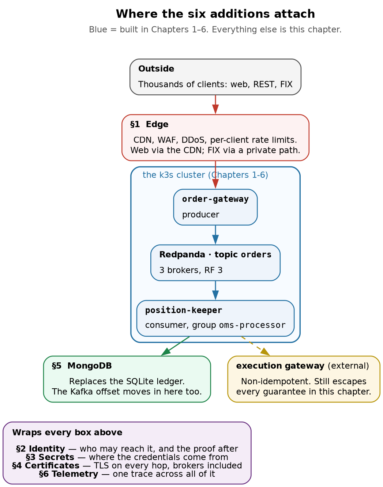
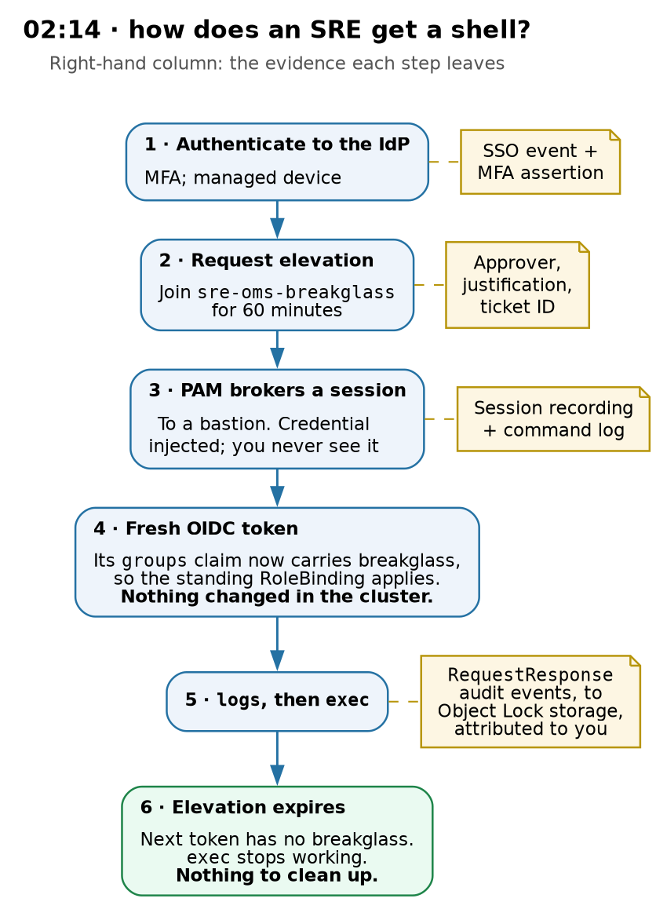

# Kubernetes + Redpanda · Chapter 7 — The Rest of the Platform: Edge, Identity, Secrets, Certificates, Documents and Telemetry

> **Series:** Home-Lab Education · Phase 14 (Kubernetes + Redpanda)
> **Written:** August 2026
> **Read this after:** Chapters 1–6, which build the system this chapter extends

---

## How this chapter is different

Chapters 1 through 6 each open with a verified-facts header, because every command in them was executed on VM 186 and every output quoted is real. [**This chapter has no such header, and that is deliberate: nothing here was run in the lab.**]{custom-style="Key"} It is a research and design document.

That changes how you should read it. Where the earlier chapters tell you what *did* happen, [this one tells you what the industry does, why, and where it would attach to the system we built]{custom-style="Key"}. Version numbers, product states and regulatory dates were checked in July–August 2026 and are cited so you can re-verify them — several are moving targets, and two of them moved in the last twelve months in ways that change the right answer.

The purpose is to give you the shape of each area and the vocabulary to go deeper, [not to make you an expert in six domains at once]{custom-style="Key"}. Each section ends with the handful of things actually worth carrying into an interview or an incident.

> ⭐ **Why this chapter has no "Lab vs PROD" callouts, added Aug 13, 2026.** Chapters 1 through 6 were retrofitted with them: short pull-outs naming a place where the lab did something that would be *wrong* in production, and what breaks if the habit follows you. **This chapter gets none, and the reason is the point of the paragraph above** — [a callout contrasts *our lab practice* against production, and there is no lab practice here to contrast]{custom-style="Key"}. Everything in this chapter already *is* the production side of that comparison. ⚠️ **[Read the whole chapter as unverified by definition]{custom-style="Key"}.** The earlier chapters mark individual prescriptions as recited rather than tested; here that marking would apply to every sentence, so the declaration is made once, up front, instead of decorating every paragraph. **The gaps this chapter closes are listed in §0 — that table is the honest inventory of what Chapters 1–6 left undone.**

---

## What this chapter covers

The OMS from Chapters 1–6 is a real distributed system, and it is also a machine sitting on a bench with no case around it. [It has no front door, no identity model, no secrets, no certificates]{custom-style="Key"}, a database that holds one file, and telemetry you have to SSH in to read.

Six areas close that gap:

1. **Reverse proxy and traffic management** — how thousands of external users reach the system at all, and what the edge absorbs before traffic touches your cluster
2. **Identity and access management** — how hundreds of internal users get in, and how you prove afterwards who did what
3. **Secret and configuration management** — where credentials live, given that they currently live in plain environment variables
4. **Certificate management** — the PKI underneath all of it, and the most common self-inflicted outage in the industry
5. **Databases** — replacing the SQLite ledger with MongoDB, and the write-concern decisions that mirror `acks` exactly
6. **Telemetry** — OpenTelemetry, Prometheus, OpenSearch and Grafana, and the one thing Chapter 6 proved you cannot do without

A closing section walks a single order through the whole assembled stack, which is where these six stop being a list and become a system.

---

## 0. What we are extending, and at what scale



> **Two of the six sit in the request path. Four wrap everything.**
>
> That asymmetry is worth noticing early. The edge and the database are things an order passes *through*. [Identity, secrets, certificates and telemetry are properties of every hop, which is why they are the ones that get retrofitted badly.]{custom-style="Key"}

### What Chapters 1–6 actually built

| Piece | What it is | Chapter |
|---|---|---|
| **k3s cluster** | Single node, `vm-k8-redpanda-1`, conformant Kubernetes in one binary | 1 |
| **Deployments, probes, rollouts** | The object model, readiness versus liveness, requests and limits | 2 |
| **Redpanda** | Three brokers, StatefulSet, RF 3, real Raft quorum on one failure domain | 3 |
| **Topic provisioning** | A seeding Job, and the gap between "infrastructure green" and "service usable" | 4 |
| **Consumer groups** | Partition assignment, rebalancing, lag, replay and its side effects | 5 |
| **`order-gateway`** | Python producer, emits order lifecycle events keyed by `order_id` | 6 |
| **`position-keeper`** | Python consumer, maintains a position ledger, calls an external execution gateway | 6 |

The data path is one sentence: **an order event is produced keyed by `order_id`, lands on one partition, is consumed in order, updates a ledger idempotently on `(order_id, seq)`, and triggers a non-idempotent external call.** Everything in this chapter either protects that path, observes it, or supplies it with something it currently fakes.

### The scale we are designing for

The lab is one VM serving one user. The target is a production platform for a broker-dealer. Those differ by more than a replica count, so the rest of this chapter assumes the following working profile. **These are assumptions, chosen to make the design concrete** — substitute your real numbers and most of the reasoning holds, but some thresholds move.

| Dimension | Assumed production profile | Why it changes the design |
|---|---|---|
| **External users** | Low thousands of client-facing users placing orders through a web app and a REST/FIX API | Enough to need a CDN, a WAF and real rate limiting; not enough that the edge is your dominant cost |
| **Internal users** | Several hundred — traders, operations, client service, compliance, engineering | Too many for ad-hoc access; this is the number at which PAM and recertification stop being optional |
| **Privileged internal users** | Tens, not hundreds — the SREs and DBAs who can reach production | The population whose every session must be attributable |
| **Order flow** | Bursty. A large fraction of the day's volume in the first and last thirty minutes | Rate limits and autoscaling must be sized to the burst, not the mean |
| **Availability expectation** | Market hours are hard hours. Off-hours are maintenance windows | Rotation, upgrades and cert renewals get scheduled around the session, not around your calendar |
| **Retention** | Books and records for years, not days | Kafka retention is not archival; see §6 |

Two numbers in that table do most of the work. **[Thousands of external users means the edge is a real system with its own failure modes, not a load balancer.]{custom-style="Key"}** And **hundreds of internal users means identity is a lifecycle problem** — joiners, movers, leavers, quarterly recertification — rather than a list of people you happen to know.

### The seven gaps, and where each is closed

| What the OMS is missing today | Consequence | Closed in |
|---|---|---|
| No ingress from outside the LAN | Nobody outside the lab can place an order | §1 |
| No edge protection | The first hostile scan reaches your Traefik directly | §1 |
| No user identity, internal or external | Every action is anonymous | §2 |
| Credentials in plain environment variables | `kubectl describe pod` prints them | §3 |
| No TLS anywhere — not to clients, not between brokers | Everything on the wire is readable | §4 |
| A ledger in a single SQLite file on one node | Chapter 1 already showed why node-local storage cannot survive the node | §5 |
| Telemetry you must SSH in to read | Chapter 6's hung consumer looked identical to a healthy one | §6 |

---

## 1. Reverse proxy, CDN and traffic management

### The layers, and what each is actually for

"Put it behind Cloudflare" [collapses six distinct jobs into one phrase. They fail independently and are worth separating]{custom-style="Key"}.

| Layer | The problem it solves | Where it runs |
|---|---|---|
| **Anycast edge / CDN** | Terminate TLS close to the user; absorb volumetric attacks across many points of presence | The provider's network |
| **DDoS scrubbing** | Drop volumetric floods before they reach your transit | The provider's network |
| **WAF** | Block injection, exploit and scanning traffic by inspecting requests | The provider's network, or your own proxy |
| **Global load balancing** | Steer traffic between regions on health and latency | DNS or anycast |
| **Reverse proxy** | Terminate connections, route by host and path, re-originate to backends | Your edge, or in-cluster |
| **API gateway** | Authenticate, authorise, rate limit and quota *per client* | In front of, or inside, the cluster |
| **Ingress / Gateway API** | Get traffic from the cluster edge to a Service | In-cluster |

The confusion that causes real problems is between the **WAF** and the **API gateway**. [A WAF makes decisions on request *shape* — it does not know that this client is entitled to trade this account.]{custom-style="Key"} An API gateway makes decisions on *identity and entitlement* and cannot tell you whether the payload contains an exploit. Neither substitutes for the other, and pushing business authorisation into WAF rules is a well-trodden path to an unmaintainable ruleset.

### What changed in Kubernetes ingress, and it matters here

Chapter 1 noted that k3s ships Traefik as its built-in ingress controller. Two developments make the ingress question worth revisiting rather than inheriting:

- **The Ingress API is feature-frozen**, and **Gateway API is its designated successor**, now GA for `Gateway`, `GatewayClass`, `HTTPRoute`, `GRPCRoute` and `TLSRoute` ([Kubernetes docs](https://kubernetes.io/docs/concepts/services-networking/gateway/)).
- [**Ingress NGINX reached end of life in March 2026**]{custom-style="Key"} ([Datadog's migration guide](https://www.datadoghq.com/blog/migrate-to-gateway-api/) covers the practical path). If you inherit a cluster running it, migration is a security obligation, not a nice-to-have — future vulnerabilities will have no supported fix.

The development most relevant to an OMS is newer still: **Gateway API v1.6 graduated `TCPRoute` and `UDPRoute` to Standard** ([release announcement](https://kubernetes.io/blog/2026/08/03/gateway-api-v1-6-release/)). [Raw layer-4 routing now has a stable, portable Kubernetes API — which is exactly what FIX traffic needs]{custom-style="Key"}, and which previously forced you into vendor-specific annotations or a separate load balancer.

### What a CDN does and does not do for an OMS

Here is the honest version, and it is the opposite of the usual pitch. **[Almost all OMS traffic is dynamic, authenticated and uncacheable.]{custom-style="Key"}** An order submission cannot be served from cache. A position query is per-user and changes constantly. If you evaluate a CDN on cache hit ratio for this workload, it will look worthless.

The value is real but it is somewhere else:

| What you actually get | Why it matters here |
|---|---|
| **Volumetric DDoS absorption** | An attack is absorbed across the provider's global capacity instead of saturating your transit |
| **TLS termination near the user** | The handshake round trips terminate at a nearby city rather than crossing an ocean |
| **A single enforcement point** | WAF, bot management and rate limiting applied consistently, ahead of your origin |
| **Origin concealment** | Your real addresses are not public, so attackers cannot bypass the edge |
| **Static and portal assets** | The marketing site, the web app bundle, the documentation — genuinely cacheable |

Cloudflare's relevant products for this shape of system are the proxy and WAF, Rate Limiting Rules, **Spectrum** for non-HTTP TCP (which is how FIX would traverse it at all), **Tunnel** for origin connectivity without inbound ports, **Access** for internal users, and Turnstile for the retail login flow.

### The latency question, which you should not gloss over

An order path is latency-sensitive, and [**terminating TLS at an edge and re-originating adds hops**]{custom-style="Key"}. That is a genuine cost, not a rounding error, and it is why firms typically split the traffic rather than routing everything the same way:

| Traffic | Path | Reasoning |
|---|---|---|
| Marketing site, docs, web app assets | CDN | Cacheable, public, latency-tolerant |
| Retail web order entry | CDN or edge proxy | The human's own network latency dominates anyway; the DDoS and bot protection is worth the hops |
| **Institutional API and FIX order flow** | **Direct private path** — private interconnect, cross-connect, dedicated circuits | Latency is the product. These clients often colocate, and a public-internet detour is unacceptable |

Deciding this deliberately is the mark of someone who has thought about it. "Everything goes through the CDN" and "the CDN adds latency so we use nothing" are both wrong answers.

### FIX is not HTTP, and nearly nothing above applies to it

[FIX sessions are **long-lived persistent TCP connections** carrying a sequenced message stream]{custom-style="Key"}, often held open for the entire trading day. That breaks most of the HTTP-shaped tooling:

- There are no requests to cache, no paths to route on, and no headers for a WAF to inspect.
- Authentication happens **once per session** (SenderCompID/TargetCompID, IP allowlists, and ideally TLS client certificates), not per message.
- [Any proxy in the path becomes a **stateful dependency**. Its idle timeout can silently kill a quiet session]{custom-style="Key"}; its restart drops every session at once.

The operational consequences deserve their own list, because they are where this goes wrong:

- [**Idle timeouts must exceed the FIX heartbeat interval**, or quiet sessions die mysteriously overnight]{custom-style="Key"}.
- **A proxy restart is a mass disconnect.** [Every client reconnects simultaneously and replays from its last sequence number — a thundering herd with a correctness dimension]{custom-style="Key"}, because sequence gaps trigger resend requests.
- **Deploys need connection draining**, and draining a connection that is meant to last eight hours means either waiting for the session to end or forcing a reconnect at a chosen moment. Choose the moment: outside market hours.
- **Sticky routing matters**, because FIX session state lives somewhere.

### Rate limiting, and the market-open problem

This is the area where a generic answer is most obviously wrong for a trading platform.

| Algorithm | Behaviour | Where it fits |
|---|---|---|
| **Token bucket** | Allows bursts up to bucket size, then sustains at the refill rate | The right default for API clients — it tolerates legitimate bursts |
| **Leaky bucket** | Smooths output to a constant rate | Protecting a fragile downstream that cannot burst |
| **Sliding window** | Accurate count over a moving period | Quotas and billing, where precision matters more than smoothness |
| **Fixed window** | Simple, but allows 2× the limit across a boundary | Avoid for anything that matters |

Two of those rows carry the whole decision. [**Token bucket is the right default precisely because it tolerates bursts**]{custom-style="Key"}, which is the shape of real OMS traffic; [**fixed window should be avoided because it permits 2× the limit across a boundary**]{custom-style="Key"} — two full bursts back to back, one on each side of the reset.

**[The critical design point: a global rate limit is the wrong control.]{custom-style="Key"}** If the limit is shared, one algorithmic client having a bad morning consumes the budget and every other client is throttled — [you have converted one client's bug into a platform-wide outage]{custom-style="Key"}, and you will explain that to the other clients. **Limits must be per client, with per-client quotas**, so the blast radius of any one participant's behaviour is that participant.

Then the genuinely hard part: **at market open, the burst is legitimate.** [A rate limiter tuned to the daily mean will reject real orders in the first minutes of trading]{custom-style="Key"}, which is the worst possible time to be wrong. Approaches that work, in combination:

- **Size limits to the observed peak**, not the mean, and review them against actual open-period traffic each quarter.
- **Per-client burst allowances** sized from that client's own historical open behaviour, so a client that always sends 500 orders at the bell is not treated as anomalous.
- **Layer the limits**: a coarse volumetric limit at the edge, a per-client quota at the API gateway, and a business-level control (order value, position limits, order-to-trade ratio) in the application. Only the last one understands what an order *means*.
- **Shed by priority, not arbitrarily.** A cancel request should outrank a new order — [refusing a cancel while accepting new orders is exactly backwards from a risk standpoint]{custom-style="Key"}.

And the part specific to trading clients: **a naive 429 can make things worse.** Automated clients frequently retry immediately and aggressively, so [rate limiting without `Retry-After` and without client-side backoff produces a retry storm that amplifies the overload]{custom-style="Key"}. Worse, for a non-idempotent order submission, a client that retries an ambiguous rejection may submit the order twice — the same ambiguity Chapter 6 explored with `wtimeout` and delivery semantics. **[Order submission needs a client-supplied idempotency key regardless of what the rate limiter does.]{custom-style="Key"}**

### WAF, and why it starts in log mode

[A WAF's failure mode on an OMS is not that it misses an attack. It is that **a managed ruleset blocks legitimate order flow**]{custom-style="Key"} — a base64 payload that trips an injection signature, a JSON field that looks like a path traversal, an unusual user agent from a client's trading system.

Run new rulesets in **log or monitor mode first**, for long enough to cover a full cycle including a busy open and a month-end. Then enable enforcement selectively. For authenticated API traffic specifically, consider whether the WAF is buying you anything at all beyond what schema validation and authentication already provide — [a strict schema on a well-defined order API is a better control than a generic ruleset]{custom-style="Key"}, and it does not have false positives.

### Where TLS terminates

| Model | What the edge sees | Use when |
|---|---|---|
| **Edge termination** | Plaintext | You want WAF inspection and caching, and the edge-to-origin hop is trusted or separately encrypted |
| **Re-encryption** | Plaintext, then a new TLS session to origin | The default for production: inspection at the edge, encryption on the wire everywhere |
| **Pass-through** | Nothing — opaque bytes | Client-certificate authentication must reach the origin, or regulation forbids third-party decryption |

For client certificate authentication specifically, decide early **whether the edge validates the certificate and passes an assertion downstream, or whether the connection passes through and the origin validates it.** Both work. Mixing them, or assuming the origin still sees a client certificate that the edge already terminated, is a common and confusing failure.

### The real client IP problem, which is a compliance problem here

When traffic passes through a proxy, [**the origin sees the proxy's address, not the client's.**]{custom-style="Key"} The real address arrives in a header — `X-Forwarded-For`, or a provider-specific one such as `CF-Connecting-IP`. Three consequences, and the third is the one that matters at a broker-dealer:

1. **IP allowlists silently stop working**, because every connection now appears to come from the proxy's ranges.
2. **Rate limiting keyed on source IP collapses**, since all clients share an apparent address — another reason to key on authenticated client identity instead.
3. **Your audit trail records the wrong source.** ["Which IP address did this order come from" is a question you will be asked, and answering it with a Cloudflare address is not an answer.]{custom-style="Key"} The forwarded header has to be captured, trusted only from known proxy ranges (or it is trivially spoofable), and carried into the order record.

### Failover, and how it interacts with Chapter 2

Two mechanisms, with different failure characteristics. **Anycast** withdraws a route and traffic reconverges in seconds without client involvement. **DNS-based failover** is subject to the **TTL problem**: [your 60-second TTL is a suggestion, and resolvers, browsers and JVMs cache well beyond it]{custom-style="Key"} — the JVM historically caching DNS for the process lifetime. Plan for a long tail of clients still reaching the dead endpoint, and never treat a DNS change as a fast rollback.

The in-cluster half of this is a direct extension of Chapter 2. A rolling deployment removes a pod from endpoints and sends `SIGTERM`, and the pod must **keep serving in-flight requests while failing its readiness probe** — the distinction Chapter 2 drew between readiness and liveness, now with a load balancer on the other end of it. For long-lived connections the same logic applies over a much longer horizon: the proxy must stop routing *new* connections to a draining backend while existing ones finish.

### Zero Trust for internal users, and a warning

Several hundred internal staff need Grafana, admin interfaces and internal tooling. The modern pattern replaces the VPN: an outbound-only connector (Cloudflare Tunnel or equivalent) means **no inbound ports at all**, and an identity-aware proxy (Cloudflare Access) authenticates every request against your IdP before it reaches the application. This is a genuine improvement — it removes the flat network that a VPN gives you, and it puts the §2 identity model in front of tools that usually have weak native authentication.

The warning comes from a real event. In the **Cloudflare outage of 18 November 2025** — their worst since 2019 — [a ClickHouse permissions change caused a Bot Management configuration file to double in size]{custom-style="Key"}, exceed a preallocated memory limit in the core proxy, and panic. Core traffic failed from 11:20 UTC and was not fully restored until 17:06 ([Cloudflare's postmortem](https://blog.cloudflare.com/18-november-2025-outage/)).

The detail worth internalising is not the root cause. It is that **Cloudflare Access and Turnstile were impacted by the same failure.** [If your front door and your administrative access path are the same vendor, one incident can take away both your service *and* your ability to log in and fix it.]{custom-style="Key"} That is a correlated failure, and the mitigation is the same as everywhere else in this chapter: a tested break-glass path with independent failure modes.

Note also what the root cause was — [**not an attack, but a routine internal configuration change.** That is the dominant cause of large-scale outages now]{custom-style="Key"}, and it is the argument for treating edge configuration with the same change control as application code.

### Observability at the edge

The edge sees things the cluster cannot: requests blocked before they arrived, TLS versions and cipher suites, client geography, and the true origin address. It is also the only place that can measure **what a user experienced when your origin was unreachable** — during an origin outage your in-cluster metrics show nothing at all, because nothing arrived.

The requirement that makes this usable is **correlation**. The edge must stamp a request ID, propagate it to the origin, and the application must log it and attach it to traces. Without that, [an edge log and an application log are two unjoinable datasets]{custom-style="Key"}, and every investigation starts with timestamp arithmetic. This is the same problem §6 solves inside the cluster with trace context — the edge is simply the first hop, and it should be the origin of the trace, not a gap before it.

> **What to carry from this section**
>
> - The layers solve different problems; **a WAF judges request shape, an API gateway judges identity and entitlement**, and neither substitutes for the other.
> - **Most OMS traffic is uncacheable**, so a CDN's value here is DDoS absorption, TLS proximity, a single enforcement point and origin concealment — not cache hit ratio.
> - **Split the paths.** Public web through the CDN; institutional API and FIX order flow over a direct private path, because latency is the product.
> - **FIX is long-lived TCP**, so idle timeouts, mass reconnects and connection draining are the operational concerns, not caching or routing.
> - **A global rate limit is the wrong control** — one client's bad morning must not throttle everyone else. Limits belong per client, sized to the market-open peak.
> - **Preserve the real client IP**, or your allowlists, your rate limits and your audit trail are all quietly wrong.
> - **The November 2025 Cloudflare outage took down Access along with the CDN** — if your front door and your break-glass path share a vendor, they share an outage.

---

## 2. Identity and access management

[Two populations, two entirely different problems, and conflating them is the most common structural mistake in this area.]{custom-style="Key"}

**Thousands of external users** are customers. They authenticate to place orders, and the hard part is not proving who they are — [it is deciding what they are entitled to do]{custom-style="Key"}. **Hundreds of internal users** are staff. Most need read access to a handful of systems; a few dozen can reach production, and for those the hard part is proving afterwards exactly what they did.

The first is customer identity (CIAM). The second is workforce identity plus **privileged access management (PAM)**. They share protocols and almost nothing else.

### 2a. External users: authentication is the easy half

For a client-facing trading platform the authentication story is conventional — OIDC against a customer identity provider, MFA, session management, device binding. The part that is specific to a broker-dealer is **entitlement**, and it is not something an IdP answers.

| Question | Answered by | Where it lives |
|---|---|---|
| Who is this? | Authentication (OIDC) | The IdP |
| Are they allowed to use the platform? | Coarse authorisation | The IdP, via group or role claims |
| **Which accounts may they trade for?** | **Entitlement** | **Your domain model, not the IdP** |
| Which instruments, order types and size limits? | Entitlement plus pre-trade risk | Your domain model |
| Is this specific order within their limits? | Pre-trade risk check | In the order path, synchronously |

The trap is putting entitlement in the token. A JWT claim listing every account a user may trade is tempting, and [it breaks the moment entitlements change mid-session or a user has hundreds of accounts]{custom-style="Key"}. Tokens are cached, replayed and long-lived relative to entitlement changes. **[Authenticate with the token; authorise against current state.]{custom-style="Key"}**

For programmatic clients — the API and FIX users, who at this scale are often the ones generating most of the volume — the model differs again:

- **OAuth 2.0 client credentials** for REST API clients, with a distinct principal per client application, not per human.
- **FIX sessions** authenticate at the session level (SenderCompID/TargetCompID plus, ideally, TLS client certificates) rather than per message. This is its own credential lifecycle, and it is frequently the one nobody has automated.
- **Per-client rate limits and quotas**, enforced at the edge (§1) and again in the application, because the edge cannot see business meaning.

### 2b. Internal users: the lifecycle is the work

At a few hundred internal users, identity stops being a list and becomes a set of processes. What auditors actually test:

| Process | What it means | The failure they look for |
|---|---|---|
| **Joiner** | Access provisioned from an authorised request tied to a role | Access granted by a Slack message |
| **Mover** | Old access removed when someone changes teams | Accumulated entitlements — the ten-year employee who can do everything |
| **Leaver** | Access removed same day | The contractor whose account worked for three months after the engagement ended |
| **Recertification** | Periodic review with a named reviewer and evidence the revocations happened | A campaign that was completed but never enforced |

The mechanism is an IdP (Okta, Entra ID, Ping) fed by HR, pushing to applications over **SCIM**, with SAML or OIDC for login. The key architectural rule: [**the IdP is the only identity source.**]{custom-style="Key"} Anything holding local accounts — including the PAM system itself — becomes a place a leaver survives.

### 2c. Privileged access, and what Symantec PAM actually is

PAM answers a narrower question than IAM: *may you, right now, act as this privileged account on this asset, and what did you do while you were there?*

| Concept | What it buys you |
|---|---|
| **Credential vaulting and rotation** | No shared password in a wiki; the human may never see the credential at all |
| **Session brokering** | The user's laptop never talks to production directly; a proxy terminates and re-originates |
| **Session recording** | Replayable evidence of a privileged session |
| **Command filtering** | Deny or allow specific commands within a brokered session |
| **JIT elevation** | Rights granted at request time that expire on their own |
| **Zero standing privilege** | No durable privileged identity exists to steal; each session mints an ephemeral credential |
| **Break-glass** | A pre-staged emergency path, loudly alarmed and rotated after use |

**On Symantec PAM specifically**, since the job description names it. It is alive and supported: Broadcom ships **4.3.1**, documentation updated May 2026, under the Symantec Identity Security portfolio. Version 4.1 reached end of service in April 2025. But it is no longer a market leader — [Broadcom was profiled in the September 2024 Gartner PAM Magic Quadrant and is **absent from the twelve vendors in the October 2025 edition**]{custom-style="Key"}, where the Leaders are BeyondTrust, CyberArk and Delinea. Treat it as a mature incumbent you may have to operate rather than the architecture you would choose today.

Three operational details worth knowing if you inherit it. Release 4.3 added **Local Streaming Storage**, which buffers session recordings on the appliance before offloading them — this exists because network blips used to silently lose recordings, which is the classic audit finding. Recording still requires external NFS/CIFS/S3 storage, and the correct default is that a session requiring recording is **refused** if that storage is unavailable rather than run unrecorded. And in 4.3.1 the browser-based RDP and SSH applets were removed entirely, so any runbook that says "open the PAM web UI and click SSH" is wrong on the current release.

### 2d. How this attaches to our cluster



> **[The elevation expires by itself. That is the property that makes the whole design work]{custom-style="Key"} — there is no cleanup step for anyone to forget.**
>
> Every step produces an artefact, and all of them resolve to a single identity. That correlation is the deliverable: an auditor asking "who touched production at 02:14, under what approval, and what did they run" gets one answer from four independent systems.

[There is **no out-of-the-box Kubernetes connector** in Symantec PAM]{custom-style="Key"}. That is not a gap to work around so much as a design constraint that pushes you toward the right answer anyway: PAM brokers and records the *human session*, and the *API credential* comes from OIDC.

**The problem to solve first.** Chapter 1 noted that `/etc/rancher/k3s/k3s.yaml` is mode 644 and called it a sandbox convenience. The precise statement is worse than that, and it is the single best thing to be able to say in an interview on this topic:

> That file holds a client certificate for a user in the `system:masters` group. [Membership in `system:masters` is **hardcoded in the API server** — it bypasses every RBAC check, and it bypasses authorization webhooks entirely]{custom-style="Key"}, so deleting every ClusterRoleBinding changes nothing. And [**Kubernetes has no certificate revocation**: no CRL, no OCSP. The only way to invalidate that certificate is to rotate the cluster CA.]{custom-style="Key"} Together those two properties make it an **irrevocable cluster-admin credential** sitting in a world-readable file.

[Mode 600 narrows the exposure. The actual fix is that **no human ever uses that file.**]{custom-style="Key"}

**What replaces it.** The API server trusts your IdP directly, and `kubectl` fetches a short-lived token per session:

| | Client certificate (today) | OIDC token |
|---|---|---|
| Lifetime | Months or years | Minutes |
| Revocation | None — rotate the cluster CA | Disable in the IdP; the token dies at expiry |
| Group change | Reissue the certificate | The next token carries the new groups |
| MFA | Not expressible | An `amr` claim you can enforce |
| Leaver on Friday | Still cluster-admin on Monday | Dead within the token TTL |
| Audit identity | A CN string | A stable IdP subject that joins to the SSO logs |

The row to commit to memory is the leaver: [**an SRE who resigns on Friday holding a client certificate is still `cluster-admin` on Monday**]{custom-style="Key"}, whereas an OIDC identity disabled in the IdP is dead within the token TTL. That asymmetry is the entire argument, and it is the version of it to make to an audit committee.

The current mechanism is **structured `AuthenticationConfiguration`**, which went GA in Kubernetes v1.34 and supersedes the older `--oidc-*` flags. It supports multiple issuers, dynamic reload without an API server restart, and CEL-based claim validation — so you can **[refuse a token at the API server that did not involve MFA, or whose lifetime exceeds policy]{custom-style="Key"}**, rather than trusting the IdP to have enforced it:

```yaml
apiVersion: apiserver.config.k8s.io/v1
kind: AuthenticationConfiguration
jwt:
  - issuer:
      url: https://idp.example.com/realms/prod
      audiences: ["kubernetes"]
    claimValidationRules:
      - expression: 'claims.exp - claims.nbf <= 3600'
        message: token lifetime must not exceed one hour
      - expression: 'claims.amr.exists(m, m == "mfa")'
        message: MFA is required for cluster access
    claimMappings:
      username: { claim: email,  prefix: "oidc:" }
      groups:   { claim: groups, prefix: "oidc:" }
```

**Scoping what an SRE can do.** The verbs that matter are not the obvious ones. In namespace `market`, `create` on `pods/exec` means a shell inside `order-gateway`, which means the ability to **inject a synthetic order** — that is not a configuration change, [it is a market-facing transaction performed by someone who may not be licensed to perform it]{custom-style="Key"}. Framing exec rights that way shortens the control conversation considerably.

| Verb or resource | Why it is privilege escalation |
|---|---|
| `create` on `pods/exec` | A shell in the OMS; the ability to produce orders |
| `get` on `secrets` | Reads the Kafka and database credentials directly |
| `get` on `nodes/proxy` | Executes in **any** pod on the node, **bypassing audit logging and admission control** |
| `create` on `serviceaccounts/token` | Mints tokens for other, more privileged service accounts |
| `escalate` / `bind` | Grants rights the holder does not have — the documented exceptions to RBAC's anti-escalation guard |
| `create` on `pods` | Without the `restricted` PSA, a `hostPath: /` pod reads the kubeconfig. **The PSA is an access control, not a hardening preference.** |

Two of those rows deserve pulling out of the table. [**`get` on `nodes/proxy` is the one people miss**: it executes in any pod on the node while bypassing audit logging and admission control]{custom-style="Key"}, which means it defeats the evidence trail the rest of this section is built on — an attacker using it leaves no record of what they ran. And [**the `restricted` PSA is an access control, not a hardening preference**]{custom-style="Key"}; without it, `create` on `pods` is a `hostPath: /` mount away from the node's kubeconfig.

The workable pattern is **standing read-only, elevation on demand**: a `ClusterRole` granting `get`/`list`/`watch` bound into `market` for the SRE group, and a second binding for an incident group that adds `pods/exec` and `scale`. Crucially, [the RoleBindings are static and permanent — **what expires is the IdP group membership**]{custom-style="Key"}. Elevation is granted and revoked in the system that already logs, approves and recertifies it, which is far easier to evidence than a controller creating and deleting bindings.

**What the audit log must capture.** Rules are first-match, so ordering matters, and two settings are traps: [never log Secrets at `RequestResponse` (you will copy every credential in the cluster into a log aggregator with a wider access model)]{custom-style="Key"}, and reserve the highest level for the events that matter.

| Resource | Level | Why |
|---|---|---|
| `/healthz`, `/livez`, `/metrics` | `None` | Volume, and no evidentiary value |
| `pods/exec`, `pods/attach`, `pods/portforward` | `RequestResponse` | The highest-value events in the cluster |
| RBAC objects | `RequestResponse` | Authorisation changes |
| `tokenreviews`, `serviceaccounts/token` | `RequestResponse` | Credential minting |
| `secrets` | `Metadata` | Metadata only, deliberately |
| Everything else | `Metadata` | The sensible default |

Then ship it off-host. **[Audit logs on the node are within the blast radius of whoever compromises the node]{custom-style="Key"}** — including the SRE you are trying to hold accountable. They belong in object storage with Object Lock, where the writing identity cannot delete them or shorten their retention.

This connects to a regulatory point that is genuinely useful to know. **SEC Rule 17a-4**, as amended in October 2022 with a compliance date of May 2023, added an **audit-trail alternative to WORM storage**: records may be preserved under a complete, time-stamped audit trail capturing every modification and deletion together with the identity of the person who performed it. That is precisely the shape of a Kubernetes audit log in an Object Lock bucket. [Your `kubectl` audit stream, framed correctly, is not an operations nicety — it is recordkeeping infrastructure.]{custom-style="Key"}

### 2e. Least privilege on Redpanda

The OMS's other privileged surface is the Kafka API, and here least privilege is defined by **what you withhold**.

```bash
# order-gateway: produce to orders. Nothing else.
rpk security acl create --allow-principal User:order-gateway \
  --operation write,describe --topic orders
rpk security acl create --allow-principal User:order-gateway \
  --operation idempotentwrite --cluster      # only if enable.idempotence=true

# position-keeper: read orders as group oms-processor. Nothing else.
rpk security acl create --allow-principal User:position-keeper \
  --operation read,describe --topic orders
rpk security acl create --allow-principal User:position-keeper \
  --operation read --group oms-processor
```

| Withheld | What granting it would mean |
|---|---|
| `WRITE` on `orders` for `position-keeper` | A consumer bug or a compromised consumer could **inject orders**. This is the segregation-of-duties boundary that matters most here. |
| `READ` on `orders` for `order-gateway` | A producer has no business reading the order book |
| `DELETE` on any topic | `rpk topic delete orders` destroys books and records |
| `ALTER` / `ALTERCONFIGS` | **Lowering `retention.ms` destroys regulated records as surely as deleting the topic, and much more quietly** |
| Group `DELETE` | Deleting `oms-processor` resets committed offsets — a replay, with all of Chapter 5 §9's consequences |

The quiet one in that table is `ALTERCONFIGS`. [**Lowering `retention.ms` destroys regulated records as surely as deleting the topic, and much more quietly** — a topic deletion is conspicuous]{custom-style="Key"} and gets noticed, whereas a retention change reads as routine tuning and expires the evidence on a timer. Treat `ALTERCONFIGS` on a records topic as a recordkeeping control rather than an operational convenience. In the other direction, the grant most worth withholding is [**`WRITE` on `orders` for `position-keeper`**: that is the segregation-of-duties boundary that matters here]{custom-style="Key"}, because a consumer bug or a compromised consumer must never be able to inject orders.

Two mechanical details. Redpanda 25.x and later support **roles**, so you bind ACLs to `OMS-Producers` and assign principals to it — the same argument as ClusterRole plus RoleBinding, and much easier to recertify because a reviewer sees one role rather than forty ACL rows. And note an asymmetry that catches people: **SASL principals carry the `User:` prefix; OIDC-derived principals do not**, so an ACL written as `User:order-gateway` will not match an OIDC principal mapping to `order-gateway`.

Human access to `rpk` deserves the same treatment as `kubectl`. In particular `rpk group seek` [rewinds committed offsets, which in a live OMS causes exactly the duplicate-processing incident Chapter 5 measured at 821,600 phantom shares]{custom-style="Key"}. That command belongs behind four-eyes approval.

### 2f. The traps

- **Credential rotation breaks running applications, hours later.** PAM rotates a password on schedule; the application read it once at startup and holds it in a connection pool; [everything fails at the next reconnect, long after the change, which destroys the causal link during triage]{custom-style="Key"}. Mitigate by fetching on demand rather than at startup, by dual-credential alternating rotation, and by never scheduling rotation during market hours. Alert on **authentication-failure rate per principal** — the broker sees the SASL failures before your error budget does.
- **Application-to-application credential fetch makes PAM a runtime dependency.** [The moment a pod calls PAM at startup, the PAM appliance has the same availability requirement as your database.]{custom-style="Key"} Decide fail-open versus fail-closed explicitly; for an OMS, crash-looping beats running blind. Symantec's A2A model authorises on requestor *script path and host*, which fits containers badly — a real reason teams put Vault in front of Kubernetes workloads and leave A2A for the legacy estate.
- **Session recording has more gaps than people expect.** It captures the brokered session. It does not capture a copied kubeconfig used from a laptop, the CI/CD pipeline, or the `nodes/proxy` websocket. Recording is necessary and not sufficient; the API audit log covers what the proxy cannot see.
- [**Impersonation breaks naive attribution.**]{custom-style="Key"} `kubectl --as` is logged with both the impersonator and the impersonated identity, but a SIEM query keyed only on the effective user will credit the action to the wrong person. Constrained impersonation went beta and on-by-default in v1.36, which finally lets you scope `--as` to specific verbs and resources.
- **Break-glass is only real if it is tested.** Untested emergency access fails at 02:00 because the password expired or a hardening script disabled the account. For Kubernetes specifically, [hold the emergency certificate against a **`cluster-admin` ClusterRoleBinding, never against `system:masters`**]{custom-style="Key"} — because you can delete a binding, and you cannot revoke a certificate.
- **If the IdP is unreachable, nobody can authenticate to the API server at all.** That is the standing objection to OIDC and it has a real answer: multiple JWT authenticators in the structured config, plus an offline break-glass certificate.

> **What to carry from this section**
>
> - External identity is authentication plus **entitlement**, and entitlement does not belong in the token.
> - A `system:masters` client certificate is an **irrevocable cluster-admin credential**; that single fact justifies the whole OIDC migration.
> - PAM's contribution to Kubernetes is the **recorded human session**, not the API credential. There is no native connector; design for the bastion pattern deliberately.
> - Implement JIT elevation as **time-bounded IdP group membership** against static RoleBindings.
> - Withholding `DELETE` and `ALTERCONFIGS` on Kafka topics is a **recordkeeping control**, not hygiene.
> - An immutable, attributed audit log maps directly onto **SEC 17a-4's audit-trail alternative** to WORM.

---

## 3. Secret and configuration management

### What the OMS does today, and why it is worse than it looks

Every setting in Chapters 4 through 6 arrives as a plain environment variable — `BROKERS`, `TOPIC`, `ACKS`, `GROUP`, `ORDERS`. That was the right call for a teaching lab. [It is also the pattern that, once a real credential is added, produces the most common secret leak in Kubernetes]{custom-style="Key"}.

Environment variables are visible in `/proc/<pid>/environ` to anything in the same container, are inherited by every child process, and land in crash dumps, core files and error-reporting payloads. `kubectl describe pod` prints any literal `value:` field, and so does `kubectl describe replicaset`, and so do controller logs and events. [A secret in an environment variable is a secret in a dozen places you did not choose.]{custom-style="Key"}

[Moving them into a Kubernetes `Secret` is a real improvement, and it is not secret management]{custom-style="Key"}. Four claims worth being able to state precisely:

1. **base64 is an encoding, not encryption.** The Kubernetes documentation says so outright: Secrets are stored unencrypted in etcd by default.
2. **Encryption at rest is off until you turn it on**, and enabling it does not encrypt objects that already exist — you must rewrite every one of them. On k3s, `--secrets-encryption` uses a local AES key sitting on the same node as etcd, which is honestly described as compliance-grade rather than attacker-grade. [KMS v2 (stable since Kubernetes 1.29) is the only variant that meaningfully separates the key from the data.]{custom-style="Key"}
3. **RBAC on Secrets is coarser than people assume.** `list` on Secrets returns *values*, not just names, and many people grant it thinking otherwise. More importantly, **[anyone who can create a Pod in a namespace can read every Secret in that namespace]{custom-style="Key"}** — mount it and print it. So `create pods` is approximately equal to `get secrets`, and that includes the indirect paths through Deployments, Jobs and CronJobs.
4. **There is no lifecycle.** No versioning, no rotation, no expiry, no dynamic issuance, no per-access audit record.

**The honest framing: [Kubernetes Secrets are a distribution mechanism with an access-control model, not a management mechanism.]{custom-style="Key"}** Vault supplies the management. The Secret can remain the delivery channel.

### What Vault adds, and its state in 2026

| Capability | What it means for the OMS |
|---|---|
| **KV v2** | Versioned static secrets, with rollback and soft delete |
| **Database secrets engine** | A *dynamic* MongoDB credential created per lease and destroyed at expiry |
| **PKI engine** | A full CA, which is where §4 attaches |
| **Transit** | Encryption as a service — the application never holds the key |
| **Audit devices** | A per-request record of who read which secret, when |

The dynamic credential is the headline. Rather than a password `position-keeper` holds forever, Vault mints `v-kubernetes-position-k-8tLpu816obl-1755656708` [with a one-hour lease and drops the user when it expires]{custom-style="Key"}. The username itself encodes the auth method, role and timestamp, so `db.currentOp()` inside MongoDB becomes an audit trail.

On the state of the product, since it moves: **IBM closed the HashiCorp acquisition on 27 February 2025**, and IBM is now the named Licensor in Vault's BUSL 1.1 file. BUSL restricts hosting Vault as a competing service and has never restricted a bank running it internally — the 2023 panic was about cloud vendors, not end users. **Vault 2.0 went GA on 14 April 2026** (latest patch 2.0.3), and it is a genuine major version, not a 1.22. The breaking change that matters most: **[the rekey and key-update endpoints now require a valid token in addition to seal or recovery key fragments]{custom-style="Key"}**, which quietly invalidates most written break-glass runbooks. **OpenBao**, the MPL 2.0 fork now under LF Edge, is at 2.6.1 and genuinely healthy; you give up namespaces, replication and FIPS-validated builds, which is usually what keeps regulated shops on Enterprise.

### How a pod proves who it is

This is the mechanism question, and it is worth knowing exactly.

The pod reads its **projected ServiceAccount token** and posts it to Vault's Kubernetes auth endpoint. Vault calls the Kubernetes **TokenReview** API to validate it, learns that the caller is `system:serviceaccount:market:position-keeper`, and returns a Vault token carrying the policies bound to that identity.

**[The binding triple is `(ServiceAccount name, namespace, Vault policy)`. That is the entire identity model.]{custom-style="Key"}** Setting `bound_service_account_names=*` alongside a broad namespace list is how organisations accidentally let every workload assume every role. Prefer TokenReview over local JWT signature validation, because only TokenReview detects a *revoked* token — and "we can revoke a workload's identity instantly" is the answer you want to have in a regulated environment.

### The constraint that decides the architecture

Chapter 6 set `automountServiceAccountToken: false` on both workloads, which was correct. It also rules out two of the four ways to deliver Vault secrets, because **[both the Vault Agent Injector and the Secrets Store CSI driver work by having the pod present its own ServiceAccount token.]{custom-style="Key"}**

| | **Agent Injector** | **Vault Secrets Operator** | **Secrets Store CSI** | **Direct API** |
|---|---|---|---|---|
| Where the secret lands | Memory-backed volume | A native Kubernetes Secret in etcd | tmpfs mount | Process memory |
| Works with `automountServiceAccountToken: false` | No, unless you add a projected token | **Yes** — the *operator* authenticates | No, unless you add a projected token | No |
| **Vault down: can a new pod start?** | **No** — the init container blocks | **Yes** — the Secret is already in etcd | **No** — the mount fails | Your choice |
| Autoscaling depends on Vault | Yes | **No** | Yes | Yes |
| Templating config files | Best in class | Via `SecretTransformation` | No | N/A |
| Cost | A sidecar per pod, forever | One controller | One DaemonSet | None |

**The recommendation for this system is the Vault Secrets Operator**, for three reasons in order: it is the only pattern that works without weakening the pod spec; [it keeps Vault off the pod-start critical path, so order entry can still recover during a Vault outage]{custom-style="Key"}; and it fits the existing `envFrom: secretRef:` shape with zero application change. The trade-off is explicit — **the secret is back in etcd**, so everything in the previous section applies and you owe it KMS v2 encryption, tight RBAC and `Metadata`-level audit.

If you do want the Injector's file templating (a `client.properties`, a JKS truststore), the fix keeps automount off and projects one narrow token:

```yaml
automountServiceAccountToken: false
volumes:
  - name: vault-token
    projected:
      sources:
        - serviceAccountToken:
            path: token
            audience: vault          # must match the Vault role's audience
            expirationSeconds: 3600
```

[Note what that pod did *not* receive: no `ca.crt`, no namespace file]{custom-style="Key"}, and no token usable against the Kubernetes API. That is the point.

### Two things that will bite this specific system

**First, and this is the sharpest OMS-specific finding in the whole chapter:** `librdkafka` — and therefore `confluent-kafka-python`, which both our applications use — [reads `sasl.username`, `sasl.password` and the TLS certificate paths **only at client construction**]{custom-style="Key"}. There is no supported way to swap a credential on a live `Producer` or `Consumer`. Established connections keep working because brokers do not re-authenticate an open connection. So the failure is invisible until something forces a reconnect.

> **[The credential expires at 02:00 and the outage happens at 09:15, when a broker restarts.]{custom-style="Key"}** Nothing in the intervening seven hours looks wrong, and the incident that eventually fires looks like it was caused by the restart.

The exception is **SASL/OAUTHBEARER**, which Redpanda supports and which librdkafka backs with an `oauthbearer_token_refresh_cb`. It is the only Kafka SASL mechanism designed for credentials that rotate. Note also that **[there is no Vault secrets engine for Kafka or Redpanda at all]{custom-style="Key"}** — you cannot `vault read redpanda/creds/order-gateway` — so the realistic automated path is mTLS certificates from cert-manager, which is §4.

**Second, rotation can trigger a rebalance.** The Vault Secrets Operator can restart a Deployment when a secret changes, via `rolloutRestartTargets`. For `position-keeper`, [a rollout restart is a **consumer group rebalance** — the partitions get reassigned and lag spikes]{custom-style="Key"}, exactly as Chapter 5 measured. Every hourly credential rotation would become a Kafka rebalance. The fix is to make the application re-read its credential on authentication failure rather than restarting, and to leave `rolloutRestartTargets` unset. There is a related trap: without `spec.hmacSecretData: true` the operator restarts the Deployment on *every* reconcile, and teams have reported thousands of ReplicaSet revisions and a permanently rolling Deployment.

### Rotation, leases and the pattern that actually works

- **`max_ttl` is a hard wall.** [Renewal extends a lease only up to `max_ttl` measured from *original issuance*.]{custom-style="Key"} A `1h`/`24h` role means the credential is dead at 24 hours regardless of how faithfully you renew. There is no renewing forever. System defaults for both `default_lease_ttl` and `max_lease_ttl` are 768 hours, and role TTLs are silently truncated to the mount's maximum.
- **Write explicit `revocation_statements` on every database role**, and run `rotate-root` immediately after configuring the connection so that not even you know the bootstrap password. Vault's generic default revocation statements are frequently wrong for a given environment, and the result is [thousands of orphaned `v-…` users accumulating in the database]{custom-style="Key"} — a routine and embarrassing audit finding.
- **Build for fail-and-reacquire, not renewal timers.** Catch the authentication error, re-read the credential, rebuild the client, retry with backoff. It survives lease expiry, manual revocation and Vault failover identically. The rule of thumb: **if an application cannot reconnect, do not give it dynamic credentials** — use a static role with scheduled rotation and a planned restart window. [Choosing dynamic credentials for an app that cannot re-authenticate is choosing a scheduled outage.]{custom-style="Key"}

Sensible TTLs for our two workloads fall straight out of their shapes: `order-gateway` is a Job that lives for minutes, so a 15-minute batch token with no renewal machinery at all; `position-keeper` runs forever, so one hour default and 24-hour maximum with fail-and-reacquire — which has the pleasant property that [**the re-authentication code path gets exercised every single day**]{custom-style="Key"} rather than for the first time during an incident.

### Audit, and the outage nobody predicts

Vault's audit device writes a JSON record per request: who, what path, what operation, from where, and whether it succeeded. Sensitive values are HMAC-SHA256'd with a per-device salt rather than logged in plaintext, which is what makes the log safe to ship to a SIEM — and there is a neat consequence most people do not know: to answer "was *this specific* secret ever read," [you compute the HMAC of the known value via `sys/audit-hash` and search for it]{custom-style="Key"}.

The failure mode is the part to remember. **[If a request cannot be written to any enabled audit device, Vault refuses the request.]{custom-style="Key"}** One audit device plus a full disk equals a total Vault outage, and it is one of the most common real-world Vault incidents. Always enable two devices with independent failure modes, and enable them *before* the first secret is written, because entries from before you turned it on simply do not exist.

### The traps

- **Vault outages have a delayed blast radius.** Running applications keep working; lease renewals fail; things break hours later at expiry, looking like an unrelated incident. You get paged twice for one root cause.
- **"Vault is down, so we cannot deploy the fix."** If CI pulls registry credentials and signing keys from Vault, [a Vault outage blocks the deployment that would resolve it]{custom-style="Key"}. Keep a sealed break-glass path that does not depend on Vault.
- **Secret zero.** Something must authenticate to Vault first. Kubernetes auth solves this elegantly because the platform itself is the trust anchor — the kubelet vouches for the pod. Where you cannot use it, AppRole with a response-wrapped SecretID delivered out of band is the standard answer, and the single-use wrapping token means that [if the consumer finds it already used, you *know* it was intercepted]{custom-style="Key"}. Never a static token in a manifest.
- **KV v2 policy paths.** [The actual path is `<mount>/data/<path>`, not `<mount>/<path>`. A policy granting `oms/market/*` matches nothing.]{custom-style="Key"} This is the single most common Vault policy bug.
- **Vault as a config store.** Teams start putting non-secret configuration in KV because it is convenient, [and now a feature flag has Vault's availability profile]{custom-style="Key"}. Keep non-secrets in ConfigMaps.

> **What to carry from this section**
>
> - Kubernetes Secrets are **distribution, not management**; `create pods` in a namespace is effectively `get secrets` in that namespace.
> - **`automountServiceAccountToken: false` decides the delivery pattern** — it rules out the Injector and CSI, which is the main argument for the Secrets Operator.
> - The Injector and CSI put Vault **on the pod-start critical path**; the Secrets Operator does not. That is the most important operational difference between them.
> - **`librdkafka` reads credentials only at client construction**, so a rotated Kafka credential fails at the next reconnect — hours later, looking unrelated.
> - **`max_ttl` is a hard wall**; build applications around **fail-and-reacquire** rather than renewal timers.
> - [**A single audit device on a full disk takes Vault down entirely**]{custom-style="Key"}, because Vault refuses requests it cannot log.

---

## 4. Certificate management

Chapter 3 deployed Redpanda with no TLS — not between clients and brokers, and not between brokers replicating to each other. Everything in the lab is plaintext on the wire. This section is what closing that gap actually involves, and the answer is much more about *lifecycle* than about cryptography.

### The hierarchy, and why the root is offline

| Tier | Lifetime | Where it lives | What it issues |
|---|---|---|---|
| **Root CA** | 10–20 years | **Offline** — HSM in a safe, air-gapped ceremony, dual control | Only intermediate CA certificates, a handful in its lifetime |
| **Intermediate / issuing CA** | 3–10 years | Online, in an HSM or in Vault with a KMS-backed seal | Leaf certificates, at volume |
| **Leaf** | Days to a year | On the endpoint, or in a Kubernetes Secret | Nothing |

The reason for the offline root is worth stating exactly, because it is the answer to "why can't we just have one CA?" **The root's public key is baked into every trust store** — every JVM `cacerts`, every container image, every appliance, every laptop. If the root's private key is compromised, [remediation means physically redistributing a new root to *everything*, and there is no automated way to do that]{custom-style="Key"}. An intermediate compromise is survivable: revoke it, issue a new one from the still-safe root, reissue the leaves. [**The offline root exists so that a bad day is recoverable.**]{custom-style="Key"} The corollary is that you never issue leaf certificates directly from the root, because doing so converts it into an online CA and throws away the recovery path.

### Revocation does not work, which is why lifetimes are collapsing

| | CRL | OCSP | Short-lived certificates |
|---|---|---|---|
| Freshness | As stale as the publish interval | Near real-time | N/A — the certificate just expires |
| Failure mode | Large, cached, often stale | **Soft-fail in every major client** — blocking the request defeats it entirely | None |
| Privacy | Fine | Leaks which sites you visit to the CA | Fine |
| Status in 2026 | The surviving mechanism | **Let's Encrypt turned its responders off on 6 August 2025** | The strategic direction |

The industry has already voted on this. [**Let's Encrypt switched its OCSP responders off entirely on 6 August 2025**]{custom-style="Key"} and now publishes certificates carrying no revocation URLs at all. The honest position an SRE should hold: [**revocation has never worked reliably at internet scale**, because soft-fail makes it advisory]{custom-style="Key"}. That is precisely why the industry is solving the problem with shorter lifetimes instead — a 47-day certificate has a bounded compromise window without needing revocation to function at all. Internally, on a private CA where you control every client, CRLs genuinely do work, and Redpanda supports a `crl_file`.

**CA/Browser Forum ballot SC-081v3**, passed 11 April 2025, sets the schedule:

| Issued on or after | Max validity | Max domain-validation reuse |
|---|---|---|
| (until 15 Mar 2026) | 398 days | 398 days |
| **15 Mar 2026** | **200 days** | 200 days |
| **15 Mar 2027** | **100 days** | 100 days |
| **15 Mar 2029** | **47 days** | **10 days** |

[**The 200-day tier took effect on 15 March 2026 and is already in force; 100 days follows in March 2027 and 47 days in March 2029.**]{custom-style="Key"} Two things about this are underappreciated. **The validation-reuse column is the half people miss** — when proof of domain control can only be reused for 10 days, nearly every reissuance requires a fresh challenge, so [DNS-01 stops being an annual event and becomes a continuously exercised production dependency]{custom-style="Key"} with its own rate limits and failure modes. And **Let's Encrypt is already ahead of the schedule**: [six-day certificates went generally available on 15 January 2026, carrying no OCSP or CRL URLs at all]{custom-style="Key"} because they do not need revocation.

[**The sentence to say out loud: SC-081v3 is not a "certificates expire faster" story, it is a "manual certificate operations stop working" story.**]{custom-style="Key"} Any certificate still installed by hand — the appliance with a web UI, the load balancer, the internal Java service someone configured in 2021 — is a scheduled outage with a known date.

### cert-manager, and where Vault meets PKI

cert-manager (currently v1.21) turns a `Certificate` object into a Secret containing `tls.crt`, `tls.key` and `ca.crt`, renewing it automatically at `renewBefore` — two-thirds of the lifetime by default.

Two things to know that cause real incidents. An **`Issuer` is namespaced and a `ClusterIssuer` reads its credential Secrets from the cluster resource namespace** (`cert-manager` by default) — the reflex of creating a ClusterIssuer and [putting its credential in the application namespace produces an issuer that silently never becomes Ready]{custom-style="Key"}. And [**`privateKey.rotationPolicy: Always` is now the GA default**, so every renewal generates a new private key]{custom-style="Key"}; anything downstream that pins the public key breaks at renewal.

The bridge between this section and the last is the Vault issuer. A `CA` issuer signing from a Secret is fine for a lab and [wrong for production, because **the CA private key would be a Kubernetes Secret**]{custom-style="Key"} — everything in §3 then applies to your certificate authority. Pointing cert-manager at Vault's PKI engine instead keeps the signing key in Vault, and `serviceAccountRef` makes cert-manager mint a short-lived audience-bound token rather than holding a static credential. Vault can alternatively expose PKI as an **ACME server**, so cert-manager treats it exactly like Let's Encrypt — useful when you want one uniform workflow across internal and external certificates, and the only option for non-Kubernetes clients.

### Private CA or public CA

| | Private CA (Vault PKI) | Public CA (Let's Encrypt, DigiCert) |
|---|---|---|
| Use for | Inter-broker TLS, pod-to-pod, `*.svc.cluster.local`, mTLS client certificates | Anything a browser or external counterparty connects to |
| Names it can issue | Anything, including cluster-internal names and RFC1918 addresses | Only publicly resolvable names you own |
| Lifetime control | Yours | Bound by the SC-081v3 schedule |
| Certificate Transparency | Not logged | **Every certificate is published publicly** |

Four reasons Redpanda's inter-broker TLS must use a private CA, in descending order of finality:

1. **`*.svc.cluster.local` is not a public name.** No public CA can ever issue for it. This alone settles the question.
2. **CT logs leak internal topology.** [Issuing `orders-gateway.prod.internal.bank.example.com` from a public CA publishes that hostname to the world, permanently and searchably.]{custom-style="Key"} For a broker-dealer that is an information-disclosure finding.
3. **Trust scope.** A public CA is trusted by nearly everything, so if a broker trusts a public root for *client* authentication, [any certificate that CA ever issued to anyone is a valid client identity unless you also pin the subject]{custom-style="Key"}. A private CA that issues only your client certificates makes "signed by our CA" a meaningful authorisation statement by itself.
4. **Availability.** [Restarting a broker at 03:00 must not depend on an external CA's API being reachable and un-rate-limited.]{custom-style="Key"}

The corollary is that the *public* endpoint external counterparties hit is exactly where you do want a public CA, because you cannot make them install your root. Two CAs, two purposes, two ClusterIssuers.

### mTLS on Redpanda

mTLS binds identity to possession of a private key rather than knowledge of a shared string, which means there is no password to leak into a log or a Slack message — and the identity travels, because the certificate's DN maps to an authorisation principal:

```bash
rpk cluster config set kafka_mtls_principal_mapping_rules \
  '["RULE:.*CN=([^,]+).*/$1/L", "DEFAULT"]'
```

With `CN=order-gateway,O=Bank,OU=Trading` that rule yields the principal `order-gateway`, and the ACLs from §2e are written against it. The first matching rule wins, and `DEFAULT` falls back to the whole DN.

Given that no Vault secrets engine exists for Redpanda, **mTLS via cert-manager is the realistic path to automated workload credentials here** — it is fully automated, it reuses the CA you already need for inter-broker TLS, and it produces a principal you can authorise. One detail that surprises people: `rpk` talks to the Admin API over HTTP basic auth, which needs a SCRAM superuser, so even a pure-mTLS cluster keeps one SCRAM account. Put it in Vault.

### Rotating without an outage

The universal ordering, and getting it backwards causes the outage you were trying to prevent:

1. **Distribute the new trust anchor first.** Everyone must trust the new CA before anyone presents a certificate from it. Serve a bundle containing both during the overlap.
2. **Rotate the leaves**, one party at a time.
3. **Remove the old CA** only after everything has been reissued and verified.

This matters most for mTLS, where both sides validate: [rotate a client onto a new CA before the server trusts it and that client is locked out instantly]{custom-style="Key"}.

For Redpanda specifically, the documentation is explicit that **keys and certificates are read only at startup**. There is inotify-based reload machinery in the codebase, but [it has a history of missed events under Kubernetes that left brokers serving an expiring certificate]{custom-style="Key"}, so treat restart as the reliable path. With RF 3 that is safe and it is exactly the procedure from Chapter 3: `rpk cluster maintenance enable` on one node to drain partition leadership, restart the pod, wait for `rpk cluster health` to show no under-replicated partitions, disable maintenance, move to the next. Never two at once.

One case is worse and worth planning for: [**enabling or disabling TLS on the RPC (inter-broker) listener requires deleting all broker pods simultaneously**]{custom-style="Key"}, because the configuration must match across brokers and a rolling change cannot work. That is guaranteed downtime. Do it once, in a window, before go-live. Ordinary certificate renewals on an already-TLS listener are a normal rolling restart.

Finally, note what shrinking lifetimes do to your margin. With `renewBefore` at one third of lifetime, a 90-day certificate gives a 30-day window in which both old and new are valid. [**At 47 days that window is about 15 days; at 6 days it is about 2.**]{custom-style="Key"} The room for a failed renewal to go unnoticed shrinks proportionally.

### The classic outages

| Outage | Why it keeps happening |
|---|---|
| **Expired leaf** | Still the most common self-inflicted outage in the industry. A spreadsheet, a calendar reminder, and one person who changed teams |
| **Expired intermediate** | Nobody monitors the intermediate; the check only looks at the leaf. DST Root CA X3 expiring in September 2021 broke a long tail of clients whose leaf certificates were all perfectly valid |
| **Expired client certificate in mTLS** | **The dormant failure.** Existing connections keep working, so it stays invisible for weeks until a restart or idle timeout forces a reconnect — usually during an unrelated change, which then gets the blame |
| **Incomplete chain** | The classic "works for me." Browsers hide it by fetching the missing intermediate via AIA; **Java, Go, Python, curl and OpenSSL do not**, so the browser is green and every backend integration fails |
| **Clock skew** | A `notBefore` in the future, or a validator running behind. Ubiquitous on freshly provisioned VMs. NTP is a security control |
| **Pinning** | A counterparty pinned your leaf or public key "for security"; cert-manager's default of a new key per renewal breaks it. Pin to the CA, never the leaf |
| **CN with no SAN** | Chrome has ignored CN since 2017 and Go since 1.15, but legacy internal CAs still produce CN-only certificates |
| **Renewed the Secret, never reloaded the server** | The most insidious, because **cert-manager's metrics go green the moment the Secret is written** |

Two of those deserve restating outside the table, because they are the ones that catch experienced people. [**An expired client certificate in mTLS is a dormant failure** — established connections keep working, so it stays invisible for weeks until a restart or an idle timeout forces a reconnect]{custom-style="Key"}, typically during an unrelated change that then takes the blame. And on incomplete chains, [**browsers paper over the problem by fetching the missing intermediate via AIA, while Java, Go, Python, curl and OpenSSL do not**]{custom-style="Key"} — which is why the site looks fine in a browser and every backend integration fails at once.

That last row is the one to design against, and it dictates how you monitor. Three layers, catching different things: **cert-manager metrics** show intent (renewal failures, ACME rate limits); an **x509 exporter** scanning Secrets and files shows state, including certificates nobody manages; and a **blackbox probe** against the live endpoint shows reality. Only the probe catches "renewed but not reloaded."

Two rules for the alerts themselves. [Alert on `probe_ssl_last_chain_expiry_timestamp_seconds` — **the whole chain**, which is what catches an expiring intermediate]{custom-style="Key"} — rather than the leaf alone. And express the threshold as a **fraction of lifetime**, not a fixed number of days, because "alert at 30 days" is meaningless for a 47-day certificate and actively harmful for a 6-day one.

> **What to carry from this section**
>
> - The **offline root exists so that a bad day is recoverable**; never issue leaves from it.
> - **Revocation has never worked reliably** — soft-fail OCSP made it advisory — which is why the industry chose short lifetimes instead.
> - SC-081v3 takes certificates to **47 days by 2029, with validation reuse down to 10 days**. It is a story about manual processes ceasing to work, not about expiry dates.
> - **No public CA can issue for `*.svc.cluster.local`**, and every public certificate is published to CT logs. Private CA internally, public CA at the edge.
> - **Rotate trust before rotating certificates.** In mTLS, the reverse order locks clients out immediately.
> - **Redpanda reads certificates at startup**; rotation is a rolling restart with maintenance mode. Enabling RPC-listener TLS needs all brokers down at once — do it before go-live.
> - **Monitor what is served, not what you intended to serve**, and alert on a fraction of lifetime rather than a fixed number of days.

---

## 5. Databases: replacing the ledger with MongoDB

### Why the SQLite ledger has to go

`position-keeper` writes its ledger to a SQLite file on a `hostPath` volume. Chapter 1 already explained why that cannot survive: the data is tied to one node, so the pod cannot be rescheduled without losing it. [Add a second replica and you have two independent ledgers that disagree]{custom-style="Key"}. There is no replication, no failover, and no way to read the ledger from anywhere else.

The interesting part of the migration is not the storage engine. It is that [**every durability decision in MongoDB turns out to be the same question Chapter 6 asked about `acks`**]{custom-style="Key"} — how many machines had this before you told me yes? Once you see that, most of MongoDB's configuration surface stops being arbitrary.

### The replication model, and the one gap that matters

A MongoDB replica set holds an election the way Raft does, so Chapter 3's mental model of Redpanda's quorum transfers directly. But [the log itself is **pull-based**: secondaries tail the primary's oplog]{custom-style="Key"} rather than the primary pushing to a quorum before acknowledging.

[**That gap is the only reason `w: 1` can exist**, and it is the whole durability story.]{custom-style="Key"} The primary can say yes before anyone else has the write.

### Write concern is `acks`

| MongoDB | Kafka equivalent | What it promises | Loses acknowledged data? |
|---|---|---|---|
| `w: 0` | `acks=0` | Nothing. Fire and forget | **Yes, silently** — Chapter 6 measured 29 lost out of 15,000 |
| `w: 1` | `acks=1` | The primary has it | **Yes, on failover, via rollback** |
| `w: "majority"` | `acks=all` on Redpanda | A majority of voting members journaled the oplog entry | No, absent a majority-wide simultaneous crash |
| `w: "majority"` **with an arbiter in the set** | `acks=all` with `min.insync.replicas=1` | Looks identical. Is not | **Yes** |
| `j: true` | fsync semantics | It is in the on-disk journal, not just memory | — |
| `wtimeout: N` | `request.timeout.ms` | A time budget for the write concern only | See below — a timeout is not a failure |

One asymmetry is worth saying out loud because it is a point in MongoDB's favour. On Kafka, `acks=all` means "all *in-sync* replicas," and the in-sync set can shrink to just the leader. [**MongoDB's `"majority"` is computed from the configured voting membership, not from a shrinkable set**]{custom-style="Key"} — which puts it on the Redpanda side of the line Chapter 6 drew, and makes it a genuinely stronger guarantee than Kafka's default.

**The arbiter trap is the one to remember.** Since MongoDB 5.0 the default write concern is `w: "majority"` — *unless* the set contains an arbiter, in which case it silently drops to `w: 1`. That is exactly `acks=all` with `min.insync.replicas=1`: a configuration that reads as safe in every document and is not. It is the reason to run three data-bearing members rather than two plus an arbiter.

**What `w: 1` loss actually looks like.** The primary applies the write and replies OK. The consumer commits its Kafka offset and moves on. The primary dies before any secondary pulls that oplog entry, a new primary is elected without it, and [when the old primary rejoins it **rolls back** everything after the divergence point. The write is gone.]{custom-style="Key"}

The artefact is a BSON file under `<dbPath>/rollback/`. [**Nothing replays it** — there is no `mongorollback`, and the documented recovery is to `bsondump` the file]{custom-style="Key"} and work out by hand what those writes were. Worse, with `w: 1` the rollback directory may *exclude* writes submitted after an oplog hole if the primary restarted mid-write, so [**you can lose the data and the evidence**. Any file appearing in that directory is a page]{custom-style="Key"}, and most shops never alert on it.

There is a redeeming detail specific to our architecture: [**the Kafka topic is the recovery mechanism for a MongoDB rollback.**]{custom-style="Key"} The event still exists in `orders`, so a replay restores the lost state. That is an argument about retention policy, not just about write concern.

**And the trap Chapter 6 already taught in a different costume:** a `wtimeout` error does **not** mean the write failed. The write is applied on the primary and in its oplog; all you learned is that it had not reached a majority within your budget. It may commit a millisecond later, or it may roll back. [A timeout is an ambiguous outcome, not a negative acknowledgement]{custom-style="Key"} — which is survivable only because the retry is idempotent.

### Read concern, and the staleness trap

[The distinction people get wrong: **`majority` means durable, `linearizable` means current.**]{custom-style="Key"} A `majority` read on the primary can return data that is guaranteed never to roll back and is still a few milliseconds behind that primary's own latest state. Only `linearizable` rules out a stale read from a deposed primary, and it costs enough — primary only, single-document filters, a round trip to confirm the primary can still commit — that it must always be paired with `maxTimeMS`.

Write concern and read concern have to be chosen as a pair. If writes are `w: 1` and reads are `readConcern: majority`, the reads can lag the writes arbitrarily, because the commit point only advances as fast as replication.

Two specifics for an OMS:

- [**`maxStalenessSeconds` has a hard floor of 90 seconds**, so secondary reads can never be a read-your-write strategy.]{custom-style="Key"} Not "are risky" — cannot be. Read from the primary, or use a causally consistent session with majority writes and majority reads.
- **MongoDB 8.0 changed what `w: "majority"` waits for**: a majority having *written* the oplog entry, rather than *applied* it. Durability is unchanged, but visibility is — a secondary can hold the entry on disk without having applied it to the collection, so a read from that secondary immediately after a majority-acknowledged write can legitimately not see it. [**The staleness trap is materially worse on 8.0 than on 7.0**]{custom-style="Key"}, which is exactly the kind of latent bug that becomes a real one on upgrade.

### Idempotency, ported

Chapter 6's ledger is idempotent because of `ON CONFLICT(order_id, seq)`. The MongoDB form is cleaner: [**make `(order_id, seq)` the `_id`.** You get the unique index for free]{custom-style="Key"}, and unlike a separately declared index it cannot be dropped, forgotten, or built wrong.

```python
events.update_one(
    {"_id": {"o": event["order_id"], "s": event["seq"]}},
    {"$setOnInsert": {...}},
    upsert=True,
)
```

[**`E11000` is the success signal for a replayed event, not an error.**]{custom-style="Key"} Count it — that duplicate rate is how you tell a healthy pipeline from one quietly replaying the topic. Swallowing it silently, which is the natural thing to write, throws away the only signal that distinguishes those two states.

The related trap: [**`upsert: true` without a unique index on the filter fields does not give you an error, it gives you two documents.**]{custom-style="Key"} Using `_id` removes that failure mode by construction.

### The `$inc` bug

This is the best teaching moment in the whole migration, because [it is one character away from correct and it passes review]{custom-style="Key"}.

[A running position maintained with `$inc` **double-counts on replay**.]{custom-style="Key"} It is Chapter 5's phantom-shares bug moved inside the database — the same at-least-once delivery, the same non-idempotent operation, just now wearing a database's clothes so it looks safe. The fix is the one Chapter 6 already used: carry the cumulative value on the event and `$set` it, rather than incrementing by a delta.

### The punchline: putting the offset in the transaction

Chapter 6 deliberately ordered the consumer as *write state, then commit offset*, so a crash produces duplicates rather than loss. The gap between those two commits is where the duplicates come from — and MongoDB can close it, because MongoDB can hold both the state and the offset in one transaction:

```python
def handle(session, event, tp, offset):
    events.update_one({"_id": {"o": event["order_id"], "s": event["seq"]}},
                      {"$setOnInsert": {...}}, upsert=True, session=session)
    offsets.update_one({"_id": f"{tp.topic}/{tp.partition}"},
                       {"$set": {"offset": offset + 1}}, upsert=True, session=session)

with client.start_session() as s:
    s.with_transaction(lambda sess: handle(sess, event, tp, msg.offset()),
                       read_concern=ReadConcern("snapshot"),
                       write_concern=WriteConcern("majority"))
```

Then you stop committing offsets to Kafka entirely: set `enable.auto.commit=false`, and on startup `seek()` to the offsets read out of MongoDB.

| | What you get |
|---|---|
| Position ledger correctness | **Genuinely exactly-once.** State and offset move atomically; a crash rewinds both |
| `rpk group describe` lag | **Now lies.** The real offset is in MongoDB, so the monitoring from Chapter 5 must be rewritten |
| The execution gateway | **Still double-fires** |

**State that plainly, because it is the honest version of "we made it transactional": [moving the offset inside the database transaction gives you exactly-once for everything the database owns]{custom-style="Key"}, and changes nothing whatsoever about the side effect that escapes it.** [Chapter 5's 821,600 phantom shares would be exactly as phantom after this migration.]{custom-style="Key"} The only fix for a non-idempotent external call is an idempotency key the *receiver* honours, which is why every real payment and execution API demands one.

The architectural point underneath: [**there is no atomic commit spanning Redpanda and MongoDB, and there is not going to be.**]{custom-style="Key"} What you choose is which system holds the offset of record. Kafka Connect sink connectors and Flink's two-phase-commit sinks are making exactly this choice; this is the general form of the trick.

The cost is real — a two-document transaction per event instead of one atomic single-document write, [roughly two to three times the per-event latency on a three-node set]{custom-style="Key"} with majority writes. Batching amortises it to nearly nothing: process N messages, write N event documents plus one offset document in a single transaction.

### Running it on Kubernetes

- **Pin 8.0, not the newest minor.** Minor releases only became available on-premises from 8.2, and they carry lifecycles measured in months — 8.2 reached end of life on 31 July 2026. Version 8.0 is supported to October 2029.
- **Set `wiredTiger.engineConfig.cacheSizeGB` explicitly in a container.** Cgroup detection is not guaranteed, and [the failure mode is an OOM kill that presents as a MongoDB bug]{custom-style="Key"}. Even when detection works, 50% of (limit − 1GB) leaves nothing for connection buffers unless you budget for it. This is Chapter 2's requests-and-limits lesson with a specific, expensive instance.
- [**A readiness probe must reflect replica-set state, not an open port.**]{custom-style="Key"} A `tcpSocket` probe happily routes traffic to a `mongod` in `STARTUP2`, `RECOVERING` or `ROLLBACK` — precisely the distinction Chapter 2 drew between "the process is up" and "the service is usable."
- **The headless Service needs `publishNotReadyAddresses: true`**, or members that are catching up vanish from DNS and can never catch up.
- [**`waitQueueTimeoutMS` left at its default of none turns pool exhaustion into an infinite hang**]{custom-style="Key"} with no error and a passing readiness probe — the Chapter 6 SQLite deadlock, exactly.
- The Enterprise and Community Kubernetes operators have merged into **MCK** (Apache 2.0, currently 1.10.0); the standalone Community Operator is end-of-life.

One design note worth knowing so you do not waste time on it: **time-series collections are disqualified for this ledger**, for a clean and checkable reason — they forbid `upsert: true`, which removes the entire idempotency strategy above.

> **What to carry from this section**
>
> - MongoDB replication is **Raft-shaped for elections and pull-based for the log**, and that gap is the only reason `w: 1` exists.
> - **`w: 0 / 1 / majority` maps almost exactly onto `acks=0 / 1 / all`**, and MongoDB's majority is computed from configured membership rather than a shrinkable in-sync set.
> - **An arbiter silently downgrades the default write concern to `w: 1`** — the same trap as `min.insync.replicas=1`.
> - `w: 1` loses acknowledged writes through [**rollback files that nothing replays and nobody alerts on**]{custom-style="Key"}.
> - **`majority` means durable; `linearizable` means current.** `maxStalenessSeconds` has a 90-second floor, so secondary reads are never read-your-write.
> - **`$inc` in an event handler is the phantom-shares bug moved inside the database.**
> - **Putting the Kafka offset in the same transaction gives real exactly-once for the database and changes nothing about the external call.**

---

## 6. Telemetry: OpenTelemetry, Prometheus, OpenSearch and Grafana

### The problem Chapter 6 left open

Chapter 6 ended on an uncomfortable observation: [**a hung consumer and a healthy consumer look identical to `kubectl get pods`.**]{custom-style="Key"} The pod is Running, the liveness probe passes, the process is alive — and no orders are being processed. A readiness probe cannot detect it, because the pod is perfectly ready to do nothing.

This section is the answer to that, and the answer turns out to be a single metric.

### The three signals, and which question each answers

| Signal | The question it answers | Where it lives |
|---|---|---|
| **Metrics** | How many, how fast, what rate, is it getting worse | Prometheus |
| **Traces** | Where did *this one* request spend its time, and what did it touch | OpenSearch, Jaeger, Tempo |
| **Logs** | What exactly happened, in detail, for this specific thing | OpenSearch |

[**Prometheus and OpenSearch answer different question shapes and neither substitutes for the other.**]{custom-style="Key"} "What is the p99 order latency" is Prometheus. "Show me the one where `order_id=ORD-8842`" is OpenSearch. Attempts to make either do the other's job end in a cardinality explosion or an unusable dashboard.

### OpenTelemetry's state in 2026, and one thing it changes

OpenTelemetry **graduated from the CNCF in May 2026**. Traces and metrics are Stable in every major language. But [**signal maturity is per-language, and the specification being stable tells you nothing about your SDK**]{custom-style="Key"} — and specifically, **the Python logs SDK is still marked Development**, while Java, .NET, C++ and PHP are Stable.

Since both our applications are Python, that has a concrete consequence: [**do not route logs through OpenTelemetry yet.** Write structured JSON to stdout]{custom-style="Key"} and have the Collector pick it up with the `filelog` receiver, injecting `trace_id` and `span_id` manually. That is less elegant and it works today.

A second maturity note that will catch people: [**the messaging semantic conventions are still Development**, while the *database* conventions stabilised back at semconv v1.33.0]{custom-style="Key"} — the opposite of what most people assume. Kafka attribute names like `messaging.kafka.offset` can still change under you, so pin your semconv version and use `OTEL_SEMCONV_STABILITY_OPT_IN` when migrating.

### The highest-value thing to build

**Trace context propagation across Kafka.** Inject a `traceparent` header into the message on produce, extract it on consume, and one trace spans `order-gateway` → Redpanda → `position-keeper` → the execution gateway. [That is the OMS's entire flow in a single waterfall]{custom-style="Key"}, and no amount of metrics substitutes for it.

There is a real design decision inside this, and it is worth making deliberately rather than inheriting it. The auto-instrumentation library models the consumer span as a **Link** to the producer span. Links give you clean, short traces. [**Parent-child gives you one end-to-end trace per order**, which is what an order investigation actually asks for]{custom-style="Key"} — "show me this order from submission to execution." The cost of parent-child is that a replay produces enormous traces, which is arguably honest, since the order genuinely was eighteen minutes stale. Getting parenting instead of links takes about thirty lines of manual instrumentation.

The related bridge is **exemplars**, which are chronically under-deployed and disproportionately valuable: [a dot on the p99 graph that jumps straight to a real slow trace]{custom-style="Key"} turns a forty-minute correlation exercise into ten seconds.

### The Collector, and one silent trap

The standard shape is two tiers: an **agent** on each node doing collection and enrichment, and a **gateway** doing batching, sampling and export. The gateway tier is not optional if you want tail sampling, because [**all spans of a trace must reach the same Collector instance** to be sampled as a unit]{custom-style="Key"} — which means a `loadbalancing` exporter keyed on `routing_key: traceID` in front of the `tail_sampling` processor.

For a broker-dealer the sampling policy writes itself: keep **100% of order-entry traces and 100% of errors**, and sample health checks at zero.

The trap to know about is **temporality**. [The `prometheusremotewrite` exporter **silently drops** non-cumulative monotonic sums, histograms and summaries]{custom-style="Key"} — no loud error, just missing data. Set `OTEL_EXPORTER_OTLP_METRICS_TEMPORALITY_PREFERENCE=cumulative` at the SDK, or insert the `deltatocumulative` processor in the Collector.

### Prometheus, and the cardinality bomb

Two specifics for this stack.

[**Scrape Redpanda's `/public_metrics`, not `/metrics`.** The latter is the full internal Seastar firehose]{custom-style="Key"} — hundreds of series per shard per core, and a genuine cardinality incident on a three-broker cluster.

[**`order_id` in a Prometheus label is the canonical cardinality bomb.**]{custom-style="Key"} High-cardinality identifiers belong in trace attributes and log fields, which are indexed for exactly that purpose. Never in metric labels. Defend at three layers, because application teams will do this by accident: `sampleLimit` on the scrape, `metric_relabel_configs` with a labeldrop, and a `transform` processor in the Collector.

### A correction to Chapter 3, and it is more interesting than the original claim

Chapter 3 tells you that consumer lag "is not published directly," and its self-test asks the question as though lag is not published as a metric at all. **Redpanda does now publish it** — `redpanda_kafka_consumer_group_lag_max` and `_sum` — but only if you opt in:

```bash
rpk cluster config set enable_consumer_group_metrics '["group", "partition", "consumer_lag"]'
```

The underlying principle Chapter 3 was teaching still holds, and the precise restatement is better: [**lag is not intrinsic to the Kafka protocol.** It is *derived* from committed offset and high watermark]{custom-style="Key"}, which is exactly why you can compute it yourself as `redpanda_kafka_max_offset - redpanda_kafka_consumer_group_committed_offset`, and why external exporters like Burrow exist at all. Redpanda has added a server-side convenience computation of that derivation. Also note that `_max` and `_sum` are **group-level aggregates**, so Chapter 5's insistence on partition-level granularity still requires the offset-based calculation.

And there is a consequence with real teeth: **Redpanda exports metrics only for features in use.** [A consumer group that dies entirely takes its lag series with it. The metric does not spike — it *disappears*.]{custom-style="Key"}

### What to actually alert on

**Alert on staleness in seconds, not lag in records.** Record lag is not a user-facing quantity: [10,000 records is ten seconds at one rate and three hours at another]{custom-style="Key"}. Seconds are meaningful without any throughput context.

| | Record lag | Staleness in seconds |
|---|---|---|
| Meaningful without throughput context | No | **Yes** |
| Catches "working, but eight times too slow" | Eventually | **Immediately** |
| Detects a hung consumer | Only via the derivative | **Directly** |
| Maps to business impact | No | **Yes — "positions are 18 minutes stale"** |

[**A hung consumer's staleness climbs at exactly one second per second.**]{custom-style="Key"} That is an unmistakable signature, and it is the direct answer to the problem Chapter 6 left open. The consumer already computes this value; it just needs to be exported as a gauge labelled by `topic` and `partition` — bounded label sets, never `order_id`.

One more expression is worth having, because it is the number a human actually wants at three in the morning. "Lag is 40,000" means nothing; [**lag divided by the current consumption rate**]{custom-style="Key"} gives "at this rate it drains in four hours," which is immediately actionable.

[**Every threshold alert has a blind spot: it cannot fire if the metric stops existing.**]{custom-style="Key"} Given that Redpanda drops the series for a dead consumer group, a `lag > 10000` alert goes silent at precisely the moment it matters most. Pair every threshold alert with `absent()` and `up == 0`:

```promql
- alert: OMSConsumerMetricsAbsent
  expr: absent(oms_event_staleness_seconds{topic="orders"})
  for: 2m
```

For SLO alerting, the standard **multi-window multi-burn-rate** pair is 14.4× over 1h/5m and 6× over 6h/30m. Those numbers are not folklore — they derive from 2% of the budget in 1 hour and 5% in 6 hours out of a 720-hour window, and they are independent of the SLO target. Both windows must exceed the threshold: the long one gives confidence, the short one gives fast reset.

Keep the paging set small. Event staleness, SLO burn rate, no-data, and a couple of others is enough — every alert added dilutes the rest.

### OpenSearch, and the retention question

OpenSearch is where the high-cardinality questions get answered: full-text search across logs, span storage, and the long-retention analytics that Prometheus is not built for. [**Local Prometheus retention is not durable, not immutable and not a compliance archive**]{custom-style="Key"} — that is a separate system with separate retention drivers.

On those drivers, a correction worth carrying because the wrong number circulates constantly: [**SEC Rule 17a-4 retention is six years for blotters, ledgers and securities records (the first two years easily accessible), and three years for order tickets, confirmations and communications.**]{custom-style="Key"} It is not seven years; that figure is industry shorthand the rule text does not support.

The genuinely useful part connects back to §2: the 2022 amendments added an **audit-trail alternative to WORM storage**, and that is what makes a searchable, mutable-index system like OpenSearch viable within a compliant recordkeeping posture at all. Previously the operational store and the compliance archive had to be different systems. It still requires real immutability controls and identity-attributed modification logs — a compliance-engineering problem, not a checkbox in index state management.

### The thing to actually build

Grafana is the pane of glass over all of it, but the deliverable is not a dashboard. It is a **navigation chain**:

> **a metric spike → an exemplar on that graph → the trace waterfall for one slow order → the correlated logs for that trace**

Everything else in this section is plumbing that exists to make that chain work. If you build one thing, build that chain — [it is the difference between knowing that something is wrong and knowing what is wrong]{custom-style="Key"}.

> **What to carry from this section**
>
> - **Signal maturity is per-language.** OpenTelemetry graduated in May 2026, but the Python logs SDK is still Development — use structured JSON and the `filelog` receiver.
> - **Trace context across Kafka is the highest-value thing to build**, and parent-child versus Links is a deliberate choice, not a default to inherit.
> - **`order_id` in a metric label is the canonical cardinality bomb**; identifiers belong in traces and logs.
> - **Alert on staleness in seconds, not lag in records.** A hung consumer's staleness climbs at exactly 1s/s — the answer to Chapter 6's open problem.
> - [**A threshold alert cannot fire if the metric stops existing**]{custom-style="Key"}, and Redpanda drops series for dead consumer groups. Pair every threshold with `absent()`.
> - **Prometheus and OpenSearch answer different question shapes.** Neither is a compliance archive by default.
> - The deliverable is the **navigation chain** from metric to exemplar to trace to logs, not a dashboard.

---

## 7. One order, all the way through

Six sections is a list. Here is the system.

A client submits an order at 09:31, thirty seconds into the busiest minute of the day. Follow it, and [notice how many of the six it touches before it becomes a position]{custom-style="Key"}.

1. **The client authenticates.** A human on the web app has an OIDC session with MFA; an institutional client's system holds an OAuth 2.0 client credential, or a FIX session authenticated at connect time with a client certificate. *(§2)*

2. **The request reaches the edge.** TLS terminates at a nearby point of presence against a **publicly-trusted certificate**, [because you cannot make a client install your root]{custom-style="Key"}. The WAF inspects it. A **per-client** rate limiter checks this client's own budget rather than a shared one, [so the algorithmic client having a bad morning three racks over is irrelevant]{custom-style="Key"}. The edge stamps the **real client IP** into a forwarded header and mints a **request ID**. *(§1, §4)*

3. **The edge re-originates to the cluster** over a second TLS session, this one against a **privately-issued certificate**, because the origin's name is internal and no public CA could issue for it — and [issuing it publicly would publish your topology to Certificate Transparency logs forever]{custom-style="Key"}. *(§4)*

4. **`order-gateway` authorises the order.** [Authentication came from the token; **entitlement does not**]{custom-style="Key"}. Which accounts this user may trade is [answered against current state, not a claim that was true when the token was minted]{custom-style="Key"}. *(§2)*

5. **`order-gateway` proves itself to Redpanda** with an mTLS client certificate issued by cert-manager from Vault's PKI. The broker maps the certificate's CN to the principal `order-gateway`, whose ACLs permit `WRITE` and `DESCRIBE` on `orders` and nothing else — [it cannot read the order book, cannot delete the topic, and cannot lower `retention.ms`]{custom-style="Key"}. [There is no password anywhere in this step]{custom-style="Key"}. *(§2, §3, §4)*

6. **The event is produced with `acks=all`**, [so a quorum has it before the producer is told yes]{custom-style="Key"}, and a `traceparent` header rides along in the message. *(Chapter 6, §6)*

7. **`position-keeper` consumes it**, extracts the trace context, and [continues the same trace rather than starting a new one]{custom-style="Key"} — so the order is one waterfall from the client's click onward. *(§6)*

8. **It writes the position and the Kafka offset in a single MongoDB transaction** at `w: "majority"`, [using a dynamic credential Vault issued an hour ago and will revoke automatically]{custom-style="Key"}. The write is idempotent on `(order_id, seq)` as the `_id`, [so a redelivery is a no-op that increments a duplicate counter]{custom-style="Key"}. *(§3, §5)*

9. [**It calls the execution gateway.** And here everything stops helping.]{custom-style="Key"}

That ninth step is the point of the whole chapter. [**The external call is outside the transaction, outside the trace's control, outside the ACL model, and outside every guarantee the previous eight steps established.**]{custom-style="Key"} If the consumer crashes between the call and the commit, the call happens again. Chapter 5 measured what that costs: 821,600 shares that nobody ordered. [Adding an edge, an identity provider, a vault, a PKI, a replicated database and a telemetry stack changed none of it.]{custom-style="Key"}

[The only fix remains an idempotency key that **the receiver** honours]{custom-style="Key"} — which is why every serious payment and execution API demands one, and why the correct question to ask a counterparty during integration is not "what is your rate limit" but "what is your idempotency semantics."

### What the six buy you, stated honestly

What you *do* get from the other eight steps is worth being precise about, because it is substantial and it is not correctness:

| | What it gives you |
|---|---|
| **Reachability at scale** | Thousands of clients can reach the system, and one of them cannot starve the others |
| **Attribution** | Every action — human or workload — resolves to a named identity |
| **Bounded credential lifetime** | Nothing durable to steal; a leaver is gone within a token TTL |
| **Confidentiality on the wire** | Including broker to broker, which the lab does not have at all |
| **Durability and failover** | The ledger survives losing the node it was written on |
| **The ability to see it** | One trace per order, and a staleness metric that catches the hung consumer Chapter 6 could not detect |

### Check yourself

These are the questions worth being able to answer out loud. Section references in parentheses.

1. Why is a CDN's cache hit ratio a bad way to evaluate it for an OMS, and what should you evaluate instead? (§1)
2. Your API rate limit is global. An algorithmic client sends ten times its normal volume at the open. What happens to everyone else, and what should you have built? (§1)
3. Why does putting a proxy in front of FIX traffic require thinking about idle timeouts and deploy windows in a way that HTTP does not? (§1)
4. Why is a kubeconfig containing a `system:masters` client certificate worse than a leaked password? Give the two properties that combine. (§2)
5. Your SRE needs `kubectl exec` in the `market` namespace at 02:00. Describe the path that leaves four correlatable audit artefacts, and name what expires. (§2)
6. Why is withholding `ALTERCONFIGS` from a Kafka principal a recordkeeping control rather than hygiene? (§2)
7. Your pods set `automountServiceAccountToken: false`. Which Vault delivery patterns does that rule out, and why? (§3)
8. A Kafka credential rotates at 02:00. The outage happens at 09:15. Explain the mechanism. (§3)
9. Why would rotating a secret cause a consumer group rebalance, and how do you avoid it? (§3, Chapter 5)
10. Why can no public CA ever issue a certificate for `redpanda-0.redpanda.redpanda.svc.cluster.local`? Give two more reasons you would not want one to. (§4)
11. You are rotating to a new internal CA. What is the ordering, and what breaks if you get it backwards? (§4)
12. cert-manager reports every certificate as healthy and clients are failing TLS handshakes. What happened, and which monitoring layer would have caught it? (§4)
13. A replica set has a primary, a secondary and an arbiter. Your write concern is the default. What are you actually getting, and what is the Kafka equivalent? (§5)
14. Why is `$inc` on a running position wrong in an at-least-once consumer, and what do you do instead? (§5)
15. You move the Kafka offset into the MongoDB transaction. What becomes exactly-once, what does not, and what monitoring breaks? (§5)
16. A consumer is hung. The pod is Running and the liveness probe passes. Which single metric detects this, and what is its signature? (§6)
17. Your alert is `lag > 10000`. The consumer group dies completely. Does the alert fire? (§6)
18. Where does `order_id` belong — a metric label, a trace attribute, or a log field — and why? (§6)

---

## Where to go from here

This chapter deliberately stopped at design. Nothing in it was built, and the fastest way to turn any of it into real knowledge is to build the smallest version that can fail in the interesting way:

- Turn on **k3s secrets encryption** and look at the etcd bytes before and after. It takes ten minutes and makes §3's first claim concrete rather than theoretical.
- Issue a **certificate from a private CA to one Redpanda broker**, then renew it without restarting the broker and watch the handshake keep succeeding on the old certificate. That is the failure mode green dashboards hide.
- Export **one staleness gauge** from `position-keeper` and stop it with `SIGSTOP`. Watching the metric climb at exactly one second per second is the cheapest possible demonstration of §6's central claim.
- Add a **`traceparent` header** to the producer and extract it in the consumer. Thirty lines, and it produces the single artefact that makes an order investigation tractable.

Each of those is an afternoon, and each one converts a paragraph in this chapter into something you have actually seen happen.
